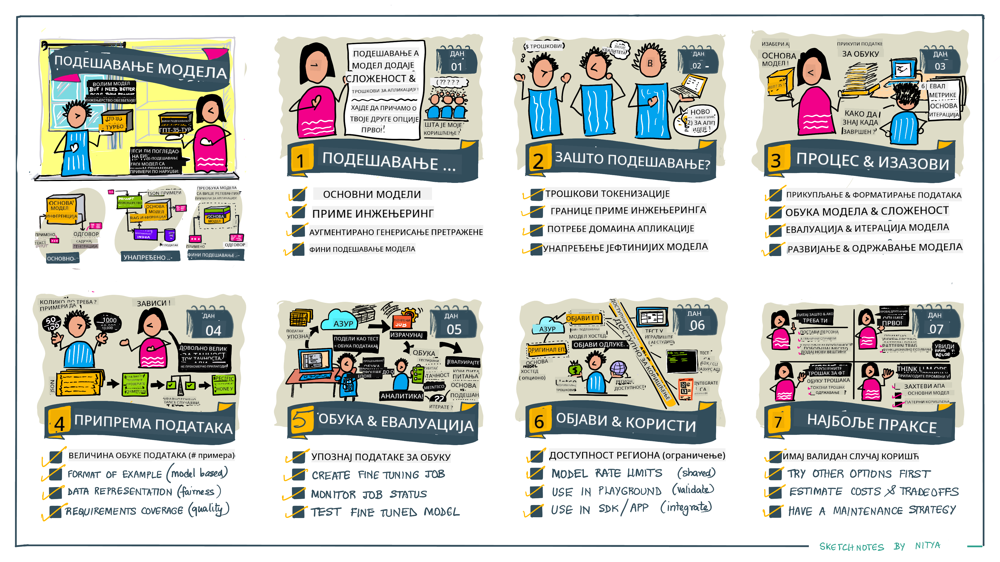

<!--
CO_OP_TRANSLATOR_METADATA:
{
  "original_hash": "68664f7e754a892ae1d8d5e2b7bd2081",
  "translation_date": "2025-05-20T08:22:12+00:00",
  "source_file": "18-fine-tuning/README.md",
  "language_code": "sr"
}
-->

# Fino podešavanje vašeg LLM-a

Korišćenje velikih jezičkih modela za izgradnju generativnih AI aplikacija dolazi sa novim izazovima. Ključno pitanje je osiguranje kvaliteta odgovora (tačnost i relevantnost) u sadržaju koji model generiše za dati korisnički zahtev. U prethodnim lekcijama smo diskutovali o tehnikama kao što su inženjering upita i generacija uz obogaćivanje podacima, koje pokušavaju da reše problem _modifikovanjem ulaznog upita_ postojećem modelu.

U današnjoj lekciji, diskutujemo o trećoj tehnici, **fino podešavanje**, koja pokušava da reši izazov _preobučavanjem samog modela_ dodatnim podacima. Hajde da se udubimo u detalje.

## Ciljevi učenja

Ova lekcija uvodi koncept finog podešavanja za unapred obučene jezičke modele, istražuje prednosti i izazove ovog pristupa i pruža smernice o tome kada i kako koristiti fino podešavanje da poboljšate performanse vaših generativnih AI modela.

Na kraju ove lekcije, trebalo bi da možete odgovoriti na sledeća pitanja:

- Šta je fino podešavanje za jezičke modele?
- Kada i zašto je fino podešavanje korisno?
- Kako mogu fino podesiti unapred obučeni model?
- Koja su ograničenja finog podešavanja?

Spremni? Hajde da počnemo.

## Ilustrovani vodič

Želite da dobijete celokupnu sliku onoga što ćemo pokriti pre nego što se udubimo? Pogledajte ovaj ilustrovani vodič koji opisuje put učenja za ovu lekciju - od učenja osnovnih koncepata i motivacije za fino podešavanje, do razumevanja procesa i najboljih praksi za izvršenje zadatka finog podešavanja. Ovo je fascinantna tema za istraživanje, pa ne zaboravite da pogledate stranicu [Resursi](./RESOURCES.md?WT.mc_id=academic-105485-koreyst) za dodatne linkove koji će podržati vaše samostalno učenje!

## Šta je fino podešavanje za jezičke modele?

Po definiciji, veliki jezički modeli su _unapred obučeni_ na velikim količinama teksta prikupljenog iz raznih izvora, uključujući internet. Kao što smo naučili u prethodnim lekcijama, potrebne su nam tehnike kao što su _inženjering upita_ i _generacija uz obogaćivanje podacima_ da bismo poboljšali kvalitet odgovora modela na korisnička pitanja ("upite").

Popularna tehnika inženjeringa upita uključuje davanje modelu više smernica o tome šta se očekuje u odgovoru bilo pružanjem _instrukcija_ (eksplicitne smernice) ili _davanjem nekoliko primera_ (implicitne smernice). Ovo se naziva _učenje sa nekoliko primera_, ali ima dva ograničenja:

- Ograničenja tokena modela mogu ograničiti broj primera koje možete dati i smanjiti efikasnost.
- Troškovi tokena modela mogu učiniti skupo dodavanje primera svakom upitu i ograničiti fleksibilnost.

Fino podešavanje je uobičajena praksa u sistemima mašinskog učenja gde uzimamo unapred obučeni model i ponovo ga obučavamo sa novim podacima kako bismo poboljšali njegovu performansu na određenom zadatku. U kontekstu jezičkih modela, možemo fino podesiti unapred obučeni model _sa pažljivo odabranim skupom primera za dati zadatak ili aplikacionu oblast_ kako bismo kreirali **prilagođeni model** koji može biti precizniji i relevantniji za taj specifični zadatak ili oblast. Sporedna korist finog podešavanja je da može smanjiti broj primera potrebnih za učenje sa nekoliko primera - smanjujući upotrebu tokena i povezane troškove.

## Kada i zašto treba fino podešavati modele?

U _ovom_ kontekstu, kada govorimo o finom podešavanju, mislimo na **supervizirano** fino podešavanje gde se preobuka vrši dodavanjem **novih podataka** koji nisu bili deo originalnog skupa podataka za obuku. Ovo je drugačije od pristupa nesupervizovanog finog podešavanja gde se model ponovo obučava na originalnim podacima, ali sa različitim hiperparametrima.

Ključna stvar koju treba zapamtiti je da je fino podešavanje napredna tehnika koja zahteva određeni nivo stručnosti da bi se postigli željeni rezultati. Ako se ne uradi pravilno, možda neće pružiti očekivana poboljšanja, pa čak može i degradirati performanse modela za vašu ciljanu oblast.

Dakle, pre nego što naučite "kako" fino podešavati jezičke modele, morate znati "zašto" biste krenuli tim putem i "kada" započeti proces finog podešavanja. Počnite tako što ćete sebi postaviti ova pitanja:

- **Upotreba**: Koji je vaš _slučaj upotrebe_ za fino podešavanje? Koji aspekt trenutnog unapred obučenog modela želite da poboljšate?
- **Alternative**: Da li ste probali _druge tehnike_ da postignete željene rezultate? Koristite ih da kreirate osnovu za poređenje.
  - Inženjering upita: Pokušajte tehnike kao što su učenje sa nekoliko primera sa primerima relevantnih odgovora na upite. Procijenite kvalitet odgovora.
  - Generacija uz obogaćivanje podacima: Pokušajte obogatiti upite rezultatima pretrage vaših podataka. Procijenite kvalitet odgovora.
- **Troškovi**: Da li ste identifikovali troškove za fino podešavanje?
  - Prilagodljivost - da li je unapred obučeni model dostupan za fino podešavanje?
  - Napor - za pripremu podataka za obuku, evaluaciju i poboljšanje modela.
  - Računanje - za izvođenje poslova finog podešavanja i implementaciju fino podešenog modela.
  - Podaci - pristup dovoljnim kvalitetnim primerima za uticaj finog podešavanja.
- **Prednosti**: Da li ste potvrdili prednosti finog podešavanja?
  - Kvalitet - da li je fino podešeni model nadmašio osnovni model?
  - Trošak - da li smanjuje upotrebu tokena pojednostavljivanjem upita?
  - Proširivost - možete li prilagoditi osnovni model za nove oblasti?

Odgovarajući na ova pitanja, trebalo bi da budete u mogućnosti da odlučite da li je fino podešavanje pravi pristup za vaš slučaj upotrebe. Idealno, pristup je validan samo ako prednosti nadmašuju troškove. Kada odlučite da nastavite, vreme je da razmislite o tome _kako_ možete fino podesiti unapred obučeni model.

Želite više uvida u proces donošenja odluka? Pogledajte [Da li fino podešavati ili ne fino podešavati](https://www.youtube.com/watch?v=0Jo-z-MFxJs)

## Kako možemo fino podesiti unapred obučeni model?

Da biste fino podesili unapred obučeni model, potrebno je da imate:

- unapred obučeni model za fino podešavanje
- skup podataka za korišćenje u finom podešavanju
- okruženje za obuku za pokretanje posla finog podešavanja
- okruženje za hosting za implementaciju fino podešenog modela

## Fino podešavanje u praksi

Sledeći resursi pružaju uputstva korak po korak koja vas vode kroz stvarni primer korišćenja odabranog modela sa pažljivo odabranim skupom podataka. Da biste prošli kroz ova uputstva, potrebno vam je nalog kod određenog provajdera, zajedno sa pristupom relevantnom modelu i skupovima podataka.

| Provajder    | Uputstvo                                                                                                                                                                       | Opis                                                                                                                                                                                                                                                                                                                                                                                                                                |
| ------------ | ------------------------------------------------------------------------------------------------------------------------------------------------------------------------------ | ---------------------------------------------------------------------------------------------------------------------------------------------------------------------------------------------------------------------------------------------------------------------------------------------------------------------------------------------------------------------------------------------------------------------------------- |
| OpenAI       | [Kako fino podesiti modele za ćaskanje](https://github.com/openai/openai-cookbook/blob/main/examples/How_to_finetune_chat_models.ipynb?WT.mc_id=academic-105485-koreyst)       | Naučite kako fino podesiti `gpt-35-turbo` za specifičnu oblast ("asistent za recepte") pripremom podataka za obuku, pokretanjem posla finog podešavanja i korišćenjem fino podešenog modela za izvođenje.                                                                                                                                                                                                                          |
| Azure OpenAI | [GPT 3.5 Turbo uputstvo za fino podešavanje](https://learn.microsoft.com/azure/ai-services/openai/tutorials/fine-tune?tabs=python-new%2Ccommand-line?WT.mc_id=academic-105485-koreyst) | Naučite kako fino podesiti `gpt-35-turbo-0613` model **na Azure** preduzimanjem koraka za kreiranje i otpremanje podataka za obuku, pokretanje posla finog podešavanja. Implementirajte i koristite novi model.                                                                                                                                                                                                                       |
| Hugging Face | [Fino podešavanje LLM-ova sa Hugging Face](https://www.philschmid.de/fine-tune-llms-in-2024-with-trl?WT.mc_id=academic-105485-koreyst)                                         | Ovaj blog post vas vodi kroz fino podešavanje _otvorenog LLM-a_ (npr. `CodeLlama 7B`) koristeći biblioteku [transformers](https://huggingface.co/docs/transformers/index?WT.mc_id=academic-105485-koreyst) i [Reinforcement Learning za transformere (TRL)](https://huggingface.co/docs/trl/index?WT.mc_id=academic-105485-koreyst]) sa otvorenim [skupovima podataka](https://huggingface.co/docs/datasets/index?WT.mc_id=academic-105485-koreyst) na Hugging Face. |
|              |                                                                                                                                                                                |                                                                                                                                                                                                                                                                                                                                                                                                                                    |
| 🤗 AutoTrain | [Fino podešavanje LLM-ova sa AutoTrain](https://github.com/huggingface/autotrain-advanced/?WT.mc_id=academic-105485-koreyst)                                                   | AutoTrain (ili AutoTrain Advanced) je python biblioteka koju je razvio Hugging Face i omogućava fino podešavanje za mnoge različite zadatke, uključujući fino podešavanje LLM-ova. AutoTrain je rešenje bez koda i fino podešavanje se može obaviti u vašem oblaku, na Hugging Face Spaces ili lokalno. Podržava i web-bazirani GUI, CLI i obuku putem yaml konfiguracionih datoteka.                                                   |
|              |                                                                                                                                                                                |                                                                                                                                                                                                                                                                                                                                                                                                                                    |

## Zadatak

Izaberite jedno od gore navedenih uputstava i prođite kroz njega. _Možda ćemo replicirati verziju ovih uputstava u Jupyter beležnicama u ovom repo-u samo za referencu. Molimo koristite originalne izvore direktno da biste dobili najnovije verzije_.

## Odličan posao! Nastavite sa učenjem.

Nakon što završite ovu lekciju, pogledajte našu [Kolekciju učenja o generativnoj AI](https://aka.ms/genai-collection?WT.mc_id=academic-105485-koreyst) da nastavite sa unapređivanjem vašeg znanja o generativnoj AI!

Čestitamo!! Završili ste poslednju lekciju iz v2 serije za ovaj kurs! Nemojte prestati sa učenjem i izgradnjom. **Pogledajte [RESURSI](RESOURCES.md?WT.mc_id=academic-105485-koreyst) stranicu za listu dodatnih predloga samo za ovu temu.

Naša v1 serija lekcija je takođe ažurirana sa više zadataka i koncepata. Zato odvojite minut da osvežite svoje znanje - i molimo vas da [podelite svoja pitanja i povratne informacije](https://github.com/microsoft/generative-ai-for-beginners/issues?WT.mc_id=academic-105485-koreyst) kako bismo poboljšali ove lekcije za zajednicu.

**Одричење од одговорности**:  
Овај документ је преведен коришћењем AI услуге за превођење [Co-op Translator](https://github.com/Azure/co-op-translator). Иако се трудимо да постигнемо тачност, молимо вас да будете свесни да аутоматизовани преводи могу садржати грешке или нетачности. Оригинални документ на његовом изворном језику треба сматрати ауторитативним извором. За критичне информације, препоручује се професионални људски превод. Не сносимо одговорност за било какве неспоразуме или погрешна тумачења која произилазе из употребе овог превода.