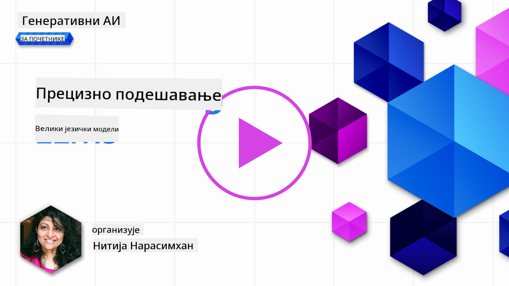
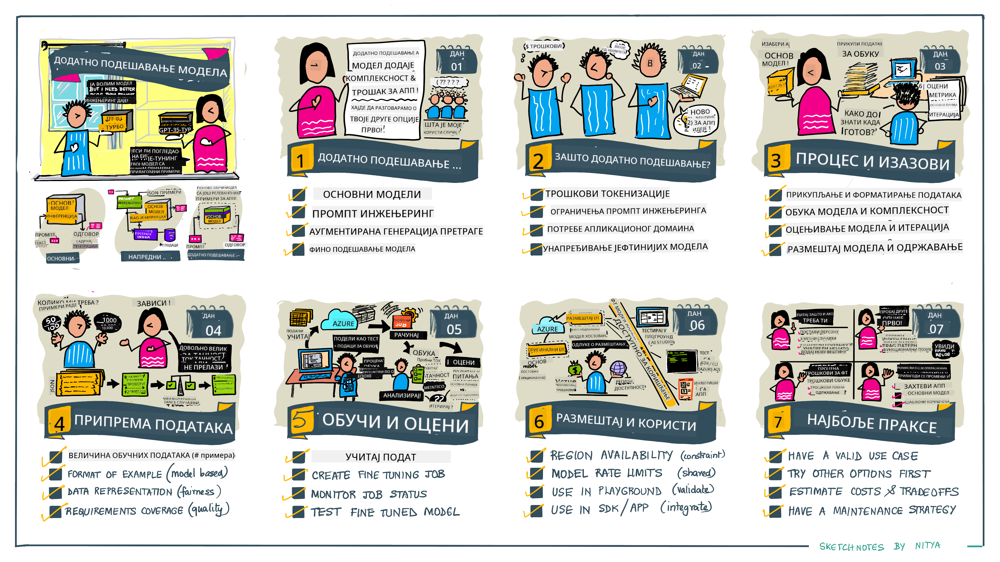

<!--
CO_OP_TRANSLATOR_METADATA:
{
  "original_hash": "68664f7e754a892ae1d8d5e2b7bd2081",
  "translation_date": "2025-07-09T17:50:25+00:00",
  "source_file": "18-fine-tuning/README.md",
  "language_code": "sr"
}
-->

# Фино подешавање вашег LLM-а

Коришћење великих језичких модела за изградњу генеративних AI апликација доноси нове изазове. Кључно питање је обезбеђивање квалитета одговора (тачности и релевантности) у садржају који модел генерише за дати кориснички захтев. У претходним лекцијама смо говорили о техникама као што су инжењеринг упита и генерација уз подршку претраге, које покушавају да реше проблем _модификовањем улаза упита_ за постојећи модел.

У данашњој лекцији ћемо разговарати о трећој техници, **фино подешавање**, која покушава да реши изазов _поновним обучавањем самог модела_ уз додатне податке. Хајде да заронимо у детаље.

## Циљеви учења

Ова лекција уводи појам фино подешавања за претходно обучене језичке моделе, истражује предности и изазове овог приступа и пружа смернице када и како користити фино подешавање за побољшање перформанси ваших генеративних AI модела.

На крају ове лекције требало би да можете да одговорите на следећа питања:

- Шта је фино подешавање језичких модела?
- Када и зашто је фино подешавање корисно?
- Како могу да фино подесим претходно обучени модел?
- Која су ограничења фино подешавања?

Спремни? Хајде да почнемо.

## Илустровани водич

Желите да добијете ширу слику о ономе што ћемо обрадити пре него што уђемо у детаље? Погледајте овај илустровани водич који описује пут учења за ову лекцију – од упознавања са основним концептима и мотивацијом за фино подешавање, до разумевања процеса и најбољих пракси за извођење задатка фино подешавања. Ово је фасцинантна тема за истраживање, па не заборавите да посетите страницу [Ресурси](./RESOURCES.md?WT.mc_id=academic-105485-koreyst) за додатне линкове који ће вам помоћи у самосталном учењу!

## Шта је фино подешавање језичких модела?

По дефиницији, велики језички модели су _претходно обучени_ на великим количинама текста из различитих извора, укључујући интернет. Као што смо научили у претходним лекцијама, потребне су нам технике као што су _инжењеринг упита_ и _генерација уз подршку претраге_ да бисмо побољшали квалитет одговора модела на корисничке упите („промптове“).

Једна популарна техника инжењеринга упита подразумева давање модулу више смерница о томе шта се очекује у одговору, било кроз _упутства_ (јасне смернице) или _нудећи неколико примера_ (нејасне смернице). Ово се назива _учење са неколико примера_ (few-shot learning), али има два ограничења:

- Ограничења у броју токена модела могу ограничити број примера које можете дати и смањити ефикасност.
- Трошкови токена могу учинити скупим додавање примера у сваки упит и ограничити флексибилност.

Фино подешавање је уобичајена пракса у системима машинског учења где узимамо претходно обучени модел и поново га обучавамо са новим подацима како бисмо побољшали његове перформансе на одређеном задатку. У контексту језичких модела, можемо фино подесити претходно обучени модел _са одабраним скупом примера за одређени задатак или домен примене_ како бисмо креирали **прилагођени модел** који може бити прецизнији и релевантнији за тај конкретан задатак или домен. Додатна предност фино подешавања је што може смањити број примера потребних за учење са неколико примера – смањујући употребу токена и повезане трошкове.

## Када и зашто треба да фино подешавамо моделе?

У _овом_ контексту, када говоримо о фино подешавању, мислимо на **надгледано** фино подешавање где се поновна обука врши **додавањем нових података** који нису били део оригиналног скупа за обуку. Ово се разликује од ненадгледаног фино подешавања где се модел поново обучава на оригиналним подацима, али са другачијим хиперпараметрима.

Кључно је запамтити да је фино подешавање напредна техника која захтева одређени ниво стручности да би се постигли жељени резултати. Ако се изведе неправилно, можда неће донети очекивана побољшања, па чак може и погоршати перформансе модела за ваш циљани домен.

Зато, пре него што научите „како“ да фино подесите језичке моделе, морате знати „зашто“ треба да кренете тим путем и „када“ да започнете процес фино подешавања. Почните тако што ћете себи поставити ова питања:

- **Случај употребе**: Који је ваш _случај употребе_ за фино подешавање? Који аспект тренутног претходно обученог модела желите да побољшате?
- **Алтернативе**: Да ли сте пробали _друге технике_ да постигнете жељене резултате? Користите их да направите основну меру за поређење.
  - Инжењеринг упита: Испробајте технике као што је few-shot prompting са примерима релевантних одговора. Процените квалитет одговора.
  - Генерација уз подршку претраге: Испробајте допуну упита резултатима претраге ваших података. Процените квалитет одговора.
- **Трошкови**: Да ли сте идентификовали трошкове фино подешавања?
  - Могућност подешавања – да ли је претходно обучени модел доступан за фино подешавање?
  - Напор – за припрему података за обуку, процену и усавршавање модела.
  - Рачунарски ресурси – за покретање послова фино подешавања и постављање фино подешеног модела.
  - Подаци – приступ довољно квалитетним примерима за ефекат фино подешавања.
- **Предности**: Да ли сте потврдили предности фино подешавања?
  - Квалитет – да ли је фино подешени модел надмашио основни модел?
  - Трошкови – да ли смањује употребу токена поједностављујући упите?
  - Проширивост – да ли можете поново користити основни модел за нове домене?

Одговарајући на ова питања, требало би да будете у могућности да одлучите да ли је фино подешавање прави приступ за ваш случај употребе. Идеално, приступ је оправдан само ако предности превазилазе трошкове. Када одлучите да наставите, време је да размислите о томе _како_ можете фино подесити претходно обучени модел.

Желите више увида у процес доношења одлука? Погледајте [To fine-tune or not to fine-tune](https://www.youtube.com/watch?v=0Jo-z-MFxJs)

## Како можемо фино подесити претходно обучени модел?

Да бисте фино подесили претходно обучени модел, потребно је да имате:

- претходно обучени модел за фино подешавање
- скуп података за фино подешавање
- окружење за обуку у коме ћете покренути посао фино подешавања
- окружење за хостовање у коме ћете поставити фино подешени модел

## Фино подешавање у пракси

Следећи ресурси пружају корак-по-корак туторијале који вас воде кроз реалан пример коришћења изабраног модела са одабраним скупом података. Да бисте радили по овим туторијалима, потребан вам је налог код одређеног провајдера, као и приступ релевантним моделима и скуповима података.

| Провајдер     | Туторијал                                                                                                                                                                       | Опис                                                                                                                                                                                                                                                                                                                                                                                                                              |
| ------------- | ------------------------------------------------------------------------------------------------------------------------------------------------------------------------------ | -------------------------------------------------------------------------------------------------------------------------------------------------------------------------------------------------------------------------------------------------------------------------------------------------------------------------------------------------------------------------------------------------------------------------------- |
| OpenAI        | [How to fine-tune chat models](https://github.com/openai/openai-cookbook/blob/main/examples/How_to_finetune_chat_models.ipynb?WT.mc_id=academic-105485-koreyst)                | Научите како да фино подесите `gpt-35-turbo` за одређени домен („асистент за рецепте“) припремајући податке за обуку, покрећући посао фино подешавања и користећи фино подешени модел за предвиђање.                                                                                                                                                                                                                              |
| Azure OpenAI  | [GPT 3.5 Turbo fine-tuning tutorial](https://learn.microsoft.com/azure/ai-services/openai/tutorials/fine-tune?tabs=python-new%2Ccommand-line?WT.mc_id=academic-105485-koreyst) | Научите како да фино подесите модел `gpt-35-turbo-0613` **на Azure** кроз кораке креирања и отпремања података за обуку, покретања посла фино подешавања, као и постављања и коришћења новог модела.                                                                                                                                                                                                                              |
| Hugging Face  | [Fine-tuning LLMs with Hugging Face](https://www.philschmid.de/fine-tune-llms-in-2024-with-trl?WT.mc_id=academic-105485-koreyst)                                               | Овај блог пост вас води кроз фино подешавање _отвореног LLM-а_ (нпр. `CodeLlama 7B`) користећи библиотеку [transformers](https://huggingface.co/docs/transformers/index?WT.mc_id=academic-105485-koreyst) и [Transformer Reinforcement Learning (TRL)](https://huggingface.co/docs/trl/index?WT.mc_id=academic-105485-koreyst) са отвореним [скуповима података](https://huggingface.co/docs/datasets/index?WT.mc_id=academic-105485-koreyst) на Hugging Face. |
|               |                                                                                                                                                                                |                                                                                                                                                                                                                                                                                                                                                                                                                                  |
| 🤗 AutoTrain  | [Fine-tuning LLMs with AutoTrain](https://github.com/huggingface/autotrain-advanced/?WT.mc_id=academic-105485-koreyst)                                                         | AutoTrain (или AutoTrain Advanced) је Python библиотека коју је развио Hugging Face, а која омогућава фино подешавање за многе различите задатке укључујући и фино подешавање LLM-а. AutoTrain је решење без кода и фино подешавање се може обавити у вашем облаку, на Hugging Face Spaces или локално. Подржава веб интерфејс, CLI и обуку преко yaml конфигурационих фајлова.                                                                                 |
|               |                                                                                                                                                                                |                                                                                                                                                                                                                                                                                                                                                                                                                                  |

## Задатак

Изаберите један од горе наведених туторијала и прођите кроз њега. _Можда ћемо направити верзију ових туторијала у Jupyter Notebook-овима у овом репозиторијуму само за референцу. Молимо вас да користите оригиналне изворе директно како бисте добили најновије верзије_.

## Одличан посао! Наставите са учењем.

Након што завршите ову лекцију, погледајте нашу [колекцију за учење генеративног AI](https://aka.ms/genai-collection?WT.mc_id=academic-105485-koreyst) да бисте наставили да унапређујете своје знање о генеративном AI-у!

Честитамо!! Завршили сте последњу лекцију из v2 серије овог курса! Немојте престати да учите и градите. \*\*Погледајте страницу [РЕСУРСИ](RESOURCES.md?WT.mc_id=academic-105485-koreyst) за листу додатних предлога управо за ову тему.

Наша v1 серија лекција такође је ажурирана са више задатака и концепата. Одвојите минут да освежите своје знање – и молимо вас да [поделите своја питања и повратне информације](https://github.com/microsoft/generative-ai-for-beginners/issues?WT.mc_id=academic-105485-koreyst) како бисмо побољшали ове лекције за заједницу.

**Одрицање од одговорности**:  
Овај документ је преведен коришћењем AI сервиса за превођење [Co-op Translator](https://github.com/Azure/co-op-translator). Иако тежимо прецизности, молимо вас да имате у виду да аутоматски преводи могу садржати грешке или нетачности. Оригинални документ на његовом изворном језику треба сматрати ауторитетним извором. За критичне информације препоручује се професионални људски превод. Нисмо одговорни за било каква неспоразума или погрешна тумачења која произилазе из коришћења овог превода.