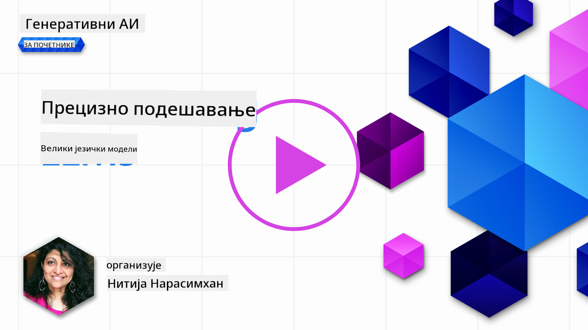
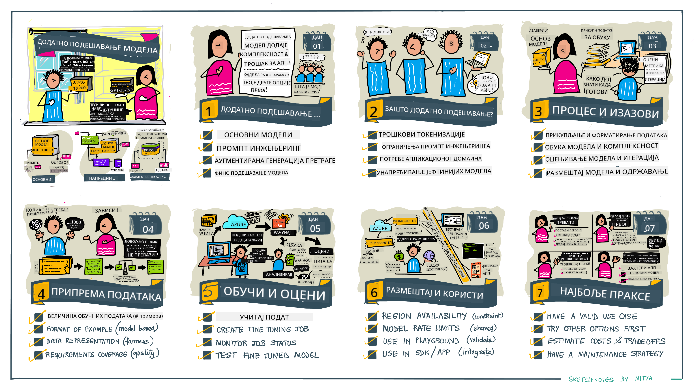

<!--
CO_OP_TRANSLATOR_METADATA:
{
  "original_hash": "68664f7e754a892ae1d8d5e2b7bd2081",
  "translation_date": "2025-06-26T00:52:42+00:00",
  "source_file": "18-fine-tuning/README.md",
  "language_code": "sr"
}
-->

# Фино подешавање вашег LLM

Коришћење великих језичких модела за изградњу апликација генеративне вештачке интелигенције доноси нове изазове. Кључни проблем је обезбеђивање квалитета одговора (тачност и релевантност) у садржају који модел генерише за дати захтев корисника. У претходним лекцијама, разговарали смо о техникама као што су инжењеринг упита и генерисање са побољшаним приступом информацијама које покушавају да реше проблем _модификацијом улазног упита_ постојећем моделу.

У данашњој лекцији, разговарамо о трећој техници, **фино подешавање**, која покушава да реши изазов _поновним обучавањем самог модела_ са додатним подацима. Хајде да се упустимо у детаље.

## Циљеви учења

Ова лекција уводи концепт финог подешавања за претходно обучене језичке моделе, истражује предности и изазове овог приступа и пружа смернице о томе када и како користити фино подешавање да бисте побољшали перформансе ваших генеративних AI модела.

На крају ове лекције, требало би да будете у стању да одговорите на следећа питања:

- Шта је фино подешавање за језичке моделе?
- Када и зашто је фино подешавање корисно?
- Како могу фино подесити претходно обучен модел?
- Која су ограничења финог подешавања?

Спремни? Хајде да почнемо.

## Илустровани водич

Желите да добијете општу слику о томе шта ћемо покрити пре него што се упустимо у детаље? Погледајте овај илустровани водич који описује пут учења за ову лекцију - од учења основних концепата и мотивације за фино подешавање, до разумевања процеса и најбољих пракси за извршење задатка финог подешавања. Ово је фасцинантна тема за истраживање, зато не заборавите да погледате страницу [Ресурси](./RESOURCES.md?WT.mc_id=academic-105485-koreyst) за додатне линкове који подржавају ваше самостално учење!

## Шта је фино подешавање за језичке моделе?

По дефиницији, велики језички модели су _предходно обучени_ на великим количинама текста добијеног из различитих извора, укључујући интернет. Као што смо научили у претходним лекцијама, потребне су нам технике као што су _инжењеринг упита_ и _генерисање са побољшаним приступом информацијама_ да побољшамо квалитет одговора модела на питања корисника ("упите").

Популарна техника инжењеринга упита укључује давање модела више смерница о томе шта се очекује у одговору било пружањем _инструкција_ (експлицитно вођење) или _давањем неколико примера_ (имплицитно вођење). Ово се назива _учење са неколико примера_ али има два ограничења:

- Ограничења токена модела могу ограничити број примера које можете дати и ограничити ефикасност.
- Трошкови токена модела могу учинити скупо додавање примера сваком упиту и ограничити флексибилност.

Фино подешавање је уобичајена пракса у системима машинског учења где узимамо претходно обучен модел и поново га обучавамо са новим подацима да побољшамо његове перформансе на одређеном задатку. У контексту језичких модела, можемо фино подесити претходно обучен модел _са пажљиво одабраним сетом примера за дати задатак или домен апликације_ да бисмо креирали **прилагођен модел** који може бити тачнији и релевантнији за тај специфичан задатак или домен. Споредна корист финог подешавања је да може смањити број потребних примера за учење са неколико примера - смањујући употребу токена и повезане трошкове.

## Када и зашто треба да фино подешавамо моделе?

У _овом_ контексту, када говоримо о фином подешавању, мислимо на **надгледано** фино подешавање где се поновно обучавање врши **додавањем нових података** који нису били део оригиналног скупа података за обуку. Ово је различито од приступа ненадгледаног финог подешавања где се модел поново обучава на оригиналним подацима, али са различитим хиперпараметрима.

Кључна ствар коју треба запамтити је да је фино подешавање напредна техника која захтева одређени ниво стручности да би се добили жељени резултати. Ако се уради неправилно, можда неће пружити очекивана побољшања, па чак може и деградирати перформансе модела за ваш циљани домен.

Дакле, пре него што научите "како" фино подесити језичке моделе, потребно је да знате "зашто" треба да кренете овим путем и "када" да започнете процес финог подешавања. Почните тако што ћете себи поставити ова питања:

- **Случај употребе**: Шта је ваш _случај употребе_ за фино подешавање? Који аспект тренутног претходно обученог модела желите да побољшате?
- **Алтернативе**: Да ли сте пробали _друге технике_ да постигнете жељене резултате? Користите их да креирате основу за поређење.
  - Инжењеринг упита: Пробајте технике као што је упит са неколико примера са примерима релевантних одговора на упите. Процените квалитет одговора.
  - Генерисање са побољшаним приступом информацијама: Пробајте да побољшате упите са резултатима претраге добијеним претраживањем ваших података. Процените квалитет одговора.
- **Трошкови**: Да ли сте идентификовали трошкове за фино подешавање?
  - Подесивост - да ли је претходно обучен модел доступан за фино подешавање?
  - Напор - за припрему података за обуку, процену и усавршавање модела.
  - Рачунање - за покретање послова финог подешавања и примену фино подешеног модела
  - Подаци - приступ довољно квалитетним примерима за утицај финог подешавања
- **Предности**: Да ли сте потврдили предности финог подешавања?
  - Квалитет - да ли је фино подешен модел надмашио основу?
  - Трошкови - да ли смањује употребу токена поједностављивањем упита?
  - Проширивост - можете ли поново користити основни модел за нове домене?

Одговарањем на ова питања, требало би да будете у стању да одлучите да ли је фино подешавање прави приступ за ваш случај употребе. Идеално, приступ је валидан само ако предности надмашују трошкове. Када одлучите да наставите, време је да размислите о _како_ можете фино подесити претходно обучен модел.

Желите да добијете више увида у процес доношења одлука? Погледајте [Фино подешавање или не фино подешавање](https://www.youtube.com/watch?v=0Jo-z-MFxJs)

## Како можемо фино подесити претходно обучен модел?

Да бисте фино подесили претходно обучен модел, потребно је да имате:

- претходно обучен модел за фино подешавање
- скуп података за коришћење у фином подешавању
- окружење за обуку за покретање посла финог подешавања
- окружење за хостовање за примену фино подешеног модела

## Фино подешавање у пракси

Следећи ресурси пружају корак-по-корак туторијале да вас проведу кроз прави пример коришћењем одабраног модела са пажљиво одабраним скупом података. Да бисте прошли кроз ове туторијале, потребан вам је налог на одређеном провајдеру, заједно са приступом релевантним моделима и скуповима података.

| Провајдер    | Туторијал                                                                                                                                                                       | Опис                                                                                                                                                                                                                                                                                                                                                                                                                                 |
| ------------ | ------------------------------------------------------------------------------------------------------------------------------------------------------------------------------- | ------------------------------------------------------------------------------------------------------------------------------------------------------------------------------------------------------------------------------------------------------------------------------------------------------------------------------------------------------------------------------------------------------------------------------------ |
| OpenAI       | [Како фино подесити моделе за ћаскање](https://github.com/openai/openai-cookbook/blob/main/examples/How_to_finetune_chat_models.ipynb?WT.mc_id=academic-105485-koreyst)          | Научите како да фино подесите `gpt-35-turbo` за одређени домен ("асистент за рецепте") припремом података за обуку, покретањем посла финог подешавања и коришћењем фино подешеног модела за закључивање.                                                                                                                                                                                                                               |
| Azure OpenAI | [GPT 3.5 Turbo туторијал за фино подешавање](https://learn.microsoft.com/azure/ai-services/openai/tutorials/fine-tune?tabs=python-new%2Ccommand-line?WT.mc_id=academic-105485-koreyst) | Научите како да фино подесите `gpt-35-turbo-0613` модел **на Azure** предузимањем корака за креирање и отпремање података за обуку, покретање посла финог подешавања. Примените и користите нови модел.                                                                                                                                                                                                                                   |
| Hugging Face | [Фино подешавање LLM-ова са Hugging Face](https://www.philschmid.de/fine-tune-llms-in-2024-with-trl?WT.mc_id=academic-105485-koreyst)                                           | Овај блог пост вас води кроз фино подешавање _отвореног LLM-а_ (нпр. `CodeLlama 7B`) користећи библиотеку [transformers](https://huggingface.co/docs/transformers/index?WT.mc_id=academic-105485-koreyst) и [појачање учења трансформера (TRL)](https://huggingface.co/docs/trl/index?WT.mc_id=academic-105485-koreyst]) са отвореним [скуповима података](https://huggingface.co/docs/datasets/index?WT.mc_id=academic-105485-koreyst) на Hugging Face. |
|              |                                                                                                                                                                                 |                                                                                                                                                                                                                                                                                                                                                                                                                                      |
| 🤗 AutoTrain | [Фино подешавање LLM-ова са AutoTrain](https://github.com/huggingface/autotrain-advanced/?WT.mc_id=academic-105485-koreyst)                                                    | AutoTrain (или AutoTrain Advanced) је Python библиотека развијена од стране Hugging Face која омогућава фино подешавање за многе различите задатке, укључујући фино подешавање LLM-ова. AutoTrain је решење без кода и фино подешавање се може обавити у вашем облаку, на Hugging Face Spaces или локално. Подржава и веб-базиран GUI, CLI и обуку преко yaml конфигурационих датотека.                                                    |
|              |                                                                                                                                                                                 |                                                                                                                                                                                                                                                                                                                                                                                                                                      |

## Задатак

Изаберите један од горе наведених туторијала и прођите кроз њих. _Можемо реплицирати верзију ових туторијала у Jupyter Notebooks у овом репозиторијуму само за референцу. Молимо вас да користите оригиналне изворе директно да бисте добили најновије верзије_.

## Одличан рад! Наставите са учењем.

Након завршетка ове лекције, погледајте нашу [колекцију за учење генеративне вештачке интелигенције](https://aka.ms/genai-collection?WT.mc_id=academic-105485-koreyst) да наставите са унапређивањем вашег знања о генеративној вештачкој интелигенцији!

Честитамо!! Завршили сте последњу лекцију из серије v2 за овај курс! Не престајте са учењем и изградњом. \*\*Погледајте страницу [РЕСУРСИ](RESOURCES.md?WT.mc_id=academic-105485-koreyst) за листу додатних предлога само за ову тему.

Наша серија лекција v1 такође је ажурирана са више задатака и концепата. Зато одвојите минут да освежите своје знање - и молимо вас [поделите ваша питања и повратне информације](https://github.com/microsoft/generative-ai-for-beginners/issues?WT.mc_id=academic-105485-koreyst) да нам помогнете да побољшамо ове лекције за заједницу.

**Одрицање од одговорности**:  
Овај документ је преведен коришћењем AI услуге за превођење [Co-op Translator](https://github.com/Azure/co-op-translator). Иако тежимо тачности, молимо вас да будете свесни да аутоматски преводи могу садржати грешке или нетачности. Оригинални документ на његовом изворном језику треба сматрати меродавним извором. За критичне информације, препоручује се професионални људски превод. Не преузимамо одговорност за било какве неспоразуме или погрешна тумачења која могу настати коришћењем овог превода.