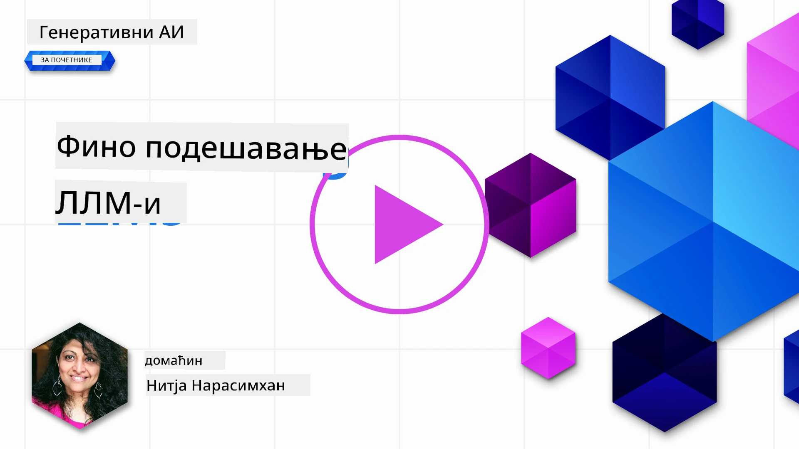
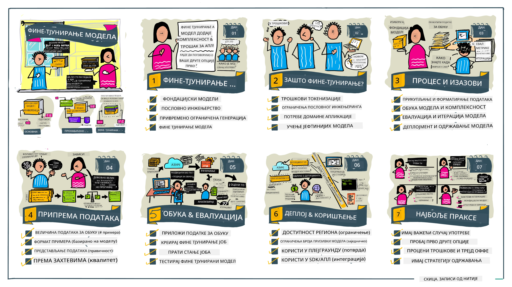

# Фино подешавање вашег LLM

Коришћење великих језичких модела за изградњу генеративних AI апликација доноси нове изазове. Кључно питање је обезбеђивање квалитета одговора (тачности и релевантности) у садржају који модел генерише за одређени кориснички захтев. У претходним лекцијама, говорили смо о техникама као што су инжењеринг упита и генерисање уз допуну извлачењем, које покушавају да реше проблем тако што _модификују улазни упит_ постојећег модела.

У данашњој лекцији разговарамо о трећој техници, **фино подешавање**, која покушава да реши изазов путем _претренирања самог модела_ са додатним подацима. Хајде да заронимо у детаље.

## Циљеви учења

Ова лекција уводи појам фино подешавања за унапред обучене језичке моделе, истражује предности и изазове овог приступа и пружа смернице када и како користити фино подешавање за побољшање перформанси ваших генеративних AI модела.

До краја ове лекције требало би да будете у стању да одговорите на следећа питања:

- Шта је фино подешавање језичких модела?
- Када и зашто је фино подешавање корисно?
- Како могу фино подесити унапред обучени модел?
- Која су ограничења фино подешавања?

Спремни? Хајде да почнемо.

## Илустрован водич

Желите ли да добијете општи преглед о ономе што ћемо обрадити пре него што почнемо? Погледајте овај илустровани водич који описује пут учења за ову лекцију - од учења основних појмова и мотивације за фино подешавање, до разумевања процеса и најбољих пракси за извођење задатка фино подешавања. Ово је фасцинантна тема за истраживање, па не заборавите да посетите страницу [Ресурси](./RESOURCES.md?WT.mc_id=academic-105485-koreyst) за додатне линкове који ће подржати ваше самостално учење!

## Шта је фино подешавање језичких модела?

По дефиницији, велики језички модели су _унапред обучени_ на великим количинама текста који су преузети из различитих извора укључујући интернет. Како смо сазнали у претходним лекцијама, потребне су нам технике као што су _инжењеринг упита_ и _генерисање уз допуну извлачењем_ да бисмо побољшали квалитет одговора модела на корисничка питања („упите“).

Популарна техника инжењеринга упита укључује давање више смерница моделу о томе шта се очекује у одговору било пружањем _упутстава_ (експлицитне смернице) или _пружањем неколико примера_ (имплицитне смернице). Ово се назива _учење из мало примера_ али има две ограничења:

- Ограничења броја токена модела могу ограничити број примера које можете дати и утичу на ефикасност.
- Трошкови токена модела могу учинити скупим додавање примера за сваки упит и ограничити флексибилност.

Фино подешавање је уобичајена пракса у системима машинског учења где узимамо унапред обучени модел и поново га обучавамо са новим подацима да бисмо побољшали његове перформансе на одређеном задатку. У контексту језичких модела, можемо фино подесити унапред обучени модел _са курираним скупом примера за одређени задатак или домен примене_ ради креирања **прилагођеног модела** који може бити прецизнији и релевантнији за тај специфични задатак или домен. Спољна корист фино подешавања је да може смањити број примера потребних за учење из мало примера - смањујући употребу токена и повезане трошкове.

## Када и зашто треба да фино подешавамо моделе?

У _овом_ контексту, када говоримо о фино подешавању, мислимо на **супервизовано** фино подешавање где се претренирање врши додавањем **нових података** који нису били део оригиналног скупа за обуку. Ово се разликује од несупервизованог приступа фино подешавања где се модел поново обучава на оригиналним подацима, али са другачијим хиперпараметрима.

Кључно је запамтити да је фино подешавање напредна техника која захтева одређени ниво експертизе да би се постигли жељени резултати. Ако се уради неправилно, можда неће пружити очекивана побољшања, па чак може и смањити перформансе модела за ваш циљани домен.

Зато, пре него што научите "како" да фино подесите језичке моделе, морате знати "зашто" треба да изаберете овај пут и "када" да започнете процес фино подешавања. Почните тако што ћете себи поставити ова питања:

- **Примена**: Која је ваша _примена_ за фино подешавање? Који аспект тренутног унапред обученог модела желите да побољшате?
- **Алтернативе**: Да ли сте пробали _друге технике_ да постигнете жељене резултате? Користите их да направите основну поређења.
  - Инжењеринг упита: Пробајте технике као што је учење из мало примера са примерима релевантних одговора на упите. Оцените квалитет одговора.
  - Генерисање са допуном извлачењем: Пробајте да допуните упите резултатима претраге у вашим подацима. Оцените квалитет одговора.
- **Трошкови**: Да ли сте идентификовали трошкове за фино подешавање?
  - Оптимизованост - да ли је унапред обучени модел доступан за фино подешавање?
  - Напор - за припрему података за тренирање, оцењивање и прецизирање модела.
  - Обрачун - за извођење послова фино подешавања и развоја финог модела.
  - Подаци - приступ довољно квалитетним примерима за ефекат фино подешавања.
- **Предности**: Да ли сте потврдили предности фино подешавања?
  - Квалитет - да ли је фино подешени модел премашио основне резултате?
  - Трошкови - да ли смањује употребу токена поједностављујући упите?
  - Проширивост - да ли можете користити основни модел за нове домене?

Одговарајући на ова питања, требало би да можете да одлучите да ли је фино подешавање прави приступ за вашу примену. Идеално, приступ је важећи само ако предности превазилазе трошкове. Када одлучите да наставите, време је да размислите _како_ можете фино подесити унапред обучени модел.

Желите ли више увида у процес доношења одлука? Погледајте [Фино подесити или не фино подесити](https://www.youtube.com/watch?v=0Jo-z-MFxJs)

## Како можемо фино подесити унапред обучени модел?

Да бисте фино подесили унапред обучени модел, потребно је да имате:

- унапред обучени модел за фино подешавање
- скуп података за фино подешавање
- окружење за обуку за извођење задатка фино подешавања
- окружење за хостовање за развој финог модела

## Фино подешавање у пракси

Следећи ресурси пружају туторијале корак по корак који вас воде кроз реалан пример употребе одабраног модела са курираним скупом података. Да бисте радили кроз ове туторијале, потребан вам је налог код одређеног провајдера, као и приступ релевантним моделима и скуповима података.

| Провајдер     | Туторијал                                                                                                                                                                       | Опис                                                                                                                                                                                                                                                                                                                                                                                                                          |
| ------------ | ------------------------------------------------------------------------------------------------------------------------------------------------------------------------------ | ------------------------------------------------------------------------------------------------------------------------------------------------------------------------------------------------------------------------------------------------------------------------------------------------------------------------------------------------------------------------------------------------------------------------------ |
| OpenAI       | [Како фино подесити chat моделе](https://github.com/openai/openai-cookbook/blob/main/examples/How_to_finetune_chat_models.ipynb?WT.mc_id=academic-105485-koreyst)                | Учите како да фино подесите `gpt-35-turbo` за одређени домен ("асистент за рецепте") припремањем података за обуку, извршавањем посла фино подешавања, и коришћењем финог модела за извођење.                                                                                                                                                                                                                                  |
| Azure OpenAI | [Туторијал за фино подешавање GPT 3.5 Turbo](https://learn.microsoft.com/azure/ai-services/openai/tutorials/fine-tune?tabs=python-new%2Ccommand-line&WT.mc_id=academic-105485-koreyst) | Научите како фино подесити модел `gpt-35-turbo-0613` **на Azure** правећи и отпремајући податке за обуку, покрећући рад за фино подешавање. Развите и користите нови модел.                                                                                                                                                                                                                                                       |
| Hugging Face | [Фино подешавање LLM-ова са Hugging Face](https://www.philschmid.de/fine-tune-llms-in-2024-with-trl?WT.mc_id=academic-105485-koreyst)                                               | Овај блог пост вас води кроз фино подешавање _отвореног LLM-а_ (нпр. `CodeLlama 7B`) коришћењем [transformers](https://huggingface.co/docs/transformers/index?WT.mc_id=academic-105485-koreyst) библиотеке и [Transformer Reinforcement Learning (TRL)](https://huggingface.co/docs/trl/index?WT.mc_id=academic-105485-koreyst) са отвореним [ском података](https://huggingface.co/docs/datasets/index?WT.mc_id=academic-105485-koreyst) на Hugging Face. |
|              |                                                                                                                                                                                |                                                                                                                                                                                                                                                                                                                                                                                                                              |
| 🤗 AutoTrain | [Фино подешавање LLM-ова са AutoTrain](https://github.com/huggingface/autotrain-advanced/?WT.mc_id=academic-105485-koreyst)                                                         | AutoTrain (или AutoTrain Advanced) је Python библиотека коју је развио Hugging Face и која омогућава фино подешавање за бројне различите задатке укључујући и LLM фино подешавање. AutoTrain је решење без кодирања и може се изводити у вашем облаку, на Hugging Face Spaces или локално. Подржава веб-графички интерфејс, CLI и обуку преко yaml конфигурационих фајлова.                                                                               |
|              |                                                                                                                                                                                |                                                                                                                                                                                                                                                                                                                                                                                                                              |
| 🦥 Unsloth | [Фино подешавање LLM-ова са Unsloth](https://github.com/unslothai/unsloth)                                                         | Unsloth је отворени фрејмворк који подржава фино подешавање LLM-ова и учење појачањем (RL). Unsloth олакшава локалну обуку, процену и развој помоћу готових [notebooks](https://github.com/unslothai/notebooks). Такође подржава текст-тo-глас (TTS), BERT и мултимодалне моделе. За почетак, прочитајте њихов корак-по-корак [Водич за фино подешавање LLM-ова](https://docs.unsloth.ai/get-started/fine-tuning-llms-guide).                                                                          |
|              |                                                                                                                                                                                |                                                                                                                                                                                                                                                                                                                                                                                                                              |
## Задатак

Изаберите један од горе наведених туторијала и прођите га корак по корак. _Можда ћемо реплицирати верзију ових туторијала у Jupyter Notebooks у овом репозиторијуму само за референцу. Молимо користите оригиналне изворе директно за најновије верзије_.

## Одличан посао! Наставите са учењем.

Након завршетка ове лекције, проверите нашу [колекцију за учење генеративног AI](https://aka.ms/genai-collection?WT.mc_id=academic-105485-koreyst) да бисте наставили са усавршавањем знања о генеративном AI!

Честитамо!! Завршили сте последњу лекцију из серијала v2 овог курса! Немојте престати са учењем и развојем. \*\*Погледајте страницу [РЕСУРСИ](RESOURCES.md?WT.mc_id=academic-105485-koreyst) за листу додатних препорука управо за ову тему.

Наш серијал лекција v1 је такође ажуриран са више задатака и појмова. Узмите минут да освежите своје знање - и молимо вас [поделите своја питања и повратне информације](https://github.com/microsoft/generative-ai-for-beginners/issues?WT.mc_id=academic-105485-koreyst) како бисмо побољшали овај материјал за заједницу.

---

<!-- CO-OP TRANSLATOR DISCLAIMER START -->
**Одрицање од одговорности**:
Овај документ је преведен коришћењем услуге аутоматског превођења [Co-op Translator](https://github.com/Azure/co-op-translator). Иако тежимо прецизности, молимо вас да имате у виду да аутоматски преводи могу садржати грешке или нетачности. Оригинални документ на његовом изворном језику треба сматрати ауторитетом. За критичне информације препоручује се професионални људски превод. Не сносимо одговорност за било какве неспоразуме или погрешне интерпретације проистекле из коришћења овог превода.
<!-- CO-OP TRANSLATOR DISCLAIMER END -->