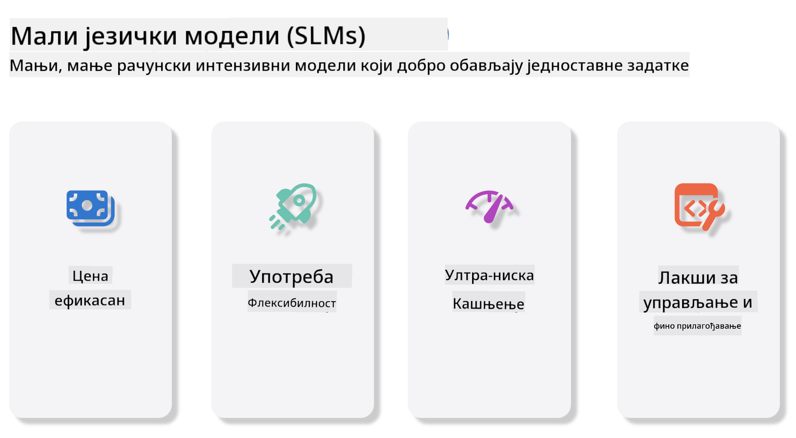
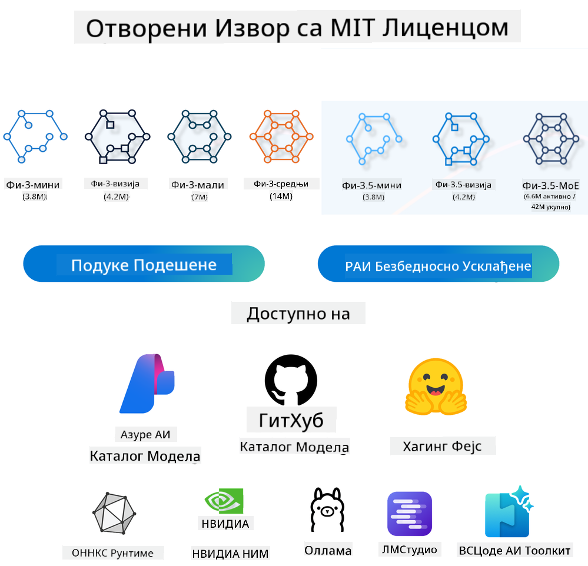
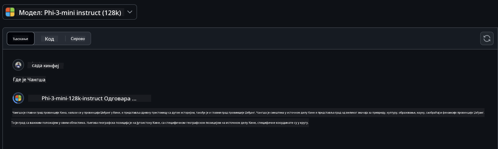
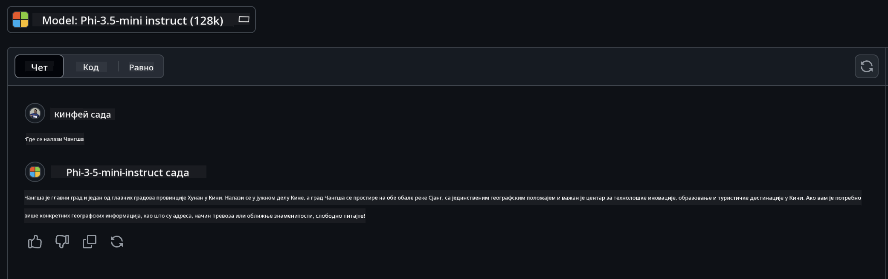

<!--
CO_OP_TRANSLATOR_METADATA:
{
  "original_hash": "124ad36cfe96f74038811b6e2bb93e9d",
  "translation_date": "2025-05-20T10:38:34+00:00",
  "source_file": "19-slm/README.md",
  "language_code": "sr"
}
-->
# Uvod u male jezičke modele za generativnu veštačku inteligenciju za početnike Generativna veštačka inteligencija je fascinantno polje veštačke inteligencije koje se fokusira na kreiranje sistema sposobnih za generisanje novog sadržaja. Ovaj sadržaj može varirati od teksta i slika do muzike, pa čak i čitavih virtuelnih okruženja. Jedna od najuzbudljivijih primena generativne veštačke inteligencije je u oblasti jezičkih modela. ## Šta su mali jezički modeli? Mali jezički model (SLM) predstavlja smanjenu varijantu velikog jezičkog modela (LLM), koristeći mnoge arhitektonske principe i tehnike LLM-a, dok pokazuje značajno smanjen računarski otisak. SLM-ovi su podskup jezičkih modela dizajniranih da generišu tekst sličan ljudskom. Za razliku od svojih većih pandana, kao što je GPT-4, SLM-ovi su kompaktniji i efikasniji, što ih čini idealnim za primene gde su računarski resursi ograničeni. Uprkos njihovoj manjoj veličini, oni i dalje mogu obavljati razne zadatke. Tipično, SLM-ovi se konstruišu kompresovanjem ili destilacijom LLM-ova, s ciljem da zadrže značajan deo funkcionalnosti i jezičkih sposobnosti originalnog modela. Ovo smanjenje veličine modela smanjuje ukupnu složenost, čineći SLM-ove efikasnijim u smislu korišćenja memorije i računskih zahteva. Uprkos ovim optimizacijama, SLM-ovi i dalje mogu obavljati širok spektar zadataka obrade prirodnog jezika (NLP): - Generisanje teksta: Kreiranje koherentnih i kontekstualno relevantnih rečenica ili paragrafa. - Dopunjavanje teksta: Predviđanje i dopunjavanje rečenica na osnovu datog podsticaja. - Prevođenje: Pretvaranje teksta iz jednog jezika u drugi. - Sažimanje: Skraćivanje dugih delova teksta u kraće, lakše za varenje sažetke. Iako sa nekim kompromisima u performansama ili dubini razumevanja u poređenju sa njihovim većim pandana. ## Kako funkcionišu mali jezički modeli? SLM-ovi se treniraju na ogromnim količinama tekstualnih podataka. Tokom obuke, oni uče obrasce i strukture jezika, omogućavajući im da generišu tekst koji je gramatički tačan i kontekstualno odgovarajući. Proces obuke uključuje: - Prikupljanje podataka: Prikupljanje velikih skupova podataka o tekstu iz različitih izvora. - Predobrada: Čišćenje i organizacija podataka kako bi bili pogodni za obuku. - Obuka: Korišćenje algoritama mašinskog učenja za podučavanje modela kako da razume i generiše tekst. - Fino podešavanje: Prilagođavanje modela za poboljšanje njegovih performansi na specifičnim zadacima. Razvoj SLM-ova usklađuje se sa sve većom potrebom za modelima koji se mogu primeniti u okruženjima sa ograničenim resursima, kao što su mobilni uređaji ili platforme za rubno računarstvo, gde punopravni LLM-ovi mogu biti nepraktični zbog svojih velikih zahteva za resursima. Fokusirajući se na efikasnost, SLM-ovi balansiraju performanse sa pristupačnošću, omogućavajući širu primenu u različitim domenima.  ## Ciljevi učenja U ovoj lekciji se nadamo da ćemo predstaviti znanje o SLM-ovima i kombinovati ga sa Microsoft Phi-3 kako bismo naučili različite scenarije u tekstualnom sadržaju, viziji i MoE. Na kraju ove lekcije, trebali biste biti u stanju da odgovorite na sledeća pitanja: - Šta je SLM - Koja je razlika između SLM-a i LLM-a - Šta je Microsoft Phi-3/3.5 Family - Kako da izvedete Microsoft Phi-3/3.5 Family Spremni? Hajde da počnemo. ## Razlike između velikih jezičkih modela (LLM-ova) i malih jezičkih modela (SLM-ova) I LLM-ovi i SLM-ovi su izgrađeni na osnovnim principima probabilističkog mašinskog učenja, prateći slične pristupe u svojoj arhitektonskoj dizajnu, metodologijama obuke, procesima generisanja podataka i tehnikama evaluacije modela. Međutim, nekoliko ključnih faktora razlikuje ove dve vrste modela. ## Primene malih jezičkih modela SLM-ovi imaju širok spektar primena, uključujući: - Chatbotovi: Pružanje podrške korisnicima i angažovanje korisnika na konverzacioni način. - Kreiranje sadržaja: Pomoć piscima u generisanju ideja ili čak pisanju čitavih članaka. - Obrazovanje: Pomoć studentima u pisanju zadataka ili učenju novih jezika. - Pristupačnost: Kreiranje alata za osobe sa invaliditetom, kao što su sistemi za pretvaranje teksta u govor. **Veličina** Primarna razlika između LLM-ova i SLM-ova leži u obimu modela. LLM-ovi, kao što je ChatGPT (GPT-4), mogu obuhvatiti procenjenih 1,76 triliona parametara, dok su otvoreni SLM-ovi kao Mistral 7B dizajnirani sa značajno manje parametara — približno 7 milijardi. Ova razlika je prvenstveno posledica razlika u arhitekturi modela i procesima obuke. Na primer, ChatGPT koristi mehanizam samopažnje unutar okvira enkoder-dekoder, dok Mistral 7B koristi pažnju kliznog prozora, što omogućava efikasniju obuku unutar modela samo dekodera. Ova varijacija u arhitekturi ima duboke implikacije na složenost i performanse ovih modela. **Razumevanje** SLM-ovi su obično optimizovani za performanse unutar specifičnih domena, što ih čini visoko specijalizovanim, ali potencijalno ograničenim u njihovoj sposobnosti da pruže široko kontekstualno razumevanje preko više polja znanja. Nasuprot tome, LLM-ovi teže da simuliraju ljudsku inteligenciju na sveobuhvatnijem nivou. Obučeni na ogromnim, raznovrsnim skupovima podataka, LLM-ovi su dizajnirani da dobro obavljaju zadatke u raznim domenima, nudeći veću svestranost i prilagodljivost. Posledično, LLM-ovi su prikladniji za širi spektar zadataka nizvodno, kao što su obrada prirodnog jezika i programiranje. **Računanje** Obuka i primena LLM-ova su procesi koji zahtevaju mnogo resursa, često zahtevajući značajnu računarsku infrastrukturu, uključujući velike klastere GPU-ova. Na primer, obuka modela kao što je ChatGPT od nule može zahtevati hiljade GPU-ova tokom dužih perioda. Nasuprot tome, SLM-ovi, sa svojim manjim brojem parametara, su pristupačniji u smislu računarskih resursa. Modeli kao što je Mistral 7B mogu se obučiti i pokrenuti na lokalnim mašinama opremljenim umerenim GPU kapacitetima, iako obuka i dalje zahteva nekoliko sati na više GPU-ova. **Pristrasnost** Pristrasnost je poznat problem u LLM-ovima, prvenstveno zbog prirode podataka za obuku. Ovi modeli često se oslanjaju na sirove, otvoreno dostupne podatke sa interneta, koji mogu nedovoljno predstavljati ili pogrešno predstavljati određene grupe, uvesti pogrešno označavanje ili reflektovati jezičke pristrasnosti pod uticajem dijalekta, geografskih varijacija i gramatičkih pravila. Pored toga, složenost LLM arhitektura može nenamerno pogoršati pristrasnost, koja može proći nezapaženo bez pažljivog finog podešavanja. S druge strane, SLM-ovi, koji se obučavaju na ograničenijim, domen-specifičnim skupovima podataka, su inherentno manje podložni takvim pristrasnostima, iako nisu imuni na njih. **Izvođenje** Smanjena veličina SLM-ova pruža im značajnu prednost u smislu brzine izvođenja, omogućavajući im da efikasno generišu izlaze na lokalnom hardveru bez potrebe za opsežnom paralelnom obradom. Nasuprot tome, LLM-ovi, zbog svoje veličine i složenosti, često zahtevaju značajne paralelne računarske resurse da bi postigli prihvatljivo vreme izvođenja. Prisutnost više istovremenih korisnika dodatno usporava vreme odziva LLM-ova, posebno kada se primenjuju na velikoj skali. U zaključku, iako i LLM-ovi i SLM-ovi dele osnovnu bazu u mašinskom učenju, oni se značajno razlikuju u smislu veličine modela, zahteva za resursima, kontekstualnog razumevanja, podložnosti pristrasnosti i brzine izvođenja. Ove razlike odražavaju njihovu odgovarajuću prikladnost za različite slučajeve upotrebe, pri čemu su LLM-ovi svestraniji, ali zahtevni za resurse, a SLM-ovi nude veću efikasnost specifičnu za domen sa smanjenim računarskim zahtevima. ***Napomena: U ovom poglavlju ćemo predstaviti SLM koristeći Microsoft Phi-3 / 3.5 kao primer.*** ## Predstavljanje Phi-3 / Phi-3.5 porodice Phi-3 / 3.5 porodica uglavnom cilja tekstualne, vizualne i agent (MoE) aplikacione scenarije: ### Phi-3 / 3.5 Instrukt Glavna za generisanje teksta, dovršavanje razgovora i ekstrakciju informacija iz sadržaja, itd. **Phi-3-mini** Jezički model od 3.8B dostupan je na Microsoft Azure AI Studio, Hugging Face i Ollama. Phi-3 modeli značajno nadmašuju jezičke modele iste i veće veličine na ključnim merilima (pogledajte brojeve merila ispod, veći brojevi su bolji). Phi-3-mini nadmašuje modele dvostruko veće veličine, dok Phi-3-small i Phi-3-medium nadmašuju veće modele, uključujući GPT-3.5 **Phi-3-small & medium** Sa samo 7B parametara, Phi-3-small pobjeđuje GPT-3.5T na različitim jezičkim, rezonovnim, kodirajućim i matematičkim merilima. Phi-3-medium sa 14B parametara nastavlja ovaj trend i nadmašuje Gemini 1.0 Pro. **Phi-3.5-mini** Možemo ga smatrati nadogradnjom Phi-3-mini. Dok parametri ostaju nepromenjeni, poboljšava sposobnost podrške za više jezika (Podržava 20+ jezika: arapski, kineski, češki, danski, holandski, engleski, finski, francuski, nemački, hebrejski, mađarski, italijanski, japanski, korejski, norveški, poljski, portugalski, ruski, španski, švedski, tajlandski, turski, ukrajinski) i dodaje jaču podršku za dug kontekst. Phi-3.5-mini sa 3.8B parametara nadmašuje jezičke modele iste veličine i parira modelima dvostruko veće veličine. ### Phi-3 / 3.5 Vizija Možemo smatrati instrukcioni model Phi-3/3.5 kao sposobnost Phi-a da razume, a Vizija je ono što Phi-u daje oči da razume svet. **Phi-3-Vizija** Phi-3-vizija, sa samo 4.2B parametara, nastavlja ovaj trend i nadmašuje veće modele kao što su Claude-3 Haiku i Gemini 1.0 Pro V na zadacima opšteg vizuelnog rezonovanja, OCR-a i zadacima razumevanja tabela i dijagrama. **Phi-3.5-Vizija** Phi-3.5-Vizija je takođe nadogradnja Phi-3-Vizije, dodajući podršku za više slika. Možete je smatrati poboljšanjem u viziji, ne samo da može videti slike, već i video zapise. Phi-3.5-vizija nadmašuje veće modele kao što su Claude-3.5 Sonnet i Gemini 1.5 Flash u OCR-u, razumevanju tabela i grafikona i parira na zadacima opšteg vizuelnog rezonovanja. Podržava unos više okvira, tj. obavlja rezonovanje na više ulaznih slika ### Phi-3.5-MoE ***Mešavina eksperata (MoE)*** omogućava modelima da se unapred obučavaju sa mnogo manje računarstva, što znači da možete dramatično povećati veličinu modela ili skupa podataka sa istim budžetom za računarstvo kao gusti model. Konkretno, MoE model bi trebao postići isti kvalitet kao njegov gusti pandan mnogo brže tokom unapred obuke. Phi-3.5-MoE obuhvata 16x3.8B ekspertskih modula. Phi-3.5-MoE sa samo 6.6B aktivnih parametara postiže sličan nivo rezonovanja, razumevanja jezika i matematike kao mnogo veći modeli Možemo koristiti model Phi-3/3.5 Family u različitim scenarijima. Za razliku od LLM-a, možete primeniti Phi-3/3.5-mini ili Phi-3/3.5-Vision na rubnim uređajima. ## Kako koristiti modele Phi-3/3.5 Family Nadamo se da ćemo koristiti Phi-3/3.5 u različitim scenarijima. Sledeće, koristićemo Phi-3/3.5 na osnovu različitih scenarija.  ### Razlika u izvođenju Cloud-ovog API-ja **GitHub modeli** GitHub
Modeli su najdirektniji način. Možete brzo pristupiti Phi-3/3.5-Instruct modelu putem GitHub Modela. Kombinovani sa Azure AI Inference SDK / OpenAI SDK, možete pristupiti API-ju putem koda da biste završili Phi-3/3.5-Instruct poziv. Takođe možete testirati različite efekte putem Playground-a. - Demo: Poređenje efekata Phi-3-mini i Phi-3.5-mini u kineskim scenarijima   **Azure AI Studio** Ili ako želimo da koristimo vision i MoE modele, možete koristiti Azure AI Studio da završite poziv. Ako ste zainteresovani, možete pročitati Phi-3 Cookbook da naučite kako da pozovete Phi-3/3.5 Instruct, Vision, MoE putem Azure AI Studija [Kliknite ovaj link](https://github.com/microsoft/Phi-3CookBook/blob/main/md/02.QuickStart/AzureAIStudio_QuickStart.md?WT.mc_id=academic-105485-koreyst) **NVIDIA NIM** Pored cloud-based Model Catalog rešenja koje pružaju Azure i GitHub, možete koristiti i [Nivida NIM](https://developer.nvidia.com/nim?WT.mc_id=academic-105485-koreyst) da završite povezane pozive. Možete posetiti NIVIDA NIM da završite API pozive Phi-3/3.5 porodice. NVIDIA NIM (NVIDIA Inference Microservices) je set ubrzanih inferencijskih mikroservisa dizajniranih da pomognu developerima da efikasno implementiraju AI modele u različitim okruženjima, uključujući oblake, data centre i radne stanice. Evo nekih ključnih karakteristika NVIDIA NIM-a: - **Jednostavnost implementacije:** NIM omogućava implementaciju AI modela jednim komandama, čineći ga jednostavnim za integraciju u postojeće tokove rada. - **Optimizovan učinak:** Koristi NVIDIA-ine unapred optimizovane inferencijske motore, kao što su TensorRT i TensorRT-LLM, da osigura nisku latenciju i visok protok. - **Skalabilnost:** NIM podržava autoskaliranje na Kubernetesu, omogućavajući mu da efikasno obrađuje promenljive radne opterećenja. - **Sigurnost i kontrola:** Organizacije mogu održavati kontrolu nad svojim podacima i aplikacijama tako što samostalno hostuju NIM mikroservise na svojoj upravljanoj infrastrukturi. - **Standardni API-ji:** NIM pruža industrijski standardne API-je, čineći ga jednostavnim za izgradnju i integraciju AI aplikacija poput chatbota, AI asistenata i drugih. NIM je deo NVIDIA AI Enterprise, koji ima za cilj da pojednostavi implementaciju i operacionalizaciju AI modela, osiguravajući da efikasno rade na NVIDIA GPU-ima. - Demo: Korišćenje Nividia NIM-a za poziv Phi-3.5-Vision-API [[Kliknite ovaj link](../../../19-slm/python/Phi-3-Vision-Nividia-NIM.ipynb)] ### Inferencija Phi-3/3.5 u lokalnom okruženju Inferencija u vezi sa Phi-3, ili bilo kojim jezičkim modelom kao što je GPT-3, odnosi se na proces generisanja odgovora ili predikcija na osnovu ulaza koji prima. Kada pružite prompt ili pitanje Phi-3, koristi svoju treniranu neuronsku mrežu da zaključi najverovatniji i relevantan odgovor analizirajući obrasce i odnose u podacima na kojima je treniran. **Hugging Face Transformer** Hugging Face Transformers je moćna biblioteka dizajnirana za obradu prirodnog jezika (NLP) i druge zadatke mašinskog učenja. Evo nekih ključnih tačaka o njoj: 1. **Pretrenirani modeli**: Pruža hiljade pretreniranih modela koji se mogu koristiti za različite zadatke kao što su klasifikacija teksta, prepoznavanje imenovanih entiteta, odgovaranje na pitanja, sumarizacija, prevođenje i generisanje teksta. 2. **Interoperabilnost okvira**: Biblioteka podržava više okvira za duboko učenje, uključujući PyTorch, TensorFlow i JAX. Ovo vam omogućava da trenirate model u jednom okviru i koristite ga u drugom. 3. **Multimodalne sposobnosti**: Pored NLP-a, Hugging Face Transformers takođe podržava zadatke u računarskom vidu (npr. klasifikacija slika, detekcija objekata) i obradi zvuka (npr. prepoznavanje govora, klasifikacija zvuka). 4. **Jednostavnost korišćenja**: Biblioteka nudi API-je i alate za jednostavno preuzimanje i fino podešavanje modela, čineći je dostupnom i početnicima i ekspertima. 5. **Zajednica i resursi**: Hugging Face ima živu zajednicu i opsežnu dokumentaciju, tutorijale i vodiče koji pomažu korisnicima da počnu i iskoriste biblioteku. [zvanična dokumentacija](https://huggingface.co/docs/transformers/index?WT.mc_id=academic-105485-koreyst) ili njihov [GitHub repozitorijum](https://github.com/huggingface/transformers?WT.mc_id=academic-105485-koreyst). Ovo je najčešće korišćen metod, ali zahteva GPU ubrzanje. Na kraju krajeva, scene kao što su Vision i MoE zahtevaju mnogo proračuna, što će biti veoma ograničeno na CPU-u ako nisu kvantizovane. - Demo: Korišćenje Transformera za poziv Phi-3.5-Instuct [Kliknite ovaj link](../../../19-slm/python/phi35-instruct-demo.ipynb) - Demo: Korišćenje Transformera za poziv Phi-3.5-Vision [Kliknite ovaj link](../../../19-slm/python/phi35-vision-demo.ipynb) - Demo: Korišćenje Transformera za poziv Phi-3.5-MoE [Kliknite ovaj link](../../../19-slm/python/phi35_moe_demo.ipynb) **Ollama** [Ollama](https://ollama.com/?WT.mc_id=academic-105485-koreyst) je platforma dizajnirana da olakša pokretanje velikih jezičkih modela (LLM) lokalno na vašem računaru. Podržava različite modele kao što su Llama 3.1, Phi 3, Mistral, i Gemma 2, između ostalih. Platforma pojednostavljuje proces spajanjem težina modela, konfiguracije i podataka u jedan paket, čineći ga dostupnijim korisnicima da prilagode i kreiraju svoje modele. Ollama je dostupna za macOS, Linux i Windows. To je odličan alat ako želite da eksperimentišete ili implementirate LLM-ove bez oslanjanja na cloud usluge. Ollama je najdirektniji način, samo trebate izvršiti sledeću izjavu. ```bash

ollama run phi3.5

``` **ONNX Runtime za GenAI** [ONNX Runtime](https://github.com/microsoft/onnxruntime-genai?WT.mc_id=academic-105485-koreyst) je cross-platformska mašinsko učenje akcelerator za inferenciju i trening. ONNX Runtime za Generative AI (GENAI) je moćan alat koji vam pomaže da efikasno pokrenete generativne AI modele na različitim platformama. ## Šta je ONNX Runtime? ONNX Runtime je open-source projekat koji omogućava visokoperformansnu inferenciju mašinskih modela učenja. Podržava modele u Open Neural Network Exchange (ONNX) formatu, koji je standard za predstavljanje mašinskih modela učenja. ONNX Runtime inferencija može omogućiti brže korisničke iskustva i niže troškove, podržavajući modele iz okvira za duboko učenje kao što su PyTorch i TensorFlow/Keras, kao i klasične biblioteke mašinskog učenja kao što su scikit-learn, LightGBM, XGBoost, itd. ONNX Runtime je kompatibilan sa različitim hardverom, drajverima i operativnim sistemima, i pruža optimalne performanse koristeći hardverske akceleratore gde je primenljivo uz optimizacije grafikona i transformacije ## Šta je Generativna AI? Generativna AI se odnosi na AI sisteme koji mogu generisati novi sadržaj, kao što su tekst, slike ili muzika, na osnovu podataka na kojima su trenirani. Primeri uključuju jezičke modele kao što je GPT-3 i modele generisanja slika kao što je Stable Diffusion. ONNX Runtime za GenAI biblioteka pruža generativni AI petlju za ONNX modele, uključujući inferenciju sa ONNX Runtime, obradu logita, pretragu i uzorkovanje, i upravljanje KV cache-om. ## ONNX Runtime za GENAI ONNX Runtime za GENAI proširuje sposobnosti ONNX Runtime-a da podrži generativne AI modele. Evo nekih ključnih karakteristika: - **Široka podrška platformi:** Radi na raznim platformama, uključujući Windows, Linux, macOS, Android i iOS. - **Podrška za modele:** Podržava mnoge popularne generativne AI modele, kao što su LLaMA, GPT-Neo, BLOOM, i više. - **Optimizacija performansi:** Uključuje optimizacije za različite hardverske akceleratore kao što su NVIDIA GPU-i, AMD GPU-i, i više. - **Jednostavnost korišćenja:** Pruža API-je za jednostavnu integraciju u aplikacije, omogućavajući vam da generišete tekst, slike i drugi sadržaj sa minimalnim kodom - Korisnici mogu pozvati visok nivo generate() metod, ili pokrenuti svaku iteraciju modela u petlji, generišući jedan token po iteraciji, i opcionalno ažurirati parametre generisanja unutar petlje. - ONNX runtime takođe ima podršku za pohlepnu/beam pretragu i TopP, TopK uzorkovanje za generisanje sekvenci tokena i ugrađenu obradu logita kao što su kazne za ponavljanje. Takođe možete lako dodati prilagođeno ocenjivanje. ## Početak Da biste počeli sa ONNX Runtime za GENAI, možete slediti ove korake: ### Instalirajte ONNX Runtime: ```Python
pip install onnxruntime
``` ### Instalirajte Generativne AI ekstenzije: ```Python
pip install onnxruntime-genai
``` ### Pokrenite model: Evo jednostavnog primera u Python-u: ```Python
import onnxruntime_genai as og

model = og.Model('path_to_your_model.onnx')

tokenizer = og.Tokenizer(model)

input_text = "Hello, how are you?"

input_tokens = tokenizer.encode(input_text)

output_tokens = model.generate(input_tokens)

output_text = tokenizer.decode(output_tokens)

print(output_text) 
``` ### Demo: Korišćenje ONNX Runtime GenAI za poziv Phi-3.5-Vision ```python

import onnxruntime_genai as og

model_path = './Your Phi-3.5-vision-instruct ONNX Path'

img_path = './Your Image Path'

model = og.Model(model_path)

processor = model.create_multimodal_processor()

tokenizer_stream = processor.create_stream()

text = "Your Prompt"

prompt = "<|user|>\n"

prompt += "<|image_1|>\n"

prompt += f"{text}<|end|>\n"

prompt += "<|assistant|>\n"

image = og.Images.open(img_path)

inputs = processor(prompt, images=image)

params = og.GeneratorParams(model)

params.set_inputs(inputs)

params.set_search_options(max_length=3072)

generator = og.Generator(model, params)

while not generator.is_done():

    generator.compute_logits()
    
    generator.generate_next_token()

    new_token = generator.get_next_tokens()[0]
    
    code += tokenizer_stream.decode(new_token)
    
    print(tokenizer_stream.decode(new_token), end='', flush=True)

``` **Ostali** Pored ONNX Runtime i Ollama referentnih metoda, možemo završiti referencu kvantitativnih modela na osnovu referentnih metoda modela koje pružaju različiti proizvođači. Kao što su Apple MLX framework sa Apple Metal, Qualcomm QNN sa NPU, Intel OpenVINO sa CPU/GPU, itd. Takođe možete dobiti više sadržaja iz [Phi-3 Cookbook](https://github.com/microsoft/phi-3cookbook?WT.mc_id=academic-105485-koreyst) ## Više Naučili smo osnove Phi-3/3.5 porodice, ali da bismo saznali više o SLM-u potrebna nam je više znanja. Odgovore možete pronaći u Phi-3 Cookbook. Ako želite da saznate više, posetite [Phi-3 Cookbook](https://github.com/microsoft/phi-3cookbook?WT.mc_id=academic-105485-koreyst).

**Одрицање од одговорности**:  
Овај документ је преведен користећи услугу вештачке интелигенције за превођење [Co-op Translator](https://github.com/Azure/co-op-translator). Иако тежимо тачности, молимо вас да будете свесни да аутоматски преводи могу садржати грешке или нетачности. Оригинални документ на свом изворном језику треба сматрати меродавним извором. За критичне информације препоручује се професионални људски превод. Не сносимо одговорност за било каква неразумевања или погрешна тумачења настала коришћењем овог превода.