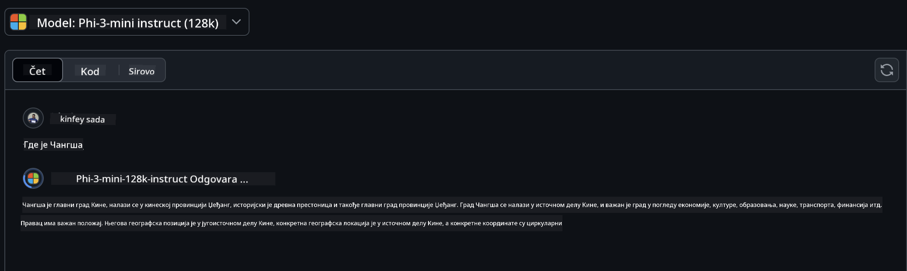
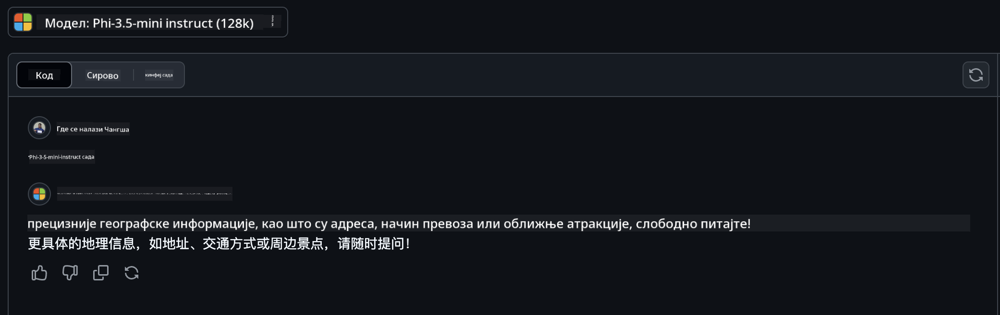

<!--
CO_OP_TRANSLATOR_METADATA:
{
  "original_hash": "124ad36cfe96f74038811b6e2bb93e9d",
  "translation_date": "2025-06-26T02:58:07+00:00",
  "source_file": "19-slm/README.md",
  "language_code": "sr"
}
-->

Модели су најдиректнији начин. Можете брзо приступити Phi-3/3.5-Instruct моделу преко GitHub Models. У комбинацији са Azure AI Inference SDK / OpenAI SDK, можете приступити API-ју кроз код да завршите Phi-3/3.5-Instruct позив. Такође можете тестирати различите ефекте кроз Playground. - Демонстрација: Поређење ефеката Phi-3-mini и Phi-3.5-mini у кинеским сценаријима   **Azure AI Studio** Или ако желимо да користимо моделе за визију и MoE, можете користити Azure AI Studio да завршите позив. Ако сте заинтересовани, можете прочитати Phi-3 Cookbook да научите како да позовете Phi-3/3.5 Instruct, Vision, MoE кроз Azure AI Studio [Кликните на овај линк](https://github.com/microsoft/Phi-3CookBook/blob/main/md/02.QuickStart/AzureAIStudio_QuickStart.md?WT.mc_id=academic-105485-koreyst) **NVIDIA NIM** Поред решења за каталог модела заснованих на облаку које пружају Azure и GitHub, можете такође користити [Nivida NIM](https://developer.nvidia.com/nim?WT.mc_id=academic-105485-koreyst) да завршите повезане позиве. Можете посетити NIVIDA NIM да завршите API позиве Phi-3/3.5 породице. NVIDIA NIM (NVIDIA Inference Microservices) је сет микросервиса за убрзано инференцирање дизајниран да помогне програмерима да ефикасно распоређују AI моделе у различитим окружењима, укључујући облаке, дата центре и радне станице. Ево неких кључних карактеристика NVIDIA NIM: - **Лакоћа распоређивања:** NIM омогућава распоређивање AI модела једном командом, чинећи га једноставним за интеграцију у постојеће радне токове. - **Оптимизовани перформанси:** Користи NVIDIA-ине пред-оптимизоване инференцијске моторе, као што су TensorRT и TensorRT-LLM, да осигура ниску латенцију и високу пропусност. - **Скалабилност:** NIM подржава аутоскалирање на Kubernetes-у, омогућавајући му да ефикасно обрађује различите радне оптерећења. - **Безбедност и контрола:** Организације могу одржавати контролу над својим подацима и апликацијама самосталним хостовањем NIM микросервиса на својој управљаној инфраструктури. - **Стандардни API-ји:** NIM пружа индустријске стандардне API-је, чинећи га једноставним за изградњу и интеграцију AI апликација као што су чет-ботови, AI асистенти и више. NIM је део NVIDIA AI Enterprise, који има за циљ да поједностави распоређивање и оперативизацију AI модела, осигуравајући да раде ефикасно на NVIDIA GPU-има. - Демонстрација: Коришћење Nividia NIM за позивање Phi-3.5-Vision-API [[Кликните на овај линк](../../../19-slm/python/Phi-3-Vision-Nividia-NIM.ipynb)] ### Инференција Phi-3/3.5 у локалном окружењу Инференција у односу на Phi-3, или било који језички модел као GPT-3, односи се на процес генерисања одговора или предвиђања на основу уноса који прима. Када пружите упит или питање Phi-3, он користи свој обучени неуронски мрежни модел да изведе највероватнији и релевантан одговор анализом образаца и односа у подацима на којима је обучен. **Hugging Face Transformer** Hugging Face Transformers је моћна библиотека дизајнирана за обраду природног језика (NLP) и друге задатке машинског учења. Ево неких кључних тачака о њој: 1. **Предобучени модели**: Пружа хиљаде предобучених модела који се могу користити за различите задатке као што су класификација текста, препознавање именованих ентитета, одговарање на питања, сумирање, превођење и генерисање текста. 2. **Интероперабилност оквира**: Библиотека подржава више оквира дубоког учења, укључујући PyTorch, TensorFlow и JAX. Ово вам омогућава да обучите модел у једном оквиру и користите га у другом. 3. **Мултимодалне способности**: Поред NLP-а, Hugging Face Transformers такође подржава задатке у компјутерској визији (нпр. класификација слика, детекција објеката) и аудио обради (нпр. препознавање говора, класификација аудио сигнала). 4. **Лакоћа коришћења**: Библиотека нуди API-је и алате за лако преузимање и фино подешавање модела, чинећи је доступном и почетницима и експертима. 5. **Заједница и ресурси**: Hugging Face има живу заједницу и опсежну документацију, туторијале и водиче да помогне корисницима да започну и максимално искористе библиотеку. [званична документација](https://huggingface.co/docs/transformers/index?WT.mc_id=academic-105485-koreyst) или њихов [GitHub репозиторијум](https://github.com/huggingface/transformers?WT.mc_id=academic-105485-koreyst). Ово је најчешће коришћени метод, али такође захтева GPU убрзање. На крају крајева, сцене као што су Vision и MoE захтевају много рачунања, што ће бити веома ограничено на CPU-у ако нису квантизоване. - Демонстрација: Коришћење Transformer-а за позивање Phi-3.5-Instuct [Кликните на овај линк](../../../19-slm/python/phi35-instruct-demo.ipynb) - Демонстрација: Коришћење Transformer-а за позивање Phi-3.5-Vision[Кликните на овај линк](../../../19-slm/python/phi35-vision-demo.ipynb) - Демонстрација: Коришћење Transformer-а за позивање Phi-3.5-MoE[Кликните на овај линк](../../../19-slm/python/phi35_moe_demo.ipynb) **Ollama** [Ollama](https://ollama.com/?WT.mc_id=academic-105485-koreyst) је платформа дизајнирана да олакша покретање великих језичких модела (LLMs) локално на вашем рачунару. Подржава различите моделе као што су Llama 3.1, Phi 3, Mistral и Gemma 2, између осталих. Платформа поједностављује процес паковањем тежина модела, конфигурације и података у један пакет, чинећи га приступачнијим за кориснике да прилагоде и креирају своје моделе. Ollama је доступан за macOS, Linux и Windows. То је одличан алат ако желите да експериментишете или распоређујете LLMs без ослањања на облачне услуге. Ollama је најдиректнији начин, само треба да извршите следећу изјаву. ```bash

ollama run phi3.5

``` **ONNX Runtime за GenAI** [ONNX Runtime](https://github.com/microsoft/onnxruntime-genai?WT.mc_id=academic-105485-koreyst) је интерплатформски акцелератор за инференцију и тренинг машинског учења. ONNX Runtime за Generative AI (GENAI) је моћан алат који вам помаже да ефикасно покрећете генеративне AI моделе на различитим платформама. ## Шта је ONNX Runtime? ONNX Runtime је отворени пројекат који омогућава високоперформансну инференцију машинских модела. Подржава моделе у Open Neural Network Exchange (ONNX) формату, који је стандард за представљање машинских модела. ONNX Runtime инференција може омогућити брже корисничко искуство и ниже трошкове, подржавајући моделе из оквира дубоког учења као што су PyTorch и TensorFlow/Keras, као и класичне библиотеке машинског учења као што су scikit-learn, LightGBM, XGBoost, итд. ONNX Runtime је компатибилан са различитим хардвером, драјверима и оперативним системима, и пружа оптималне перформансе користећи хардверске акцелераторе где је применљиво уз графичке оптимизације и трансформације ## Шта је Generative AI? Generative AI се односи на AI системе који могу генерисати нови садржај, као што су текст, слике или музика, на основу података на којима су обучени. Примери укључују језичке моделе као GPT-3 и моделе за генерисање слика као Stable Diffusion. ONNX Runtime за GenAI библиотека пружа генеративни AI циклус за ONNX моделе, укључујући инференцију са ONNX Runtime-ом, обраду логита, претрагу и узорковање, и управљање KV кешом. ## ONNX Runtime за GENAI ONNX Runtime за GENAI проширује могућности ONNX Runtime-а да подржи генеративне AI моделе. Ево неких кључних карактеристика: - **Широка подршка платформама:** Ради на различитим платформама, укључујући Windows, Linux, macOS, Android и iOS. - **Подршка модела:** Подржава многе популарне генеративне AI моделе, као што су LLaMA, GPT-Neo, BLOOM, и више. - **Оптимизација перформанси:** Укључује оптимизације за различите хардверске акцелераторе као што су NVIDIA GPU-ови, AMD GPU-ови, и више2. - **Лакоћа коришћења:** Пружа API-је за лаку интеграцију у апликације, омогућавајући вам да генеришете текст, слике и други садржај са минималним кодом - Корисници могу позвати висок ниво generate() метод, или покренути сваку итерацију модела у петљи, генеришући један токен у исто време, и опционално ажурирајући параметре генерисања унутар петље. - ONNX runtime такође има подршку за алчну/beam претрагу и TopP, TopK узорковање за генерисање секвенци токена и уграђену обраду логита као казне за понављање. Можете такође лако додати прилагођено оцењивање. ## Почетак Да започнете са ONNX Runtime за GENAI, можете следити ове кораке: ### Инсталирајте ONNX Runtime: ```Python
pip install onnxruntime
``` ### Инсталирајте Extensions за Generative AI: ```Python
pip install onnxruntime-genai
``` ### Покрените модел: Ево једноставног примера у Python-у: ```Python
import onnxruntime_genai as og

model = og.Model('path_to_your_model.onnx')

tokenizer = og.Tokenizer(model)

input_text = "Hello, how are you?"

input_tokens = tokenizer.encode(input_text)

output_tokens = model.generate(input_tokens)

output_text = tokenizer.decode(output_tokens)

print(output_text) 
``` ### Демонстрација: Коришћење ONNX Runtime GenAI за позивање Phi-3.5-Vision ```python

import onnxruntime_genai as og

model_path = './Your Phi-3.5-vision-instruct ONNX Path'

img_path = './Your Image Path'

model = og.Model(model_path)

processor = model.create_multimodal_processor()

tokenizer_stream = processor.create_stream()

text = "Your Prompt"

prompt = "<|user|>\n"

prompt += "<|image_1|>\n"

prompt += f"{text}<|end|>\n"

prompt += "<|assistant|>\n"

image = og.Images.open(img_path)

inputs = processor(prompt, images=image)

params = og.GeneratorParams(model)

params.set_inputs(inputs)

params.set_search_options(max_length=3072)

generator = og.Generator(model, params)

while not generator.is_done():

    generator.compute_logits()
    
    generator.generate_next_token()

    new_token = generator.get_next_tokens()[0]
    
    code += tokenizer_stream.decode(new_token)
    
    print(tokenizer_stream.decode(new_token), end='', flush=True)

``` **Остали** Поред ONNX Runtime и Ollama референтних метода, можемо такође завршити референцу квантитативних модела на основу метода референце модела које пружају различити произвођачи. Као што је Apple MLX оквир са Apple Metal, Qualcomm QNN са NPU, Intel OpenVINO са CPU/GPU, итд. Можете такође добити више садржаја из [Phi-3 Cookbook](https://github.com/microsoft/phi-3cookbook?WT.mc_id=academic-105485-koreyst) ## Више Научили смо основе Phi-3/3.5 породице, али да бисмо научили више о SLM-у потребно нам је више знања. Можете пронаћи одговоре у Phi-3 Cookbook. Ако желите да научите више, молимо вас да посетите [Phi-3 Cookbook](https://github.com/microsoft/phi-3cookbook?WT.mc_id=academic-105485-koreyst).

**Одрицање од одговорности**:  
Овај документ је преведен коришћењем AI услуге за превођење [Co-op Translator](https://github.com/Azure/co-op-translator). Иако тежимо ка тачности, молимо вас да будете свесни да аутоматизовани преводи могу садржати грешке или нетачности. Оригинални документ на његовом изворном језику треба сматрати ауторитативним извором. За критичне информације, препоручује се професионални људски превод. Не сносимо одговорност за било каква неспоразума или погрешна тумачења која могу произаћи из коришћења овог превода.