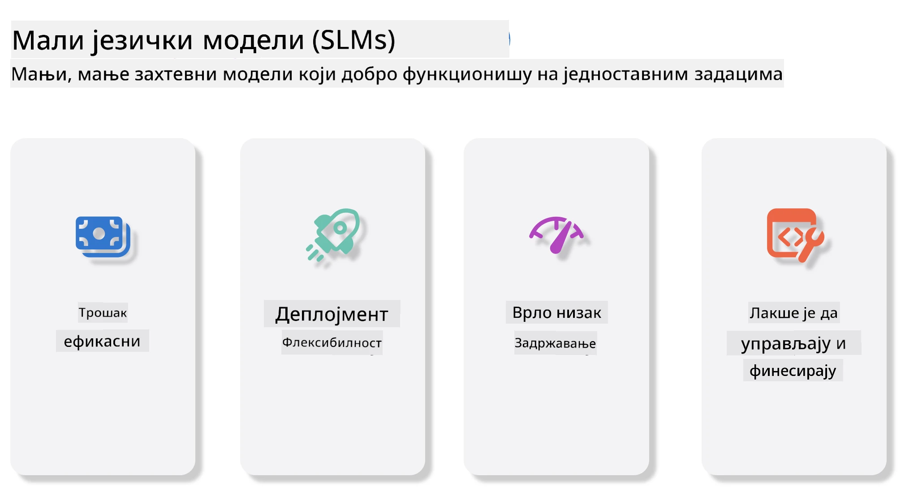
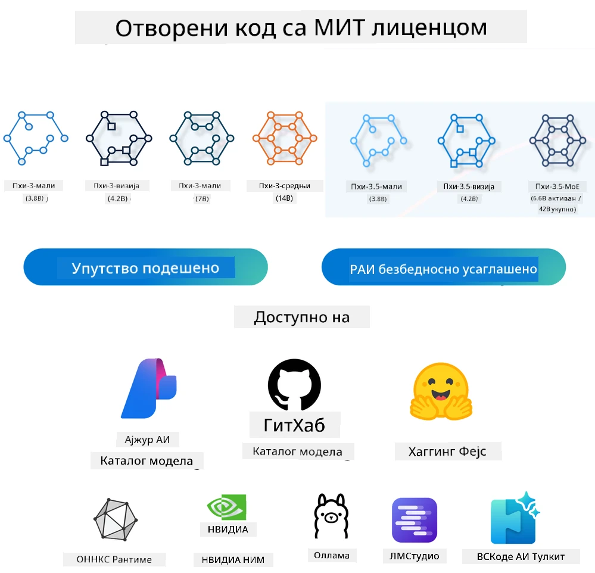
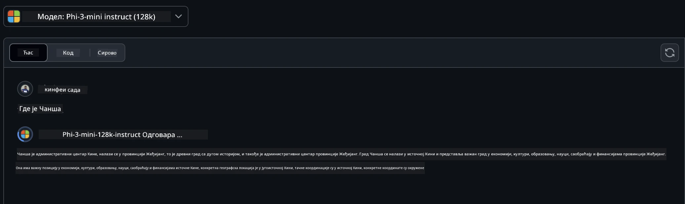
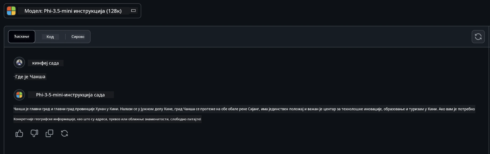

# Увод у мале језичке моделе за генеративну вештачку интелигенцију за почетнике
Генеративна вештачка интелигенција је фасцинантна област вештачке интелигенције која се фокусира на креирање система способних за генерисање новог садржаја. Тај садржај може бити текст, слике, музика па чак и цео виртуелни свет. Једна од најузбудљивијих примена генеративне вештачке интелигенције је у домену језичких модела.

## Шта су мали језички модели?

Мали језички модел (SLM) представља умањену варијанту великог језичког модела (LLM), користећи многе архитектонске принципе и технике LLM-а, али са значајно смањеним обимом израчунске сложености.

SLM-ови су подскуп језичких модела осмишљених да генеришу текст сличан људском. За разлику од својих већих аналога, као што је GPT-4, SLM-ови су компактнији и ефикаснији, што их чини идеалним за примене где су ресурси за израчунавање ограничени. Упркос мањој величини, могу извршавати разне задатке. Обично се SLM-ови конструишу компресовањем или дестилацијом LLM-ова, с циљем да се задржи значајан део функционалности и језичких способности оригиналног модела. Ово смањење величине модела умањује укупну сложеност, чинећи SLM-ове ефикаснијим у смислу коришћења меморије и потреба за обраду. Упркос овим оптимизацијама, SLM-ови и даље могу извршавати широк спектар задатака природне обраде језика (NLP):

- Генерисање текста: Креирање кохерентних и контекстуално релевантних реченица или параграфа.
- Допуњавање текста: Предвиђање и допуњавање реченица на основу дате уводне реченице.
- Превод: Претварање текста са једног језика на други.
- Сажимање: Сажимање дугачких комада текста у краће, лакше разумљиве прегледе.

Иако са неким компромисима у перформансама или дубини разумевања у односу на своје веће аналоге.

## Како раде мали језички модели?
SLM-ови се обучавају на огромним количинама текстуалних података. Током обучавања, уче обрасце и структуре језика, омогућавајући им да генеришу текст који је граматички тачан и контекстуално прикладан. Процес обуке укључује:

- Прикупљање података: Скупови великих базе података текста из различитих извора.
- Предобрада: Чишћење и организовање података да би били погодни за обуку.
- Обука: Коришћење алгоритама машинског учења да се модели науче како да разумеју и генеришу текст.
- Финесирање: Прилагођавање модела да побољша перформансе у специфичним задацима.

Развој SLM-ова одговара растућој потреби за моделима који могу бити применјиви у окружењима с ограниченим ресурсима, попут мобилних уређаја или платформи за рачунарство на ивици, где су велики LLM-ови непрактични због захтева за ресурсима. Фокусирајући се на ефикасност, SLM-ови балансирају перформансе и доступност, омогућавајући широку примену у разним областима.



## Циљеви учења

У овом часу, желимо да вас упознамо са знањем о SLM-овима и повежемо га са Microsoft Phi-3 како бисмо научили различите сценарије у текстуалном садржају, визији и МоЕ.

На крају овог часа, требало би да можете да одговорите на следећа питања:

- Шта је SLM?
- Која је разлика између SLM и LLM?
- Шта је Microsoft Phi-3/3.5 породица?
- Како извршити инференцију са Microsoft Phi-3/3.5 породицом?

Спремни? Почнимо.

## Разлике између великих језичких модела (LLM) и малих језичких модела (SLM)

И LLM-ови и SLM-ови су изграђени на основним принципима вероватносног машинског учења, следећи сличне приступе у архитектонском дизајну, методологијама обуке, процесима генерисања података и техникама процене модела. Међутим, неколико кључних фактора разликује ова два типа модела.

## Примене малих језичких модела

SLM-ови имају широк спектар примена, укључујући:

- Чатботови: Пружање корисничке подршке и интеракција са корисницима путем разговора.
- Креирање садржаја: Помагање писцима у генерацији идеја или чак писању комплетних чланака.
- Образовање: Помоћ студентима у писању задатака или учењу нових језика.
- Приступачност: Креирање алата за особе са инвалидитетом, попут система за претварање текста у говор.

**Величина**

Примарна разлика између LLM и SLM лежи у величини модела. LLM-ови, као што је ChatGPT (GPT-4), могу садржати око 1,76 билиона параметара, док су отворени SLM-ови попут Mistral 7B дизајнирани са значајно мањим бројем параметара — отприлике 7 милијарди. Ова разлика углавном потиче из разлика у архитектури модела и процесима обуке. На пример, ChatGPT користи механизам самопажње у оквиру енкодер-декодер архитектуре, док Mistral 7B користи пузајући прозор пажње, што омогућава ефикаснију обуку у моделу само са декодером. Ова архитектонска варијанта има дубоке импликације на сложеност и перформансе ових модела.

**Разумевање**

SLM-ови су обично оптимизовани за перформансе у одређеним доменима, што их чини врло специјализованим, али потенцијално ограниченим у способности да пруже широку контекстуалну предодржност кроз различите области знања. Насупрот томе, LLM-ови имају за циљ да симулирају интелигенцију сличну људској на општијем нивоу. Обучени на огромним, разноликим скуповима података, LLM-ови су дизајнирани да добро раде у разним доменима, нудећи већу свестраност и прилагодљивост. Према томе, LLM-ови су погоднији за широк спектар задака, као што су обрада природног језика и програмирање.

**Рачунарски ресурси**

Обука и распоређивање LLM-ова су процеси који захтевају велике ресурсе, често укључујући значајну израчунску инфраструктуру, укључујући велики број GPU кластера. На пример, обука модела као што је ChatGPT од почетка може захтевати хиљаде GPU-а током дугих периода. Насупрот томе, SLM-ови са мањим бројем параметара су приступачнији у смислу потребних израчунских ресурса. Модели попут Mistral 7B могу бити обучени и покренути на локалним рачунарима са умереним GPU могућностима, иако обука и даље захтева неколико сати на више GPU-а.

**Предрасуде**

Предрасуде су познат проблем у LLM-овима, првенствено због природе података за обуку. Ови модели често користе неуређене, јавне податке с интернета, који могу потцењивати или погрешно представљати одређене групе, уносити погрешно означавање или одражавати језичке предрасуде условљене дијалектом, географским варијацијама и граматичким правилима. Поред тога, сложеност архитектуре LLM-а може ненамерно појачати предрасуде које могу остати непримећене без пажљивог финог подешавања. Са друге стране, SLM-ови, обучени на одабраним, доменски специфичним скупинама података, природно су мање подложни овим предрасудама, али нису потпуно имуни.

**Инференција**

Смањена величина SLM-ова пружа значајну предност у брзини инференције, омогућавајући им да ефикасно генеришу излаз на локалном хардверу без потребе за обимном паралелном обрадом. Супротно томе, LLM-ови због своје величине и сложености често захтевају значајне паралелне израчунске ресурсе за постицање прихватљивих времена инференције. Присуство више истовремених корисника додатно успорава време одговора LLM-ова, посебно када се користе на великој скали.

Укратко, мада и LLM и SLM имају основ у машинском учењу, значајно се разликују по величини модела, захтевима за ресурсима, контекстуалном разумевању, подложности предрасудама и брзини инференције. Ове разлике одражавају њихову прикладност за различите употребе, с тим да су LLM-ови свестранији али ресурсоинтензивни, а SLM-ови нуде ефикасност у специфичним доменима уз мање захтева за израчунавање.

***Напомена: У овом часу ћемо представити SLM користећи Microsoft Phi-3 / 3.5 као пример.***

## Представљање Phi-3 / Phi-3.5 породице

Phi-3 / 3.5 породица углавном циља сценарије рада са текстом, визијом и агентима (MoE):

### Phi-3 / 3.5 Instruct

Углавном за генерисање текста, допуњавање разговора и екстракцију информација из садржаја, итд.

**Phi-3-mini**

Језички модел од 3.8 милијарди параметара доступан је на Microsoft Azure AI Studio, Hugging Face и Ollama. Phi-3 модели значајно надмашују језичке моделе исте или веће величине на кључним тестовима (погледајте бројеве тестова испод, већи бројеви су бољи). Phi-3-mini надмашује моделе двоструко веће величине, док Phi-3-small и Phi-3-medium надмашују веће моделе, укључујући GPT-3.5.

**Phi-3-small & medium**

Са само 7 милијарди параметара, Phi-3-small је бољи од GPT-3.5T на разним језичким, логичким, кодирачким и математичким тестовима.

Phi-3-medium са 14 милијарди параметара наставља овај тренд и надмашује Gemini 1.0 Pro.

**Phi-3.5-mini**

Можемо то сматрати надоградњом Phi-3-mini. Параметри остају исти, али се побољшава способност подршке више језика (подршка за 20+ језика: арапски, кинески, чешки, дански, холандски, енглески, фински, француски, немачки, хебрејски, мађарски, италијански, јапански, корејски, норвешки, пољски, португалски, руски, шпански, шведски, тајландски, турски, украјински) и додаје јача подршка за дугачак контекст.

Phi-3.5-mini са 3.8 милијарди параметара надмашује језичке моделе исте величине и упоредив је са моделима двоструко веће величине.

### Phi-3 / 3.5 Vision

Можемо размишљати о Instruct моделу Phi-3/3.5 као способности Phi да разуме, а Vision му даје очи да разуме свет.

**Phi-3-Vision**

Phi-3-vision, са само 4.2 милијарде параметара, наставља овај тренд и надмашује веће моделе попут Claude-3 Haiku и Gemini 1.0 Pro V у општим задацима визуелног резоновања, OCR-у и разумевању табела и дијаграма.

**Phi-3.5-Vision**

Phi-3.5-Vision је такође надоградња Phi-3-Vision, додајући подршку за више слика. Можете размислити о томе као о побољшању визије, не видите само слике већ и видео записе.

Phi-3.5-Vision надмашује веће моделе као што су Claude-3.5 Sonnet и Gemini 1.5 Flash у задацима OCR, разумевању табела и диаграма и упоредив је у општим задацима визуелног резоновања. Подржава унос више кадрова, односно резонује на више улазних слика.

### Phi-3.5-MoE

***Мешавина стручњака (MoE)*** омогућава моделима да се претходно обуче са много мање потребног израчунавања, што значи да можете драматично повећати величину модела или скупа података са истим буџетом за израчунавање као код густог модела. Посебно, MoE модел би требао достиц́и исту квалитет као густ модел много брже током претходне обуке.

Phi-3.5-MoE се састоји од 16x3.8B експертских модула. Phi-3.5-MoE са само 6.6 милијарди активних параметара достиже сличан ниво резоновања, разумевања језика и математике као модел много веће величине.

Можемо користити Phi-3/3.5 породицу модела на основу различитих сценарија. За разлику од LLM, можете распоредити Phi-3/3.5-mini или Phi-3/3.5-Vision на ивици уређаја.

## Како користити Phi-3/3.5 породичне моделе

Желимо да користимо Phi-3/3.5 у различитим сценаријима. Следеће ћемо користити Phi-3/3.5 на основу различитих сценарија.



### Извођење преко Cloud API

**GitHub модели**

GitHub модели су најдиректнији начин. Можете брзо приступити Phi-3/3.5-Instruct моделу преко GitHub модела. У комбинацији са Azure AI Inference SDK / OpenAI SDK, можете приступити API-ју преко кода и обавити позив Phi-3/3.5-Instruct. Такође можете тестирати различите ефекте кроз Playground.

- Демонстрација: Поређење ефеката Phi-3-mini и Phi-3.5-mini у кинеским сценаријима






**Azure AI Studio**

Ако желите да користите моделе за визуализацију и MoE, можете користити Azure AI Studio за извршење позива. Ако сте заинтересовани, можете прочитати Phi-3 Кувар како да позивате Phi-3/3.5 Instruct, Vision, MoE преко Azure AI Studio [Кликните овај линк](https://github.com/microsoft/Phi-3CookBook/blob/main/md/02.QuickStart/AzureAIStudio_QuickStart.md?WT.mc_id=academic-105485-koreyst)

**NVIDIA NIM**

Поред облачних решења за Каталог модела које пружају Azure и GitHub, такође можете користити [NVIDIA NIM](https://developer.nvidia.com/nim?WT.mc_id=academic-105485-koreyst) за извршење релевантних позива. Можете посетити NVIDIA NIM за извршавање API позива Phi-3/3.5 породице. NVIDIA NIM (NVIDIA Inference Microservices) је сет убрзаних микросервиса за инференцију дизајнираних да помогну програмерима да ефикасно распоређују AI моделе у разним окружењима, укључујући облаке, дата центре и радне станице.

Ево неких кључних карактеристика NVIDIA NIM:
- **Лакоћа постављања:** NIM омогућава постављање AI модела једном командом, чинећи интеграцију у постојеће токове рада једноставном.  
- **Оптимизоване перформансе:** Искористи NVIDIA претходно оптимизоване inferенце моторе, као што су TensorRT и TensorRT-LLM, како би обезбедио ниску латенцију и висок пропусни опсег.  
- **Скалабилност:** NIM подржава аутоматско скалирање на Kubernetes-у, омогућавајући ефективно руковање различитим оптерећењима.  
- **Безбедност и контрола:** Организације могу да задрже контролу над својим подацима и апликацијама самосталним хостовањем NIM микросервиса на својој управљаној инфраструктури.  
- **Стандардизовани API-ји:** NIM пружа индустријске стандардне API-је, што олакшава изградњу и интеграцију AI апликација као што су ћаскања ботови, AI асистенти и друге.  

NIM је део NVIDIA AI Enterprise, који има за циљ поједностављење постављања и оперативности AI модела, осигуравајући да они ефикасно раде на NVIDIA GPU-овима.

- Демонстрација: Коришћење NVIDIA NIM-а за позивање Phi-3.5-Vision-API  [[Кликни на овај линк](./python/Phi-3-Vision-Nividia-NIM.ipynb?WT.mc_id=academic-105485-koreyst)]


### Покретање Phi-3/3.5 Локално
Инференца у односу на Phi-3, или било који језички модел попут GPT-3, односи се на процес генерисања одговора или предвиђања заснованих на улазу који прими. Када дате упит или питање Phi-3, он користи своју обучену неуронску мрежу да изведе највероватнији и релевантни одговор анализирајући образце и везе у подацима на којима је обучен.

**Hugging Face Transformer**  
Hugging Face Transformers је моћна библиотека дизајнирана за обраду природног језика (NLP) и друге задатке машинског учења. Ево неких кључних тачака о њој:

1. **Предтренирани модели**: Пружа хиљаде предтренираних модела који се могу користити за различите задатке као што су класификација текста, препознавање именованих ентитета, одговарање на питања, сумирање, превођење и генерисање текста.

2. **Интероперабилност оквира**: Библиотека подржава више дубоких оквира за учење, укључујући PyTorch, TensorFlow и JAX. Ово вам омогућава да тренирате модел у једном оквиру и користите га у другом.

3. **Мултимодалне могућности**: Поред NLP-а, Hugging Face Transformers такође подржава задатке у компјутерској визији (нпр. класификација слика, детекција објеката) и обради аудио записа (нпр. препознавање говора, класификација аудио записа).

4. **Лакоћа коришћења**: Библиотека нуди API-је и алате за лако преузимање и фино подешавање модела, чинећи је приступачном и за почетнике и за стручњаке.

5. **Заједница и ресурси**: Hugging Face има живу заједницу и обимну документацију, туторијале и водиче који помажу корисницима да започну и максимално искористе библиотеку.  
[званична документација](https://huggingface.co/docs/transformers/index?WT.mc_id=academic-105485-koreyst) или њихов [GitHub репозиторијум](https://github.com/huggingface/transformers?WT.mc_id=academic-105485-koreyst).

Ово је најчешће коришћени метод, али такође захтева GPU акцелерацију. На крају крајева, сценарији као што су Vision и MoE захтевају много рачунања, што ће бити врло споро на CPU ако нису квантификовани.


- Демонстрација: Коришћење Transformer-а за позивање Phi-3.5-Instruct [Кликни на овај линк](./python/phi35-instruct-demo.ipynb?WT.mc_id=academic-105485-koreyst)

- Демонстрација: Коришћење Transformer-а за позивање Phi-3.5-Vision [Кликни на овај линк](./python/phi35-vision-demo.ipynb?WT.mc_id=academic-105485-koreyst)

- Демонстрација: Коришћење Transformer-а за позивање Phi-3.5-MoE [Кликни на овај линк](./python/phi35_moe_demo.ipynb?WT.mc_id=academic-105485-koreyst)

**Ollama**  
[Ollama](https://ollama.com/?WT.mc_id=academic-105485-koreyst) је платформа дизајнирана да олакша покретање великих језичких модела (LLM) локално на вашем рачунару. Подржава различите моделе као што су Llama 3.1, Phi 3, Mistral и Gemma 2, између осталих. Платформа поједностављује процес тако што спаја тежине модела, конфигурацију и податке у једну пакет, чинећи је приступачнијом за кориснике да прилагоде и креирају своје моделе. Ollama је доступна за macOS, Linux и Windows. Одличан је алат ако желите да експериментишете са LLM-овима или их поставите без ослањања на облачне услуге. Ollama је најдиректнији начин, само треба да извршите следећу команду.


```bash

ollama run phi3.5

```


**ONNX Runtime за GenAI**  

[ONNX Runtime](https://github.com/microsoft/onnxruntime-genai?WT.mc_id=academic-105485-koreyst) је више-платформски интендер и акцелератор тренирања машинског учења. ONNX Runtime за Генеративни AI (GENAI) је снажан алат који вам помаже да ефикасно покрећете генеративне AI моделе на различитим платформама.  

## Шта је ONNX Runtime?
ONNX Runtime је пројекат отвореног кода који омогућава високе перформансе инференце машинских модела. Подржава моделе у формату Open Neural Network Exchange (ONNX), који је стандард за представљање машинских модела. ONNX Runtime инференца може омогућити брже корисничко искуство и смањење трошкова, подржавајући моделе из дубоких оквира за учење као што су PyTorch и TensorFlow/Keras као и класичне библиотеке машинског учења као што су scikit-learn, LightGBM, XGBoost, итд. ONNX Runtime је компатибилан са различитим хардвером, драјверима и оперативним системима, пружајући оптималне перформансе искоришћавањем хардверских акцелератора када је то примењиво уз оптимизацију графа и трансформације.

## Шта је Генеративни AI?
Генеративни AI односи се на AI системе који могу да генеришу нови садржај, као што су текст, слике или музика, заснован на подацима на којима су обучени. Примери укључују језичке моделе попут GPT-3 и моделе за генерисање слика као што је Stable Diffusion. ONNX Runtime за GenAI библиотека пружа петљу генеративног AI за ONNX моделе, укључујући инференцу са ONNX Runtime-ом, обраду логита, претрагу и узорковање, као и управљање KV кешом.

## ONNX Runtime за GENAI
ONNX Runtime за GENAI проширује могућности ONNX Runtime-а за подршку генеративних AI модела. Ево неких кључних карактеристика:

- **Широка подршка платформи:** Ради на разним платформама, укључујући Windows, Linux, macOS, Android и iOS.  
- **Подршка модела:** Подржава многе популарне генеративне AI моделе као што су LLaMA, GPT-Neо, BLOOM и други.  
- **Оптимизација перформанси:** Укључује оптимизације за различите хардверске акцелераторе као што су NVIDIA GPU-ови, AMD GPU-ови и више.  
- **Лакоћа коришћења:** Нуди API-је за једноставну интеграцију у апликације, омогућавајући генерисање текста, слика и другог садржаја уз минималан код.  
- Корисници могу позвати ниво generate() метода или покретати сваку итерацију модела у петљи, генеришући по један токен у времену, и по потреби ажурирати параметре генерације унутар петље.  
- ONNX runtime такође подржава greedy/beam претрагу и TopP, TopK узорковање за генерисање секвенци токена и уграђену обраду логита као што су пенали за понављање. Такође је једноставно додати прилагођено оцењивање.

## Започињање
Да бисте започели са ONNX Runtime за GENAI, можете пратити ове кораке:

### Инсталирајте ONNX Runtime:
```Python
pip install onnxruntime
```


### Инсталирајте екстензије за Генеративни AI:
```Python
pip install onnxruntime-genai
```


### Покрените модел: Ево једноставног примера на Python-у:
```Python
import onnxruntime_genai as og

model = og.Model('path_to_your_model.onnx')

tokenizer = og.Tokenizer(model)

input_text = "Hello, how are you?"

input_tokens = tokenizer.encode(input_text)

output_tokens = model.generate(input_tokens)

output_text = tokenizer.decode(output_tokens)

print(output_text) 
```


### Демонстрација: Коришћење ONNX Runtime GenAI за позив Phi-3.5-Vision


```python

import onnxruntime_genai as og

model_path = './Your Phi-3.5-vision-instruct ONNX Path'

img_path = './Your Image Path'

model = og.Model(model_path)

processor = model.create_multimodal_processor()

tokenizer_stream = processor.create_stream()

text = "Your Prompt"

prompt = "<|user|>\n"

prompt += "<|image_1|>\n"

prompt += f"{text}<|end|>\n"

prompt += "<|assistant|>\n"

image = og.Images.open(img_path)

inputs = processor(prompt, images=image)

params = og.GeneratorParams(model)

params.set_inputs(inputs)

params.set_search_options(max_length=3072)

generator = og.Generator(model, params)

while not generator.is_done():

    generator.compute_logits()
    
    generator.generate_next_token()

    new_token = generator.get_next_tokens()[0]
    
    output = tokenizer_stream.decode(new_token)
    
    print(tokenizer_stream.decode(new_token), end='', flush=True)

```


**Остало**

Поред ONNX Runtime и Ollama референтних метода, можемо и завршити референтни скуп квантитативних модела заснованих на референтним методама модела које пружају различити произвођачи. Као што су Apple MLX фрејмворк са Apple Metal-ом, Qualcomm QNN са NPU, Intel OpenVINO са CPU/GPU, итд. Више садржаја такође можете наћи у [Phi-3 Cookbook](https://github.com/microsoft/phi-3cookbook?WT.mc_id=academic-105485-koreyst)


## Више

Учили смо основе Phi-3/3.5 Фамилије, али да бисмо сазнали више о SLM потребно је више знања. Одговоре можете пронаћи у Phi-3 Cookbook-у. Ако желите да научите више, посетите [Phi-3 Cookbook](https://github.com/microsoft/phi-3cookbook?WT.mc_id=academic-105485-koreyst).

---

<!-- CO-OP TRANSLATOR DISCLAIMER START -->
**Одрицање одговорности**:
Овај документ је преведен коришћењем АИ услуге за превођење [Co-op Translator](https://github.com/Azure/co-op-translator). Иако тежимо прецизности, молимо да имате у виду да аутоматски преводи могу садржати грешке или нетачности. Оригинални документ на свом матерњем језику треба сматрати ауторитетним извором. За критичне информације препоручује се професионални људски превод. Не сносимо одговорност за било какве неспоразуме или погрешне тумачења која могу настати коришћењем овог превода.
<!-- CO-OP TRANSLATOR DISCLAIMER END -->