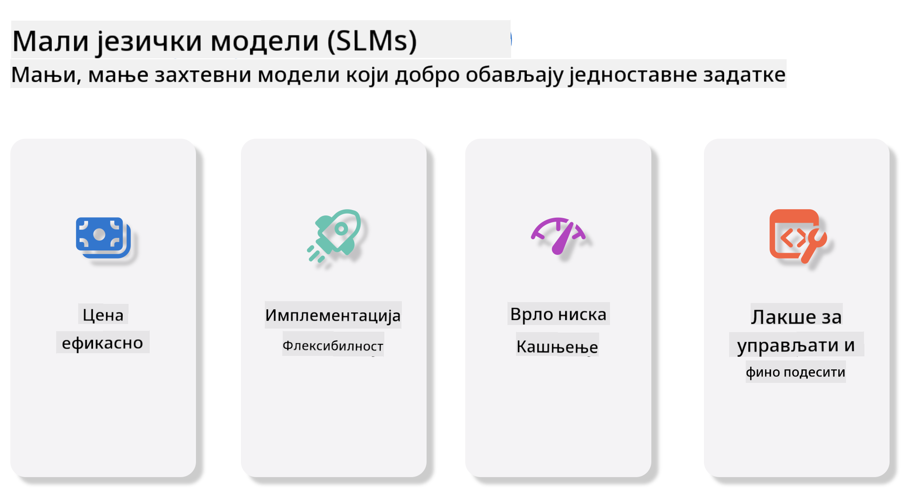
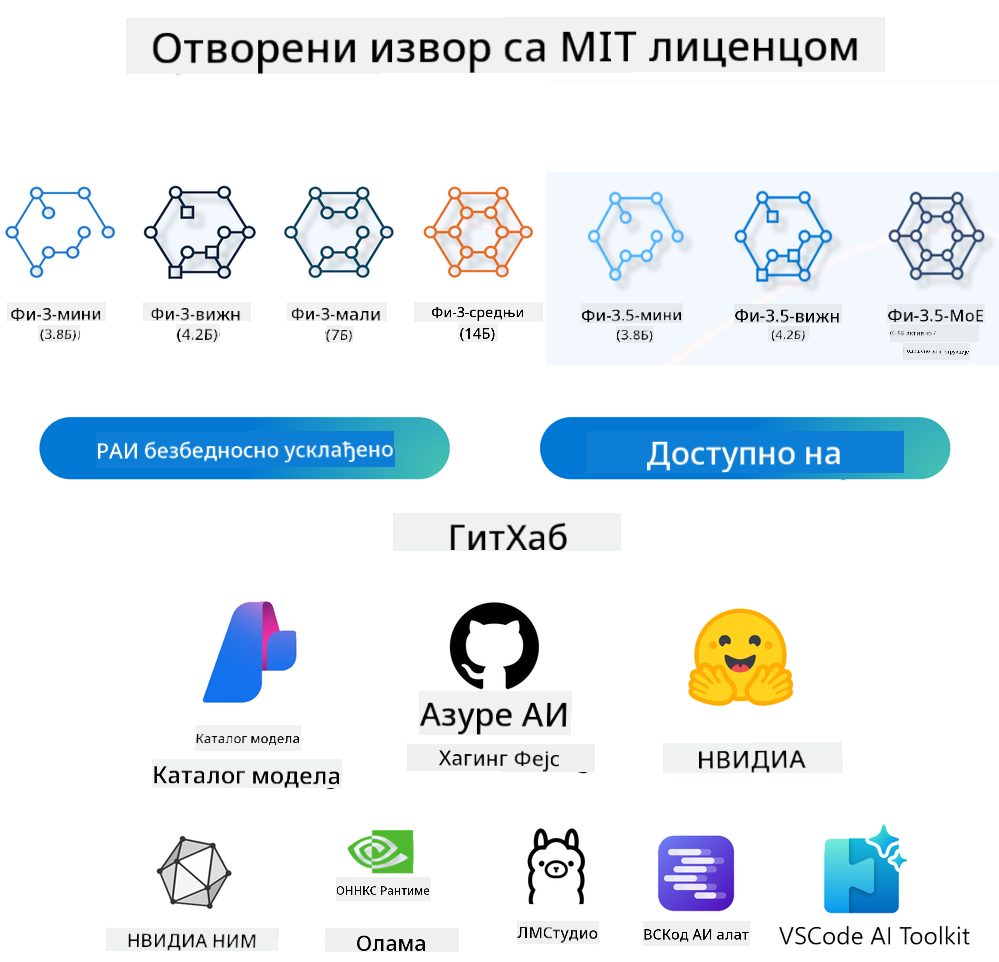

<!--
CO_OP_TRANSLATOR_METADATA:
{
  "original_hash": "124ad36cfe96f74038811b6e2bb93e9d",
  "translation_date": "2025-07-09T18:49:46+00:00",
  "source_file": "19-slm/README.md",
  "language_code": "sr"
}
-->
# Увод у мале језичке моделе за генеративну вештачку интелигенцију за почетнике  
Генеративна вештачка интелигенција је фасцинантна област вештачке интелигенције која се бави креирањем система способних да генеришу нови садржај. Тај садржај може бити текст, слике, музика, па чак и цела виртуелна окружења. Једна од најузбудљивијих примена генеративне вештачке интелигенције је у домену језичких модела.

## Шта су мали језички модели?  

Мали језички модел (SLM) представља смањену верзију великог језичког модела (LLM), користећи многе архитектонске принципе и технике LLM-ова, али са знатно мањим захтевима за рачунарским ресурсима.

SLM-ови су подскуп језичких модела дизајнираних да генеришу текст сличан људском. За разлику од већих модела као што је GPT-4, SLM-ови су компактнији и ефикаснији, што их чини идеалним за примене где су рачунарски ресурси ограничени. Иако мањи, они и даље могу обављати разне задатке. Обично се SLM-ови конструишу компресијом или дестилацијом LLM-ова, са циљем да задрже значајан део функционалности и језичких способности оригиналног модела. Овај смањени обим модела смањује укупну сложеност, чинећи SLM-ове ефикаснијим у погледу коришћења меморије и рачунарских захтева. Упркос овим оптимизацијама, SLM-ови могу обављати широк спектар задатака обраде природног језика (NLP):

- Генерисање текста: Креирање кохерентних и контекстуално релевантних реченица или пасуса.  
- Допуњавање текста: Предвиђање и допуњавање реченица на основу датог упита.  
- Превођење: Претварање текста са једног језика на други.  
- Сажимање: Скраћивање дугих текстова у краће, лакше разумљиве сажетке.

Иако уз одређене компромисе у перформансама или дубини разумевања у односу на веће моделе.

## Како раде мали језички модели?  
SLM-ови се обучавају на огромним количинама текстуалних података. Током обуке, уче се обрасци и структуре језика, што им омогућава да генеришу текст који је граматички исправан и контекстуално прикладан. Процес обуке обухвата:

- Прикупљање података: Сакупљање великих скупова текстова из различитих извора.  
- Предобрада: Чишћење и организовање података како би били погодни за обуку.  
- Обука: Коришћење алгоритама машинског учења за учење модела како да разуме и генерише текст.  
- Фино подешавање: Прилагођавање модела ради побољшања перформанси на специфичним задацима.

Развој SLM-ова одговара растућој потреби за моделима који се могу користити у окружењима са ограниченим ресурсима, као што су мобилни уређаји или edge computing платформе, где су велики LLM-ови често непрактични због великих захтева за ресурсима. Фокусирајући се на ефикасност, SLM-ови балансирају између перформанси и приступачности, омогућавајући широку примену у разним областима.



## Циљеви учења  

У овој лекцији желимо да упознамо концепт SLM-а и повежемо га са Microsoft Phi-3 како бисмо научили различите сценарије у текстуалном садржају, визуелним подацима и MoE.

До краја ове лекције требало би да будете у стању да одговорите на следећа питања:

- Шта је SLM  
- Која је разлика између SLM и LLM  
- Шта је Microsoft Phi-3/3.5 породица  
- Како извршити инференцију Microsoft Phi-3/3.5 породице

Спремни? Хајде да почнемо.

## Разлике између великих језичких модела (LLM) и малих језичких модела (SLM)  

И LLM и SLM се заснивају на основним принципима вероватноћног машинског учења, пратећи сличне приступе у архитектонском дизајну, методологијама обуке, процесима генерисања података и техникама процене модела. Међутим, неколико кључних фактора разликује ова два типа модела.

## Примене малих језичких модела  

SLM-ови имају широк спектар примена, укључујући:

- Четботове: Пружање корисничке подршке и интеракцију са корисницима у разговорном формату.  
- Креирање садржаја: Помоћ писцима у генерисању идеја или чак писању целих чланака.  
- Образовање: Помоћ студентима у писању задатака или учењу нових језика.  
- Приступачност: Креирање алата за особе са инвалидитетом, као што су системи за претварање текста у говор.

**Величина**  

Примарна разлика између LLM и SLM лежи у обиму модела. LLM-ови, као што је ChatGPT (GPT-4), могу имати око 1,76 трилиона параметара, док отворени SLM-ови као што је Mistral 7B имају знатно мање параметара — око 7 милијарди. Ова разлика произилази из архитектонских и процеса обуке. На пример, ChatGPT користи self-attention механизам у encoder-decoder архитектури, док Mistral 7B користи sliding window attention, што омогућава ефикаснију обуку у decoder-only моделу. Ова архитектонска разлика има значајан утицај на сложеност и перформансе модела.

**Разумевање**  

SLM-ови су обично оптимизовани за перформансе у специфичним доменима, што их чини веома специјализованим, али потенцијално ограниченим у пружању широког контекстуалног разумевања у више области знања. Насупрот томе, LLM-ови имају за циљ да симулирају људску интелигенцију на свеобухватнијем нивоу. Обучени на огромним и разноликим скуповима података, LLM-ови су дизајнирани да добро функционишу у разним доменима, нудећи већу свестраност и прилагодљивост. Због тога су LLM-ови погоднији за шире спектре задатака, као што су обрада природног језика и програмирање.

**Рачунарски ресурси**  

Обука и коришћење LLM-ова захтевају велике ресурсе, често укључујући огромне GPU кластерe. На пример, обука модела као што је ChatGPT од почетка може захтевати хиљаде GPU-а током дугог временског периода. С друге стране, SLM-ови са мањим бројем параметара су приступачнији у погледу рачунарских ресурса. Модели као Mistral 7B могу се обучавати и покретати на локалним машинама са умереним GPU капацитетом, иако обука и даље траје неколико сати на више GPU-а.

**Пристраност**  

Пристраност је познат проблем код LLM-ова, углавном због природе података за обуку. Ови модели често користе сирове, јавне податке са интернета, који могу недовољно или погрешно представљати одређене групе, уносити нетачне ознаке или одражавати језичке пристрасности узроковане дијалектима, географским варијацијама и граматичким правилима. Поред тога, сложеност LLM архитектуре може нежељено појачати пристрасност, која може остати непримећена без пажљивог фино подешавања. Са друге стране, SLM-ови, обучени на ограниченијим, доменски специфичним скуповима података, природно су мање подложни овим пристрасностима, иако нису потпуно имуни.

**Инференција**  

Мања величина SLM-ова даје им значајну предност у брзини инференције, омогућавајући ефикасно генерисање резултата на локалном хардверу без потребе за обимном паралелном обрадом. Насупрот томе, LLM-ови због своје величине и сложености често захтевају значајне паралелне рачунарске ресурсе да би постигли прихватљиво време одговора. Присуство више истовремених корисника додатно успорава време одговора LLM-ова, посебно када су распоређени у великом обиму.

Укратко, иако LLM и SLM деле основне принципе машинског учења, значајно се разликују по величини модела, захтевима за ресурсима, контекстуалном разумевању, подложности пристрасности и брзини инференције. Ове разлике одражавају њихову погодност за различите примене, при чему су LLM-ови свестранији али захтевају више ресурса, док SLM-ови нуде ефикасност у специфичним доменима уз смањене рачунарске захтеве.

***Note：У овом поглављу ћемо представити SLM користећи Microsoft Phi-3 / 3.5 као пример.***

## Представљање Phi-3 / Phi-3.5 породице  

Phi-3 / 3.5 породица је углавном усмерена на сценарије примене у тексту, визуелним подацима и Agent (MoE):

### Phi-3 / 3.5 Instruct  

Примарно за генерисање текста, допуњавање разговора и извлачење информација из садржаја.

**Phi-3-mini**  

Језички модел од 3.8 милијарди параметара доступан је на Microsoft Azure AI Studio, Hugging Face и Ollama. Phi-3 модели значајно надмашују језичке моделе исте или веће величине на кључним бенчмарковима (погледајте бројеве испод, већи бројеви су бољи). Phi-3-mini надмашује моделе двоструко веће величине, док Phi-3-small и Phi-3-medium надмашују веће моделе, укључујући GPT-3.5.

**Phi-3-small & medium**  

Са само 7 милијарди параметара, Phi-3-small побеђује GPT-3.5T на разним језичким, резоновањским, кодирачким и математичким бенчмарковима.

Phi-3-medium са 14 милијарди параметара наставља овај тренд и надмашује Gemini 1.0 Pro.

**Phi-3.5-mini**  

Можемо га посматрати као надоградњу Phi-3-mini. Иако број параметара остаје исти, побољшава подршку за више језика (подржава преко 20 језика: арапски, кинески, чешки, дански, холандски, енглески, фински, француски, немачки, хебрејски, мађарски, италијански, јапански, корејски, норвешки, пољски, португалски, руски, шпански, шведски, тајландски, турски, украјински) и додаје јачу подршку за дугачак контекст.

Phi-3.5-mini са 3.8 милијарди параметара надмашује језичке моделе исте величине и упоредив је са моделима двоструко већим.

### Phi-3 / 3.5 Vision  

Можемо посматрати Instruct модел Phi-3/3.5 као Phi-јеву способност разумевања, а Vision као очи које Phi-ју дају могућност да разуме свет.

**Phi-3-Vision**  

Phi-3-vision, са само 4.2 милијарде параметара, наставља овај тренд и надмашује веће моделе као што су Claude-3 Haiku и Gemini 1.0 Pro V у општим задацима визуелног резоновања, OCR-у и разумевању табела и дијаграма.

**Phi-3.5-Vision**  

Phi-3.5-Vision је такође надоградња Phi-3-Vision, додајући подршку за више слика. Можемо га посматрати као унапређење визије — не само да види слике, већ и видео записе.

Phi-3.5-vision надмашује веће моделе као што су Claude-3.5 Sonnet и Gemini 1.5 Flash у OCR-у, разумевању табела и графикона, и упоредив је у општим задацима визуелног резоновања. Подржава унос више кадрова, односно резоновање на више улазних слика.

### Phi-3.5-MoE  

***Mixture of Experts (MoE)*** омогућава моделима да се претренирају уз знатно мање рачунарских ресурса, што значи да можете драматично повећати величину модела или скуп података уз исти буџет као за густе моделе. Посебно, MoE модел треба да постигне исту квалитету као његов густ еквивалент много брже током претренирања.

Phi-3.5-MoE се састоји од 16x3.8B експертских модула. Phi-3.5-MoE са само 6.6 милијарди активних параметара постиже сличан ниво резоновања, разумевања језика и математике као много већи модели.

Можемо користити Phi-3/3.5 породицу модела у зависности од сценарија. За разлику од LLM, Phi-3/3.5-mini или Phi-3/3.5-Vision можете распоредити на edge уређајима.

## Како користити Phi-3/3.5 породицу модела  

Желимо да користимо Phi-3/3.5 у различитим сценаријима. У наставку ћемо применити Phi-3/3.5 у зависности од сценарија.



### Разлика у инференцији преко Cloud API-ја  

**GitHub Models**  

GitHub Models је најдиректнији начин. Можете брзо приступити Phi-3/3.5-Instruct моделу преко GitHub Models. У комбинацији са Azure AI Inference SDK / OpenAI SDK, можете приступити API-ју кроз код и извршити позив Phi-3/3.5-Instruct. Такође можете тестирати различите ефекте преко Playground-а.

- Демонстрација: Поређење ефеката Phi-3-mini и Phi-3.5-mini у кинеским сценаријима


**Azure AI Studio**  

Ако желите да користите vision и MoE моделе, можете користити Azure AI Studio за извршење позива. Ако сте заинтересовани, можете прочитати Phi-3 Cookbook да бисте научили како да позовете Phi-3/3.5 Instruct, Vision, MoE преко Azure AI Studio [Кликните овде](https://github.com/microsoft/Phi-3CookBook/blob/main/md/02.QuickStart/AzureAIStudio_QuickStart.md?WT.mc_id=academic-105485-koreyst)

**NVIDIA NIM**  

Поред
- **Безбедност и контрола:** Организације могу да задрже контролу над својим подацима и апликацијама тако што ће самостално хостовати NIM микросервисе на својој управљаној инфраструктури.
- **Стандардни API-ји:** NIM пружа индустријске стандардне API-је, што олакшава изградњу и интеграцију AI апликација као што су четботови, AI асистенти и други.

NIM је део NVIDIA AI Enterprise, који има за циљ да поједностави имплементацију и оперативизацију AI модела, обезбеђујући њихово ефикасно извођење на NVIDIA GPU-овима.

- Demo: Коришћење Nividia NIM за позив Phi-3.5-Vision-API  [[Кликните овде](../../../19-slm/python/Phi-3-Vision-Nividia-NIM.ipynb)]


### Инференција Phi-3/3.5 у локалном окружењу
Инференција у вези са Phi-3, или било којим језичким моделом као што је GPT-3, односи се на процес генерисања одговора или предвиђања на основу унетих података. Када дате упит или питање Phi-3, он користи свој обучени неуронски модел да изведе највероватнији и најрелевантнији одговор анализирајући обрасце и везе у подацима на којима је трениран.

**Hugging Face Transformer**  
Hugging Face Transformers је моћна библиотека намењена обради природног језика (NLP) и другим задацима машинског учења. Ево неколико кључних тачака о њој:

1. **Унапред обучени модели:** Пружа хиљаде унапред обучених модела који се могу користити за различите задатке као што су класификација текста, препознавање именованих ентитета, одговарање на питања, сажимање, превођење и генерисање текста.

2. **Интероперабилност оквира:** Библиотека подржава више оквира за дубоко учење, укључујући PyTorch, TensorFlow и JAX. Ово вам омогућава да обучите модел у једном оквиру и користите га у другом.

3. **Мултимодалне могућности:** Поред NLP-а, Hugging Face Transformers подржава и задатке из области рачунарског вида (нпр. класификација слика, детекција објеката) и обраде звука (нпр. препознавање говора, класификација звука).

4. **Једноставност коришћења:** Библиотека нуди API-је и алате за лако преузимање и фино подешавање модела, што је приступачно и почетницима и стручњацима.

5. **Заједница и ресурси:** Hugging Face има живу заједницу и обимну документацију, туторијале и водиче који помажу корисницима да почну и максимално искористе библиотеку.  
[званична документација](https://huggingface.co/docs/transformers/index?WT.mc_id=academic-105485-koreyst) или њихов [GitHub репозиторијум](https://github.com/huggingface/transformers?WT.mc_id=academic-105485-koreyst).

Ово је најчешће коришћена метода, али захтева GPU акцелерацију. На крају крајева, сцене као што су Vision и MoE захтевају много рачунања, што ће бити веома ограничено на CPU-у ако нису квантовани.

- Demo: Коришћење Transformer-а за позив Phi-3.5-Instuct [Кликните овде](../../../19-slm/python/phi35-instruct-demo.ipynb)

- Demo: Коришћење Transformer-а за позив Phi-3.5-Vision [Кликните овде](../../../19-slm/python/phi35-vision-demo.ipynb)

- Demo: Коришћење Transformer-а за позив Phi-3.5-MoE [Кликните овде](../../../19-slm/python/phi35_moe_demo.ipynb)

**Ollama**  
[Ollama](https://ollama.com/?WT.mc_id=academic-105485-koreyst) је платформа дизајнирана да олакша покретање великих језичких модела (LLM) локално на вашем рачунару. Подржава различите моделе као што су Llama 3.1, Phi 3, Mistral и Gemma 2, између осталих. Платформа поједностављује процес тако што пакује тежине модела, конфигурацију и податке у један пакет, чинећи га приступачнијим за кориснике који желе да прилагоде и креирају своје моделе. Ollama је доступна за macOS, Linux и Windows. Одличан је алат ако желите да експериментишете или имплементирате LLM без ослањања на облачне услуге. Ollama је најдиректнији начин, потребно је само да извршите следећу наредбу.

```bash

ollama run phi3.5

```


**ONNX Runtime за GenAI**

[ONNX Runtime](https://github.com/microsoft/onnxruntime-genai?WT.mc_id=academic-105485-koreyst) је мултиплатформски акцелератор за инференцију и тренирање машинског учења. ONNX Runtime за Generative AI (GENAI) је моћан алат који вам помаже да ефикасно покрећете генеративне AI моделе на различитим платформама.

## Шта је ONNX Runtime?  
ONNX Runtime је пројекат отвореног кода који омогућава високе перформансе инференције машинских модела. Подржава моделе у Open Neural Network Exchange (ONNX) формату, који је стандард за представљање машинских модела. ONNX Runtime инференција може омогућити брже корисничко искуство и ниже трошкове, подржавајући моделе из дубоких оквира као што су PyTorch и TensorFlow/Keras, као и класичне библиотеке машинског учења као што су scikit-learn, LightGBM, XGBoost и друге. ONNX Runtime је компатибилан са различитим хардвером, драјверима и оперативним системима, и пружа оптималне перформансе коришћењем хардверских акцелератора где је то могуће, уз оптимизације графа и трансформације.

## Шта је генеративни AI?  
Генеративни AI се односи на AI системе који могу да генеришу нови садржај, као што су текст, слике или музика, на основу података на којима су тренирани. Примери укључују језичке моделе као што је GPT-3 и моделе за генерисање слика као што је Stable Diffusion. ONNX Runtime за GenAI библиотека пружа генеративни AI циклус за ONNX моделе, укључујући инференцију са ONNX Runtime, обраду логита, претрагу и узорковање, као и управљање KV кешом.

## ONNX Runtime за GENAI  
ONNX Runtime за GENAI проширује могућности ONNX Runtime-а како би подржао генеративне AI моделе. Ево неких кључних карактеристика:

- **Широка подршка платформи:** Ради на различитим платформама, укључујући Windows, Linux, macOS, Android и iOS.
- **Подршка модела:** Подржава многе популарне генеративне AI моделе, као што су LLaMA, GPT-Neo, BLOOM и други.
- **Оптимизација перформанси:** Укључује оптимизације за различите хардверске акцелераторе као што су NVIDIA GPU-ови, AMD GPU-ови и други.
- **Једноставност коришћења:** Пружа API-је за лаку интеграцију у апликације, омогућавајући генерисање текста, слика и другог садржаја уз минималан код.
- Корисници могу позвати високонапонски generate() метод, или покретати сваку итерацију модела у петљи, генеришући по један токен у исто време, уз опционално ажурирање параметара генерације унутар петље.
- ONNX runtime такође подржава greedy/beam претрагу и TopP, TopK узорковање за генерисање секвенци токена и уграђену обраду логита као што су казне за понављање. Лако можете додати и прилагођено оцењивање.

## Како почети  
Да бисте почели са ONNX Runtime за GENAI, следите ове кораке:

### Инсталирајте ONNX Runtime:  
```Python
pip install onnxruntime
```  
### Инсталирајте Generative AI екстензије:  
```Python
pip install onnxruntime-genai
```

### Покрените модел: Ево једноставног примера у Python-у:  
```Python
import onnxruntime_genai as og

model = og.Model('path_to_your_model.onnx')

tokenizer = og.Tokenizer(model)

input_text = "Hello, how are you?"

input_tokens = tokenizer.encode(input_text)

output_tokens = model.generate(input_tokens)

output_text = tokenizer.decode(output_tokens)

print(output_text) 
```  
### Demo: Коришћење ONNX Runtime GenAI за позив Phi-3.5-Vision

```python

import onnxruntime_genai as og

model_path = './Your Phi-3.5-vision-instruct ONNX Path'

img_path = './Your Image Path'

model = og.Model(model_path)

processor = model.create_multimodal_processor()

tokenizer_stream = processor.create_stream()

text = "Your Prompt"

prompt = "<|user|>\n"

prompt += "<|image_1|>\n"

prompt += f"{text}<|end|>\n"

prompt += "<|assistant|>\n"

image = og.Images.open(img_path)

inputs = processor(prompt, images=image)

params = og.GeneratorParams(model)

params.set_inputs(inputs)

params.set_search_options(max_length=3072)

generator = og.Generator(model, params)

while not generator.is_done():

    generator.compute_logits()
    
    generator.generate_next_token()

    new_token = generator.get_next_tokens()[0]
    
    code += tokenizer_stream.decode(new_token)
    
    print(tokenizer_stream.decode(new_token), end='', flush=True)

```


**Остало**

Поред ONNX Runtime и Ollama референтних метода, можемо такође комплетирати референцу квантитативних модела на основу метода које пружају различити произвођачи. Као што су Apple MLX фрејмворк са Apple Metal, Qualcomm QNN са NPU, Intel OpenVINO са CPU/GPU и други. Више садржаја можете пронаћи у [Phi-3 Cookbook](https://github.com/microsoft/phi-3cookbook?WT.mc_id=academic-105485-koreyst).

## Више

Учили смо основе Phi-3/3.5 породице, али да бисмо сазнали више о SLM потребно је више знања. Одговоре можете пронаћи у Phi-3 Cookbook-у. Ако желите да сазнате више, посетите [Phi-3 Cookbook](https://github.com/microsoft/phi-3cookbook?WT.mc_id=academic-105485-koreyst).

**Одрицање од одговорности**:  
Овај документ је преведен коришћењем AI услуге за превођење [Co-op Translator](https://github.com/Azure/co-op-translator). Иако се трудимо да превод буде тачан, молимо вас да имате у виду да аутоматски преводи могу садржати грешке или нетачности. Оригинални документ на његовом изворном језику треба сматрати ауторитетним извором. За критичне информације препоручује се професионални људски превод. Нисмо одговорни за било каква неспоразума или погрешна тумачења која произилазе из коришћења овог превода.