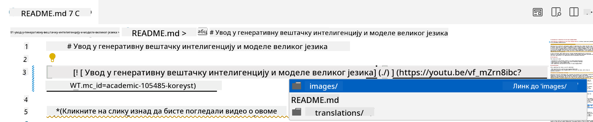
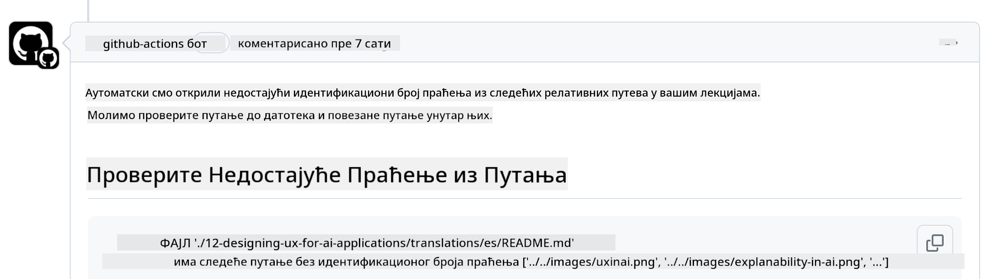
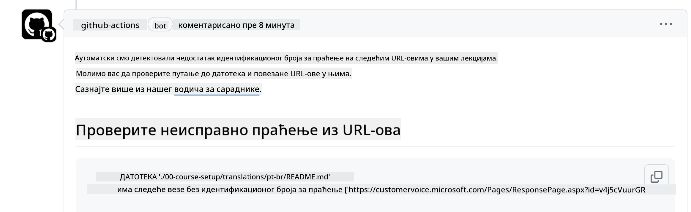
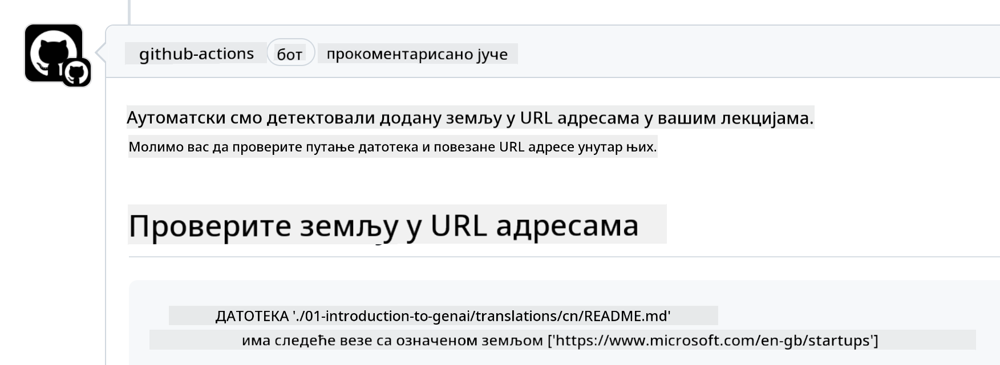

<!--
CO_OP_TRANSLATOR_METADATA:
{
  "original_hash": "57c41f2af71001a2cff9d8eb797cb843",
  "translation_date": "2025-05-19T11:26:07+00:00",
  "source_file": "CONTRIBUTING.md",
  "language_code": "sr"
}
-->
# Doprinos

Ovaj projekat pozdravlja doprinose i sugestije. Većina doprinosa zahteva da se složite sa Sporazumom o licenci za doprinose (CLA) koji potvrđuje da imate pravo da nam ustupite prava na korišćenje vašeg doprinosa. Za detalje posetite <https://cla.microsoft.com>.

> Važno: kada prevodite tekst u ovom repozitorijumu, molimo vas da ne koristite mašinski prevod. Verifikovaćemo prevode putem zajednice, pa se prijavite za prevode samo na jezike koje dobro poznajete.

Kada podnesete pull request, CLA-bot će automatski utvrditi da li treba da obezbedite CLA i adekvatno ukrasiti PR (npr. oznaka, komentar). Jednostavno pratite instrukcije koje vam bot daje. Ovo ćete morati da uradite samo jednom za sve repozitorijume koji koriste naš CLA.

## Pravila ponašanja

Ovaj projekat je usvojio [Microsoftov Kodeks ponašanja za otvoreni kod](https://opensource.microsoft.com/codeofconduct/?WT.mc_id=academic-105485-koreyst).
Za više informacija pročitajte [FAQ o kodeksu ponašanja](https://opensource.microsoft.com/codeofconduct/faq/?WT.mc_id=academic-105485-koreyst) ili kontaktirajte [opencode@microsoft.com](mailto:opencode@microsoft.com) za bilo kakva dodatna pitanja ili komentare.

## Pitanja ili problemi?

Molimo vas da ne otvarate GitHub probleme za opšta pitanja podrške, jer GitHub lista treba da se koristi za zahteve za funkcionalnosti i prijave grešaka. Na taj način možemo lakše pratiti stvarne probleme ili greške iz koda i držati opštu diskusiju odvojenu od samog koda.

## Greške u kucanju, problemi, greške i doprinosi

Kad god podnosite bilo kakve promene u Generative AI for Beginners repozitorijumu, molimo vas da pratite ove preporuke.

* Uvek forkujte repozitorijum na svoj nalog pre nego što napravite izmene
* Ne kombinujte više promena u jedan pull request. Na primer, podnesite bilo koju ispravku grešaka i ažuriranja dokumentacije koristeći odvojene PR-ove
* Ako vaš pull request pokazuje konflikte prilikom spajanja, pobrinite se da ažurirate lokalni main da bude ogledalo onoga što je u glavnom repozitorijumu pre nego što napravite izmene
* Ako podnosite prevod, molimo vas da napravite jedan PR za sve prevedene fajlove jer ne prihvatamo delimične prevode sadržaja
* Ako podnosite ispravku greške u kucanju ili dokumentaciji, možete kombinovati izmene u jedan PR gde je to prikladno

## Opšte smernice za pisanje

- Pobrinite se da svi vaši URL-ovi budu obuhvaćeni uglastim zagradama, a zatim zagradama bez dodatnih razmaka oko njih ili unutar njih ``.
- Pobrinite se da bilo koji relativni link (tj. linkovi ka drugim fajlovima i folderima u repozitorijumu) počinje sa `./` koji se odnosi na fajl ili folder lociran u trenutnom radnom direktorijumu ili `../` koji se odnosi na fajl ili folder lociran u nadređenom radnom direktorijumu.
- Pobrinite se da bilo koji relativni link (tj. linkovi ka drugim fajlovima i folderima u repozitorijumu) ima ID za praćenje (tj. `?` ili `&` zatim `wt.mc_id=` ili `WT.mc_id=`) na kraju.
- Pobrinite se da bilo koji URL sa sledećih domena _github.com, microsoft.com, visualstudio.com, aka.ms, i azure.com_ ima ID za praćenje (tj. `?` ili `&` zatim `wt.mc_id=` ili `WT.mc_id=`) na kraju.
- Pobrinite se da vaši linkovi nemaju specifičnu lokalizaciju zemlje u njima (tj. `/en-us/` ili `/en/`).
- Pobrinite se da su sve slike smeštene u `./images` folder.
- Pobrinite se da slike imaju opisne nazive koristeći engleske karaktere, brojeve i crtice u nazivu slike.

## GitHub tokovi rada

Kada podnesete pull request, četiri različita toka rada će biti pokrenuta da validiraju prethodna pravila.
Jednostavno pratite instrukcije navedene ovde da biste prošli provere tokova rada.

- [Proveri neispravne relativne putanje](../..)
- [Proveri putanje imaju praćenje](../..)
- [Proveri URL-ove imaju praćenje](../..)
- [Proveri URL-ovi nemaju lokalizaciju](../..)

### Proveri neispravne relativne putanje

Ovaj tok rada osigurava da bilo koja relativna putanja u vašim fajlovima funkcioniše.
Ovaj repozitorijum je postavljen na GitHub stranice pa morate biti veoma pažljivi kada kucate linkove koji povezuju sve da ne usmerite nikoga na pogrešno mesto.

Da biste se uverili da vaši linkovi pravilno funkcionišu, jednostavno koristite VS kod da proverite to.

Na primer, kada pređete preko bilo kog linka u vašim fajlovima, biće vam ponuđeno da pratite link pritiskom na **ctrl + klik**

Ako kliknete na link i ne funkcioniše lokalno, onda će sigurno pokrenuti tok rada i neće raditi na GitHub-u.

Da biste rešili ovaj problem, pokušajte da ukucate link uz pomoć VS koda.

Kada kucate `./` ili `../` VS kod će vam ponuditi da izaberete iz dostupnih opcija prema onome što ste ukucali.

Pratite putanju klikom na željeni fajl ili folder i bićete sigurni da vaša putanja nije neispravna.

Kada dodate ispravnu relativnu putanju, sačuvajte i pošaljite svoje izmene, tok rada će ponovo biti pokrenut da verifikuje vaše izmene.
Ako prođete proveru, onda ste spremni.

### Proveri putanje imaju praćenje

Ovaj tok rada osigurava da bilo koja relativna putanja ima praćenje u njoj.
Ovaj repozitorijum je postavljen na GitHub stranice pa moramo pratiti kretanje između različitih fajlova i foldera.

Da biste se uverili da vaše relativne putanje imaju praćenje u njima, jednostavno proverite sledeći tekst `?wt.mc_id=` na kraju putanje.
Ako je dodato vašim relativnim putanjama, onda ćete proći ovu proveru.

Ako nije, možete dobiti sledeću grešku.

Da biste rešili ovaj problem, pokušajte da otvorite putanju fajla koju je tok rada istakao i dodajte ID za praćenje na kraj relativnih putanja.

Kada dodate ID za praćenje, sačuvajte i pošaljite svoje izmene, tok rada će ponovo biti pokrenut da verifikuje vaše izmene.
Ako prođete proveru, onda ste spremni.

### Proveri URL-ove imaju praćenje

Ovaj tok rada osigurava da bilo koji web URL ima praćenje u njemu.
Ovaj repozitorijum je dostupan svima pa morate biti sigurni da pratite pristup da biste znali odakle dolazi saobraćaj.

Da biste se uverili da vaši URL-ovi imaju praćenje u njima, jednostavno proverite sledeći tekst `?wt.mc_id=` na kraju URL-a.
Ako je dodato vašim URL-ovima, onda ćete proći ovu proveru.

Ako nije, možete dobiti sledeću grešku.

Da biste rešili ovaj problem, pokušajte da otvorite putanju fajla koju je tok rada istakao i dodajte ID za praćenje na kraj URL-ova.

Kada dodate ID za praćenje, sačuvajte i pošaljite svoje izmene, tok rada će ponovo biti pokrenut da verifikuje vaše izmene.
Ako prođete proveru, onda ste spremni.

### Proveri URL-ovi nemaju lokalizaciju

Ovaj tok rada osigurava da bilo koji web URL nema specifičnu lokalizaciju zemlje u njemu.
Ovaj repozitorijum je dostupan svima širom sveta pa morate biti sigurni da ne uključujete lokalizaciju vaše zemlje u URL-ove.

Da biste se uverili da vaši URL-ovi nemaju lokalizaciju zemlje u njima, jednostavno proverite sledeći tekst `/en-us/` ili `/en/` ili bilo koju drugu jezičku lokalizaciju bilo gde u URL-u.
Ako nije prisutno u vašim URL-ovima, onda ćete proći ovu proveru.

Ako nije, možete dobiti sledeću grešku.

Da biste rešili ovaj problem, pokušajte da otvorite putanju fajla koju je tok rada istakao i uklonite lokalizaciju zemlje iz URL-ova.

Kada uklonite lokalizaciju zemlje, sačuvajte i pošaljite svoje izmene, tok rada će ponovo biti pokrenut da verifikuje vaše izmene.
Ako prođete proveru, onda ste spremni.

Čestitamo! Javićemo vam se čim pre sa povratnim informacijama o vašem doprinosu.

**Ограничење одговорности**:  
Овај документ је преведен коришћењем AI услуге за превођење [Co-op Translator](https://github.com/Azure/co-op-translator). Иако се трудимо да обезбедимо тачност, молимо вас да будете свесни да аутоматски преводи могу садржати грешке или нетачности. Оригинални документ на његовом изворном језику треба сматрати ауторитативним извором. За критичне информације, препоручује се професионални превод од стране људи. Не сносимо одговорност за било какве неспоразуме или погрешна тумачења која проистичу из коришћења овог превода.