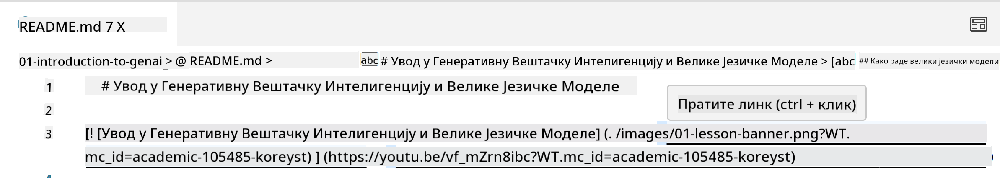
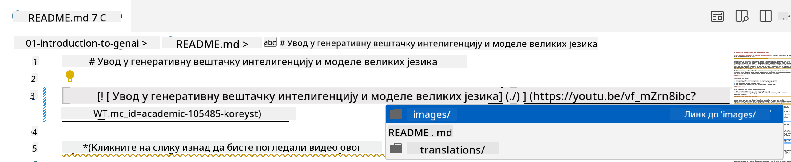
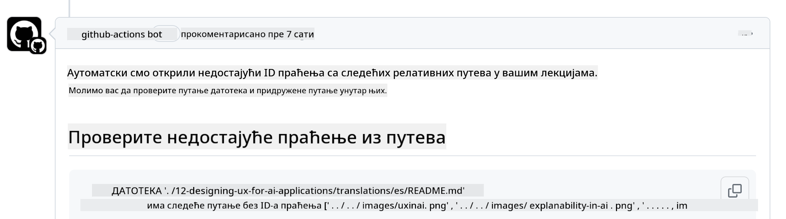
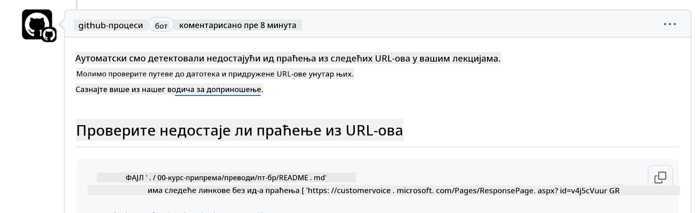
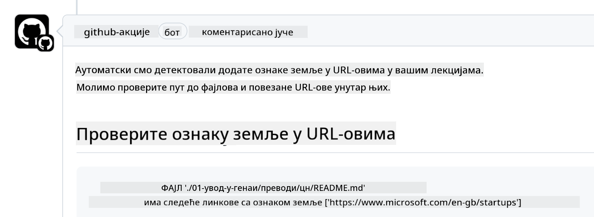

<!--
CO_OP_TRANSLATOR_METADATA:
{
  "original_hash": "57c41f2af71001a2cff9d8eb797cb843",
  "translation_date": "2025-06-25T07:20:50+00:00",
  "source_file": "CONTRIBUTING.md",
  "language_code": "sr"
}
-->
# Доприноси

Овај пројекат поздравља доприносе и предлоге. Већина доприноса захтева да се сагласите са Споразумом о лиценци за доприносиоце (CLA) који изјављује да имате право да нам дате права да користимо ваш допринос. За детаље, посетите <https://cla.microsoft.com>.

> Важно: када преводите текст у овом репозиторијуму, молимо вас да не користите машински превод. Проверићемо преводе преко заједнице, па вас молимо да се добровољно пријавите за преводе на језике на којима сте вешти.

Када пошаљете захтев за повлачење, CLA-бот ће аутоматски одредити да ли треба да обезбедите CLA и одговарајуће означити PR (нпр. етикета, коментар). Једноставно следите упутства која пружа бот. Ово ћете морати да урадите само једном за све репозиторијуме који користе наш CLA.

## Кодекс понашања

Овај пројекат је усвојио [Microsoft Open Source Кодекс понашања](https://opensource.microsoft.com/codeofconduct/?WT.mc_id=academic-105485-koreyst). За више информација прочитајте [Честа питања о кодексу понашања](https://opensource.microsoft.com/codeofconduct/faq/?WT.mc_id=academic-105485-koreyst) или контактирајте [opencode@microsoft.com](mailto:opencode@microsoft.com) са било каквим додатним питањима или коментарима.

## Питање или проблем?

Молимо вас да не отварате GitHub проблеме за општа питања подршке, јер би листа GitHub-а требало да се користи за захтеве за функције и извештаје о грешкама. На овај начин можемо лакше пратити стварне проблеме или грешке из кода и одвојити општу дискусију од самог кода.

## Грешке у куцању, проблеми, грешке и доприноси

Када год подносите било какве промене у репозиторијуму Generative AI for Beginners, молимо вас да следите ове препоруке.

* Увек форкујте репозиторијум на свој налог пре него што извршите измене
* Не комбинујте више измена у један захтев за повлачење. На пример, пошаљите било које исправке грешака и ажурирања документације користећи засебне PR-ове
* Ако ваш захтев за повлачење показује конфликте спајања, уверите се да ажурирате свој локални main да буде огледало онога што је у главном репозиторијуму пре него што извршите измене
* Ако подносите превод, молимо вас да креирате један PR за све преведене датотеке јер не прихватамо делимичне преводе садржаја
* Ако подносите исправку грешке у куцању или документацији, можете комбиновати измене у један PR где је то прикладно

## Опште смернице за писање

- Уверите се да су сви ваши URL-ови у заградама праћени заградама без додатних размакa око њих или унутар њих ``.
- Уверите се да сваки релативни линк (тј. линкови ка другим датотекама и фасциклама у репозиторијуму) почиње са `./` који се односи на датотеку или фасциклу која се налази у тренутном радном директоријуму или `../` који се односи на датотеку или фасциклу која се налази у надређеном радном директоријуму.
- Уверите се да сваки релативни линк (тј. линкови ка другим датотекама и фасциклама у репозиторијуму) има идентификатор праћења (тј. `?` или `&` па `wt.mc_id=` или `WT.mc_id=`) на крају.
- Уверите се да сваки URL из следећих домена _github.com, microsoft.com, visualstudio.com, aka.ms, и azure.com_ има идентификатор праћења (тј. `?` или `&` па `wt.mc_id=` или `WT.mc_id=`) на крају.
- Уверите се да ваши линкови немају специфичне локале земље у њима (тј. `/en-us/` или `/en/`).
- Уверите се да су све слике смештене у фасцикли `./images`.
- Уверите се да слике имају описне називе користећи енглеске карактере, бројеве и цртице у имену ваше слике.

## GitHub Радни токови

Када пошаљете захтев за повлачење, четири различита радна тока ће бити покренута да верификују претходна правила. Једноставно следите упутства наведена овде да прођете провере радног тока.

- [Проверите неисправне релативне путеве](../..)
- [Проверите да ли путеви имају праћење](../..)
- [Проверите да ли URL-ови имају праћење](../..)
- [Проверите да URL-ови немају локалитет](../..)

### Проверите неисправне релативне путеве

Овај радни ток осигурава да било који релативни пут у вашим датотекама функционише. Овај репозиторијум је објављен на GitHub страницама, па морате бити веома пажљиви када куцате линкове који све повезују како не бисте никога усмерили на погрешно место.

Да бисте били сигурни да ваши линкови исправно раде, једноставно користите VS код да проверите то.

На пример, када пређете курсором преко било ког линка у вашим датотекама, бићете упитани да пратите линк притиском на **ctrl + клик**

Ако кликнете на линк и он не ради локално, онда ће сигурно покренути радни ток и неће радити на GitHub-у.

Да бисте решили овај проблем, покушајте да укуцате линк уз помоћ VS кода.

Када укуцате `./` или `../`, VS код ће вас упитати да изаберете из доступних опција према ономе што сте укуцали.

Пратите пут кликом на жељену датотеку или фасциклу и бићете сигурни да ваш пут није неисправан.

Када додате исправан релативни пут, сачувајте и пошаљите ваше промене, радни ток ће поново бити покренут да верификује ваше промене. Ако прођете проверу, онда сте спремни.

### Проверите да ли путеви имају праћење

Овај радни ток осигурава да било који релативни пут има праћење у њему. Овај репозиторијум је објављен на GitHub страницама, па морамо пратити кретање између различитих датотека и фасцикли.

Да бисте били сигурни да ваши релативни путеви имају праћење у њима, једноставно проверите следећи текст `?wt.mc_id=` на крају пута. Ако је додат вашим релативним путевима, онда ћете проћи ову проверу.

Ако није, можда ћете добити следећу грешку.

Да бисте решили овај проблем, покушајте да отворите путању датотеке коју је радни ток истакао и додате идентификатор праћења на крај релативних путева.

Када додате идентификатор праћења, сачувајте и пошаљите ваше промене, радни ток ће поново бити покренут да верификује ваше промене. Ако прођете проверу, онда сте спремни.

### Проверите да ли URL-ови имају праћење

Овај радни ток осигурава да било који веб URL има праћење у њему. Овај репозиторијум је доступан свима, па морате бити сигурни да пратите приступ да бисте знали одакле долази саобраћај.

Да бисте били сигурни да ваши URL-ови имају праћење у њима, једноставно проверите следећи текст `?wt.mc_id=` на крају URL-а. Ако је додат вашим URL-овима, онда ћете проћи ову проверу.

Ако није, можда ћете добити следећу грешку.

Да бисте решили овај проблем, покушајте да отворите путању датотеке коју је радни ток истакао и додате идентификатор праћења на крај URL-ова.

Када додате идентификатор праћења, сачувајте и пошаљите ваше промене, радни ток ће поново бити покренут да верификује ваше промене. Ако прођете проверу, онда сте спремни.

### Проверите да URL-ови немају локалитет

Овај радни ток осигурава да било који веб URL нема специфичан локалитет земље у њему. Овај репозиторијум је доступан свима широм света, па морате бити сигурни да не укључујете локалитет своје земље у URL-ове.

Да бисте били сигурни да ваши URL-ови немају локалитет земље у њима, једноставно проверите следећи текст `/en-us/` или `/en/` или било који други језички локалитет било где у URL-у. Ако није присутан у вашим URL-овима, онда ћете проћи ову проверу.

Ако није, можда ћете добити следећу грешку.

Да бисте решили овај проблем, покушајте да отворите путању датотеке коју је радни ток истакао и уклоните локалитет земље из URL-ова.

Када уклоните локалитет земље, сачувајте и пошаљите ваше промене, радни ток ће поново бити покренут да верификује ваше промене. Ако прођете проверу, онда сте спремни.

Честитамо! Јавићемо вам се што је пре могуће са повратним информацијама о вашем доприносу.

**Одрицање од одговорности**:  
Овај документ је преведен коришћењем AI услуге превођења [Co-op Translator](https://github.com/Azure/co-op-translator). Иако тежимо тачности, молимо вас да будете свесни да аутоматизовани преводи могу садржати грешке или нетачности. Оригинални документ на његовом изворном језику треба сматрати меродавним извором. За критичне информације, препоручује се професионални превод од стране људи. Не сносимо одговорност за било каква неспоразума или погрешна тумачења која произилазе из коришћења овог превода.