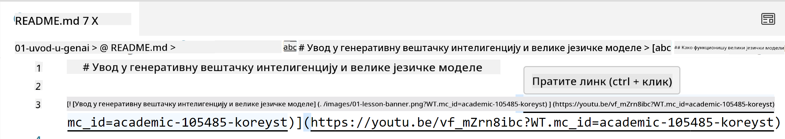
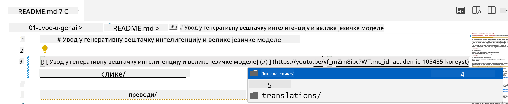
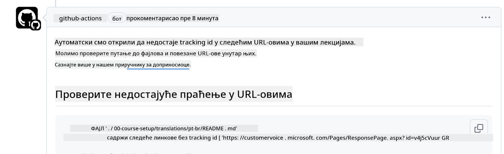
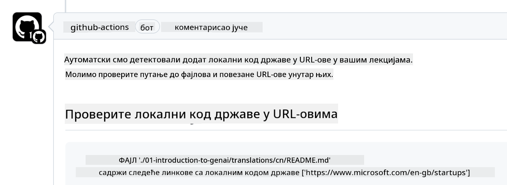

<!--
CO_OP_TRANSLATOR_METADATA:
{
  "original_hash": "57c41f2af71001a2cff9d8eb797cb843",
  "translation_date": "2025-07-09T06:13:07+00:00",
  "source_file": "CONTRIBUTING.md",
  "language_code": "sr"
}
-->
# Допринос

Овај пројекат поздравља доприносе и предлоге. Већина доприноса захтева да се сложите са Уговором о лиценци за доприносе (CLA) којим изјављујете да имате право и заиста нам дајете права да користимо ваш допринос. За детаље посетите <https://cla.microsoft.com>.

> Важно: приликом превођења текста у овом репозиторијуму, молимо вас да не користите машински превод. Преводе ће проверити заједница, па се пријављујте само за преводе на језике које добро познајете.

Када пошаљете pull request, CLA-bot ће аутоматски одредити да ли је потребно да доставите CLA и одговарајуће означити PR (нпр. ознака, коментар). Једноставно пратите упутства бота. Ово ћете морати урадити само једном за све репозиторијуме који користе наш CLA.

## Кодекс понашања

Овај пројекат је усвојио [Microsoft Open Source Code of Conduct](https://opensource.microsoft.com/codeofconduct/?WT.mc_id=academic-105485-koreyst).
За више информација прочитајте [Code of Conduct FAQ](https://opensource.microsoft.com/codeofconduct/faq/?WT.mc_id=academic-105485-koreyst) или контактирајте [opencode@microsoft.com](mailto:opencode@microsoft.com) за додатна питања или коментаре.

## Питање или проблем?

Молимо вас да не отварате GitHub issues за општа питања подршке јер се листа на GitHub-у користи за захтеве за нове функције и пријаве грешака. На овај начин лакше пратимо стварне проблеме или грешке у коду и одржавамо општу дискусију одвојеном од самог кода.

## Типографске грешке, проблеми, багови и доприноси

Када шаљете измене у репозиторијум Generative AI for Beginners, молимо вас да пратите следеће препоруке.

* Увек направите fork репозиторијума на свој налог пре него што направите измене
* Не комбинујте више промена у један pull request. На пример, пошаљите исправке багова и ажурирања документације у посебним PR-овима
* Ако ваш pull request показује конфликте приликом спајања, обавезно ажурирајте свој локални main да буде огледало онога што је у главном репозиторијуму пре него што направите измене
* Ако шаљете превод, молимо вас да направите један PR за све преведене фајлове јер не прихватамо делимичне преводе садржаја
* Ако шаљете исправку типографске грешке или документације, можете комбиновати измене у један PR где је то прикладно

## Општа упутства за писање

- Уверите се да су сви ваши URL-ови обавијени у угластим заградама, а затим у заградама без додатних размакa око или унутар њих ``.
- Уверите се да сваки релативни линк (нпр. линкови ка другим фајловима и фасциклама у репозиторијуму) почиње са `./` који се односи на фајл или фасциклу у тренутном радном директоријуму или са `../` који се односи на фајл или фасциклу у родитељском радном директоријуму.
- Уверите се да сваки релативни линк има на крају ID за праћење (нпр. `?` или `&` па `wt.mc_id=` или `WT.mc_id=`).
- Уверите се да сваки URL са следећих домена _github.com, microsoft.com, visualstudio.com, aka.ms, и azure.com_ има на крају ID за праћење (нпр. `?` или `&` па `wt.mc_id=` или `WT.mc_id=`).
- Уверите се да ваши линкови немају локализацију специфичну за земљу (нпр. `/en-us/` или `/en/`).
- Уверите се да су све слике смештене у фасциклу `./images`.
- Уверите се да слике имају описна имена користећи енглеска слова, бројеве и цртице у имену слике.

## GitHub Workflows

Када пошаљете pull request, покренуће се четири различита workflow-а да провере претходна правила.
Једноставно пратите упутства наведена овде да бисте прошли проверу workflow-а.

- [Провера покварених релативних путања](../..)
- [Провера да путање имају праћење](../..)
- [Провера да URL-ови имају праћење](../..)
- [Провера да URL-ови немају локализацију](../..)

### Провера покварених релативних путања

Овај workflow осигурава да свака релативна путања у вашим фајловима ради.
Овај репозиторијум је постављен на GitHub pages па морате бити веома пажљиви када куцате линкове који све повезују да не бисте упутили некога на погрешно место.

Да бисте били сигурни да ваши линкови раде исправно, једноставно користите VS code за проверу.

На пример, када пређете курсором преко било ког линка у вашим фајловима, биће вам понуђено да пратите линк притиском на **ctrl + клик**

Ако кликнете на линк и он не ради локално, сигурно ће покренути workflow и неће радити на GitHub-у.

Да бисте решили овај проблем, покушајте да куцате линк уз помоћ VS code-а.

Када куцате `./` или `../`, VS code ће вам понудити опције у складу са тим што сте куцали.

Пратите путању кликом на жељени фајл или фасциклу и бићете сигурни да ваша путања није покварена.

Када додате исправну релативну путању, сачувајте и пошаљите измене, workflow ће поново бити покренут да провери ваше измене.
Ако прођете проверу, спремни сте.

### Провера да путање имају праћење

Овај workflow осигурава да свака релативна путања има праћење.
Овај репозиторијум је постављен на GitHub pages па морамо пратити кретање између различитих фајлова и фасцикли.

Да бисте били сигурни да ваше релативне путање имају праћење, једноставно проверите да ли се на крају путање налази текст `?wt.mc_id=`.
Ако је додат на ваше релативне путање, проћи ћете ову проверу.

У супротном, можете добити следећу грешку.

Да бисте решили овај проблем, отворите фајл који је workflow означио и додајте ID за праћење на крај релативних путања.

Када додате ID за праћење, сачувајте и пошаљите измене, workflow ће поново бити покренут да провери ваше измене.
Ако прођете проверу, спремни сте.

### Провера да URL-ови имају праћење

Овај workflow осигурава да сваки веб URL има праћење.
Овај репозиторијум је доступан свима па морате бити сигурни да пратите приступ да бисте знали одакле долази саобраћај.

Да бисте били сигурни да ваши URL-ови имају праћење, једноставно проверите да ли се на крају URL-а налази текст `?wt.mc_id=`.
Ако је додат вашим URL-овима, проћи ћете ову проверу.

У супротном, можете добити следећу грешку.

Да бисте решили овај проблем, отворите фајл који је workflow означио и додајте ID за праћење на крај URL-ова.

Када додате ID за праћење, сачувајте и пошаљите измене, workflow ће поново бити покренут да провери ваше измене.
Ако прођете проверу, спремни сте.

### Провера да URL-ови немају локализацију

Овај workflow осигурава да сваки веб URL нема локализацију специфичну за земљу.
Овај репозиторијум је доступан свима широм света па морате бити сигурни да не укључујете локализацију своје земље у URL-ове.

Да бисте били сигурни да ваши URL-ови немају локализацију земље, једноставно проверите да ли се у URL-у налази текст `/en-us/` или `/en/` или било која друга језичка локализација.
Ако није присутна у вашим URL-овима, проћи ћете ову проверу.

У супротном, можете добити следећу грешку.

Да бисте решили овај проблем, отворите фајл који је workflow означио и уклоните локализацију земље из URL-ова.

Када уклоните локализацију земље, сачувајте и пошаљите измене, workflow ће поново бити покренут да провери ваше измене.
Ако прођете проверу, спремни сте.

Честитамо! Јавићемо вам се што пре са повратном информацијом о вашем доприносу.

**Одрицање одговорности**:  
Овај документ је преведен коришћењем AI услуге за превођење [Co-op Translator](https://github.com/Azure/co-op-translator). Иако тежимо прецизности, молимо вас да имате у виду да аутоматски преводи могу садржати грешке или нетачности. Оригинални документ на његовом изворном језику треба сматрати ауторитетним извором. За критичне информације препоручује се професионални људски превод. Нисмо одговорни за било каква неспоразума или погрешна тумачења која произилазе из коришћења овог превода.