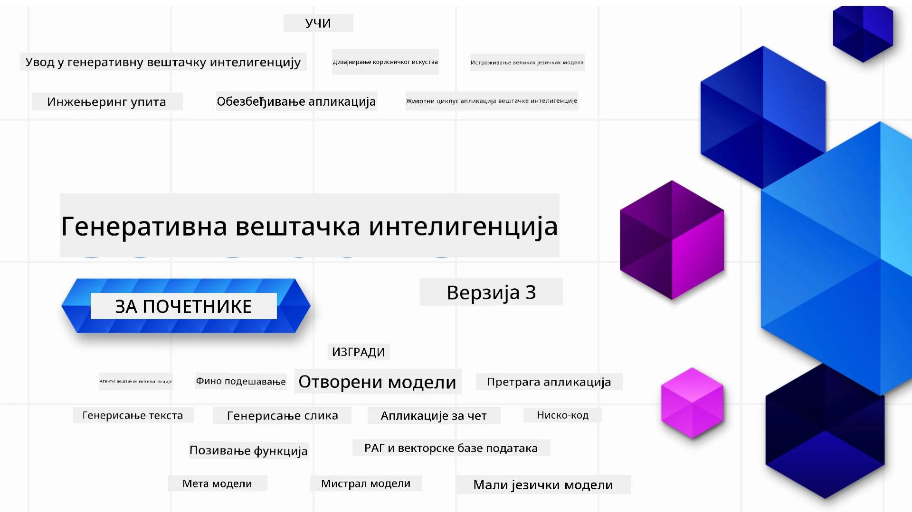

### 21 lekcija koje podučavaju sve što treba da znate da biste počeli sa izgradnjom Generativnih AI aplikacija

[](https://github.com/microsoft/Generative-AI-For-Beginners/blob/master/LICENSE?WT.mc_id=academic-105485-koreyst)
[](https://GitHub.com/microsoft/Generative-AI-For-Beginners/graphs/contributors/?WT.mc_id=academic-105485-koreyst)
[](https://GitHub.com/microsoft/Generative-AI-For-Beginners/issues/?WT.mc_id=academic-105485-koreyst)
[](https://GitHub.com/microsoft/Generative-AI-For-Beginners/pulls/?WT.mc_id=academic-105485-koreyst)
[](http://makeapullrequest.com?WT.mc_id=academic-105485-koreyst)

[](https://GitHub.com/microsoft/Generative-AI-For-Beginners/watchers/?WT.mc_id=academic-105485-koreyst)
[](https://GitHub.com/microsoft/Generative-AI-For-Beginners/network/?WT.mc_id=academic-105485-koreyst)
[](https://GitHub.com/microsoft/Generative-AI-For-Beginners/stargazers/?WT.mc_id=academic-105485-koreyst)

[](https://discord.gg/nTYy5BXMWG)

### 🌐 Višejezična podrška

#### Podržano putem GitHub Akcije (Automatski i uvek ažurno)

<!-- CO-OP TRANSLATOR LANGUAGES TABLE START -->
[Арапски](../ar/README.md) | [Бенгалски](../bn/README.md) | [Бугарски](../bg/README.md) | [Бирмански (Мјанмар)](../my/README.md) | [Кинески (поједностављени)](../zh-CN/README.md) | [Кинески (традиционални, Хонг Конг)](../zh-HK/README.md) | [Кинески (традиционални, Макао)](../zh-MO/README.md) | [Кинески (традиционални, Тајван)](../zh-TW/README.md) | [Хрватски](../hr/README.md) | [Чешки](../cs/README.md) | [Дански](../da/README.md) | [Холандски](../nl/README.md) | [Естонски](../et/README.md) | [Фински](../fi/README.md) | [Француски](../fr/README.md) | [Немачки](../de/README.md) | [Грчки](../el/README.md) | [Хебрејски](../he/README.md) | [Хинди](../hi/README.md) | [Мађарски](../hu/README.md) | [Индонежански](../id/README.md) | [Италијански](../it/README.md) | [Јапански](../ja/README.md) | [Канада](../kn/README.md) | [Корјански](../ko/README.md) | [Литвански](../lt/README.md) | [Малајски](../ms/README.md) | [Малајалам](../ml/README.md) | [Марати](../mr/README.md) | [Непалски](../ne/README.md) | [Нигеријски Пидгин](../pcm/README.md) | [Норвешки](../no/README.md) | [Персијски (Фарси)](../fa/README.md) | [Пољски](../pl/README.md) | [Португалски (Бразил)](../pt-BR/README.md) | [Португалски (Португал)](../pt-PT/README.md) | [Пенџапски (Гурмукхи)](../pa/README.md) | [Румунски](../ro/README.md) | [Руски](../ru/README.md) | [Српски (ћирилица)](./README.md) | [Словачки](../sk/README.md) | [Словеначки](../sl/README.md) | [Шпански](../es/README.md) | [Свахили](../sw/README.md) | [Шведски](../sv/README.md) | [Тагалошки (Филипински)](../tl/README.md) | [Тамилски](../ta/README.md) | [Телугу](../te/README.md) | [Тајландски](../th/README.md) | [Турски](../tr/README.md) | [Украјински](../uk/README.md) | [Урду](../ur/README.md) | [Вијетнамски](../vi/README.md)

> **Више волите да клонирате локално?**

> Ово складиште укључује преко 50 превода на језике што знатно повећава величину преузимања. Да бисте клонирали без превода, користите sparse checkout:
> ```bash
> git clone --filter=blob:none --sparse https://github.com/microsoft/generative-ai-for-beginners.git
> cd generative-ai-for-beginners
> git sparse-checkout set --no-cone '/*' '!translations' '!translated_images'
> ```
> Ово вам даје све што вам је потребно да завршите курс са много бржим преузимањем.
<!-- CO-OP TRANSLATOR LANGUAGES TABLE END -->

# Генеративна вештачка интелигенција за почетнике (Верзија 3) - Курс

Научите основе изградње генеративних AI апликација кроз наш крунски курс од 21 лекције који воде Microsoft Cloud Advocates.

## 🌱 Почетак

Овај курс има 21 лекцију. Сваку лекцију покрива посебну тему, па почните где год желите!

Лекције су означене као "Учити" које објашњавају концепт Генеративне AI или "Правити" које објашњавају концепт и примере кода на оба језика, **Python** и **TypeScript**, кад год је то могуће.

За .NET програмере погледајте [Generative AI for Beginners (.NET Edition)](https://github.com/microsoft/Generative-AI-for-beginners-dotnet?WT.mc_id=academic-105485-koreyst)!

Свака лекција такође садржи део "Настави да учиш" са додатним алатима за учење.

## Шта вам треба
### За покретање кода овог курса можете користити један од следећих: 
 - [Azure OpenAI Service](https://aka.ms/genai-beginners/azure-open-ai?WT.mc_id=academic-105485-koreyst) - **лекције:** "aoai-assignment"
 - [GitHub Marketplace Model Catalog](https://aka.ms/genai-beginners/gh-models?WT.mc_id=academic-105485-koreyst) - **лекције:** "githubmodels"
 - [OpenAI API](https://aka.ms/genai-beginners/open-ai?WT.mc_id=academic-105485-koreyst) - **лекције:** "oai-assignment" 
   
- Основно знање Python или TypeScript је корисно - \*За апсолутне почетнике проверите ове курсеve [Python](https://aka.ms/genai-beginners/python?WT.mc_id=academic-105485-koreyst) и [TypeScript](https://aka.ms/genai-beginners/typescript?WT.mc_id=academic-105485-koreyst)
- GitHub налог за [форкирање целог овог репозиторијума](https://aka.ms/genai-beginners/github?WT.mc_id=academic-105485-koreyst) на свој GitHub налог

Креирали смо **[Course Setup](./00-course-setup/README.md?WT.mc_id=academic-105485-koreyst)** лекцију да вам помогнемо са подешавањем развојног окружења.

Не заборавите да [означите са звездицом (🌟) овај репо](https://docs.github.com/en/get-started/exploring-projects-on-github/saving-repositories-with-stars?WT.mc_id=academic-105485-koreyst) како бисте га лакше пронашли касније.

## 🧠 Спремни за имплементацију?

Ако тражите напредније примере кода, погледајте нашу [колекцију примера кода за генeративну AI](https://aka.ms/genai-beg-code?WT.mc_id=academic-105485-koreyst) на оба језика **Python** и **TypeScript**.

## 🗣️ Упознајте друге полазнике, добијте подршку

Придружите се нашем [званичном Azure AI Foundry Discord серверу](https://aka.ms/genai-discord?WT.mc_id=academic-105485-koreyst) да упознате и повежете се са другим полазницима овог курса и добијете подршку.

Постављајте питања или делите повратне информације о производу у нашем [Azure AI Foundry Developer форуму](https://aka.ms/azureaifoundry/forum) на GitHub-у.

## 🚀 Градите стартап?

Посетите [Microsoft for Startups](https://www.microsoft.com/startups) да сазнате како да започнете са изградњом уз Azure кредите већ данас.

## 🙏 Желите да помогнете?

Имате ли предлоге или сте пронашли правописне или кодне грешке? [Отворите проблем](https://github.com/microsoft/generative-ai-for-beginners/issues?WT.mc_id=academic-105485-koreyst) или [Креирајте захтев за повлачење](https://github.com/microsoft/generative-ai-for-beginners/pulls?WT.mc_id=academic-105485-koreyst)

## 📂 Свака лекција укључује:

- Кратак видео увод у тему
- Писану лекцију која се налази у README
- Примере кода у Python и TypeScript који подржавају Azure OpenAI и OpenAI API
- Линкове ка додатним ресурсима за наставак учења

## 🗃️ Лекције

| #   | **Линк ка лекцији**                                                                                                                         | **Опис**                                                                                       | **Видео**                                                                   | **Додатно учење**                                                              |
| --- | ------------------------------------------------------------------------------------------------------------------------------------------- | ---------------------------------------------------------------------------------------------- | --------------------------------------------------------------------------- | ------------------------------------------------------------------------------ |
| 00  | [Подешавање курса](./00-course-setup/README.md?WT.mc_id=academic-105485-koreyst)                                                             | **Учи:** Како подесити ваше развојно окружење                                                | Видеo ускоро                                                                | [Више информација](https://aka.ms/genai-collection?WT.mc_id=academic-105485-koreyst) |
| 01  | [Увод у генеративну AI и велике језичке моделе (LLM)](./01-introduction-to-genai/README.md?WT.mc_id=academic-105485-koreyst)                 | **Учи:** Разумевање шта је генеративна AI и како функционишу Велики језички модели (LLMs).     | [Видео](https://aka.ms/gen-ai-lesson-1-gh?WT.mc_id=academic-105485-koreyst) | [Више информација](https://aka.ms/genai-collection?WT.mc_id=academic-105485-koreyst) |
| 02  | [Истраживање и упоређивање различитих LLM-ова](./02-exploring-and-comparing-different-llms/README.md?WT.mc_id=academic-105485-koreyst)        | **Учи:** Како изабрати прави модел за свој случај употребе                                   | [Видео](https://aka.ms/gen-ai-lesson2-gh?WT.mc_id=academic-105485-koreyst)  | [Више информација](https://aka.ms/genai-collection?WT.mc_id=academic-105485-koreyst) |
| 03  | [Одговорно коришћење генеративне AI](./03-using-generative-ai-responsibly/README.md?WT.mc_id=academic-105485-koreyst)                         | **Учи:** Како одговорно градити генеративне AI апликације                                   | [Видео](https://aka.ms/gen-ai-lesson3-gh?WT.mc_id=academic-105485-koreyst)  | [Више информација](https://aka.ms/genai-collection?WT.mc_id=academic-105485-koreyst) |
| 04  | [Разумевање основа инжењеринга упита](./04-prompt-engineering-fundamentals/README.md?WT.mc_id=academic-105485-koreyst)             | **Научите:** Најбоље праксе инжењеринга упита путем практичног рада                                           | [Видео](https://aka.ms/gen-ai-lesson4-gh?WT.mc_id=academic-105485-koreyst)  | [Сазнајте више](https://aka.ms/genai-collection?WT.mc_id=academic-105485-koreyst) |
| 05  | [Креирање напредних упита](./05-advanced-prompts/README.md?WT.mc_id=academic-105485-koreyst)                                                | **Научите:** Како применити технике инжењеринга упита које унапређују резултат ваших упита. | [Видео](https://aka.ms/gen-ai-lesson5-gh?WT.mc_id=academic-105485-koreyst)  | [Сазнајте више](https://aka.ms/genai-collection?WT.mc_id=academic-105485-koreyst) |
| 06  | [Прављење апликација за генерисање текста](./06-text-generation-apps/README.md?WT.mc_id=academic-105485-koreyst)                                | **Правите:** Апликацију за генерисање текста користећи Azure OpenAI / OpenAI API                                | [Видео](https://aka.ms/gen-ai-lesson6-gh?WT.mc_id=academic-105485-koreyst)  | [Сазнајте више](https://aka.ms/genai-collection?WT.mc_id=academic-105485-koreyst) |
| 07  | [Прављење чет апликација](./07-building-chat-applications/README.md?WT.mc_id=academic-105485-koreyst)                                     | **Правите:** Технике за ефикасно креирање и интеграцију чет апликација.               | [Видео](https://aka.ms/gen-ai-lessons7-gh?WT.mc_id=academic-105485-koreyst) | [Сазнајте више](https://aka.ms/genai-collection?WT.mc_id=academic-105485-koreyst) |
| 08  | [Прављење претраживачких апликација и вектор база података](./08-building-search-applications/README.md?WT.mc_id=academic-105485-koreyst)                        | **Правите:** Апликацију за претрагу која користи уграђене репрезентације (Embeddings) за претрагу података.                        | [Видео](https://aka.ms/gen-ai-lesson8-gh?WT.mc_id=academic-105485-koreyst)  | [Сазнајте више](https://aka.ms/genai-collection?WT.mc_id=academic-105485-koreyst) |
| 09  | [Прављење апликација за генерисање слика](./09-building-image-applications/README.md?WT.mc_id=academic-105485-koreyst)                        | **Правите:** Апликацију за генерисање слика                                                       | [Видео](https://aka.ms/gen-ai-lesson9-gh?WT.mc_id=academic-105485-koreyst)  | [Сазнајте више](https://aka.ms/genai-collection?WT.mc_id=academic-105485-koreyst) |
| 10  | [Прављење Low Code AI апликација](./10-building-low-code-ai-applications/README.md?WT.mc_id=academic-105485-koreyst)                       | **Правите:** Апликацију генеративне вештачке интелигенције користећи алате ниског кода (Low Code)                                     | [Видео](https://aka.ms/gen-ai-lesson10-gh?WT.mc_id=academic-105485-koreyst) | [Сазнајте више](https://aka.ms/genai-collection?WT.mc_id=academic-105485-koreyst) |
| 11  | [Интеграција екстерних апликација са позивом функција](./11-integrating-with-function-calling/README.md?WT.mc_id=academic-105485-koreyst) | **Правите:** Шта је позив функција и како се користи у апликацијама                          | [Видео](https://aka.ms/gen-ai-lesson11-gh?WT.mc_id=academic-105485-koreyst) | [Сазнајте више](https://aka.ms/genai-collection?WT.mc_id=academic-105485-koreyst) |
| 12  | [Дизајн корисничког искуства (UX) за AI апликације](./12-designing-ux-for-ai-applications/README.md?WT.mc_id=academic-105485-koreyst)                         | **Научите:** Како применити принципе дизајна корисничког искуства приликом развоја генеративних AI апликација         | [Видео](https://aka.ms/gen-ai-lesson12-gh?WT.mc_id=academic-105485-koreyst) | [Сазнајте више](https://aka.ms/genai-collection?WT.mc_id=academic-105485-koreyst) |
| 13  | [Обезбеђивање ваших генеративних AI апликација](./13-securing-ai-applications/README.md?WT.mc_id=academic-105485-koreyst)                         | **Научите:** Претње и ризици за AI системе и методе како их обезбедити.             | [Видео](https://aka.ms/gen-ai-lesson13-gh?WT.mc_id=academic-105485-koreyst) | [Сазнајте више](https://aka.ms/genai-collection?WT.mc_id=academic-105485-koreyst) |
| 14  | [Животни циклус генеративних AI апликација](./14-the-generative-ai-application-lifecycle/README.md?WT.mc_id=academic-105485-koreyst)           | **Научите:** Алате и метрике за управљање животним циклусом LLM и LLMOps                         | [Видео](https://aka.ms/gen-ai-lesson14-gh?WT.mc_id=academic-105485-koreyst) | [Сазнајте више](https://aka.ms/genai-collection?WT.mc_id=academic-105485-koreyst) |
| 15  | [Ретријевални допуњен генеративни модел (RAG) и вектор базе података](./15-rag-and-vector-databases/README.md?WT.mc_id=academic-105485-koreyst)        | **Правите:** Апликацију коришћењем RAG оквира за преузимање уграђених репрезентација из вектор база података  | [Видео](https://aka.ms/gen-ai-lesson15-gh?WT.mc_id=academic-105485-koreyst) | [Сазнајте више](https://aka.ms/genai-collection?WT.mc_id=academic-105485-koreyst) |
| 16  | [Отворени модели и Hugging Face](./16-open-source-models/README.md?WT.mc_id=academic-105485-koreyst)                                    | **Правите:** Апликацију користећи отворене моделе доступне на Hugging Face                    | [Видео](https://aka.ms/gen-ai-lesson16-gh?WT.mc_id=academic-105485-koreyst) | [Сазнајте више](https://aka.ms/genai-collection?WT.mc_id=academic-105485-koreyst) |
| 17  | [AI агенти](./17-ai-agents/README.md?WT.mc_id=academic-105485-koreyst)                                                                       | **Правите:** Апликацију користећи оквир за AI агенте                                           | [Видео](https://aka.ms/gen-ai-lesson17-gh?WT.mc_id=academic-105485-koreyst) | [Сазнајте више](https://aka.ms/genai-collection?WT.mc_id=academic-105485-koreyst) |
| 18  | [Фино подешавање LLM](./18-fine-tuning/README.md?WT.mc_id=academic-105485-koreyst)                                                              | **Научите:** Шта је, зашто и како се врши фино подешавање LLM                                   | [Видео](https://aka.ms/gen-ai-lesson18-gh?WT.mc_id=academic-105485-koreyst) | [Сазнајте више](https://aka.ms/genai-collection?WT.mc_id=academic-105485-koreyst) |
| 19  | [Прављење са малим језичким моделима (SLM)](./19-slm/README.md?WT.mc_id=academic-105485-koreyst)                                                              | **Научите:** Предности прављења са малим језичким моделима                                            | Ускоро видео | [Сазнајте више](https://aka.ms/genai-collection?WT.mc_id=academic-105485-koreyst) |
| 20  | [Прављење са Мистрал моделима](./20-mistral/README.md?WT.mc_id=academic-105485-koreyst)                                                              | **Научите:** Карактеристике и разлике модела породице Мистрал                                           | Ускоро видео | [Сазнајте више](https://aka.ms/genai-collection?WT.mc_id=academic-105485-koreyst) |
| 21  | [Прављење са Мета моделима](./21-meta/README.md?WT.mc_id=academic-105485-koreyst)                                                              | **Научите:** Карактеристике и разлике модела породице Мета                                           | Ускоро видео | [Сазнајте више](https://aka.ms/genai-collection?WT.mc_id=academic-105485-koreyst) |

### 🌟 Посебне захвалности

Посебне захвалности [**Јохну Азизу**](https://www.linkedin.com/in/john0isaac/) за креирање свих GitHub акција и токова рада

[**Бернхарду Мерклеу**](https://www.linkedin.com/in/bernhard-merkle-738b73/) за кључне доприносе свакој лекцији у циљу побољшања искуства учења и рада са кодом.

## 🎒 Остали курсеви

Наш тим производи и друге курсеве! Погледајте:

<!-- CO-OP TRANSLATOR OTHER COURSES START -->
### LangChain
[](https://aka.ms/langchain4j-for-beginners)
[](https://aka.ms/langchainjs-for-beginners?WT.mc_id=m365-94501-dwahlin)

---

### Azure / Edge / MCP / Агенти
[](https://github.com/microsoft/AZD-for-beginners?WT.mc_id=academic-105485-koreyst)
[](https://github.com/microsoft/edgeai-for-beginners?WT.mc_id=academic-105485-koreyst)
[](https://github.com/microsoft/mcp-for-beginners?WT.mc_id=academic-105485-koreyst)
[](https://github.com/microsoft/ai-agents-for-beginners?WT.mc_id=academic-105485-koreyst)

---
 
### Сериија генеративне AI
[](https://github.com/microsoft/generative-ai-for-beginners?WT.mc_id=academic-105485-koreyst)
[-9333EA?style=for-the-badge&labelColor=E5E7EB&color=9333EA)](https://github.com/microsoft/Generative-AI-for-beginners-dotnet?WT.mc_id=academic-105485-koreyst)
[-C084FC?style=for-the-badge&labelColor=E5E7EB&color=C084FC)](https://github.com/microsoft/generative-ai-for-beginners-java?WT.mc_id=academic-105485-koreyst)
[-E879F9?style=for-the-badge&labelColor=E5E7EB&color=E879F9)](https://github.com/microsoft/generative-ai-with-javascript?WT.mc_id=academic-105485-koreyst)

---
 
### Основно учење
[](https://aka.ms/ml-beginners?WT.mc_id=academic-105485-koreyst)
[](https://aka.ms/datascience-beginners?WT.mc_id=academic-105485-koreyst)
[](https://aka.ms/ai-beginners?WT.mc_id=academic-105485-koreyst)
[](https://github.com/microsoft/Security-101?WT.mc_id=academic-96948-sayoung)
[](https://aka.ms/webdev-beginners?WT.mc_id=academic-105485-koreyst)
[](https://aka.ms/iot-beginners?WT.mc_id=academic-105485-koreyst)
[](https://github.com/microsoft/xr-development-for-beginners?WT.mc_id=academic-105485-koreyst)

---
 
### Серия Копилот
[](https://aka.ms/GitHubCopilotAI?WT.mc_id=academic-105485-koreyst)
[](https://github.com/microsoft/mastering-github-copilot-for-dotnet-csharp-developers?WT.mc_id=academic-105485-koreyst)
[](https://github.com/microsoft/CopilotAdventures?WT.mc_id=academic-105485-koreyst)
<!-- CO-OP TRANSLATOR OTHER COURSES END -->

## Добијање помоћи

Ако запнете или имате питања о изградњи AI апликација. Придружите се другим ученицима и искусним програмерима у дискусијама о MCP-у. То је подржавајућа заједница где су питања добродошла и знање се слободно дели.

[](https://discord.gg/nTYy5BXMWG)

Ако имате повратне информације о производу или грешке током изградње посетите:

[](https://aka.ms/foundry/forum)

---

<!-- CO-OP TRANSLATOR DISCLAIMER START -->
**Изјава о одрицању одговорности**:  
Овај документ је преведен коришћењем АИ услуге превођења [Co-op Translator](https://github.com/Azure/co-op-translator). Иако тежимо прецизности, молимо вас да имате у виду да аутоматизовани преводи могу садржати грешке или нетачности. Оригинални документ на његовом изворном језику треба сматрати ауторитетним извором. За критичне информације препоручује се професионални људски превод. Не сносимо одговорност за било каква неспоразума или погрешне тумачења настала употребом овог превода.
<!-- CO-OP TRANSLATOR DISCLAIMER END -->