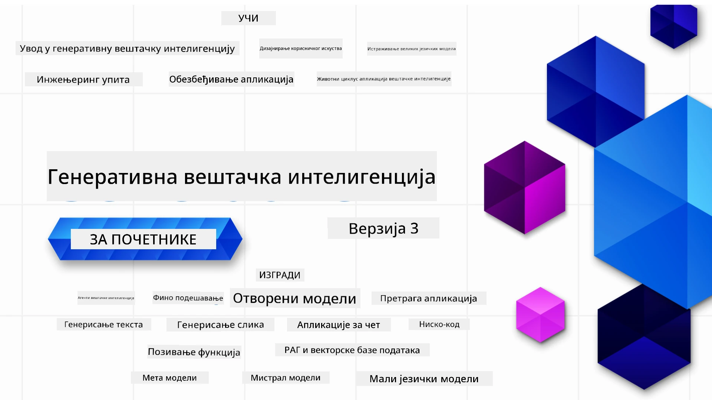

### 21 лекција које вас уче свему што је потребно да почнете да правите апликације засноване на Генеративној вештачкој интелигенцији

[](https://github.com/microsoft/Generative-AI-For-Beginners/blob/master/LICENSE?WT.mc_id=academic-105485-koreyst)
[](https://GitHub.com/microsoft/Generative-AI-For-Beginners/graphs/contributors/?WT.mc_id=academic-105485-koreyst)
[](https://GitHub.com/microsoft/Generative-AI-For-Beginners/issues/?WT.mc_id=academic-105485-koreyst)
[](https://GitHub.com/microsoft/Generative-AI-For-Beginners/pulls/?WT.mc_id=academic-105485-koreyst)
[](http://makeapullrequest.com?WT.mc_id=academic-105485-koreyst)

[](https://GitHub.com/microsoft/Generative-AI-For-Beginners/watchers/?WT.mc_id=academic-105485-koreyst)
[](https://GitHub.com/microsoft/Generative-AI-For-Beginners/network/?WT.mc_id=academic-105485-koreyst)
[](https://GitHub.com/microsoft/Generative-AI-For-Beginners/stargazers/?WT.mc_id=academic-105485-koreyst)

[](https://discord.gg/nTYy5BXMWG)

### 🌐 Подршка за више језика

#### Подржано путем GitHub акције (Аутоматизовано и увек ажурирано)

<!-- CO-OP TRANSLATOR LANGUAGES TABLE START -->
[Arabic](../ar/README.md) | [Bengali](../bn/README.md) | [Bulgarian](../bg/README.md) | [Burmese (Myanmar)](../my/README.md) | [Chinese (Simplified)](../zh-CN/README.md) | [Chinese (Traditional, Hong Kong)](../zh-HK/README.md) | [Chinese (Traditional, Macau)](../zh-MO/README.md) | [Chinese (Traditional, Taiwan)](../zh-TW/README.md) | [Croatian](../hr/README.md) | [Czech](../cs/README.md) | [Danish](../da/README.md) | [Dutch](../nl/README.md) | [Estonian](../et/README.md) | [Finnish](../fi/README.md) | [French](../fr/README.md) | [German](../de/README.md) | [Greek](../el/README.md) | [Hebrew](../he/README.md) | [Hindi](../hi/README.md) | [Hungarian](../hu/README.md) | [Indonesian](../id/README.md) | [Italian](../it/README.md) | [Japanese](../ja/README.md) | [Kannada](../kn/README.md) | [Khmer](../km/README.md) | [Korean](../ko/README.md) | [Lithuanian](../lt/README.md) | [Malay](../ms/README.md) | [Malayalam](../ml/README.md) | [Marathi](../mr/README.md) | [Nepali](../ne/README.md) | [Nigerian Pidgin](../pcm/README.md) | [Norwegian](../no/README.md) | [Persian (Farsi)](../fa/README.md) | [Polish](../pl/README.md) | [Portuguese (Brazil)](../pt-BR/README.md) | [Portuguese (Portugal)](../pt-PT/README.md) | [Punjabi (Gurmukhi)](../pa/README.md) | [Romanian](../ro/README.md) | [Russian](../ru/README.md) | [Serbian (Cyrillic)](./README.md) | [Slovak](../sk/README.md) | [Slovenian](../sl/README.md) | [Spanish](../es/README.md) | [Swahili](../sw/README.md) | [Swedish](../sv/README.md) | [Tagalog (Filipino)](../tl/README.md) | [Tamil](../ta/README.md) | [Telugu](../te/README.md) | [Thai](../th/README.md) | [Turkish](../tr/README.md) | [Ukrainian](../uk/README.md) | [Urdu](../ur/README.md) | [Vietnamese](../vi/README.md)

> **Више волите да клонирате локално?**
>
> Овај репозиторијум укључује преводе на више од 50 језика, што знатно повећава величину преузимања. Да бисте клонирали без превода, користите sparse checkout:
>
> **Bash / macOS / Linux:**
> ```bash
> git clone --filter=blob:none --sparse https://github.com/microsoft/generative-ai-for-beginners.git
> cd generative-ai-for-beginners
> git sparse-checkout set --no-cone '/*' '!translations' '!translated_images'
> ```
>
> **CMD (Windows):**
> ```cmd
> git clone --filter=blob:none --sparse https://github.com/microsoft/generative-ai-for-beginners.git
> cd generative-ai-for-beginners
> git sparse-checkout set --no-cone "/*" "!translations" "!translated_images"
> ```
>
> Ово вам даје све што вам је потребно за завршетак курса уз знатно брже преузимање.
<!-- CO-OP TRANSLATOR LANGUAGES TABLE END -->

# Генеративна вештачка интелигенција за почетнике (Верзија 3) - Курс

Научите основе изградње апликација заснованих на генеративној вештачкој интелигенцији уз наш свеобухватни курс од 21 лекције од стране Microsoft Cloud Advocates.

## 🌱 Почетак

Овај курс има 21 лекцију. Свака лекција покрива своју тему, па почните где год желите!

Лекције су означене као "Learn" лекције које објашњавају концепт генеративне AI или "Build" лекције које објашњавају концепт и приказују примере кода у оба језика **Python** и **TypeScript** кад год је могуће.

За .NET програмере провјерите [Generative AI for Beginners (.NET Edition)](https://github.com/microsoft/Generative-AI-for-beginners-dotnet?WT.mc_id=academic-105485-koreyst)!

Свака лекција такође садржи секцију "Keep Learning" са додатним алатима за учење.

## Шта вам треба
### Да бисте покренули код курса, можете користити једно од следећег: 
 - [Azure OpenAI Service](https://aka.ms/genai-beginners/azure-open-ai?WT.mc_id=academic-105485-koreyst) - **Лекције:** "aoai-assignment"
 - [GitHub Marketplace Model Catalog](https://aka.ms/genai-beginners/gh-models?WT.mc_id=academic-105485-koreyst) - **Лекције:** "githubmodels"
 - [OpenAI API](https://aka.ms/genai-beginners/open-ai?WT.mc_id=academic-105485-koreyst) - **Лекције:** "oai-assignment" 
   
- Основно познавање Python или TypeScript је корисно - \*За апсолутне почетнике погледајте ове [Python](https://aka.ms/genai-beginners/python?WT.mc_id=academic-105485-koreyst) и [TypeScript](https://aka.ms/genai-beginners/typescript?WT.mc_id=academic-105485-koreyst) курсеве
- GitHub налог да [форкујете цео овај репозиторијум](https://aka.ms/genai-beginners/github?WT.mc_id=academic-105485-koreyst) на свој GitHub налог

Креирали смо лекцију **[Course Setup](./00-course-setup/README.md?WT.mc_id=academic-105485-koreyst)** која ће вам помоћи да подесите своје развојно окружење.

Не заборавите да [означите (🌟) овај репозиторијум](https://docs.github.com/en/get-started/exploring-projects-on-github/saving-repositories-with-stars?WT.mc_id=academic-105485-koreyst) како бисте га касније лакше пронашли.

## 🧠 Спремни за имплементацију?

Ако тражите напредније примерке кода, погледајте нашу [збирку примера кода за Генеративну AI](https://aka.ms/genai-beg-code?WT.mc_id=academic-105485-koreyst) на оба језика **Python** и **TypeScript**.

## 🗣️ Упознајте друге ученике, добијте подршку

Придружите се нашем [званичном Azure AI Foundry Discord серверу](https://aka.ms/genai-discord?WT.mc_id=academic-105485-koreyst) да упознате и умрежите се са другим полазницима овог курса и добијете подршку.

Постављајте питања или делите повратне информације о производу у нашем [Azure AI Foundry Developer Forum](https://aka.ms/azureaifoundry/forum) на GitHub-у.

## 🚀 Правите стартап?

Посетите [Microsoft for Startups](https://www.microsoft.com/startups) да сазнате како започети са изградњом уз Azure кредите данас.

## 🙏 Желите да помогнете?

Имате ли предлоге или сте пронашли правописне или код грешке? [Подигните issue](https://github.com/microsoft/generative-ai-for-beginners/issues?WT.mc_id=academic-105485-koreyst) или [Креирајте pull request](https://github.com/microsoft/generative-ai-for-beginners/pulls?WT.mc_id=academic-105485-koreyst)

## 📂 Свака лекција садржи:

- Кратки видео увод у тему
- Писану лекцију у README-у
- Примере кода у Python и TypeScript који подржавају Azure OpenAI и OpenAI API
- Линкове ка додатним ресурсима за наставак учења

## 🗃️ Лекције

| #   | **Линк до лекције**                                                                                                                            | **Опис**                                                                                      | **Видео**                                                                   | **Додатно учење**                                                             |
| --- | -------------------------------------------------------------------------------------------------------------------------------------------- | --------------------------------------------------------------------------------------------- | --------------------------------------------------------------------------- | ------------------------------------------------------------------------------ |
| 00  | [Course Setup](./00-course-setup/README.md?WT.mc_id=academic-105485-koreyst)                                                                   | **Learn:** Како да подесите своје развојно окружење                                          | Видео долази ускоро                                                                 | [Learn More](https://aka.ms/genai-collection?WT.mc_id=academic-105485-koreyst) |
| 01  | [Introduction to Generative AI and LLMs](./01-introduction-to-genai/README.md?WT.mc_id=academic-105485-koreyst)                                | **Learn:** Разумевање шта је генеративна AI и како велики језички модели (LLMs) функционишу.  | [Видео](https://aka.ms/gen-ai-lesson-1-gh?WT.mc_id=academic-105485-koreyst) | [Learn More](https://aka.ms/genai-collection?WT.mc_id=academic-105485-koreyst) |
| 02  | [Exploring and comparing different LLMs](./02-exploring-and-comparing-different-llms/README.md?WT.mc_id=academic-105485-koreyst)               | **Learn:** Како изабрати прави модел за ваш случај употребе                                  | [Видео](https://aka.ms/gen-ai-lesson2-gh?WT.mc_id=academic-105485-koreyst)  | [Learn More](https://aka.ms/genai-collection?WT.mc_id=academic-105485-koreyst) |
| 03  | [Using Generative AI Responsibly](./03-using-generative-ai-responsibly/README.md?WT.mc_id=academic-105485-koreyst)                             | **Learn:** Како одговорно градити апликације засноване на генеративној AI                     | [Видео](https://aka.ms/gen-ai-lesson3-gh?WT.mc_id=academic-105485-koreyst)  | [Learn More](https://aka.ms/genai-collection?WT.mc_id=academic-105485-koreyst) |
| 04  | [Разумевање основа инжењерства упита](./04-prompt-engineering-fundamentals/README.md?WT.mc_id=academic-105485-koreyst)             | **Научи:** Најбоље праксе практичног инжењерства упита                                           | [Видео](https://aka.ms/gen-ai-lesson4-gh?WT.mc_id=academic-105485-koreyst)  | [Сазнај више](https://aka.ms/genai-collection?WT.mc_id=academic-105485-koreyst) |
| 05  | [Креирање напредних упита](./05-advanced-prompts/README.md?WT.mc_id=academic-105485-koreyst)                                                | **Научи:** Како применити технике инжењерства упита које побољшавају исход ваших упита.          | [Видео](https://aka.ms/gen-ai-lesson5-gh?WT.mc_id=academic-105485-koreyst)  | [Сазнај више](https://aka.ms/genai-collection?WT.mc_id=academic-105485-koreyst) |
| 06  | [Изградња апликација за генерисање текста](./06-text-generation-apps/README.md?WT.mc_id=academic-105485-koreyst)                                | **Изградња:** Апликација за генерисање текста користећи Azure OpenAI / OpenAI API              | [Видео](https://aka.ms/gen-ai-lesson6-gh?WT.mc_id=academic-105485-koreyst)  | [Сазнај више](https://aka.ms/genai-collection?WT.mc_id=academic-105485-koreyst) |
| 07  | [Изградња ћаскања апликација](./07-building-chat-applications/README.md?WT.mc_id=academic-105485-koreyst)                                     | **Изградња:** Технике за ефикасно креирање и интеграцију апликација за ћаскање                   | [Видео](https://aka.ms/gen-ai-lessons7-gh?WT.mc_id=academic-105485-koreyst) | [Сазнај више](https://aka.ms/genai-collection?WT.mc_id=academic-105485-koreyst) |
| 08  | [Изградња претраживачких апликација векторских база](./08-building-search-applications/README.md?WT.mc_id=academic-105485-koreyst)                        | **Изградња:** Апликација за претрагу која користи Ембеддинге за претрагу података               | [Видео](https://aka.ms/gen-ai-lesson8-gh?WT.mc_id=academic-105485-koreyst)  | [Сазнај више](https://aka.ms/genai-collection?WT.mc_id=academic-105485-koreyst) |
| 09  | [Изградња апликација за генерисање слика](./09-building-image-applications/README.md?WT.mc_id=academic-105485-koreyst)                        | **Изградња:** Апликација за генерисање слика                                                | [Видео](https://aka.ms/gen-ai-lesson9-gh?WT.mc_id=academic-105485-koreyst)  | [Сазнај више](https://aka.ms/genai-collection?WT.mc_id=academic-105485-koreyst) |
| 10  | [Изградња ниско-кодних AI апликација](./10-building-low-code-ai-applications/README.md?WT.mc_id=academic-105485-koreyst)                       | **Изградња:** Апликација генеративне AI користећи ниско-кодне алате                           | [Видео](https://aka.ms/gen-ai-lesson10-gh?WT.mc_id=academic-105485-koreyst) | [Сазнај више](https://aka.ms/genai-collection?WT.mc_id=academic-105485-koreyst) |
| 11  | [Интеграција екстерних апликација помоћу позивања функција](./11-integrating-with-function-calling/README.md?WT.mc_id=academic-105485-koreyst) | **Изградња:** Шта је позивање функција и њене примене у апликацијама                         | [Видео](https://aka.ms/gen-ai-lesson11-gh?WT.mc_id=academic-105485-koreyst) | [Сазнај више](https://aka.ms/genai-collection?WT.mc_id=academic-105485-koreyst) |
| 12  | [Дизајнирање UX за AI апликације](./12-designing-ux-for-ai-applications/README.md?WT.mc_id=academic-105485-koreyst)                         | **Научи:** Како применити принципе дизајна корисничког искуства при развоју генеративних AI апликација | [Видео](https://aka.ms/gen-ai-lesson12-gh?WT.mc_id=academic-105485-koreyst) | [Сазнај више](https://aka.ms/genai-collection?WT.mc_id=academic-105485-koreyst) |
| 13  | [Обезбеђивање ваших генеративних AI апликација](./13-securing-ai-applications/README.md?WT.mc_id=academic-105485-koreyst)                         | **Научи:** Претње и ризици за AI системе и начини обезбеђивања тих система                    | [Видео](https://aka.ms/gen-ai-lesson13-gh?WT.mc_id=academic-105485-koreyst) | [Сазнај више](https://aka.ms/genai-collection?WT.mc_id=academic-105485-koreyst) |
| 14  | [Животни циклус генеративних AI апликација](./14-the-generative-ai-application-lifecycle/README.md?WT.mc_id=academic-105485-koreyst)           | **Научи:** Алати и метрике за управљање ЛЛМ животним циклусом и ЛЛМОпс                     | [Видео](https://aka.ms/gen-ai-lesson14-gh?WT.mc_id=academic-105485-koreyst) | [Сазнај више](https://aka.ms/genai-collection?WT.mc_id=academic-105485-koreyst) |
| 15  | [Повратна генерација са повећаним приступом (RAG) и векторске базе](./15-rag-and-vector-databases/README.md?WT.mc_id=academic-105485-koreyst)        | **Изградња:** Апликација која користи RAG оквир за преузимање ембеддинга из векторских база    | [Видео](https://aka.ms/gen-ai-lesson15-gh?WT.mc_id=academic-105485-koreyst) | [Сазнај више](https://aka.ms/genai-collection?WT.mc_id=academic-105485-koreyst) |
| 16  | [Отворени модели и Hugging Face](./16-open-source-models/README.md?WT.mc_id=academic-105485-koreyst)                                    | **Изградња:** Апликација која користи отворене моделе доступне на Hugging Face                | [Видео](https://aka.ms/gen-ai-lesson16-gh?WT.mc_id=academic-105485-koreyst) | [Сазнај више](https://aka.ms/genai-collection?WT.mc_id=academic-105485-koreyst) |
| 17  | [AI агенти](./17-ai-agents/README.md?WT.mc_id=academic-105485-koreyst)                                                                       | **Изградња:** Апликација користећи AI агентски оквир                                         | [Видео](https://aka.ms/gen-ai-lesson17-gh?WT.mc_id=academic-105485-koreyst) | [Сазнај више](https://aka.ms/genai-collection?WT.mc_id=academic-105485-koreyst) |
| 18  | [Фино подешавање ЛЛМ-ова](./18-fine-tuning/README.md?WT.mc_id=academic-105485-koreyst)                                                              | **Научи:** Шта, зашто и како извршити фино подешавање ЛЛМ-ова                                | [Видео](https://aka.ms/gen-ai-lesson18-gh?WT.mc_id=academic-105485-koreyst) | [Сазнај више](https://aka.ms/genai-collection?WT.mc_id=academic-105485-koreyst) |
| 19  | [Изградња са СЛМ-овима](./19-slm/README.md?WT.mc_id=academic-105485-koreyst)                                                              | **Научи:** Предности изградње са малим језичким моделима                                    | Видео ускоро | [Сазнај више](https://aka.ms/genai-collection?WT.mc_id=academic-105485-koreyst) |
| 20  | [Изградња са Мистрал моделима](./20-mistral/README.md?WT.mc_id=academic-105485-koreyst)                                                              | **Научи:** Карактеристике и разлике Мистрал породице модела                                 | Видео ускоро | [Сазнај више](https://aka.ms/genai-collection?WT.mc_id=academic-105485-koreyst) |
| 21  | [Изградња са Мета моделима](./21-meta/README.md?WT.mc_id=academic-105485-koreyst)                                                              | **Научи:** Карактеристике и разлике Мета породице модела                                   | Видео ускоро | [Сазнај више](https://aka.ms/genai-collection?WT.mc_id=academic-105485-koreyst) |

### 🌟 Посебне захвалности

Посебне захвалности [**Џону Азизу**](https://www.linkedin.com/in/john0isaac/) за креирање свих GitHub Actions и токова рада

[**Бернхарду Мерклеу**](https://www.linkedin.com/in/bernhard-merkle-738b73/) за кључне доприносе у свакој лекцији који побољшавају искуство учења и кодирања.

## 🎒 Остали курсеви

Наш тим производи и друге курсеве! Погледајте:

<!-- CO-OP TRANSLATOR OTHER COURSES START -->
### LangChain
[](https://aka.ms/langchain4j-for-beginners)
[](https://aka.ms/langchainjs-for-beginners?WT.mc_id=m365-94501-dwahlin)
[](https://github.com/microsoft/langchain-for-beginners?WT.mc_id=m365-94501-dwahlin)
---

### Azure / Edge / MCP / Агенти
[](https://github.com/microsoft/AZD-for-beginners?WT.mc_id=academic-105485-koreyst)
[](https://github.com/microsoft/edgeai-for-beginners?WT.mc_id=academic-105485-koreyst)
[](https://github.com/microsoft/mcp-for-beginners?WT.mc_id=academic-105485-koreyst)
[](https://github.com/microsoft/ai-agents-for-beginners?WT.mc_id=academic-105485-koreyst)

---
 
### Серии генеративне AI
[](https://github.com/microsoft/generative-ai-for-beginners?WT.mc_id=academic-105485-koreyst)
[-9333EA?style=for-the-badge&labelColor=E5E7EB&color=9333EA)](https://github.com/microsoft/Generative-AI-for-beginners-dotnet?WT.mc_id=academic-105485-koreyst)
[-C084FC?style=for-the-badge&labelColor=E5E7EB&color=C084FC)](https://github.com/microsoft/generative-ai-for-beginners-java?WT.mc_id=academic-105485-koreyst)
[-E879F9?style=for-the-badge&labelColor=E5E7EB&color=E879F9)](https://github.com/microsoft/generative-ai-with-javascript?WT.mc_id=academic-105485-koreyst)

---
 
### Основно учење
[](https://aka.ms/ml-beginners?WT.mc_id=academic-105485-koreyst)
[](https://aka.ms/datascience-beginners?WT.mc_id=academic-105485-koreyst)
[](https://aka.ms/ai-beginners?WT.mc_id=academic-105485-koreyst)
[](https://github.com/microsoft/Security-101?WT.mc_id=academic-96948-sayoung)
[](https://aka.ms/webdev-beginners?WT.mc_id=academic-105485-koreyst)
[](https://aka.ms/iot-beginners?WT.mc_id=academic-105485-koreyst)
[](https://github.com/microsoft/xr-development-for-beginners?WT.mc_id=academic-105485-koreyst)

---
 
### Copilot серија
[](https://aka.ms/GitHubCopilotAI?WT.mc_id=academic-105485-koreyst)
[](https://github.com/microsoft/mastering-github-copilot-for-dotnet-csharp-developers?WT.mc_id=academic-105485-koreyst)
[](https://github.com/microsoft/CopilotAdventures?WT.mc_id=academic-105485-koreyst)
<!-- CO-OP TRANSLATOR OTHER COURSES END -->

## Добивање помоћи

Ако застанете или имате било каквих питања о прављењу AI апликација, придружите се другим ученицима и искусним програмерима у дискусијама о MCP-у. То је подржавајућа заједница где су питања добродошла и где се знање слободно дели.

[](https://discord.gg/nTYy5BXMWG)

Ако имате повратне информације о производу или грешке током развоја посетите:

[](https://aka.ms/foundry/forum)

---

<!-- CO-OP TRANSLATOR DISCLAIMER START -->
**Одрицање**:  
Овај документ је преведен уз помоћ AI услуге за превођење [Co-op Translator](https://github.com/Azure/co-op-translator). Иако настојимо да превод буде прецизан, молимо вас да имате у виду да аутоматски преводи могу садржати грешке или нетачности. Оригинални документ на изворном језику треба сматрати ауторитетним извором. За критичне информације препоручује се професионални људски превод. Није нам одговорност за евентуална неспоразума или погрешне тумачења која могу проистећи из коришћења овог превода.
<!-- CO-OP TRANSLATOR DISCLAIMER END -->