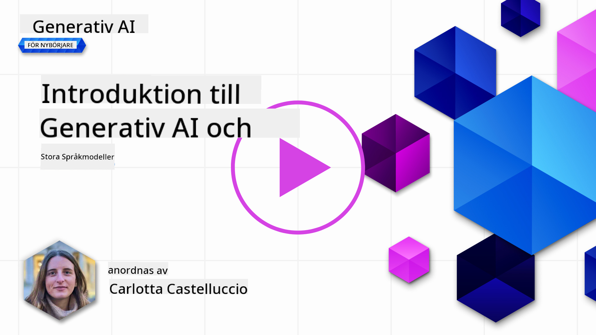
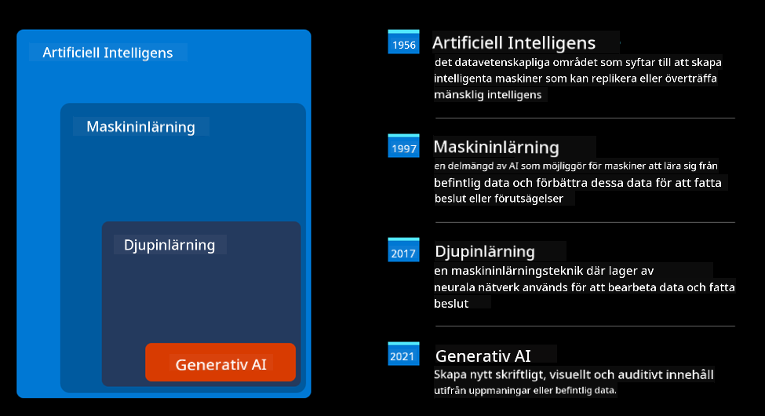
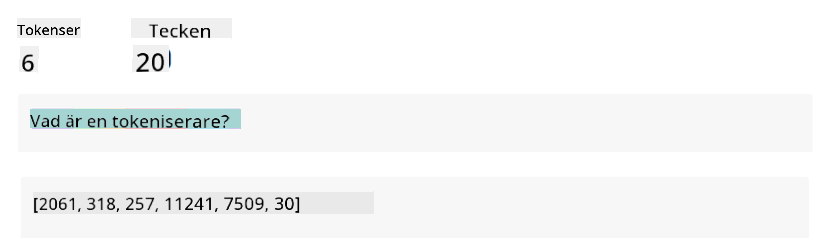
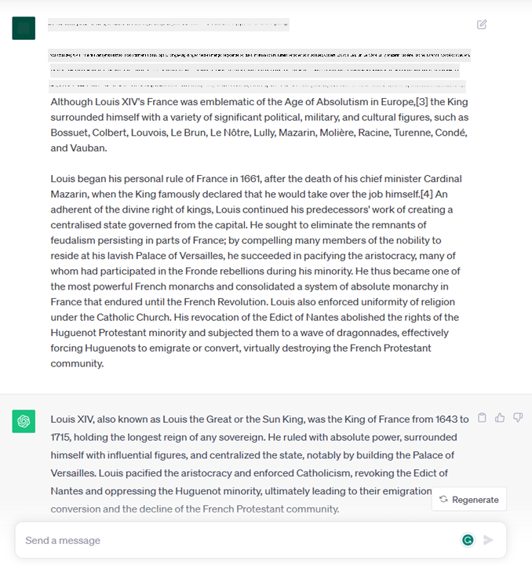
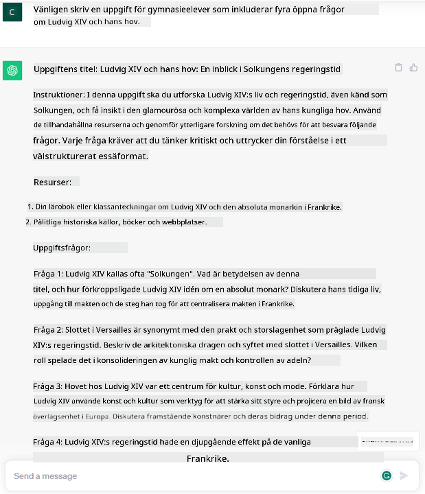
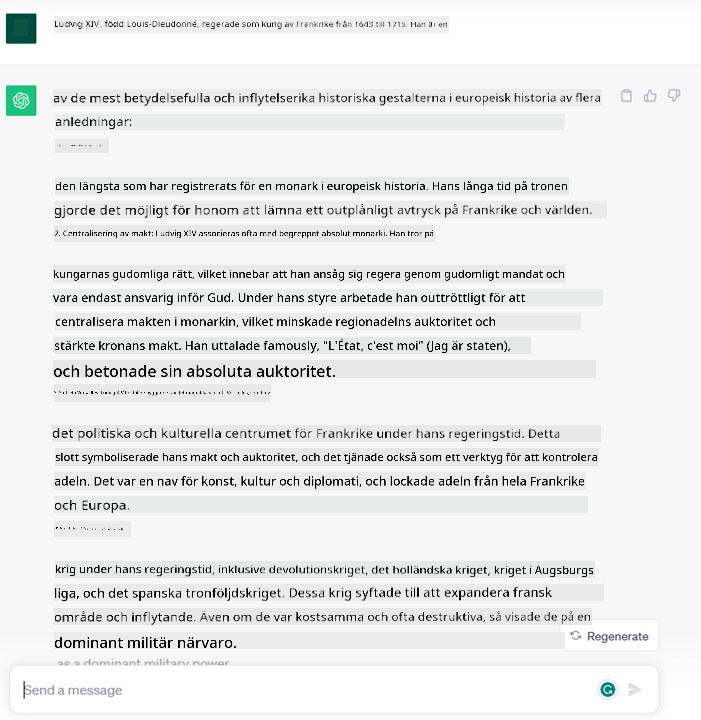
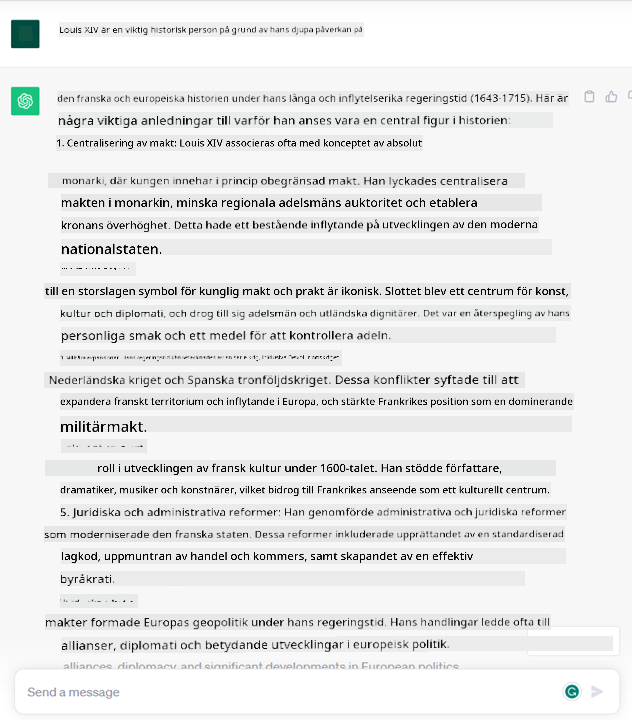
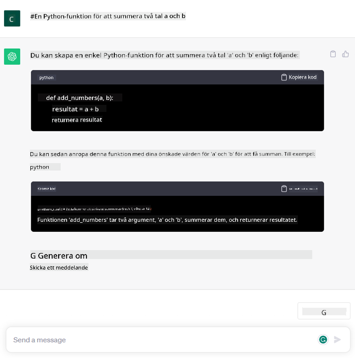

<!--
CO_OP_TRANSLATOR_METADATA:
{
  "original_hash": "f53ba0fa49164f9323043f1c6b11f2b1",
  "translation_date": "2025-06-25T09:54:34+00:00",
  "source_file": "01-introduction-to-genai/README.md",
  "language_code": "sv"
}
-->
# Introduktion till Generativ AI och Stora Språkmodeller

_(Klicka på bilden ovan för att se videon av denna lektion)_

Generativ AI är artificiell intelligens som kan generera text, bilder och andra typer av innehåll. Det som gör det till en fantastisk teknologi är att det demokratiserar AI, vem som helst kan använda det med så lite som en textprompt, en mening skriven på naturligt språk. Du behöver inte lära dig ett språk som Java eller SQL för att åstadkomma något värdefullt, allt du behöver göra är att använda ditt språk, ange vad du vill och ut kommer ett förslag från en AI-modell. Användningsområdena och effekterna av detta är enorma, du kan skriva eller förstå rapporter, skriva applikationer och mycket mer, allt på några sekunder.

I denna kursplan kommer vi att utforska hur vår startup utnyttjar generativ AI för att öppna upp nya scenarier i utbildningsvärlden och hur vi hanterar de oundvikliga utmaningarna som är förknippade med de sociala konsekvenserna av dess tillämpning och teknologins begränsningar.

## Introduktion

Denna lektion kommer att täcka:

- Introduktion till affärsscenariot: vår startupidé och mission.
- Generativ AI och hur vi landade på den nuvarande teknologilandskapet.
- Hur en stor språkmodell fungerar.
- Huvudkapaciteter och praktiska användningsfall för Stora Språkmodeller.

## Lärandemål

Efter att ha avslutat denna lektion kommer du att förstå:

- Vad generativ AI är och hur Stora Språkmodeller fungerar.
- Hur du kan utnyttja stora språkmodeller för olika användningsfall, med fokus på utbildningsscenarier.

## Scenario: vår utbildningsstartup

Generativ Artificiell Intelligens (AI) representerar toppen av AI-teknologi och pushar gränserna för vad som en gång ansågs omöjligt. Generativa AI-modeller har flera kapaciteter och applikationer, men för denna kursplan kommer vi att utforska hur det revolutionerar utbildning genom en fiktiv startup. Vi kommer att referera till denna startup som _vår startup_. Vår startup arbetar inom utbildningsområdet med det ambitiösa mission statement att

> _förbättra tillgängligheten i lärandet, på global nivå, säkerställa rättvis tillgång till utbildning och erbjuda personliga lärandeupplevelser till varje elev, enligt deras behov_.

Vårt startupteam är medvetet om att vi inte kommer att kunna uppnå detta mål utan att utnyttja ett av de mest kraftfulla verktygen i modern tid – Stora Språkmodeller (LLMs).

Generativ AI förväntas revolutionera sättet vi lär oss och undervisar idag, med elever som har tillgång till virtuella lärare 24 timmar om dygnet som erbjuder stora mängder information och exempel, och lärare som kan utnyttja innovativa verktyg för att bedöma sina elever och ge feedback.

För att börja, låt oss definiera några grundläggande begrepp och terminologi som vi kommer att använda genom hela kursplanen.

## Hur fick vi Generativ AI?

Trots den extraordinära _hypen_ som nyligen skapats av tillkännagivandet av generativa AI-modeller, har denna teknologi utvecklats under årtionden, med de första forskningsinsatserna som går tillbaka till 60-talet. Vi är nu vid en punkt där AI har mänskliga kognitiva förmågor, som konversation, vilket visas av exempelvis [OpenAI ChatGPT](https://openai.com/chatgpt) eller [Bing Chat](https://www.microsoft.com/edge/features/bing-chat?WT.mc_id=academic-105485-koreyst), som också använder en GPT-modell för webbsökningar i Bing-konversationer.

Om vi backar lite, bestod de allra första prototyperna av AI av skrivna chatbots, som förlitade sig på en kunskapsbas som extraherats från en grupp experter och representerats i en dator. Svaren i kunskapsbasen utlösts av nyckelord som förekom i input-texten.
Det blev dock snart klart att en sådan metod, med skrivna chatbots, inte skalade väl.

### En statistisk metod för AI: Maskininlärning

En vändpunkt kom under 90-talet, med tillämpningen av en statistisk metod för textanalys. Detta ledde till utvecklingen av nya algoritmer – kända som maskininlärning – som kan lära sig mönster från data utan att vara explicit programmerade. Denna metod gör det möjligt för maskiner att simulera förståelsen av mänskligt språk: en statistisk modell tränas på text-etikett-parningar, vilket gör det möjligt för modellen att klassificera okänd input-text med en fördefinierad etikett som representerar meddelandets avsikt.

### Neurala nätverk och moderna virtuella assistenter

Under de senaste åren har den teknologiska utvecklingen av hårdvara, som kan hantera större mängder data och mer komplexa beräkningar, uppmuntrat forskning inom AI, vilket har lett till utvecklingen av avancerade maskininlärningsalgoritmer kända som neurala nätverk eller djupinlärningsalgoritmer.

Neurala nätverk (och i synnerhet Recurrent Neural Networks – RNNs) har betydligt förbättrat naturlig språkbehandling, vilket möjliggör en mer meningsfull representation av textens betydelse genom att värdera en ords kontext i en mening.

Detta är teknologin som driver de virtuella assistenter som föddes under det första decenniet av det nya århundradet, mycket skickliga på att tolka mänskligt språk, identifiera ett behov och utföra en åtgärd för att tillfredsställa det – som att svara med ett fördefinierat manus eller konsumera en tjänst från tredje part.

### Nutid, Generativ AI

Så här kom vi till Generativ AI idag, vilket kan ses som en delmängd av djupinlärning.

Efter årtionden av forskning inom AI-området övervann en ny modellarkitektur – kallad _Transformer_ – begränsningarna hos RNNs, och kunde ta mycket längre textsekvenser som input. Transformatorer är baserade på uppmärksamhetsmekanismen, vilket gör det möjligt för modellen att ge olika vikter till de inputs den får, ‘betala mer uppmärksamhet’ där den mest relevanta informationen är koncentrerad, oavsett deras ordning i textsekvensen.

De flesta av de senaste generativa AI-modellerna – även kända som Stora Språkmodeller (LLMs), eftersom de arbetar med textbaserade inputs och outputs – är verkligen baserade på denna arkitektur. Det som är intressant med dessa modeller – tränade på en enorm mängd oetiketterad data från olika källor som böcker, artiklar och webbplatser – är att de kan anpassas till en mängd olika uppgifter och generera grammatiskt korrekt text med en sken av kreativitet. Så, inte bara förbättrade de maskinens kapacitet att ‘förstå’ en input-text otroligt, utan de möjliggjorde dess kapacitet att generera ett originellt svar på mänskligt språk.

## Hur fungerar stora språkmodeller?

I nästa kapitel kommer vi att utforska olika typer av generativa AI-modeller, men för nu låt oss ta en titt på hur stora språkmodeller fungerar, med fokus på OpenAI GPT (Generative Pre-trained Transformer) modeller.

- **Tokenisering, text till siffror**: Stora Språkmodeller tar emot en text som input och genererar en text som output. Men eftersom de är statistiska modeller, fungerar de mycket bättre med siffror än textsekvenser. Därför bearbetas varje input till modellen av en tokeniserare innan den används av kärnmodellen. En token är en bit text – bestående av ett variabelt antal tecken, så tokeniserarens huvudsakliga uppgift är att dela upp inputen i en array av tokens. Sedan kartläggs varje token med ett tokenindex, vilket är den heltaliga kodningen av den ursprungliga textbiten.

- **Förutsäga output tokens**: Givet n tokens som input (med max n som varierar från en modell till en annan), kan modellen förutsäga en token som output. Denna token integreras sedan i inputen för nästa iteration, i ett expanderande fönstermönster, vilket möjliggör en bättre användarupplevelse av att få en (eller flera) meningar som svar. Detta förklarar varför, om du någonsin har lekt med ChatGPT, du kanske har märkt att det ibland ser ut som att det stannar mitt i en mening.

- **Urvalsprocess, sannolikhetsfördelning**: Output-token väljs av modellen enligt dess sannolikhet att inträffa efter den aktuella textsekvensen. Detta beror på att modellen förutsäger en sannolikhetsfördelning över alla möjliga ‘nästa tokens’, beräknad baserat på dess träning. Dock väljs inte alltid token med högst sannolikhet från den resulterande fördelningen. En grad av slumpmässighet läggs till detta val, på ett sätt som gör att modellen agerar på ett icke-deterministiskt sätt - vi får inte exakt samma output för samma input. Denna grad av slumpmässighet läggs till för att simulera processen med kreativt tänkande och kan justeras med en modellparameter som kallas temperatur.

## Hur kan vår startup utnyttja Stora Språkmodeller?

Nu när vi har en bättre förståelse för hur en stor språkmodell fungerar, låt oss se några praktiska exempel på de vanligaste uppgifterna de kan utföra ganska bra, med ett öga på vårt affärsscenario.
Vi sa att den huvudsakliga kapaciteten hos en Stor Språkmodell är _att generera en text från grunden, med början från en textinput, skriven på naturligt språk_.

Men vilken typ av textinput och output?
Inputen till en stor språkmodell är känd som en prompt, medan outputen är känd som en completion, ett begrepp som hänvisar till modellens mekanism för att generera nästa token för att slutföra den aktuella inputen. Vi kommer att fördjupa oss i vad en prompt är och hur man utformar den för att få ut det mesta av vår modell. Men för nu, låt oss bara säga att en prompt kan inkludera:

- En **instruktion** som specificerar vilken typ av output vi förväntar oss från modellen. Denna instruktion kan ibland innehålla några exempel eller ytterligare data.

  1. Sammanfattning av en artikel, bok, produktrecensioner och mer, tillsammans med extraktion av insikter från ostrukturerad data.
    
    
  
  2. Kreativ idégenerering och utformning av en artikel, essä, uppgift eller mer.
      
     

- En **fråga**, ställd i form av en konversation med en agent.
  
  

- En bit **text att komplettera**, vilket implicit är en begäran om skrivhjälp.
  
  

- En bit **kod** tillsammans med begäran om att förklara och dokumentera den, eller en kommentar som ber om att generera en kodbit som utför en specifik uppgift.
  
  

Exemplen ovan är ganska enkla och är inte avsedda att vara en uttömmande demonstration av Stora Språkmodellers kapaciteter. De är avsedda att visa potentialen i att använda generativ AI, i synnerhet men inte begränsat till utbildningssammanhang.

Dessutom är outputen från en generativ AI-modell inte perfekt och ibland kan modellens kreativitet arbeta mot den, vilket resulterar i en output som är en kombination av ord som den mänskliga användaren kan tolka som en förvrängning av verkligheten, eller kan vara stötande. Generativ AI är inte intelligent - åtminstone inte i den mer omfattande definitionen av intelligens, inklusive kritiskt och kreativt resonemang eller emotionell intelligens; den är inte deterministisk och den är inte pålitlig, eftersom fabriceringar, såsom felaktiga referenser, innehåll och uttalanden, kan kombineras med korrekt information och presenteras på ett övertygande och självsäkert sätt. I de följande lektionerna kommer vi att hantera alla dessa begränsningar och vi kommer att se vad vi kan göra för att mildra dem.

## Uppgift

Din uppgift är att läsa mer om [generativ AI](https://en.wikipedia.org/wiki/Generative_artificial_intelligence?WT.mc_id=academic-105485-koreyst) och försöka identifiera ett område där du skulle lägga till generativ AI idag som inte har det. Hur skulle påverkan vara annorlunda än att göra det på "gamla sättet", kan du göra något du inte kunde tidigare, eller är du snabbare? Skriv en sammanfattning på 300 ord om hur din dröm-AI-startup skulle se ut och inkludera rubriker som "Problem", "Hur jag skulle använda AI", "Påverkan" och eventuellt en affärsplan.

Om du gjorde denna uppgift kanske du till och med är redo att ansöka till Microsofts inkubator, [Microsoft för Startups Founders Hub](https://www.microsoft.com/startups?WT.mc_id=academic-105485-koreyst) vi erbjuder krediter för både Azure, OpenAI, mentorskap och mycket mer, kolla in det!

## Kunskapskontroll

Vad är sant om stora språkmodeller?

1. Du får exakt samma svar varje gång.
1. Det gör saker perfekt, bra på att lägga till siffror, producera fungerande kod etc.
1. Svaret kan variera trots att du använder samma prompt. Det är också bra på att ge dig ett första utkast av något, vare sig det är text eller kod. Men du behöver förbättra resultaten.

A: 3, en LLM är icke-deterministisk, svaret varierar, dock kan du kontrollera dess variation via en temperaturinställning. Du bör inte heller förvänta dig att den gör saker perfekt, den är här för att göra det tunga arbetet för dig vilket ofta innebär att du får ett bra första försök på något som du behöver gradvis förbättra.

## Bra Jobbat! Fortsätt Resan

Efter att ha avslutat denna lektion, kolla in vår [Generativ AI Läroplanssamling](https://aka.ms/genai-collection?WT.mc_id=academic-105485-koreyst) för att fortsätta höja din kunskap om Generativ AI!

Gå vidare till Lektion 2 där vi kommer att titta på hur man [utforskar och jämför olika typer av LLMs](../02-exploring-and-comparing-different-llms/README.md?WT.mc_id=academic-105485-koreyst)!

**Ansvarsfriskrivning**:  
Detta dokument har översatts med hjälp av AI-översättningstjänsten [Co-op Translator](https://github.com/Azure/co-op-translator). Vi strävar efter noggrannhet, men var medveten om att automatiserade översättningar kan innehålla fel eller felaktigheter. Det ursprungliga dokumentet på dess modersmål bör betraktas som den auktoritativa källan. För kritisk information rekommenderas professionell mänsklig översättning. Vi ansvarar inte för eventuella missförstånd eller misstolkningar som uppstår till följd av användningen av denna översättning.