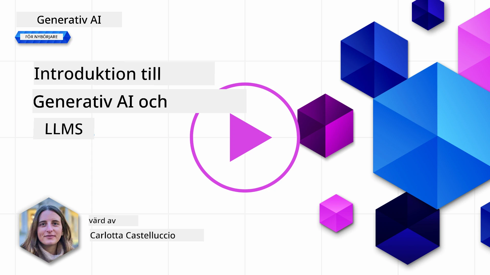
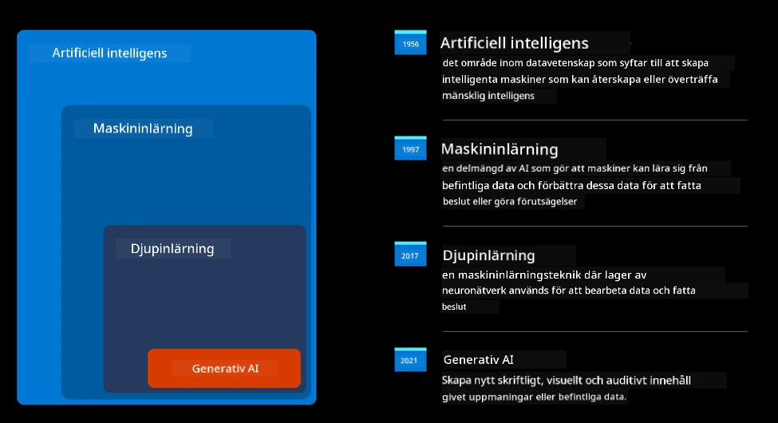
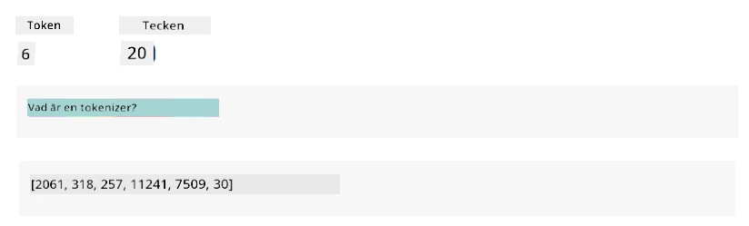
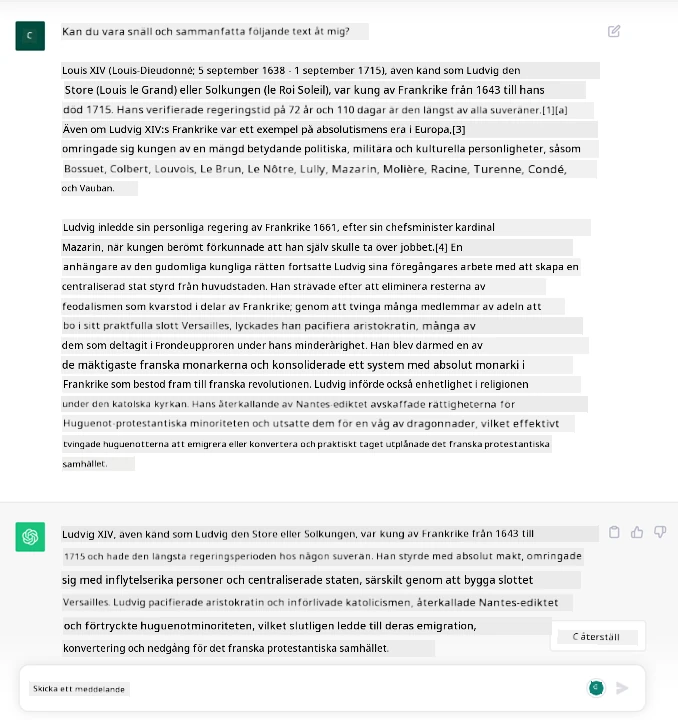
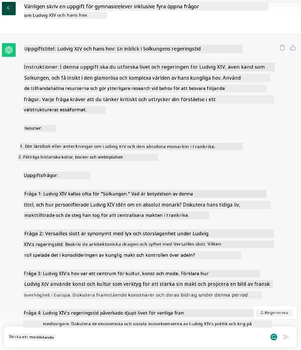
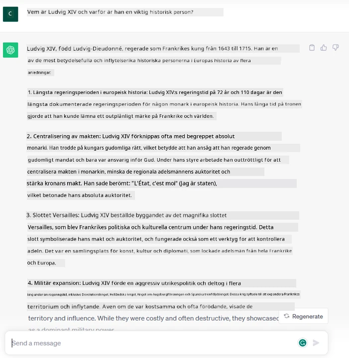
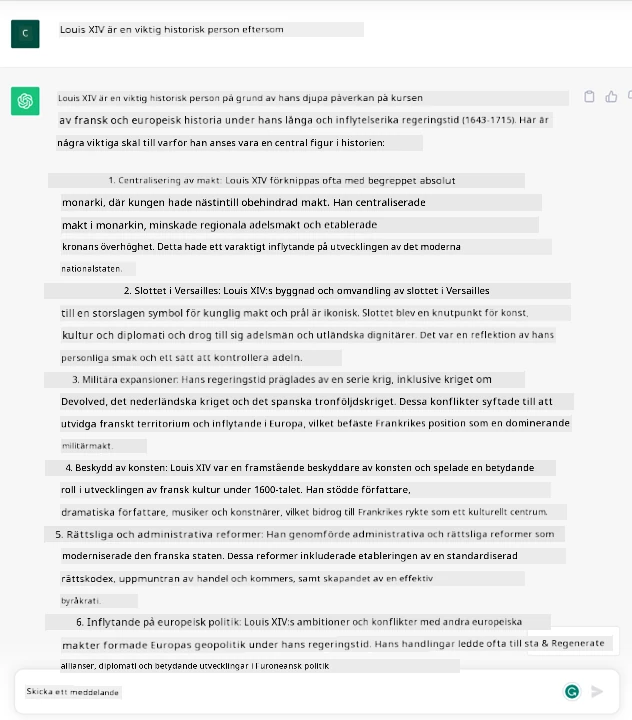
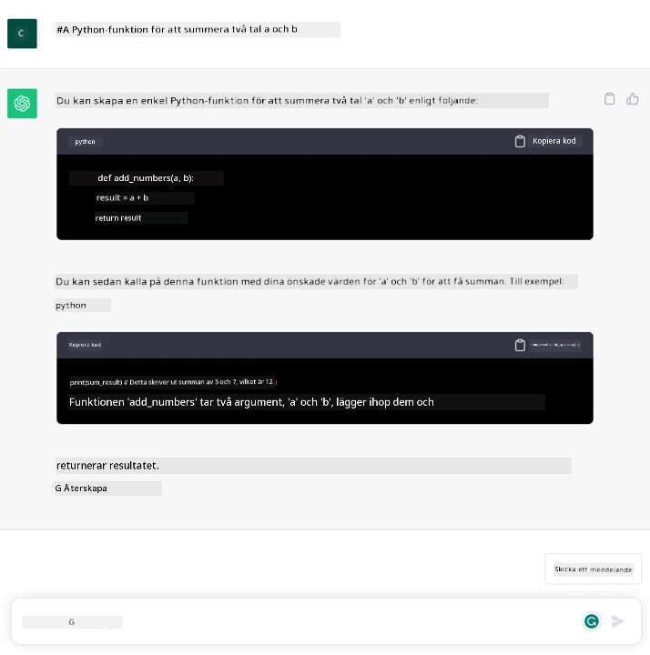

# Introduktion till Generativ AI och Stora Språkmodeller

_(Klicka på bilden ovan för att se videon till denna lektion)_

Generativ AI är artificiell intelligens kapabel att generera text, bilder och andra typer av innehåll. Det som gör det till en fantastisk teknik är att den demokratiserar AI, vem som helst kan använda den med så lite som ett textkommando, en mening skriven på naturligt språk. Det krävs ingen kunskap i språk som Java eller SQL för att åstadkomma något betydelsefullt, allt du behöver är att använda ditt språk, ange vad du vill ha och ut kommer ett förslag från en AI-modell. Användningsområdena och effekterna av detta är enorma, du kan skriva eller förstå rapporter, skriva ansökningar och mycket mer, allt på några sekunder.

I denna kursplan kommer vi att utforska hur vårt startup använder generativ AI för att låsa upp nya scenarier inom utbildningsvärlden och hur vi hanterar de oundvikliga utmaningarna kopplade till de sociala konsekvenserna av dess tillämpning och teknikens begränsningar.

## Introduktion

Denna lektion kommer att täcka:

- Introduktion till affärsscenariot: vår startup-idé och mission.
- Generativ AI och hur vi hamnade i den nuvarande teknologiska landskapet.
- Hur en stor språkmodell fungerar inuti.
- Huvudkapaciteter och praktiska användningsfall för Stora Språkmodeller.

## Lärandemål

Efter att ha genomfört denna lektion kommer du att förstå:

- Vad generativ AI är och hur Stora Språkmodeller fungerar.
- Hur du kan använda stora språkmodeller för olika användningsfall, med fokus på utbildningsscenarier.

## Scenario: vårt utbildnings-startup

Generativ artificiell intelligens (AI) representerar höjdpunkten inom AI-teknologin och pressar gränserna för vad som tidigare ansågs omöjligt. Generativa AI-modeller har flera möjligheter och tillämpningar, men för denna kursplan kommer vi att utforska hur den förändrar utbildningen genom ett fiktivt startup. Vi kommer att referera till detta startup som _vårt startup_. Vårt startup verkar inom utbildningsområdet med det ambitiösa uppdraget

> _att förbättra tillgängligheten till lärande, globalt, säkerställa rättvis tillgång till utbildning och erbjuda personliga lärandeupplevelser till varje elev, enligt deras behov_.

Vårt startup-team är medvetet om att vi inte kommer att kunna uppnå detta mål utan att utnyttja ett av de mest kraftfulla verktygen i modern tid – Stora Språkmodeller (LLMs).

Generativ AI förväntas revolutionera sättet vi lär och undervisar på idag, med studenter som har tillgång till virtuella lärare dygnet runt som förser dem med enorma mängder information och exempel, och lärare som kan använda innovativa verktyg för att bedöma sina elever och ge feedback.

För att börja, låt oss definiera några grundläggande begrepp och terminologi som vi kommer att använda genom hela kursplanen.

## Hur fick vi Generativ AI?

Trots den extraordinära _hypen_ som skapats nyligen av tillkännagivandet av generativa AI-modeller, är denna teknologi decennier i utveckling, med de första forskningsinsatserna som går tillbaka till 60-talet. Vi är nu vid en punkt där AI har mänskliga kognitiva förmågor, som konversation, exemplifierat av till exempel [OpenAI ChatGPT](https://openai.com/chatgpt) eller [Microsoft Copilot](https://copilot.microsoft.com/?WT.mc_id=academic-105485-koreyst), som också använder en GPT-modell för sin konversationella webbsökning.

För att backa lite, bestod de allra första AI-prototyperna av typade chatbottar, som förlitade sig på en kunskapsbas extraherad från en grupp experter och representerad i en dator. Svaren i kunskapsbasen utlösts av nyckelord som förekom i inmatningstexten.
Dock blev det snart tydligt att ett sådant tillvägagångssätt, med typade chatbottar, inte skalade väl.

### En statistisk metod för AI: Maskininlärning

En vändpunkt kom under 90-talet med tillämpningen av en statistisk metod för textanalys. Detta ledde till utvecklingen av nya algoritmer – kända som maskininlärning – som kunde lära sig mönster från data utan att vara explicit programmerade. Denna metod tillåter maskiner att simulera mänsklig språklig förståelse: en statistisk modell tränas på text-etikett-par, vilket gör modellen kapabel att klassificera okänd inmatningstext med en fördefinierad etikett som representerar budskapets intention.

### Neurala nätverk och moderna virtuella assistenter

Under de senaste åren har den teknologiska utvecklingen av hårdvara, kapabel att hantera större datamängder och mer komplexa beräkningar, uppmuntrat AI-forskning, vilket har lett till utvecklingen av avancerade maskininlärningsalgoritmer kända som neurala nätverk eller djupinlärningsalgoritmer.

Neurala nätverk (och särskilt Rekurrenta Neurala Nätverk – RNN) förbättrade kraftigt naturlig språkbehandling, vilket möjliggör en mer meningsfull representation av textens betydelse, där kontexten för ett ord i en mening värderas.

Detta är tekniken som drev de virtuella assistenter som föddes i första decenniet av det nya århundradet, mycket skickliga på att tolka mänskligt språk, identifiera ett behov och utföra en åtgärd för att tillfredsställa det – som att svara med ett fördefinierat manus eller använda en tredjepartstjänst.

### Nutidens Generativa AI

Så här kom vi fram till dagens Generativa AI, som kan ses som en underkategori av djupinlärning.

Efter decennier av forskning inom AI-området, övervann en ny modellarkitektur – kallad _Transformer_ – begränsningarna hos RNNs, då den kan ta mycket längre textsekvenser som indata. Transformers bygger på uppmärksamhetsmekanismen, vilket möjliggör för modellen att ge olika vikt till de indata den får, ‘lägga mer uppmärksamhet’ där den mest relevanta informationen koncentreras, oberoende av deras ordningsföljd i textsekvensen.

De flesta av de senaste generativa AI-modellerna – även kända som Stora Språkmodeller (LLMs), eftersom de arbetar med textuell in- och utdata – baseras faktiskt på denna arkitektur. Vad som är intressant med dessa modeller – tränade på en enorm mängd icke-etiketterad data från olika källor som böcker, artiklar och webbplatser – är att de kan anpassas till en mängd olika uppgifter och generera grammatiskt korrekt text med en sken av kreativitet. Så, de förbättrade inte bara maskinens förmåga att ‘förstå’ en inmatningstext på ett otroligt sätt, utan de möjliggjorde även dess kapacitet att generera ett originellt svar på mänskligt språk.

## Hur fungerar stora språkmodeller?

I nästa kapitel kommer vi att utforska olika typer av Generativa AI-modeller, men för nu, låt oss titta på hur stora språkmodeller fungerar, med fokus på OpenAI GPT (Generative Pre-trained Transformer) modeller.

- **Tokenizer, text till siffror**: Stora Språkmodeller tar emot text som indata och genererar text som utdata. Dock fungerar de statistiska modellerna mycket bättre med siffror än med textsekvenser. Därför bearbetas varje indata till modellen av en tokenizer, innan den används av kärnmodellen. En token är en textbit – bestående av ett varierande antal tecken, så tokenizerns huvuduppgift är att dela upp indata i en array av tokens. Därefter mappas varje token med ett tokenindex, vilket är den heltalskodning av den ursprungliga texten.

- **Förutsägelse av utdata-tokens**: Givet n tokens som indata (max n varierar mellan modeller) kan modellen förutsäga en token som utdata. Denna token införlivas sedan i indata för nästa iteration, i ett expanderande fönstermönster, vilket möjliggör en bättre användarupplevelse där man får en (eller flera) meningar som svar. Detta förklarar varför om du någonsin lekt med ChatGPT, kan det se ut som att den ibland slutar i mitten av en mening.

- **Urvalsprocess, sannolikhetsfördelning**: Utdata-token väljs av modellen enligt dess sannolikhet att förekomma efter den aktuella textsekvensen. Detta beror på att modellen förutspår en sannolikhetsfördelning över alla möjliga ‘nästa tokens’, beräknad utifrån dess träning. Dock är det inte alltid token med högsta sannolikhet som väljs från fördelningen. En grad av slumpmässighet läggs till detta val, så att modellen agerar på ett icke-deterministiskt sätt - vi får inte exakt samma utdata för samma indata. Denna grad av slumpmässighet läggs till för att simulera processen av kreativt tänkande och kan styras med en modellparameter kallad temperatur.

## Hur kan vårt startup utnyttja Stora Språkmodeller?

Nu när vi har en bättre förståelse för hur en stor språkmodell fungerar inuti, låt oss se några praktiska exempel på de vanligaste uppgifter de kan utföra ganska bra, med ett öga på vårt affärsscenario.
Vi sa att den huvudsakliga kapaciteten hos en Stor Språkmodell är _att generera text från grunden, med start från en textuell indata, skriven på naturligt språk_.

Men vilken typ av textuell indata och utdata?
Indatan till en stor språkmodell kallas prompt, medan utdata kallas completion, en term som refererar till modellens mekanism att generera nästa token för att fullborda den aktuella indatan. Vi kommer att gå på djupet i vad en prompt är och hur man utformar den för att få ut mesta möjliga av vår modell. Men för nu, låt oss bara säga att en prompt kan inkludera:

- En **instruktion** som specificerar vilken typ av svar vi förväntar oss från modellen. Denna instruktion kan ibland innehålla exempel eller ytterligare data.

  1. Sammanfattning av en artikel, bok, produktrecensioner med mera, tillsammans med utdrag av insikter från ostrukturerad data.
    
    
  
  2. Kreativ idéutveckling och utformning av en artikel, essä, uppgift eller mer.
      
     

- En **fråga**, ställd som en konversation med en agent.
  
  

- En textbit att **komplettera**, vilket implicit är en förfrågan om skrivhjälp.
  
  

- En kodbit tillsammans med en förfrågan om att förklara och dokumentera den, eller en kommentar som ber om generering av kod för att utföra en specifik uppgift.
  
  

Exemplen ovan är ganska enkla och är inte avsedda att vara en uttömmande demonstration av Stora Språkmodellers kapaciteter. De är menade att visa potentialen i att använda generativ AI, särskilt men inte begränsat till utbildningssammanhang.

Även så är utdata från en generativ AI-modell inte perfekt och ibland kan modellens kreativitet gå emot den, vilket resulterar i ett output som är en kombination av ord som den mänskliga användaren kan tolka som en mystifiering av verkligheten, eller som kan vara stötande. Generativ AI är inte intelligent – åtminstone inte i den mer omfattande definitionen av intelligens, som inkluderar kritiskt och kreativt tänkande eller emotionell intelligens; den är inte deterministisk, och den är inte pålitlig, eftersom fabriceringar, såsom felaktiga referenser, innehåll och uttalanden, kan kombineras med korrekt information och presenteras på ett övertygande och självsäkert sätt. I följande lektioner kommer vi att hantera alla dessa begränsningar och se vad vi kan göra för att mildra dem.

## Uppgift

Din uppgift är att läsa mer om [generativ AI](https://en.wikipedia.org/wiki/Generative_artificial_intelligence?WT.mc_id=academic-105485-koreyst) och försöka identifiera ett område där du skulle idag vilja lägga till generativ AI som ännu inte har det. Hur skulle effekten skilja sig från att göra det på ”det gamla sättet”, kan du göra något du inte kunde tidigare, eller är du snabbare? Skriv en 300-ords sammanfattning om hur ditt dröm-AI-startup skulle se ut och inkludera rubriker som ”Problem”, ”Hur jag skulle använda AI”, ”Effekt” och eventuellt en affärsplan.

Om du gjorde denna uppgift kan du till och med vara redo att ansöka till Microsofts inkubator, [Microsoft for Startups Founders Hub](https://www.microsoft.com/startups?WT.mc_id=academic-105485-koreyst) där vi erbjuder krediter för både Azure, OpenAI, mentorskap och mycket mer, kolla in det!

## Kunskapskontroll

Vad är sant om stora språkmodeller?

1. Du får exakt samma svar varje gång.
1. Den gör saker perfekt, är bra på att lägga till siffror, producera fungerande kod osv.
1. Svaret kan variera trots att samma prompt används. Den är också bra på att ge dig ett första utkast av något, vare sig det är text eller kod. Men du behöver förbättra resultaten.

A: 3, en LLM är icke-deterministisk, svaret varierar, men du kan styra variationen via en temperaturinställning. Du bör också inte förvänta dig att den gör saker perfekt, den är här för att göra det tunga arbetet åt dig vilket ofta betyder att du får ett bra första försök att sedan gradvis förbättra.

## Bra jobbat! Fortsätt resan

Efter att ha genomfört denna lektion, kolla in vår [Generative AI Learning collection](https://aka.ms/genai-collection?WT.mc_id=academic-105485-koreyst) för att fortsätta utveckla dina kunskaper om Generativ AI!

Gå till Lektion 2 där vi kommer att titta på hur man [utforskar och jämför olika typer av LLM](../02-exploring-and-comparing-different-llms/README.md?WT.mc_id=academic-105485-koreyst)!

---

<!-- CO-OP TRANSLATOR DISCLAIMER START -->
**Ansvarsfriskrivning**:
Detta dokument har översatts med hjälp av AI-översättningstjänsten [Co-op Translator](https://github.com/Azure/co-op-translator). Även om vi strävar efter noggrannhet, var vänlig notera att automatiska översättningar kan innehålla fel eller brister. Det ursprungliga dokumentet på dess modersmål bör betraktas som den auktoritativa källan. För kritisk information rekommenderas professionell mänsklig översättning. Vi ansvarar inte för några missförstånd eller feltolkningar som uppstår till följd av användningen av denna översättning.
<!-- CO-OP TRANSLATOR DISCLAIMER END -->