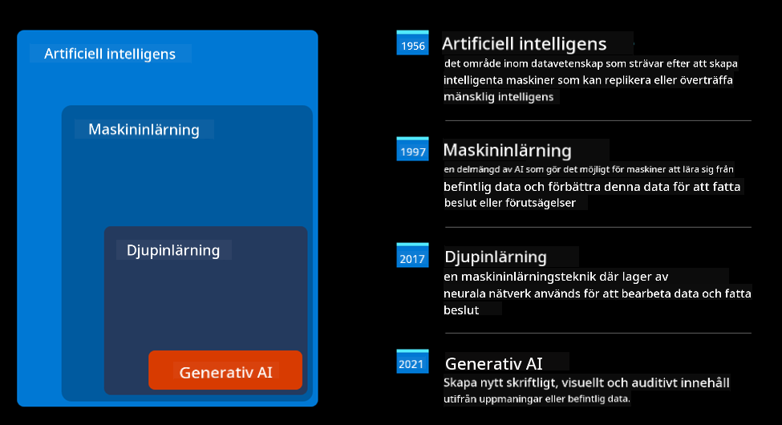
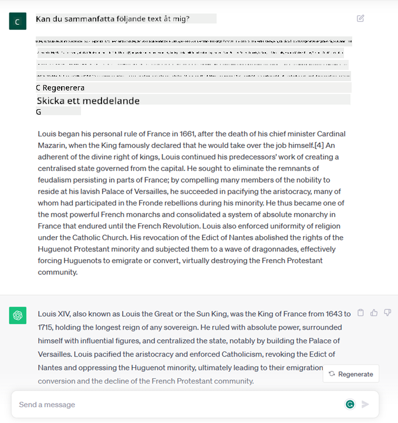
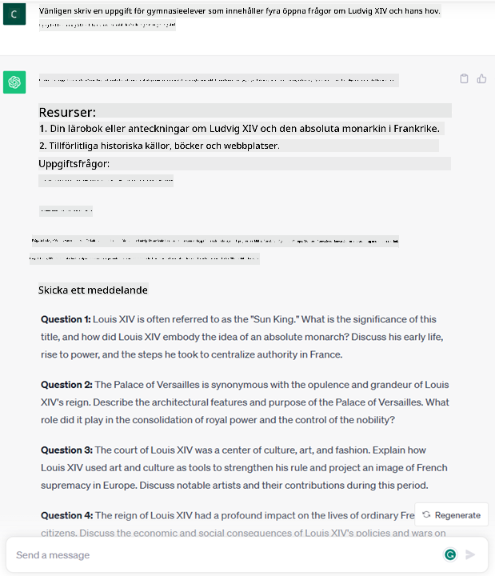
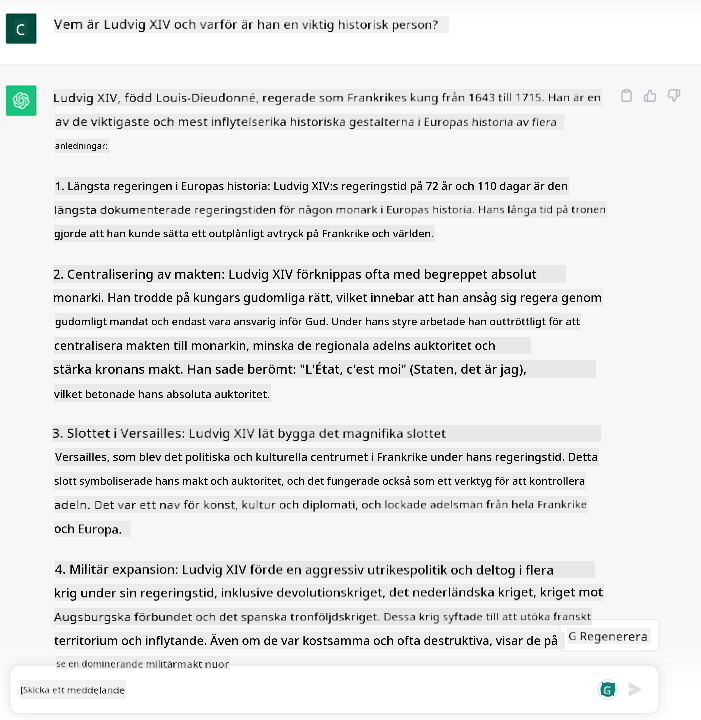

<!--
CO_OP_TRANSLATOR_METADATA:
{
  "original_hash": "f53ba0fa49164f9323043f1c6b11f2b1",
  "translation_date": "2025-07-09T07:54:18+00:00",
  "source_file": "01-introduction-to-genai/README.md",
  "language_code": "sv"
}
-->
# Introduktion till Generativ AI och Stora Språkmodeller

_(Klicka på bilden ovan för att se videon till denna lektion)_

Generativ AI är artificiell intelligens som kan skapa text, bilder och andra typer av innehåll. Det som gör teknologin fantastisk är att den demokratiserar AI – vem som helst kan använda den med bara en textprompt, en mening skriven på ett naturligt språk. Du behöver inte lära dig ett språk som Java eller SQL för att åstadkomma något meningsfullt, allt du behöver är att använda ditt språk, säga vad du vill och få ett förslag från en AI-modell. Användningsområdena och effekterna är enorma; du kan skriva eller förstå rapporter, skapa applikationer och mycket mer, allt på några sekunder.

I denna kurs kommer vi att utforska hur vårt startup använder generativ AI för att öppna upp nya möjligheter inom utbildningsvärlden och hur vi hanterar de oundvikliga utmaningarna kopplade till de sociala konsekvenserna av dess användning och teknologins begränsningar.

## Introduktion

Denna lektion kommer att täcka:

- Introduktion till affärsscenariot: vår startup-idé och mission.
- Generativ AI och hur vi hamnade i dagens teknologilandskap.
- Hur en stor språkmodell fungerar inuti.
- Huvudfunktioner och praktiska användningsområden för Stora Språkmodeller.

## Lärandemål

Efter att ha genomfört denna lektion kommer du att förstå:

- Vad generativ AI är och hur Stora Språkmodeller fungerar.
- Hur du kan använda stora språkmodeller för olika användningsområden, med fokus på utbildningsscenarier.

## Scenario: vårt utbildningsstartup

Generativ artificiell intelligens (AI) representerar toppen av AI-teknologin och tänjer på gränserna för vad som tidigare ansågs omöjligt. Generativa AI-modeller har flera förmågor och tillämpningar, men i denna kurs kommer vi att utforska hur den revolutionerar utbildning genom ett fiktivt startup. Vi kommer att kalla detta startup för _vårt startup_. Vårt startup verkar inom utbildningsområdet med det ambitiösa uppdraget att

> _förbättra tillgängligheten i lärande, på global nivå, säkerställa rättvis tillgång till utbildning och erbjuda personligt anpassade lärandeupplevelser till varje elev, utifrån deras behov_.

Vårt startup-team är medvetet om att vi inte kan nå detta mål utan att använda ett av de mest kraftfulla verktygen i modern tid – Stora Språkmodeller (LLMs).

Generativ AI förväntas revolutionera hur vi lär och undervisar idag, med elever som har tillgång till virtuella lärare dygnet runt som tillhandahåller enorma mängder information och exempel, och lärare som kan använda innovativa verktyg för att bedöma sina elever och ge feedback.

För att börja, låt oss definiera några grundläggande begrepp och terminologi som vi kommer att använda genom hela kursen.

## Hur fick vi Generativ AI?

Trots den enorma _hype_ som skapats nyligen kring generativa AI-modeller, är denna teknologi decennier gammal, med de första forskningsinsatserna som går tillbaka till 60-talet. Vi är nu vid en punkt där AI har mänskliga kognitiva förmågor, som konversation, vilket visas av exempelvis [OpenAI ChatGPT](https://openai.com/chatgpt) eller [Bing Chat](https://www.microsoft.com/edge/features/bing-chat?WT.mc_id=academic-105485-koreyst), som också använder en GPT-modell för webbsökning och Bing-konversationer.

Om vi backar lite, bestod de allra första AI-prototyperna av textbaserade chatbots, som förlitade sig på en kunskapsbas hämtad från en grupp experter och representerad i en dator. Svaren i kunskapsbasen utlösts av nyckelord som dök upp i inmatningstexten.  
Men det blev snart tydligt att en sådan metod, med textbaserade chatbots, inte skalade särskilt bra.

### En statistisk metod för AI: Maskininlärning

En vändpunkt kom under 90-talet, med tillämpningen av en statistisk metod för textanalys. Detta ledde till utvecklingen av nya algoritmer – kända som maskininlärning – som kan lära sig mönster från data utan att vara explicit programmerade. Denna metod gör det möjligt för maskiner att simulera mänsklig språkförståelse: en statistisk modell tränas på text-etikett-par, vilket gör att modellen kan klassificera okänd inmatningstext med en fördefinierad etikett som representerar avsikten med meddelandet.

### Neurala nätverk och moderna virtuella assistenter

Under de senaste åren har den teknologiska utvecklingen av hårdvara, som kan hantera större datamängder och mer komplexa beräkningar, drivit AI-forskningen framåt, vilket lett till utvecklingen av avancerade maskininlärningsalgoritmer kända som neurala nätverk eller djupinlärningsalgoritmer.

Neurala nätverk (och särskilt Recurrent Neural Networks – RNNs) förbättrade naturlig språkbehandling avsevärt, genom att möjliggöra en mer meningsfull representation av textens betydelse, där kontexten för ett ord i en mening värderas.

Detta är teknologin som drev de virtuella assistenter som föddes under det första decenniet av 2000-talet, mycket skickliga på att tolka mänskligt språk, identifiera ett behov och utföra en handling för att tillfredsställa det – som att svara med ett fördefinierat manus eller använda en tredjepartstjänst.

### Nutid, Generativ AI

Så här kom vi fram till dagens Generativa AI, som kan ses som en underkategori av djupinlärning.

Efter decennier av forskning inom AI-området, övervann en ny modellarkitektur – kallad _Transformer_ – begränsningarna hos RNNs, genom att kunna ta emot mycket längre textsekvenser som indata. Transformers bygger på en uppmärksamhetsmekanism, som gör att modellen kan ge olika vikt åt de indata den får, och ‘lägga mer fokus’ där den mest relevanta informationen finns, oavsett ordningen i textsekvensen.

De flesta av de senaste generativa AI-modellerna – även kallade Stora Språkmodeller (LLMs), eftersom de arbetar med textbaserade in- och utdata – bygger faktiskt på denna arkitektur. Det intressanta med dessa modeller – tränade på enorma mängder oetiketterad data från olika källor som böcker, artiklar och webbplatser – är att de kan anpassas till en mängd olika uppgifter och generera grammatiskt korrekt text med en viss kreativitet. Så de har inte bara förbättrat maskinens förmåga att ‘förstå’ en inmatad text, utan också möjliggjort att den kan generera ett originellt svar på mänskligt språk.

## Hur fungerar stora språkmodeller?

I nästa kapitel kommer vi att utforska olika typer av generativa AI-modeller, men för nu ska vi titta på hur stora språkmodeller fungerar, med fokus på OpenAI GPT (Generative Pre-trained Transformer) modeller.

- **Tokenizer, text till siffror**: Stora Språkmodeller tar emot text som indata och genererar text som utdata. Men eftersom de är statistiska modeller fungerar de mycket bättre med siffror än med textsekvenser. Därför bearbetas varje indata till modellen av en tokenizer innan den används av kärnmodellen. En token är en textbit – bestående av ett varierande antal tecken, så tokenizerns huvuduppgift är att dela upp indata i en lista av tokens. Sedan mappas varje token till ett tokenindex, vilket är den heltalskodning som representerar den ursprungliga textbiten.

- **Förutsäga utdata-tokens**: Givet n tokens som indata (med max n som varierar mellan modeller), kan modellen förutsäga en token som utdata. Denna token införlivas sedan i indatan för nästa iteration, i ett expanderande fönstermönster, vilket ger en bättre användarupplevelse där man får en (eller flera) meningar som svar. Detta förklarar varför, om du någonsin använt ChatGPT, du ibland kan märka att den slutar mitt i en mening.

- **Urvalsprocess, sannolikhetsfördelning**: Utdata-token väljs av modellen baserat på sannolikheten att den följer efter den aktuella textsekvensen. Detta eftersom modellen förutspår en sannolikhetsfördelning över alla möjliga ‘nästa tokens’, beräknad utifrån dess träning. Men det är inte alltid token med högst sannolikhet som väljs från fördelningen. En viss grad av slumpmässighet läggs till detta val, så att modellen agerar icke-deterministiskt – vi får inte exakt samma svar för samma indata. Denna slumpmässighet läggs till för att simulera kreativt tänkande och kan justeras med en modellparameter som kallas temperature.

## Hur kan vårt startup använda Stora Språkmodeller?

Nu när vi har en bättre förståelse för hur en stor språkmodell fungerar inuti, låt oss titta på några praktiska exempel på vanliga uppgifter de kan utföra ganska bra, med fokus på vårt affärsscenario.  
Vi sa att huvudförmågan hos en Stor Språkmodell är _att generera text från grunden, utifrån en textuell indata, skriven på naturligt språk_.

Men vilken typ av textinmatning och utdata?  
Indatan till en stor språkmodell kallas en prompt, medan utdata kallas en completion, ett begrepp som syftar på modellens mekanism att generera nästa token för att komplettera den aktuella indatan. Vi kommer att fördjupa oss i vad en prompt är och hur man utformar den för att få ut mesta möjliga av modellen. Men för nu kan vi säga att en prompt kan innehålla:

- En **instruktion** som specificerar vilken typ av utdata vi förväntar oss från modellen. Denna instruktion kan ibland innehålla exempel eller ytterligare data.

  1. Sammanfattning av en artikel, bok, produktrecensioner med mera, samt extrahering av insikter från ostrukturerad data.
    
    
  
  2. Kreativ idéutveckling och utformning av en artikel, uppsats, uppgift eller mer.
      
     

- En **fråga**, ställd i form av en konversation med en agent.
  
  

- En textbit som ska **kompletteras**, vilket implicit är en förfrågan om skrivhjälp.
  
  

- En kodbit tillsammans med en förfrågan om att förklara och dokumentera den, eller en kommentar som ber om att generera en kodsnutt som utför en specifik uppgift.
  
  

Exemplen ovan är ganska enkla och är inte avsedda att vara en uttömmande demonstration av Stora Språkmodellers kapacitet. De är till för att visa potentialen i att använda generativ AI, särskilt men inte enbart i utbildningssammanhang.

Dessutom är utdata från en generativ AI-modell inte perfekt och ibland kan modellens kreativitet slå tillbaka, vilket resulterar i ett svar som är en kombination av ord som användaren kan uppfatta som en förvrängning av verkligheten, eller som kan vara stötande. Generativ AI är inte intelligent – åtminstone inte i den mer omfattande definitionen av intelligens, som inkluderar kritiskt och kreativt tänkande eller emotionell intelligens; den är inte deterministisk och inte pålitlig, eftersom fabriceringar, som felaktiga referenser, innehåll och påståenden, kan blandas med korrekt information och presenteras på ett övertygande och självsäkert sätt. I de följande lektionerna kommer vi att ta itu med alla dessa begränsningar och se vad vi kan göra för att mildra dem.

## Uppgift

Din uppgift är att läsa mer om [generativ AI](https://en.wikipedia.org/wiki/Generative_artificial_intelligence?WT.mc_id=academic-105485-koreyst) och försöka identifiera ett område där du skulle kunna införa generativ AI idag där det inte finns. Hur skulle effekten skilja sig från att göra det på det "gamla sättet", kan du göra något du inte kunde tidigare, eller går det snabbare? Skriv en sammanfattning på 300 ord om hur ditt dröm-AI-startup skulle se ut och inkludera rubriker som "Problem", "Hur jag skulle använda AI", "Effekt" och eventuellt en affärsplan.

Om du gör denna uppgift kan du till och med vara redo att ansöka till Microsofts inkubator, [Microsoft for Startups Founders Hub](https://www.microsoft.com/startups?WT.mc_id=academic-105485-koreyst) där vi erbjuder krediter för både Azure, OpenAI, mentorskap och mycket mer, kolla in det!

## Kunskapskontroll

Vad stämmer om stora språkmodeller?

1. Du får exakt samma svar varje gång.  
1. Den gör saker perfekt, är bra på att addera siffror, producera fungerande kod osv.  
1. Svaret kan variera trots samma prompt. Den är också bra på att ge dig ett första utkast av något, vare sig det är text eller kod. Men du behöver förbättra resultatet.

Svar: 3, en LLM är icke-deterministisk, svaret varierar, men du kan styra variationen via en temperaturinställning. Du bör inte heller förvänta dig att den gör allt perfekt, den är här för att göra det tunga jobbet åt dig vilket ofta innebär att du får ett bra första försök som du behöver förbättra successivt.

## Bra jobbat! Fortsätt resan

Efter att ha avslutat denna lektion, kolla in vår [Generative AI Learning collection](https://aka.ms/genai-collection?WT.mc_id=academic-105485-koreyst) för att fortsätta utveckla dina kunskaper inom Generativ AI!
Gå vidare till Lektion 2 där vi kommer att titta på hur man [utforskar och jämför olika typer av LLM](../02-exploring-and-comparing-different-llms/README.md?WT.mc_id=academic-105485-koreyst)!

**Ansvarsfriskrivning**:  
Detta dokument har översatts med hjälp av AI-översättningstjänsten [Co-op Translator](https://github.com/Azure/co-op-translator). Även om vi strävar efter noggrannhet, vänligen observera att automatiska översättningar kan innehålla fel eller brister. Det ursprungliga dokumentet på dess modersmål bör betraktas som den auktoritativa källan. För kritisk information rekommenderas professionell mänsklig översättning. Vi ansvarar inte för några missförstånd eller feltolkningar som uppstår till följd av användningen av denna översättning.