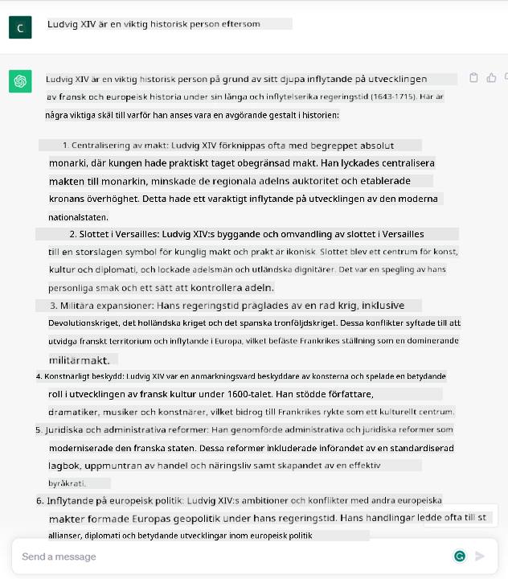

<!--
CO_OP_TRANSLATOR_METADATA:
{
  "original_hash": "bfb7901bdbece1ba3e9f35c400ca33e8",
  "translation_date": "2025-10-17T19:04:27+00:00",
  "source_file": "01-introduction-to-genai/README.md",
  "language_code": "sv"
}
-->
# Introduktion till Generativ AI och Stora Språkmodeller

_(Klicka på bilden ovan för att se videon till denna lektion)_

Generativ AI är artificiell intelligens som kan generera text, bilder och andra typer av innehåll. Det som gör det till en fantastisk teknologi är att det demokratiserar AI – vem som helst kan använda det med så lite som en textprompt, en mening skriven på naturligt språk. Du behöver inte lära dig ett programmeringsspråk som Java eller SQL för att åstadkomma något värdefullt, allt du behöver göra är att använda ditt språk, uttrycka vad du vill och få ett förslag från en AI-modell. Användningsområdena och effekterna av detta är enorma – du kan skriva eller förstå rapporter, skapa applikationer och mycket mer, allt på några sekunder.

I denna kursplan kommer vi att utforska hur vår startup använder generativ AI för att öppna upp nya möjligheter inom utbildningsvärlden och hur vi hanterar de oundvikliga utmaningarna kopplade till de sociala konsekvenserna av dess användning och teknologins begränsningar.

## Introduktion

Denna lektion kommer att täcka:

- Introduktion till affärsscenariot: vår startup-idé och mission.
- Generativ AI och hur vi hamnade i det nuvarande teknologiska landskapet.
- Hur en stor språkmodell fungerar.
- Huvudfunktioner och praktiska användningsområden för Stora Språkmodeller.

## Lärandemål

Efter att ha genomfört denna lektion kommer du att förstå:

- Vad generativ AI är och hur Stora Språkmodeller fungerar.
- Hur du kan använda Stora Språkmodeller för olika användningsområden, med fokus på utbildningsscenarier.

## Scenario: vår utbildningsstartup

Generativ artificiell intelligens (AI) representerar toppen av AI-teknologi och utmanar gränserna för vad som en gång ansågs vara omöjligt. Generativa AI-modeller har flera funktioner och användningsområden, men för denna kursplan kommer vi att utforska hur det revolutionerar utbildning genom en fiktiv startup. Vi kommer att referera till denna startup som _vår startup_. Vår startup arbetar inom utbildningsområdet med det ambitiösa mission statement:

> _att förbättra tillgängligheten till lärande på global nivå, säkerställa rättvis tillgång till utbildning och erbjuda personliga lärandeupplevelser för varje elev, enligt deras behov_.

Vårt startup-team är medvetet om att vi inte kommer att kunna uppnå detta mål utan att använda ett av de mest kraftfulla verktygen i modern tid – Stora Språkmodeller (LLMs).

Generativ AI förväntas revolutionera sättet vi lär oss och undervisar idag, med studenter som har tillgång till virtuella lärare dygnet runt som tillhandahåller enorma mängder information och exempel, och lärare som kan använda innovativa verktyg för att bedöma sina elever och ge feedback.

För att börja, låt oss definiera några grundläggande begrepp och terminologi som vi kommer att använda genom kursplanen.

## Hur fick vi Generativ AI?

Trots den extraordinära _hypen_ som nyligen skapats av tillkännagivandet av generativa AI-modeller, har denna teknologi utvecklats under flera decennier, med de första forskningsinsatserna som går tillbaka till 60-talet. Vi är nu vid en punkt där AI har mänskliga kognitiva förmågor, som konversation, vilket visas av exempelvis [OpenAI ChatGPT](https://openai.com/chatgpt) eller [Bing Chat](https://www.microsoft.com/edge/features/bing-chat?WT.mc_id=academic-105485-koreyst), som också använder en GPT-modell för webbsökningar och Bing-konversationer.

Om vi backar lite, bestod de allra första prototyperna av AI av skrivna chatbots, som förlitade sig på en kunskapsbas som extraherats från en grupp experter och representerats i en dator. Svaren i kunskapsbasen utlöste av nyckelord som dök upp i den inskrivna texten.
Men det blev snart tydligt att en sådan metod, med skrivna chatbots, inte skalade väl.

### En statistisk metod för AI: Maskininlärning

En vändpunkt kom under 90-talet, med tillämpningen av en statistisk metod för textanalys. Detta ledde till utvecklingen av nya algoritmer – kända som maskininlärning – som kunde lära sig mönster från data utan att vara explicit programmerade. Denna metod gjorde det möjligt för maskiner att simulera mänsklig språkförståelse: en statistisk modell tränades på text-etikett-par, vilket gjorde det möjligt för modellen att klassificera okänd inskrivning med en fördefinierad etikett som representerar meddelandets intention.

### Neurala nätverk och moderna virtuella assistenter

Under de senaste åren har den teknologiska utvecklingen av hårdvara, som kan hantera större mängder data och mer komplexa beräkningar, uppmuntrat forskning inom AI, vilket ledde till utvecklingen av avancerade maskininlärningsalgoritmer kända som neurala nätverk eller djupinlärningsalgoritmer.

Neurala nätverk (och särskilt Recurrent Neural Networks – RNNs) förbättrade avsevärt naturlig språkbehandling, vilket möjliggjorde representationen av textens betydelse på ett mer meningsfullt sätt, genom att värdera ordets kontext i en mening.

Detta är teknologin som drev de virtuella assistenterna som föddes under det första decenniet av det nya århundradet, mycket skickliga på att tolka mänskligt språk, identifiera ett behov och utföra en åtgärd för att tillfredsställa det – som att svara med ett fördefinierat manus eller använda en tredjepartstjänst.

### Nutid, Generativ AI

Så här kom vi till Generativ AI idag, som kan ses som en underkategori av djupinlärning.

Efter decennier av forskning inom AI-fältet övervanns begränsningarna hos RNNs med en ny modellarkitektur – kallad _Transformer_ – som kunde ta mycket längre textsekvenser som input. Transformers är baserade på uppmärksamhetsmekanismen, vilket gör det möjligt för modellen att ge olika vikter till den input den får, ‘lägga mer uppmärksamhet’ där den mest relevanta informationen är koncentrerad, oavsett deras ordning i textsekvensen.

De flesta av de senaste generativa AI-modellerna – även kända som Stora Språkmodeller (LLMs), eftersom de arbetar med textbaserade input och output – är faktiskt baserade på denna arkitektur. Det som är intressant med dessa modeller – tränade på enorma mängder oetiketterad data från olika källor som böcker, artiklar och webbplatser – är att de kan anpassas till en mängd olika uppgifter och generera grammatiskt korrekt text med en viss kreativitet. Så, inte bara har de otroligt förbättrat en maskins förmåga att ‘förstå’ en inskrivning, utan de har också gjort det möjligt för den att generera ett originellt svar på mänskligt språk.

## Hur fungerar stora språkmodeller?

I nästa kapitel kommer vi att utforska olika typer av generativa AI-modeller, men för nu ska vi titta på hur stora språkmodeller fungerar, med fokus på OpenAI GPT (Generative Pre-trained Transformer) modeller.

- **Tokenizer, text till siffror**: Stora Språkmodeller tar emot en text som input och genererar en text som output. Men eftersom de är statistiska modeller fungerar de mycket bättre med siffror än textsekvenser. Därför bearbetas varje input till modellen av en tokenizer innan den används av kärnmodellen. En token är en textbit – bestående av ett variabelt antal tecken, så tokenizerns huvuduppgift är att dela upp input i en array av tokens. Sedan mappas varje token med ett tokenindex, vilket är den heltalskodning av den ursprungliga textbiten.

- **Förutsägelse av output-tokens**: Givet n tokens som input (med max n som varierar från en modell till en annan), kan modellen förutsäga en token som output. Denna token införlivas sedan i input för nästa iteration, i ett expanderande fönstermönster, vilket möjliggör en bättre användarupplevelse av att få en (eller flera) meningar som svar. Detta förklarar varför, om du någonsin har lekt med ChatGPT, du kanske har märkt att det ibland verkar som att det stannar mitt i en mening.

- **Urvalsprocess, sannolikhetsfördelning**: Output-token väljs av modellen enligt dess sannolikhet att förekomma efter den aktuella textsekvensen. Detta beror på att modellen förutsäger en sannolikhetsfördelning över alla möjliga ‘nästa tokens’, beräknad baserat på dess träning. Men det är inte alltid token med högst sannolikhet som väljs från den resulterande fördelningen. En grad av slumpmässighet läggs till detta val, på ett sätt som gör att modellen agerar på ett icke-deterministiskt sätt – vi får inte exakt samma output för samma input. Denna grad av slumpmässighet läggs till för att simulera processen av kreativt tänkande och kan justeras med en modellparameter kallad temperatur.

## Hur kan vår startup använda Stora Språkmodeller?

Nu när vi har en bättre förståelse för hur en stor språkmodell fungerar, låt oss se några praktiska exempel på de vanligaste uppgifterna de kan utföra ganska bra, med fokus på vårt affärsscenario.
Vi sa att den huvudsakliga förmågan hos en Stor Språkmodell är _att generera text från grunden, med utgångspunkt i en textbaserad input, skriven på naturligt språk_.

Men vilken typ av textbaserad input och output?
Input till en stor språkmodell kallas en prompt, medan output kallas en completion, en term som hänvisar till modellens mekanism att generera nästa token för att komplettera den aktuella inputen. Vi kommer att fördjupa oss i vad en prompt är och hur man designar den för att få ut det mesta av vår modell. Men för nu, låt oss bara säga att en prompt kan inkludera:

- En **instruktion** som specificerar vilken typ av output vi förväntar oss från modellen. Denna instruktion kan ibland innehålla några exempel eller ytterligare data.

  1. Sammanfattning av en artikel, bok, produktrecensioner och mer, tillsammans med insiktsutvinning från ostrukturerad data.
    
    
  
  2. Kreativ idéutveckling och design av en artikel, ett essä, en uppgift eller mer.
      
     

- En **fråga**, ställd i form av en konversation med en agent.
  
  

- En bit **text att komplettera**, vilket implicit är en begäran om skrivhjälp.
  
  

- En bit **kod** tillsammans med en begäran om att förklara och dokumentera den, eller en kommentar som ber om att generera en kodbit som utför en specifik uppgift.
  
  

Exemplen ovan är ganska enkla och är inte avsedda att vara en uttömmande demonstration av Stora Språkmodellers kapabiliteter. De är avsedda att visa potentialen med att använda generativ AI, särskilt men inte begränsat till utbildningssammanhang.

Dessutom är output från en generativ AI-modell inte perfekt och ibland kan modellens kreativitet motarbeta den, vilket resulterar i en output som är en kombination av ord som den mänskliga användaren kan tolka som en förvrängning av verkligheten, eller som kan vara stötande. Generativ AI är inte intelligent – åtminstone inte enligt den mer omfattande definitionen av intelligens, inklusive kritiskt och kreativt tänkande eller emotionell intelligens; den är inte deterministisk och den är inte pålitlig, eftersom fabriceringar, såsom felaktiga referenser, innehåll och uttalanden, kan kombineras med korrekt information och presenteras på ett övertygande och självsäkert sätt. I de följande lektionerna kommer vi att hantera alla dessa begränsningar och se vad vi kan göra för att mildra dem.

## Uppgift

Din uppgift är att läsa mer om [generativ AI](https://en.wikipedia.org/wiki/Generative_artificial_intelligence?WT.mc_id=academic-105485-koreyst) och försöka identifiera ett område där du skulle lägga till generativ AI idag som inte har det. Hur skulle effekten skilja sig från att göra det på det "gamla sättet", kan du göra något du inte kunde förut, eller är du snabbare? Skriv en sammanfattning på 300 ord om hur din dröm-AI-startup skulle se ut och inkludera rubriker som "Problem", "Hur jag skulle använda AI", "Effekt" och eventuellt en affärsplan.

Om du gjorde denna uppgift kanske du till och med är redo att ansöka till Microsofts inkubator, [Microsoft for Startups Founders Hub](https://www.microsoft.com/startups?WT.mc_id=academic-105485-koreyst) där vi erbjuder krediter för både Azure, OpenAI, mentorskap och mycket mer, kolla in det!

## Kunskapskontroll

Vad är sant om stora språkmodeller?

1. Du får exakt samma svar varje gång.
1. Den gör saker perfekt, är bra på att lägga till siffror, producera fungerande kod etc.
1. Svaret kan variera trots att du använder samma prompt. Den är också bra på att ge dig ett första utkast av något, vare sig det är text eller kod. Men du behöver förbättra resultaten.

A: 3, en LLM är icke-deterministisk, svaret varierar, men du kan kontrollera dess variation via en temperaturinställning. Du bör inte heller förvänta dig att den gör saker perfekt, den är här för att göra det tunga arbetet åt dig vilket ofta innebär att du får ett bra första försök på något som du gradvis behöver förbättra.

## Bra jobbat! Fortsätt resan

Efter att ha genomfört denna lektion, kolla in vår [Generative AI Learning collection](https://aka.ms/genai-collection?WT.mc_id=academic-105485-koreyst) för att fortsätta utveckla din kunskap om Generativ AI!
Gå vidare till Lektion 2 där vi kommer att titta på hur man [utforskar och jämför olika typer av LLM](../02-exploring-and-comparing-different-llms/README.md?WT.mc_id=academic-105485-koreyst)!

---

**Ansvarsfriskrivning**:  
Detta dokument har översatts med hjälp av AI-översättningstjänsten [Co-op Translator](https://github.com/Azure/co-op-translator). Även om vi strävar efter noggrannhet, bör det noteras att automatiserade översättningar kan innehålla fel eller felaktigheter. Det ursprungliga dokumentet på dess ursprungliga språk bör betraktas som den auktoritativa källan. För kritisk information rekommenderas professionell mänsklig översättning. Vi ansvarar inte för eventuella missförstånd eller feltolkningar som uppstår vid användning av denna översättning.