<!--
CO_OP_TRANSLATOR_METADATA:
{
  "original_hash": "e2f686f2eb794941761252ac5e8e090b",
  "translation_date": "2025-07-09T08:28:13+00:00",
  "source_file": "02-exploring-and-comparing-different-llms/README.md",
  "language_code": "sv"
}
-->
# Utforska och jämföra olika LLMs

[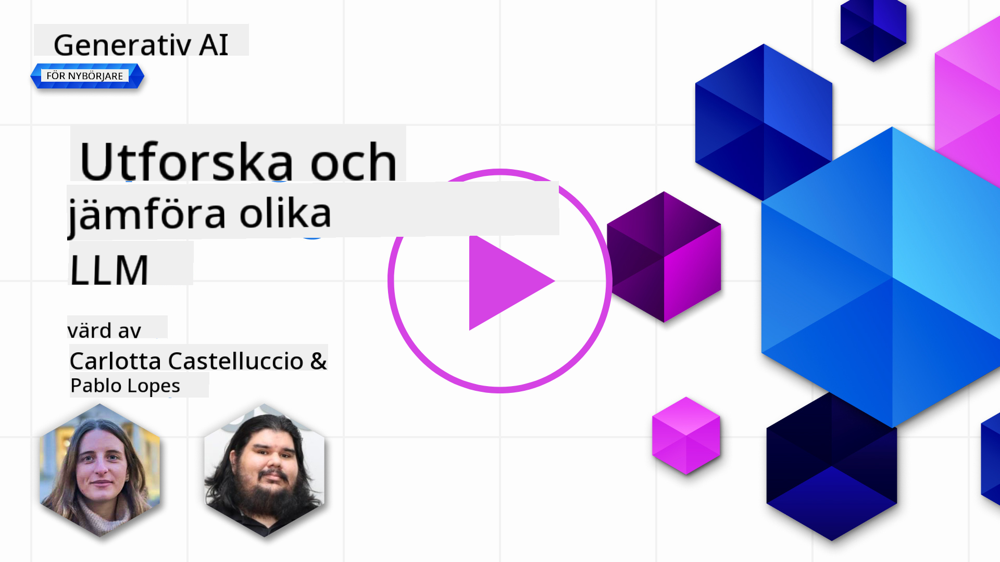](https://aka.ms/gen-ai-lesson2-gh?WT.mc_id=academic-105485-koreyst)

> _Klicka på bilden ovan för att se videon till denna lektion_

I föregående lektion har vi sett hur Generativ AI förändrar tekniklandskapet, hur Large Language Models (LLMs) fungerar och hur ett företag – som vår startup – kan använda dem för sina användningsområden och växa! I detta kapitel ska vi jämföra och kontrastera olika typer av stora språkmodeller (LLMs) för att förstå deras för- och nackdelar.

Nästa steg i vår startups resa är att utforska det nuvarande landskapet av LLMs och förstå vilka som passar för vårt användningsfall.

## Introduktion

Denna lektion kommer att täcka:

- Olika typer av LLMs i dagens landskap.
- Testa, iterera och jämföra olika modeller för ditt användningsfall i Azure.
- Hur man distribuerar en LLM.

## Lärandemål

Efter att ha genomfört denna lektion kommer du att kunna:

- Välja rätt modell för ditt användningsfall.
- Förstå hur man testar, itererar och förbättrar modellens prestanda.
- Veta hur företag distribuerar modeller.

## Förstå olika typer av LLMs

LLMs kan kategoriseras på flera sätt baserat på deras arkitektur, träningsdata och användningsområde. Att förstå dessa skillnader hjälper vår startup att välja rätt modell för scenariot och förstå hur man testar, itererar och förbättrar prestandan.

Det finns många olika typer av LLM-modeller, och ditt val beror på vad du vill använda dem till, din data, hur mycket du är beredd att betala och mer.

Beroende på om du vill använda modellerna för text, ljud, video, bildgenerering och så vidare, kan du behöva välja en annan typ av modell.

- **Ljud- och taligenkänning**. För detta ändamål är Whisper-typ modeller ett utmärkt val eftersom de är allmänna och inriktade på taligenkänning. De är tränade på varierande ljud och kan utföra flerspråkig taligenkänning. Läs mer om [Whisper-typ modeller här](https://platform.openai.com/docs/models/whisper?WT.mc_id=academic-105485-koreyst).

- **Bildgenerering**. För bildgenerering är DALL-E och Midjourney två mycket välkända val. DALL-E erbjuds via Azure OpenAI. [Läs mer om DALL-E här](https://platform.openai.com/docs/models/dall-e?WT.mc_id=academic-105485-koreyst) och även i kapitel 9 i denna kursplan.

- **Textgenerering**. De flesta modeller är tränade för textgenerering och du har ett stort urval från GPT-3.5 till GPT-4. De har olika kostnader där GPT-4 är den dyraste. Det är värt att titta på [Azure OpenAI playground](https://oai.azure.com/portal/playground?WT.mc_id=academic-105485-koreyst) för att utvärdera vilka modeller som bäst passar dina behov vad gäller kapacitet och kostnad.

- **Multimodalitet**. Om du vill hantera flera typer av data i in- och utdata kan du vilja titta på modeller som [gpt-4 turbo med vision eller gpt-4o](https://learn.microsoft.com/azure/ai-services/openai/concepts/models#gpt-4-and-gpt-4-turbo-models?WT.mc_id=academic-105485-koreyst) – de senaste OpenAI-modellerna – som kan kombinera naturlig språkbehandling med visuell förståelse, vilket möjliggör interaktioner via multimodala gränssnitt.

Att välja en modell innebär att du får vissa grundläggande funktioner, men det räcker ofta inte. Ofta har du företagspecifik data som du på något sätt behöver informera LLM om. Det finns några olika sätt att närma sig detta, mer om det i kommande avsnitt.

### Foundation Models kontra LLMs

Begreppet Foundation Model myntades av forskare vid Stanford och definieras som en AI-modell som uppfyller vissa kriterier, såsom:

- **De tränas med oövervakad eller självövervakad inlärning**, vilket innebär att de tränas på omärkt multimodal data och inte kräver mänsklig annotering eller märkning av data för träningsprocessen.
- **De är mycket stora modeller**, baserade på mycket djupa neurala nätverk tränade på miljarder parametrar.
- **De är normalt avsedda att fungera som en ‘grund’ för andra modeller**, vilket betyder att de kan användas som utgångspunkt för att bygga andra modeller ovanpå, vilket kan göras genom finjustering.

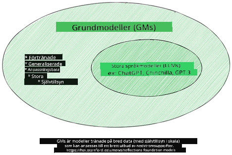

Bildkälla: [Essential Guide to Foundation Models and Large Language Models | by Babar M Bhatti | Medium](https://thebabar.medium.com/essential-guide-to-foundation-models-and-large-language-models-27dab58f7404)

För att ytterligare förtydliga denna skillnad, låt oss ta ChatGPT som exempel. För att bygga den första versionen av ChatGPT användes en modell som heter GPT-3.5 som foundation model. Det betyder att OpenAI använde viss chatt-specifik data för att skapa en finjusterad version av GPT-3.5 som var specialiserad på att prestera bra i konversationsscenarier, som chattbotar.

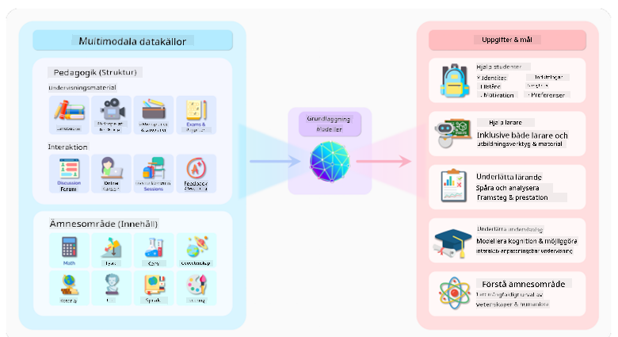

Bildkälla: [2108.07258.pdf (arxiv.org)](https://arxiv.org/pdf/2108.07258.pdf?WT.mc_id=academic-105485-koreyst)

### Open Source kontra Proprietära modeller

Ett annat sätt att kategorisera LLMs är om de är open source eller proprietära.

Open source-modeller är modeller som görs tillgängliga för allmänheten och kan användas av vem som helst. De görs ofta tillgängliga av företaget som skapade dem eller av forskarsamhället. Dessa modeller får inspekteras, modifieras och anpassas för olika användningsområden inom LLMs. De är dock inte alltid optimerade för produktionsbruk och kanske inte är lika presterande som proprietära modeller. Dessutom kan finansieringen för open source-modeller vara begränsad, och de kanske inte underhålls långsiktigt eller uppdateras med den senaste forskningen. Exempel på populära open source-modeller är [Alpaca](https://crfm.stanford.edu/2023/03/13/alpaca.html?WT.mc_id=academic-105485-koreyst), [Bloom](https://huggingface.co/bigscience/bloom) och [LLaMA](https://llama.meta.com).

Proprietära modeller är modeller som ägs av ett företag och inte görs tillgängliga för allmänheten. Dessa modeller är ofta optimerade för produktionsbruk. De får dock inte inspekteras, modifieras eller anpassas för olika användningsområden. Dessutom är de inte alltid gratis och kan kräva prenumeration eller betalning för att användas. Användare har inte heller kontroll över den data som används för att träna modellen, vilket innebär att de måste lita på att modellägaren säkerställer engagemang för dataskydd och ansvarsfull AI-användning. Exempel på populära proprietära modeller är [OpenAI-modeller](https://platform.openai.com/docs/models/overview?WT.mc_id=academic-105485-koreyst), [Google Bard](https://sapling.ai/llm/bard?WT.mc_id=academic-105485-koreyst) eller [Claude 2](https://www.anthropic.com/index/claude-2?WT.mc_id=academic-105485-koreyst).

### Embedding kontra Bildgenerering kontra Text- och kodgenerering

LLMs kan också kategoriseras efter vilken typ av output de genererar.

Embeddings är en uppsättning modeller som kan omvandla text till en numerisk form, kallad embedding, vilket är en numerisk representation av inmatningstexten. Embeddings gör det enklare för maskiner att förstå relationerna mellan ord eller meningar och kan användas som indata för andra modeller, såsom klassificeringsmodeller eller klustringsmodeller som presterar bättre på numerisk data. Embedding-modeller används ofta för transfer learning, där en modell byggs för en surrogatuppgift med mycket data, och sedan återanvänds modellvikterna (embeddings) för andra efterföljande uppgifter. Ett exempel på denna kategori är [OpenAI embeddings](https://platform.openai.com/docs/models/embeddings?WT.mc_id=academic-105485-koreyst).

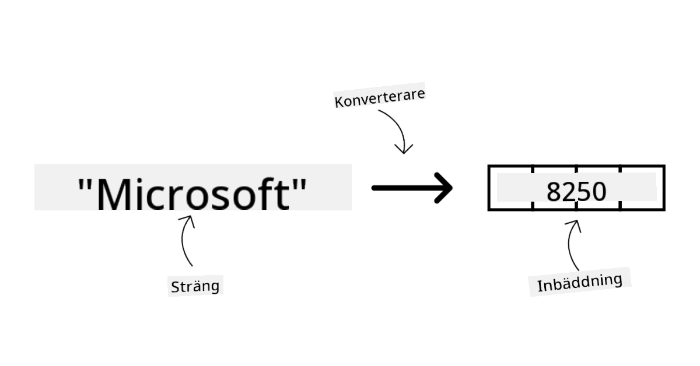

Bildgenereringsmodeller är modeller som genererar bilder. Dessa modeller används ofta för bildredigering, bildsyntes och bildöversättning. Bildgenereringsmodeller tränas ofta på stora bilddatamängder, som [LAION-5B](https://laion.ai/blog/laion-5b/?WT.mc_id=academic-105485-koreyst), och kan användas för att skapa nya bilder eller redigera befintliga bilder med tekniker som inpainting, superupplösning och färgläggning. Exempel inkluderar [DALL-E-3](https://openai.com/dall-e-3?WT.mc_id=academic-105485-koreyst) och [Stable Diffusion-modeller](https://github.com/Stability-AI/StableDiffusion?WT.mc_id=academic-105485-koreyst).

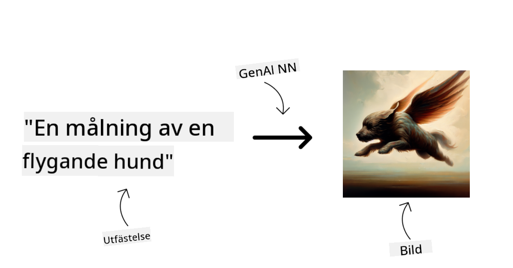

Text- och kodgenereringsmodeller är modeller som genererar text eller kod. Dessa modeller används ofta för textsammanfattning, översättning och frågesvar. Textgenereringsmodeller tränas ofta på stora textdatamängder, som [BookCorpus](https://www.cv-foundation.org/openaccess/content_iccv_2015/html/Zhu_Aligning_Books_and_ICCV_2015_paper.html?WT.mc_id=academic-105485-koreyst), och kan användas för att generera ny text eller svara på frågor. Kodgenereringsmodeller, som [CodeParrot](https://huggingface.co/codeparrot?WT.mc_id=academic-105485-koreyst), tränas ofta på stora koddatamängder, som GitHub, och kan användas för att generera ny kod eller fixa buggar i befintlig kod.

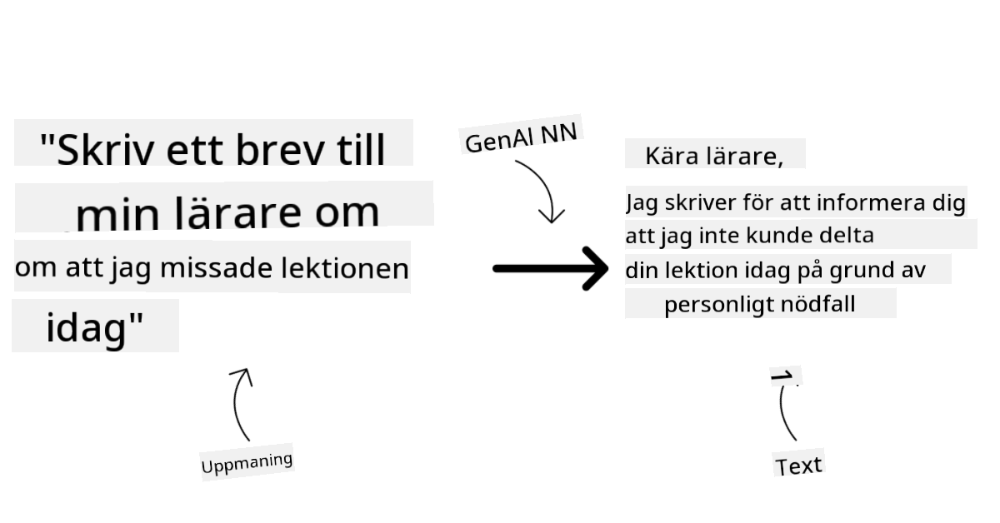

### Encoder-Decoder kontra Decoder-only

För att prata om olika typer av arkitekturer för LLMs, låt oss använda en liknelse.

Föreställ dig att din chef gav dig i uppdrag att skriva ett quiz för studenterna. Du har två kollegor; en ansvarar för att skapa innehållet och den andra för att granska det.

Innehållsskaparen är som en Decoder-only modell, de kan titta på ämnet och se vad du redan skrivit och sedan skriva en kurs baserat på det. De är mycket bra på att skriva engagerande och informativt innehåll, men är inte så bra på att förstå ämnet och lärandemålen. Några exempel på Decoder-modeller är GPT-familjen, som GPT-3.

Granskaren är som en Encoder-only modell, de tittar på den skrivna kursen och svaren, noterar relationen mellan dem och förstår kontexten, men är inte bra på att generera innehåll. Ett exempel på en Encoder-only modell är BERT.

Föreställ dig att vi kan ha någon som både kan skapa och granska quizet, detta är en Encoder-Decoder modell. Några exempel är BART och T5.

### Tjänst kontra Modell

Nu ska vi prata om skillnaden mellan en tjänst och en modell. En tjänst är en produkt som erbjuds av en molntjänstleverantör och är ofta en kombination av modeller, data och andra komponenter. En modell är kärnkomponenten i en tjänst och är ofta en foundation model, som en LLM.

Tjänster är ofta optimerade för produktionsbruk och är ofta enklare att använda än modeller, via ett grafiskt användargränssnitt. Tjänster är dock inte alltid gratis och kan kräva prenumeration eller betalning för att användas, i utbyte mot att utnyttja tjänsteägarens utrustning och resurser, optimera kostnader och enkelt skala. Ett exempel på en tjänst är [Azure OpenAI Service](https://learn.microsoft.com/azure/ai-services/openai/overview?WT.mc_id=academic-105485-koreyst), som erbjuder en betalningsmodell baserad på användning, vilket innebär att användare debiteras proportionellt efter hur mycket de använder tjänsten. Dessutom erbjuder Azure OpenAI Service företagsklassad säkerhet och ett ramverk för ansvarsfull AI ovanpå modellernas kapabiliteter.

Modeller är bara det neurala nätverket, med parametrar, vikter och annat. De kan köras lokalt av företag, men då behöver man köpa utrustning, bygga en struktur för skalning och köpa licens eller använda en open source-modell. En modell som LLaMA finns tillgänglig för användning, men kräver beräkningskraft för att köra modellen.

## Hur man testar och itererar med olika modeller för att förstå prestanda i Azure

När vårt team har utforskat det nuvarande LLM-landskapet och identifierat några bra kandidater för sina scenarier, är nästa steg att testa dem på deras data och arbetsbelastning. Detta är en iterativ process som görs genom experiment och mätningar.
De flesta av de modeller vi nämnde i tidigare avsnitt (OpenAI-modeller, open source-modeller som Llama2 och Hugging Face-transformers) finns tillgängliga i [Model Catalog](https://learn.microsoft.com/azure/ai-studio/how-to/model-catalog-overview?WT.mc_id=academic-105485-koreyst) i [Azure AI Studio](https://ai.azure.com/?WT.mc_id=academic-105485-koreyst).

[Azure AI Studio](https://learn.microsoft.com/azure/ai-studio/what-is-ai-studio?WT.mc_id=academic-105485-koreyst) är en molnplattform designad för utvecklare att bygga generativa AI-applikationer och hantera hela utvecklingscykeln – från experiment till utvärdering – genom att kombinera alla Azure AI-tjänster i en enda hubb med ett användarvänligt GUI. Model Catalog i Azure AI Studio gör det möjligt för användaren att:

- Hitta det Foundation Model som är intressant i katalogen – antingen proprietärt eller open source, med filtrering efter uppgift, licens eller namn. För att förbättra sökbarheten är modellerna organiserade i samlingar, som Azure OpenAI-samlingen, Hugging Face-samlingen och fler.

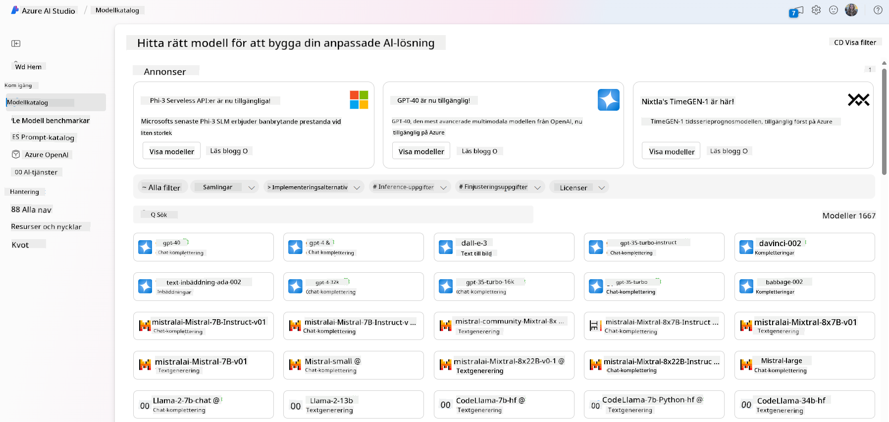

- Granska model card, inklusive en detaljerad beskrivning av avsedd användning och träningsdata, kodexempel och utvärderingsresultat från det interna utvärderingsbiblioteket.

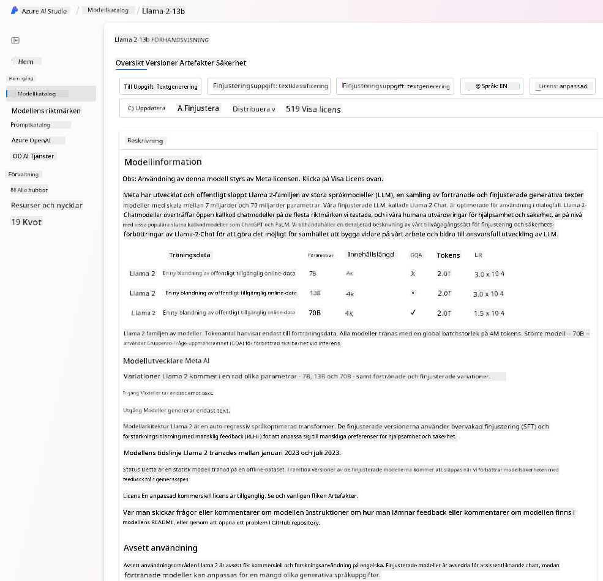

- Jämföra benchmarks mellan modeller och dataset som finns tillgängliga i branschen för att bedöma vilken som passar bäst för affärsscenariot, via [Model Benchmarks](https://learn.microsoft.com/azure/ai-studio/how-to/model-benchmarks?WT.mc_id=academic-105485-koreyst)-panelen.

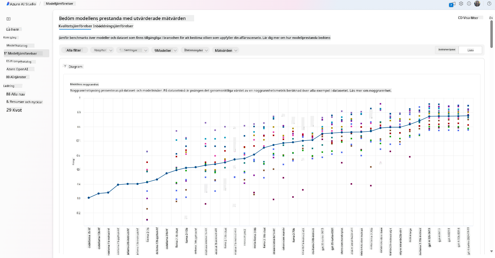

- Finjustera modellen på egen träningsdata för att förbättra modellens prestanda i en specifik arbetsbelastning, med hjälp av experiment- och spårningsfunktionerna i Azure AI Studio.

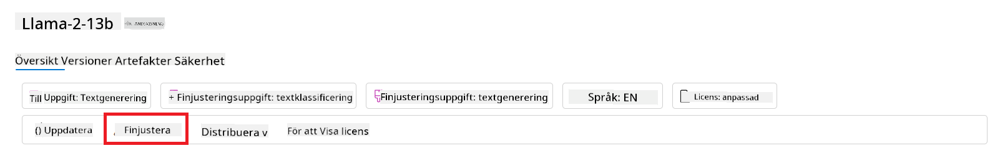

- Distribuera den ursprungliga förtränade modellen eller den finjusterade versionen till en fjärrstyrd realtidsinferenz – hanterad beräkning – eller serverlös API-endpoint – [pay-as-you-go](https://learn.microsoft.com/azure/ai-studio/how-to/model-catalog-overview#model-deployment-managed-compute-and-serverless-api-pay-as-you-go?WT.mc_id=academic-105485-koreyst) – för att möjliggöra att applikationer kan använda den.

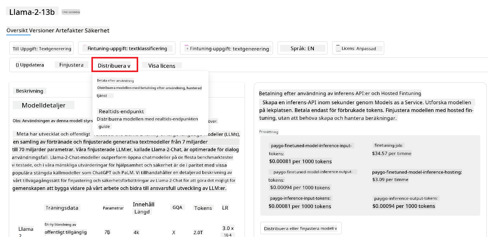

> [!NOTE]
> Alla modeller i katalogen är inte för närvarande tillgängliga för finjustering och/eller pay-as-you-go-distribution. Kontrollera model card för detaljer om modellens kapabiliteter och begränsningar.

## Förbättra LLM-resultat

Vi har tillsammans med vårt startup-team utforskat olika typer av LLM:er och en molnplattform (Azure Machine Learning) som gör det möjligt för oss att jämföra olika modeller, utvärdera dem på testdata, förbättra prestanda och distribuera dem på inferensendpoints.

Men när bör man överväga att finjustera en modell istället för att använda en förtränad? Finns det andra metoder för att förbättra modellens prestanda på specifika arbetsuppgifter?

Det finns flera tillvägagångssätt som ett företag kan använda för att få de resultat de behöver från en LLM. Du kan välja olika typer av modeller med olika grader av träning när du distribuerar en LLM i produktion, med olika nivåer av komplexitet, kostnad och kvalitet. Här är några olika metoder:

- **Prompt engineering med kontext**. Idén är att ge tillräckligt med kontext när du ger prompten för att säkerställa att du får de svar du behöver.

- **Retrieval Augmented Generation, RAG**. Din data kan till exempel finnas i en databas eller web-endpoint, och för att säkerställa att denna data, eller en delmängd av den, inkluderas vid promptning kan du hämta relevant data och göra den till en del av användarens prompt.

- **Finjusterad modell**. Här tränar du modellen vidare på din egen data vilket gör att modellen blir mer exakt och anpassad efter dina behov, men det kan vara kostsamt.

Bildkälla: [Four Ways that Enterprises Deploy LLMs | Fiddler AI Blog](https://www.fiddler.ai/blog/four-ways-that-enterprises-deploy-llms?WT.mc_id=academic-105485-koreyst)

### Prompt Engineering med Kontext

Förtränade LLM:er fungerar mycket bra på generella naturliga språk-uppgifter, även genom att bara anropa dem med en kort prompt, som en mening att slutföra eller en fråga – det så kallade ”zero-shot”-lärandet.

Men ju mer användaren kan rama in sin fråga, med en detaljerad förfrågan och exempel – Kontexten – desto mer exakt och nära användarens förväntningar blir svaret. I detta fall talar vi om ”one-shot”-lärande om prompten innehåller endast ett exempel och ”few-shot”-lärande om den innehåller flera exempel. Prompt engineering med kontext är det mest kostnadseffektiva sättet att komma igång på.

### Retrieval Augmented Generation (RAG)

LLM:er har begränsningen att de bara kan använda den data som använts under deras träning för att generera ett svar. Det betyder att de inte känner till fakta som inträffat efter deras träningsprocess, och de kan inte komma åt icke-offentlig information (som företagsdata).  
Detta kan övervinnas med RAG, en teknik som förstärker prompten med extern data i form av dokumentbitar, med hänsyn till promptens längdbegränsningar. Detta stöds av vektordatabaser (som [Azure Vector Search](https://learn.microsoft.com/azure/search/vector-search-overview?WT.mc_id=academic-105485-koreyst)) som hämtar användbara delar från olika fördefinierade datakällor och lägger till dem i promptens kontext.

Denna teknik är mycket användbar när ett företag inte har tillräckligt med data, tid eller resurser för att finjustera en LLM, men ändå vill förbättra prestandan på en specifik arbetsuppgift och minska risken för fabriceringar, dvs. förvrängning av verkligheten eller skadligt innehåll.

### Finjusterad modell

Finjustering är en process som använder transfer learning för att ”anpassa” modellen till en specifik uppgift eller för att lösa ett särskilt problem. Till skillnad från few-shot-lärande och RAG resulterar det i att en ny modell skapas, med uppdaterade vikter och bias. Det kräver en uppsättning träningsexempel bestående av en enda input (prompten) och dess tillhörande output (kompletteringen).  
Detta är den föredragna metoden om:

- **Använda finjusterade modeller**. Ett företag vill använda finjusterade, mindre kraftfulla modeller (som embedding-modeller) istället för högpresterande modeller, vilket ger en mer kostnadseffektiv och snabb lösning.

- **Tänka på latens**. Latens är viktigt för ett specifikt användningsfall, så det är inte möjligt att använda mycket långa prompts eller antalet exempel som modellen ska lära sig från passar inte in i promptens längdbegränsning.

- **Hålla sig uppdaterad**. Ett företag har mycket högkvalitativ data och sanna etiketter samt resurser för att hålla denna data uppdaterad över tid.

### Tränad modell

Att träna en LLM från grunden är utan tvekan det svåraste och mest komplexa tillvägagångssättet, som kräver enorma mängder data, skickliga resurser och lämplig beräkningskraft. Detta alternativ bör endast övervägas i ett scenario där ett företag har ett domänspecifikt användningsfall och en stor mängd domäncentrerad data.

## Kunskapskontroll

Vad kan vara ett bra sätt att förbättra LLM:s genererade resultat?

1. Prompt engineering med kontext  
1. RAG  
1. Finjusterad modell

Svar: 3, om du har tid, resurser och högkvalitativ data är finjustering det bästa alternativet för att hålla sig uppdaterad. Men om du vill förbättra saker och saknar tid är det värt att först överväga RAG.

## 🚀 Utmaning

Läs mer om hur du kan [använda RAG](https://learn.microsoft.com/azure/search/retrieval-augmented-generation-overview?WT.mc_id=academic-105485-koreyst) för ditt företag.

## Bra jobbat, fortsätt lära dig

Efter att ha slutfört denna lektion, kolla in vår [Generative AI Learning collection](https://aka.ms/genai-collection?WT.mc_id=academic-105485-koreyst) för att fortsätta utveckla dina kunskaper inom Generativ AI!

Gå vidare till Lektion 3 där vi tittar på hur man [bygger med Generativ AI på ett ansvarsfullt sätt](../03-using-generative-ai-responsibly/README.md?WT.mc_id=academic-105485-koreyst)!

**Ansvarsfriskrivning**:  
Detta dokument har översatts med hjälp av AI-översättningstjänsten [Co-op Translator](https://github.com/Azure/co-op-translator). Även om vi strävar efter noggrannhet, vänligen observera att automatiska översättningar kan innehålla fel eller brister. Det ursprungliga dokumentet på dess modersmål bör betraktas som den auktoritativa källan. För kritisk information rekommenderas professionell mänsklig översättning. Vi ansvarar inte för några missförstånd eller feltolkningar som uppstår till följd av användningen av denna översättning.