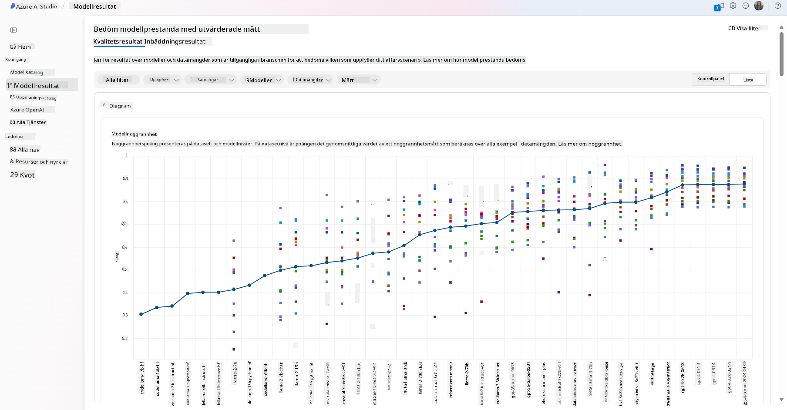
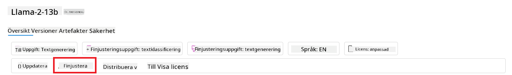
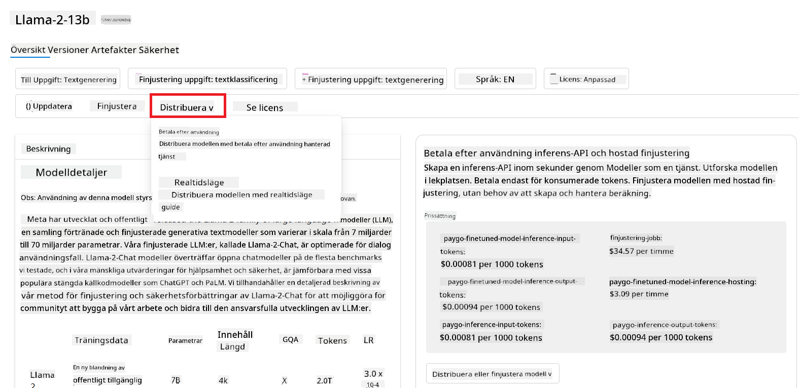
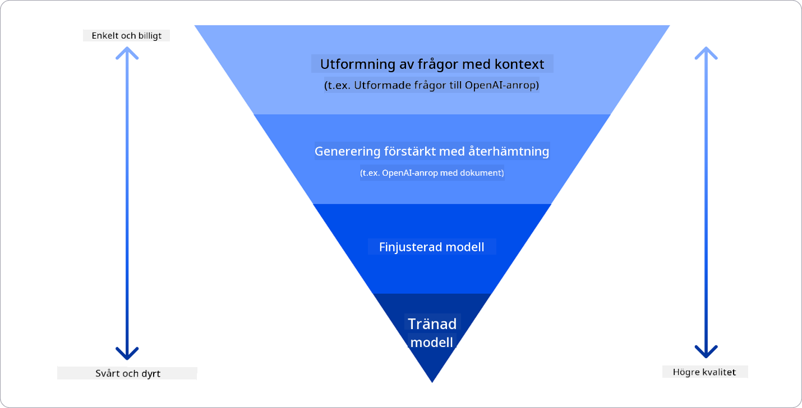

<!--
CO_OP_TRANSLATOR_METADATA:
{
  "original_hash": "e2f686f2eb794941761252ac5e8e090b",
  "translation_date": "2025-05-19T14:04:32+00:00",
  "source_file": "02-exploring-and-comparing-different-llms/README.md",
  "language_code": "sv"
}
-->
# Utforska och jämföra olika LLMs

> _Klicka på bilden ovan för att se videon av denna lektion_

I den tidigare lektionen såg vi hur Generativ AI förändrar tekniklandskapet, hur Stora Språkmodeller (LLMs) fungerar och hur ett företag - som vår startup - kan tillämpa dem på sina användningsområden och växa! I detta kapitel ska vi jämföra och kontrastera olika typer av stora språkmodeller (LLMs) för att förstå deras för- och nackdelar.

Nästa steg i vår startups resa är att utforska det nuvarande landskapet av LLMs och förstå vilka som är lämpliga för vårt användningsområde.

## Introduktion

Denna lektion kommer att täcka:

- Olika typer av LLMs i det nuvarande landskapet.
- Testa, iterera och jämföra olika modeller för ditt användningsområde i Azure.
- Hur man distribuerar en LLM.

## Lärandemål

Efter att ha slutfört denna lektion kommer du att kunna:

- Välja rätt modell för ditt användningsområde.
- Förstå hur man testar, itererar och förbättrar prestandan hos din modell.
- Veta hur företag distribuerar modeller.

## Förstå olika typer av LLMs

LLMs kan ha flera kategoriseringar baserat på deras arkitektur, träningsdata och användningsområde. Att förstå dessa skillnader kommer att hjälpa vår startup att välja rätt modell för scenariot och förstå hur man testar, itererar och förbättrar prestandan.

Det finns många olika typer av LLM-modeller, ditt val av modell beror på vad du avser att använda dem för, din data, hur mycket du är beredd att betala och mer.

Beroende på om du avser att använda modellerna för text, ljud, video, bildgenerering och så vidare, kan du välja en annan typ av modell.

- **Ljud- och taligenkänning**. För detta ändamål är Whisper-typmodeller ett utmärkt val eftersom de är allmänna och inriktade på taligenkänning. Den är tränad på olika ljud och kan utföra flerspråkig taligenkänning. Läs mer om [Whisper-typmodeller här](https://platform.openai.com/docs/models/whisper?WT.mc_id=academic-105485-koreyst).

- **Bildgenerering**. För bildgenerering är DALL-E och Midjourney två mycket välkända val. DALL-E erbjuds av Azure OpenAI. [Läs mer om DALL-E här](https://platform.openai.com/docs/models/dall-e?WT.mc_id=academic-105485-koreyst) och även i kapitel 9 av denna läroplan.

- **Textgenerering**. De flesta modeller är tränade på textgenerering och du har ett stort urval av val från GPT-3.5 till GPT-4. De kommer till olika kostnader där GPT-4 är den dyraste. Det är värt att titta in i [Azure OpenAI playground](https://oai.azure.com/portal/playground?WT.mc_id=academic-105485-koreyst) för att utvärdera vilka modeller som bäst passar dina behov i termer av kapacitet och kostnad.

- **Multimodalitet**. Om du vill hantera flera typer av data i in- och utmatning, kanske du vill titta på modeller som [gpt-4 turbo med vision eller gpt-4o](https://learn.microsoft.com/azure/ai-services/openai/concepts/models#gpt-4-and-gpt-4-turbo-models?WT.mc_id=academic-105485-koreyst) - de senaste versionerna av OpenAI-modeller - som är kapabla att kombinera naturlig språkbehandling med visuell förståelse, vilket möjliggör interaktioner genom multimodala gränssnitt.

Att välja en modell innebär att du får några grundläggande kapaciteter, som kanske inte räcker dock. Ofta har du företagsspecifik data som du på något sätt behöver informera LLM om. Det finns några olika val på hur man närmar sig det, mer om det i de kommande avsnitten.

### Grundmodeller kontra LLMs

Termen Grundmodell myntades av [Stanford-forskare](https://arxiv.org/abs/2108.07258?WT.mc_id=academic-105485-koreyst) och definieras som en AI-modell som följer vissa kriterier, såsom:

- **De är tränade med osuperviserat lärande eller självövervakat lärande**, vilket innebär att de är tränade på omärkt multimodal data och de kräver inte mänsklig annotering eller märkning av data för sin träningsprocess.
- **De är mycket stora modeller**, baserade på mycket djupa neurala nätverk tränade på miljarder parametrar.
- **De är normalt avsedda att fungera som en 'grund' för andra modeller**, vilket innebär att de kan användas som en startpunkt för andra modeller att byggas på, vilket kan göras genom finjustering.

För att ytterligare klargöra denna distinktion, låt oss ta ChatGPT som ett exempel. För att bygga den första versionen av ChatGPT, tjänade en modell kallad GPT-3.5 som grundmodell. Detta innebär att OpenAI använde viss chattspecifik data för att skapa en justerad version av GPT-3.5 som var specialiserad på att prestera bra i konversationsscenarier, som chatbots.

### Öppen källkod kontra Proprietära modeller

Ett annat sätt att kategorisera LLMs är om de är öppen källkod eller proprietära.

Öppen källkod-modeller är modeller som görs tillgängliga för allmänheten och kan användas av vem som helst. De görs ofta tillgängliga av företaget som skapade dem eller av forskarsamhället. Dessa modeller får inspekteras, modifieras och anpassas för de olika användningsfallen i LLMs. Dock är de inte alltid optimerade för produktionsanvändning och kanske inte är lika presterande som proprietära modeller. Dessutom kan finansiering för öppen källkod-modeller vara begränsad och de kanske inte underhålls långsiktigt eller uppdateras med den senaste forskningen. Exempel på populära öppen källkod-modeller inkluderar [Alpaca](https://crfm.stanford.edu/2023/03/13/alpaca.html?WT.mc_id=academic-105485-koreyst), [Bloom](https://huggingface.co/bigscience/bloom) och [LLaMA](https://llama.meta.com).

Proprietära modeller är modeller som ägs av ett företag och inte görs tillgängliga för allmänheten. Dessa modeller är ofta optimerade för produktionsanvändning. Dock får de inte inspekteras, modifieras eller anpassas för olika användningsfall. Dessutom är de inte alltid tillgängliga gratis och kan kräva en prenumeration eller betalning för att använda. Användare har inte heller kontroll över den data som används för att träna modellen, vilket innebär att de bör lita på modellägaren för att säkerställa engagemang för datasekretess och ansvarsfull användning av AI. Exempel på populära proprietära modeller inkluderar [OpenAI-modeller](https://platform.openai.com/docs/models/overview?WT.mc_id=academic-105485-koreyst), [Google Bard](https://sapling.ai/llm/bard?WT.mc_id=academic-105485-koreyst) eller [Claude 2](https://www.anthropic.com/index/claude-2?WT.mc_id=academic-105485-koreyst).

### Inbäddning kontra Bildgenerering kontra Text- och kodgenerering

LLMs kan också kategoriseras efter vilken output de genererar.

Inbäddningar är en uppsättning modeller som kan konvertera text till en numerisk form, kallad inbäddning, vilket är en numerisk representation av inputtexten. Inbäddningar gör det lättare för maskiner att förstå relationerna mellan ord eller meningar och kan användas som input av andra modeller, såsom klassificeringsmodeller eller klustermodeller som har bättre prestanda på numerisk data. Inbäddningsmodeller används ofta för transferlärande, där en modell byggs för en surrogatuppgift för vilken det finns en överflöd av data, och sedan återanvänds modellens vikter (inbäddningar) för andra nedströmsuppgifter. Ett exempel på denna kategori är [OpenAI-inbäddningar](https://platform.openai.com/docs/models/embeddings?WT.mc_id=academic-105485-koreyst).

Bildgenereringsmodeller är modeller som genererar bilder. Dessa modeller används ofta för bildredigering, bildsyntes och bildöversättning. Bildgenereringsmodeller tränas ofta på stora dataset av bilder, såsom [LAION-5B](https://laion.ai/blog/laion-5b/?WT.mc_id=academic-105485-koreyst), och kan användas för att generera nya bilder eller för att redigera befintliga bilder med inpainting, superupplösning och färgläggningstekniker. Exempel inkluderar [DALL-E-3](https://openai.com/dall-e-3?WT.mc_id=academic-105485-koreyst) och [Stable Diffusion-modeller](https://github.com/Stability-AI/StableDiffusion?WT.mc_id=academic-105485-koreyst).

Text- och kodgenereringsmodeller är modeller som genererar text eller kod. Dessa modeller används ofta för textsammanfattning, översättning och frågor och svar. Textgenereringsmodeller tränas ofta på stora dataset av text, såsom [BookCorpus](https://www.cv-foundation.org/openaccess/content_iccv_2015/html/Zhu_Aligning_Books_and_ICCV_2015_paper.html?WT.mc_id=academic-105485-koreyst), och kan användas för att generera ny text eller för att svara på frågor. Kodgenereringsmodeller, som [CodeParrot](https://huggingface.co/codeparrot?WT.mc_id=academic-105485-koreyst), tränas ofta på stora dataset av kod, såsom GitHub, och kan användas för att generera ny kod eller för att fixa buggar i befintlig kod.

### Encoder-Decoder kontra Endast Decoder

För att prata om de olika typerna av arkitekturer av LLMs, låt oss använda en analogi.

Föreställ dig att din chef gav dig en uppgift att skriva ett quiz för studenterna. Du har två kollegor; en ansvarar för att skapa innehållet och den andra ansvarar för att granska dem.

Innehållsskaparen är som en Endast Decoder-modell, de kan titta på ämnet och se vad du redan har skrivit och sedan kan han skriva en kurs baserat på det. De är mycket bra på att skriva engagerande och informativt innehåll, men de är inte särskilt bra på att förstå ämnet och lärandemålen. Några exempel på Decoder-modeller är GPT-familjemodeller, såsom GPT-3.

Granskaren är som en Endast Encoder-modell, de tittar på den skrivna kursen och svaren, märker relationen mellan dem och förstår sammanhanget, men de är inte bra på att generera innehåll. Ett exempel på Endast Encoder-modell skulle vara BERT.

Föreställ dig att vi också kan ha någon som både kan skapa och granska quizet, detta är en Encoder-Decoder-modell. Några exempel skulle vara BART och T5.

### Tjänst kontra Modell

Nu, låt oss prata om skillnaden mellan en tjänst och en modell. En tjänst är en produkt som erbjuds av en molntjänstleverantör och är ofta en kombination av modeller, data och andra komponenter. En modell är kärnkomponenten i en tjänst och är ofta en grundmodell, såsom en LLM.

Tjänster är ofta optimerade för produktionsanvändning och är ofta enklare att använda än modeller, via ett grafiskt användargränssnitt. Dock är tjänster inte alltid tillgängliga gratis och kan kräva en prenumeration eller betalning för att använda, i utbyte mot att utnyttja tjänsteägarens utrustning och resurser, optimera kostnader och skala enkelt. Ett exempel på en tjänst är [Azure OpenAI Service](https://learn.microsoft.com/azure/ai-services/openai/overview?WT.mc_id=academic-105485-koreyst), som erbjuder en betalning-per-användning-prisplan, vilket innebär att användare debiteras proportionellt till hur mycket de använder tjänsten. Dessutom erbjuder Azure OpenAI Service säkerhet i företagsklass och ett ansvarsfullt AI-ramverk ovanpå modellernas kapaciteter.

Modeller är bara det neurala nätverket, med parametrarna, vikterna och andra. Vilket gör det möjligt för företag att köra lokalt, men skulle behöva köpa utrustning, bygga en struktur för att skala och köpa en licens eller använda en öppen källkod-modell. En modell som LLaMA är tillgänglig för att användas, vilket kräver datorkraft för att köra modellen.

## Hur man testar och itererar med olika modeller för att förstå prestanda på Azure

När vårt team har utforskat det nuvarande LLMs-landskapet och identifierat några bra kandidater för sina scenarier, är nästa steg att testa dem på deras data och på deras arbetsbelastning. Detta är en iterativ process, gjord genom experiment och mätningar.
De flesta av de modeller vi nämnde i tidigare stycken (OpenAI-modeller, öppen källkod-modeller som Llama2, och Hugging Face-transformers) är tillgängliga i [Model Catalog](https://learn.microsoft.com/azure/ai-studio/how-to/model-catalog-overview?WT.mc_id=academic-105485-koreyst) i [Azure AI Studio](https://ai.azure.com/?WT.mc_id=academic-105485-koreyst).

[Azure AI Studio](https://learn.microsoft.com/azure/ai-studio/what-is-ai-studio?WT.mc_id=academic-105485-koreyst) är en molnplattform designad för utvecklare att bygga generativa AI-applikationer och hantera hela utvecklingslivscykeln - från experiment till utvärdering - genom att kombinera alla Azure AI-tjänster i ett enda nav med ett praktiskt GUI. Modellkatalogen i Azure AI Studio gör det möjligt för användaren att:

- Hitta den grundmodell av intresse i katalogen - antingen proprietär eller öppen källkod, filtrera efter uppgift, licens eller namn. För att förbättra sökbarheten är modellerna organiserade i samlingar, som Azure OpenAI-samling, Hugging Face-samling och mer.

- Granska modellkortet, inklusive en detaljerad beskrivning av avsett användningsområde och träningsdata, kodexempel och utvärderingsresultat på det interna utvärderingsbiblioteket.
- Jämför benchmarks mellan modeller och datasets som finns tillgängliga inom industrin för att bedöma vilken som bäst uppfyller affärsscenariot, genom [Model Benchmarks](https://learn.microsoft.com/azure/ai-studio/how-to/model-benchmarks?WT.mc_id=academic-105485-koreyst) panelen.

- Finjustera modellen med anpassade träningsdata för att förbättra modellens prestanda i en specifik arbetsbelastning, genom att utnyttja experimentering och spårningsfunktionerna i Azure AI Studio.

- Distribuera den ursprungliga förtränade modellen eller den finjusterade versionen till en fjärrinference i realtid - hanterad beräkning - eller serverlös api-endpunkt - [betala per användning](https://learn.microsoft.com/azure/ai-studio/how-to/model-catalog-overview#model-deployment-managed-compute-and-serverless-api-pay-as-you-go?WT.mc_id=academic-105485-koreyst) - för att göra det möjligt för applikationer att konsumera den.

> [!NOTE]
> Alla modeller i katalogen är för närvarande inte tillgängliga för finjustering och/eller betala per användning-distribution. Kontrollera modellkortet för detaljer om modellens kapaciteter och begränsningar.

## Förbättra LLM-resultat

Vi har utforskat med vårt startup-team olika typer av LLMs och en molnplattform (Azure Machine Learning) som gör det möjligt för oss att jämföra olika modeller, utvärdera dem på testdata, förbättra prestanda och distribuera dem på inference-endpunkter.

Men när ska de överväga att finjustera en modell istället för att använda en förtränad? Finns det andra metoder för att förbättra modellprestanda i specifika arbetsbelastningar?

Det finns flera metoder ett företag kan använda för att få de resultat de behöver från en LLM. Du kan välja olika typer av modeller med olika grader av träning när du distribuerar en LLM i produktion, med olika nivåer av komplexitet, kostnad och kvalitet. Här är några olika metoder:

- **Prompt engineering med kontext**. Idén är att ge tillräckligt med kontext när du ger en prompt för att säkerställa att du får de svar du behöver.

- **Retrieval Augmented Generation, RAG**. Dina data kan finnas i en databas eller web-endpunkt, till exempel, för att säkerställa att dessa data, eller en del av dem, inkluderas vid tidpunkten för prompten, kan du hämta relevant data och göra det till en del av användarens prompt.

- **Finjusterad modell**. Här har du tränat modellen ytterligare på dina egna data vilket ledde till att modellen blev mer exakt och responsiv till dina behov men kan vara kostsam.

Bildkälla: [Four Ways that Enterprises Deploy LLMs | Fiddler AI Blog](https://www.fiddler.ai/blog/four-ways-that-enterprises-deploy-llms?WT.mc_id=academic-105485-koreyst)

### Prompt Engineering med Kontext

Förtränade LLMs fungerar mycket bra på generella naturliga språkuppgifter, även genom att kalla dem med en kort prompt, som en mening att slutföra eller en fråga – det så kallade "zero-shot" lärandet.

Men ju mer användaren kan formulera sin fråga, med en detaljerad begäran och exempel – Kontexten – desto mer exakt och närmare användarens förväntningar kommer svaret att vara. I detta fall pratar vi om "one-shot" lärande om prompten inkluderar endast ett exempel och "few-shot learning" om det inkluderar flera exempel. Prompt engineering med kontext är det mest kostnadseffektiva sättet att komma igång.

### Retrieval Augmented Generation (RAG)

LLMs har begränsningen att de endast kan använda data som har använts under deras träning för att generera ett svar. Detta betyder att de inte vet något om fakta som hänt efter deras träningsprocess, och de kan inte komma åt icke-offentlig information (som företagsdata).
Detta kan övervinnas genom RAG, en teknik som förstärker prompten med extern data i form av dokumentdelar, med hänsyn till promptlängdsbegränsningar. Detta stöds av verktyg för vektordatabaser (som [Azure Vector Search](https://learn.microsoft.com/azure/search/vector-search-overview?WT.mc_id=academic-105485-koreyst)) som hämtar de användbara delarna från olika fördefinierade datakällor och lägger till dem i promptkontexten.

Denna teknik är mycket hjälpsam när ett företag inte har tillräckligt med data, tid eller resurser för att finjustera en LLM, men ändå önskar förbättra prestanda i en specifik arbetsbelastning och minska riskerna för fabriceringar, dvs. förvanskning av verkligheten eller skadligt innehåll.

### Finjusterad modell

Finjustering är en process som utnyttjar transfer learning för att 'anpassa' modellen till en nedströmsuppgift eller för att lösa ett specifikt problem. Annorlunda än few-shot learning och RAG, resulterar det i en ny modell som genereras, med uppdaterade vikter och fördomar. Det kräver en uppsättning tränings exempel bestående av en enda input (prompten) och dess associerade output (slutförandet).
Detta skulle vara den föredragna metoden om:

- **Använda finjusterade modeller**. Ett företag skulle vilja använda finjusterade mindre kapabla modeller (som inbäddningsmodeller) snarare än högpresterande modeller, vilket resulterar i en mer kostnadseffektiv och snabb lösning.

- **Beakta latens**. Latens är viktigt för ett specifikt användningsfall, så det är inte möjligt att använda mycket långa prompts eller antalet exempel som modellen bör lära sig från passar inte med promptlängdsbegränsningen.

- **Hålla sig uppdaterad**. Ett företag har mycket högkvalitativa data och grundläggande sanningsetiketter och de resurser som krävs för att hålla dessa data uppdaterade över tid.

### Tränad modell

Att träna en LLM från grunden är utan tvekan den svåraste och mest komplexa metoden att anta, vilket kräver enorma mängder data, skickliga resurser och lämplig datorkraft. Detta alternativ bör endast övervägas i ett scenario där ett företag har ett domänspecifikt användningsfall och en stor mängd domäncentrerade data.

## Kunskapskontroll

Vad kan vara en bra metod för att förbättra LLM-slutföringsresultat?

1. Prompt engineering med kontext
1. RAG
1. Finjusterad modell

A:3, om du har tid och resurser och högkvalitativa data, är finjustering det bättre alternativet för att hålla sig uppdaterad. Men om du tittar på att förbättra saker och saknar tid är det värt att överväga RAG först.

## 🚀 Utmaning

Läs mer om hur du kan [använda RAG](https://learn.microsoft.com/azure/search/retrieval-augmented-generation-overview?WT.mc_id=academic-105485-koreyst) för ditt företag.

## Bra Jobbat, Fortsätt Din Inlärning

Efter att ha avslutat denna lektion, kolla in vår [Generative AI Learning collection](https://aka.ms/genai-collection?WT.mc_id=academic-105485-koreyst) för att fortsätta utveckla din kunskap om Generative AI!

Gå vidare till Lektion 3 där vi kommer att titta på hur man [bygger med Generative AI Ansvarsfullt](../03-using-generative-ai-responsibly/README.md?WT.mc_id=academic-105485-koreyst)!

**Ansvarsfriskrivning**:  
Detta dokument har översatts med hjälp av AI-översättningstjänsten [Co-op Translator](https://github.com/Azure/co-op-translator). Vi strävar efter noggrannhet, men var medveten om att automatiska översättningar kan innehålla fel eller felaktigheter. Det ursprungliga dokumentet på dess ursprungliga språk bör betraktas som den auktoritativa källan. För kritisk information rekommenderas professionell mänsklig översättning. Vi ansvarar inte för eventuella missförstånd eller misstolkningar som uppstår vid användning av denna översättning.