# Utforska och jämföra olika LLM:er

[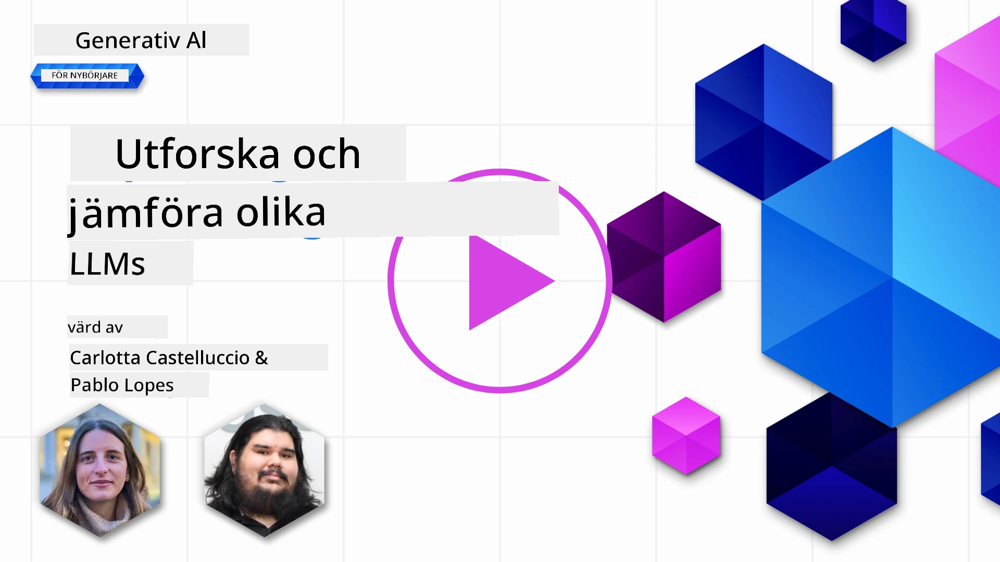](https://youtu.be/KIRUeDKscfI?si=8BHX1zvwzQBn-PlK)

> _Klicka på bilden ovan för att se video av denna lektion_

Med den föregående lektionen har vi sett hur Generativ AI förändrar teknologilandskapet, hur stora språkmodeller (LLM:er) fungerar och hur ett företag - som vår startup - kan använda dem för sina användningsfall och växa! I detta kapitel tittar vi på att jämföra och kontrastera olika typer av stora språkmodeller (LLM:er) för att förstå deras för- och nackdelar.

Nästa steg i vår startups resa är att utforska den nuvarande landskapet av LLM:er och förstå vilka som är lämpliga för vårt användningsfall.

## Introduktion

Den här lektionen kommer att täcka:

- Olika typer av LLM:er i det nuvarande landskapet.
- Testa, iterera och jämföra olika modeller för ditt användningsfall i Azure.
- Hur man distribuerar en LLM.

## Lärandemål

Efter att ha genomfört denna lektion kommer du att kunna:

- Välja rätt modell för ditt användningsfall.
- Förstå hur man testar, itererar och förbättrar modellens prestanda.
- Veta hur företag distribuerar modeller.

## Förstå olika typer av LLM:er

LLM:er kan ha flera kategoriseringar baserat på deras arkitektur, träningsdata och användningsfall. Att förstå dessa skillnader hjälper vår startup att välja rätt modell för scenariot, och förstå hur man testar, itererar och förbättrar prestandan.

Det finns många olika typer av LLM-modeller, ditt val av modell beror på vad du tänker använda dem till, din data, hur mycket du är redo att betala och mer.

Beroende på om du tänker använda modellerna för text, ljud, video, bildgenerering och så vidare, kan du välja en annan typ av modell.

- **Ljud- och taligenkänning**. Whisper-liknande modeller är fortfarande användbara allmänna taligenkänningsmodeller, men produktionsval inkluderar nu även nyare tal-till-text-modeller såsom `gpt-4o-transcribe`, `gpt-4o-mini-transcribe` och diariseringsvarianter. Utvärdera språkstöd, diarisation, realtidsstöd, fördröjning och kostnad för ditt scenario. Läs mer i [OpenAI speech-to-text-dokumentationen](https://platform.openai.com/docs/guides/speech-to-text?WT.mc_id=academic-105485-koreyst).

- **Bildgenerering**. DALL-E och Midjourney är välkända alternativ för bildgenerering, men de nuvarande OpenAI bild-API:erna fokuserar på GPT Image-modeller såsom `gpt-image-2`, medan Stable Diffusion, Imagen, Flux och andra modellfamiljer också är vanliga val. Jämför uppfyllande av prompt, redigeringsstöd, stilkontroll, säkerhetskrav och licensiering. Läs mer i [OpenAI guide för bildgenerering](https://platform.openai.com/docs/guides/images?WT.mc_id=academic-105485-koreyst) och kapitel 9 i denna läroplan.

- **Textgenerering**. Textmodeller omfattar nu gränsmodeller, resonemangsmodeller, mindre låglatensmodeller och öppna viktmodeller. Exempel inkluderar OpenAI GPT-5.x modeller, Anthropic Claude 4.x modeller, Google Gemini 3.x modeller, Meta Llama 4 modeller och Mistral-modeller. Välj inte bara efter releasedatum eller pris; jämför uppgiftskvalitet, latens, kontextfönster, verktygsanvändning, säkerhetsbeteende, regional tillgänglighet och totalkostnad. [Microsoft Foundry modellkatalog](https://ai.azure.com/catalog?WT.mc_id=academic-105485-koreyst) är en bra plats att jämföra modeller tillgängliga på Azure.

- **Multimodalitet**. Många nuvarande modeller kan bearbeta mer än text. Vissa accepterar bild-, ljud- eller videoinput; några kan anropa verktyg; och specialiserade modeller kan generera bilder, ljud eller video. Till exempel stöder nuvarande OpenAI-modeller text- och bildinput, Gemini-modeller kan stödja text, kod, bild, ljud och videoinput beroende på variant, och Llama 4 Scout och Maverick är öppna vikt native multimodala modeller. Kontrollera alltid varje modellkort för stöd för indata- och utdata-modaliteter innan du bygger ett arbetsflöde kring den.

Att välja en modell innebär att du får vissa grundläggande kapaciteter, som dock kanske inte räcker. Ofta har du företagspecifik data som du på något sätt behöver berätta för LLM:n om. Det finns några olika val hur man kan närma sig detta, mer om det i kommande avsnitt.

### Foundation Models kontra LLM:er

Begreppet Foundation Model myntades av [Stanfordforskare](https://arxiv.org/abs/2108.07258?WT.mc_id=academic-105485-koreyst) och definieras som en AI-modell som följer vissa kriterier, såsom:

- **De tränas med oövervakad eller självövervakad inlärning**, vilket betyder att de tränas på omärkta multimodala data, och de kräver inte mänsklig annotering eller märkning av data för träningsprocessen.
- **De är mycket stora modeller**, baserade på mycket djupa neurala nätverk tränade på miljarder parametrar.
- **De är vanligtvis avsedda att tjäna som en ‘grund’ för andra modeller**, vilket betyder att de kan användas som startpunkt för att bygga andra modeller ovanpå, vilket kan göras genom finjustering.

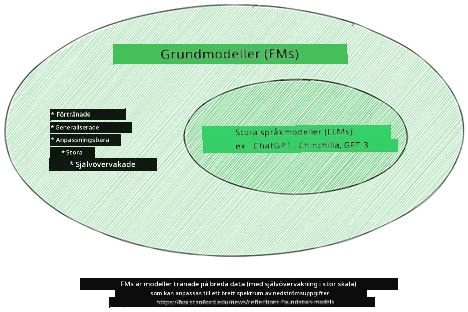

Bildkälla: [Essential Guide to Foundation Models and Large Language Models | av Babar M Bhatti | Medium
](https://thebabar.medium.com/essential-guide-to-foundation-models-and-large-language-models-27dab58f7404)

För att ytterligare klargöra denna distinktion, låt oss ta ChatGPT som ett historiskt exempel. Tidiga versioner av ChatGPT använde GPT-3.5 som grundmodell. OpenAI använde sedan chatt-specifik data och anpassningstekniker för att skapa en finjusterad version som presterade bättre i konversationsscenarier, såsom chatbots. Moderna AI-tjänster brukar växla mellan flera modellvarianter, så tjänstens namn och den underliggande modellens namn är inte alltid samma sak.

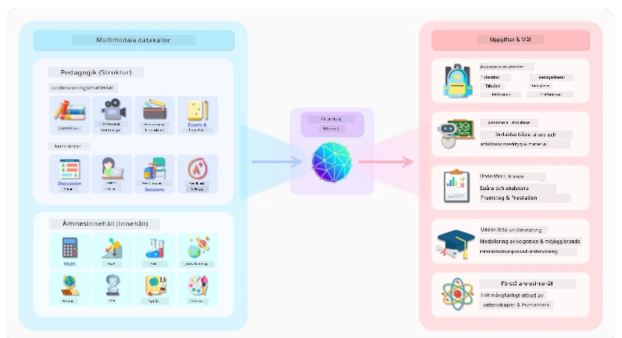

Bildkälla: [2108.07258.pdf (arxiv.org)](https://arxiv.org/pdf/2108.07258.pdf?WT.mc_id=academic-105485-koreyst)

### Öppen vikt / öppen källkod kontra proprietära modeller

Ett annat sätt att kategorisera LLM:er är om de är öppna vikt, öppen källkod eller proprietära.

Öppen källkod och öppna viktmodeller gör modellartefakter tillgängliga för inspektion, nedladdning eller anpassning, men deras licenser skiljer sig. Vissa är helt öppna källkodsmodeller, medan andra är öppna viktmodeller med användningsbegränsningar. De kan vara användbara när ett företag behöver mer kontroll över distribution, datalokalisering, kostnad eller anpassning. Team behöver dock fortfarande granska licensvillkor, serveringskostnader, underhåll, säkerhetsuppdateringar och utvärderingskvalitet innan de använder dem i produktion. Exempel inkluderar [Meta Llama 4](https://ai.meta.com/blog/llama-4-multimodal-intelligence/?WT.mc_id=academic-105485-koreyst), några [Mistral-modeller](https://docs.mistral.ai/models/overview?WT.mc_id=academic-105485-koreyst) och många modeller värd på [Hugging Face](https://huggingface.co/models?WT.mc_id=academic-105485-koreyst).

Proprietära modeller ägs och hostas av en leverantör. Dessa modeller är ofta optimerade för hanterad produktionsanvändning och kan erbjuda starkt stöd, säkerhetssystem, verktygsintegration och skalbarhet. Kunder kan dock vanligtvis inte inspektera eller modifiera modellvikterna, och de måste granska leverantörens villkor för sekretess, lagring, efterlevnad och acceptabel användning. Exempel inkluderar [OpenAI-modeller](https://platform.openai.com/docs/models?WT.mc_id=academic-105485-koreyst), [Google Gemini](https://deepmind.google/models/gemini/pro/?WT.mc_id=academic-105485-koreyst) och [Anthropic Claude](https://platform.claude.com/docs/en/about-claude/models/overview?WT.mc_id=academic-105485-koreyst).

### Embedding kontra bildgenerering kontra text- och kodgenerering

LLM:er kan också kategoriseras efter den output de genererar.

Embeddings är en grupp modeller som kan omvandla text till en numerisk form, kallad embedding, vilket är en numerisk representation av inmatningstexten. Embeddings gör det lättare för maskiner att förstå relationer mellan ord eller meningar och kan användas som indata av andra modeller, såsom klassificeringsmodeller eller klustringsmodeller som har bättre prestanda på numeriska data. Embeddingmodeller används ofta för transferinlärning, där en modell byggs för en surrogatuppgift med mycket data, och sedan återanvänds modellvikterna (embeddings) för andra efterföljande uppgifter. Ett exempel på denna kategori är [OpenAI embeddings](https://platform.openai.com/docs/models/embeddings?WT.mc_id=academic-105485-koreyst).

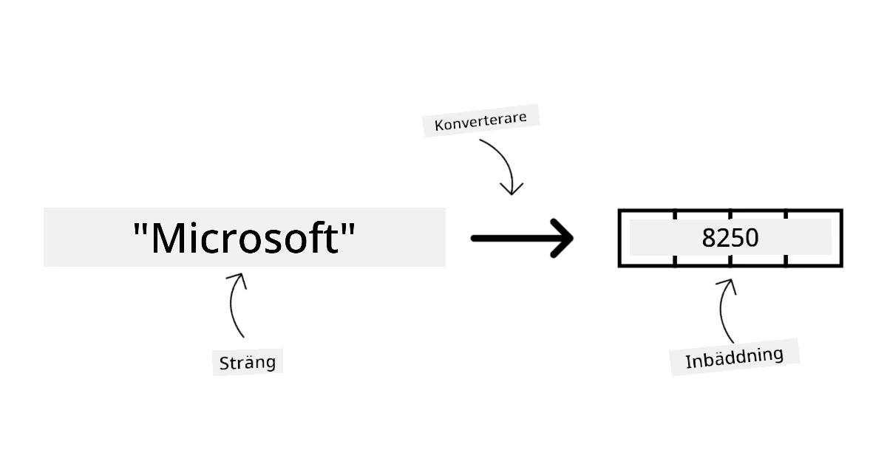

Bildgenereringsmodeller är modeller som genererar bilder. Dessa modeller används ofta för bildredigering, bildsyntes och bildöversättning. Bildgenereringsmodeller tränas ofta på stora bilddataset, såsom [LAION-5B](https://laion.ai/blog/laion-5b/?WT.mc_id=academic-105485-koreyst), och kan användas för att generera nya bilder eller för att redigera befintliga bilder med inpainting, superupplösning och koloreringstekniker. Exempel inkluderar [GPT Image-modeller](https://platform.openai.com/docs/guides/images?WT.mc_id=academic-105485-koreyst), [Stable Diffusion-modeller](https://github.com/Stability-AI/StableDiffusion?WT.mc_id=academic-105485-koreyst) och Imagen-modeller.

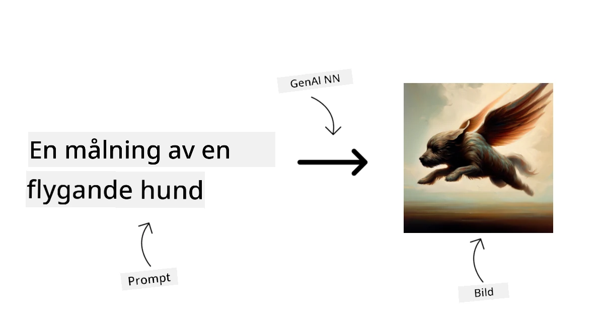

Text- och kodgenereringsmodeller är modeller som genererar text eller kod. Dessa modeller används ofta för textsammanfattning, översättning och frågesvar. Textgenereringsmodeller tränas ofta på stora textdataset, såsom [BookCorpus](https://www.cv-foundation.org/openaccess/content_iccv_2015/html/Zhu_Aligning_Books_and_ICCV_2015_paper.html?WT.mc_id=academic-105485-koreyst), och kan användas för att generera ny text eller svara på frågor. Kodgenereringsmodeller, som [CodeParrot](https://huggingface.co/codeparrot?WT.mc_id=academic-105485-koreyst), tränas ofta på stora koddataset, såsom GitHub, och kan användas för att generera ny kod eller fixa buggar i befintlig kod.

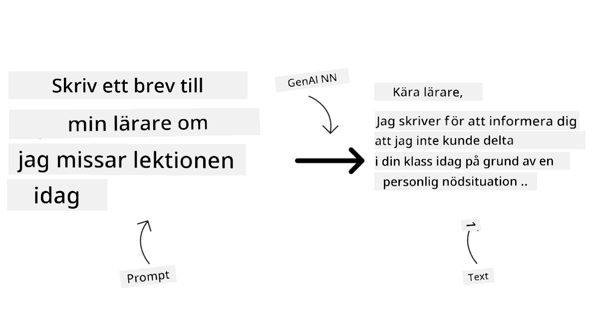

### Encoder-Decoder kontra Decoder-only

För att prata om de olika typer av arkitekturer i LLM:er, låt oss använda en analogi.

Föreställ dig att din chef gav dig uppgiften att skriva ett quiz för studenterna. Du har två kollegor; en ansvarar för att skapa innehållet och den andra ansvarar för att granska det.

Innehållsskaparen är som en decoder-only modell: de kan titta på ämnet, se vad du redan skrivit och sedan fortsätta generera innehåll baserat på den kontexten. De är mycket bra på att skriva engagerande och informativt innehåll, men de är inte alltid det bästa valet när uppgiften bara är att klassificera, hämta eller koda information. Exempel på decoder-only modellsfamiljer inkluderar GPT och Llama-modeller.

Granskaren är som en encoder-only modell, de tittar på kursmaterialet och svaren, lägger märke till relationen mellan dem och förstår kontexten, men är inte bra på att generera innehåll. Ett exempel på encoder-only modell är BERT.

Föreställ dig att vi även kan ha någon som både kan skapa och granska quizet, detta är en Encoder-Decoder modell. Några exempel skulle vara BART och T5.

### Tjänst kontra Modell

Nu, låt oss prata om skillnaden mellan en tjänst och en modell. En tjänst är en produkt som erbjuds av en molntjänstleverantör, och är ofta en kombination av modeller, data och andra komponenter. En modell är kärnkomponenten i en tjänst, och är ofta en grundmodell, såsom en LLM.

Tjänster är ofta optimerade för produktionsanvändning och är ofta enklare att använda än modeller, via ett grafiskt användargränssnitt. Tjänster är inte alltid gratis och kan kräva prenumeration eller betalning för användning, i utbyte mot att utnyttja tjänsteägarens utrustning och resurser, optimera kostnader och skalning enkelt. Ett exempel på en tjänst är [Azure OpenAI Service](https://learn.microsoft.com/azure/ai-foundry/openai/overview?WT.mc_id=academic-105485-koreyst), som erbjuder en betalningsmodell baserad på faktisk användning. Azure OpenAI Service erbjuder också säkerhet i företagsklass och ett ansvarsfullt AI-ramverk ovanpå modellernas kapacitet.

Modeller är de neurala nätverksartefakter: parametrar, vikter, arkitektur, tokenizer och stödjande konfiguration. Att köra en modell lokalt eller i en privat miljö kräver lämplig hårdvara, serveringsinfrastruktur, övervakning och antingen en kompatibel öppen-källkod/öppen vikt-licens eller en kommersiell licens. Öppna viktmodeller såsom Llama 4 eller Mistral-modeller kan självhostas, men kräver ändå beräkningskraft och operativ expertis.

## Hur man testar och itererar med olika modeller för att förstå prestanda på Azure

När vårt team har utforskat det nuvarande LLM-landskapet och identifierat några bra kandidater för deras scenarier är nästa steg att testa dem på deras data och arbetsbelastning. Detta är en iterativ process, gjord genom experiment och mätningar.
De flesta av de modeller vi nämnde i tidigare stycken (OpenAI-modeller, öppenviktsmodeller som Llama 4 och Mistral, och Hugging Face-modeller) finns tillgängliga i [Microsoft Foundry Models](https://learn.microsoft.com/azure/foundry/concepts/foundry-models-overview?WT.mc_id=academic-105485-koreyst).

[Microsoft Foundry](https://learn.microsoft.com/azure/foundry/what-is-foundry?WT.mc_id=academic-105485-koreyst), tidigare Azure AI Studio/Azure AI Foundry, är en enhetlig Azure-plattform för att bygga AI-appar och agenter. Den hjälper utvecklare att hantera livscykeln från experimentering och utvärdering till distribution, övervakning och styrning. Modellkatalogen i Microsoft Foundry gör det möjligt för användaren att:

- Hitta grundmodellen av intresse i katalogen, inklusive modeller som säljs av Azure samt modeller från partners och community-leverantörer. Användare kan filtrera efter uppgift, leverantör, licens, distributionsalternativ eller namn.

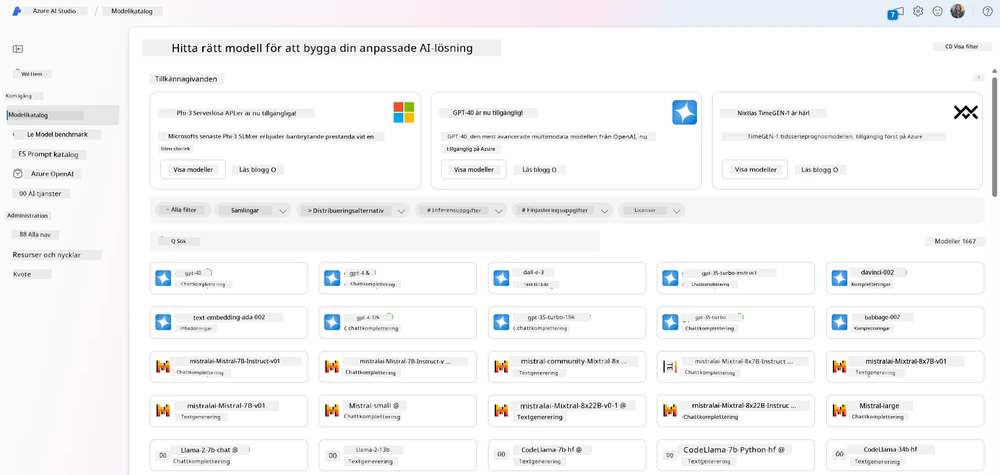

- Granska modelkortet, inklusive en detaljerad beskrivning av avsedd användning och träningsdata, kodexempel och utvärderingsresultat från intern utvärderingsbibliotek.

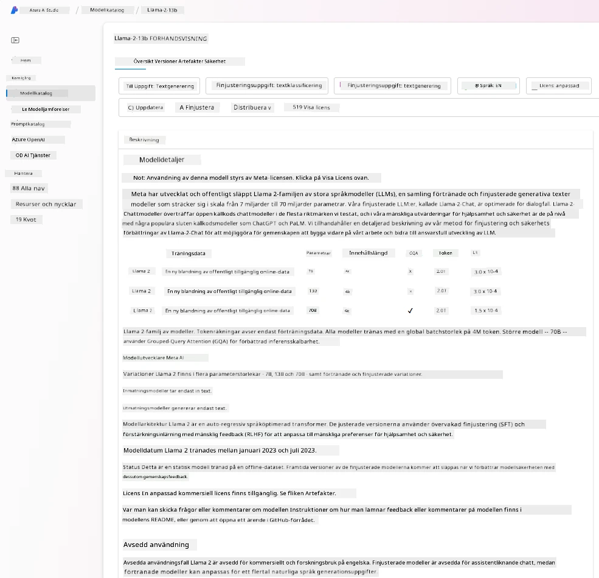

- Jämföra riktmärken över modeller och dataset som finns i branschen för att bedöma vilken som uppfyller affärsscenariot, via [Model Benchmarks](https://learn.microsoft.com/azure/ai-foundry/concepts/model-benchmarks?WT.mc_id=academic-105485-koreyst)-panelen.

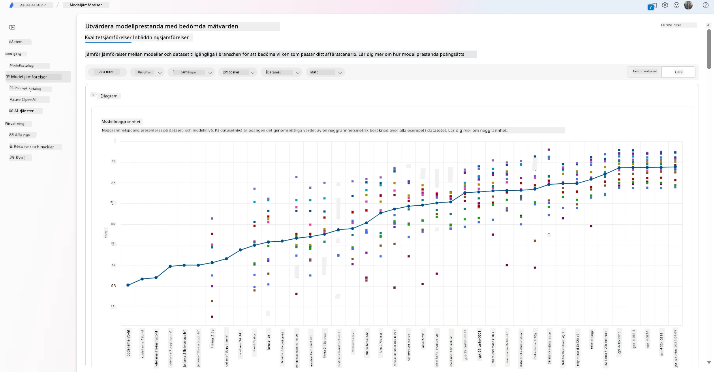

- Finjustera stödjade modeller med anpassad träningsdata för att förbättra modellens prestanda i en specifik arbetsbelastning, med hjälp av experimenterings- och spårningskapaciteter i Microsoft Foundry.

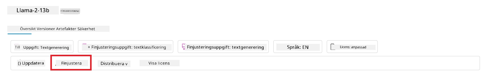

- Distribuera den ursprungliga förtränade modellen eller den finjusterade versionen till en fjärrstyrd inference-endpoint i realtid, med hjälp av hanterad beräkning eller serverlösa distributionsalternativ för att göra den tillgänglig för applikationer.

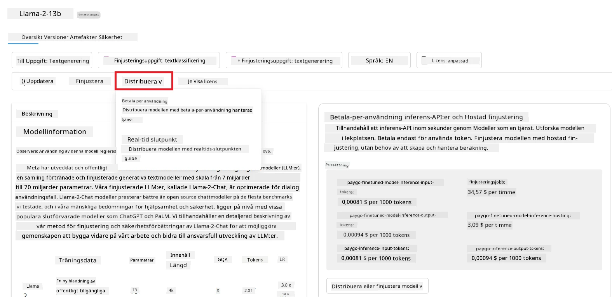

> [!NOTE]
> Inte alla modeller i katalogen är för närvarande tillgängliga för finjustering och/eller betal-per-användning-distribution. Kontrollera modelkortet för detaljer om modellens kapabiliteter och begränsningar.

## Förbättra LLM-resultat

Vi har tillsammans med vårt startup-team utforskat olika typer av LLM och en molnplattform (Microsoft Foundry) som gör det möjligt att jämföra olika modeller, utvärdera dem på testdata, förbättra prestanda och distribuera dem på inference-endpoints.

Men när ska man överväga att finjustera en modell istället för att använda en förtränad? Finns det andra metoder för att förbättra modellprestanda på specifika arbetsbelastningar?

Det finns flera metoder som ett företag kan använda för att få de resultat de behöver från en LLM. Du kan välja olika typer av modeller med olika grader av träning när du distribuerar en LLM i produktion, med olika nivåer av komplexitet, kostnad och kvalitet. Här är några olika tillvägagångssätt:

- **Prompt engineering med kontext**. Idén är att tillhandahålla tillräckligt med kontext när du ger en prompt för att säkerställa att du får de svar du behöver.

- **Retrieval Augmented Generation, RAG**. Dine data kan till exempel finnas i en databas eller en webb-endpoint; för att säkerställa att denna data, eller en delmängd av den, inkluderas vid tidpunkten för prompten, kan du hämta relevant data och göra den till en del av användarens prompt.

- **Finjusterad modell**. Här tränar du modellen vidare på dina egna data vilket leder till att modellen blir mer exakt och lyhörd för dina behov men kan vara kostsamt.

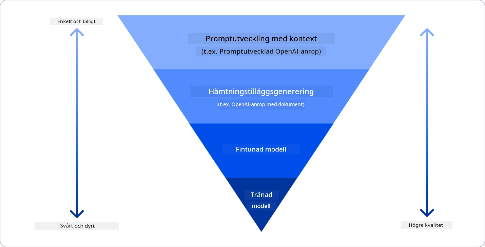

Bildkälla: [Four Ways that Enterprises Deploy LLMs | Fiddler AI Blog](https://www.fiddler.ai/blog/four-ways-that-enterprises-deploy-llms?WT.mc_id=academic-105485-koreyst)

### Prompt Engineering med Kontext

Förtränade LLM fungerar mycket bra på generella naturliga språkuppgifter, även bara genom att anropas med en kort prompt, som en mening att slutföra eller en fråga – det så kallade ”zero-shot” inlärning.

Ju mer användaren kan rama in sin fråga, med en detaljerad begäran och exempel – Kontexten – desto mer exakt och nära användarens förväntningar blir svaret. I detta fall talar vi om ”one-shot” inlärning om prompten innehåller endast ett exempel och ”few shot learning” om den innehåller flera exempel.
Prompt engineering med kontext är det mest kostnadseffektiva tillvägagångssättet att starta med.

### Retrieval Augmented Generation (RAG)

LLM har begränsningen att de endast kan använda data som har använts under deras träning för att generera ett svar. Detta innebär att de inte vet något om fakta som inträffat efter deras träningsprocess, och de kan inte komma åt icke-offentlig information (som företagsdata).
Detta kan övervinnas genom RAG, en teknik som utökar prompten med extern data i form av stycken från dokument, med tanke på begränsningar i promptens längd. Detta stöds av verktyg för vektordatabaser (som [Azure Vector Search](https://learn.microsoft.com/azure/search/vector-search-overview?WT.mc_id=academic-105485-koreyst)) som hämtar användbara stycken från olika fördefinierade datakällor och lägger till dem i prompt-kontexten.

Denna teknik är mycket hjälpsam när ett företag inte har tillräckligt med data, tid eller resurser för att finjustera en LLM, men ändå önskar förbättra prestanda på en specifik arbetsbelastning samt minska risken för hallucinerade, föråldrade eller icke-underbyggda svar.

### Finjusterad modell

Finjustering är en process som utnyttjar transferinlärning för att ”anpassa” modellen till en efterföljande uppgift eller för att lösa ett specifikt problem. Till skillnad från few-shot learning och RAG resulterar detta i att en ny modell genereras med uppdaterade vikter och biaser. Det kräver en uppsättning träningsexempel bestående av en enda ingång (prompten) och dess associerade utgång (slutförandet).
Detta skulle vara den föredragna metoden om:

- **Användning av mindre uppgiftsspecifika modeller**. Ett företag vill finjustera en mindre modell för en snäv uppgift istället för att upprepade gånger prompta en större frontier-modell, vilket resulterar i en mer kostnadseffektiv och snabbare lösning.

- **Att beakta latens**. Latens är viktigt för ett specifikt användningsfall, så det är inte möjligt att använda mycket långa prompts eller att antalet exempel som modellen ska lära sig från inte passar in med promptens längdgräns.

- **Anpassa stabilt beteende**. Ett företag har många högkvalitativa exempel och vill att modellen konsekvent följer ett uppgiftsmönster, output-format, ton eller domänspecifik stil. Om huvudproblemet är färska fakta eller privat kunskap som ofta förändras, använd RAG istället för att förlita dig enbart på finjustering.

### Tränad modell

Att träna en LLM från början är utan tvekan det svåraste och mest komplexa tillvägagångssättet att anta, vilket kräver enorma mängder data, skickliga resurser och lämplig beräkningskapacitet. Detta alternativ bör endast övervägas i ett scenario där ett företag har ett domänspecifikt användningsfall och en stor mängd domäncentrerad data.

## Kunskapskontroll

Vad kan vara en bra metod för att förbättra LLM:s resultat vid slutförande?

1. Prompt engineering med kontext
1. RAG
1. Finjusterad modell

Svar: Alla tre kan hjälpa. Börja med prompt engineering och kontext för snabba förbättringar och använd RAG när modellen behöver aktuella fakta eller privat företagsdata. Välj finjustering när du har tillräckligt med högkvalitativa exempel och behöver att modellen konsekvent följer ett uppgift, format, ton eller domänmönster.

## 🚀 Utmaning

Läs mer om hur du kan [använda RAG](https://learn.microsoft.com/azure/search/retrieval-augmented-generation-overview?WT.mc_id=academic-105485-koreyst) för ditt företag.

## Bra jobbat, fortsätt lära dig

Efter att ha avslutat denna lektion, kolla in vår [Generative AI Learning collection](https://aka.ms/genai-collection?WT.mc_id=academic-105485-koreyst) för att fortsätta utveckla din kunskap om Generativ AI!

Gå vidare till Lektion 3 där vi kommer att titta på hur man [bygger med Generativ AI Ansvarsfullt](../03-using-generative-ai-responsibly/README.md?WT.mc_id=academic-105485-koreyst)!

---

<!-- CO-OP TRANSLATOR DISCLAIMER START -->
**Ansvarsfriskrivning**:
Detta dokument har översatts med hjälp av AI-översättningstjänsten [Co-op Translator](https://github.com/Azure/co-op-translator). Även om vi strävar efter noggrannhet, var vänlig notera att automatiska översättningar kan innehålla fel eller brister. Det ursprungliga dokumentet på dess modersmål bör betraktas som den auktoritativa källan. För kritisk information rekommenderas professionell mänsklig översättning. Vi ansvarar inte för några missförstånd eller feltolkningar som uppstår till följd av användningen av denna översättning.
<!-- CO-OP TRANSLATOR DISCLAIMER END -->