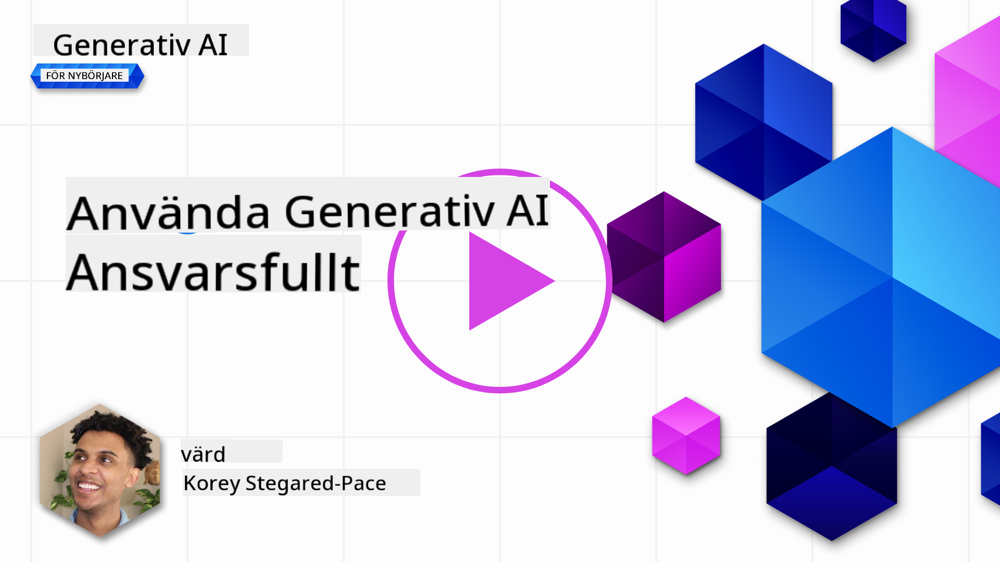
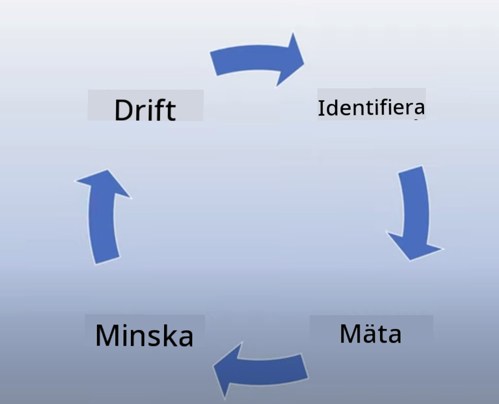
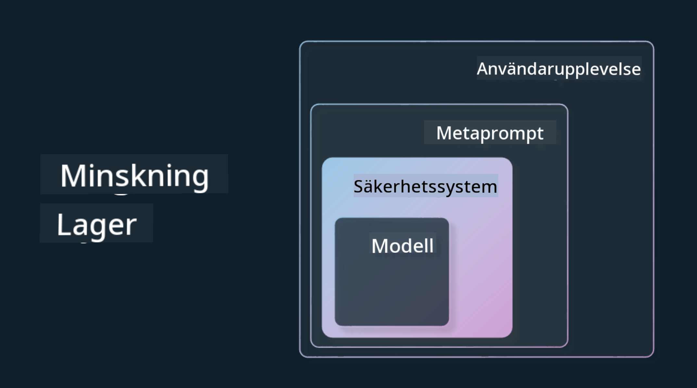

<!--
CO_OP_TRANSLATOR_METADATA:
{
  "original_hash": "7f8f4c11f8c1cb6e1794442dead414ea",
  "translation_date": "2025-07-09T08:57:09+00:00",
  "source_file": "03-using-generative-ai-responsibly/README.md",
  "language_code": "sv"
}
-->
# Att Använda Generativ AI Ansvarsfullt

> _Klicka på bilden ovan för att se videon till denna lektion_

Det är lätt att bli fascinerad av AI, och generativ AI i synnerhet, men du behöver fundera på hur du använder den på ett ansvarsfullt sätt. Du måste ta hänsyn till saker som hur du säkerställer att resultatet är rättvist, ofarligt och mer. Detta kapitel syftar till att ge dig den nämnda kontexten, vad du bör tänka på och hur du kan ta aktiva steg för att förbättra din AI-användning.

## Introduktion

Denna lektion kommer att täcka:

- Varför du bör prioritera Responsible AI när du bygger Generative AI-applikationer.
- Kärnprinciperna för Responsible AI och hur de relaterar till Generative AI.
- Hur du omsätter dessa Responsible AI-principer i praktiken genom strategi och verktyg.

## Lärandemål

Efter att ha genomfört denna lektion kommer du att veta:

- Vikten av Responsible AI när du bygger Generative AI-applikationer.
- När du bör tänka på och tillämpa kärnprinciperna för Responsible AI vid utveckling av Generative AI-applikationer.
- Vilka verktyg och strategier som finns tillgängliga för att omsätta Responsible AI i praktiken.

## Principer för Responsible AI

Intresset för Generative AI har aldrig varit större. Detta intresse har lockat många nya utvecklare, uppmärksamhet och finansiering till området. Även om detta är mycket positivt för alla som vill bygga produkter och företag med Generative AI, är det också viktigt att vi går fram på ett ansvarsfullt sätt.

Under hela kursen fokuserar vi på att bygga vår startup och vår AI-utbildningsprodukt. Vi kommer att använda principerna för Responsible AI: Rättvisa, Inkludering, Tillförlitlighet/Säkerhet, Säkerhet & Integritet, Transparens och Ansvarstagande. Med dessa principer kommer vi att utforska hur de relaterar till vår användning av Generative AI i våra produkter.

## Varför bör du prioritera Responsible AI

När du bygger en produkt leder ett människocentrerat angreppssätt, där du har användarens bästa i åtanke, till de bästa resultaten.

Det unika med Generative AI är dess förmåga att skapa hjälpsamma svar, information, vägledning och innehåll för användare. Detta kan göras utan många manuella steg, vilket kan ge mycket imponerande resultat. Utan rätt planering och strategier kan det tyvärr också leda till skadliga resultat för dina användare, din produkt och samhället i stort.

Låt oss titta på några (men inte alla) av dessa potentiellt skadliga resultat:

### Hallucinationer

Hallucinationer är ett begrepp som används för att beskriva när en LLM producerar innehåll som antingen är helt nonsens eller något vi vet är faktamässigt felaktigt baserat på andra informationskällor.

Ta till exempel att vi bygger en funktion för vår startup som låter studenter ställa historiska frågor till en modell. En student frågar: `Who was the sole survivor of Titanic?`

Modellen ger ett svar som det nedan:

> _(Källa: [Flying bisons](https://flyingbisons.com?WT.mc_id=academic-105485-koreyst))_

Detta är ett mycket självsäkert och utförligt svar. Tyvärr är det felaktigt. Även med en minimal mängd forskning skulle man upptäcka att det fanns fler än en överlevande från Titanic-katastrofen. För en student som just börjat undersöka ämnet kan detta svar vara tillräckligt övertygande för att inte ifrågasättas och behandlas som fakta. Konsekvenserna kan bli att AI-systemet uppfattas som opålitligt och skada vår startups rykte.

Med varje iteration av en given LLM har vi sett förbättringar i att minimera hallucinationer. Trots denna förbättring måste vi som applikationsbyggare och användare fortfarande vara medvetna om dessa begränsningar.

### Skadligt innehåll

Vi gick igenom i föregående avsnitt när en LLM producerar felaktiga eller nonsensartade svar. En annan risk vi måste vara medvetna om är när en modell svarar med skadligt innehåll.

Skadligt innehåll kan definieras som:

- Att ge instruktioner eller uppmuntra till självskada eller skada mot vissa grupper.
- Hatfullt eller förnedrande innehåll.
- Att vägleda planering av attacker eller våldsamma handlingar.
- Att ge instruktioner om hur man hittar olagligt innehåll eller begår olagliga handlingar.
- Att visa sexuellt explicit innehåll.

För vår startup vill vi säkerställa att vi har rätt verktyg och strategier på plats för att förhindra att denna typ av innehåll visas för studenter.

### Brist på rättvisa

Rättvisa definieras som ”att säkerställa att ett AI-system är fritt från partiskhet och diskriminering och att det behandlar alla rättvist och lika.” Inom Generative AI vill vi säkerställa att exkluderande världsuppfattningar om marginaliserade grupper inte förstärks av modellens output.

Denna typ av output är inte bara destruktiv för att skapa positiva produktupplevelser för våra användare, utan orsakar också ytterligare samhällsskada. Som applikationsbyggare bör vi alltid ha en bred och mångfaldig användarbas i åtanke när vi bygger lösningar med Generative AI.

## Hur man använder Generativ AI ansvarsfullt

Nu när vi har identifierat vikten av Responsible Generative AI, låt oss titta på 4 steg vi kan ta för att bygga våra AI-lösningar på ett ansvarsfullt sätt:

### Mät potentiella skador

Vid mjukvarutestning testar vi användarens förväntade handlingar i en applikation. På samma sätt är det bra att testa en mångfald av prompts som användare sannolikt kommer att använda för att mäta potentiell skada.

Eftersom vår startup bygger en utbildningsprodukt vore det bra att förbereda en lista med utbildningsrelaterade prompts. Det kan handla om att täcka ett visst ämne, historiska fakta och prompts om studentlivet.

### Minska potentiella skador

Det är nu dags att hitta sätt att förhindra eller begränsa den potentiella skada som modellen och dess svar kan orsaka. Vi kan se detta i 4 olika lager:

- **Modell**. Välja rätt modell för rätt användningsfall. Större och mer komplexa modeller som GPT-4 kan innebära större risk för skadligt innehåll när de används i mindre och mer specifika sammanhang. Att använda din träningsdata för finjustering minskar också risken för skadligt innehåll.

- **Säkerhetssystem**. Ett säkerhetssystem är en uppsättning verktyg och konfigurationer på plattformen som serverar modellen och hjälper till att minska skada. Ett exempel är innehållsfiltreringssystemet i Azure OpenAI-tjänsten. Systemen bör också upptäcka jailbreak-attacker och oönskad aktivitet som förfrågningar från bots.

- **Metaprompt**. Metaprompter och grundning är sätt att styra eller begränsa modellen baserat på vissa beteenden och information. Det kan vara att använda systeminput för att definiera vissa gränser för modellen. Dessutom att ge output som är mer relevant för systemets omfattning eller domän.

Det kan också vara att använda tekniker som Retrieval Augmented Generation (RAG) för att låta modellen endast hämta information från ett urval av betrodda källor. Det finns en lektion senare i kursen om [att bygga sökapplikationer](../08-building-search-applications/README.md?WT.mc_id=academic-105485-koreyst).

- **Användarupplevelse**. Det sista lagret är där användaren interagerar direkt med modellen via vår applikationsgränssnitt på något sätt. På detta sätt kan vi designa UI/UX för att begränsa användaren i vilka typer av input de kan skicka till modellen samt text eller bilder som visas för användaren. När vi lanserar AI-applikationen måste vi också vara transparenta om vad vår Generative AI-applikation kan och inte kan göra.

Vi har en hel lektion dedikerad till [Design av UX för AI-applikationer](../12-designing-ux-for-ai-applications/README.md?WT.mc_id=academic-105485-koreyst).

- **Utvärdera modellen**. Att arbeta med LLM:er kan vara utmanande eftersom vi inte alltid har kontroll över den data modellen tränats på. Oavsett bör vi alltid utvärdera modellens prestanda och output. Det är fortfarande viktigt att mäta modellens noggrannhet, likhet, grundning och relevans i outputen. Detta hjälper till att skapa transparens och förtroende hos intressenter och användare.

### Driva en ansvarsfull Generative AI-lösning

Att bygga en operativ praxis kring dina AI-applikationer är det sista steget. Detta inkluderar samarbete med andra delar av vår startup som juridik och säkerhet för att säkerställa att vi följer alla regelverk. Innan lansering vill vi också skapa planer för leverans, hantering av incidenter och återställning för att förhindra att skada på våra användare växer.

## Verktyg

Även om arbetet med att utveckla Responsible AI-lösningar kan verka omfattande, är det väl värt insatsen. När området Generative AI växer kommer fler verktyg som hjälper utvecklare att effektivt integrera ansvar i sina arbetsflöden att mogna. Till exempel kan [Azure AI Content Safety](https://learn.microsoft.com/azure/ai-services/content-safety/overview?WT.mc_id=academic-105485-koreyst) hjälpa till att upptäcka skadligt innehåll och bilder via en API-förfrågan.

## Kunskapskontroll

Vilka är några saker du behöver tänka på för att säkerställa ansvarsfull AI-användning?

1. Att svaret är korrekt.  
1. Skadlig användning, att AI inte används för kriminella ändamål.  
1. Att säkerställa att AI är fri från partiskhet och diskriminering.

Svar: 2 och 3 är korrekta. Responsible AI hjälper dig att tänka på hur du kan minska skadliga effekter och bias med mera.

## 🚀 Utmaning

Läs på om [Azure AI Content Safety](https://learn.microsoft.com/azure/ai-services/content-safety/overview?WT.mc_id=academic-105485-koreyst) och se vad du kan använda för din egen användning.

## Bra jobbat, fortsätt ditt lärande

Efter att ha genomfört denna lektion, kolla in vår [Generative AI Learning collection](https://aka.ms/genai-collection?WT.mc_id=academic-105485-koreyst) för att fortsätta utveckla dina kunskaper inom Generative AI!

Gå vidare till Lektion 4 där vi tittar på [Grundläggande Prompt Engineering](../04-prompt-engineering-fundamentals/README.md?WT.mc_id=academic-105485-koreyst)!

**Ansvarsfriskrivning**:  
Detta dokument har översatts med hjälp av AI-översättningstjänsten [Co-op Translator](https://github.com/Azure/co-op-translator). Även om vi strävar efter noggrannhet, vänligen observera att automatiska översättningar kan innehålla fel eller brister. Det ursprungliga dokumentet på dess modersmål bör betraktas som den auktoritativa källan. För kritisk information rekommenderas professionell mänsklig översättning. Vi ansvarar inte för några missförstånd eller feltolkningar som uppstår vid användning av denna översättning.