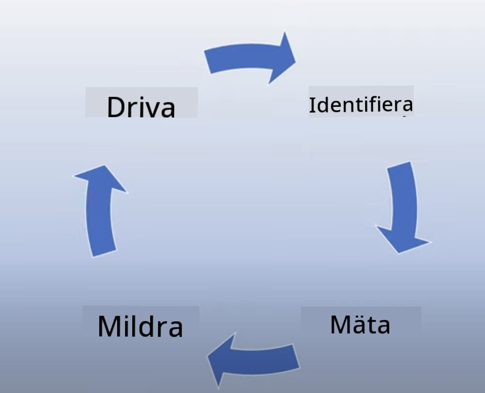

<!--
CO_OP_TRANSLATOR_METADATA:
{
  "original_hash": "4d57fad773cbeb69c5dd62e65c34200d",
  "translation_date": "2025-10-17T19:00:21+00:00",
  "source_file": "03-using-generative-ai-responsibly/README.md",
  "language_code": "sv"
}
-->
# Använda Generativ AI Ansvarsfullt

> _Klicka på bilden ovan för att se videon för denna lektion_

Det är lätt att fascineras av AI och generativ AI i synnerhet, men det är viktigt att fundera över hur man använder den på ett ansvarsfullt sätt. Du behöver tänka på saker som hur du säkerställer att resultaten är rättvisa, icke-skadliga och mer. Detta kapitel syftar till att ge dig den nämnda kontexten, vad du bör tänka på och hur du kan ta aktiva steg för att förbättra din AI-användning.

## Introduktion

Denna lektion kommer att täcka:

- Varför du bör prioritera Ansvarsfull AI när du bygger applikationer med Generativ AI.
- Grundprinciper för Ansvarsfull AI och hur de relaterar till Generativ AI.
- Hur du kan omsätta dessa principer i praktiken genom strategier och verktyg.

## Lärandemål

Efter att ha avslutat denna lektion kommer du att veta:

- Vikten av Ansvarsfull AI när du bygger applikationer med Generativ AI.
- När du ska tänka på och tillämpa grundprinciperna för Ansvarsfull AI när du bygger applikationer med Generativ AI.
- Vilka verktyg och strategier som finns tillgängliga för att omsätta konceptet Ansvarsfull AI i praktiken.

## Principer för Ansvarsfull AI

Intresset för Generativ AI har aldrig varit större. Detta intresse har lockat många nya utvecklare, uppmärksamhet och finansiering till detta område. Även om detta är mycket positivt för alla som vill bygga produkter och företag med Generativ AI, är det också viktigt att vi går framåt på ett ansvarsfullt sätt.

Under hela denna kurs fokuserar vi på att bygga vårt startup och vår utbildningsprodukt med AI. Vi kommer att använda principerna för Ansvarsfull AI: Rättvisa, Inkludering, Tillförlitlighet/Säkerhet, Säkerhet & Integritet, Transparens och Ansvar. Med dessa principer kommer vi att utforska hur de relaterar till vår användning av Generativ AI i våra produkter.

## Varför Bör Du Prioritera Ansvarsfull AI

När du bygger en produkt leder ett människocentrerat tillvägagångssätt, där du håller användarens bästa intresse i åtanke, till de bästa resultaten.

Det unika med Generativ AI är dess förmåga att skapa hjälpsamma svar, information, vägledning och innehåll för användare. Detta kan göras utan många manuella steg, vilket kan leda till mycket imponerande resultat. Utan ordentlig planering och strategier kan det tyvärr också leda till skadliga resultat för dina användare, din produkt och samhället som helhet.

Låt oss titta på några (men inte alla) av dessa potentiellt skadliga resultat:

### Hallucinationer

Hallucinationer är en term som används för att beskriva när en LLM producerar innehåll som antingen är helt nonsens eller något vi vet är faktamässigt fel baserat på andra informationskällor.

Låt oss ta ett exempel där vi bygger en funktion för vårt startup som tillåter studenter att ställa historiska frågor till en modell. En student ställer frågan `Vem var den enda överlevande från Titanic?`

Modellen producerar ett svar som det nedan:

> _(Källa: [Flying bisons](https://flyingbisons.com?WT.mc_id=academic-105485-koreyst))_

Detta är ett mycket självsäkert och detaljerat svar. Tyvärr är det felaktigt. Även med minimal forskning skulle man upptäcka att det fanns fler än en överlevande från Titanic-katastrofen. För en student som just börjat forska om detta ämne kan detta svar vara tillräckligt övertygande för att inte ifrågasättas och behandlas som fakta. Konsekvenserna av detta kan leda till att AI-systemet blir opålitligt och negativt påverkar vårt startups rykte.

Med varje iteration av en given LLM har vi sett förbättringar i prestanda när det gäller att minimera hallucinationer. Även med denna förbättring måste vi som applikationsbyggare och användare fortfarande vara medvetna om dessa begränsningar.

### Skadligt Innehåll

Vi har tidigare täckt när en LLM producerar felaktiga eller nonsenssvar. En annan risk vi måste vara medvetna om är när en modell svarar med skadligt innehåll.

Skadligt innehåll kan definieras som:

- Att ge instruktioner eller uppmuntra till självskada eller skada mot vissa grupper.
- Hatiskt eller nedvärderande innehåll.
- Vägledning för att planera någon typ av attack eller våldsamma handlingar.
- Att ge instruktioner om hur man hittar olagligt innehåll eller begår olagliga handlingar.
- Att visa sexuellt explicit innehåll.

För vårt startup vill vi se till att vi har rätt verktyg och strategier på plats för att förhindra att denna typ av innehåll visas för studenter.

### Brist på Rättvisa

Rättvisa definieras som "att säkerställa att ett AI-system är fritt från partiskhet och diskriminering och att det behandlar alla rättvist och lika." Inom Generativ AI vill vi säkerställa att exkluderande världsuppfattningar om marginaliserade grupper inte förstärks av modellens output.

Denna typ av output är inte bara destruktiv för att bygga positiva produktupplevelser för våra användare, utan orsakar också ytterligare samhällelig skada. Som applikationsbyggare bör vi alltid ha en bred och mångsidig användarbas i åtanke när vi bygger lösningar med Generativ AI.

## Hur Man Använder Generativ AI Ansvarsfullt

Nu när vi har identifierat vikten av Ansvarsfull Generativ AI, låt oss titta på 4 steg vi kan ta för att bygga våra AI-lösningar ansvarsfullt:

### Mäta Potentiella Skador

Inom mjukvarutestning testar vi de förväntade handlingarna hos en användare på en applikation. På samma sätt är det en bra idé att testa en mångfald av prompts som användare mest sannolikt kommer att använda för att mäta potentiella skador.

Eftersom vårt startup bygger en utbildningsprodukt skulle det vara bra att förbereda en lista med utbildningsrelaterade prompts. Detta kan täcka ett visst ämne, historiska fakta och prompts om studentlivet.

### Begränsa Potentiella Skador

Nu är det dags att hitta sätt där vi kan förhindra eller begränsa den potentiella skada som orsakas av modellen och dess svar. Vi kan titta på detta i 4 olika lager:

- **Modell**. Välja rätt modell för rätt användningsområde. Större och mer komplexa modeller som GPT-4 kan innebära större risk för skadligt innehåll när de används för mindre och mer specifika användningsområden. Att använda din träningsdata för att finjustera minskar också risken för skadligt innehåll.

- **Säkerhetssystem**. Ett säkerhetssystem är en uppsättning verktyg och konfigurationer på plattformen som serverar modellen och hjälper till att begränsa skador. Ett exempel på detta är innehållsfiltreringssystemet på Azure OpenAI-tjänsten. System bör också upptäcka jailbreak-attacker och oönskad aktivitet som förfrågningar från bots.

- **Metaprompt**. Metaprompts och grounding är sätt vi kan styra eller begränsa modellen baserat på vissa beteenden och information. Detta kan vara att använda systeminputs för att definiera vissa gränser för modellen. Dessutom att tillhandahålla outputs som är mer relevanta för systemets omfattning eller domän.

Det kan också vara att använda tekniker som Retrieval Augmented Generation (RAG) för att få modellen att endast hämta information från ett urval av betrodda källor. Det finns en lektion senare i denna kurs för [att bygga sökapplikationer](../08-building-search-applications/README.md?WT.mc_id=academic-105485-koreyst)

- **Användarupplevelse**. Det sista lagret är där användaren interagerar direkt med modellen genom vår applikationsgränssnitt på något sätt. På detta sätt kan vi designa UI/UX för att begränsa användaren i vilka typer av inputs de kan skicka till modellen samt text eller bilder som visas för användaren. När vi distribuerar AI-applikationen måste vi också vara transparenta om vad vår Generativa AI-applikation kan och inte kan göra.

Vi har en hel lektion dedikerad till [Designa UX för AI-applikationer](../12-designing-ux-for-ai-applications/README.md?WT.mc_id=academic-105485-koreyst)

- **Utvärdera modellen**. Att arbeta med LLMs kan vara utmanande eftersom vi inte alltid har kontroll över datan modellen tränades på. Oavsett detta bör vi alltid utvärdera modellens prestanda och outputs. Det är fortfarande viktigt att mäta modellens noggrannhet, likhet, grundning och relevans av output. Detta hjälper till att ge transparens och förtroende till intressenter och användare.

### Driva en Ansvarsfull Generativ AI-lösning

Att bygga en operativ praxis kring dina AI-applikationer är det sista steget. Detta inkluderar att samarbeta med andra delar av vårt startup som Juridik och Säkerhet för att säkerställa att vi följer alla regler och policyer. Innan lansering vill vi också bygga planer kring leverans, hantering av incidenter och rollback för att förhindra att någon skada drabbar våra användare.

## Verktyg

Även om arbetet med att utveckla Ansvarsfulla AI-lösningar kan verka omfattande, är det arbete som är väl värt ansträngningen. När området för Generativ AI växer kommer fler verktyg att mogna för att hjälpa utvecklare att effektivt integrera ansvar i sina arbetsflöden. Till exempel kan [Azure AI Content Safety](https://learn.microsoft.com/azure/ai-services/content-safety/overview?WT.mc_id=academic-105485-koreyst) hjälpa till att upptäcka skadligt innehåll och bilder via en API-förfrågan.

## Kunskapskontroll

Vad är några saker du behöver bry dig om för att säkerställa ansvarsfull AI-användning?

1. Att svaret är korrekt.
1. Skadlig användning, att AI inte används för kriminella ändamål.
1. Säkerställa att AI är fri från partiskhet och diskriminering.

A: 2 och 3 är korrekta. Ansvarsfull AI hjälper dig att överväga hur du kan begränsa skadliga effekter och partiskhet och mer.

## 🚀 Utmaning

Läs om [Azure AI Content Safety](https://learn.microsoft.com/azure/ai-services/content-safety/overview?WT.mc_id=academic-105485-koreyst) och se vad du kan använda för dina behov.

## Bra Jobbat, Fortsätt Din Inlärning

Efter att ha avslutat denna lektion, kolla in vår [Generativ AI Lärandekollektion](https://aka.ms/genai-collection?WT.mc_id=academic-105485-koreyst) för att fortsätta utveckla din kunskap om Generativ AI!

Gå vidare till Lektion 4 där vi kommer att titta på [Grundläggande om Prompt Engineering](../04-prompt-engineering-fundamentals/README.md?WT.mc_id=academic-105485-koreyst)!

---

**Ansvarsfriskrivning**:  
Detta dokument har översatts med hjälp av AI-översättningstjänsten [Co-op Translator](https://github.com/Azure/co-op-translator). Även om vi strävar efter noggrannhet, bör du vara medveten om att automatiserade översättningar kan innehålla fel eller felaktigheter. Det ursprungliga dokumentet på dess ursprungliga språk bör betraktas som den auktoritativa källan. För kritisk information rekommenderas professionell mänsklig översättning. Vi ansvarar inte för eventuella missförstånd eller feltolkningar som uppstår vid användning av denna översättning.