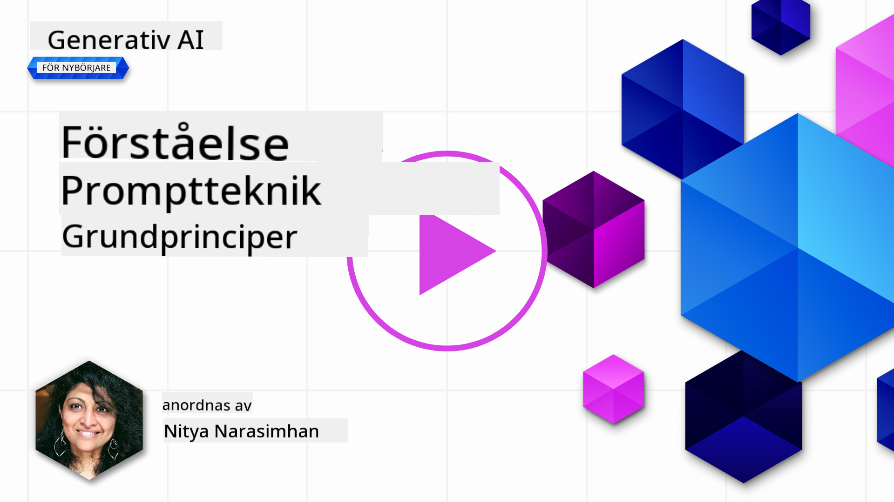
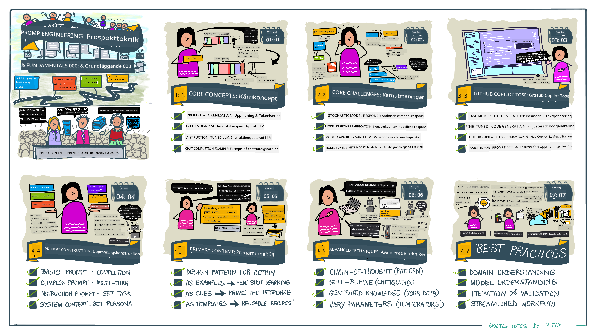
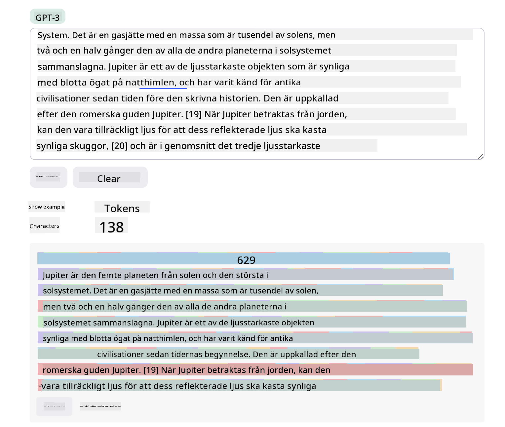
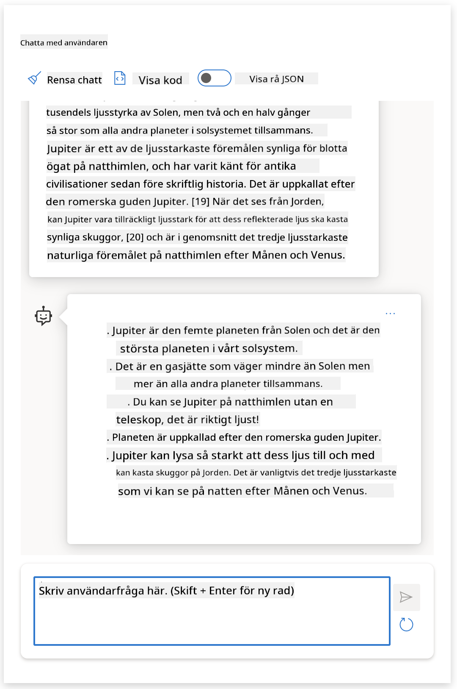
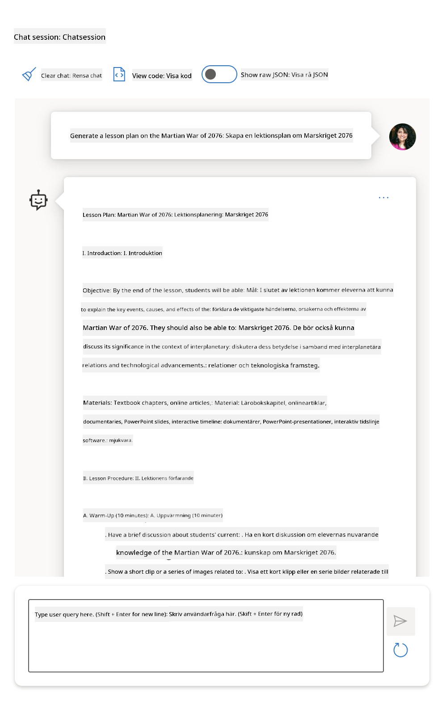
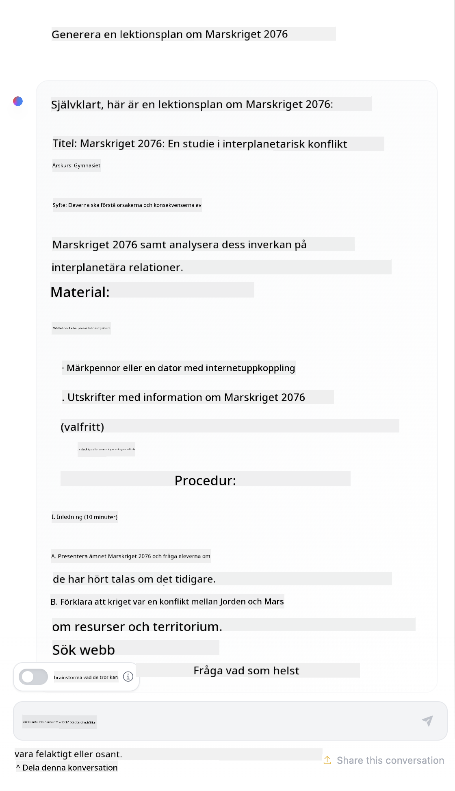

<!--
CO_OP_TRANSLATOR_METADATA:
{
  "original_hash": "dcbaaae026cb50fee071e690685b5843",
  "translation_date": "2025-08-26T17:20:08+00:00",
  "source_file": "04-prompt-engineering-fundamentals/README.md",
  "language_code": "sv"
}
-->
# Grundläggande om Prompt Engineering

[](https://aka.ms/gen-ai-lesson4-gh?WT.mc_id=academic-105485-koreyst)

## Introduktion
Detta avsnitt tar upp viktiga begrepp och tekniker för att skapa effektiva prompts till generativa AI-modeller. Hur du formulerar din prompt till en LLM spelar också roll. En noggrant utformad prompt kan ge bättre svarskvalitet. Men vad betyder egentligen termer som _prompt_ och _prompt engineering_? Och hur förbättrar jag själva prompt-_inmatningen_ som jag skickar till LLM:en? Det är frågor vi försöker besvara i detta och nästa kapitel.

_Generativ AI_ kan skapa nytt innehåll (t.ex. text, bilder, ljud, kod osv.) som svar på användarens förfrågningar. Detta görs med hjälp av _Large Language Models_ som OpenAIs GPT-serie ("Generative Pre-trained Transformer") som tränats för att använda naturligt språk och kod.

Användare kan nu interagera med dessa modeller via bekanta gränssnitt som chatt, utan att behöva teknisk expertis eller utbildning. Modellerna är _prompt-baserade_ – användaren skickar in en text (prompt) och får tillbaka AI:ns svar (completion). Man kan sedan "chatta med AI:n" i flera omgångar, och förfina sin prompt tills svaret motsvarar förväntningarna.

"Prompts" blir därmed det primära _programmeringsgränssnittet_ för generativa AI-appar, där de styr vad modellerna ska göra och påverkar kvaliteten på svaren. "Prompt Engineering" är ett snabbt växande område som fokuserar på _design och optimering_ av prompts för att leverera konsekventa och högkvalitativa svar i stor skala.

## Lärandemål

I denna lektion lär vi oss vad Prompt Engineering är, varför det är viktigt och hur vi kan skapa mer effektiva prompts för en viss modell och ett visst syfte. Vi går igenom grundläggande begrepp och bästa praxis för prompt engineering – och får även testa ett interaktivt Jupyter Notebooks-"sandbox"-miljö där vi ser dessa koncept i praktiken.

Efter denna lektion kommer vi att kunna:

1. Förklara vad prompt engineering är och varför det är viktigt.
2. Beskriva vad en prompt består av och hur delarna används.
3. Lära oss bästa praxis och tekniker för prompt engineering.
4. Använda de inlärda teknikerna på riktiga exempel, med hjälp av en OpenAI-endpoint.

## Viktiga begrepp

Prompt Engineering: Att utforma och förfina inmatningar för att styra AI-modeller mot önskade resultat.
Tokenisering: Processen att omvandla text till mindre enheter, så kallade tokens, som en modell kan förstå och bearbeta.
Instruktionsanpassade LLM: Stora språkmodeller (LLM) som finjusterats med specifika instruktioner för att förbättra svarens relevans och precision.

## Lärandesandlåda

Prompt engineering är idag mer en konst än en vetenskap. Det bästa sättet att utveckla sin känsla för det är att _öva mycket_ och använda en trial-and-error-metod som kombinerar domänkunskap med rekommenderade tekniker och modelloptimeringar.

Jupyter Notebook som hör till denna lektion erbjuder en _sandlåda_ där du kan testa det du lär dig – antingen under lektionens gång eller som en del av kodutmaningen i slutet. För att köra övningarna behöver du:

1. **En Azure OpenAI API-nyckel** – tjänstens endpoint för en driftsatt LLM.
2. **En Python-miljö** – där du kan köra Notebooken.
3. **Lokala miljövariabler** – _gör klart [SETUP](./../00-course-setup/02-setup-local.md?WT.mc_id=academic-105485-koreyst) stegen nu för att förbereda dig_.

Notebooken innehåller _startövningar_ – men du uppmuntras att lägga till egna _Markdown_- (beskrivning) och _Kod_- (promptförfrågningar) sektioner för att testa fler exempel eller idéer – och bygga din känsla för promptdesign.

## Illustrerad guide

Vill du få en överblick över vad denna lektion handlar om innan du sätter igång? Kolla in denna illustrerade guide, som ger dig en känsla för huvudteman och viktiga insikter att ta med dig från varje del. Lektionens vägkarta tar dig från att förstå grundläggande begrepp och utmaningar till att hantera dem med relevanta tekniker och bästa praxis inom prompt engineering. Observera att avsnittet "Advanced Techniques" i denna guide syftar på innehåll som tas upp i _nästa_ kapitel i kursen.



## Vårt startup-företag

Nu ska vi prata om hur _detta ämne_ hänger ihop med vårt startup-uppdrag att [ta AI-innovation till utbildning](https://educationblog.microsoft.com/2023/06/collaborating-to-bring-ai-innovation-to-education?WT.mc_id=academic-105485-koreyst). Vi vill bygga AI-drivna applikationer för _personligt lärande_ – så låt oss fundera på hur olika användare av vår app kan "designa" prompts:

- **Administratörer** kan be AI:n _analysera kursdata för att hitta luckor i täckningen_. AI:n kan sammanfatta resultat eller visualisera dem med kod.
- **Lärare** kan be AI:n _skapa en lektionsplan för en viss målgrupp och ämne_. AI:n kan bygga en personlig plan i ett angivet format.
- **Studenter** kan be AI:n _hjälpa dem med ett svårt ämne_. AI:n kan nu guida studenter med lektioner, tips och exempel anpassade till deras nivå.

Detta är bara början. Kolla in [Prompts For Education](https://github.com/microsoft/prompts-for-edu/tree/main?WT.mc_id=academic-105485-koreyst) – ett öppet bibliotek med prompts, sammanställt av utbildningsexperter – för att få en bredare bild av möjligheterna! _Testa gärna några av dessa prompts i sandlådan eller i OpenAI Playground och se vad som händer!_

<!--
LEKTIONSMALL:
Denna enhet ska täcka kärnbegrepp #1.
Stärk begreppet med exempel och referenser.

KONCEPT #1:
Prompt Engineering.
Definiera det och förklara varför det behövs.
-->

## Vad är Prompt Engineering?

Vi började denna lektion med att definiera **Prompt Engineering** som processen att _utforma och optimera_ textinmatningar (prompts) för att leverera konsekventa och högkvalitativa svar (completions) för ett visst syfte och en viss modell. Man kan se det som en process i två steg:

- _utforma_ den första prompten för en viss modell och syfte
- _förfina_ prompten stegvis för att förbättra svarskvaliteten

Detta är nödvändigtvis en trial-and-error-process som kräver användarens känsla och arbete för att få bästa resultat. Men varför är det viktigt? För att svara på det behöver vi först förstå tre begrepp:

- _Tokenisering_ = hur modellen "ser" prompten
- _Bas-LLM_ = hur grundmodellen "bearbetar" en prompt
- _Instruktionsanpassade LLM_ = hur modellen nu kan se "uppgifter"

### Tokenisering

En LLM ser prompts som en _sekvens av tokens_ där olika modeller (eller versioner av en modell) kan tokenisera samma prompt på olika sätt. Eftersom LLM:er tränas på tokens (och inte på råtext) påverkar sättet prompts tokeniseras direkt kvaliteten på det genererade svaret.

Vill du få en känsla för hur tokenisering fungerar? Testa verktyg som [OpenAI Tokenizer](https://platform.openai.com/tokenizer?WT.mc_id=academic-105485-koreyst) som visas nedan. Klistra in din prompt – och se hur den omvandlas till tokens, och notera hur blanksteg och skiljetecken hanteras. Observera att detta exempel visar en äldre LLM (GPT-3) – så om du testar med en nyare modell kan resultatet bli annorlunda.



### Begrepp: Grundmodeller

När en prompt har tokeniserats är huvudfunktionen för ["Bas-LLM"](https://blog.gopenai.com/an-introduction-to-base-and-instruction-tuned-large-language-models-8de102c785a6?WT.mc_id=academic-105485-koreyst) (eller grundmodell) att förutsäga nästa token i sekvensen. Eftersom LLM:er tränats på enorma textmängder har de en god uppfattning om de statistiska sambanden mellan tokens och kan göra den förutsägelsen med viss säkerhet. Observera att de inte förstår _innebörden_ av orden i prompten eller token – de ser bara ett mönster de kan "fylla i" med sin nästa förutsägelse. De kan fortsätta förutsäga sekvensen tills användaren avbryter eller någon förutbestämd gräns uppnås.

Vill du se hur prompt-baserad completion fungerar? Skriv in prompten ovan i Azure OpenAI Studio [_Chat Playground_](https://oai.azure.com/playground?WT.mc_id=academic-105485-koreyst) med standardinställningarna. Systemet är inställt på att behandla prompts som informationsförfrågningar – så du bör få ett svar som passar detta sammanhang.

Men vad händer om användaren vill se något specifikt som uppfyller vissa kriterier eller mål? Det är här _instruktionsanpassade_ LLM:er kommer in i bilden.


### Begrepp: Instruktionsanpassade LLM

En [Instruktionsanpassad LLM](https://blog.gopenai.com/an-introduction-to-base-and-instruction-tuned-large-language-models-8de102c785a6?WT.mc_id=academic-105485-koreyst) utgår från grundmodellen och finjusteras med exempel eller in-/utdata-par (t.ex. flerstegs-"meddelanden") som kan innehålla tydliga instruktioner – och AI:ns svar försöker följa dessa instruktioner.

Detta görs med tekniker som Reinforcement Learning with Human Feedback (RLHF) som tränar modellen att _följa instruktioner_ och _lära av återkoppling_ så att den ger svar som är bättre anpassade till praktiska tillämpningar och mer relevanta för användarens mål.

Låt oss testa – gå tillbaka till prompten ovan, men ändra nu _systemmeddelandet_ så att det innehåller följande instruktion som kontext:

> _Sammanfatta innehållet du får för en andraklassare. Håll resultatet till ett stycke med 3–5 punktlistor._

Ser du hur resultatet nu är anpassat till det önskade målet och formatet? En lärare kan nu direkt använda detta svar i sina lektionsbilder för klassen.



## Varför behöver vi Prompt Engineering?

Nu när vi vet hur prompts bearbetas av LLM:er, låt oss prata om _varför_ vi behöver prompt engineering. Svaret ligger i att dagens LLM:er har flera utmaningar som gör det _svårare att få tillförlitliga och konsekventa svar_ utan att lägga ner arbete på att utforma och optimera prompts. Till exempel:

1. **Modellsvar är stokastiska.** _Samma prompt_ kan ge olika svar med olika modeller eller modellversioner. Och det kan till och med ge olika resultat med _samma modell_ vid olika tillfällen. _Prompt engineering-tekniker kan hjälpa oss att minska dessa variationer genom att ge bättre ramar._

1. **Modeller kan hitta på svar.** Modeller är förtränade på _stora men begränsade_ datamängder, vilket innebär att de saknar kunskap om sådant som ligger utanför träningsdatan. Därför kan de ge svar som är felaktiga, påhittade eller direkt motsägelsefulla mot kända fakta. _Prompt engineering-tekniker hjälper användare att identifiera och minska sådana påhitt, t.ex. genom att be AI:n om källhänvisningar eller resonemang._

1. **Modellernas förmågor varierar.** Nyare modeller eller generationer har fler funktioner men kan också ha egna egenheter och kompromisser vad gäller kostnad och komplexitet. _Prompt engineering kan hjälpa oss att ta fram bästa praxis och arbetsflöden som döljer skillnader och anpassar sig till modellernas krav på ett skalbart och smidigt sätt._

Låt oss se detta i praktiken i OpenAI eller Azure OpenAI Playground:

- Använd samma prompt med olika LLM-implementationer (t.ex. OpenAI, Azure OpenAI, Hugging Face) – såg du variationerna?
- Använd samma prompt flera gånger med _samma_ LLM-implementation (t.ex. Azure OpenAI playground) – hur skilde sig dessa variationer?

### Exempel på påhittade svar

I denna kurs använder vi termen **"påhitt"** (fabrication) för att beskriva fenomenet där LLM:er ibland genererar faktamässigt felaktig information på grund av begränsningar i träningen eller andra faktorer. Du har kanske också hört det kallas _"hallucinationer"_ i populärpress eller forskningsartiklar. Vi rekommenderar dock starkt att använda _"påhitt"_ som term för att undvika att ge maskinbeteende mänskliga egenskaper. Detta ligger också i linje med [ansvarsfull AI](https://www.microsoft.com/ai/responsible-ai?WT.mc_id=academic-105485-koreyst) ur ett terminologiskt perspektiv, och undviker termer som kan uppfattas som stötande eller exkluderande i vissa sammanhang.

Vill du förstå hur påhitt fungerar? Tänk ut en prompt som instruerar AI:n att skapa innehåll om ett påhittat ämne (så att det inte finns i träningsdatan). Till exempel – jag testade denna prompt:
# Lektionsplan: Marskriget 2076

## Syfte
Den här lektionen syftar till att ge eleverna en förståelse för Marskriget 2076, dess orsaker, förlopp och konsekvenser för både Mars och Jorden.

## Mål
- Identifiera de viktigaste händelserna under Marskriget 2076
- Diskutera de politiska och sociala faktorer som ledde till konflikten
- Analysera effekterna av kriget på marsianska och jordiska samhällen

## Material
- Tidslinje över Marskriget 2076
- Kartor över Mars och relevanta stridsområden
- Utdrag ur ögonvittnesskildringar och nyhetsrapporter
- Gruppdiskussionsfrågor

## Lektionens gång

### 1. Introduktion (10 minuter)
- Kort presentation av Marskriget 2076
- Fråga klassen vad de redan vet om konflikten

### 2. Bakgrund (15 minuter)
- Gå igenom de politiska spänningarna mellan Marskolonierna och Jorden
- Diskutera de ekonomiska och teknologiska faktorer som bidrog till kriget

### 3. Tidslinje och viktiga händelser (20 minuter)
- Presentera en tidslinje över kriget, från utbrottet till vapenvilan
- Markera avgörande slag och diplomatiska försök till fred

### 4. Gruppdiskussion (15 minuter)
- Dela in klassen i smågrupper
- Varje grupp diskuterar en aspekt av kriget, till exempel:
  - Hur påverkades marsianska civila?
  - Vilka teknologiska innovationer kom ur konflikten?
  - Hur förändrades relationen mellan Mars och Jorden efter kriget?

### 5. Reflektion och sammanfattning (10 minuter)
- Samla gruppernas insikter
- Diskutera hur Marskriget 2076 kan jämföras med tidigare konflikter på Jorden

## Bedömning
- Deltagande i gruppdiskussioner
- Kort skriftlig reflektion om krigets långsiktiga effekter

## Hemuppgift
- Skriv en dagboksanteckning ur perspektivet av någon som upplevde Marskriget 2076

## Kommentarer
- Anpassa materialet efter elevernas förkunskaper om Mars och rymdkolonisering
- Uppmuntra kritiskt tänkande kring källor och ögonvittnesskildringar
En webbsökning visade att det finns fiktiva berättelser (t.ex. TV-serier eller böcker) om krig på Mars – men inga från år 2076. Sunt förnuft säger också att 2076 ligger _i framtiden_ och därför inte kan kopplas till en verklig händelse.

Så vad händer när vi kör denna prompt hos olika LLM-leverantörer?

> **Svar 1**: OpenAI Playground (GPT-35)


> **Svar 2**: Azure OpenAI Playground (GPT-35)



> **Svar 3**: Hugging Face Chat Playground (LLama-2)



Som väntat ger varje modell (eller modellversion) något olika svar tack vare slumpmässighet och skillnader i modellernas kapacitet. Till exempel riktar sig en modell till en åttondeklassare medan en annan antar att användaren är gymnasieelev. Men alla tre modeller genererade svar som skulle kunna övertyga en oinformerad användare om att händelsen var verklig.

Tekniker inom prompt engineering som _metaprompting_ och _temperaturinställning_ kan minska modellens påhitt till viss del. Nya _arkitekturer_ för prompt engineering integrerar också nya verktyg och tekniker direkt i promptflödet för att mildra eller minska vissa av dessa effekter.

## Fallstudie: GitHub Copilot

Vi avslutar detta avsnitt med att se hur prompt engineering används i verkliga lösningar genom att titta på en fallstudie: [GitHub Copilot](https://github.com/features/copilot?WT.mc_id=academic-105485-koreyst).

GitHub Copilot är din "AI-parprogrammerare" – den omvandlar textprompter till kodförslag och är integrerad i din utvecklingsmiljö (t.ex. Visual Studio Code) för en smidig användarupplevelse. Som beskrivs i blogginläggen nedan baserades den första versionen på OpenAI Codex-modellen – och ingenjörerna insåg snabbt behovet av att finjustera modellen och utveckla bättre tekniker för prompt engineering för att förbättra kodkvaliteten. I juli [lanserade de en förbättrad AI-modell som går bortom Codex](https://github.blog/2023-07-28-smarter-more-efficient-coding-github-copilot-goes-beyond-codex-with-improved-ai-model/?WT.mc_id=academic-105485-koreyst) för ännu snabbare förslag.

Läs inläggen i ordning för att följa deras läranderesa.

- **Maj 2023** | [GitHub Copilot blir bättre på att förstå din kod](https://github.blog/2023-05-17-how-github-copilot-is-getting-better-at-understanding-your-code/?WT.mc_id=academic-105485-koreyst)
- **Maj 2023** | [Inuti GitHub: Att arbeta med LLM:erna bakom GitHub Copilot](https://github.blog/2023-05-17-inside-github-working-with-the-llms-behind-github-copilot/?WT.mc_id=academic-105485-koreyst).
- **Juni 2023** | [Hur du skriver bättre prompts för GitHub Copilot](https://github.blog/2023-06-20-how-to-write-better-prompts-for-github-copilot/?WT.mc_id=academic-105485-koreyst).
- **Juli 2023** | [.. GitHub Copilot går bortom Codex med förbättrad AI-modell](https://github.blog/2023-07-28-smarter-more-efficient-coding-github-copilot-goes-beyond-codex-with-improved-ai-model/?WT.mc_id=academic-105485-koreyst)
- **Juli 2023** | [En utvecklares guide till prompt engineering och LLM:er](https://github.blog/2023-07-17-prompt-engineering-guide-generative-ai-llms/?WT.mc_id=academic-105485-koreyst)
- **September 2023** | [Hur man bygger en företags-LLM-app: Lärdomar från GitHub Copilot](https://github.blog/2023-09-06-how-to-build-an-enterprise-llm-application-lessons-from-github-copilot/?WT.mc_id=academic-105485-koreyst)

Du kan också bläddra i deras [Engineering-blogg](https://github.blog/category/engineering/?WT.mc_id=academic-105485-koreyst) för fler inlägg som [detta](https://github.blog/2023-09-27-how-i-used-github-copilot-chat-to-build-a-reactjs-gallery-prototype/?WT.mc_id=academic-105485-koreyst) som visar hur dessa modeller och tekniker _tillämpas_ för att driva verkliga applikationer.

---

## Promptkonstruktion

Vi har sett varför prompt engineering är viktigt – nu ska vi förstå hur prompts _konstrueras_ så att vi kan utvärdera olika tekniker för mer effektiv promptdesign.

### Enkel prompt

Vi börjar med den enkla prompten: en textinmatning som skickas till modellen utan någon annan kontext. Här är ett exempel – när vi skickar de första orden i den amerikanska nationalsången till OpenAI:s [Completion API](https://platform.openai.com/docs/api-reference/completions?WT.mc_id=academic-105485-koreyst) så _fyller_ den direkt i svaret med nästa rader, vilket illustrerar den grundläggande prediktionsfunktionen.

| Prompt (Input)     | Completion (Output)                                                                                                                        |
| :----------------- | :----------------------------------------------------------------------------------------------------------------------------------------- |
| Oh say can you see | Det låter som att du börjar på texten till "The Star-Spangled Banner", USA:s nationalsång. Hela texten är ... |

### Komplex prompt

Nu lägger vi till kontext och instruktioner till den enkla prompten. [Chat Completion API](https://learn.microsoft.com/azure/ai-services/openai/how-to/chatgpt?WT.mc_id=academic-105485-koreyst) låter oss skapa en komplex prompt som en samling _meddelanden_ med:

- Input/output-par som speglar _användarens_ inmatning och _assistentens_ svar.
- Systemmeddelande som sätter kontexten för assistentens beteende eller personlighet.

Begäran ser nu ut så här, där _tokeniseringen_ effektivt fångar relevant information från kontext och konversation. Att ändra systemkontexten kan nu påverka kvaliteten på svaren lika mycket som användarens inmatning.

```python
response = openai.chat.completions.create(
    model="gpt-3.5-turbo",
    messages=[
        {"role": "system", "content": "You are a helpful assistant."},
        {"role": "user", "content": "Who won the world series in 2020?"},
        {"role": "assistant", "content": "The Los Angeles Dodgers won the World Series in 2020."},
        {"role": "user", "content": "Where was it played?"}
    ]
)
```

### Instruktionsprompt

I exemplen ovan var användarens prompt en enkel textfråga som kan tolkas som en informationsförfrågan. Med _instruktionsprompter_ kan vi använda texten för att specificera en uppgift mer detaljerat och ge AI:n bättre vägledning. Här är ett exempel:

| Prompt (Input)                                                                                                                                                                                                                         | Completion (Output)                                                                                                        | Instruction Type    |
| :------------------------------------------------------------------------------------------------------------------------------------------------------------------------------------------------------------------------------------- | :------------------------------------------------------------------------------------------------------------------------- | :------------------ |
| Skriv en beskrivning av inbördeskriget                                                                                                                                                                                                 | _returnerade ett enkelt stycke_                                                                                            | Enkel               |
| Skriv en beskrivning av inbördeskriget. Ange viktiga datum och händelser och beskriv deras betydelse                                                                                                                                    | _returnerade ett stycke följt av en lista med viktiga datum och beskrivningar_                                             | Komplex             |
| Skriv en beskrivning av inbördeskriget i ett stycke. Ge 3 punkter med viktiga datum och deras betydelse. Ge 3 ytterligare punkter med viktiga historiska personer och deras insatser. Returnera svaret som en JSON-fil                  | _returnerar mer omfattande detaljer i en textruta, formaterad som JSON som du kan kopiera till en fil och validera_        | Komplex. Formaterad. |

## Primärt innehåll

I exemplen ovan var prompten fortfarande ganska öppen, vilket lät LLM:n avgöra vilken del av dess förtränade datamängd som var relevant. Med _primärt innehåll_-mönstret delas inmatningstexten upp i två delar:

- en instruktion (åtgärd)
- relevant innehåll (som påverkar åtgärden)

Här är ett exempel där instruktionen är "sammanfatta detta i 2 meningar".

| Prompt (Input)                                                                                                                                                                                                                                                                                                                                                                                                                                                                                                                                                                                                                                                                                      | Completion (Output)                                                                                                                                                                                                                                                                             |
| :-------------------------------------------------------------------------------------------------------------------------------------------------------------------------------------------------------------------------------------------------------------------------------------------------------------------------------------------------------------------------------------------------------------------------------------------------------------------------------------------------------------------------------------------------------------------------------------------------------------------------------------------------------------------------------------------------- | :---------------------------------------------------------------------------------------------------------------------------------------------------------------------------------------------------------------------------------------------------------------------------------------------- |
| Jupiter är den femte planeten från solen och den största i solsystemet. Det är en gasjätte med en massa som är en tusendel av solens, men två och en halv gånger så stor som alla andra planeter i solsystemet tillsammans. Jupiter är ett av de ljusaste objekten som är synliga för blotta ögat på natthimlen, och har varit känt för antika civilisationer sedan före den skrivna historien. Den är uppkallad efter den romerska guden Jupiter.[19] När man ser Jupiter från jorden kan den vara så ljus att dess reflekterade ljus kastar synliga skuggor,[20] och den är i genomsnitt det tredje ljusaste naturliga objektet på natthimlen efter månen och Venus. <br/> **Sammanfatta detta i 2 korta meningar** | Jupiter, den femte planeten från solen, är den största i solsystemet och är känd för att vara ett av de ljusaste objekten på natthimlen. Den är uppkallad efter den romerska guden Jupiter och är en gasjätte vars massa är två och en halv gånger så stor som alla andra planeter tillsammans. |

Segmentet med primärt innehåll kan användas på olika sätt för att skapa mer effektiva instruktioner:

- **Exempel** – istället för att säga åt modellen vad den ska göra med en explicit instruktion, ge den exempel på vad den ska göra och låt den själv lista ut mönstret.
- **Ledtrådar** – följ instruktionen med en "ledtråd" som styr svaret och vägleder modellen mot mer relevanta svar.
- **Mallar** – dessa är återanvändbara "recept" för prompts med platshållare (variabler) som kan anpassas med data för specifika användningsområden.

Låt oss titta närmare på dessa i praktiken.

### Använda exempel

Detta är en metod där du använder det primära innehållet för att "mata modellen" med några exempel på önskat utdata för en given instruktion, och låter den själv lista ut mönstret för det önskade svaret. Beroende på hur många exempel du ger kan vi ha zero-shot prompting, one-shot prompting, few-shot prompting osv.

Prompten består nu av tre delar:

- En uppgiftsbeskrivning
- Några exempel på önskat utdata
- Början på ett nytt exempel (som blir en implicit uppgiftsbeskrivning)

| Lärtyp      | Prompt (Input)                                                                                                                                        | Completion (Output)         |
| :---------- | :---------------------------------------------------------------------------------------------------------------------------------------------------- | :-------------------------- |
| Zero-shot   | "The Sun is Shining". Translate to Spanish                                                                                                            | "El Sol está brillando".    |
| One-shot    | "The Sun is Shining" => ""El Sol está brillando". <br> "It's a Cold and Windy Day" =>                                                                 | "Es un día frío y ventoso". |
| Few-shot    | The player ran the bases => Baseball <br/> The player hit an ace => Tennis <br/> The player hit a six => Cricket <br/> The player made a slam-dunk => | Basketball                  |
|             |                                                                                                                                                       |                             |

Notera hur vi behövde ge en explicit instruktion ("Translate to Spanish") i zero-shot prompting, men att den kan härledas i one-shot-exemplet. Few-shot-exemplet visar hur fler exempel gör att modellen kan dra mer korrekta slutsatser utan extra instruktioner.

### Prompt-ledtrådar

En annan teknik för att använda primärt innehåll är att ge _ledtrådar_ istället för exempel. Här ger vi modellen en knuff i rätt riktning genom att _påbörja_ svaret med en snutt som speglar önskat svarformat. Modellen "tar ledtråden" och fortsätter i samma stil.

| Antal ledtrådar | Prompt (Input)                                                                                                                                                                                                                                                                                                                                                                                                                                               | Completion (Output)                                                                                                                                                                                                                                                                                       |
| :-------------- | :----------------------------------------------------------------------------------------------------------------------------------------------------------------------------------------------------------------------------------------------------------------------------------------------------------------------------------------------------------------------------------------------------------------------------------------------------------- | :-------------------------------------------------------------------------------------------------------------------------------------------------------------------------------------------------------------------------------------------------------------------------------------------------------- |
| 0               | Jupiter är den femte planeten från solen och den största i solsystemet. Det är en gasjätte med en massa som är en tusendel av solens, men två och en halv gånger så stor som alla andra planeter i solsystemet tillsammans. Jupiter är ett av de ljusaste objekten som är synliga för blotta ögat på natthimlen, och har varit känt för antika civilisationer sedan före den skrivna historien.

**Sammanfatta detta**                                       | Jupiter är den största planeten i vårt solsystem och den femte från solen. Det är en gasjätte med en massa som är 1/1000 av solens, men den är tyngre än alla andra planeter tillsammans. Antika civilisationer har känt till Jupiter länge, och den är lätt synlig på natthimlen. |
| 1              | Jupiter är den femte planeten från solen och den största i solsystemet. Det är en gasjätte med en massa som är en tusendel av solens, men två och en halv gånger så tung som alla andra planeter i solsystemet tillsammans. Jupiter är ett av de ljusaste objekten som är synliga för blotta ögat på natthimlen, och har varit känd av antika civilisationer sedan innan historien började skrivas. <br/>**Sammanfatta detta** <br/> Vad vi lärde oss är att Jupiter | är den femte planeten från solen och den största i solsystemet. Det är en gasjätte med en massa som är en tusendel av solens, men två och en halv gånger så tung som alla andra planeter tillsammans. Den är lätt synlig för blotta ögat och har varit känd sedan urminnes tider.                        |
| 2              | Jupiter är den femte planeten från solen och den största i solsystemet. Det är en gasjätte med en massa som är en tusendel av solens, men två och en halv gånger så tung som alla andra planeter i solsystemet tillsammans. Jupiter är ett av de ljusaste objekten som är synliga för blotta ögat på natthimlen, och har varit känd av antika civilisationer sedan innan historien började skrivas. <br/>**Sammanfatta detta** <br/> Topp 3 fakta vi lärde oss:         | 1. Jupiter är den femte planeten från solen och den största i solsystemet. <br/> 2. Det är en gasjätte med en massa som är en tusendel av solens...<br/> 3. Jupiter har varit synlig för blotta ögat sedan urminnes tider ...                                                                       |
|                |                                                                                                                                                                                                                                                                                                                                                                                                                                                              |                                                                                                                                                                                                                                                                                                           |

### Promptmallar

En promptmall är ett _fördefinierat recept för en prompt_ som kan sparas och återanvändas vid behov, för att skapa mer konsekventa användarupplevelser i stor skala. I sin enklaste form är det helt enkelt en samling promptexempel som [detta från OpenAI](https://platform.openai.com/examples?WT.mc_id=academic-105485-koreyst) som innehåller både de interaktiva promptkomponenterna (användar- och systemmeddelanden) och det API-drivna begärandeformatet – för att stödja återanvändning.

I en mer avancerad form som [detta exempel från LangChain](https://python.langchain.com/docs/concepts/prompt_templates/?WT.mc_id=academic-105485-koreyst) innehåller den _platshållare_ som kan ersättas med data från olika källor (användarinmatning, systemkontext, externa datakällor osv.) för att skapa en prompt dynamiskt. Detta gör att vi kan bygga upp ett bibliotek av återanvändbara prompts som kan användas för att skapa konsekventa användarupplevelser **programmerbart** i stor skala.

Det verkliga värdet med mallar ligger slutligen i möjligheten att skapa och publicera _promptbibliotek_ för specifika applikationsområden – där promptmallen nu är _optimerad_ för att spegla applikationsspecifik kontext eller exempel som gör svaren mer relevanta och träffsäkra för den tänkta användargruppen. [Prompts For Edu](https://github.com/microsoft/prompts-for-edu?WT.mc_id=academic-105485-koreyst) är ett utmärkt exempel på detta tillvägagångssätt, där man samlar ett bibliotek av prompts för utbildningsområdet med fokus på viktiga mål som lektionsplanering, kursdesign, handledning av elever osv.

## Stödjande innehåll

Om vi ser på promptkonstruktion som att ha en instruktion (uppgift) och ett mål (primärt innehåll), så är _sekundärt innehåll_ som ytterligare kontext vi ger för att **påverka resultatet på något sätt**. Det kan vara justeringsparametrar, formateringsinstruktioner, ämnesklassificeringar osv. som hjälper modellen att _anpassa_ sitt svar för att passa användarens önskemål eller förväntningar.

Exempel: Givet en kurskatalog med omfattande metadata (namn, beskrivning, nivå, metadatataggar, lärare osv.) för alla tillgängliga kurser i kursplanen:

- vi kan definiera en instruktion att "sammanfatta kurskatalogen för hösten 2023"
- vi kan använda det primära innehållet för att ge några exempel på önskat resultat
- vi kan använda det sekundära innehållet för att identifiera de 5 viktigaste "taggarna" av intresse.

Nu kan modellen ge en sammanfattning i det format som visas av exemplen – men om ett resultat har flera taggar kan den prioritera de 5 taggar som identifierats i det sekundära innehållet.

---

<!--
LEKTIONSMALL:
Denna enhet ska täcka kärnbegrepp #1.
Stärk begreppet med exempel och referenser.

BEGREPP #3:
Tekniker för prompt engineering.
Vilka är några grundläggande tekniker för prompt engineering?
Visa med några övningar.
-->

## Bästa praxis för prompting

Nu när vi vet hur prompts kan _konstrueras_ kan vi börja fundera på hur vi kan _designa_ dem för att följa bästa praxis. Vi kan tänka på detta i två delar – att ha rätt _tankesätt_ och att använda rätt _tekniker_.

### Tankesätt för prompt engineering

Prompt engineering är en process av försök och misstag, så ha tre breda vägledande faktorer i åtanke:

1. **Domänkunskap är viktigt.** Svarens träffsäkerhet och relevans beror på _domänen_ där applikationen eller användaren verkar. Använd din intuition och expertis för att **anpassa teknikerna** ytterligare. Till exempel, definiera _domänspecifika personligheter_ i dina systemprompter, eller använd _domänspecifika mallar_ i dina användarprompter. Ge sekundärt innehåll som speglar domänspecifik kontext, eller använd _domänspecifika ledtrådar och exempel_ för att styra modellen mot välbekanta användningsmönster.

2. **Modellkunskap är viktigt.** Vi vet att modeller är stokastiska till sin natur. Men modellimplementationer kan också skilja sig åt när det gäller träningsdata (förtränad kunskap), vilka funktioner de erbjuder (t.ex. via API eller SDK) och vilken typ av innehåll de är optimerade för (t.ex. kod vs. bilder vs. text). Förstå styrkor och begränsningar hos den modell du använder, och använd den kunskapen för att _prioritera uppgifter_ eller bygga _anpassade mallar_ som är optimerade för modellens kapacitet.

3. **Iteration och validering är viktigt.** Modeller utvecklas snabbt, och det gör även teknikerna för prompt engineering. Som domänexpert kan du ha annan kontext eller kriterier för _din_ specifika applikation, som kanske inte gäller för den bredare gemenskapen. Använd verktyg och tekniker för prompt engineering för att "kickstarta" promptkonstruktionen, iterera och validera resultaten med din egen intuition och expertis. Dokumentera dina insikter och skapa en **kunskapsbas** (t.ex. promptbibliotek) som kan användas som en ny utgångspunkt av andra, för snabbare iterationer i framtiden.

## Bästa praxis

Nu tittar vi på vanliga bästa praxis som rekommenderas av [OpenAI](https://help.openai.com/en/articles/6654000-best-practices-for-prompt-engineering-with-openai-api?WT.mc_id=academic-105485-koreyst) och [Azure OpenAI](https://learn.microsoft.com/azure/ai-services/openai/concepts/prompt-engineering#best-practices?WT.mc_id=academic-105485-koreyst).

| Vad                              | Varför                                                                                                                                                                                                                                               |
| :-------------------------------- | :------------------------------------------------------------------------------------------------------------------------------------------------------------------------------------------------------------------------------------------------ |
| Utvärdera de senaste modellerna.       | Nya modellgenerationer har troligen förbättrade funktioner och kvalitet – men kan också innebära högre kostnader. Utvärdera dem för påverkan, och fatta sedan beslut om migrering.                                                                                |
| Separera instruktioner & kontext   | Kontrollera om din modell/leverantör definierar _avgränsare_ för att tydligare skilja instruktioner, primärt och sekundärt innehåll. Detta kan hjälpa modeller att tilldela vikter mer exakt till tokens.                                                         |
| Var specifik och tydlig             | Ge fler detaljer om önskad kontext, resultat, längd, format, stil osv. Det förbättrar både kvaliteten och konsekvensen i svaren. Spara recept i återanvändbara mallar.                                                          |
| Var beskrivande, använd exempel      | Modeller kan svara bättre på en "visa och berätta"-metod. Börja med ett `zero-shot`-sätt där du ger en instruktion (men inga exempel) och testa sedan `few-shot` som förfining, med några exempel på önskat resultat. Använd analogier. |
| Använd ledtrådar för att starta svar | Styr mot ett önskat resultat genom att ge några inledande ord eller fraser som modellen kan använda som startpunkt för svaret.                                                                                                               |
| Upprepa vid behov                       | Ibland kan du behöva upprepa dig för modellen. Ge instruktioner före och efter ditt primära innehåll, använd en instruktion och en ledtråd, osv. Iterera och validera för att se vad som fungerar.                                                         |
| Ordning spelar roll                     | Den ordning du presenterar information för modellen kan påverka resultatet, även i lärandeexempel, tack vare recency bias. Testa olika alternativ för att se vad som fungerar bäst.                                                               |
| Ge modellen en "utväg"           | Ge modellen ett _reservsvar_ som den kan ge om den inte kan slutföra uppgiften av någon anledning. Detta kan minska risken för att modellen genererar felaktiga eller påhittade svar.                                                         |
|                                   |                                                                                                                                                                                                                                                   |

Som med all bästa praxis, kom ihåg att _resultatet kan variera_ beroende på modell, uppgift och domän. Använd dessa som utgångspunkt och iterera för att hitta vad som fungerar bäst för dig. Utvärdera ständigt din process för prompt engineering när nya modeller och verktyg blir tillgängliga, med fokus på skalbarhet och svarskvalitet.

<!--
LEKTIONSMALL:
Denna enhet ska ge en kodutmaning om tillämpligt

UTMANING:
Länk till en Jupyter Notebook med endast kodkommentarer i instruktionerna (kodsektioner är tomma).

LÖSNING:
Länk till en kopia av den Notebook där prompts är ifyllda och körda, som visar ett exempel på lösning.
-->

## Uppgift

Grattis! Du har kommit till slutet av lektionen! Nu är det dags att testa några av dessa begrepp och tekniker med riktiga exempel!

För vår uppgift kommer vi att använda en Jupyter Notebook med övningar som du kan göra interaktivt. Du kan också utöka Notebooken med egna Markdown- och kodceller för att utforska idéer och tekniker på egen hand.

### För att komma igång, gör en fork av repot, sedan

- (Rekommenderas) Starta GitHub Codespaces
- (Alternativt) Klona repot till din lokala enhet och använd det med Docker Desktop
- (Alternativt) Öppna Notebooken med din föredragna Notebook-miljö.

### Konfigurera sedan dina miljövariabler

- Kopiera `.env.copy`-filen i repots rot till `.env` och fyll i värdena för `AZURE_OPENAI_API_KEY`, `AZURE_OPENAI_ENDPOINT` och `AZURE_OPENAI_DEPLOYMENT`. Gå tillbaka till [Learning Sandbox-avsnittet](../../../04-prompt-engineering-fundamentals/04-prompt-engineering-fundamentals) för att lära dig hur.

### Öppna sedan Jupyter Notebook

- Välj runtime-kärnan. Om du använder alternativ 1 eller 2, välj bara standard Python 3.10.x-kärnan som tillhandahålls av dev-containern.

Nu är du redo att köra övningarna. Observera att det inte finns några _rätt eller fel_ svar här – det handlar om att utforska alternativ genom försök och misstag och bygga upp intuition för vad som fungerar för en given modell och applikationsdomän.

_För denna anledning finns det inga kodlösningssegment i denna lektion. Istället kommer Notebooken att ha Markdown-celler med titeln "Min lösning:" som visar ett exempel på resultat för referens._

 <!--
LEKTIONSMALL:
Avsluta avsnittet med en sammanfattning och resurser för självstudier.
-->

## Kunskapskoll

Vilken av följande är en bra prompt som följer rimlig bästa praxis?

1. Visa mig en bild på röd bil
2. Visa mig en bild på röd bil av märket Volvo och modellen XC90 parkerad vid en klippa med solen som går ner
3. Visa mig en bild på röd bil av märket Volvo och modellen XC90

A: 2, det är den bästa prompten eftersom den ger detaljer om "vad" och går in på specifika saker (inte bara vilken bil som helst utan en viss modell och märke) och den beskriver också miljön. 3 är näst bäst eftersom den också innehåller mycket beskrivning.

## 🚀 Utmaning

Se om du kan använda "ledtråds"-tekniken med prompten: Fyll i meningen "Visa mig en bild på röd bil av märket Volvo och ". Vad svarar den med, och hur skulle du förbättra det?

## Bra jobbat! Fortsätt lära dig

Vill du lära dig mer om olika koncept inom Prompt Engineering? Gå till [fortsatt lärande-sidan](https://aka.ms/genai-collection?WT.mc_id=academic-105485-koreyst) för att hitta fler bra resurser om detta ämne.

Gå vidare till lektion 5 där vi tittar på [avancerade prompting-tekniker](../05-advanced-prompts/README.md?WT.mc_id=academic-105485-koreyst)!

---

**Ansvarsfriskrivning**:  
Detta dokument har översatts med hjälp av AI-översättningstjänsten [Co-op Translator](https://github.com/Azure/co-op-translator). Även om vi strävar efter noggrannhet, bör du vara medveten om att automatiska översättningar kan innehålla fel eller brister. Det ursprungliga dokumentet på dess originalspråk ska betraktas som den auktoritativa källan. För kritisk information rekommenderas professionell mänsklig översättning. Vi ansvarar inte för eventuella missförstånd eller feltolkningar som uppstår vid användning av denna översättning.