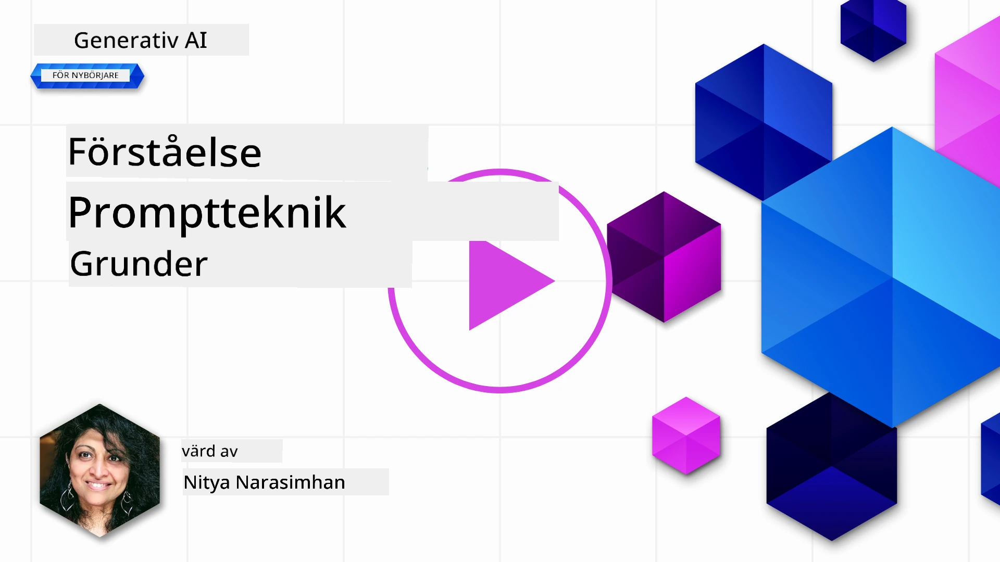
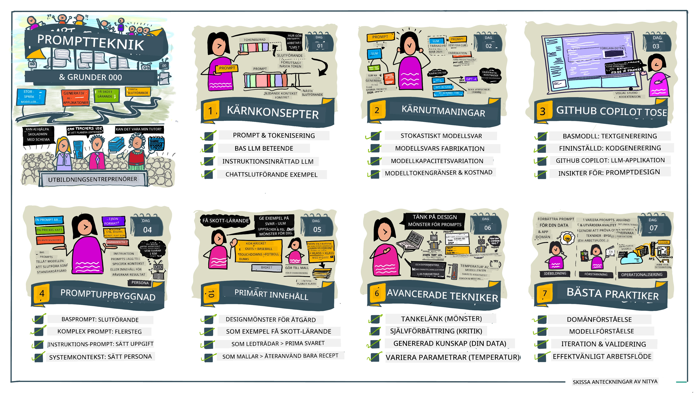
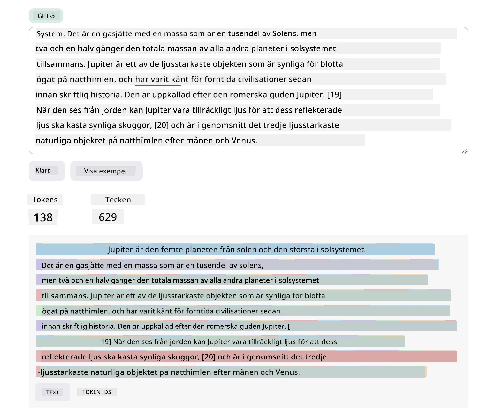
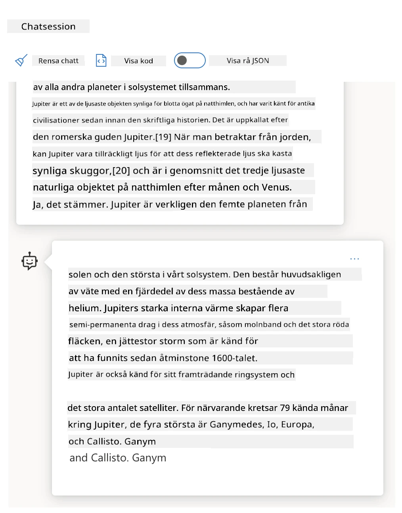
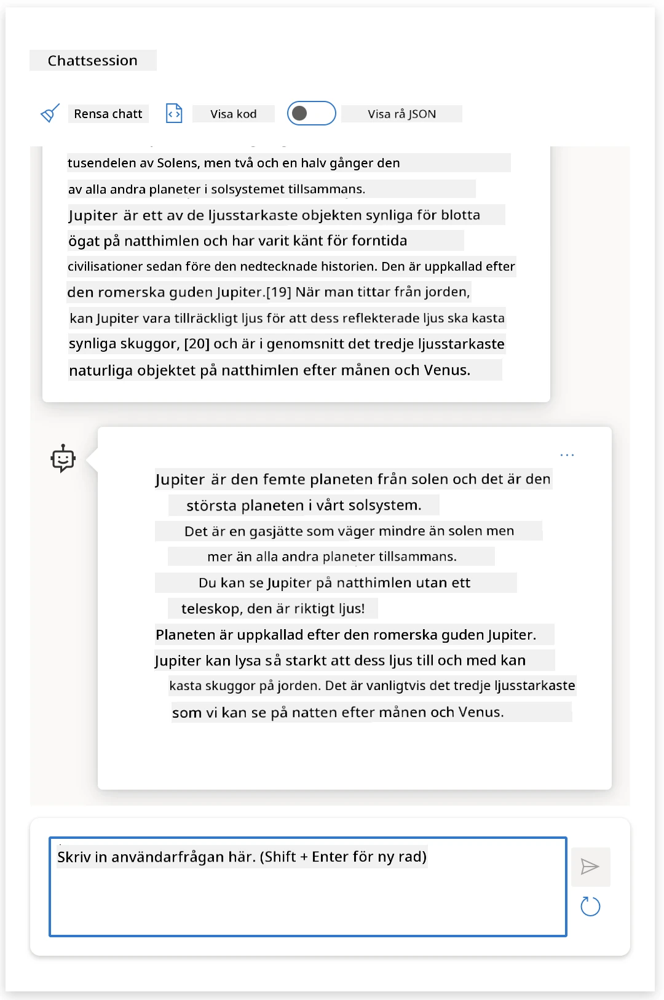
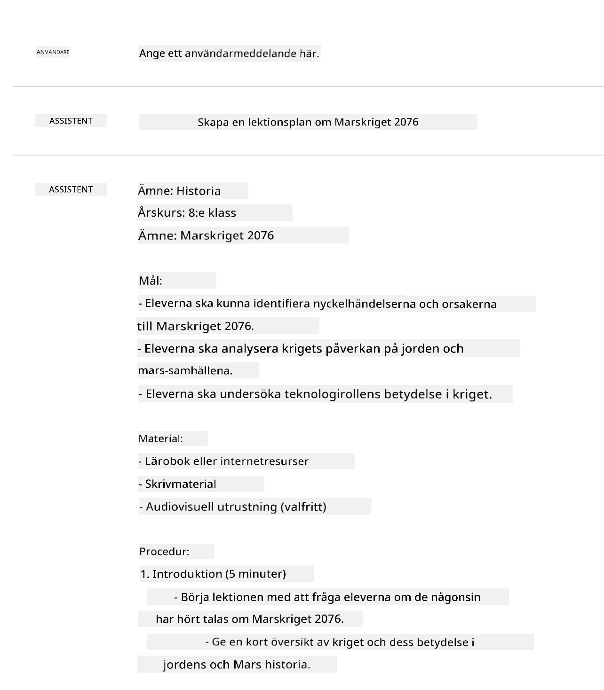
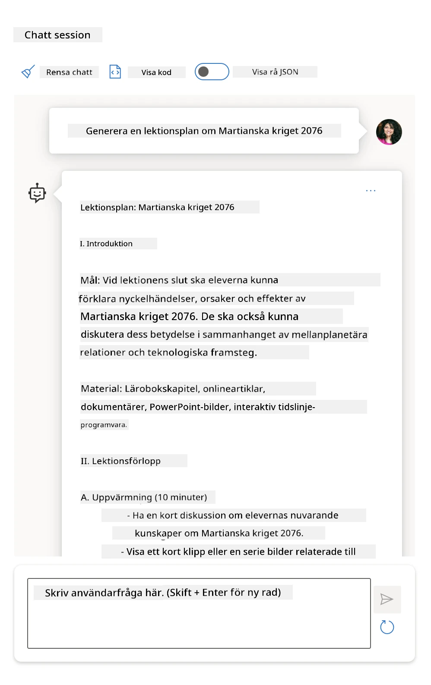
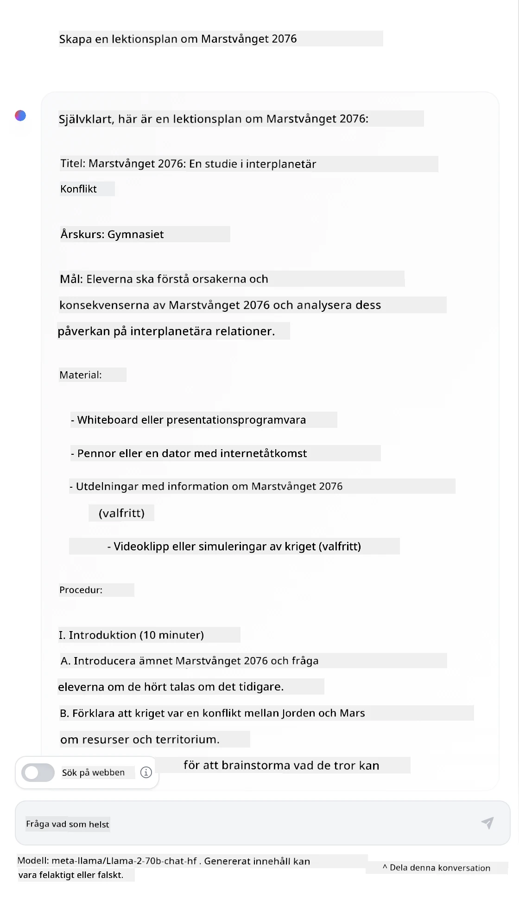

# Grundläggande om Prompt Engineering

[](https://youtu.be/GElCu2kUlRs?si=qrXsBvXnCW12epb8)

## Introduktion
Denna modul täcker viktiga begrepp och tekniker för att skapa effektiva prompts i generativa AI-modeller. Hur du skriver din prompt till en LLM spelar också roll. En noggrant utformad prompt kan uppnå bättre kvalitet på svaret. Men vad innebär egentligen begrepp som _prompt_ och _prompt engineering_? Och hur förbättrar jag prompt-_input_ som jag skickar till LLM? Dessa är frågor vi ska försöka svara på inom detta och nästa kapitel.

_Generativ AI_ kan skapa nytt innehåll (t.ex. text, bilder, ljud, kod etc.) som svar på användarens förfrågningar. Den gör detta med hjälp av _Large Language Models_ som OpenAI:s GPT ("Generative Pre-trained Transformer")-serie som är tränade för att använda naturligt språk och kod.

Användare kan nu interagera med dessa modeller med välkända paradigm som chatt, utan teknisk expertis eller utbildning. Modellerna är _prompt-baserade_ – användare skickar in en textinput (prompt) och får tillbaka AI:s svar (komplettering). De kan sedan "chatta med AI:n" iterativt, i flerstegs-konversationer, och förfina sin prompt tills svaret matchar deras förväntningar.

"Prompter" blir nu det primära _programmeringsgränssnittet_ för generativa AI-appar och talar om för modellerna vad de ska göra samt påverkar kvaliteten på de svar som returneras. "Prompt Engineering" är ett snabbt växande forskningsområde som fokuserar på _design och optimering_ av promtps för att leverera konsekventa och kvalitativa svar i skala.

## Lärandemål

I denna lektion lär vi oss vad Prompt Engineering är, varför det är viktigt och hur vi kan skapa mer effektiva prompts för en viss modell och applikationssyfte. Vi kommer förstå kärnbegrepp och bästa praxis för prompt engineering – och lära oss om en interaktiv Jupyter Notebooks-"sandbox"-miljö där vi kan se dessa begrepp tillämpade med riktiga exempel.

I slutet av lektionen ska vi kunna:

1. Förklara vad prompt engineering är och varför det är viktigt.
2. Beskriva komponenterna i en prompt och hur de används.
3. Lära oss bästa praxis och tekniker för prompt engineering.
4. Tillämpa inlärda tekniker på riktiga exempel, med en OpenAI-endpoint.

## Viktiga Begrepp

Prompt Engineering: Praktiken att designa och förfina input för att leda AI-modeller mot att producera önskade utdata.  
Tokenisering: Processen att omvandla text till mindre enheter, kallade tokens, som en modell kan förstå och bearbeta.  
Instruction-Tuned LLMs: Stora språkmodeller som har finjusterats med specifika instruktioner för att förbättra deras svarens noggrannhet och relevans.

## Lärande Sandbox

Prompt engineering är idag mer en konst än vetenskap. Det bästa sättet att förbättra vår intuition för det är att _övning ger färdighet_ och att anta en trial-and-error-ansats som kombinerar kunskap om domänen med rekommenderade tekniker och modelspecifika optimeringar.

Jupyter Notebook som följer med denna lektion erbjuder en _sandbox_-miljö där du kan prova det du lär dig, antingen under tiden eller som en del av kodutmaningen i slutet. För att kunna utföra övningarna behöver du:

1. **En Azure OpenAI API-nyckel** – tjänstens endpoint för en distribuerad LLM.  
2. **En Python-runtime** – där Notebooks kan köras.  
3. **Lokala miljövariabler** – _slutför [SETUP](./../00-course-setup/02-setup-local.md?WT.mc_id=academic-105485-koreyst) stegen nu för att vara redo_.

Notebooken kommer med _startövningar_ – men du uppmuntras att lägga till egna _Markdown_ (beskrivningar) och _Code_ (prompt-förfrågningar) sektioner för att testa fler exempel eller idéer – och bygga din intuition för promptdesign.

## Illustrerad Guide

Vill du få en helhetsbild över vad denna lektion handlar om innan du dyker in? Kolla in denna illustrerade guide som ger dig en översikt över huvudämnen och nyckelpunkter att tänka på i varje del. Lektionens färdplan leder dig från grundläggande koncept och utmaningar till att hantera dem med relevanta prompt engineering-tekniker och bästa praxis. Observera att avsnittet "Avancerade tekniker" i guiden avser innehåll som tas upp i _nästa_ kapitel i denna kursplan.



## Vårt Startup

Nu ska vi prata om hur _detta ämne_ relaterar till vår startup-mission att [bringa AI-innovation till utbildning](https://educationblog.microsoft.com/2023/06/collaborating-to-bring-ai-innovation-to-education?WT.mc_id=academic-105485-koreyst). Vi vill bygga AI-drivna applikationer för _personanpassat lärande_ – så låt oss fundera på hur olika användare av vår applikation kan "designa" prompts:

- **Administratörer** kan be AI:n att _analysera läroplansdata för att identifiera luckor i täckningen_. AI kan sammanfatta resultaten eller visualisera dem med kod.  
- **Pedagoger** kan be AI:n att _generera en lektionsplan för en målgrupp och ett ämne_. AI kan bygga den personliga planen i ett specificerat format.  
- **Studenter** kan be AI:n att _handleda dem i ett svårt ämne_. AI kan nu guida studenter med lektioner, ledtrådar & exempel anpassade till deras nivå.

Det är bara toppen av isberget. Kolla in [Prompts For Education](https://github.com/microsoft/prompts-for-edu/tree/main?WT.mc_id=academic-105485-koreyst) – ett open-source prompts-bibliotek kuraterat av utbildningsexperter – för att få en bredare bild av möjligheterna! _Testa att köra några av dessa prompts i sandlådan eller i OpenAI Playground för att se vad som händer!_

<!--
LESSON TEMPLATE:
This unit should cover core concept #1.
Reinforce the concept with examples and references.

CONCEPT #1:
Prompt Engineering.
Define it and explain why it is needed.
-->

## Vad är Prompt Engineering?

Vi började denna lektion med att definiera **Prompt Engineering** som processen att _designa och optimera_ textinput (prompter) för att leverera konsekventa och kvalitativa svar (kompletteringar) för ett givet applikationsmål och modell. Vi kan se detta som en tvåstegsprocess:

- _designa_ den initiala prompten för en given modell och mål  
- _förfina_ prompten iterativt för att förbättra svarskvaliteten

Detta är nödvändigtvis en trial-and-error-process som kräver användarintuition och ansträngning för att nå optimala resultat. Men varför är det viktigt? För att svara på den frågan behöver vi först förstå tre begrepp:

- _Tokenisering_ = hur modellen "ser" prompten  
- _Bas-LLMs_ = hur grundmodellen "bearbetar" en prompt  
- _Instruction-Tuned LLMs_ = hur modellen nu kan se "uppgifter"

### Tokenisering

En LLM ser prompts som en _sekvens av tokens_ där olika modeller (eller versioner av samma modell) kan tokenisera samma prompt olika. Eftersom LLM:er tränas på tokens (inte rå text) har sättet prompten tokeniseras en direkt påverkan på kvaliteten på det genererade svaret.

För att få en intuition om hur tokenisering fungerar, prova verktyg som [OpenAI Tokenizer](https://platform.openai.com/tokenizer?WT.mc_id=academic-105485-koreyst) som visas nedan. Kopiera in din prompt – och se hur den konverteras till tokens, med uppmärksamhet på hur blanksteg och skiljetecken behandlas. Observera att exemplet visar en äldre LLM (GPT-3) – så att testa med en nyare modell kan ge ett annat resultat.



### Begrepp: Foundation Models

När en prompt tokeniserats är den primära funktionen för ["Base LLM"](https://blog.gopenai.com/an-introduction-to-base-and-instruction-tuned-large-language-models-8de102c785a6?WT.mc_id=academic-105485-koreyst) (eller grundmodellen) att förutspå nästa token i sekvensen. Eftersom LLMs tränas på enorma textdatamängder har de god förståelse för statistiska samband mellan tokens och kan göra den förutsägelsen med viss säkerhet. Observera att de inte förstår _innebörden_ av orden i prompten eller token; de ser bara ett mönster som de kan "komplettera" med nästa förutsägelse. De kan fortsätta förutsäga sekvensen tills användaren avbryter eller ett förinställt villkor uppfylls.

Vill du se hur prompt-baserad komplettering fungerar? Ange prompten ovan i Azure OpenAI Studio [_Chat Playground_](https://oai.azure.com/playground?WT.mc_id=academic-105485-koreyst) med standardinställningarna. Systemet är konfigurerat för att behandla prompten som informationsförfrågningar – så du bör se en komplettering som stämmer överens med den kontexten.

Men vad händer om användaren vill se något som uppfyller vissa kriterier eller mål? Här kommer _instruction-tunade_ LLMs in i bilden.



### Begrepp: Instruction Tunade LLMs

En [Instruction Tunad LLM](https://blog.gopenai.com/an-introduction-to-base-and-instruction-tuned-large-language-models-8de102c785a6?WT.mc_id=academic-105485-koreyst) bygger på grundmodellen och finjusterar den med exempel eller input/output-par (t.ex. flerstegs-"meddelanden") som kan innehålla tydliga instruktioner – och AI:s svar försöker följa dessa instruktioner.

Detta använder tekniker som Reinforcement Learning with Human Feedback (RLHF) som kan lära modellen att _följa instruktioner_ och _lära av feedback_ så att den producerar svar som är bättre anpassade för praktisk användning och mer relevanta för användarens mål.

Låt oss prova – återgå till prompten ovan, men ändra nu _systemmeddelandet_ för att ge följande instruktion som kontext:

> _Sammanfatta innehållet du får för en andraklassare. Håll resultatet till ett stycke med 3-5 punkter._

Ser du hur svaret nu är anpassat efter det önskade målet och formatet? En pedagog kan direkt använda detta svar i sina presentationer för den klassen.



## Varför behöver vi Prompt Engineering?

Nu när vi vet hur prompts bearbetas av LLMs, låt oss tala om _varför_ vi behöver prompt engineering. Svaret ligger i att dagens LLMs har flera utmaningar som gör att _pålitliga och konsekventa kompletteringar_ blir svårare att uppnå utan att lägga ner ansträngning på promptbyggande och optimering. Till exempel:

1. **Modellernas svar är stokastiska.** Samma prompt kan sannolikt ge olika svar med olika modeller eller modellversioner. Och det kan till och med ge olika resultat med samma modell vid olika tillfällen. _Prompt engineering-tekniker kan hjälpa oss att minska dessa variationer genom att ge bättre styrinstrument_.

2. **Modeller kan hitta på svar.** Modeller är förtränade med _stora men ändliga_ dataset, vilket innebär att de saknar kunskap om begrepp utanför träningsområdet. Därför kan de ge kompletteringar som är felaktiga, påhittade eller direkt motsägelsefulla till kända fakta. _Prompt engineering hjälper användare att identifiera och motverka sådana påhitt, t.ex. genom att be AI:n om referenser eller motivering_.

3. **Modellernas kapacitet varierar.** Nyare modeller eller generationer har rikare förmågor men har också unika egenskaper och avvägningar i kostnad och komplexitet. _Prompt engineering hjälper oss att utveckla bästa praxis och arbetsflöden som abstraherar skillnader och anpassar sig till modelspecifika krav på ett skalbart, sömlöst sätt_.

Låt oss se detta i praktiken i OpenAI eller Azure OpenAI Playground:

- Använd samma prompt med olika LLM-distributioner (t.ex. OpenAI, Azure OpenAI, Hugging Face) – såg du variationerna?  
- Använd samma prompt upprepade gånger med _samma_ LLM-distribution (t.ex. Azure OpenAI Playground) – hur skilde sig dessa variationer?

### Exempel på Påhittade Svar

I denna kurs använder vi termen **"fabrication"** (påhitt) för att referera till fenomenet där LLMs ibland genererar faktamässigt felaktig information på grund av begränsningar i deras träning eller andra faktorer. Du har kanske också hört detta refererat till som _"hallucinationer"_ i populära artiklar eller forskningspapper. Vi rekommenderar starkt att använda _"fabrication"_ som term för att undvika att antropomorfisera beteendet genom att tillskriva en mänsklig egenskap till ett maskindrivet resultat. Detta stärker också [Ansvarsfull AI riktlinjer](https://www.microsoft.com/ai/responsible-ai?WT.mc_id=academic-105485-koreyst) ur ett terminologiperspektiv och tar bort termer som kan uppfattas som stötande eller icke-inkluderande i vissa sammanhang.

Vill du få en känsla för hur fabrications fungerar? Tänk på en prompt som instruerar AI:n att generera innehåll för ett icke-existerande ämne (för att säkerställa att det inte finns med i träningsdata). Till exempel – jag testade denna prompt:

> **Prompt:** generera en lektionsplan om Marskriget 2076.
En webbsökning visade mig att det fanns fiktiva berättelser (t.ex. TV-serier eller böcker) om marskrig - men inga år 2076. Sunt förnuft säger oss också att 2076 är _i framtiden_ och därmed inte kan kopplas till en verklig händelse.

Så vad händer när vi kör denna prompt med olika LLM-leverantörer?

> **Svar 1**: OpenAI Playground (GPT-35)



> **Svar 2**: Azure OpenAI Playground (GPT-35)



> **Svar 3**: : Hugging Face Chat Playground (LLama-2)



Som förväntat ger varje modell (eller modellversion) något olika svar tack vare stokastiskt beteende och variationer i modellkapacitet. Till exempel riktar sig en modell till en publik på årskurs 8 medan den andra antar en gymnasieelev. Men alla tre modeller genererade svar som skulle kunna övertyga en oinformerad användare om att händelsen var verklig.

Prompttekniker som _metaprompting_ och _temperaturkonfiguration_ kan minska modellens fabriceringar till viss del. Nya promptteknik _arkitekturer_ integrerar också sömlöst nya verktyg och tekniker i promptflödet för att mildra eller minska några av dessa effekter.

## Fallstudie: GitHub Copilot

Låt oss avrunda denna sektion genom att få en känsla för hur promptteknik används i verkliga lösningar genom att titta på en Fallstudie: [GitHub Copilot](https://github.com/features/copilot?WT.mc_id=academic-105485-koreyst).

GitHub Copilot är din "AI-parprogrammerare" – den omvandlar textpromptar till kodkompletteringar och är integrerad i din utvecklingsmiljö (t.ex. Visual Studio Code) för en sömlös användarupplevelse. Som dokumenterat i serien av blogginlägg nedan var den tidigaste versionen baserad på OpenAI Codex-modellen – där ingenjörer snabbt insåg behovet av att finjustera modellen och utveckla bättre prompttekniker för att förbättra kodkvaliteten. I juli [lanserade de en förbättrad AI-modell som går bortom Codex](https://github.blog/2023-07-28-smarter-more-efficient-coding-github-copilot-goes-beyond-codex-with-improved-ai-model/?WT.mc_id=academic-105485-koreyst) för ännu snabbare förslag.

Läs inläggen i ordning för att följa deras läranderesa.

- **Maj 2023** | [GitHub Copilot blir bättre på att förstå din kod](https://github.blog/2023-05-17-how-github-copilot-is-getting-better-at-understanding-your-code/?WT.mc_id=academic-105485-koreyst)
- **Maj 2023** | [Inuti GitHub: Arbeta med LLM:erna bakom GitHub Copilot](https://github.blog/2023-05-17-inside-github-working-with-the-llms-behind-github-copilot/?WT.mc_id=academic-105485-koreyst)
- **Jun 2023** | [Hur man skriver bättre promptar för GitHub Copilot](https://github.blog/2023-06-20-how-to-write-better-prompts-for-github-copilot/?WT.mc_id=academic-105485-koreyst)
- **Jul 2023** | [.. GitHub Copilot går bortom Codex med förbättrad AI-modell](https://github.blog/2023-07-28-smarter-more-efficient-coding-github-copilot-goes-beyond-codex-with-improved-ai-model/?WT.mc_id=academic-105485-koreyst)
- **Jul 2023** | [En utvecklares guide till promptteknik och LLM](https://github.blog/2023-07-17-prompt-engineering-guide-generative-ai-llms/?WT.mc_id=academic-105485-koreyst)
- **Sep 2023** | [Hur man bygger en företags-LLM-app: Lärdomar från GitHub Copilot](https://github.blog/2023-09-06-how-to-build-an-enterprise-llm-application-lessons-from-github-copilot/?WT.mc_id=academic-105485-koreyst)

Du kan också bläddra i deras [Engineering-blogg](https://github.blog/category/engineering/?WT.mc_id=academic-105485-koreyst) för fler inlägg som [det här](https://github.blog/2023-09-27-how-i-used-github-copilot-chat-to-build-a-reactjs-gallery-prototype/?WT.mc_id=academic-105485-koreyst) som visar hur dessa modeller och tekniker _tillämpas_ för att driva verkliga applikationer.

---

<!--
LESSON TEMPLATE:
This unit should cover core concept #2.
Reinforce the concept with examples and references.

CONCEPT #2:
Prompt Design.
Illustrated with examples.
-->

## Promptkonstruktion

Vi har sett varför promptteknik är viktigt – nu ska vi förstå hur promptar _konstrueras_ så att vi kan utvärdera olika tekniker för mer effektiv promptdesign.

### Grundläggande prompt

Låt oss börja med den grundläggande prompten: en textinmatning som skickas till modellen utan annan kontext. Här är ett exempel – när vi skickar de första orden i USA:s nationalsång till OpenAI [Completion API](https://platform.openai.com/docs/api-reference/completions?WT.mc_id=academic-105485-koreyst) så _fyller_ den genast i de följande raderna, vilket illustrerar grundläggande förutsägelsebeteende.

| Prompt (Input)     | Completion (Output)                                                                                                                        |
| :----------------- | :----------------------------------------------------------------------------------------------------------------------------------------- |
| Oh say can you see | Det låter som att du börjar med texten till "The Star-Spangled Banner," USA:s nationalsång. Den fullständiga texten är ... |

### Komplex prompt

Nu lägger vi till kontext och instruktioner till den grundläggande prompten. [Chat Completion API](https://learn.microsoft.com/azure/ai-services/openai/how-to/chatgpt?WT.mc_id=academic-105485-koreyst) låter oss konstruera en komplex prompt som en samling _meddelanden_ med:

- In- och utdatapar som speglar _användarens_ input och _assistents_ svar.
- Systemmeddelande som sätter kontext för assistentens beteende eller personlighet.

Begäran är nu i formen nedan där _tokenisering_ effektivt fångar relevant information från kontext och konversation. Att ändra systemkontexten kan vara lika avgörande för kvaliteten på svar som vilka användaringångar som ges.

```python
response = openai.chat.completions.create(
    model="gpt-3.5-turbo",
    messages=[
        {"role": "system", "content": "You are a helpful assistant."},
        {"role": "user", "content": "Who won the world series in 2020?"},
        {"role": "assistant", "content": "The Los Angeles Dodgers won the World Series in 2020."},
        {"role": "user", "content": "Where was it played?"}
    ]
)
```

### Instruktionsprompt

I exemplen ovan var användarprompten en enkel textfråga som kan tolkas som en begäran om information. Med _instruktions_ promptar kan vi använda den texten för att specificera en uppgift mer detaljerat, vilket ger AI bättre vägledning. Här är ett exempel:

| Prompt (Input)                                                                                                                                                                                                                         | Completion (Output)                                                                                                        | Instruktionstyp    |
| :------------------------------------------------------------------------------------------------------------------------------------------------------------------------------------------------------------------------------------- | :------------------------------------------------------------------------------------------------------------------------- | :------------------ |
| Skriv en beskrivning av inbördeskriget                                                                                                                                                                                                   | _returnerade ett enkelt stycke_                                                                                              | Enkel              |
| Skriv en beskrivning av inbördeskriget. Ange viktiga datum och händelser och beskriv deras betydelse                                                                                                                                     | _returnerade ett stycke följt av en lista med viktiga händelsedatum och beskrivningar_                                             | Komplext             |
| Skriv en beskrivning av inbördeskriget i 1 stycke. Ge 3 punkter med viktiga datum och deras betydelse. Ge 3 punkter till med viktiga historiska personer och deras insatser. Returnera resultatet som en JSON-fil | _returnerar mer detaljerad information i en textruta, formaterad som JSON som du kan kopiera och validera efter behov_ | Komplext. Formaterat. |

## Primärt innehåll

I ovanstående exempel var prompten fortfarande ganska öppen, vilket tillät LLM att själv avgöra vilken del av dess förtränade dataset som var relevant. Med designmönstret _primärt innehåll_ delas inmatningstexten upp i två delar:

- en instruktion (åtgärd)
- relevant innehåll (som påverkar åtgärden)

Här är ett exempel där instruktionen är att "sammanfatta detta i 2 meningar".

| Prompt (Input)                                                                                                                                                                                                                                                                                                                                                                                                                                                                                                                                                                                                                                                                                      | Completion (Output)                                                                                                                                                                                                                                                                             |
| :-------------------------------------------------------------------------------------------------------------------------------------------------------------------------------------------------------------------------------------------------------------------------------------------------------------------------------------------------------------------------------------------------------------------------------------------------------------------------------------------------------------------------------------------------------------------------------------------------------------------------------------------------------------------------------------------------- | :---------------------------------------------------------------------------------------------------------------------------------------------------------------------------------------------------------------------------------------------------------------------------------------------- |
| Jupiter är den femte planeten från solen och den största i solsystemet. Det är en gasjätte med en massa som är en tusendel av solens, men två och en halv gång så stor som summan av alla andra planeter i solsystemet tillsammans. Jupiter är ett av de ljusstarkaste objekten synliga för blotta ögat på natthimlen och har varit känt för forntida civilisationer sedan före skriftlig historia. Den är uppkallad efter den romerska guden Jupiter.[19] När man betraktar Jupiter från jorden kan den vara tillräckligt ljusstark för att dess reflekterade ljus ska kasta synliga skuggor,[20] och är i genomsnitt det tredje ljusstarkaste naturliga objektet på natthimlen efter månen och Venus.<br/> **Sammanfatta detta i 2 korta meningar** | Jupiter, den femte planeten från solen, är den största i solsystemet och känd för att vara ett av de ljusstarkaste objekten på natthimlen. Den är uppkallad efter den romerska guden Jupiter och är en gasjätte med en massa som är två och en halv gång så stor som alla andra planeter tillsammans. |

Den primära innehållssektionen kan användas på olika sätt för att driva mer effektiva instruktioner:

- **Exempel** – istället för att tala om för modellen vad den ska göra med en explicit instruktion, ge den exempel på vad den ska göra och låt den dra slutsatsen om mönstret.
- **Ledtrådar** – följ instruktionen med en "ledtråd" som förbereder svaret och vägleder modellen mot mer relevanta svar.
- **Mall** – dessa är upprepningsbara ”recept” för promptar med platshållare (variabler) som kan anpassas med data för specifika användningsfall.

Låt oss utforska dessa i praktiken.

### Använda exempel

Detta är en metod där du använder det primära innehållet för att "mata modellen" med exempel på önskat resultat för en given instruktion, och låter den dra slutsatsen om mönstret för det önskade resultatet. Beroende på antalet exempel kan vi ha zero-shot prompting, one-shot prompting, few-shot prompting osv.

Prompten består nu av tre komponenter:

- En uppgiftsbeskrivning
- Några exempel på önskat resultat
- Början på ett nytt exempel (som blir en implicit uppgiftsbeskrivning)

| Inlärningstyp | Prompt (Input)                                                                                                                                        | Completion (Output)         |
| :------------ | :---------------------------------------------------------------------------------------------------------------------------------------------------- | :-------------------------- |
| Zero-shot     | "The Sun is Shining". Översätt till spanska                                                                                                            | "El Sol está brillando".    |
| One-shot      | "The Sun is Shining" => ""El Sol está brillando". <br> "It's a Cold and Windy Day" =>                                                                 | "Es un día frío y ventoso". |
| Few-shot      | Spelaren sprang baserna => Baseboll <br/> Spelaren gjorde en ace => Tennis <br/> Spelaren slog en sexa => Cricket <br/> Spelaren gjorde en slam-dunk => | Basket                      |
|               |                                                                                                                                                       |                             |

Notera hur vi behövde ge explicit instruktion ("Översätt till spanska") i zero-shot prompting, men att den tolkas implicit i one-shot-exemplet. Few-shot-exemplet visar hur fler exempel möjliggör mer precisa slutsatser utan tilläggsinstruktioner.

### Prompt-ledtrådar

En annan teknik för att använda primärt innehåll är att tillhandahålla _ledtrådar_ i stället för exempel. Här ger vi modellen en puff i rätt riktning genom att _starta den_ med ett stycke som speglar önskat svarsformat. Modellen "tar då ledtråden" att fortsätta i samma stil.

| Antal ledtrådar | Prompt (Input)                                                                                                                                                                                                                                                                                                                                                                                                                                               | Completion (Output)                                                                                                                                                                                                                                                                                       |
| :------------- | :----------------------------------------------------------------------------------------------------------------------------------------------------------------------------------------------------------------------------------------------------------------------------------------------------------------------------------------------------------------------------------------------------------------------------------------------------------- | :-------------------------------------------------------------------------------------------------------------------------------------------------------------------------------------------------------------------------------------------------------------------------------------------------------- |
| 0              | Jupiter är den femte planeten från solen och den största i solsystemet. Det är en gasjätte med en massa som är en tusendel av solens, men två och en halv gång så stor som summan av alla andra planeter i solsystemet tillsammans. Jupiter är ett av de ljusstarkaste objekten synliga för blotta ögat på natthimlen, och har varit känt för forntida civilisationer sedan före skriftlig historia. <br/>**Sammanfatta detta**                                       | Jupiter är den största planeten i vårt solsystem och den femte från solen. Den är en gasjätte med en massa som är 1/1000 av solens, men tyngre än alla andra planeter tillsammans. Forntida civilisationer har känt till Jupiter länge, och den är lätt synlig på natthimlen.. |
| 1              | Jupiter är den femte planeten från solen och den största i solsystemet. Det är en gasjätte med en massa som är en tusendel av solens, men två och en halv gånger så stor som alla andra planeter i solsystemet tillsammans. Jupiter är ett av de ljusstarkaste objekten som är synliga för blotta ögat på natthimlen och har varit känt för forntida civilisationer sedan före den nedtecknade historien. <br/>**Sammanfatta detta** <br/> Vad vi lärt oss är att Jupiter | är den femte planeten från solen och den största i solsystemet. Det är en gasjätte med en massa som är en tusendel av solens, men två och en halv gånger så stor som alla andra planeter tillsammans. Den är lätt synlig för blotta ögat och har varit känd sedan urminnes tider.                       |
| 2              | Jupiter är den femte planeten från solen och den största i solsystemet. Det är en gasjätte med en massa som är en tusendel av solens, men två och en halv gånger så stor som alla andra planeter i solsystemet tillsammans. Jupiter är ett av de ljusstarkaste objekten som är synliga för blotta ögat på natthimlen och har varit känt för forntida civilisationer sedan före den nedtecknade historien. <br/>**Sammanfatta detta** <br/> Topp 3 fakta vi lärt oss:         | 1. Jupiter är den femte planeten från solen och den största i solsystemet. <br/> 2. Det är en gasjätte med en massa som är en tusendel av solens...<br/> 3. Jupiter har varit synlig för blotta ögat sedan urminnes tider ...                                                                       |
|                |                                                                                                                                                                                                                                                                                                                                                                                                                                                              |                                                                                                                                                                                                                                                                                                           |

### Promptmallar

En promptmall är ett _fördefinierat recept för en prompt_ som kan sparas och återanvändas vid behov för att skapa mer konsekventa användarupplevelser i stor skala. I sin enklaste form är det helt enkelt en samling promptexempel som [det här från OpenAI](https://platform.openai.com/examples?WT.mc_id=academic-105485-koreyst) som tillhandahåller både de interaktiva promptkomponenterna (användar- och systemmeddelanden) och API-drivna förfrågningsformat – för att stödja återanvändning.

I en mer komplex form, som [det här exemplet från LangChain](https://python.langchain.com/docs/concepts/prompt_templates/?WT.mc_id=academic-105485-koreyst), innehåller den _platshållare_ som kan ersättas med data från olika källor (användarinmatning, systemkontext, externa datakällor etc.) för att dynamiskt generera en prompt. Detta gör att vi kan skapa ett bibliotek med återanvändbara prompts som kan användas för att driva konsekventa användarupplevelser **programmerbart** i stor skala.

Slutligen ligger det verkliga värdet i mallar i förmågan att skapa och publicera _promptbibliotek_ för vertikala applikationsdomäner – där promptmallen nu är _optimerad_ för att spegla applikationsspecifik kontext eller exempel som gör svaren mer relevanta och träffsäkra för den specifika användargruppen. [Prompts For Edu](https://github.com/microsoft/prompts-for-edu?WT.mc_id=academic-105485-koreyst) är ett utmärkt exempel på detta tillvägagångssätt och sammanställer ett bibliotek med prompts för utbildningsområdet med tonvikt på nyckelmål som lektionsplanering, läroplansdesign, studenthandledning etc.

## Stödjande innehåll

Om vi tänker på promptkonstruktion som att ha en instruktion (uppgift) och ett mål (primärt innehåll), är _sekundärt innehåll_ som ytterligare kontext vi tillhandahåller för att **påverka resultatet på något sätt**. Det kan vara finjusteringsparametrar, formateringsinstruktioner, ämnestaxonomier osv. som hjälper modellen att _anpassa_ sitt svar för att passa önskade användarmål eller förväntningar.

Till exempel: Givet en kurskatalog med omfattande metadata (namn, beskrivning, nivå, metadatataggar, lärare etc.) för alla tillgängliga kurser i läroplanen:

- kan vi definiera en instruktion att "sammanfatta kurskatalogen för hösten 2023"
- vi kan använda det primära innehållet för att ge några exempel på det önskade resultatet
- vi kan använda det sekundära innehållet för att identifiera de 5 viktigaste "taggarna"

Nu kan modellen tillhandahålla en sammanfattning i det format som visas av de få exemplen – men om ett resultat har flera taggar kan den prioritera de 5 taggar som identifieras i det sekundära innehållet.

---

<!--
LEKTIONSMALL:
Denna enhet bör täcka kärnkoncept #1.
Förstärk konceptet med exempel och referenser.

KONCEPT #3:
Prompt Engineering-tekniker.
Vilka är några grundläggande tekniker för prompt engineering?
Illustrera det med några övningar.
-->

## Bästa metoder för prompting

Nu när vi vet hur prompts kan _konstrueras_, kan vi börja tänka på hur vi _designar_ dem för att spegla bästa praxis. Vi kan tänka på detta i två delar – att ha rätt _tankesätt_ och att tillämpa rätt _tekniker_.

### Tankesätt för prompt engineering

Prompt engineering är en process av försök och misstag, så håll tre breda vägledande faktorer i åtanke:

1. **Domänförståelse är viktigt.** Svarens noggrannhet och relevans beror på den _domän_ där applikationen eller användaren verkar. Använd din intuition och domänkunskap för att **anpassa tekniker** ytterligare. Till exempel, definiera _domänspecifika personligheter_ i dina systemprompts, eller använd _domänspecifika mallar_ i dina användarprompts. Ge sekundärt innehåll som speglar domänspecifik kontext, eller använd _domänspecifika signaler och exempel_ för att styra modellen mot välbekanta användningsmönster.

2. **Modellförståelse är viktigt.** Vi vet att modeller är stokastiska till sin natur. Men modellimplementationer kan också variera i fråga om träningsdatasetet de använder (förtränad kunskap), de kapaciteter de tillhandahåller (t.ex. via API eller SDK) och vilken sorts innehåll de är optimerade för (t.ex. kod vs. bilder vs. text). Förstå styrkor och begränsningar hos den modell du använder och använd denna kunskap för att _prioritera uppgifter_ eller bygga _anpassade mallar_ som är optimerade för modellens kapaciteter.

3. **Iteration och validering är viktigt.** Modeller utvecklas snabbt, liksom teknikerna för prompt engineering. Som domänexpert kan du ha annan kontext eller kriterier för _din_ specifika applikation, som kanske inte gäller för den bredare gemenskapen. Använd verktyg och tekniker för prompt engineering för att "kickstarta" promptkonstruktionen, iterera sedan och validera resultaten med hjälp av din egen intuition och domänkunskap. Dokumentera dina insikter och skapa en **kunskapsbas** (t.ex. promptbibliotek) som andra kan använda som ny baslinje för snabbare iterationer i framtiden.

## Bästa metoder

Låt oss nu titta på vanliga rekommenderade bästa metoder från [OpenAI](https://help.openai.com/en/articles/6654000-best-practices-for-prompt-engineering-with-openai-api?WT.mc_id=academic-105485-koreyst) och [Azure OpenAI](https://learn.microsoft.com/azure/ai-services/openai/concepts/prompt-engineering#best-practices?WT.mc_id=academic-105485-koreyst).

| Vad                              | Varför                                                                                                                                                                                                                                               |
| :-------------------------------- | :------------------------------------------------------------------------------------------------------------------------------------------------------------------------------------------------------------------------------------------------ |
| Utvärdera de senaste modellerna. | Nya generationer av modeller har troligtvis förbättrade funktioner och kvalitet – men kan också innebära högre kostnader. Utvärdera deras påverkan och fatta sedan beslut om migration.                                                            |
| Separera instruktioner och kontext | Kontrollera om din modell/leverantör definierar _avgränsare_ för att tydligare skilja instruktioner, primärt och sekundärt innehåll. Detta hjälper modeller att tilldela vikter mer exakt till tokens.                                            |
| Var specifik och tydlig           | Ge fler detaljer om önskad kontext, resultat, längd, format, stil osv. Detta förbättrar både kvalitet och konsekvens i svaren. Fånga recept i återanvändbara mallar.                                                                           |
| Var beskrivande, använd exempel   | Modeller svarar ofta bättre på en ”show and tell”-metod. Börja med en `zero-shot`-approach där du ger instruktion men inga exempel, prova sedan `few-shot` som förfining med några exempel på önskat resultat. Använd analogier.                      |
| Använd signaler för att påbörja generering | Styr modellen mot önskat resultat genom att ge ledande ord eller uttryck som den kan använda som startpunkt för svaret.                                                                                                                |
| Upprepa vid behov                  | Ibland behöver modellen instruktioner upprepas. Ge instruktioner före och efter ditt primära innehåll, använd både instruktion och signal, etc. Iterera och validera för att se vad som fungerar.                                         |
| Ordningen är viktig                | Ordningen du presenterar informationen för modellen kan påverka resultatet, även i inlärningsexempel, på grund av nylighetsbias. Prova olika alternativ för att se vad som funkar bäst.                                                               |
| Ge modellen en "utväg"             | Ge modellen ett _fallback_-svar att använda om den inte kan slutföra uppgiften av någon anledning. Detta kan minska risken för felaktiga eller påhittade svar.                                                                                         |
|                                   |                                                                                                                                                                                                                                                   |

Som med alla bästa metoder, kom ihåg att _din erfarenhet kan variera_ beroende på modell, uppgift och domän. Använd dessa som en utgångspunkt och iterera för att hitta vad som fungerar bäst för dig. Omtolkar ständigt din process för prompt engineering när nya modeller och verktyg blir tillgängliga, med fokus på processens skalbarhet och svarskvalitet.

<!--
LEKTIONSMALL:
Denna enhet bör innehålla en kodutmaning om tillämpligt

UTMANING:
Länk till en Jupyter Notebook med endast kodkommentarer i instruktionerna (kodavsnitt är tomma).

LÖSNING:
Länk till en kopia av den Notebook med ifyllda prompts och körd, som visar ett exempel på utdata.
-->

## Uppgift

Grattis! Du har nått slutet av lektionen! Det är dags att testa några av de koncept och tekniker vi gått igenom med verkliga exempel!

För vår uppgift kommer vi att använda en Jupyter Notebook med övningar du kan utföra interaktivt. Du kan också utöka Notebooken med egna Markdown- och kodceller för att utforska idéer och tekniker på egen hand.

### För att komma igång, förgrena repo:n, och sedan

- (Rekommenderat) Starta GitHub Codespaces
- (Alternativt) Klona repo:n till din lokala enhet och använd den med Docker Desktop
- (Alternativt) Öppna Notebooken i den miljö för Notebooks du föredrar.

### Nästa steg, konfigurera dina miljövariabler

- Kopiera filen `.env.copy` i repo-roten till `.env` och fyll i värdena för `AZURE_OPENAI_API_KEY`, `AZURE_OPENAI_ENDPOINT` och `AZURE_OPENAI_DEPLOYMENT`. Kom tillbaka till avsnittet [Learning Sandbox](../../../04-prompt-engineering-fundamentals) för att lära dig hur.

### Sedan, öppna Jupyter Notebook

- Välj runtime-kärnan. Om du använder alternativ 1 eller 2, välj bara den förvalda Python 3.10.x-kärnan som tillhandahålls av utvecklingscontainern.

Du är redo att köra övningarna. Observera att det här inte finns några _rätta eller felaktiga_ svar – utan att utforska alternativ med försök och misstag och bygga intuition för vad som fungerar för en given modell och applikationsdomän.

_För denna anledning finns det inga Kodlösnings-segment i denna lektion. Istället kommer Notebooken ha Markdown-celler med titeln "Min lösning:" som visar ett exempel på ett utdata för referens._

 <!--
LEKTIONSMALL:
Avsluta avsnittet med en sammanfattning och resurser för självstyrt lärande.
-->

## Kunskapskontroll

Vilket av följande är en bra prompt enligt några rimliga bästa praxis?

1. Visa mig en bild av en röd bil
2. Visa mig en bild av en röd bil av märket Volvo och modellen XC90 parkerad vid en klippa med solnedgång
3. Visa mig en bild av en röd bil av märket Volvo och modellen XC90

Svar: 2, det är den bästa prompten eftersom den ger detaljer om "vad" och går in på specifika detaljer (inte bara vilken bil som helst utan ett specifikt märke och modell) och den beskriver också helhetsmiljön. 3 är näst bäst eftersom den också innehåller mycket beskrivning.

## 🚀 Utmaning

Se om du kan använda "signal"-tekniken med prompten: Fyll i meningen "Visa mig en bild av en röd bil av märket Volvo och ". Vad svarar den med och hur skulle du förbättra det?

## Bra jobbat! Fortsätt ditt lärande

Vill du lära dig mer om olika koncept inom Prompt Engineering? Gå till [sidan för fortsatt lärande](https://aka.ms/genai-collection?WT.mc_id=academic-105485-koreyst) för att hitta andra utmärkta resurser om detta ämne.

Gå vidare till Lektion 5 där vi tittar på [avancerade prompting-tekniker](../05-advanced-prompts/README.md?WT.mc_id=academic-105485-koreyst)!

---

<!-- CO-OP TRANSLATOR DISCLAIMER START -->
**Ansvarsfriskrivning**:
Detta dokument har översatts med hjälp av AI-översättningstjänsten [Co-op Translator](https://github.com/Azure/co-op-translator). Även om vi strävar efter noggrannhet bör du vara medveten om att automatiska översättningar kan innehålla fel eller brister. Det ursprungliga dokumentet på dess originalspråk bör betraktas som den auktoritativa källan. För viktig information rekommenderas professionell mänsklig översättning. Vi ansvarar inte för några missförstånd eller feltolkningar som uppstår vid användning av denna översättning.
<!-- CO-OP TRANSLATOR DISCLAIMER END -->