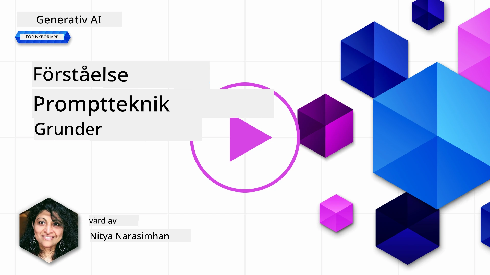
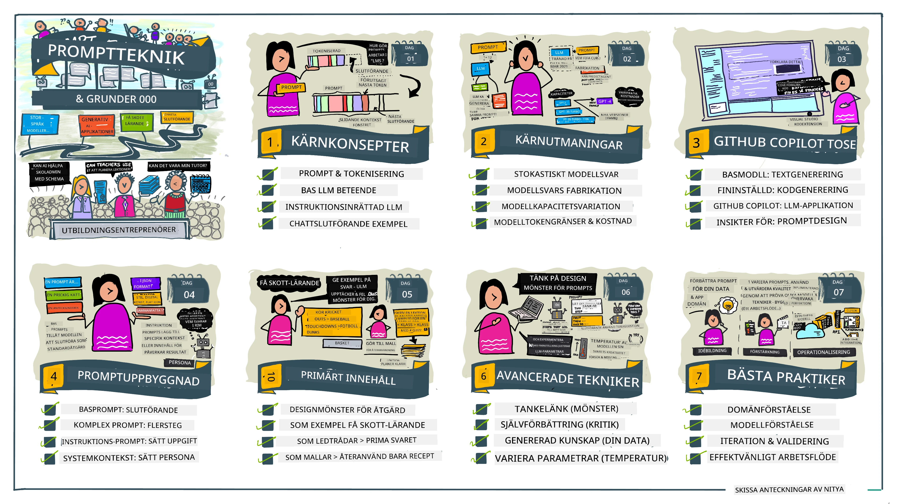
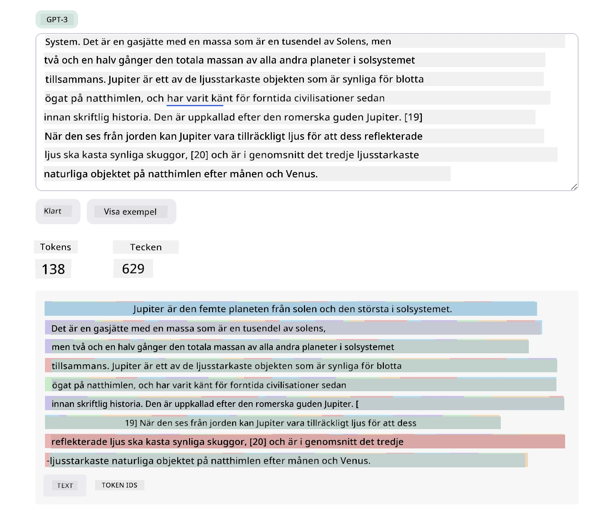
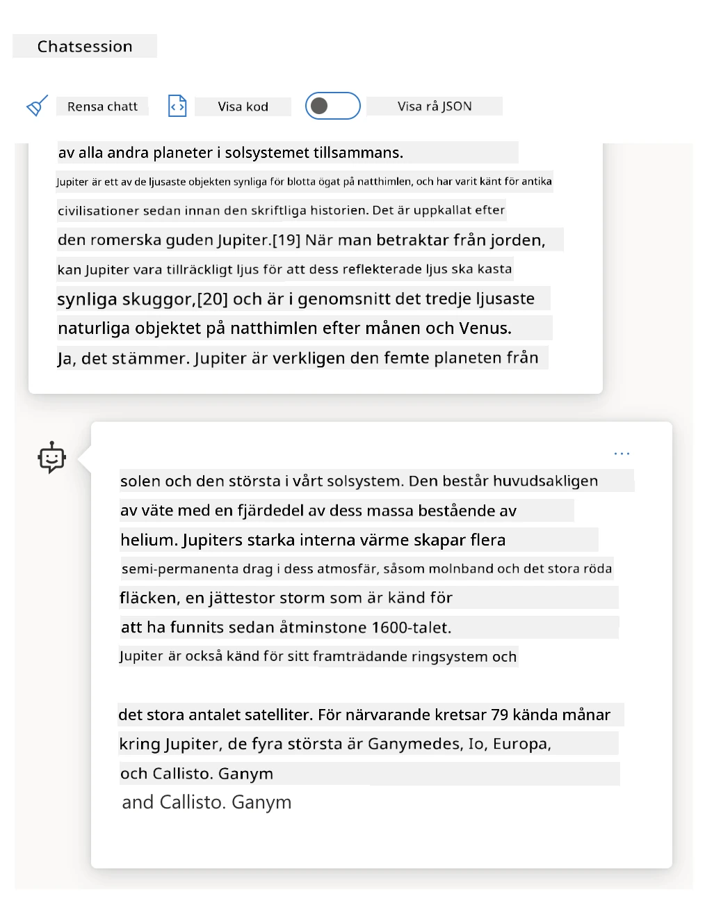
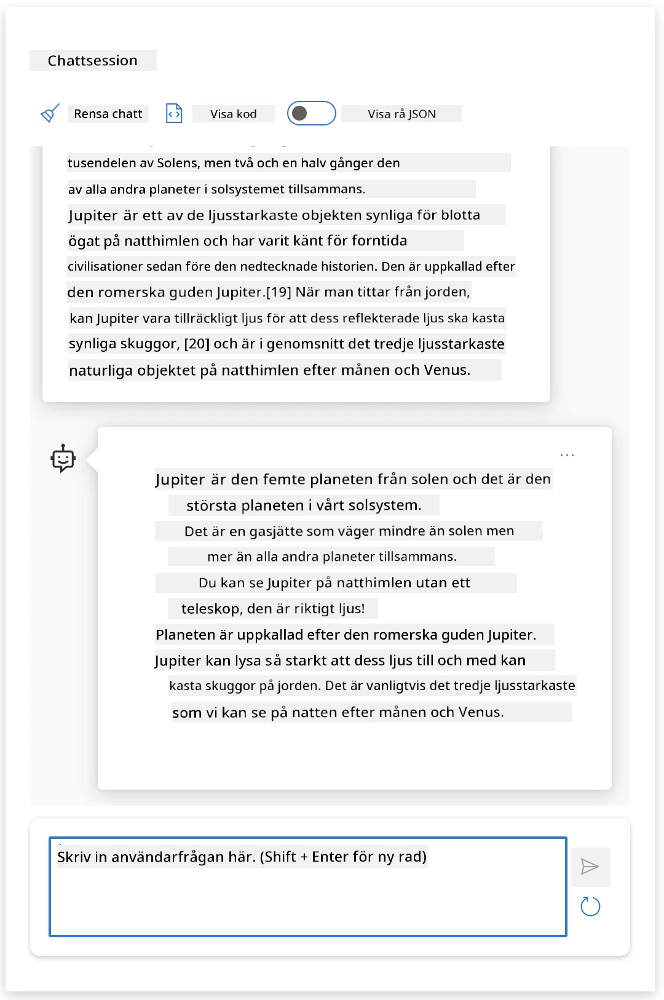
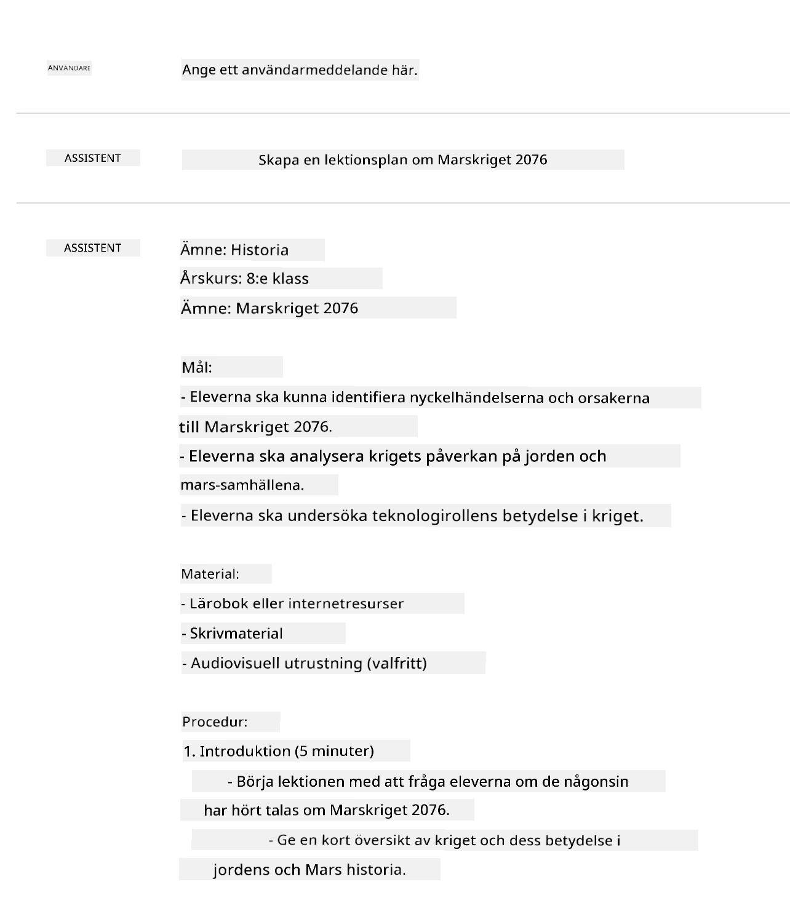
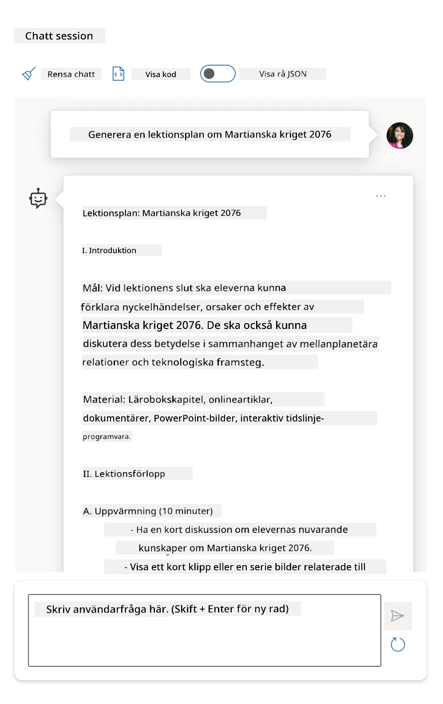
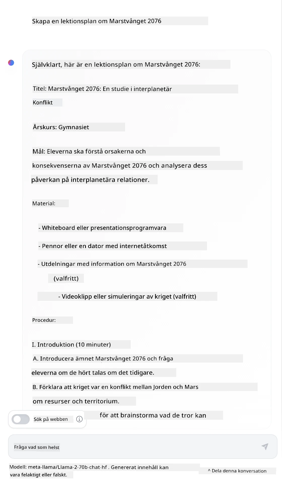

# Grundläggande om Prompt Engineering

[](https://youtu.be/GElCu2kUlRs?si=qrXsBvXnCW12epb8)

## Introduktion
Denna modul täcker viktiga begrepp och tekniker för att skapa effektiva prompts i generativa AI-modeller. Hur du skriver din prompt till en LLM spelar också roll. En noggrant utformad prompt kan ge bättre svarskvalitet. Men vad betyder egentligen begrepp som _prompt_ och _prompt engineering_? Och hur förbättrar jag prompt-_inputen_ som jag skickar till LLM? Detta är frågor vi ska försöka besvara i detta kapitel och nästa.

_Generativ AI_ kan skapa nytt innehåll (t.ex. text, bilder, ljud, kod etc.) som svar på användares förfrågningar. Det gör detta med hjälp av _Large Language Models_ som OpenAIs GPT ("Generative Pre-trained Transformer")-serie som tränats för att använda naturligt språk och kod.

Användare kan nu interagera med dessa modeller med välkända paradigmer som chatt, utan att behöva teknisk expertis eller träning. Modellerna är _prompt-baserade_ - användare skickar in en textinput (prompt) och får tillbaka AI-svaret (completion). De kan sedan "chatta med AI:n" iterativt, i flerrundiga konversationer, och förfina sin prompt tills svaret matchar deras förväntningar.

"Prompter" blir nu det primära _programmeringsgränssnittet_ för generativa AI-appar, som berättar för modellerna vad de ska göra och påverkar kvaliteten på de återkommande svaren. "Prompt Engineering" är ett snabbt växande forskningsfält som fokuserar på _design och optimering_ av prompter för att leverera konsekventa och kvalitativa svar i skala.

## Lärandemål

I denna lektion lär vi oss vad Prompt Engineering är, varför det är viktigt och hur vi kan skapa mer effektiva prompter för en given modell och applikationsmål. Vi kommer att förstå kärnbegrepp och bästa praxis för prompt engineering - och lära oss om en interaktiv Jupyter Notebook-"sandbox"-miljö där vi kan se dessa begrepp applicerade på verkliga exempel.

I slutet av denna lektion kommer vi att kunna:

1. Förklara vad prompt engineering är och varför det är viktigt.
2. Beskriva komponenterna i en prompt och hur de används.
3. Lära oss bästa praxis och tekniker för prompt engineering.
4. Använda lärda tekniker på riktiga exempel, med en OpenAI-endpoint.

## Nyckelbegrepp

Prompt Engineering: Praktiken att designa och förfina inputs för att styra AI-modeller mot önskade utdata.
Tokenisering: Processen att omvandla text till mindre enheter, kallade tokens, som en modell kan förstå och bearbeta.
Instruction-Tuned LLMs: Large Language Models (LLMs) som finjusterats med specifika instruktioner för att förbättra svarens noggrannhet och relevans.

## Lärande Sandbox

Prompt engineering är för närvarande mer konst än vetenskap. Det bästa sättet att förbättra vår intuition för det är att _öva mer_ och anta en trial-and-error-metod som kombinerar kunskap om applikationsdomänen med rekommenderade tekniker och modell-specifika optimeringar.

Jupyter Notebook som följer med denna lektion erbjuder en _sandbox_-miljö där du kan prova det du lär dig - löpande eller som del av kodutmaningen i slutet. För att köra övningarna behöver du:

1. **En Azure OpenAI API-nyckel** - tjänstendpunkten för en distribuerad LLM.
2. **En Python-miljö** - i vilken Notebooken kan köras.
3. **Lokala miljövariabler** - _slutför [SETUP](./../00-course-setup/02-setup-local.md?WT.mc_id=academic-105485-koreyst) stegen nu för att vara redo_.

Notebooken kommer med _start_-övningar - men du uppmuntras att lägga till egna _Markdown_ (beskrivning) och _Code_ (prompt-förfrågningar) sektioner för att prova fler exempel eller idéer - och bygga din intuition för promptdesign.

## Illustrerad guide

Vill du få en översikt över vad denna lektion täcker innan du dyker in? Kolla in denna illustrerade guide, som ger dig en känsla för huvudämnena och viktiga insikter att tänka på i varje del. Lektionens vägkarta tar dig från att förstå kärnbegrepp och utmaningar till att hantera dem med relevanta prompt engineering-tekniker och bästa praxis. Observera att avsnittet "Avancerade tekniker" i denna guide hänvisar till innehåll som tas upp i _nästa_ kapitel i denna kursplan.



## Vårt startup

Nu, låt oss prata om hur _det här ämnet_ relaterar till vårt startup-uppdrag att [ta AI-innovation till utbildning](https://educationblog.microsoft.com/2023/06/collaborating-to-bring-ai-innovation-to-education?WT.mc_id=academic-105485-koreyst). Vi vill bygga AI-drivna applikationer för _personaliserat lärande_ - så låt oss fundera över hur olika användare av vår applikation kan "designa" prompter:

- **Administratörer** kan be AI att _analysera läroplansdata för att identifiera täckningsluckor_. AI kan sammanfatta resultat eller visualisera dem med kod.
- **Pedagoger** kan be AI att _generera en lektionsplan för en målgrupp och ett ämne_. AI kan skapa den personaliserade planen i ett angivet format.
- **Studenter** kan be AI att _handleda dem i ett svårt ämne_. AI kan nu guida studenter med lektioner, ledtrådar & exempel anpassade till deras nivå.

Det är bara toppen av isberget. Kolla in [Prompts For Education](https://github.com/microsoft/prompts-for-edu/tree/main?WT.mc_id=academic-105485-koreyst) - ett open source-bibliotek med prompter sammansatt av utbildningsexperter - för att få en bredare förståelse för möjligheterna! _Försök köra några av dessa prompter i sandboxen eller i OpenAI Playground för att se vad som händer!_

<!--
LEKTIONSMALL:
Denna enhet ska täcka kärnbegrepp #1.
Förstärk begreppet med exempel och referenser.

BEGREPP #1:
Prompt Engineering.
Definiera det och förklara varför det behövs.
-->

## Vad är Prompt Engineering?

Vi började denna lektion med att definiera **Prompt Engineering** som processen att _designa och optimera_ textinputs (prompter) för att leverera konsekventa och kvalitativa svar (completions) för ett givet applikationsmål och modell. Vi kan se detta som en tvåstegsprocess:

- _designa_ den initiala prompten för en given modell och mål
- _förfina_ prompten iterativt för att förbättra svarskvaliteten

Detta är nödvändigtvis en trial-and-error-process som kräver användarens intuition och ansträngning för att uppnå optimala resultat. Så varför är det viktigt? För att svara på den frågan behöver vi först förstå tre begrepp:

- _Tokenisering_ = hur modellen "ser" prompten
- _Bas-LLMs_ = hur grundmodellen "bearbetar" en prompt
- _Instruktionsfinjusterade LLMs_ = hur modellen nu kan se "uppgifter"

### Tokenisering

En LLM ser prompter som en _sekvens av tokens_ där olika modeller (eller versioner av en modell) kan tokenisera samma prompt på olika sätt. Eftersom LLM tränas på tokens (och inte på rå text), påverkar hur prompten tokens delas direkt kvaliteten på det genererade svaret.

För att få en känsla för hur tokenisering fungerar, prova verktyg som [OpenAI Tokenizer](https://platform.openai.com/tokenizer?WT.mc_id=academic-105485-koreyst) som visas nedan. Kopiera in din prompt - och se hur den konverteras till tokens, med uppmärksamhet på hur mellanslagstecken och skiljetecken hanteras. Observera att detta exempel visar en äldre LLM (GPT-3) - så att prova med en nyare modell kan ge ett annat resultat.



### Begrepp: Grundmodeller

När en prompt är tokeniserad är den primära funktionen hos ["Bas-LLM"](https://blog.gopenai.com/an-introduction-to-base-and-instruction-tuned-large-language-models-8de102c785a6?WT.mc_id=academic-105485-koreyst) (eller grundmodell) att förutsäga nästa token i sekvensen. Eftersom LLM tränats på massiva textdatamängder har de en god känsla för statistiska samband mellan tokens och kan göra den förutsägelsen med viss säkerhet. Observera att de inte förstår _innebörden_ av orden i prompten eller tokenen; de ser endast ett mönster de kan "komplettera" med sin nästa förutsägelse. De kan fortsätta förutsäga sekvensen tills avbrutna av användaren eller av förutbestämda villkor.

Vill du se hur prompt-baserad completion fungerar? Ange prompten ovan i [Microsoft Foundry playground](https://ai.azure.com?WT.mc_id=academic-105485-koreyst) med standardinställningar. Systemet är konfigurerat för att behandla prompter som informationsförfrågningar - så du bör få ett svar som uppfyller denna kontext.

Men vad händer om användaren vill ha något specifikt som uppfyller vissa kriterier eller ett uppgiftsmål? Här kommer _instruktionsfinjusterade_ LLM in i bilden.



### Begrepp: Instruktionsfinjusterade LLM

En [Instruktionsfinjusterad LLM](https://blog.gopenai.com/an-introduction-to-base-and-instruction-tuned-large-language-models-8de102c785a6?WT.mc_id=academic-105485-koreyst) börjar med grundmodellen och finjusteras med exempel eller input/output-par (t.ex. flerrundiga "meddelanden") som kan innehålla tydliga instruktioner - och AI:s svar försöker följa den instruktionen.

Detta använder tekniker som förstärkningsinlärning med mänsklig feedback (RLHF) som kan träna modellen att _följa instruktioner_ och _lära sig från feedback_ så att den producerar svar som är bättre anpassade för praktiska användningar och mer relevanta för användarens mål.

Låt oss prova - återvänd till prompten ovan, men ändra nu _systemmeddelandet_ för att ge följande instruktion som kontext:

> _Sammanfatta innehållet du får för en elev i andra klass. Håll resultatet till ett stycke med 3-5 punktlistor._

Ser du hur resultatet nu är finjusterat för att spegla det önskade målet och formatet? En pedagog kan nu använda detta svar direkt i sina slides för den lektionen.



## Varför behöver vi Prompt Engineering?

Nu när vi vet hur prompts bearbetas av LLM, låt oss prata om _varför_ vi behöver prompt engineering. Svaret ligger i att nuvarande LLM har flera utmaningar som gör att _pålitliga och konsekventa svar_ är svårare att uppnå utan ansträngning i promptkonstruktion och optimering. Exempelvis:

1. **Modellsvar är stokastiska.** _Samma prompt_ ger sannolikt olika svar med olika modeller eller versioner av en modell. Och det kan till och med ge olika resultat med _samma modell_ vid olika tillfällen. _Prompt engineering-tekniker hjälper oss minimera dessa variationer genom att tillhandahålla bättre skyddsåtgärder_.

1. **Modeller kan hitta på svar.** Modeller är förtränade med _stora men begränsade_ datasets, vilket innebär att de saknar kunskap om koncept utanför träningsomfånget. Därför kan de producera svar som är inexakta, påhittade eller direkt motsägande kända fakta. _Prompt engineering-tekniker hjälper användare att identifiera och mildra sådana påhitt, t.ex. genom att be AI om källhänvisningar eller resonemang_.

1. **Modellernas kapabiliteter varierar.** Nyare modeller eller modellgenerationer har rikare kapabiliteter men medför också unika särdrag och kompromisser vad gäller kostnad och komplexitet. _Prompt engineering kan hjälpa oss utveckla bästa praxis och arbetsflöden som abstraherar bort skillnader och anpassar sig till modell-specifika krav på skalbara, sömlösa sätt_.

Låt oss se detta i praktiken i OpenAI- eller Azure OpenAI Playground:

- Använd samma prompt med olika LLM-distributioner (t.ex. OpenAI, Azure OpenAI, Hugging Face) - såg du variationerna?
- Använd samma prompt upprepade gånger med _samma_ LLM-distribution (t.ex. Azure OpenAI playground) - hur skiljde sig dessa variationer?

### Exempel på påhittade svar

I denna kurs använder vi termen **"påhitt"** för att referera till fenomenet där LLM ibland genererar faktamässigt felaktig information på grund av begränsningar i deras träning eller andra begränsningar. Du kanske även hört detta kallat _"hallucinationer"_ i populära artiklar eller forskningspapper. Vi rekommenderar starkt att använda _"påhitt"_ som term för att undvika att oavsiktligt antropomorfisera beteendet genom att tillskriva en människolik egenskap till ett maskindrivet resultat. Detta förstärker också [Ansvarsfull AI-riktlinjer](https://www.microsoft.com/ai/responsible-ai?WT.mc_id=academic-105485-koreyst) ur terminologiskt perspektiv, genom att ta bort termer som kan anses stötande eller icke inkluderande i vissa sammanhang.

Vill du få en känsla för hur påhitt fungerar? Tänk på en prompt som instruerar AI att generera innehåll för ett icke-existerande ämne (för att säkerställa att det inte finns i träningsdatasetet). Till exempel - jag testade denna prompt:

> **Prompt:** generera en lektionsplan om den marsianska kriget 2076.

En webbsökning visade att det fanns fiktiva berättelser (t.ex. TV-serier eller böcker) om marsianska krig - men inga från 2076. Sunt förnuft säger också att 2076 är _i framtiden_ och därför inte kan kopplas till en verklig händelse.


Så vad händer när vi kör den här prompten med olika LLM-leverantörer?

> **Svar 1**: OpenAI Playground (GPT-35)



> **Svar 2**: Azure OpenAI Playground (GPT-35)



> **Svar 3**: : Hugging Face Chat Playground (LLama-2)



Som förväntat producerar varje modell (eller modellversion) något olika svar tack vare stokastiskt beteende och variationsskillnader i modellens kapacitet. Till exempel riktar sig en modell till en publik på åttonde klass medan en annan antar att det är en gymnasieelev. Men alla tre modeller genererade svar som kunde övertyga en oinsatt användare att händelsen var verklig.

Tekniker för promptdesign som _metaprompting_ och _temperaturinställning_ kan minska modellfabrikationen till viss del. Nya promptdesign-_arkitekturer_ inkorporerar också nya verktyg och tekniker sömlöst i promptflödet för att mildra eller minska några av dessa effekter.

## Fallstudie: GitHub Copilot

Låt oss avsluta detta avsnitt genom att få en uppfattning om hur promptdesign används i verkliga lösningar genom att titta på en fallstudie: [GitHub Copilot](https://github.com/features/copilot?WT.mc_id=academic-105485-koreyst).

GitHub Copilot är din "AI-parprogrammerare" – den omvandlar textpromptar till kodkompletteringar och är integrerad i din utvecklingsmiljö (t.ex. Visual Studio Code) för en sömlös användarupplevelse. Som dokumenterat i bloggen nedan var den tidigaste versionen baserad på OpenAI Codex-modellen – där ingenjörerna snabbt insåg behovet av att finjustera modellen och utveckla bättre promptdesigntekniker för att förbättra kodkvaliteten. I juli [lanserade de en förbättrad AI-modell som går bortom Codex](https://github.blog/2023-07-28-smarter-more-efficient-coding-github-copilot-goes-beyond-codex-with-improved-ai-model/?WT.mc_id=academic-105485-koreyst) för ännu snabbare förslag.

Läs inläggen i ordning för att följa deras läranderesa.

- **Maj 2023** | [GitHub Copilot blir bättre på att förstå din kod](https://github.blog/2023-05-17-how-github-copilot-is-getting-better-at-understanding-your-code/?WT.mc_id=academic-105485-koreyst)
- **Maj 2023** | [Inifrån GitHub: Att arbeta med LLM:erna bakom GitHub Copilot](https://github.blog/2023-05-17-inside-github-working-with-the-llms-behind-github-copilot/?WT.mc_id=academic-105485-koreyst).
- **Jun 2023** | [Hur man skriver bättre prompts för GitHub Copilot](https://github.blog/2023-06-20-how-to-write-better-prompts-for-github-copilot/?WT.mc_id=academic-105485-koreyst).
- **Jul 2023** | [.. GitHub Copilot går bortom Codex med förbättrad AI-modell](https://github.blog/2023-07-28-smarter-more-efficient-coding-github-copilot-goes-beyond-codex-with-improved-ai-model/?WT.mc_id=academic-105485-koreyst)
- **Jul 2023** | [En utvecklares guide till promptdesign och LLM:er](https://github.blog/2023-07-17-prompt-engineering-guide-generative-ai-llms/?WT.mc_id=academic-105485-koreyst)
- **Sep 2023** | [Hur man bygger en företags-LLM-app: Lärdomar från GitHub Copilot](https://github.blog/2023-09-06-how-to-build-an-enterprise-llm-application-lessons-from-github-copilot/?WT.mc_id=academic-105485-koreyst)

Du kan också bläddra i deras [Engineering blog](https://github.blog/category/engineering/?WT.mc_id=academic-105485-koreyst) för fler inlägg som [det här](https://github.blog/2023-09-27-how-i-used-github-copilot-chat-to-build-a-reactjs-gallery-prototype/?WT.mc_id=academic-105485-koreyst) som visar hur dessa modeller och tekniker _tillämpas_ för att driva verkliga applikationer.

---

<!--
LESSON TEMPLATE:
Denna enhet bör täcka kärnkoncept #2.
Förstärk konceptet med exempel och referenser.

KONCEPT #2:
Promptdesign.
Illustrerat med exempel.
-->

## Promptkonstruktion

Vi har sett varför promptdesign är viktigt – låt oss nu förstå hur prompts _konstrueras_ så att vi kan utvärdera olika tekniker för mer effektiv promptdesign.

### Grundläggande prompt

Vi börjar med den grundläggande prompten: en textinmatning skickad till modellen utan annan kontext. Här är ett exempel – när vi skickar de första orden i USA:s nationalsång till OpenAI:s [Completion API](https://platform.openai.com/docs/api-reference/completions?WT.mc_id=academic-105485-koreyst) fullbordar den genast svaret med de följande raderna, vilket illustrerar det grundläggande förutsägelsebeteendet.

| Prompt (Input)     | Completion (Output)                                                                                                                        |
| :----------------- | :----------------------------------------------------------------------------------------------------------------------------------------- |
| Oh say can you see | Det låter som att du börjar på texten till "The Star-Spangled Banner," USA:s nationalsång. Den fullständiga texten är ...                        |

### Komplex prompt

Nu lägger vi till kontext och instruktioner till den grundläggande prompten. [Chat Completion API](https://learn.microsoft.com/azure/ai-foundry/openai/how-to/chatgpt?WT.mc_id=academic-105485-koreyst) låter oss konstruera en komplex prompt som en samling _meddelanden_ med:

- In- och outputpar som speglar _användarens_ indata och _assistentens_ svar.
- Systemmeddelande som sätter kontext för assistentens beteende eller personlighet.

Begäran är nu i formen nedan, där _tokeniseringen_ effektivt fångar relevant information från kontext och samtal. Nu kan en förändring av systemkontexten vara lika betydande för kvaliteten på completion som de användarindata som ges.

```python
response = client.responses.create(
    model="gpt-5-mini",
    input=[
        {"role": "system", "content": "You are a helpful assistant."},
        {"role": "user", "content": "Who won the world series in 2020?"},
        {"role": "assistant", "content": "The Los Angeles Dodgers won the World Series in 2020."},
        {"role": "user", "content": "Where was it played?"}
    ]
)
```

### Instruktionsprompt

I exemplen ovan var användarprompten en enkel textfråga som kan tolkas som en begäran om information. Med _instruktions_-prompter kan vi använda den texten för att specificera en uppgift mer i detalj, vilket ger AI:n bättre vägledning. Här är ett exempel:

| Prompt (Input)                                                                                                                                                                                                                         | Completion (Output)                                                                                                        | Instruktionstyp    |
| :------------------------------------------------------------------------------------------------------------------------------------------------------------------------------------------------------------------------------------- | :------------------------------------------------------------------------------------------------------------------------- | :----------------- |
| Skriv en beskrivning av det amerikanska inbördeskriget                                                                                                                                                                               | _returnerade ett enkelt stycke_                                                                                           | Enkel             |
| Skriv en beskrivning av det amerikanska inbördeskriget. Ange viktiga datum och händelser och beskriv deras betydelse                                                                                                              | _returnerade ett stycke följt av en lista över viktiga datum och händelsebeskrivningar_                                    | Komplex           |
| Skriv en beskrivning av det amerikanska inbördeskriget i ett stycke. Ge 3 punktlistor med viktiga datum och deras betydelse. Ge 3 ytterligare punktlistor med viktiga historiska personer och deras bidrag. Returnera resultatet som en JSON-fil | _returnerar mer omfattande detaljer i en textruta, formaterat som JSON som du kan kopiera och klistra in i en fil och validera vid behov_ | Komplex. Formaterad. |

## Primärt innehåll

I exemplen ovan var prompten fortfarande ganska öppen, vilket tillåter LLM att avgöra vilken del av dess förtränade dataset som är relevant. Med mönstret _primärt innehåll_ delas inskriftstexten upp i två delar:

- en instruktion (åtgärd)
- relevant innehåll (som påverkar åtgärden)

Här är ett exempel där instruktionen är att "sammanfatta detta i 2 meningar".

| Prompt (Input)                                                                                                                                                                                                                                                                                                                                                                                                                                                                                                                                                                                                                                                                                      | Completion (Output)                                                                                                                                                                                                                                                                             |
| :-------------------------------------------------------------------------------------------------------------------------------------------------------------------------------------------------------------------------------------------------------------------------------------------------------------------------------------------------------------------------------------------------------------------------------------------------------------------------------------------------------------------------------------------------------------------------------------------------------------------------------------------------------------------------------------------------- | :---------------------------------------------------------------------------------------------------------------------------------------------------------------------------------------------------------------------------------------------------------------------------------------------- |
| Jupiter är den femte planeten från solen och den största i solsystemet. Det är en gasjätte med en massa som är en tusendel av solens, men två och en halv gånger den sammanlagda massan av alla andra planeter i solsystemet. Jupiter är ett av de ljusaste objekten synliga för blotta ögat på natthimlen och har varit känt för gamla civilisationer sedan innan skriftlig historia. Den är uppkallad efter den romerska guden Jupiter.[19] När den ses från jorden kan Jupiter vara tillräckligt ljus för att dess reflekterade ljus ska kasta synliga skuggor,[20] och är i genomsnitt det tredje ljusaste naturliga objektet på natthimlen efter månen och Venus. <br/> **Sammanfatta detta i 2 korta meningar** | Jupiter, den femte planeten från solen, är den största i solsystemet och är känd för att vara ett av de ljusaste objekten på natthimlen. Uppkallad efter den romerska guden Jupiter, är det en gasjätte vars massa är två och en halv gånger den hos alla andra planeter i solsystemet tillsammans. |

Segmentet med primärt innehåll kan användas på olika sätt för att driva mer effektiva instruktioner:

- **Exempel** – istället för att berätta för modellen vad den ska göra med en explicit instruktion, ge den exempel på vad den ska göra och låt den dra slutsatsen.
- **Vinkar** – följ instruktionen med en "signal" som förbereder completion och guidar modellen mot mer relevanta svar.
- **Mallar** – dessa är upprepbara 'recept' för prompts med platshållare (variabler) som kan anpassas med data för specifika användningsfall.

Låt oss utforska dessa i praktiken.

### Använda exempel

Detta är en metod där du använder det primära innehållet för att "mata modellen" med ett antal exempel på önskat utdata för en given instruktion, och låter den dra slutsatsen om mönstret för önskat utdata. Baserat på antalet exempel kan vi ha zero-shot prompting, one-shot prompting, few-shot prompting osv.

Prompten består nu av tre komponenter:

- En uppgiftsbeskrivning
- Några exempel på önskat utdata
- Början på ett nytt exempel (vilket blir en implicit uppgiftsbeskrivning)

| Inlärningstyp | Prompt (Input)                                                                                                                                        | Completion (Output)         |
| :------------ | :---------------------------------------------------------------------------------------------------------------------------------------------------- | :-------------------------- |
| Zero-shot     | "The Sun is Shining". Översätt till spanska                                                                                                         | "El Sol está brillando".    |
| One-shot      | "The Sun is Shining" => ""El Sol está brillando". <br> "It's a Cold and Windy Day" =>                                                                 | "Es un día frío y ventoso". |
| Few-shot      | Spelaren sprang baserna => Baseball <br/> Spelaren slog en ess => Tennis <br/> Spelaren slog en sexa => Cricket <br/> Spelaren dunkade =>                | Basketboll                 |
|               |                                                                                                                                                       |                             |

Lägg märke till hur vi var tvungna att ge en explicit instruktion ("Översätt till spanska") i zero-shot prompting, men att den tolkas implicit i one-shot prompting-exemplet. Few-shot-exemplet visar hur fler exempel låter modeller dra mer korrekta slutsatser utan extra instruktioner.

### Promptvinkar

En annan teknik för att använda primärt innehåll är att ge _vinkar_ istället för exempel. I det här fallet ger vi modellen en knuff i rätt riktning genom att _starta den_ med ett utdrag som speglar önskat svarformat. Modellen "tar då signalen" och fortsätter i samma anda.

| Antal vinkar | Prompt (Input)                                                                                                                                                                                                                                                                                                                                                                                                                                               | Completion (Output)                                                                                                                                                                                                                                                                                       |
| :------------- | :----------------------------------------------------------------------------------------------------------------------------------------------------------------------------------------------------------------------------------------------------------------------------------------------------------------------------------------------------------------------------------------------------------------------------------------------------------- | :-------------------------------------------------------------------------------------------------------------------------------------------------------------------------------------------------------------------------------------------------------------------------------------------------------- |
| 0              | Jupiter är den femte planeten från solen och den största i solsystemet. Det är en gasjätte med en massa som är en tusendel av solens, men två och en halv gånger den sammanlagda massan av alla andra planeter i solsystemet. Jupiter är ett av de ljusaste objekten synliga för blotta ögat på natthimlen och har varit känt för gamla civilisationer sedan innan skriftlig historia. <br/>**Sammanfatta detta**                                       | Jupiter är den största planeten i vårt solsystem och den femte från solen. Det är en gasjätte med en massa som är 1/1000-del av solens, men som är tyngre än alla andra planeter tillsammans. Gamla civilisationer har känt till Jupiter länge, och den är lätt synlig på natthimlen. |
| 1              | Jupiter är den femte planeten från solen och den största i solsystemet. Det är en gasjätte med en massa som är en tusendel av solens, men två och en halv gånger den sammanlagda massan av alla andra planeter i solsystemet. Jupiter är ett av de ljusaste objekten synliga för blotta ögat på natthimlen och har varit känt för gamla civilisationer sedan innan skriftlig historia. <br/>**Sammanfatta detta** <br/> Det vi lärde oss är att Jupiter | är den femte planeten från solen och den största i solsystemet. Det är en gasjätte med en massa som är en tusendel av solens, men två och en halv gånger den sammanlagda massan av alla andra planeter tillsammans. Den är lätt synlig för blotta ögat och har varit känd sedan antiken.                       |

| 2              | Jupiter är den femte planeten från solen och den största i solsystemet. Den är en gasjätte med en massa som är en tusendel av solens, men två och en halv gång massan av alla andra planeter i solsystemet tillsammans. Jupiter är ett av de ljusaste objekten synliga för blotta ögat på natthimlen och har varit känt för gamla civilisationer sedan före den skrivna historien. <br/>**Sammanfatta detta** <br/> Topp 3 fakta vi lärde oss:         | 1. Jupiter är den femte planeten från solen och den största i solsystemet. <br/> 2. Den är en gasjätte med en massa som är en tusendel av solen...<br/> 3. Jupiter har varit synlig för blotta ögat sedan forntiden ...                                                                       |
|                |                                                                                                                                                                                                                                                                                                                                                                                                                                                              |                                                                                                                                                                                                                                                                                                           |

### Mallar för promptar

En promptmall är ett _fördefinierat recept för en prompt_ som kan sparas och återanvändas vid behov, för att driva mer konsekventa användarupplevelser i stor skala. I sin enklaste form är det helt enkelt en samling promptexempel som [detta från OpenAI](https://cookbook.openai.com/examples/gpt4-1_prompting_guide?WT.mc_id=academic-105485-koreyst) som tillhandahåller både de interaktiva promptkomponenterna (användar- och systemmeddelanden) och det API-drivna förfrågningsformatet – för att stödja återanvändning.

I dess mer komplexa form som [detta exempel från LangChain](https://python.langchain.com/docs/concepts/prompt_templates/?WT.mc_id=academic-105485-koreyst) innehåller det _platshållare_ som kan ersättas med data från en mängd olika källor (användarinmatning, systemkontext, externa datakällor etc.) för att dynamiskt generera en prompt. Detta gör det möjligt för oss att skapa ett bibliotek av återanvändbara promptar som kan användas för att driva konsekventa användarupplevelser **programmerbart** i stor skala.

Slutligen ligger det verkliga värdet i mallar i möjligheten att skapa och publicera _promptbibliotek_ för vertikala tillämpningsdomäner – där promptmallen nu är _optimerad_ för att spegla applikationsspecifik kontext eller exempel som gör svaren mer relevanta och korrekta för den riktade användargruppen. [Prompts For Edu](https://github.com/microsoft/prompts-for-edu?WT.mc_id=academic-105485-koreyst)-förvaret är ett utmärkt exempel på denna metod, som kuraterar ett bibliotek av promptar för utbildningsområdet med fokus på nyckelmål som lektionsplanering, läroplansdesign, studenthandledning etc.

## Stödjande innehåll

Om vi tänker på promptkonstruktion som att ha en instruktion (uppgift) och ett mål (primärt innehåll), så är _sekundärt innehåll_ som ytterligare kontext vi tillhandahåller för att **påverka resultatet på något sätt**. Det kan vara parameterinställningar, formateringsinstruktioner, ämnestaxonimier etc. som kan hjälpa modellen att _anpassa_ sitt svar så att det passar de önskade användarmålen eller förväntningarna.

Till exempel: Givet en kurskatalog med omfattande metadata (namn, beskrivning, nivå, metadatataggar, instruktör etc.) för alla tillgängliga kurser i läroplanen:

- kan vi definiera en instruktion för att "sammanfatta kurskatalogen för hösten 2023"
- kan vi använda det primära innehållet för att ge några exempel på önskat utdata
- kan vi använda det sekundära innehållet för att identifiera de fem främsta "taggarna" av intresse.

Nu kan modellen ge en sammanfattning i formatet som visas av exemplen – men om ett resultat har flera taggar kan den prioritera de fem taggar som identifieras i det sekundära innehållet.

---

<!--
LEKTIONSMALL:
Denna enhet bör täcka kärnbegrepp #1.
Förstärk begreppet med exempel och referenser.

BEGREPP #3:
Prompt Engineering-tekniker.
Vilka är några grundläggande tekniker för prompt engineering?
Illustrera med några övningar.
-->

## Bästa praxis för promptning

Nu när vi vet hur promptar kan _konstrueras_ kan vi börja tänka på hur vi _designar_ dem för att återspegla bästa praxis. Vi kan tänka på detta i två delar – att ha rätt _inställning_ och att tillämpa rätt _tekniker_.

### Inställning för prompt engineering

Prompt Engineering är en pröva-och-fel-process, så tänk på tre breda vägledande faktorer:

1. **Domänförståelse spelar roll.** Svars noggrannhet och relevans är en funktion av den _domän_ där applikationen eller användaren verkar. Använd din intuition och domänkunskap för att **anpassa teknikerna** ytterligare. Definiera till exempel _domänspecifika personligheter_ i dina systempromptar eller använd _domänspecifika mallar_ i dina användarpromptar. Tillhandahåll sekundärt innehåll som speglar domänspecifika kontexter, eller använd _domänspecifika ledtrådar och exempel_ för att styra modellen mot kända användningsmönster.

2. **Modellförståelse spelar roll.** Vi vet att modeller är stokastiska till sin natur. Men modellimplementationer kan också variera när det gäller träningsdataset de använder (förtränad kunskap), de funktioner de tillhandahåller (t.ex. via API eller SDK) och vilken typ av innehåll de är optimerade för (t.ex. kod vs. bilder vs. text). Förstå styrkor och begränsningar hos den modell du använder och använd den kunskapen för att _prioritera uppgifter_ eller bygga _anpassade mallar_ som är optimerade för modellens kapaciteter.

3. **Iteration och validering spelar roll.** Modeller utvecklas snabbt, och det gör teknikerna för prompt engineering också. Som domänexpert kan du ha annan kontext eller kriterier för _din_ specifika applikation som kanske inte gäller för den bredare gemenskapen. Använd prompt engineering-verktyg och tekniker för att "komma igång" med promptkonstruktionen, iterera sedan och validera resultaten med din egen intuition och domänexpertis. Dokumentera dina insikter och skapa en **kunskapsbas** (t.ex. promptbibliotek) som andra kan använda som ny grundnivå för snabbare iterationer i framtiden.

## Bästa praxis

Nu ska vi titta på vanliga bästa praxis som rekommenderas av [OpenAI](https://help.openai.com/en/articles/6654000-best-practices-for-prompt-engineering-with-openai-api?WT.mc_id=academic-105485-koreyst) och [Azure OpenAI](https://learn.microsoft.com/azure/ai-foundry/openai/concepts/prompt-engineering#best-practices?WT.mc_id=academic-105485-koreyst) experter.

| Vad                              | Varför                                                                                                                                                                                                                                               |
| :-------------------------------- | :------------------------------------------------------------------------------------------------------------------------------------------------------------------------------------------------------------------------------------------------ |
| Utvärdera de senaste modellerna.       | Nya modellgenerationer har sannolikt förbättrade funktioner och kvalitet – men kan också innebära högre kostnader. Utvärdera dem för effekt och fatta sedan beslut om migrering.                                                                        |
| Separera instruktioner & kontext   | Kontrollera om din modell/leverantör definierar _avgränsare_ för att tydligare skilja instruktioner, primärt och sekundärt innehåll. Detta kan hjälpa modeller att tilldela vikter mer exakt till tokens.                                                |
| Var specifik och tydlig             | Ge fler detaljer om önskad kontext, resultat, längd, format, stil etc. Detta förbättrar både kvalitet och konsekvens i svaren. Spara recept i återanvändbara mallar.                                                                                  |
| Var beskrivande, använd exempel    | Modeller kan svara bättre på en "visa och berätta"-metod. Börja med en `zero-shot`-metod där du ger en instruktion (men inga exempel) och prova sedan `few-shot` som en förfining, med några exempel på önskat resultat. Använd analogier.              |
| Använd ledtrådar för att starta svar | Skjutsa modellen mot ett önskat resultat genom att ge några ledande ord eller fraser som den kan använda som utgångspunkt för svaret.                                                                                                               |
| Upprepa                          | Ibland kan du behöva upprepa dig för modellen. Ge instruktioner före och efter ditt primära innehåll, använd en instruktion och en ledtråd, etc. Iterera och validera för att se vad som fungerar.                                                     |
| Ordning spelar roll               | Ordningen du presenterar information för modellen kan påverka utgången, även i inlärningsexemplen, tack vare nyhetseffekten. Prova olika alternativ för att se vad som fungerar bäst.                                                                 |
| Ge modellen en “utväg”            | Ge modellen ett _fallback_-svar som den kan ge om den av någon anledning inte kan slutföra uppgiften. Detta kan minska risken för att modellen genererar falska eller påhittade svar.                                                                   |
|                                   |                                                                                                                                                                                                                                                   |

Som med all bästa praxis, kom ihåg att _din erfarenhet kan variera_ beroende på modell, uppgift och domän. Använd dessa som utgångspunkt och iterera för att hitta vad som fungerar bäst för dig. Utvärdera kontinuerligt din prompt engineering-process när nya modeller och verktyg blir tillgängliga, med fokus på processkalbarhet och svarskvalitet.

<!--
LEKTIONSMALL:
Denna enhet bör erbjuda en kodutmaning om tillämpligt

UTEMANING:
Länk till en Jupyter Notebook med endast kodkommentarer i instruktionerna (kodsektioner är tomma).

LÖSNING:
Länk till en kopia av den Notebook med ifyllda promptar och körd, som visar ett exempel.
-->

## Uppgift

Grattis! Du har kommit till slutet av lektionen! Det är dags att testa några av de koncept och tekniker med verkliga exempel!

För vår uppgift kommer vi att använda en Jupyter Notebook med övningar som du kan göra interaktivt. Du kan också utöka Notebook med egna Markdown- och kodceller för att utforska idéer och tekniker på egen hand.

### För att komma igång, gör en fork av repot, sedan

- (Rekommenderat) Starta GitHub Codespaces
- (Alternativt) Klona repot till din lokala enhet och använd det med Docker Desktop
- (Alternativt) Öppna Notebooken med den runtime-miljö du föredrar.

### Nästa, konfigurera dina miljövariabler

- Kopiera `.env.copy`-filen i repots rot till `.env` och fyll i värdena för `AZURE_OPENAI_API_KEY`, `AZURE_OPENAI_ENDPOINT` och `AZURE_OPENAI_DEPLOYMENT`. Kom tillbaka till [Learning Sandbox-avsnittet](#lärande-sandbox) för att lära dig hur.

### Nästa, öppna Jupyter Notebook

- Välj runtime-kärnan. Om du använder alternativ 1 eller 2, välj helt enkelt den förvalda Python 3.10.x-kärnan som tillhandahålls av utvecklingscontainern.

Du är redo att köra övningarna. Observera att det inte finns några _rätta eller felaktiga_ svar här – bara utforska alternativ genom pröva-och-fel och bygga intuition för vad som fungerar för en given modell och applikationsdomän.

_Av denna anledning finns det inga kodlösningssegment i denna lektion. Istället kommer Notebook att ha Markdown-celler med titeln "Min lösning:" som visar ett exempel på utdata för referens._

 <!--
LEKTIONSMALL:
Avsluta sektionen med en sammanfattning och resurser för självstyrt lärande.
-->

## Kunskapskontroll

Vilken av följande är en bra prompt som följer några rimliga bästa praxis?

1. Visa mig en bild på en röd bil
2. Visa mig en bild på en röd bil av märket Volvo och modell XC90 parkerad vid en klippa med solen som går ner
3. Visa mig en bild på en röd bil av märket Volvo och modell XC90

A: 2, det är den bästa prompten eftersom den ger detaljer om "vad" och går in på specifika detaljer (inte bara vilken bil som helst utan ett specifikt märke och modell) och den beskriver också den övergripande miljön. 3 är näst bäst eftersom den också innehåller mycket beskrivning.

## 🚀 Utmaning

Se om du kan använda "ledtråds"-tekniken med prompten: Färdigställ meningen "Visa mig en bild på en röd bil av märket Volvo och ". Vad svarar den med, och hur skulle du förbättra det?

## Bra jobb! Fortsätt ditt lärande

Vill du lära dig mer om olika koncept inom prompt engineering? Gå till [sidan för fortsatt lärande](https://aka.ms/genai-collection?WT.mc_id=academic-105485-koreyst) för att hitta andra bra resurser om detta ämne.

Gå vidare till Lektion 5 där vi tittar på [avancerade prompttekniker](../05-advanced-prompts/README.md?WT.mc_id=academic-105485-koreyst)!

---

<!-- CO-OP TRANSLATOR DISCLAIMER START -->
**Ansvarsfriskrivning**:
Detta dokument har översatts med hjälp av AI-översättningstjänsten [Co-op Translator](https://github.com/Azure/co-op-translator). Även om vi strävar efter noggrannhet, var vänlig notera att automatiska översättningar kan innehålla fel eller brister. Det ursprungliga dokumentet på dess modersmål bör betraktas som den auktoritativa källan. För kritisk information rekommenderas professionell mänsklig översättning. Vi ansvarar inte för några missförstånd eller feltolkningar som uppstår till följd av användningen av denna översättning.
<!-- CO-OP TRANSLATOR DISCLAIMER END -->