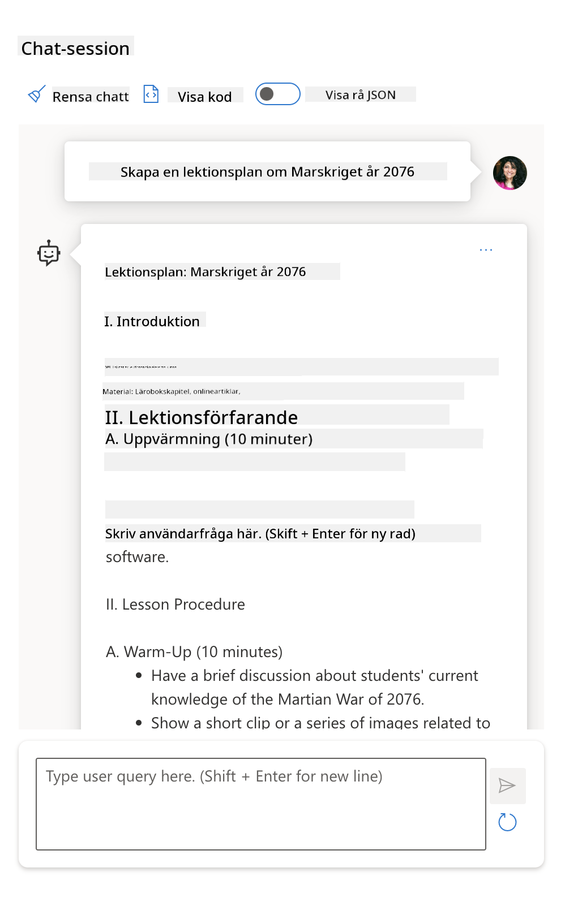

<!--
CO_OP_TRANSLATOR_METADATA:
{
  "original_hash": "0135e6c271f3ece8699050d4debbce88",
  "translation_date": "2025-10-17T19:04:55+00:00",
  "source_file": "04-prompt-engineering-fundamentals/README.md",
  "language_code": "sv"
}
-->
# Grundläggande om Prompt Engineering

[](https://youtu.be/GElCu2kUlRs?si=qrXsBvXnCW12epb8)

## Introduktion
Det här kapitlet täcker viktiga koncept och tekniker för att skapa effektiva prompts i generativa AI-modeller. Hur du skriver din prompt till en LLM spelar också roll. En noggrant utformad prompt kan ge bättre kvalitet på svaret. Men vad betyder egentligen termer som _prompt_ och _prompt engineering_? Och hur kan jag förbättra prompt _input_ som jag skickar till LLM? Det är frågor vi kommer att försöka besvara i detta kapitel och nästa.

_Generativ AI_ kan skapa nytt innehåll (t.ex. text, bilder, ljud, kod etc.) som svar på användarförfrågningar. Den gör detta med hjälp av _Large Language Models_ som OpenAI:s GPT ("Generative Pre-trained Transformer")-serie, som är tränade för att använda naturligt språk och kod.

Användare kan nu interagera med dessa modeller genom välbekanta paradigmer som chatt, utan att behöva teknisk expertis eller utbildning. Modellerna är _prompt-baserade_ - användare skickar en textinput (prompt) och får tillbaka AI:s svar (completion). De kan sedan "chatta med AI" iterativt, i samtal med flera turer, och förfina sin prompt tills svaret matchar deras förväntningar.

"Prompts" blir nu det primära _programmeringsgränssnittet_ för generativa AI-appar, som talar om för modellerna vad de ska göra och påverkar kvaliteten på de svar som returneras. "Prompt Engineering" är ett snabbt växande forskningsområde som fokuserar på _design och optimering_ av prompts för att leverera konsekventa och kvalitativa svar i stor skala.

## Lärandemål

I denna lektion lär vi oss vad Prompt Engineering är, varför det är viktigt och hur vi kan skapa mer effektiva prompts för en given modell och applikationsmål. Vi kommer att förstå kärnkoncept och bästa praxis för prompt engineering - och lära oss om en interaktiv Jupyter Notebooks "sandbox"-miljö där vi kan se dessa koncept tillämpas på verkliga exempel.

I slutet av denna lektion kommer vi att kunna:

1. Förklara vad prompt engineering är och varför det är viktigt.
2. Beskriva komponenterna i en prompt och hur de används.
3. Lära oss bästa praxis och tekniker för prompt engineering.
4. Tillämpa lärda tekniker på verkliga exempel, med hjälp av en OpenAI-endpoint.

## Nyckeltermer

Prompt Engineering: Praktiken att designa och förfina inputs för att styra AI-modeller mot att producera önskade outputs.  
Tokenisering: Processen att konvertera text till mindre enheter, kallade tokens, som en modell kan förstå och bearbeta.  
Instruktionsanpassade LLM: Stora språkmodeller (LLMs) som har finjusterats med specifika instruktioner för att förbättra deras svarsnoggrannhet och relevans.

## Lärande Sandbox

Prompt engineering är för närvarande mer konst än vetenskap. Det bästa sättet att förbättra vår intuition för det är att _öva mer_ och anta en trial-and-error-approach som kombinerar applikationsdomänexpertis med rekommenderade tekniker och modell-specifika optimeringar.

Jupyter Notebook som följer med denna lektion erbjuder en _sandbox_-miljö där du kan testa det du lär dig - under tiden eller som en del av kodutmaningen i slutet. För att köra övningarna behöver du:

1. **En Azure OpenAI API-nyckel** - tjänstens endpoint för en distribuerad LLM.  
2. **En Python Runtime** - där Notebook kan köras.  
3. **Lokala miljövariabler** - _slutför [SETUP](./../00-course-setup/02-setup-local.md?WT.mc_id=academic-105485-koreyst)-stegen nu för att bli redo_.  

Notebooken kommer med _startövningar_ - men du uppmuntras att lägga till egna _Markdown_- (beskrivning) och _Code_- (promptförfrågningar) sektioner för att testa fler exempel eller idéer - och bygga din intuition för promptdesign.

## Illustrerad guide

Vill du få en överblick över vad denna lektion täcker innan du dyker in? Kolla in denna illustrerade guide, som ger dig en känsla för de viktigaste ämnena som behandlas och de viktigaste insikterna att tänka på i varje avsnitt. Lektionens vägkarta tar dig från att förstå kärnkoncept och utmaningar till att hantera dem med relevanta tekniker och bästa praxis för prompt engineering. Observera att avsnittet "Avancerade tekniker" i denna guide hänvisar till innehåll som behandlas i _nästa_ kapitel av denna kursplan.


## Vårt startup

Nu ska vi prata om hur _detta ämne_ relaterar till vårt startup-uppdrag att [föra AI-innovation till utbildning](https://educationblog.microsoft.com/2023/06/collaborating-to-bring-ai-innovation-to-education?WT.mc_id=academic-105485-koreyst). Vi vill bygga AI-drivna applikationer för _personligt lärande_ - så låt oss fundera på hur olika användare av vår applikation kan "designa" prompts:

- **Administratörer** kan be AI att _analysera kursplanedata för att identifiera luckor i täckningen_. AI kan sammanfatta resultaten eller visualisera dem med kod.  
- **Lärare** kan be AI att _skapa en lektionsplan för en målgrupp och ett ämne_. AI kan bygga den personliga planen i ett specificerat format.  
- **Studenter** kan be AI att _lära dem ett svårt ämne_. AI kan nu vägleda studenter med lektioner, tips och exempel anpassade till deras nivå.  

Det är bara toppen av isberget. Kolla in [Prompts For Education](https://github.com/microsoft/prompts-for-edu/tree/main?WT.mc_id=academic-105485-koreyst) - ett öppet bibliotek med prompts som har kuraterats av utbildningsexperter - för att få en bredare känsla av möjligheterna! _Testa att köra några av dessa prompts i sandboxen eller med OpenAI Playground för att se vad som händer!_

<!--
LEKTIONSMALL:
Denna enhet bör täcka kärnkoncept #1.
Stärk konceptet med exempel och referenser.

KONCEPT #1:
Prompt Engineering.
Definiera det och förklara varför det behövs.
-->

## Vad är Prompt Engineering?

Vi började denna lektion med att definiera **Prompt Engineering** som processen att _designa och optimera_ textinputs (prompts) för att leverera konsekventa och kvalitativa svar (completions) för ett givet applikationsmål och modell. Vi kan tänka på detta som en tvåstegsprocess:

- _designa_ den initiala prompten för en given modell och mål  
- _förfina_ prompten iterativt för att förbättra kvaliteten på svaret  

Detta är nödvändigtvis en trial-and-error-process som kräver användarens intuition och ansträngning för att få optimala resultat. Så varför är det viktigt? För att besvara den frågan måste vi först förstå tre koncept:

- _Tokenisering_ = hur modellen "ser" prompten  
- _Bas-LLMs_ = hur grundmodellen "bearbetar" en prompt  
- _Instruktionsanpassade LLMs_ = hur modellen nu kan se "uppgifter"  

### Tokenisering

En LLM ser prompts som en _sekvens av tokens_ där olika modeller (eller versioner av en modell) kan tokenisera samma prompt på olika sätt. Eftersom LLMs är tränade på tokens (och inte på råtext), har sättet som prompts tokeniseras en direkt påverkan på kvaliteten på det genererade svaret.

För att få en intuition för hur tokenisering fungerar, testa verktyg som [OpenAI Tokenizer](https://platform.openai.com/tokenizer?WT.mc_id=academic-105485-koreyst) som visas nedan. Kopiera in din prompt - och se hur den konverteras till tokens, och var uppmärksam på hur blanksteg och skiljetecken hanteras. Observera att detta exempel visar en äldre LLM (GPT-3) - så att testa detta med en nyare modell kan ge ett annat resultat.


### Koncept: Grundmodeller

När en prompt har tokeniserats är den primära funktionen för ["Bas-LLM"](https://blog.gopenai.com/an-introduction-to-base-and-instruction-tuned-large-language-models-8de102c785a6?WT.mc_id=academic-105485-koreyst) (eller grundmodellen) att förutsäga nästa token i den sekvensen. Eftersom LLMs är tränade på massiva textdatamängder har de en god känsla för de statistiska relationerna mellan tokens och kan göra den förutsägelsen med viss säkerhet. Observera att de inte förstår _betydelsen_ av orden i prompten eller token; de ser bara ett mönster som de kan "komplettera" med sin nästa förutsägelse. De kan fortsätta att förutsäga sekvensen tills användaren avbryter eller någon förutbestämd villkor uppfylls.

Vill du se hur prompt-baserad completion fungerar? Ange prompten ovan i Azure OpenAI Studio [_Chat Playground_](https://oai.azure.com/playground?WT.mc_id=academic-105485-koreyst) med standardinställningarna. Systemet är konfigurerat för att behandla prompts som informationsförfrågningar - så du bör se en completion som uppfyller detta sammanhang.

Men vad händer om användaren ville se något specifikt som uppfyller vissa kriterier eller mål? Det är här _instruktionsanpassade_ LLMs kommer in i bilden.


### Koncept: Instruktionsanpassade LLMs

En [Instruktionsanpassad LLM](https://blog.gopenai.com/an-introduction-to-base-and-instruction-tuned-large-language-models-8de102c785a6?WT.mc_id=academic-105485-koreyst) börjar med grundmodellen och finjusterar den med exempel eller input/output-par (t.ex. meddelanden i flera turer) som kan innehålla tydliga instruktioner - och svaret från AI försöker följa den instruktionen.

Detta använder tekniker som förstärkningsinlärning med mänsklig feedback (RLHF) som kan träna modellen att _följa instruktioner_ och _lära sig av feedback_ så att den producerar svar som är bättre anpassade till praktiska tillämpningar och mer relevanta för användarens mål.

Låt oss testa det - gå tillbaka till prompten ovan, men ändra nu _systemmeddelandet_ för att ge följande instruktion som kontext:

> _Sammanfatta innehållet du får för en andra klassens elev. Håll resultatet till ett stycke med 3-5 punkter._

Se hur resultatet nu är anpassat för att återspegla det önskade målet och formatet? En lärare kan nu direkt använda detta svar i sina presentationer för den klassen.


## Varför behöver vi Prompt Engineering?

Nu när vi vet hur prompts bearbetas av LLMs, låt oss prata om _varför_ vi behöver prompt engineering. Svaret ligger i det faktum att nuvarande LLMs har ett antal utmaningar som gör _pålitliga och konsekventa completions_ svårare att uppnå utan att lägga ner ansträngning på promptkonstruktion och optimering. Till exempel:

1. **Modellsvar är stokastiska.** _Samma prompt_ kommer sannolikt att producera olika svar med olika modeller eller modellversioner. Och det kan till och med producera olika resultat med _samma modell_ vid olika tillfällen. _Prompt engineering-tekniker kan hjälpa oss att minimera dessa variationer genom att ge bättre riktlinjer_.  

1. **Modeller kan fabricera svar.** Modeller är förtränade med _stora men begränsade_ datamängder, vilket innebär att de saknar kunskap om koncept utanför det träningsområdet. Som ett resultat kan de producera completions som är felaktiga, påhittade eller direkt motsägande till kända fakta. _Prompt engineering-tekniker hjälper användare att identifiera och mildra sådana fabriceringar, t.ex. genom att be AI om källhänvisningar eller resonemang_.  

1. **Modellers kapacitet varierar.** Nyare modeller eller modellgenerationer kommer att ha rikare kapacitet men också medföra unika egenheter och avvägningar i kostnad och komplexitet. _Prompt engineering kan hjälpa oss att utveckla bästa praxis och arbetsflöden som abstraherar bort skillnader och anpassar sig till modell-specifika krav på skalbara, sömlösa sätt_.  

Låt oss se detta i praktiken i OpenAI eller Azure OpenAI Playground:

- Använd samma prompt med olika LLM-distributioner (t.ex. OpenAI, Azure OpenAI, Hugging Face) - såg du variationerna?  
- Använd samma prompt upprepade gånger med _samma_ LLM-distribution (t.ex. Azure OpenAI Playground) - hur skiljde sig dessa variationer?  

### Exempel på fabriceringar

I denna kurs använder vi termen **"fabricering"** för att hänvisa till fenomenet där LLMs ibland genererar faktuellt felaktig information på grund av begränsningar i deras träning eller andra faktorer. Du kanske också har hört detta refereras till som _"hallucinationer"_ i populära artiklar eller forskningsrapporter. Vi rekommenderar dock starkt att använda termen _"fabricering"_ så att vi inte av misstag antropomorfiserar beteendet genom att tillskriva en mänsklig egenskap till ett maskindrivet resultat. Detta förstärker också [Riktlinjer för ansvarsfull AI](https://www.microsoft.com/ai/responsible-ai?WT.mc_id=academic-105485-koreyst) ur ett terminologiperspektiv, och tar bort termer som kan anses vara stötande eller icke-inkluderande i vissa sammanhang.

Vill du få en känsla för hur fabriceringar fungerar? Tänk på en prompt som instruerar AI att generera innehåll för ett icke-existerande ämne (för att säkerställa att det inte finns i träningsdatamängden). Till exempel - jag testade denna prompt:

> **Prompt:** skapa en lektionsplan om det Marsianska kriget år 2076.
En webbsökning visade att det finns fiktiva berättelser (t.ex. tv-serier eller böcker) om krig på Mars - men inga från år 2076. Sunt förnuft säger också att 2076 är _i framtiden_ och därför inte kan kopplas till en verklig händelse.

Så vad händer när vi kör denna prompt med olika LLM-leverantörer?

> **Svar 1**: OpenAI Playground (GPT-35)


> **Svar 2**: Azure OpenAI Playground (GPT-35)



> **Svar 3**: Hugging Face Chat Playground (LLama-2)


Som förväntat producerar varje modell (eller modellversion) något olika svar tack vare stokastiskt beteende och variationer i modellens kapacitet. Till exempel riktar sig en modell till en åttondeklassare medan en annan antar att användaren är gymnasieelev. Men alla tre modeller genererade svar som skulle kunna övertyga en oinformerad användare om att händelsen var verklig.

Prompttekniker som _metaprompting_ och _temperaturkonfiguration_ kan minska modellens fabriceringar till viss del. Nya arkitekturer för promptdesign integrerar också nya verktyg och tekniker smidigt i promptflödet för att mildra eller minska dessa effekter.

## Fallstudie: GitHub Copilot

Låt oss avsluta denna sektion med att få en känsla för hur promptdesign används i verkliga lösningar genom att titta på en fallstudie: [GitHub Copilot](https://github.com/features/copilot?WT.mc_id=academic-105485-koreyst).

GitHub Copilot är din "AI-parprogrammerare" - den omvandlar textprompter till kodförslag och är integrerad i din utvecklingsmiljö (t.ex. Visual Studio Code) för en smidig användarupplevelse. Som dokumenterat i en serie bloggar nedan, baserades den tidigaste versionen på OpenAI Codex-modellen - med ingenjörer som snabbt insåg behovet av att finjustera modellen och utveckla bättre prompttekniker för att förbättra kodkvaliteten. I juli [lanserade de en förbättrad AI-modell som går bortom Codex](https://github.blog/2023-07-28-smarter-more-efficient-coding-github-copilot-goes-beyond-codex-with-improved-ai-model/?WT.mc_id=academic-105485-koreyst) för ännu snabbare förslag.

Läs inläggen i ordning för att följa deras lärande resa.

- **Maj 2023** | [GitHub Copilot blir bättre på att förstå din kod](https://github.blog/2023-05-17-how-github-copilot-is-getting-better-at-understanding-your-code/?WT.mc_id=academic-105485-koreyst)
- **Maj 2023** | [Inuti GitHub: Arbeta med LLM:erna bakom GitHub Copilot](https://github.blog/2023-05-17-inside-github-working-with-the-llms-behind-github-copilot/?WT.mc_id=academic-105485-koreyst).
- **Jun 2023** | [Hur man skriver bättre prompter för GitHub Copilot](https://github.blog/2023-06-20-how-to-write-better-prompts-for-github-copilot/?WT.mc_id=academic-105485-koreyst).
- **Jul 2023** | [.. GitHub Copilot går bortom Codex med förbättrad AI-modell](https://github.blog/2023-07-28-smarter-more-efficient-coding-github-copilot-goes-beyond-codex-with-improved-ai-model/?WT.mc_id=academic-105485-koreyst)
- **Jul 2023** | [En utvecklares guide till promptdesign och LLM:er](https://github.blog/2023-07-17-prompt-engineering-guide-generative-ai-llms/?WT.mc_id=academic-105485-koreyst)
- **Sep 2023** | [Hur man bygger en företagsapp med LLM:er: Lärdomar från GitHub Copilot](https://github.blog/2023-09-06-how-to-build-an-enterprise-llm-application-lessons-from-github-copilot/?WT.mc_id=academic-105485-koreyst)

Du kan också bläddra i deras [Engineering-blogg](https://github.blog/category/engineering/?WT.mc_id=academic-105485-koreyst) för fler inlägg som [detta](https://github.blog/2023-09-27-how-i-used-github-copilot-chat-to-build-a-reactjs-gallery-prototype/?WT.mc_id=academic-105485-koreyst) som visar hur dessa modeller och tekniker _tillämpas_ för att driva verkliga applikationer.

---

## Konstruktion av prompter

Vi har sett varför promptdesign är viktig - nu ska vi förstå hur prompter _konstrueras_ så att vi kan utvärdera olika tekniker för mer effektiv promptdesign.

### Grundläggande prompt

Låt oss börja med den grundläggande prompten: en textinmatning som skickas till modellen utan någon annan kontext. Här är ett exempel - när vi skickar de första orden i USA:s nationalsång till OpenAI:s [Completion API](https://platform.openai.com/docs/api-reference/completions?WT.mc_id=academic-105485-koreyst) kompletterar den omedelbart svaret med de följande raderna, vilket illustrerar det grundläggande förutsägelsebeteendet.

| Prompt (Input)     | Completion (Output)                                                                                                                        |
| :----------------- | :----------------------------------------------------------------------------------------------------------------------------------------- |
| Oh say can you see | Det verkar som att du börjar med texten till "The Star-Spangled Banner", USA:s nationalsång. Den fullständiga texten är ...                |

### Komplex prompt

Nu ska vi lägga till kontext och instruktioner till den grundläggande prompten. [Chat Completion API](https://learn.microsoft.com/azure/ai-services/openai/how-to/chatgpt?WT.mc_id=academic-105485-koreyst) låter oss konstruera en komplex prompt som en samling _meddelanden_ med:

- Inmatnings-/utmatningspar som reflekterar _användarens_ inmatning och _assistentens_ svar.
- Systemmeddelande som sätter kontexten för assistentens beteende eller personlighet.

Begäran ser nu ut som nedan, där _tokeniseringen_ effektivt fångar relevant information från kontext och konversation. Att ändra systemkontexten kan vara lika avgörande för kvaliteten på svaren som de inmatningar som användaren tillhandahåller.

```python
response = openai.chat.completions.create(
    model="gpt-3.5-turbo",
    messages=[
        {"role": "system", "content": "You are a helpful assistant."},
        {"role": "user", "content": "Who won the world series in 2020?"},
        {"role": "assistant", "content": "The Los Angeles Dodgers won the World Series in 2020."},
        {"role": "user", "content": "Where was it played?"}
    ]
)
```

### Instruktionsprompt

I ovanstående exempel var användarens prompt en enkel textfråga som kan tolkas som en begäran om information. Med _instruktionsprompter_ kan vi använda den texten för att specificera en uppgift mer detaljerat och ge bättre vägledning till AI:n. Här är ett exempel:

| Prompt (Input)                                                                                                                                                                                                                         | Completion (Output)                                                                                                        | Typ av instruktion  |
| :------------------------------------------------------------------------------------------------------------------------------------------------------------------------------------------------------------------------------------- | :------------------------------------------------------------------------------------------------------------------------- | :------------------ |
| Skriv en beskrivning av inbördeskriget                                                                                                                                                                                                 | _returnerade ett enkelt stycke_                                                                                            | Enkel               |
| Skriv en beskrivning av inbördeskriget. Ange viktiga datum och händelser och beskriv deras betydelse                                                                                                                                   | _returnerade ett stycke följt av en lista med viktiga datum och deras betydelse_                                           | Komplex             |
| Skriv en beskrivning av inbördeskriget i ett stycke. Ange 3 punkter med viktiga datum och deras betydelse. Ange 3 ytterligare punkter med viktiga historiska personer och deras bidrag. Returnera svaret som en JSON-fil.               | _returnerade mer omfattande detaljer i en textruta, formaterad som JSON som du kan kopiera och klistra in i en fil_        | Komplex. Formaterad |

## Primärt innehåll

I ovanstående exempel var prompten fortfarande ganska öppen, vilket tillät LLM att avgöra vilken del av dess förtränade dataset som var relevant. Med designmönstret _primärt innehåll_ delas inmatningstexten upp i två delar:

- en instruktion (åtgärd)
- relevant innehåll (som påverkar åtgärden)

Här är ett exempel där instruktionen är att "sammanfatta detta i 2 meningar".

| Prompt (Input)                                                                                                                                                                                                                                                                                                                                                                                                                                                                                                                                                                                                                                                                                      | Completion (Output)                                                                                                                                                                                                                                                                             |
| :-------------------------------------------------------------------------------------------------------------------------------------------------------------------------------------------------------------------------------------------------------------------------------------------------------------------------------------------------------------------------------------------------------------------------------------------------------------------------------------------------------------------------------------------------------------------------------------------------------------------------------------------------------------------------------------------------- | :---------------------------------------------------------------------------------------------------------------------------------------------------------------------------------------------------------------------------------------------------------------------------------------------- |
| Jupiter är den femte planeten från solen och den största i solsystemet. Det är en gasjätte med en massa som är en tusendel av solens, men två och en halv gånger större än alla andra planeter i solsystemet tillsammans. Jupiter är en av de ljusaste objekten som är synliga för blotta ögat på natthimlen och har varit känd för antika civilisationer sedan före den skrivna historien. Den är uppkallad efter den romerska guden Jupiter.[19] När den ses från jorden kan Jupiter vara tillräckligt ljus för att dess reflekterade ljus ska kasta synliga skuggor,[20] och är i genomsnitt det tredje ljusaste naturliga objektet på natthimlen efter månen och Venus. <br/> **Sammanfatta detta i 2 korta meningar** | Jupiter, den femte planeten från solen, är den största i solsystemet och är känd för att vara ett av de ljusaste objekten på natthimlen. Uppkallad efter den romerska guden Jupiter, är det en gasjätte vars massa är två och en halv gånger större än alla andra planeter i solsystemet tillsammans. |

Segmentet med primärt innehåll kan användas på olika sätt för att driva mer effektiva instruktioner:

- **Exempel** - istället för att säga till modellen vad den ska göra med en explicit instruktion, ge den exempel på vad den ska göra och låt den dra slutsatser om mönstret.
- **Ledtrådar** - följ instruktionen med en "ledtråd" som förbereder modellen och guidar den mot mer relevanta svar.
- **Mallar** - dessa är återanvändbara "recept" för prompter med platshållare (variabler) som kan anpassas med data för specifika användningsfall.

Låt oss utforska dessa i praktiken.

### Använda exempel

Detta är en metod där du använder det primära innehållet för att "mata modellen" med några exempel på önskad output för en given instruktion och låter den dra slutsatser om mönstret för den önskade outputen. Beroende på antalet exempel som tillhandahålls kan vi ha zero-shot prompting, one-shot prompting, few-shot prompting etc.

Prompten består nu av tre komponenter:

- En uppgiftsbeskrivning
- Några exempel på önskad output
- Början på ett nytt exempel (som blir en implicit uppgiftsbeskrivning)

| Lärningstyp | Prompt (Input)                                                                                                                                        | Completion (Output)         |
| :---------- | :---------------------------------------------------------------------------------------------------------------------------------------------------- | :-------------------------- |
| Zero-shot   | "Solen skiner". Översätt till spanska                                                                                                                | "El Sol está brillando".    |
| One-shot    | "Solen skiner" => ""El Sol está brillando". <br> "Det är en kall och blåsig dag" =>                                                                   | "Es un día frío y ventoso". |
| Few-shot    | Spelaren sprang runt baserna => Baseball <br/> Spelaren slog en serve => Tennis <br/> Spelaren slog en sexa => Cricket <br/> Spelaren gjorde en slam-dunk => | Basketboll                 |
|             |                                                                                                                                                       |                             |

Observera hur vi var tvungna att ge en explicit instruktion ("Översätt till spanska") i zero-shot prompting, men det blir implicit i one-shot prompting-exemplet. Few-shot-exemplet visar hur fler exempel gör att modeller kan dra mer exakta slutsatser utan ytterligare instruktioner.

### Ledtrådar i prompten

En annan teknik för att använda primärt innehåll är att ge _ledtrådar_ istället för exempel. I detta fall ger vi modellen en knuff i rätt riktning genom att _starta den_ med en snippet som reflekterar det önskade svarformatet. Modellen "tar ledtråden" och fortsätter i samma stil.

| Antal ledtrådar | Prompt (Input)                                                                                                                                                                                                                                                                                                                                                                                                                                               | Completion (Output)                                                                                                                                                                                                                                                                                       |
| :-------------- | :----------------------------------------------------------------------------------------------------------------------------------------------------------------------------------------------------------------------------------------------------------------------------------------------------------------------------------------------------------------------------------------------------------------------------------------------------------- | :-------------------------------------------------------------------------------------------------------------------------------------------------------------------------------------------------------------------------------------------------------------------------------------------------------- |
| 0               | Jupiter är den femte planeten från solen och den största i solsystemet. Det är en gasjätte med en massa som är en tusendel av solens, men två och en halv gånger större än alla andra planeter i solsystemet tillsammans. Jupiter är en av de ljusaste objekten som är synliga för blotta ögat på natthimlen och har varit känd för antika civilisationer sedan före den skrivna historien. <br/>**Sammanfatta Detta**                                       | Jupiter är den största planeten i vårt solsystem och den femte från solen. Det är en gasjätte med en massa som är 1/1000 av solens, men den är tyngre än alla andra planeter tillsammans. Antika civilisationer har känt till Jupiter länge, och den är lätt synlig på natthimlen. |
| 1              | Jupiter är den femte planeten från solen och den största i solsystemet. Det är en gasjätte med en massa som är en tusendel av solens, men två och en halv gånger större än alla andra planeter i solsystemet tillsammans. Jupiter är ett av de ljusstarkaste objekten som är synliga för blotta ögat på natthimlen och har varit känt för antika civilisationer sedan före den skrivna historien. <br/>**Sammanfatta detta** <br/> Det vi lärde oss är att Jupiter | är den femte planeten från solen och den största i solsystemet. Det är en gasjätte med en massa som är en tusendel av solens, men två och en halv gånger större än alla andra planeter tillsammans. Den är lätt synlig för blotta ögat och har varit känd sedan antiken.                        |
| 2              | Jupiter är den femte planeten från solen och den största i solsystemet. Det är en gasjätte med en massa som är en tusendel av solens, men två och en halv gånger större än alla andra planeter i solsystemet tillsammans. Jupiter är ett av de ljusstarkaste objekten som är synliga för blotta ögat på natthimlen och har varit känt för antika civilisationer sedan före den skrivna historien. <br/>**Sammanfatta detta** <br/> Topp 3 fakta vi lärde oss:         | 1. Jupiter är den femte planeten från solen och den största i solsystemet. <br/> 2. Det är en gasjätte med en massa som är en tusendel av solens...<br/> 3. Jupiter har varit synlig för blotta ögat sedan antiken ...                                                                       |
|                |                                                                                                                                                                                                                                                                                                                                                                                                                                                              |                                                                                                                                                                                                                                                                                                           |

### Promptmallar

En promptmall är ett _fördefinierat recept för en prompt_ som kan sparas och återanvändas vid behov för att skapa mer konsekventa användarupplevelser i stor skala. I sin enklaste form är det helt enkelt en samling av exempel på prompts, som [detta från OpenAI](https://platform.openai.com/examples?WT.mc_id=academic-105485-koreyst), som innehåller både interaktiva promptkomponenter (användar- och systemmeddelanden) och API-drivna begärandeformat - för att stödja återanvändning.

I sin mer komplexa form, som [detta exempel från LangChain](https://python.langchain.com/docs/concepts/prompt_templates/?WT.mc_id=academic-105485-koreyst), innehåller den _platshållare_ som kan ersättas med data från olika källor (användarinmatning, systemkontext, externa datakällor etc.) för att dynamiskt generera en prompt. Detta gör det möjligt att skapa ett bibliotek med återanvändbara prompts som kan användas för att driva konsekventa användarupplevelser **programmerbart** i stor skala.

Slutligen ligger det verkliga värdet av mallar i möjligheten att skapa och publicera _promptbibliotek_ för vertikala applikationsdomäner - där promptmallen nu är _optimerad_ för att återspegla applikationsspecifik kontext eller exempel som gör svaren mer relevanta och korrekta för den riktade användargruppen. [Prompts For Edu](https://github.com/microsoft/prompts-for-edu?WT.mc_id=academic-105485-koreyst) är ett utmärkt exempel på detta tillvägagångssätt, där ett bibliotek med prompts för utbildningsdomänen kurateras med fokus på viktiga mål som lektionsplanering, läroplansdesign, handledning av studenter etc.

## Stödjande innehåll

Om vi tänker på promptkonstruktion som att ha en instruktion (uppgift) och ett mål (primärt innehåll), så är _sekundärt innehåll_ som ytterligare kontext vi tillhandahåller för att **påverka resultatet på något sätt**. Det kan vara justeringsparametrar, formateringsinstruktioner, ämnestaxonomier etc. som kan hjälpa modellen att _anpassa_ sitt svar för att passa de önskade användarmålen eller förväntningarna.

Till exempel: Givet en kurskatalog med omfattande metadata (namn, beskrivning, nivå, metadatataggar, instruktör etc.) om alla tillgängliga kurser i läroplanen:

- vi kan definiera en instruktion för att "sammanfatta kurskatalogen för hösten 2023"
- vi kan använda det primära innehållet för att tillhandahålla några exempel på det önskade resultatet
- vi kan använda det sekundära innehållet för att identifiera de 5 främsta "taggarna" av intresse.

Nu kan modellen tillhandahålla en sammanfattning i det format som visas av de få exemplen - men om ett resultat har flera taggar kan den prioritera de 5 taggar som identifierats i det sekundära innehållet.

---

<!--
LEKTIONSMALL:
Denna enhet bör täcka kärnkoncept #1.
Förstärk konceptet med exempel och referenser.

KONCEPT #3:
Tekniker för promptkonstruktion.
Vilka är några grundläggande tekniker för promptkonstruktion?
Illustrera med några övningar.
-->

## Bästa praxis för promptkonstruktion

Nu när vi vet hur prompts kan _konstrueras_ kan vi börja fundera på hur vi ska _designa_ dem för att återspegla bästa praxis. Vi kan tänka på detta i två delar - att ha rätt _inställning_ och att tillämpa rätt _tekniker_.

### Inställning för promptkonstruktion

Promptkonstruktion är en process av försök och misstag, så håll tre breda vägledande faktorer i åtanke:

1. **Domänförståelse är viktigt.** Svarens noggrannhet och relevans är en funktion av _domänen_ där applikationen eller användaren verkar. Använd din intuition och domänexpertis för att **anpassa tekniker** ytterligare. Definiera till exempel _domänspecifika personligheter_ i dina systemprompts, eller använd _domänspecifika mallar_ i dina användarprompts. Tillhandahåll sekundärt innehåll som återspeglar domänspecifika kontexter, eller använd _domänspecifika ledtrådar och exempel_ för att vägleda modellen mot bekanta användningsmönster.

2. **Modellförståelse är viktigt.** Vi vet att modeller är stokastiska till sin natur. Men modellimplementeringar kan också variera när det gäller träningsdatasetet de använder (förtränad kunskap), de funktioner de tillhandahåller (t.ex. via API eller SDK) och typen av innehåll de är optimerade för (t.ex. kod vs. bilder vs. text). Förstå styrkorna och begränsningarna hos den modell du använder och använd den kunskapen för att _prioritera uppgifter_ eller bygga _anpassade mallar_ som är optimerade för modellens kapabiliteter.

3. **Iteration och validering är viktigt.** Modeller utvecklas snabbt, och det gör även teknikerna för promptkonstruktion. Som domänexpert kan du ha annan kontext eller kriterier för _din_ specifika applikation, som kanske inte gäller för den bredare gemenskapen. Använd verktyg och tekniker för promptkonstruktion för att "starta upp" promptkonstruktionen, iterera och validera resultaten med hjälp av din egen intuition och domänexpertis. Dokumentera dina insikter och skapa en **kunskapsbas** (t.ex. promptbibliotek) som kan användas som en ny baslinje av andra för snabbare iterationer i framtiden.

## Bästa praxis

Låt oss nu titta på vanliga bästa praxis som rekommenderas av [OpenAI](https://help.openai.com/en/articles/6654000-best-practices-for-prompt-engineering-with-openai-api?WT.mc_id=academic-105485-koreyst) och [Azure OpenAI](https://learn.microsoft.com/azure/ai-services/openai/concepts/prompt-engineering#best-practices?WT.mc_id=academic-105485-koreyst)-praktiker.

| Vad                               | Varför                                                                                                                                                                                                                                               |
| :-------------------------------- | :------------------------------------------------------------------------------------------------------------------------------------------------------------------------------------------------------------------------------------------------ |
| Utvärdera de senaste modellerna.  | Nya modellgenerationer har sannolikt förbättrade funktioner och kvalitet - men kan också medföra högre kostnader. Utvärdera dem för påverkan och fatta sedan migrationsbeslut.                                                                      |
| Separera instruktioner och kontext| Kontrollera om din modell/leverantör definierar _avgränsare_ för att tydligare skilja instruktioner, primärt och sekundärt innehåll. Detta kan hjälpa modeller att tilldela vikter mer exakt till tokens.                                          |
| Var specifik och tydlig           | Ge fler detaljer om önskad kontext, resultat, längd, format, stil etc. Detta kommer att förbättra både kvaliteten och konsistensen i svaren. Fånga recept i återanvändbara mallar.                                                                  |
| Var beskrivande, använd exempel   | Modeller kan svara bättre på en "visa och berätta"-metod. Börja med en `zero-shot`-metod där du ger en instruktion (men inga exempel) och prova sedan `few-shot` som en förfining, genom att ge några exempel på det önskade resultatet. Använd analogier. |
| Använd ledtrådar för att starta svar| Ge en knuff mot ett önskat resultat genom att ge några inledande ord eller fraser som den kan använda som startpunkt för svaret.                                                                                                               |
| Upprepa                           | Ibland kan du behöva upprepa dig för modellen. Ge instruktioner före och efter ditt primära innehåll, använd en instruktion och en ledtråd etc. Iterera och validera för att se vad som fungerar.                                                  |
| Ordning spelar roll               | Ordningen i vilken du presenterar information för modellen kan påverka resultatet, även i lärandeexemplen, tack vare recency bias. Prova olika alternativ för att se vad som fungerar bäst.                                                        |
| Ge modellen en "utväg"            | Ge modellen ett _fallback_-svar som den kan ge om den inte kan slutföra uppgiften av någon anledning. Detta kan minska risken för att modeller genererar falska eller fabricerade svar.                                                          |
|                                   |                                                                                                                                                                                                                                                   |

Som med alla bästa praxis, kom ihåg att _din erfarenhet kan variera_ beroende på modell, uppgift och domän. Använd dessa som en utgångspunkt och iterera för att hitta vad som fungerar bäst för dig. Utvärdera ständigt din process för promptkonstruktion när nya modeller och verktyg blir tillgängliga, med fokus på processens skalbarhet och svarens kvalitet.

<!--
LEKTIONSMALL:
Denna enhet bör tillhandahålla en kodutmaning om tillämpligt

UTMANING:
Länka till en Jupyter Notebook med endast kodkommentarer i instruktionerna (kodsektionerna är tomma).

LÖSNING:
Länka till en kopia av den Notebook med ifyllda och körda prompts, som visar hur ett exempel kan se ut.
-->

## Uppgift

Grattis! Du har nått slutet av lektionen! Det är dags att testa några av dessa koncept och tekniker med riktiga exempel!

För vår uppgift kommer vi att använda en Jupyter Notebook med övningar som du kan slutföra interaktivt. Du kan också utöka Notebook med dina egna Markdown- och kodceller för att utforska idéer och tekniker på egen hand.

### För att komma igång, fork:a repot, sedan

- (Rekommenderat) Starta GitHub Codespaces
- (Alternativt) Klona repot till din lokala enhet och använd det med Docker Desktop
- (Alternativt) Öppna Notebook med din föredragna Notebook-runtime-miljö.

### Nästa, konfigurera dina miljövariabler

- Kopiera `.env.copy`-filen i repo-roten till `.env` och fyll i värdena för `AZURE_OPENAI_API_KEY`, `AZURE_OPENAI_ENDPOINT` och `AZURE_OPENAI_DEPLOYMENT`. Gå tillbaka till [Learning Sandbox-sektionen](../../../04-prompt-engineering-fundamentals/04-prompt-engineering-fundamentals) för att lära dig hur.

### Nästa, öppna Jupyter Notebook

- Välj runtime-kärnan. Om du använder alternativ 1 eller 2, välj helt enkelt standardkärnan Python 3.10.x som tillhandahålls av utvecklingscontainern.

Nu är du redo att köra övningarna. Observera att det inte finns några _rätt och fel_ svar här - det handlar bara om att utforska alternativ genom försök och misstag och bygga intuition för vad som fungerar för en given modell och applikationsdomän.

_Därför finns det inga kodlösningssegment i denna lektion. Istället kommer Notebook att ha Markdown-celler med titeln "Min lösning:" som visar ett exempel på resultat för referens._

 <!--
LEKTIONSMALL:
Avsluta avsnittet med en sammanfattning och resurser för självstyrt lärande.
-->

## Kunskapskontroll

Vilket av följande är en bra prompt som följer några rimliga bästa praxis?

1. Visa mig en bild på en röd bil
2. Visa mig en bild på en röd bil av märket Volvo och modell XC90 parkerad vid en klippa med solnedgång
3. Visa mig en bild på en röd bil av märket Volvo och modell XC90

A: 2, det är den bästa prompten eftersom den ger detaljer om "vad" och går in på specifika detaljer (inte bara vilken bil som helst utan en specifik modell och märke) och beskriver också den övergripande miljön. 3 är näst bäst eftersom den också innehåller mycket beskrivning.

## 🚀 Utmaning

Se om du kan använda "ledtrådstekniken" med prompten: Slutför meningen "Visa mig en bild på en röd bil av märket Volvo och ". Vad svarar den med, och hur skulle du förbättra det?

## Bra jobbat! Fortsätt ditt lärande

Vill du lära dig mer om olika koncept inom promptkonstruktion? Gå till [sidan för fortsatt lärande](https://aka.ms/genai-collection?WT.mc_id=academic-105485-koreyst) för att hitta andra bra resurser om detta ämne.

Gå vidare till Lektion 5 där vi kommer att titta på [avancerade tekniker för promptkonstruktion](../05-advanced-prompts/README.md?WT.mc_id=academic-105485-koreyst)!

---

**Ansvarsfriskrivning**:  
Detta dokument har översatts med hjälp av AI-översättningstjänsten [Co-op Translator](https://github.com/Azure/co-op-translator). Även om vi strävar efter noggrannhet, bör det noteras att automatiserade översättningar kan innehålla fel eller felaktigheter. Det ursprungliga dokumentet på dess ursprungliga språk bör betraktas som den auktoritativa källan. För kritisk information rekommenderas professionell mänsklig översättning. Vi ansvarar inte för eventuella missförstånd eller feltolkningar som uppstår vid användning av denna översättning.