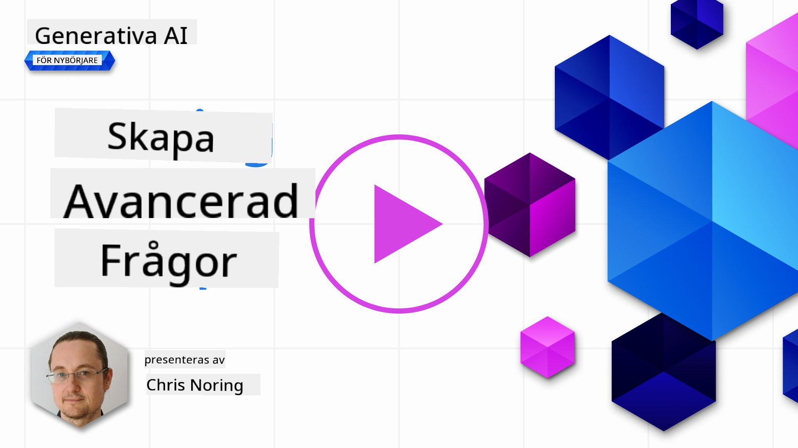

<!--
CO_OP_TRANSLATOR_METADATA:
{
  "original_hash": "b2651fb16bcfbc62b8e518751ed90fdb",
  "translation_date": "2025-10-17T18:57:35+00:00",
  "source_file": "05-advanced-prompts/README.md",
  "language_code": "sv"
}
-->
# Skapa avancerade prompts

[](https://youtu.be/BAjzkaCdRok?si=NmUIyRf7-cDgbjtt)

Låt oss sammanfatta några lärdomar från föregående kapitel:

> Prompt _engineering_ är processen där vi **vägleder modellen mot mer relevanta svar** genom att ge mer användbara instruktioner eller kontext.

Det finns också två steg för att skriva prompts: att konstruera prompten genom att ge relevant kontext, och _optimering_, hur man gradvis förbättrar prompten.

Vid det här laget har vi en grundläggande förståelse för hur man skriver prompts, men vi behöver gå djupare. I detta kapitel kommer du att gå från att prova olika prompts till att förstå varför en prompt är bättre än en annan. Du kommer att lära dig att konstruera prompts enligt några grundläggande tekniker som kan tillämpas på vilken LLM som helst.

## Introduktion

I detta kapitel kommer vi att täcka följande ämnen:

- Utöka din kunskap om prompt engineering genom att tillämpa olika tekniker på dina prompts.
- Konfigurera dina prompts för att variera utdata.

## Lärandemål

Efter att ha avslutat denna lektion kommer du att kunna:

- Tillämpa tekniker för prompt engineering som förbättrar resultatet av dina prompts.
- Utföra prompting som antingen är varierad eller deterministisk.

## Prompt engineering

Prompt engineering är processen att skapa prompts som ger önskat resultat. Det handlar om mer än att bara skriva en textprompt. Prompt engineering är inte en ingenjörsdisciplin, det är snarare en uppsättning tekniker som du kan använda för att få det resultat du vill ha.

### Ett exempel på en prompt

Låt oss ta en enkel prompt som denna:

> Generera 10 frågor om geografi.

I denna prompt tillämpar du faktiskt en uppsättning olika prompttekniker.

Låt oss bryta ner detta.

- **Kontext**, du specificerar att det ska handla om "geografi".
- **Begränsa utdata**, du vill ha högst 10 frågor.

### Begränsningar med enkla prompts

Du kanske eller kanske inte får det önskade resultatet. Du kommer att få dina frågor genererade, men geografi är ett stort ämne och du kanske inte får det du vill på grund av följande skäl:

- **Stort ämne**, du vet inte om det kommer att handla om länder, huvudstäder, floder och så vidare.
- **Format**, vad händer om du ville att frågorna skulle vara formaterade på ett visst sätt?

Som du kan se finns det mycket att tänka på när man skapar prompts.

Hittills har vi sett ett enkelt exempel på en prompt, men generativ AI är kapabel till mycket mer för att hjälpa människor i olika roller och branscher. Låt oss utforska några grundläggande tekniker härnäst.

### Tekniker för prompting

Först måste vi förstå att prompting är en _emergent_ egenskap hos en LLM, vilket innebär att detta inte är en funktion som är inbyggd i modellen utan snarare något vi upptäcker när vi använder modellen.

Det finns några grundläggande tekniker som vi kan använda för att prompta en LLM. Låt oss utforska dem.

- **Zero-shot prompting**, detta är den mest grundläggande formen av prompting. Det är en enkel prompt som begär ett svar från LLM baserat enbart på dess träningsdata.
- **Few-shot prompting**, denna typ av prompting vägleder LLM genom att ge 1 eller flera exempel som den kan förlita sig på för att generera sitt svar.
- **Chain-of-thought**, denna typ av prompting instruerar LLM hur man bryter ner ett problem i steg.
- **Genererad kunskap**, för att förbättra svaret på en prompt kan du ge genererade fakta eller kunskap som tillägg till din prompt.
- **Least to most**, likt chain-of-thought handlar denna teknik om att bryta ner ett problem i en serie steg och sedan be dessa steg att utföras i ordning.
- **Self-refine**, denna teknik handlar om att kritisera LLM:s utdata och sedan be den förbättra sig.
- **Maieutisk prompting**, här vill du säkerställa att LLM:s svar är korrekt och ber den förklara olika delar av svaret. Detta är en form av self-refine.

### Zero-shot prompting

Denna stil av prompting är mycket enkel, den består av en enda prompt. Denna teknik är förmodligen vad du använder när du börjar lära dig om LLMs. Här är ett exempel:

- Prompt: "Vad är algebra?"
- Svar: "Algebra är en gren av matematiken som studerar matematiska symboler och reglerna för att manipulera dessa symboler."

### Few-shot prompting

Denna stil av prompting hjälper modellen genom att ge några exempel tillsammans med begäran. Den består av en enda prompt med ytterligare uppgiftspecifik data. Här är ett exempel:

- Prompt: "Skriv en dikt i Shakespeares stil. Här är några exempel på Shakespeare-sonetter:
  Sonett 18: 'Skall jag jämföra dig med en sommardag? Du är mer ljuvlig och mer tempererad...'
  Sonett 116: 'Låt mig inte till äktenskapet av sanna sinnen Medge hinder. Kärlek är inte kärlek Som förändras när den finner förändring...'
  Sonett 132: 'Dina ögon älskar jag, och de, som ömkar mig, Vet att ditt hjärta plågar mig med förakt,...'
  Nu, skriv en sonett om månens skönhet."
- Svar: "På himlen lyser månen mjukt, I silverljus som kastar sin milda nåd,..."

Exempel ger LLM kontext, format eller stil för den önskade utdatan. De hjälper modellen att förstå den specifika uppgiften och generera mer exakta och relevanta svar.

### Chain-of-thought

Chain-of-thought är en mycket intressant teknik eftersom den handlar om att ta LLM genom en serie steg. Idén är att instruera LLM på ett sätt som gör att den förstår hur man gör något. Tänk på följande exempel, med och utan chain-of-thought:

    - Prompt: "Alice har 5 äpplen, kastar 3 äpplen, ger 2 till Bob och Bob ger ett tillbaka, hur många äpplen har Alice?"
    - Svar: 5

LLM svarar med 5, vilket är fel. Rätt svar är 1 äpple, givet beräkningen (5 -3 -2 + 1 = 1).

Så hur kan vi lära LLM att göra detta korrekt?

Låt oss prova chain-of-thought. Att tillämpa chain-of-thought innebär:

1. Ge LLM ett liknande exempel.
1. Visa beräkningen och hur man beräknar det korrekt.
1. Ge den ursprungliga prompten.

Så här:

- Prompt: "Lisa har 7 äpplen, kastar 1 äpple, ger 4 äpplen till Bart och Bart ger ett tillbaka:
  7 -1 = 6
  6 -4 = 2
  2 +1 = 3  
  Alice har 5 äpplen, kastar 3 äpplen, ger 2 till Bob och Bob ger ett tillbaka, hur många äpplen har Alice?"
  Svar: 1

Notera hur vi skriver betydligt längre prompts med ett annat exempel, en beräkning och sedan den ursprungliga prompten och vi kommer fram till det korrekta svaret 1.

Som du kan se är chain-of-thought en mycket kraftfull teknik.

### Genererad kunskap

Många gånger när du vill konstruera en prompt vill du göra det med hjälp av ditt eget företags data. Du vill att en del av prompten ska komma från företaget och den andra delen ska vara den faktiska prompten du är intresserad av.

Som ett exempel kan din prompt då se ut så här om du är i försäkringsbranschen:

```text
{{company}}: {{company_name}}
{{products}}:
{{products_list}}
Please suggest an insurance given the following budget and requirements:
Budget: {{budget}}
Requirements: {{requirements}}
```

Ovan ser du hur prompten är konstruerad med hjälp av en mall. I mallen finns ett antal variabler, markerade med `{{variable}}`, som kommer att ersättas med faktiska värden från ett företags-API.

Här är ett exempel på hur prompten kan se ut när variablerna har ersatts med innehåll från ditt företag:

```text
Insurance company: ACME Insurance
Insurance products (cost per month):
- Car, cheap, 500 USD
- Car, expensive, 1100 USD
- Home, cheap, 600 USD
- Home, expensive, 1200 USD
- Life, cheap, 100 USD

Please suggest an insurance given the following budget and requirements:
Budget: $1000
Requirements: Car, Home, and Life insurance
```

Att köra denna prompt genom en LLM kommer att ge ett svar som detta:

```output
Given the budget and requirements, we suggest the following insurance package from ACME Insurance:
- Car, cheap, 500 USD
- Home, cheap, 600 USD
- Life, cheap, 100 USD
Total cost: $1,200 USD
```

Som du kan se föreslår den också livförsäkring, vilket den inte borde. Detta resultat är en indikation på att vi behöver optimera prompten genom att göra den tydligare om vad den kan tillåta. Efter lite _trial and error_ kommer vi fram till följande prompt:

```text
Insurance company: ACME Insurance
Insurance products (cost per month):
- type: Car, cheap, cost: 500 USD
- type: Car, expensive, cost: 1100 USD
- type: Home, cheap, cost: 600 USD
- type: Home, expensive, cost: 1200 USD
- type: Life, cheap, cost: 100 USD

Please suggest an insurance given the following budget and requirements:
Budget: $1000 restrict choice to types: Car, Home
```

Notera hur tillägget av _typ_ och _kostnad_ och även användningen av nyckelordet _begränsa_ hjälper LLM att förstå vad vi vill.

Nu får vi följande svar:

```output
Given the budget and requirements, we suggest the Car, Cheap insurance product which costs 500 USD per month.
```

Poängen med detta exempel var att visa att även om vi använder en grundläggande teknik som _genererad kunskap_, behöver vi fortfarande optimera prompten i de flesta fall för att få det önskade resultatet.

### Least-to-most

Idén med Least-to-most prompting är att bryta ner ett större problem i delproblem. På så sätt hjälper du LLM att "erövra" det större problemet. Ett bra exempel kan vara för dataanalys där du kan be LLM att dela upp ett problem så här:

> Prompt: Hur utför man dataanalys i 5 steg?

Med din AI-assistent som svarar med:

1. Samla in data
1. Rensa data
1. Analysera data
1. Visualisera data
1. Presentera data

### Self-refine, kritisera resultaten

Med generativa AI och LLMs kan du inte lita på utdatan. Du måste verifiera den. Trots allt presenterar LLM bara vad som är mest sannolikt att säga härnäst, inte vad som är korrekt. Därför är det en bra idé att be LLM att kritisera sig själv, vilket leder oss till self-refine-tekniken.

Hur det fungerar är att du följer följande steg:

1. Initial prompt som ber LLM att lösa ett problem
1. LLM svarar
1. Du kritiserar svaret och ber AI att förbättra det
1. LLM svarar igen, denna gång med hänsyn till kritiken och föreslår lösningar den kommit fram till

Du kan upprepa denna process så många gånger du vill.

Här är ett exempel som använder denna teknik:

> Prompt: "Skapa en Python Web API med routes för produkter och kunder"

AI-svar:

```python
import flask
app = Flask(__name__)

@app.route('/products')
def products():
    return 'Products'

@app.route('/customers')
def customers():
    return 'Customers'
```

> Prompt: föreslå 3 förbättringar av ovanstående kod

AI-svar:

```text
Sure, here are three suggestions to improve the code:

Import the correct module: The first line should import Flask instead of flask. The correct import statement should be from flask import Flask.

Add a main function: Add a if __name__ == '__main__': block to the end of the file to run the application when the file is executed.

Use f-strings: Use f-strings to format the return statements in the route functions. For example, return 'Products' can be changed to return f'This is the {request.path} page'.
```

```python
from flask import Flask, request

app = Flask(__name__)

@app.route('/products')
def products():
    return f'This is the {request.path} page'

@app.route('/customers')
def customers():
    return f'This is the {request.path} page'

if __name__ == '__main__':
    app.run()
```

Som du kan se förbättrar AI-svaret ovan den första föreslagna koden tack vare kritiken av det första svaret.

### Maieutisk prompting

Maieutisk prompting är en teknik som liknar self-refine men handlar mer om att be LLM att förklara sig själv. Målet är att minska inkonsekvenser i LLM:s utdata för att säkerställa att den kommer fram till rätt svar. Arbetsflödet att följa är:

1. Be LLM att svara på en fråga
1. För varje del av svaret, be LLM att förklara det mer i detalj.
1. Om det finns inkonsekvenser, kassera de delar som är inkonsekventa.

Upprepa steg 2 och 3 tills du har gått igenom alla delar och är nöjd med svaret.

Här är ett exempel på en prompt:

> prompt: Hur kan jag skapa en krisplan för att hantera en pandemi i 5 steg?
> LLM-svar:

```text
1. Identify the risks
1. Identify the stakeholders
1. Identify the resources
1. Identify the actions
1. Identify the communication channels
```

Den har identifierat 5 steg, men kan vi avgöra om detta är korrekt? Låt oss be LLM att förklara varje steg:

> prompt: Förklara det första steget mer i detalj, vilka är riskerna i detalj med en pandemi?

```text
The risks are the following:

- Loss of life
- Loss of business
- Loss of reputation
- Loss of customers
- Loss of employees
```

Vid denna punkt vill vi säkerställa att LLM är korrekt så vi ber den förklara den första risken mer i detalj och hoppas att den är konsekvent med svaret ovan:

> prompt: Vid en pandemi, vilken är den största risken och varför?

```text
The biggest risk is loss of life because it's the most important thing to protect.
```

> Vilka är de två största riskerna vid en pandemi?

```text
The two biggest risks are loss of life and loss of business.
```

Vid denna punkt är LLM konsekvent och nämner "liv" och "affärsverksamhet" som de två största riskerna. Vi kan nu fortsätta till nästa steg och känna oss ganska säkra. Men vi bör inte lita blint på LLM, vi bör alltid verifiera utdatan.

## Variera din utdata

LLMs är icke-deterministiska till sin natur, vilket innebär att du kommer att få olika resultat varje gång du kör samma prompt. Prova följande prompt till exempel:

> "Generera kod för en Python Web API"

```python
# Import necessary modules
import flask
from flask import request, jsonify

# Create a Flask app
app = flask.Flask(__name__)

# Create a route for the API
@app.route('/api', methods=['GET'])
def api():
    # Get the data from the request
    data = request.args

    # Process the data
    result = process_data(data)

    # Return the result as JSON
    return jsonify(result)

# Function to process the data
def process_data(data):
    # Do something with the data
    result = data + 1

    # Return the result
    return result

# Run the app
if __name__ == '__main__':
    app.run()

```

Att köra samma prompt igen genererar ett något annorlunda svar:

```python
#import necessary packages
import flask
from flask import request, jsonify

#create the Flask application
app = flask.Flask(__name__)
app.config["DEBUG"] = True

#create a list of books
books = [
    {'id': 0,
     'title': 'A Fire Upon the Deep',
     'author': 'Vernor Vinge',
     'first_sentence': 'The coldsleep itself was dreamless.',
     'year_published': '1992'},
    {'id': 1,
     'title': 'The Ones Who Walk Away From Omelas',
     'author': 'Ursula K. Le Guin',
     'first_sentence': 'With a clamor of bells that set the swallows soaring, the Festival of Summer came to the city Omelas, bright-towered by the sea.',
     'published': '1973'},
    {'id': 2,
     'title': 'Dhalgren',
     'author': 'Samuel R. Delany',
     'first_sentence': 'to wound the autumnal city.',
     'published': '1975'}
]

#create an endpoint for the API
@app.route('/', methods=['GET'])
def home():
    return '''<h1>Books API</h1>
<p>A prototype API for retrieving books.</p>'''

#create an endpoint to return all books
@app.route('/api/v1/resources/books/all', methods=['GET'])
def api_all():
    return jsonify(books)

#create an endpoint to return a single book
@app.route('/api/v1/resources/books', methods=['GET'])
def api_id():
    #check if an ID was provided as part of the URL
    #if ID is provided, assign it to a variable
    #if no ID is provided, display an error
    if 'id' in request.args:
        id = int(request.args['id'])
    else:
        return "Error: No id field provided. Please specify an id."

    #create an empty list for our results
    results = []

    #loop through the data and match results that fit the requested ID
    #IDs are unique, but other fields might return many results
    for book in books:
        if book['id'] == id:
            results.append(book)

    #use the jsonify function from Flask to convert our list of
    #Python dictionaries to the JSON format
    return jsonify(results)

app.run()
```

> Så är den varierade utdatan ett problem?

Det beror på vad du försöker göra. Om du vill ha ett specifikt svar är det ett problem. Om du är okej med en varierad utdata som "Generera vilka 3 frågor som helst om geografi", är det inte ett problem.

### Använda temperatur för att variera din utdata

Okej, så vi har bestämt oss för att vi vill begränsa utdatan för att vara mer förutsägbar, det vill säga mer deterministisk. Hur gör vi det?

Temperatur är ett värde mellan 0 och 1, där 0 är det mest deterministiska och 1 är det mest varierade. Standardvärdet är 0.7. Låt oss se vad som händer med två körningar av samma prompt med temperaturen inställd på 0.1:

> "Generera kod för en Python Web API"

```python
#import necessary libraries
import flask
from flask import request, jsonify

#create an instance of the Flask class
app = flask.Flask(__name__)

#create an endpoint for the API
@app.route('/api/v1/endpoint', methods=['GET'])
def api_endpoint():
    #get the request data
    data = request.get_json()

    #process the data
    result = process_data(data)

    #return the result
    return jsonify(result)

#function to process the data
def process_data(data):
    #process the data
    result = {'result': 'success'}

    #return the result
    return result

#run the Flask app
if __name__ == '__main__':
    app.run()

```

Att köra prompten igen ger oss detta resultat:

```python
#import necessary libraries
import flask
from flask import request, jsonify

#create a Flask app
app = flask.Flask(__name__)

#create a route for the API
@app.route('/api', methods=['GET'])
def api_call():
    #get the data from the request
    data = request.get_json()

    #process the data
    result = process_data(data)

    #return the result
    return jsonify(result)

#define the process_data function
def process_data(data):
    #do something with the data
    result = data + 1

    #return the result
    return result

#run the app
if __name__ == '__main__':
    app.run()

```

Det är bara en liten skillnad mellan dessa två utdata. Låt oss göra motsatsen denna gång, låt oss ställa in temperaturen på 0.9:

```python
# Import necessary libraries
import flask
from flask import request, jsonify

# Create a Flask app
app = flask.Flask(__name__)

# Create a route for the API
@app.route('/api', methods=['GET'])
def api_call():
    # Get the data from the request
    data = request.args

    # Process the data
    result = process_data(data)

    # Return the result
    return jsonify(result)

# Function to process the data
def process_data(data):
    # Do something with the data
    result = data + 1

    # Return the result
    return result

# Run the app
if __name__ == '__main__':
    app.run()

```

och det andra försöket med 0.9 som temperaturvärde:

```python
import flask
from flask import request, jsonify

# create the Flask app
app = flask.Flask(__name__)
app.config['DEBUG'] = True

# create some test data
books = [
    {'id': 0, 'title': 'A Fire Upon The Deep', 'author': 'Vernor Vinge', 'first_sentence': 'The coldsleep itself was dreamless.', 'year_published': '1992'},
    {'id': 1, 'title': 'The Ones Who Walk Away From Omelas', 'author': 'Ursula K. Le Guin', 'first_sentence': 'With a clamor of bells that set the swallows soaring, the Festival of Summer came to the city Omelas, bright-towered by the sea.', 'published': '1973'},
    {'id': 2, 'title': 'Dhalgren', 'author': 'Samuel R. Delany', 'first_sentence': 'to wound the autumnal city.', 'published': '1975'}
]

# create an endpoint
@app.route('/', methods=['GET'])
def home():
    return '''<h1>Welcome to our book API!</h1>'''

@app.route('/api/v1/resources/books

```

Som du kan se, resultaten kunde inte vara mer varierade.

> Observera att det finns fler parametrar du kan ändra för att variera resultatet, som top-k, top-p, repetition penalty, length penalty och diversity penalty, men dessa ligger utanför denna kursens omfattning.

## Bra praxis

Det finns många metoder du kan använda för att försöka få det resultat du vill ha. Du kommer att hitta din egen stil ju mer du använder prompting.

Utöver de tekniker vi har täckt finns det några bra praxis att tänka på när du använder en LLM.

Här är några bra praxis att överväga:

- **Specificera kontext**. Kontext är viktigt, ju mer du kan specificera som domän, ämne, etc., desto bättre.
- Begränsa resultatet. Om du vill ha ett specifikt antal objekt eller en specifik längd, ange det.
- **Specificera både vad och hur**. Kom ihåg att nämna både vad du vill ha och hur du vill ha det, till exempel "Skapa en Python Web API med routes för produkter och kunder, dela upp det i 3 filer".
- **Använd mallar**. Ofta vill du berika dina prompts med data från ditt företag. Använd mallar för att göra detta. Mallar kan ha variabler som du ersätter med faktisk data.
- **Stava korrekt**. LLMs kan ge dig ett korrekt svar, men om du stavar korrekt får du ett bättre svar.

## Uppgift

Här är kod i Python som visar hur man bygger ett enkelt API med Flask:

```python
from flask import Flask, request

app = Flask(__name__)

@app.route('/')
def hello():
    name = request.args.get('name', 'World')
    return f'Hello, {name}!'

if __name__ == '__main__':
    app.run()
```

Använd en AI-assistent som GitHub Copilot eller ChatGPT och tillämpa tekniken "self-refine" för att förbättra koden.

## Lösning

Försök att lösa uppgiften genom att lägga till lämpliga prompts till koden.

> [!TIP]
> Formulera en prompt för att be om förbättringar, det är en bra idé att begränsa hur många förbättringar. Du kan också be om att förbättra det på ett visst sätt, till exempel arkitektur, prestanda, säkerhet, etc.

[Lösning](../../../05-advanced-prompts/python/aoai-solution.py)

## Kunskapskontroll

Varför skulle jag använda chain-of-thought prompting? Visa mig 1 korrekt svar och 2 felaktiga svar.

1. För att lära LLM hur man löser ett problem.
1. B, För att lära LLM att hitta fel i kod.
1. C, För att instruera LLM att komma med olika lösningar.

A: 1, eftersom chain-of-thought handlar om att visa LLM hur man löser ett problem genom att ge den en serie steg, och liknande problem och hur de löstes.

## 🚀 Utmaning

Du har just använt tekniken self-refine i uppgiften. Ta ett program du har byggt och fundera på vilka förbättringar du skulle vilja tillämpa på det. Använd nu tekniken self-refine för att tillämpa de föreslagna ändringarna. Vad tyckte du om resultatet, bättre eller sämre?

## Bra jobbat! Fortsätt din inlärning

Efter att ha avslutat denna lektion, kolla in vår [Generative AI Learning-samling](https://aka.ms/genai-collection?WT.mc_id=academic-105485-koreyst) för att fortsätta utveckla din kunskap om Generative AI!

Gå vidare till Lektion 6 där vi kommer att tillämpa vår kunskap om Prompt Engineering genom att [bygga textgenereringsappar](../06-text-generation-apps/README.md?WT.mc_id=academic-105485-koreyst)

---

**Ansvarsfriskrivning**:  
Detta dokument har översatts med hjälp av AI-översättningstjänsten [Co-op Translator](https://github.com/Azure/co-op-translator). Även om vi strävar efter noggrannhet, bör det noteras att automatiserade översättningar kan innehålla fel eller felaktigheter. Det ursprungliga dokumentet på dess ursprungliga språk bör betraktas som den auktoritativa källan. För kritisk information rekommenderas professionell mänsklig översättning. Vi ansvarar inte för eventuella missförstånd eller feltolkningar som uppstår vid användning av denna översättning.