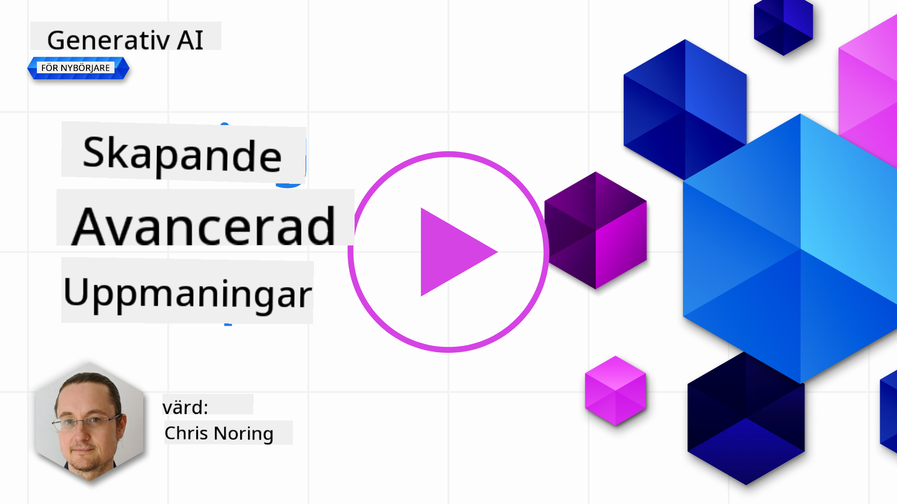

<!--
CO_OP_TRANSLATOR_METADATA:
{
  "original_hash": "b2651fb16bcfbc62b8e518751ed90fdb",
  "translation_date": "2025-10-17T18:57:35+00:00",
  "source_file": "05-advanced-prompts/README.md",
  "language_code": "sv"
}
-->
# Skapa avancerade prompts

[](https://youtu.be/BAjzkaCdRok?si=NmUIyRf7-cDgbjtt)

L친t oss sammanfatta n친gra l칛rdomar fr친n f칬reg친ende kapitel:

> Prompt _engineering_ 칛r processen d칛r vi **v칛gleder modellen mot mer relevanta svar** genom att ge mer anv칛ndbara instruktioner eller kontext.

Det finns ocks친 tv친 steg f칬r att skriva prompts: att konstruera prompten genom att ge relevant kontext, och _optimering_, hur man gradvis f칬rb칛ttrar prompten.

Vid det h칛r laget har vi en grundl칛ggande f칬rst친else f칬r hur man skriver prompts, men vi beh칬ver g친 djupare. I detta kapitel kommer du att g친 fr친n att prova olika prompts till att f칬rst친 varf칬r en prompt 칛r b칛ttre 칛n en annan. Du kommer att l칛ra dig att konstruera prompts enligt n친gra grundl칛ggande tekniker som kan till칛mpas p친 vilken LLM som helst.

## Introduktion

I detta kapitel kommer vi att t칛cka f칬ljande 칛mnen:

- Ut칬ka din kunskap om prompt engineering genom att till칛mpa olika tekniker p친 dina prompts.
- Konfigurera dina prompts f칬r att variera utdata.

## L칛randem친l

Efter att ha avslutat denna lektion kommer du att kunna:

- Till칛mpa tekniker f칬r prompt engineering som f칬rb칛ttrar resultatet av dina prompts.
- Utf칬ra prompting som antingen 칛r varierad eller deterministisk.

## Prompt engineering

Prompt engineering 칛r processen att skapa prompts som ger 칬nskat resultat. Det handlar om mer 칛n att bara skriva en textprompt. Prompt engineering 칛r inte en ingenj칬rsdisciplin, det 칛r snarare en upps칛ttning tekniker som du kan anv칛nda f칬r att f친 det resultat du vill ha.

### Ett exempel p친 en prompt

L친t oss ta en enkel prompt som denna:

> Generera 10 fr친gor om geografi.

I denna prompt till칛mpar du faktiskt en upps칛ttning olika prompttekniker.

L친t oss bryta ner detta.

- **Kontext**, du specificerar att det ska handla om "geografi".
- **Begr칛nsa utdata**, du vill ha h칬gst 10 fr친gor.

### Begr칛nsningar med enkla prompts

Du kanske eller kanske inte f친r det 칬nskade resultatet. Du kommer att f친 dina fr친gor genererade, men geografi 칛r ett stort 칛mne och du kanske inte f친r det du vill p친 grund av f칬ljande sk칛l:

- **Stort 칛mne**, du vet inte om det kommer att handla om l칛nder, huvudst칛der, floder och s친 vidare.
- **Format**, vad h칛nder om du ville att fr친gorna skulle vara formaterade p친 ett visst s칛tt?

Som du kan se finns det mycket att t칛nka p친 n칛r man skapar prompts.

Hittills har vi sett ett enkelt exempel p친 en prompt, men generativ AI 칛r kapabel till mycket mer f칬r att hj칛lpa m칛nniskor i olika roller och branscher. L친t oss utforska n친gra grundl칛ggande tekniker h칛rn칛st.

### Tekniker f칬r prompting

F칬rst m친ste vi f칬rst친 att prompting 칛r en _emergent_ egenskap hos en LLM, vilket inneb칛r att detta inte 칛r en funktion som 칛r inbyggd i modellen utan snarare n친got vi uppt칛cker n칛r vi anv칛nder modellen.

Det finns n친gra grundl칛ggande tekniker som vi kan anv칛nda f칬r att prompta en LLM. L친t oss utforska dem.

- **Zero-shot prompting**, detta 칛r den mest grundl칛ggande formen av prompting. Det 칛r en enkel prompt som beg칛r ett svar fr친n LLM baserat enbart p친 dess tr칛ningsdata.
- **Few-shot prompting**, denna typ av prompting v칛gleder LLM genom att ge 1 eller flera exempel som den kan f칬rlita sig p친 f칬r att generera sitt svar.
- **Chain-of-thought**, denna typ av prompting instruerar LLM hur man bryter ner ett problem i steg.
- **Genererad kunskap**, f칬r att f칬rb칛ttra svaret p친 en prompt kan du ge genererade fakta eller kunskap som till칛gg till din prompt.
- **Least to most**, likt chain-of-thought handlar denna teknik om att bryta ner ett problem i en serie steg och sedan be dessa steg att utf칬ras i ordning.
- **Self-refine**, denna teknik handlar om att kritisera LLM:s utdata och sedan be den f칬rb칛ttra sig.
- **Maieutisk prompting**, h칛r vill du s칛kerst칛lla att LLM:s svar 칛r korrekt och ber den f칬rklara olika delar av svaret. Detta 칛r en form av self-refine.

### Zero-shot prompting

Denna stil av prompting 칛r mycket enkel, den best친r av en enda prompt. Denna teknik 칛r f칬rmodligen vad du anv칛nder n칛r du b칬rjar l칛ra dig om LLMs. H칛r 칛r ett exempel:

- Prompt: "Vad 칛r algebra?"
- Svar: "Algebra 칛r en gren av matematiken som studerar matematiska symboler och reglerna f칬r att manipulera dessa symboler."

### Few-shot prompting

Denna stil av prompting hj칛lper modellen genom att ge n친gra exempel tillsammans med beg칛ran. Den best친r av en enda prompt med ytterligare uppgiftspecifik data. H칛r 칛r ett exempel:

- Prompt: "Skriv en dikt i Shakespeares stil. H칛r 칛r n친gra exempel p친 Shakespeare-sonetter:
  Sonett 18: 'Skall jag j칛mf칬ra dig med en sommardag? Du 칛r mer ljuvlig och mer tempererad...'
  Sonett 116: 'L친t mig inte till 칛ktenskapet av sanna sinnen Medge hinder. K칛rlek 칛r inte k칛rlek Som f칬r칛ndras n칛r den finner f칬r칛ndring...'
  Sonett 132: 'Dina 칬gon 칛lskar jag, och de, som 칬mkar mig, Vet att ditt hj칛rta pl친gar mig med f칬rakt,...'
  Nu, skriv en sonett om m친nens sk칬nhet."
- Svar: "P친 himlen lyser m친nen mjukt, I silverljus som kastar sin milda n친d,..."

Exempel ger LLM kontext, format eller stil f칬r den 칬nskade utdatan. De hj칛lper modellen att f칬rst친 den specifika uppgiften och generera mer exakta och relevanta svar.

### Chain-of-thought

Chain-of-thought 칛r en mycket intressant teknik eftersom den handlar om att ta LLM genom en serie steg. Id칠n 칛r att instruera LLM p친 ett s칛tt som g칬r att den f칬rst친r hur man g칬r n친got. T칛nk p친 f칬ljande exempel, med och utan chain-of-thought:

    - Prompt: "Alice har 5 칛pplen, kastar 3 칛pplen, ger 2 till Bob och Bob ger ett tillbaka, hur m친nga 칛pplen har Alice?"
    - Svar: 5

LLM svarar med 5, vilket 칛r fel. R칛tt svar 칛r 1 칛pple, givet ber칛kningen (5 -3 -2 + 1 = 1).

S친 hur kan vi l칛ra LLM att g칬ra detta korrekt?

L친t oss prova chain-of-thought. Att till칛mpa chain-of-thought inneb칛r:

1. Ge LLM ett liknande exempel.
1. Visa ber칛kningen och hur man ber칛knar det korrekt.
1. Ge den ursprungliga prompten.

S친 h칛r:

- Prompt: "Lisa har 7 칛pplen, kastar 1 칛pple, ger 4 칛pplen till Bart och Bart ger ett tillbaka:
  7 -1 = 6
  6 -4 = 2
  2 +1 = 3  
  Alice har 5 칛pplen, kastar 3 칛pplen, ger 2 till Bob och Bob ger ett tillbaka, hur m친nga 칛pplen har Alice?"
  Svar: 1

Notera hur vi skriver betydligt l칛ngre prompts med ett annat exempel, en ber칛kning och sedan den ursprungliga prompten och vi kommer fram till det korrekta svaret 1.

Som du kan se 칛r chain-of-thought en mycket kraftfull teknik.

### Genererad kunskap

M친nga g친nger n칛r du vill konstruera en prompt vill du g칬ra det med hj칛lp av ditt eget f칬retags data. Du vill att en del av prompten ska komma fr친n f칬retaget och den andra delen ska vara den faktiska prompten du 칛r intresserad av.

Som ett exempel kan din prompt d친 se ut s친 h칛r om du 칛r i f칬rs칛kringsbranschen:

```text
{{company}}: {{company_name}}
{{products}}:
{{products_list}}
Please suggest an insurance given the following budget and requirements:
Budget: {{budget}}
Requirements: {{requirements}}
```

Ovan ser du hur prompten 칛r konstruerad med hj칛lp av en mall. I mallen finns ett antal variabler, markerade med `{{variable}}`, som kommer att ers칛ttas med faktiska v칛rden fr친n ett f칬retags-API.

H칛r 칛r ett exempel p친 hur prompten kan se ut n칛r variablerna har ersatts med inneh친ll fr친n ditt f칬retag:

```text
Insurance company: ACME Insurance
Insurance products (cost per month):
- Car, cheap, 500 USD
- Car, expensive, 1100 USD
- Home, cheap, 600 USD
- Home, expensive, 1200 USD
- Life, cheap, 100 USD

Please suggest an insurance given the following budget and requirements:
Budget: $1000
Requirements: Car, Home, and Life insurance
```

Att k칬ra denna prompt genom en LLM kommer att ge ett svar som detta:

```output
Given the budget and requirements, we suggest the following insurance package from ACME Insurance:
- Car, cheap, 500 USD
- Home, cheap, 600 USD
- Life, cheap, 100 USD
Total cost: $1,200 USD
```

Som du kan se f칬resl친r den ocks친 livf칬rs칛kring, vilket den inte borde. Detta resultat 칛r en indikation p친 att vi beh칬ver optimera prompten genom att g칬ra den tydligare om vad den kan till친ta. Efter lite _trial and error_ kommer vi fram till f칬ljande prompt:

```text
Insurance company: ACME Insurance
Insurance products (cost per month):
- type: Car, cheap, cost: 500 USD
- type: Car, expensive, cost: 1100 USD
- type: Home, cheap, cost: 600 USD
- type: Home, expensive, cost: 1200 USD
- type: Life, cheap, cost: 100 USD

Please suggest an insurance given the following budget and requirements:
Budget: $1000 restrict choice to types: Car, Home
```

Notera hur till칛gget av _typ_ och _kostnad_ och 칛ven anv칛ndningen av nyckelordet _begr칛nsa_ hj칛lper LLM att f칬rst친 vad vi vill.

Nu f친r vi f칬ljande svar:

```output
Given the budget and requirements, we suggest the Car, Cheap insurance product which costs 500 USD per month.
```

Po칛ngen med detta exempel var att visa att 칛ven om vi anv칛nder en grundl칛ggande teknik som _genererad kunskap_, beh칬ver vi fortfarande optimera prompten i de flesta fall f칬r att f친 det 칬nskade resultatet.

### Least-to-most

Id칠n med Least-to-most prompting 칛r att bryta ner ett st칬rre problem i delproblem. P친 s친 s칛tt hj칛lper du LLM att "er칬vra" det st칬rre problemet. Ett bra exempel kan vara f칬r dataanalys d칛r du kan be LLM att dela upp ett problem s친 h칛r:

> Prompt: Hur utf칬r man dataanalys i 5 steg?

Med din AI-assistent som svarar med:

1. Samla in data
1. Rensa data
1. Analysera data
1. Visualisera data
1. Presentera data

### Self-refine, kritisera resultaten

Med generativa AI och LLMs kan du inte lita p친 utdatan. Du m친ste verifiera den. Trots allt presenterar LLM bara vad som 칛r mest sannolikt att s칛ga h칛rn칛st, inte vad som 칛r korrekt. D칛rf칬r 칛r det en bra id칠 att be LLM att kritisera sig sj칛lv, vilket leder oss till self-refine-tekniken.

Hur det fungerar 칛r att du f칬ljer f칬ljande steg:

1. Initial prompt som ber LLM att l칬sa ett problem
1. LLM svarar
1. Du kritiserar svaret och ber AI att f칬rb칛ttra det
1. LLM svarar igen, denna g친ng med h칛nsyn till kritiken och f칬resl친r l칬sningar den kommit fram till

Du kan upprepa denna process s친 m친nga g친nger du vill.

H칛r 칛r ett exempel som anv칛nder denna teknik:

> Prompt: "Skapa en Python Web API med routes f칬r produkter och kunder"

AI-svar:

```python
import flask
app = Flask(__name__)

@app.route('/products')
def products():
    return 'Products'

@app.route('/customers')
def customers():
    return 'Customers'
```

> Prompt: f칬resl친 3 f칬rb칛ttringar av ovanst친ende kod

AI-svar:

```text
Sure, here are three suggestions to improve the code:

Import the correct module: The first line should import Flask instead of flask. The correct import statement should be from flask import Flask.

Add a main function: Add a if __name__ == '__main__': block to the end of the file to run the application when the file is executed.

Use f-strings: Use f-strings to format the return statements in the route functions. For example, return 'Products' can be changed to return f'This is the {request.path} page'.
```

```python
from flask import Flask, request

app = Flask(__name__)

@app.route('/products')
def products():
    return f'This is the {request.path} page'

@app.route('/customers')
def customers():
    return f'This is the {request.path} page'

if __name__ == '__main__':
    app.run()
```

Som du kan se f칬rb칛ttrar AI-svaret ovan den f칬rsta f칬reslagna koden tack vare kritiken av det f칬rsta svaret.

### Maieutisk prompting

Maieutisk prompting 칛r en teknik som liknar self-refine men handlar mer om att be LLM att f칬rklara sig sj칛lv. M친let 칛r att minska inkonsekvenser i LLM:s utdata f칬r att s칛kerst칛lla att den kommer fram till r칛tt svar. Arbetsfl칬det att f칬lja 칛r:

1. Be LLM att svara p친 en fr친ga
1. F칬r varje del av svaret, be LLM att f칬rklara det mer i detalj.
1. Om det finns inkonsekvenser, kassera de delar som 칛r inkonsekventa.

Upprepa steg 2 och 3 tills du har g친tt igenom alla delar och 칛r n칬jd med svaret.

H칛r 칛r ett exempel p친 en prompt:

> prompt: Hur kan jag skapa en krisplan f칬r att hantera en pandemi i 5 steg?
> LLM-svar:

```text
1. Identify the risks
1. Identify the stakeholders
1. Identify the resources
1. Identify the actions
1. Identify the communication channels
```

Den har identifierat 5 steg, men kan vi avg칬ra om detta 칛r korrekt? L친t oss be LLM att f칬rklara varje steg:

> prompt: F칬rklara det f칬rsta steget mer i detalj, vilka 칛r riskerna i detalj med en pandemi?

```text
The risks are the following:

- Loss of life
- Loss of business
- Loss of reputation
- Loss of customers
- Loss of employees
```

Vid denna punkt vill vi s칛kerst칛lla att LLM 칛r korrekt s친 vi ber den f칬rklara den f칬rsta risken mer i detalj och hoppas att den 칛r konsekvent med svaret ovan:

> prompt: Vid en pandemi, vilken 칛r den st칬rsta risken och varf칬r?

```text
The biggest risk is loss of life because it's the most important thing to protect.
```

> Vilka 칛r de tv친 st칬rsta riskerna vid en pandemi?

```text
The two biggest risks are loss of life and loss of business.
```

Vid denna punkt 칛r LLM konsekvent och n칛mner "liv" och "aff칛rsverksamhet" som de tv친 st칬rsta riskerna. Vi kan nu forts칛tta till n칛sta steg och k칛nna oss ganska s칛kra. Men vi b칬r inte lita blint p친 LLM, vi b칬r alltid verifiera utdatan.

## Variera din utdata

LLMs 칛r icke-deterministiska till sin natur, vilket inneb칛r att du kommer att f친 olika resultat varje g친ng du k칬r samma prompt. Prova f칬ljande prompt till exempel:

> "Generera kod f칬r en Python Web API"

```python
# Import necessary modules
import flask
from flask import request, jsonify

# Create a Flask app
app = flask.Flask(__name__)

# Create a route for the API
@app.route('/api', methods=['GET'])
def api():
    # Get the data from the request
    data = request.args

    # Process the data
    result = process_data(data)

    # Return the result as JSON
    return jsonify(result)

# Function to process the data
def process_data(data):
    # Do something with the data
    result = data + 1

    # Return the result
    return result

# Run the app
if __name__ == '__main__':
    app.run()

```

Att k칬ra samma prompt igen genererar ett n친got annorlunda svar:

```python
#import necessary packages
import flask
from flask import request, jsonify

#create the Flask application
app = flask.Flask(__name__)
app.config["DEBUG"] = True

#create a list of books
books = [
    {'id': 0,
     'title': 'A Fire Upon the Deep',
     'author': 'Vernor Vinge',
     'first_sentence': 'The coldsleep itself was dreamless.',
     'year_published': '1992'},
    {'id': 1,
     'title': 'The Ones Who Walk Away From Omelas',
     'author': 'Ursula K. Le Guin',
     'first_sentence': 'With a clamor of bells that set the swallows soaring, the Festival of Summer came to the city Omelas, bright-towered by the sea.',
     'published': '1973'},
    {'id': 2,
     'title': 'Dhalgren',
     'author': 'Samuel R. Delany',
     'first_sentence': 'to wound the autumnal city.',
     'published': '1975'}
]

#create an endpoint for the API
@app.route('/', methods=['GET'])
def home():
    return '''<h1>Books API</h1>
<p>A prototype API for retrieving books.</p>'''

#create an endpoint to return all books
@app.route('/api/v1/resources/books/all', methods=['GET'])
def api_all():
    return jsonify(books)

#create an endpoint to return a single book
@app.route('/api/v1/resources/books', methods=['GET'])
def api_id():
    #check if an ID was provided as part of the URL
    #if ID is provided, assign it to a variable
    #if no ID is provided, display an error
    if 'id' in request.args:
        id = int(request.args['id'])
    else:
        return "Error: No id field provided. Please specify an id."

    #create an empty list for our results
    results = []

    #loop through the data and match results that fit the requested ID
    #IDs are unique, but other fields might return many results
    for book in books:
        if book['id'] == id:
            results.append(book)

    #use the jsonify function from Flask to convert our list of
    #Python dictionaries to the JSON format
    return jsonify(results)

app.run()
```

> S친 칛r den varierade utdatan ett problem?

Det beror p친 vad du f칬rs칬ker g칬ra. Om du vill ha ett specifikt svar 칛r det ett problem. Om du 칛r okej med en varierad utdata som "Generera vilka 3 fr친gor som helst om geografi", 칛r det inte ett problem.

### Anv칛nda temperatur f칬r att variera din utdata

Okej, s친 vi har best칛mt oss f칬r att vi vill begr칛nsa utdatan f칬r att vara mer f칬ruts칛gbar, det vill s칛ga mer deterministisk. Hur g칬r vi det?

Temperatur 칛r ett v칛rde mellan 0 och 1, d칛r 0 칛r det mest deterministiska och 1 칛r det mest varierade. Standardv칛rdet 칛r 0.7. L친t oss se vad som h칛nder med tv친 k칬rningar av samma prompt med temperaturen inst칛lld p친 0.1:

> "Generera kod f칬r en Python Web API"

```python
#import necessary libraries
import flask
from flask import request, jsonify

#create an instance of the Flask class
app = flask.Flask(__name__)

#create an endpoint for the API
@app.route('/api/v1/endpoint', methods=['GET'])
def api_endpoint():
    #get the request data
    data = request.get_json()

    #process the data
    result = process_data(data)

    #return the result
    return jsonify(result)

#function to process the data
def process_data(data):
    #process the data
    result = {'result': 'success'}

    #return the result
    return result

#run the Flask app
if __name__ == '__main__':
    app.run()

```

Att k칬ra prompten igen ger oss detta resultat:

```python
#import necessary libraries
import flask
from flask import request, jsonify

#create a Flask app
app = flask.Flask(__name__)

#create a route for the API
@app.route('/api', methods=['GET'])
def api_call():
    #get the data from the request
    data = request.get_json()

    #process the data
    result = process_data(data)

    #return the result
    return jsonify(result)

#define the process_data function
def process_data(data):
    #do something with the data
    result = data + 1

    #return the result
    return result

#run the app
if __name__ == '__main__':
    app.run()

```

Det 칛r bara en liten skillnad mellan dessa tv친 utdata. L친t oss g칬ra motsatsen denna g친ng, l친t oss st칛lla in temperaturen p친 0.9:

```python
# Import necessary libraries
import flask
from flask import request, jsonify

# Create a Flask app
app = flask.Flask(__name__)

# Create a route for the API
@app.route('/api', methods=['GET'])
def api_call():
    # Get the data from the request
    data = request.args

    # Process the data
    result = process_data(data)

    # Return the result
    return jsonify(result)

# Function to process the data
def process_data(data):
    # Do something with the data
    result = data + 1

    # Return the result
    return result

# Run the app
if __name__ == '__main__':
    app.run()

```

och det andra f칬rs칬ket med 0.9 som temperaturv칛rde:

```python
import flask
from flask import request, jsonify

# create the Flask app
app = flask.Flask(__name__)
app.config['DEBUG'] = True

# create some test data
books = [
    {'id': 0, 'title': 'A Fire Upon The Deep', 'author': 'Vernor Vinge', 'first_sentence': 'The coldsleep itself was dreamless.', 'year_published': '1992'},
    {'id': 1, 'title': 'The Ones Who Walk Away From Omelas', 'author': 'Ursula K. Le Guin', 'first_sentence': 'With a clamor of bells that set the swallows soaring, the Festival of Summer came to the city Omelas, bright-towered by the sea.', 'published': '1973'},
    {'id': 2, 'title': 'Dhalgren', 'author': 'Samuel R. Delany', 'first_sentence': 'to wound the autumnal city.', 'published': '1975'}
]

# create an endpoint
@app.route('/', methods=['GET'])
def home():
    return '''<h1>Welcome to our book API!</h1>'''

@app.route('/api/v1/resources/books

```

Som du kan se, resultaten kunde inte vara mer varierade.

> Observera att det finns fler parametrar du kan 칛ndra f칬r att variera resultatet, som top-k, top-p, repetition penalty, length penalty och diversity penalty, men dessa ligger utanf칬r denna kursens omfattning.

## Bra praxis

Det finns m친nga metoder du kan anv칛nda f칬r att f칬rs칬ka f친 det resultat du vill ha. Du kommer att hitta din egen stil ju mer du anv칛nder prompting.

Ut칬ver de tekniker vi har t칛ckt finns det n친gra bra praxis att t칛nka p친 n칛r du anv칛nder en LLM.

H칛r 칛r n친gra bra praxis att 칬verv칛ga:

- **Specificera kontext**. Kontext 칛r viktigt, ju mer du kan specificera som dom칛n, 칛mne, etc., desto b칛ttre.
- Begr칛nsa resultatet. Om du vill ha ett specifikt antal objekt eller en specifik l칛ngd, ange det.
- **Specificera b친de vad och hur**. Kom ih친g att n칛mna b친de vad du vill ha och hur du vill ha det, till exempel "Skapa en Python Web API med routes f칬r produkter och kunder, dela upp det i 3 filer".
- **Anv칛nd mallar**. Ofta vill du berika dina prompts med data fr친n ditt f칬retag. Anv칛nd mallar f칬r att g칬ra detta. Mallar kan ha variabler som du ers칛tter med faktisk data.
- **Stava korrekt**. LLMs kan ge dig ett korrekt svar, men om du stavar korrekt f친r du ett b칛ttre svar.

## Uppgift

H칛r 칛r kod i Python som visar hur man bygger ett enkelt API med Flask:

```python
from flask import Flask, request

app = Flask(__name__)

@app.route('/')
def hello():
    name = request.args.get('name', 'World')
    return f'Hello, {name}!'

if __name__ == '__main__':
    app.run()
```

Anv칛nd en AI-assistent som GitHub Copilot eller ChatGPT och till칛mpa tekniken "self-refine" f칬r att f칬rb칛ttra koden.

## L칬sning

F칬rs칬k att l칬sa uppgiften genom att l칛gga till l칛mpliga prompts till koden.

> [!TIP]
> Formulera en prompt f칬r att be om f칬rb칛ttringar, det 칛r en bra id칠 att begr칛nsa hur m친nga f칬rb칛ttringar. Du kan ocks친 be om att f칬rb칛ttra det p친 ett visst s칛tt, till exempel arkitektur, prestanda, s칛kerhet, etc.

[L칬sning](../../../05-advanced-prompts/python/aoai-solution.py)

## Kunskapskontroll

Varf칬r skulle jag anv칛nda chain-of-thought prompting? Visa mig 1 korrekt svar och 2 felaktiga svar.

1. F칬r att l칛ra LLM hur man l칬ser ett problem.
1. B, F칬r att l칛ra LLM att hitta fel i kod.
1. C, F칬r att instruera LLM att komma med olika l칬sningar.

A: 1, eftersom chain-of-thought handlar om att visa LLM hur man l칬ser ett problem genom att ge den en serie steg, och liknande problem och hur de l칬stes.

## 游 Utmaning

Du har just anv칛nt tekniken self-refine i uppgiften. Ta ett program du har byggt och fundera p친 vilka f칬rb칛ttringar du skulle vilja till칛mpa p친 det. Anv칛nd nu tekniken self-refine f칬r att till칛mpa de f칬reslagna 칛ndringarna. Vad tyckte du om resultatet, b칛ttre eller s칛mre?

## Bra jobbat! Forts칛tt din inl칛rning

Efter att ha avslutat denna lektion, kolla in v친r [Generative AI Learning-samling](https://aka.ms/genai-collection?WT.mc_id=academic-105485-koreyst) f칬r att forts칛tta utveckla din kunskap om Generative AI!

G친 vidare till Lektion 6 d칛r vi kommer att till칛mpa v친r kunskap om Prompt Engineering genom att [bygga textgenereringsappar](../06-text-generation-apps/README.md?WT.mc_id=academic-105485-koreyst)

---

**Ansvarsfriskrivning**:  
Detta dokument har 칬versatts med hj칛lp av AI-칬vers칛ttningstj칛nsten [Co-op Translator](https://github.com/Azure/co-op-translator). 츿ven om vi str칛var efter noggrannhet, b칬r det noteras att automatiserade 칬vers칛ttningar kan inneh친lla fel eller felaktigheter. Det ursprungliga dokumentet p친 dess ursprungliga spr친k b칬r betraktas som den auktoritativa k칛llan. F칬r kritisk information rekommenderas professionell m칛nsklig 칬vers칛ttning. Vi ansvarar inte f칬r eventuella missf칬rst친nd eller feltolkningar som uppst친r vid anv칛ndning av denna 칬vers칛ttning.