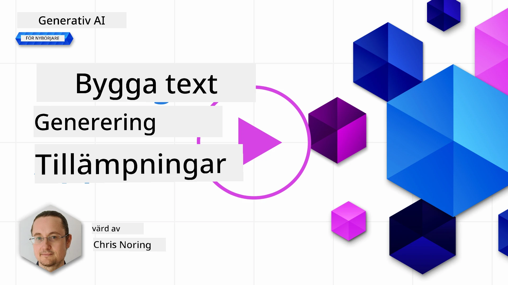

# Bygga textgenereringsapplikationer

[](https://youtu.be/0Y5Luf5sRQA?si=t_xVg0clnAI4oUFZ)

> _(Klicka på bilden ovan för att se videon av denna lektion)_

Du har hittills sett genom denna kursplan att det finns grundläggande begrepp som prompts och till och med en hel disciplin som kallas "prompt engineering". Många verktyg som du kan interagera med, som ChatGPT, Office 365, Microsoft Power Platform och fler, stödjer användning av prompts för att åstadkomma något.

För att du ska kunna lägga till en sådan upplevelse i en app, behöver du förstå begrepp som prompts, avslutningar och välja ett bibliotek att arbeta med. Det är precis vad du kommer att lära dig i detta kapitel.

## Introduktion

I detta kapitel kommer du att:

- Lära dig om openai-biblioteket och dess grundläggande koncept.
- Bygga en textgenereringsapp med openai.
- Förstå hur du använder begrepp som prompt, temperatur och tokens för att bygga en textgenereringsapp.

## Lärandemål

I slutet av denna lektion kommer du att kunna:

- Förklara vad en textgenereringsapp är.
- Bygga en textgenereringsapp med openai.
- Konfigurera din app för att använda fler eller färre tokens och även ändra temperaturen för ett varierat resultat.

## Vad är en textgenereringsapp?

Vanligtvis när du bygger en app har den någon form av gränssnitt som följande:

- Kommandobaserad. Konsolappar är typiska appar där du skriver ett kommando och den utför en uppgift. Till exempel är `git` en kommandobaserad app.
- Användargränssnitt (UI). Vissa appar har grafiska användargränssnitt (GUI) där du klickar på knappar, skriver in text, väljer alternativ och mer.

### Konsol- och UI-appar är begränsade

Jämför det med en kommandobaserad app där du skriver ett kommando:

- **Den är begränsad**. Du kan inte bara skriva vilket kommando som helst, endast de som appen stödjer.
- **Språkspecifik**. Vissa appar stödjer många språk, men som standard är appen byggd för ett specifikt språk, även om du kan lägga till mer språkövergripande stöd.

### Fördelar med textgenereringsappar

Så hur skiljer sig en textgenereringsapp?

I en textgenereringsapp har du mer flexibilitet, du är inte begränsad till ett set kommandon eller ett specifikt inmatningsspråk. Istället kan du använda naturligt språk för att interagera med appen. En annan fördel är att du redan interagerar med en datakälla som har tränats på en enorm samling information, medan en traditionell app kan vara begränsad till vad som finns i en databas.

### Vad kan jag bygga med en textgenereringsapp?

Det finns många saker du kan bygga. Till exempel:

- **En chatbot**. En chatbot som svarar på frågor om ämnen, som ditt företag och dess produkter, kan vara en bra match.
- **Hjälpare**. LLMs är bra på saker som att sammanfatta text, hämta insikter från text, producera text som cv:n och mer.
- **Kodassistent**. Beroende på språkmodellen du använder kan du bygga en kodassistent som hjälper dig skriva kod. Till exempel kan du använda en produkt som GitHub Copilot samt ChatGPT för att hjälpa dig skriva kod.

## Hur kommer jag igång?

Jo, du behöver hitta ett sätt att integrera med en LLM vilket vanligtvis innebär följande två tillvägagångssätt:

- Använd en API. Här konstruerar du webbrequester med din prompt och får genererad text tillbaka.
- Använd ett bibliotek. Bibliotek hjälper till att kapsla in API-anropen och göra dem enklare att använda.

## Bibliotek/SDK:er

Det finns några välkända bibliotek för att arbeta med LLMs som:

- **openai**, detta bibliotek gör det enkelt att ansluta till din modell och skicka in prompts.

Sedan finns bibliotek som opererar på en högre nivå som:

- **Langchain**. Langchain är välkänt och stödjer Python.
- **Semantic Kernel**. Semantic Kernel är ett bibliotek från Microsoft som stödjer språken C#, Python och Java.

## Första appen med openai

Låt oss se hur vi kan bygga vår första app, vilka bibliotek vi behöver, hur mycket som krävs och så vidare.

### Installera openai

Det finns många bibliotek för att interagera med OpenAI eller Azure OpenAI. Det går även att använda många programmeringsspråk som C#, Python, JavaScript, Java och mer. Vi har valt att använda `openai` Python-bibliotek, så vi använder `pip` för att installera det.

```bash
pip install openai
```

### Skapa en resurs

Du behöver utföra följande steg:

- Skapa ett konto på Azure [https://azure.microsoft.com/free/](https://azure.microsoft.com/free/?WT.mc_id=academic-105485-koreyst).
- Få tillgång till Azure OpenAI. Gå till [https://learn.microsoft.com/azure/ai-services/openai/overview#how-do-i-get-access-to-azure-openai](https://learn.microsoft.com/azure/ai-services/openai/overview#how-do-i-get-access-to-azure-openai?WT.mc_id=academic-105485-koreyst) och ansök om tillgång.

  > [!NOTE]
  > Vid skrivande stund behöver du ansöka om tillgång till Azure OpenAI.

- Installera Python <https://www.python.org/>
- Ha skapat en Azure OpenAI Service-resurs. Se denna guide för hur du [skapar en resurs](https://learn.microsoft.com/azure/ai-services/openai/how-to/create-resource?pivots=web-portal?WT.mc_id=academic-105485-koreyst).

### Hitta API-nyckel och endpunkt

Vid detta tillfälle behöver du tala om för ditt `openai` bibliotek vilken API-nyckel det ska använda. För att hitta din API-nyckel, gå till avsnittet "Keys and Endpoint" på din Azure OpenAI-resurs och kopiera värdet "Key 1".


Nu när du har denna information kopierad, låt oss instruera biblioteken att använda den.

> [!NOTE]
> Det är värt att separera din API-nyckel från din kod. Du kan göra detta genom att använda miljövariabler.
>
> - Sätt miljövariabeln `OPENAI_API_KEY` till din API-nyckel.
>   `export OPENAI_API_KEY='sk-...'`

### Konfigurera Azure

Om du använder Azure OpenAI (nu en del av Microsoft Foundry), så här ställer du in konfigurationen. Vi använder den standard `OpenAI` klienten riktad mot Azure OpenAI `/openai/v1/` slutpunkt, som fungerar med Responses API och behöver ingen `api_version`:

```python
import os
from openai import OpenAI

client = OpenAI(
    api_key=os.environ["AZURE_OPENAI_API_KEY"],
    base_url=f"{os.environ['AZURE_OPENAI_ENDPOINT'].rstrip('/')}/openai/v1/",
)
```

Ovan sätter vi följande:

- `api_key`, detta är din API-nyckel som finns i Azure-portalen eller Microsoft Foundry-portalen.
- `base_url`, detta är din Foundry-resurs-endpoint med `/openai/v1/` tillagt. Den stabila v1 endpoint fungerar över OpenAI och Azure OpenAI utan `api_version`-hantering.

> [!NOTE] > `os.environ` läser miljövariabler. Du kan använda det för att läsa miljövariabler som `AZURE_OPENAI_API_KEY` och `AZURE_OPENAI_ENDPOINT`. Sätt dessa miljövariabler i din terminal eller genom att använda ett bibliotek som `dotenv`.

## Generera text

Sättet att generera text är att använda Responses API via metoden `responses.create`. Här är ett exempel:

```python
prompt = "Complete the following: Once upon a time there was a"

response = client.responses.create(
    model="gpt-4o-mini",  # detta är ditt modellutrullningsnamn
    input=prompt,
    store=False,
)
print(response.output_text)
```

I ovanstående kod skapar vi ett svar och skickar in modellen vi vill använda och prompten. Sedan skriver vi ut den genererade texten via `response.output_text`.

### Flerstegs konversationer

Responses API är väl lämpad för både textgenerering i ett steg och flerstegs-chatbotar – du tillhandahåller en lista med meddelanden i `input` för att bygga upp en konversation:

```python
from openai import OpenAI

client = OpenAI(api_key="sk-...")

response = client.responses.create(model="gpt-4o-mini", input="Hello world", store=False)
print(response.output_text)
```

Mer om denna funktionalitet i ett kommande kapitel.

## Övning - din första textgenereringsapp

Nu när vi har lärt oss hur man sätter upp och konfigurerar openai, är det dags att bygga din första textgenereringsapp. Följ dessa steg för att bygga din app:

1. Skapa en virtuell miljö och installera openai:

   ```bash
   python -m venv venv
   source venv/bin/activate
   pip install openai
   ```

   > [!NOTE]
   > Om du använder Windows, skriv `venv\Scripts\activate` istället för `source venv/bin/activate`.

   > [!NOTE]
   > Hitta din Azure OpenAI-nyckel genom att gå till [https://portal.azure.com/](https://portal.azure.com/?WT.mc_id=academic-105485-koreyst) och sök efter `Open AI` och välj `Open AI resource` och sedan `Keys and Endpoint` och kopiera värdet `Key 1`.

1. Skapa en _app.py_-fil och ge den följande kod:

   ```python
   import os
   from openai import OpenAI

   client = OpenAI(
       api_key="<replace this value with your Azure OpenAI key>",
       base_url="<endpoint found in Azure Portal>/openai/v1/",
   )
   deployment_name = "<deployment name>"

   # lägg till din fullständighetskod
   prompt = "Complete the following: Once upon a time there was a"

   # gör en förfrågan med Responses API
   response = client.responses.create(model=deployment_name, input=prompt, store=False)

   # skriv ut svar
   print(response.output_text)
   ```

   > [!NOTE]
   > Om du använder vanlig OpenAI (inte Azure), använd `client = OpenAI(api_key="<ersätt detta värde med din OpenAI-nyckel>")` (ingen `base_url`) och ange ett modellnamn som `gpt-4o-mini` istället för ett driftsättningsnamn.

   Du bör se en output som följande:

   ```output
    very unhappy _____.

   Once upon a time there was a very unhappy mermaid.
   ```

## Olika typer av prompts för olika saker

Nu har du sett hur man genererar text med en prompt. Du har till och med ett program igång som du kan modifiera och ändra för att generera olika typer av text.

Prompts kan användas för alla möjliga uppgifter. Till exempel:

- **Generera en typ av text**. Till exempel, du kan generera en dikt, frågor för ett quiz med mera.
- **Söka information**. Du kan använda prompts för att söka information som i följande exempel 'Vad betyder CORS inom webbutveckling?'.
- **Generera kod**. Du kan använda prompts för att generera kod, till exempel utveckla ett reguljärt uttryck för att validera mejl eller varför inte generera ett helt program, som en webbapp?

## Ett mer praktiskt användningsfall: en receptgenerator

Föreställ dig att du har ingredienser hemma och vill laga något. Då behöver du ett recept. Ett sätt att hitta recept är att använda en sökmotor eller så kan du använda en LLM för det.

Du skulle kunna skriva en prompt så här:

> "Visa mig 5 recept på en rätt med följande ingredienser: kyckling, potatis och morötter. För varje recept, lista alla använda ingredienser"

Med ovanstående prompt kan du få ett svar som liknar:

```output
1. Roasted Chicken and Vegetables:
Ingredients:
- 4 chicken thighs
- 2 potatoes, cut into cubes
- 2 carrots, cut into cubes
- 2 tablespoons olive oil
- 2 cloves garlic, minced
- 1 teaspoon dried thyme
- 1 teaspoon dried oregano
- Salt and pepper, to taste

2. Chicken and Potato Stew:
Ingredients:
- 2 tablespoons olive oil
- 1 onion, diced
- 2 cloves garlic, minced
- 2 chicken breasts, cut into cubes
- 2 potatoes, cut into cubes
- 2 carrots, cut into cubes
- 1 teaspoon dried oregano
- 1 teaspoon dried thyme
- 1 cup chicken broth
- Salt and pepper, to taste

3. Chicken and Potato Bake:
Ingredients:
- 2 tablespoons olive oil
- 2 chicken breasts, cut into cubes
- 2 potatoes, cut into cubes
- 2 carrots, cut into cubes
- 1 onion, diced
- 2 cloves garlic, minced
- 1 teaspoon dried oregano
- 1 teaspoon dried thyme
- 1 cup chicken broth
- Salt and pepper, to taste

4. Chicken and Potato Soup:
Ingredients:
- 2 tablespoons olive oil
- 1 onion, diced
- 2 cloves garlic, minced
- 2 chicken breasts, cut into cubes
- 2 potatoes, cut into cubes
- 2 carrots, cut into cubes
- 1 teaspoon dried oregano
- 1 teaspoon dried thyme
- 4 cups chicken broth
- Salt and pepper, to taste

5. Chicken and Potato Hash:
Ingredients:
- 2 tablespoons olive oil
- 2 chicken breasts, cut into cubes
- 2 potatoes, cut into cubes
- 2 carrots, cut into cubes
- 1 onion, diced
- 2 cloves garlic, minced
- 1 teaspoon dried oregano
```

Detta resultat är toppen, jag vet vad jag ska laga. Vid detta tillfälle skulle användbara förbättringar kunna vara:

- Filtrera bort ingredienser jag inte gillar eller är allergisk mot.
- Skapa en inköpslista om jag inte har alla ingredienser hemma.

För ovanstående fall, låt oss lägga till en extra prompt:

> "Vänligen ta bort recept med vitlök eftersom jag är allergisk och ersätt den med något annat. Skapa också en inköpslista för recepten med hänsyn till att jag redan har kyckling, potatis och morötter hemma."

Nu har du ett nytt resultat, nämligen:

```output
1. Roasted Chicken and Vegetables:
Ingredients:
- 4 chicken thighs
- 2 potatoes, cut into cubes
- 2 carrots, cut into cubes
- 2 tablespoons olive oil
- 1 teaspoon dried thyme
- 1 teaspoon dried oregano
- Salt and pepper, to taste

2. Chicken and Potato Stew:
Ingredients:
- 2 tablespoons olive oil
- 1 onion, diced
- 2 chicken breasts, cut into cubes
- 2 potatoes, cut into cubes
- 2 carrots, cut into cubes
- 1 teaspoon dried oregano
- 1 teaspoon dried thyme
- 1 cup chicken broth
- Salt and pepper, to taste

3. Chicken and Potato Bake:
Ingredients:
- 2 tablespoons olive oil
- 2 chicken breasts, cut into cubes
- 2 potatoes, cut into cubes
- 2 carrots, cut into cubes
- 1 onion, diced
- 1 teaspoon dried oregano
- 1 teaspoon dried thyme
- 1 cup chicken broth
- Salt and pepper, to taste

4. Chicken and Potato Soup:
Ingredients:
- 2 tablespoons olive oil
- 1 onion, diced
- 2 chicken breasts, cut into cubes
- 2 potatoes, cut into cubes
- 2 carrots, cut into cubes
- 1 teaspoon dried oregano
- 1 teaspoon dried thyme
- 4 cups chicken broth
- Salt and pepper, to taste

5. Chicken and Potato Hash:
Ingredients:
- 2 tablespoons olive oil
- 2 chicken breasts, cut into cubes
- 2 potatoes, cut into cubes
- 2 carrots, cut into cubes
- 1 onion, diced
- 1 teaspoon dried oregano

Shopping List:
- Olive oil
- Onion
- Thyme
- Oregano
- Salt
- Pepper
```

Det här är dina fem recept utan nämnd vitlök och du har även en inköpslista med tanke på vad du redan har hemma.

## Övning - bygg en receptgenerator

Nu när vi har spelat upp ett scenario, låt oss skriva kod för att matcha det visade scenariot. Följ stegen:

1. Använd den befintliga _app.py_-filen som utgångspunkt
1. Hitta variabeln `prompt` och ändra dess kod till följande:

   ```python
   prompt = "Show me 5 recipes for a dish with the following ingredients: chicken, potatoes, and carrots. Per recipe, list all the ingredients used"
   ```

   Om du nu kör koden bör du se en output som liknar:

   ```output
   -Chicken Stew with Potatoes and Carrots: 3 tablespoons oil, 1 onion, chopped, 2 cloves garlic, minced, 1 carrot, peeled and chopped, 1 potato, peeled and chopped, 1 bay leaf, 1 thyme sprig, 1/2 teaspoon salt, 1/4 teaspoon black pepper, 1 1/2 cups chicken broth, 1/2 cup dry white wine, 2 tablespoons chopped fresh parsley, 2 tablespoons unsalted butter, 1 1/2 pounds boneless, skinless chicken thighs, cut into 1-inch pieces
   -Oven-Roasted Chicken with Potatoes and Carrots: 3 tablespoons extra-virgin olive oil, 1 tablespoon Dijon mustard, 1 tablespoon chopped fresh rosemary, 1 tablespoon chopped fresh thyme, 4 cloves garlic, minced, 1 1/2 pounds small red potatoes, quartered, 1 1/2 pounds carrots, quartered lengthwise, 1/2 teaspoon salt, 1/4 teaspoon black pepper, 1 (4-pound) whole chicken
   -Chicken, Potato, and Carrot Casserole: cooking spray, 1 large onion, chopped, 2 cloves garlic, minced, 1 carrot, peeled and shredded, 1 potato, peeled and shredded, 1/2 teaspoon dried thyme leaves, 1/4 teaspoon salt, 1/4 teaspoon black pepper, 2 cups fat-free, low-sodium chicken broth, 1 cup frozen peas, 1/4 cup all-purpose flour, 1 cup 2% reduced-fat milk, 1/4 cup grated Parmesan cheese

   -One Pot Chicken and Potato Dinner: 2 tablespoons olive oil, 1 pound boneless, skinless chicken thighs, cut into 1-inch pieces, 1 large onion, chopped, 3 cloves garlic, minced, 1 carrot, peeled and chopped, 1 potato, peeled and chopped, 1 bay leaf, 1 thyme sprig, 1/2 teaspoon salt, 1/4 teaspoon black pepper, 2 cups chicken broth, 1/2 cup dry white wine

   -Chicken, Potato, and Carrot Curry: 1 tablespoon vegetable oil, 1 large onion, chopped, 2 cloves garlic, minced, 1 carrot, peeled and chopped, 1 potato, peeled and chopped, 1 teaspoon ground coriander, 1 teaspoon ground cumin, 1/2 teaspoon ground turmeric, 1/2 teaspoon ground ginger, 1/4 teaspoon cayenne pepper, 2 cups chicken broth, 1/2 cup dry white wine, 1 (15-ounce) can chickpeas, drained and rinsed, 1/2 cup raisins, 1/2 cup chopped fresh cilantro
   ```

   > NOTERA, din LLM är icke-deterministisk, så du kan få olika resultat varje gång du kör programmet.

   Bra, låt oss se hur vi kan förbättra saker. För att förbättra saker vill vi se till att koden är flexibel, så att ingredienser och antal recept kan förbättras och ändras.

1. Låt oss ändra koden på följande sätt:

   ```python
   no_recipes = input("No of recipes (for example, 5): ")

   ingredients = input("List of ingredients (for example, chicken, potatoes, and carrots): ")

   # interpolera antalet recept i prompten och ingredienserna
   prompt = f"Show me {no_recipes} recipes for a dish with the following ingredients: {ingredients}. Per recipe, list all the ingredients used"
   ```

   Att köra koden för ett test kan se ut så här:

   ```output
   No of recipes (for example, 5): 3
   List of ingredients (for example, chicken, potatoes, and carrots): milk,strawberries

   -Strawberry milk shake: milk, strawberries, sugar, vanilla extract, ice cubes
   -Strawberry shortcake: milk, flour, baking powder, sugar, salt, unsalted butter, strawberries, whipped cream
   -Strawberry milk: milk, strawberries, sugar, vanilla extract
   ```

### Förbättra genom att lägga till filter och inköpslista

Vi har nu en fungerande app som kan producera recept och den är flexibel eftersom den bygger på input från användaren, både på antal recept men också ingredienser som används.

För att förbättra den ytterligare vill vi lägga till följande:

- **Filtrera bort ingredienser**. Vi vill kunna filtrera bort ingredienser vi inte gillar eller är allergiska mot. För att göra denna ändring kan vi redigera vår befintliga prompt och lägga till ett filtervillkor i slutet av den så här:

  ```python
  filter = input("Filter (for example, vegetarian, vegan, or gluten-free): ")

  prompt = f"Show me {no_recipes} recipes for a dish with the following ingredients: {ingredients}. Per recipe, list all the ingredients used, no {filter}"
  ```

  Ovan lägger vi till `{filter}` i slutet av prompten och vi fångar även upp filtervärdet från användaren.

  Ett exempel på körning av programmet kan se ut så här:

  ```output
  No of recipes (for example, 5): 3
  List of ingredients (for example, chicken, potatoes, and carrots): onion,milk
  Filter (for example, vegetarian, vegan, or gluten-free): no milk

  1. French Onion Soup

  Ingredients:

  -1 large onion, sliced
  -3 cups beef broth
  -1 cup milk
  -6 slices french bread
  -1/4 cup shredded Parmesan cheese
  -1 tablespoon butter
  -1 teaspoon dried thyme
  -1/4 teaspoon salt
  -1/4 teaspoon black pepper

  Instructions:

  1. In a large pot, sauté onions in butter until golden brown.
  2. Add beef broth, milk, thyme, salt, and pepper. Bring to a boil.
  3. Reduce heat and simmer for 10 minutes.
  4. Place french bread slices on soup bowls.
  5. Ladle soup over bread.
  6. Sprinkle with Parmesan cheese.

  2. Onion and Potato Soup

  Ingredients:

  -1 large onion, chopped
  -2 cups potatoes, diced
  -3 cups vegetable broth
  -1 cup milk
  -1/4 teaspoon black pepper

  Instructions:

  1. In a large pot, sauté onions in butter until golden brown.
  2. Add potatoes, vegetable broth, milk, and pepper. Bring to a boil.
  3. Reduce heat and simmer for 10 minutes.
  4. Serve hot.

  3. Creamy Onion Soup

  Ingredients:

  -1 large onion, chopped
  -3 cups vegetable broth
  -1 cup milk
  -1/4 teaspoon black pepper
  -1/4 cup all-purpose flour
  -1/2 cup shredded Parmesan cheese

  Instructions:

  1. In a large pot, sauté onions in butter until golden brown.
  2. Add vegetable broth, milk, and pepper. Bring to a boil.
  3. Reduce heat and simmer for 10 minutes.
  4. In a small bowl, whisk together flour and Parmesan cheese until smooth.
  5. Add to soup and simmer for an additional 5 minutes, or until soup has thickened.
  ```

  Som du kan se har alla recept med mjölk filtrerats bort. Men om du är laktosintolerant kanske du även vill filtrera bort recept med ost, så det finns ett behov av att vara tydlig.


- **Skapa en inköpslista**. Vi vill skapa en inköpslista med hänsyn till vad vi redan har hemma.

  För denna funktionalitet kan vi antingen försöka lösa allt i en prompt eller dela upp det i två prompts. Låt oss prova det senare tillvägagångssättet. Här föreslår vi att lägga till en extra prompt, men för att det ska fungera måste vi lägga till resultatet från den första prompten som kontext till den senare prompten.

  Lokalisera delen i koden som skriver ut resultatet från den första prompten och lägg till följande kod nedanför:

  ```python
  old_prompt_result = response.output_text
  prompt = "Produce a shopping list for the generated recipes and please don't include ingredients that I already have."

  new_prompt = f"{old_prompt_result} {prompt}"
  response = client.responses.create(model=deployment_name, input=new_prompt, max_output_tokens=1200, store=False)

  # skriv ut svar
  print("Shopping list:")
  print(response.output_text)
  ```

  Observera följande:

  1. Vi konstruerar en ny prompt genom att lägga till resultatet från den första prompten till den nya prompten:

     ```python
     new_prompt = f"{old_prompt_result} {prompt}"
     ```

  1. Vi gör en ny förfrågan, men tar också hänsyn till antalet tokens vi bad om i första prompten, så denna gång säger vi `max_output_tokens` är 1200.

     ```python
     response = client.responses.create(model=deployment_name, input=new_prompt, max_output_tokens=1200, store=False)
     ```

     Efter att ha testat denna kod kommer vi nu fram till följande output:

     ```output
     No of recipes (for example, 5): 2
     List of ingredients (for example, chicken, potatoes, and carrots): apple,flour
     Filter (for example, vegetarian, vegan, or gluten-free): sugar


     -Apple and flour pancakes: 1 cup flour, 1/2 tsp baking powder, 1/2 tsp baking soda, 1/4 tsp salt, 1 tbsp sugar, 1 egg, 1 cup buttermilk or sour milk, 1/4 cup melted butter, 1 Granny Smith apple, peeled and grated
     -Apple fritters: 1-1/2 cups flour, 1 tsp baking powder, 1/4 tsp salt, 1/4 tsp baking soda, 1/4 tsp nutmeg, 1/4 tsp cinnamon, 1/4 tsp allspice, 1/4 cup sugar, 1/4 cup vegetable shortening, 1/4 cup milk, 1 egg, 2 cups shredded, peeled apples
     Shopping list:
     -Flour, baking powder, baking soda, salt, sugar, egg, buttermilk, butter, apple, nutmeg, cinnamon, allspice
     ```

## Förbättra din setup

Det vi har hittills är kod som fungerar, men det finns vissa justeringar vi bör göra för att förbättra saker ytterligare. Några saker vi bör göra är:

- **Separera hemligheter från koden**, som API-nyckeln. Hemligheter hör inte hemma i koden och bör lagras på en säker plats. För att separera hemligheter från koden kan vi använda miljövariabler och bibliotek som `python-dotenv` för att ladda dem från en fil. Så här skulle det se ut i kod:

  1. Skapa en `.env`-fil med följande innehåll:

     ```bash
     OPENAI_API_KEY=sk-...
     ```

     > Observera, för Azure OpenAI i Microsoft Foundry behöver du istället ställa in följande miljövariabler:

     ```bash
     AZURE_OPENAI_API_KEY=<replace>
     AZURE_OPENAI_ENDPOINT=<replace>
     AZURE_OPENAI_API_VERSION=2024-10-21
     ```

     I koden skulle du ladda miljövariablerna så här:

     ```python
     import os
     from dotenv import load_dotenv
     from openai import OpenAI

     load_dotenv()

     client = OpenAI(api_key=os.environ["OPENAI_API_KEY"])
     ```

- **Ett ord om tokenlängd**. Vi bör fundera på hur många tokens vi behöver för att generera den text vi vill ha. Tokens kostar pengar, så där det är möjligt bör vi försöka vara ekonomiska med antalet tokens vi använder. Kan vi till exempel formulera prompten så att vi kan använda färre tokens?

  För att ändra antalet tokens som används kan du använda parametern `max_output_tokens`. Om du till exempel vill använda 100 tokens, gör du:

  ```python
  response = client.responses.create(model=deployment, input=prompt, max_output_tokens=100, store=False)
  ```

- **Experimentera med temperatur**. Temperatur är något vi inte nämnt hittills men som är en viktig parameter för hur vårt program presterar. Ju högre temperaturvärde desto mer slumpmässig blir utdata. Omvänt, ju lägre temperaturvärde desto mer förutsägbar blir utdata. Fundera på om du vill ha variation i din utdata eller inte.

  För att ändra temperaturen kan du använda parametern `temperature`. Om du till exempel vill använda en temperatur på 0,5 gör du:

  ```python
  response = client.responses.create(model=deployment, input=prompt, temperature=0.5, store=False)
  ```

  > Observera, ju närmare 1.0 desto mer varierad blir utdata.

## Uppgift

För denna uppgift kan du själv välja vad du vill bygga.

Här är några förslag:

- Förbättra receptgenerator-appen ytterligare. Lek med temperaturvärden och prompts för att se vad du kan komma fram till.
- Bygg en "studiekamrat". Denna app ska kunna svara på frågor om ett ämne, till exempel Python. Du kan ha prompts som "Vad är ett visst ämne i Python?", eller en prompt som säger, visa mig kod för ett visst ämne osv.
- Historie-bot, få historien att bli levande, instruera boten att spela en viss historisk person och ställ frågor om dess liv och tider.

## Lösning

### Studiekamrat

Nedan är en startprompt, se hur du kan använda den och anpassa den efter eget tycke.

```text
- "You're an expert on the Python language

    Suggest a beginner lesson for Python in the following format:

    Format:
    - concepts:
    - brief explanation of the lesson:
    - exercise in code with solutions"
```

### Historie-bot

Här är några prompts du kan använda:

```text
- "You are Abe Lincoln, tell me about yourself in 3 sentences, and respond using grammar and words like Abe would have used"
- "You are Abe Lincoln, respond using grammar and words like Abe would have used:

   Tell me about your greatest accomplishments, in 300 words"
```

## Kunskapskontroll

Vad gör begreppet temperatur?

1. Det styr hur slumpmässig utdata är.
1. Det styr hur stort svaret är.
1. Det styr hur många tokens som används.

## 🚀 Utmaning

När du arbetar med uppgiften, försök att variera temperaturen, prova att sätta den till 0, 0,5 och 1. Kom ihåg att 0 är minst varierad och 1 är mest varierad. Vilket värde fungerar bäst för din app?

## Bra jobbat! Fortsätt ditt lärande

Efter att ha genomfört denna lektion, kolla in vår [Generative AI Learning collection](https://aka.ms/genai-collection?WT.mc_id=academic-105485-koreyst) för att fortsätta utveckla dina kunskaper om Generativ AI!

Gå vidare till Lektion 7 där vi kommer att se hur man [bygger chattapplikationer](../07-building-chat-applications/README.md?WT.mc_id=academic-105485-koreyst)!

---

<!-- CO-OP TRANSLATOR DISCLAIMER START -->
**Ansvarsfriskrivning**:
Detta dokument har översatts med hjälp av AI-översättningstjänsten [Co-op Translator](https://github.com/Azure/co-op-translator). Även om vi strävar efter noggrannhet, var vänlig notera att automatiska översättningar kan innehålla fel eller brister. Det ursprungliga dokumentet på dess modersmål bör betraktas som den auktoritativa källan. För kritisk information rekommenderas professionell mänsklig översättning. Vi ansvarar inte för några missförstånd eller feltolkningar som uppstår till följd av användningen av denna översättning.
<!-- CO-OP TRANSLATOR DISCLAIMER END -->