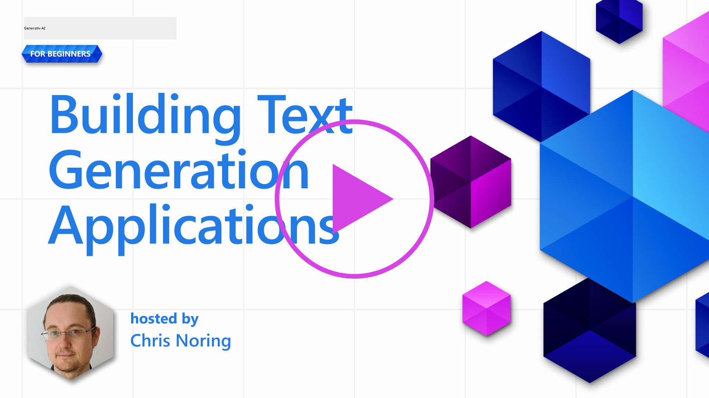

<!--
CO_OP_TRANSLATOR_METADATA:
{
  "original_hash": "df027997f1448323d6159b78a1b669bf",
  "translation_date": "2025-10-17T18:58:05+00:00",
  "source_file": "06-text-generation-apps/README.md",
  "language_code": "sv"
}
-->
# Bygga applikationer för textgenerering

[](https://youtu.be/0Y5Luf5sRQA?si=t_xVg0clnAI4oUFZ)

> _(Klicka på bilden ovan för att se videon för denna lektion)_

Du har hittills sett genom detta kursmaterial att det finns kärnkoncept som prompts och till och med en hel disciplin som kallas "prompt engineering". Många verktyg som du kan interagera med, som ChatGPT, Office 365, Microsoft Power Platform och fler, stödjer användning av prompts för att uppnå något.

För att lägga till en sådan upplevelse i en app behöver du förstå koncept som prompts, completions och välja ett bibliotek att arbeta med. Det är precis vad du kommer att lära dig i detta kapitel.

## Introduktion

I detta kapitel kommer du att:

- Lära dig om openai-biblioteket och dess kärnkoncept.
- Bygga en textgenereringsapp med openai.
- Förstå hur man använder koncept som prompt, temperatur och tokens för att bygga en textgenereringsapp.

## Lärandemål

I slutet av denna lektion kommer du att kunna:

- Förklara vad en textgenereringsapp är.
- Bygga en textgenereringsapp med openai.
- Konfigurera din app för att använda fler eller färre tokens och även ändra temperaturen för varierat resultat.

## Vad är en textgenereringsapp?

Vanligtvis när du bygger en app har den någon form av gränssnitt som följande:

- Kommando-baserad. Konsolappar är typiska appar där du skriver ett kommando och det utför en uppgift. Till exempel är `git` en kommando-baserad app.
- Användargränssnitt (UI). Vissa appar har grafiska användargränssnitt (GUIs) där du klickar på knappar, skriver in text, väljer alternativ och mer.

### Konsol- och UI-appar är begränsade

Jämför det med en kommando-baserad app där du skriver ett kommando:

- **Det är begränsat**. Du kan inte bara skriva vilket kommando som helst, endast de som appen stödjer.
- **Språkspecifikt**. Vissa appar stödjer många språk, men som standard är appen byggd för ett specifikt språk, även om du kan lägga till fler språkstöd.

### Fördelar med textgenereringsappar

Så hur skiljer sig en textgenereringsapp?

I en textgenereringsapp har du mer flexibilitet, du är inte begränsad till en uppsättning kommandon eller ett specifikt inmatningsspråk. Istället kan du använda naturligt språk för att interagera med appen. En annan fördel är att du redan interagerar med en datakälla som har tränats på en stor mängd information, medan en traditionell app kan vara begränsad till vad som finns i en databas.

### Vad kan jag bygga med en textgenereringsapp?

Det finns många saker du kan bygga. Till exempel:

- **En chatbot**. En chatbot som svarar på frågor om ämnen, som ditt företag och dess produkter, kan vara en bra idé.
- **Hjälpreda**. LLMs är bra på saker som att sammanfatta text, få insikter från text, producera text som CV och mer.
- **Kodassistent**. Beroende på vilken språkmodell du använder kan du bygga en kodassistent som hjälper dig att skriva kod. Till exempel kan du använda en produkt som GitHub Copilot samt ChatGPT för att hjälpa dig att skriva kod.

## Hur kan jag komma igång?

Du behöver hitta ett sätt att integrera med en LLM, vilket vanligtvis innebär följande två tillvägagångssätt:

- Använd en API. Här konstruerar du webbförfrågningar med din prompt och får genererad text tillbaka.
- Använd ett bibliotek. Bibliotek hjälper till att kapsla in API-anrop och göra dem enklare att använda.

## Bibliotek/SDKs

Det finns några välkända bibliotek för att arbeta med LLMs, som:

- **openai**, detta bibliotek gör det enkelt att ansluta till din modell och skicka in prompts.

Sedan finns det bibliotek som fungerar på en högre nivå, som:

- **Langchain**. Langchain är välkänt och stödjer Python.
- **Semantic Kernel**. Semantic Kernel är ett bibliotek från Microsoft som stödjer språken C#, Python och Java.

## Första appen med openai

Låt oss se hur vi kan bygga vår första app, vilka bibliotek vi behöver, hur mycket som krävs och så vidare.

### Installera openai

Det finns många bibliotek där ute för att interagera med OpenAI eller Azure OpenAI. Det är möjligt att använda många programmeringsspråk som C#, Python, JavaScript, Java och fler. Vi har valt att använda Python-biblioteket `openai`, så vi kommer att använda `pip` för att installera det.

```bash
pip install openai
```

### Skapa en resurs

Du behöver utföra följande steg:

- Skapa ett konto på Azure [https://azure.microsoft.com/free/](https://azure.microsoft.com/free/?WT.mc_id=academic-105485-koreyst).
- Få tillgång till Azure OpenAI. Gå till [https://learn.microsoft.com/azure/ai-services/openai/overview#how-do-i-get-access-to-azure-openai](https://learn.microsoft.com/azure/ai-services/openai/overview#how-do-i-get-access-to-azure-openai?WT.mc_id=academic-105485-koreyst) och ansök om tillgång.

  > [!NOTE]
  > Vid tidpunkten för skrivandet behöver du ansöka om tillgång till Azure OpenAI.

- Installera Python <https://www.python.org/>
- Ha skapat en Azure OpenAI Service-resurs. Se denna guide för hur man [skapar en resurs](https://learn.microsoft.com/azure/ai-services/openai/how-to/create-resource?pivots=web-portal?WT.mc_id=academic-105485-koreyst).

### Hitta API-nyckel och endpoint

Vid denna punkt behöver du tala om för ditt `openai`-bibliotek vilken API-nyckel som ska användas. För att hitta din API-nyckel, gå till avsnittet "Keys and Endpoint" i din Azure OpenAI-resurs och kopiera värdet "Key 1".


Nu när du har kopierat denna information, låt oss instruera biblioteken att använda den.

> [!NOTE]
> Det är värt att separera din API-nyckel från din kod. Du kan göra det genom att använda miljövariabler.
>
> - Ställ in miljövariabeln `OPENAI_API_KEY` till din API-nyckel.
>   `export OPENAI_API_KEY='sk-...'`

### Konfigurera Azure

Om du använder Azure OpenAI, här är hur du konfigurerar inställningarna:

```python
openai.api_type = 'azure'
openai.api_key = os.environ["OPENAI_API_KEY"]
openai.api_version = '2023-05-15'
openai.api_base = os.getenv("API_BASE")
```

Ovan ställer vi in följande:

- `api_type` till `azure`. Detta talar om för biblioteket att använda Azure OpenAI och inte OpenAI.
- `api_key`, detta är din API-nyckel som finns i Azure Portal.
- `api_version`, detta är versionen av API:t du vill använda. Vid tidpunkten för skrivandet är den senaste versionen `2023-05-15`.
- `api_base`, detta är API:ets endpoint. Du kan hitta det i Azure Portal bredvid din API-nyckel.

> [!NOTE] > `os.getenv` är en funktion som läser miljövariabler. Du kan använda den för att läsa miljövariabler som `OPENAI_API_KEY` och `API_BASE`. Ställ in dessa miljövariabler i din terminal eller genom att använda ett bibliotek som `dotenv`.

## Generera text

Sättet att generera text är att använda klassen `Completion`. Här är ett exempel:

```python
prompt = "Complete the following: Once upon a time there was a"

completion = openai.Completion.create(model="davinci-002", prompt=prompt)
print(completion.choices[0].text)
```

I koden ovan skapar vi ett completion-objekt och skickar in modellen vi vill använda och prompten. Sedan skriver vi ut den genererade texten.

### Chat completions

Hittills har du sett hur vi har använt `Completion` för att generera text. Men det finns en annan klass som heter `ChatCompletion` som är mer lämpad för chatbots. Här är ett exempel på hur man använder den:

```python
import openai

openai.api_key = "sk-..."

completion = openai.ChatCompletion.create(model="gpt-3.5-turbo", messages=[{"role": "user", "content": "Hello world"}])
print(completion.choices[0].message.content)
```

Mer om denna funktionalitet i ett kommande kapitel.

## Övning - din första textgenereringsapp

Nu när vi har lärt oss hur man ställer in och konfigurerar openai är det dags att bygga din första textgenereringsapp. För att bygga din app, följ dessa steg:

1. Skapa en virtuell miljö och installera openai:

   ```bash
   python -m venv venv
   source venv/bin/activate
   pip install openai
   ```

   > [!NOTE]
   > Om du använder Windows, skriv `venv\Scripts\activate` istället för `source venv/bin/activate`.

   > [!NOTE]
   > Hitta din Azure OpenAI-nyckel genom att gå till [https://portal.azure.com/](https://portal.azure.com/?WT.mc_id=academic-105485-koreyst) och sök efter `Open AI`, välj `Open AI resource` och välj sedan `Keys and Endpoint` och kopiera värdet `Key 1`.

1. Skapa en _app.py_-fil och ge den följande kod:

   ```python
   import openai

   openai.api_key = "<replace this value with your open ai key or Azure OpenAI key>"

   openai.api_type = 'azure'
   openai.api_version = '2023-05-15'
   openai.api_base = "<endpoint found in Azure Portal where your API key is>"
   deployment_name = "<deployment name>"

   # add your completion code
   prompt = "Complete the following: Once upon a time there was a"
   messages = [{"role": "user", "content": prompt}]

   # make completion
   completion = openai.chat.completions.create(model=deployment_name, messages=messages)

   # print response
   print(completion.choices[0].message.content)
   ```

   > [!NOTE]
   > Om du använder Azure OpenAI behöver du ställa in `api_type` till `azure` och ställa in `api_key` till din Azure OpenAI-nyckel.

   Du bör se ett resultat som liknar följande:

   ```output
    very unhappy _____.

   Once upon a time there was a very unhappy mermaid.
   ```

## Olika typer av prompts för olika saker

Nu har du sett hur man genererar text med en prompt. Du har till och med en programvara igång som du kan modifiera och ändra för att generera olika typer av text.

Prompts kan användas för alla möjliga uppgifter. Till exempel:

- **Generera en typ av text**. Till exempel kan du generera en dikt, frågor för ett quiz etc.
- **Söka information**. Du kan använda prompts för att söka efter information, som följande exempel: "Vad betyder CORS inom webbutveckling?".
- **Generera kod**. Du kan använda prompts för att generera kod, till exempel utveckla ett reguljärt uttryck som används för att validera e-postadresser eller varför inte generera ett helt program, som en webbapp?

## Ett mer praktiskt användningsfall: en receptgenerator

Föreställ dig att du har ingredienser hemma och vill laga något. För det behöver du ett recept. Ett sätt att hitta recept är att använda en sökmotor eller så kan du använda en LLM för att göra det.

Du kan skriva en prompt som så här:

> "Visa mig 5 recept för en maträtt med följande ingredienser: kyckling, potatis och morötter. För varje recept, lista alla ingredienser som används."

Givet ovanstående prompt kan du få ett svar som liknar:

```output
1. Roasted Chicken and Vegetables:
Ingredients:
- 4 chicken thighs
- 2 potatoes, cut into cubes
- 2 carrots, cut into cubes
- 2 tablespoons olive oil
- 2 cloves garlic, minced
- 1 teaspoon dried thyme
- 1 teaspoon dried oregano
- Salt and pepper, to taste

2. Chicken and Potato Stew:
Ingredients:
- 2 tablespoons olive oil
- 1 onion, diced
- 2 cloves garlic, minced
- 2 chicken breasts, cut into cubes
- 2 potatoes, cut into cubes
- 2 carrots, cut into cubes
- 1 teaspoon dried oregano
- 1 teaspoon dried thyme
- 1 cup chicken broth
- Salt and pepper, to taste

3. Chicken and Potato Bake:
Ingredients:
- 2 tablespoons olive oil
- 2 chicken breasts, cut into cubes
- 2 potatoes, cut into cubes
- 2 carrots, cut into cubes
- 1 onion, diced
- 2 cloves garlic, minced
- 1 teaspoon dried oregano
- 1 teaspoon dried thyme
- 1 cup chicken broth
- Salt and pepper, to taste

4. Chicken and Potato Soup:
Ingredients:
- 2 tablespoons olive oil
- 1 onion, diced
- 2 cloves garlic, minced
- 2 chicken breasts, cut into cubes
- 2 potatoes, cut into cubes
- 2 carrots, cut into cubes
- 1 teaspoon dried oregano
- 1 teaspoon dried thyme
- 4 cups chicken broth
- Salt and pepper, to taste

5. Chicken and Potato Hash:
Ingredients:
- 2 tablespoons olive oil
- 2 chicken breasts, cut into cubes
- 2 potatoes, cut into cubes
- 2 carrots, cut into cubes
- 1 onion, diced
- 2 cloves garlic, minced
- 1 teaspoon dried oregano
```

Detta resultat är fantastiskt, jag vet vad jag ska laga. Vid denna punkt kan användbara förbättringar vara:

- Filtrera bort ingredienser jag inte gillar eller är allergisk mot.
- Skapa en inköpslista, om jag inte har alla ingredienser hemma.

För ovanstående fall, låt oss lägga till en ytterligare prompt:

> "Ta bort recept med vitlök eftersom jag är allergisk och ersätt det med något annat. Skapa också en inköpslista för recepten, med tanke på att jag redan har kyckling, potatis och morötter hemma."

Nu har du ett nytt resultat, nämligen:

```output
1. Roasted Chicken and Vegetables:
Ingredients:
- 4 chicken thighs
- 2 potatoes, cut into cubes
- 2 carrots, cut into cubes
- 2 tablespoons olive oil
- 1 teaspoon dried thyme
- 1 teaspoon dried oregano
- Salt and pepper, to taste

2. Chicken and Potato Stew:
Ingredients:
- 2 tablespoons olive oil
- 1 onion, diced
- 2 chicken breasts, cut into cubes
- 2 potatoes, cut into cubes
- 2 carrots, cut into cubes
- 1 teaspoon dried oregano
- 1 teaspoon dried thyme
- 1 cup chicken broth
- Salt and pepper, to taste

3. Chicken and Potato Bake:
Ingredients:
- 2 tablespoons olive oil
- 2 chicken breasts, cut into cubes
- 2 potatoes, cut into cubes
- 2 carrots, cut into cubes
- 1 onion, diced
- 1 teaspoon dried oregano
- 1 teaspoon dried thyme
- 1 cup chicken broth
- Salt and pepper, to taste

4. Chicken and Potato Soup:
Ingredients:
- 2 tablespoons olive oil
- 1 onion, diced
- 2 chicken breasts, cut into cubes
- 2 potatoes, cut into cubes
- 2 carrots, cut into cubes
- 1 teaspoon dried oregano
- 1 teaspoon dried thyme
- 4 cups chicken broth
- Salt and pepper, to taste

5. Chicken and Potato Hash:
Ingredients:
- 2 tablespoons olive oil
- 2 chicken breasts, cut into cubes
- 2 potatoes, cut into cubes
- 2 carrots, cut into cubes
- 1 onion, diced
- 1 teaspoon dried oregano

Shopping List:
- Olive oil
- Onion
- Thyme
- Oregano
- Salt
- Pepper
```

Det är dina fem recept, utan vitlök nämnd och du har också en inköpslista med tanke på vad du redan har hemma.

## Övning - bygg en receptgenerator

Nu när vi har spelat ut ett scenario, låt oss skriva kod som matchar det demonstrerade scenariot. För att göra det, följ dessa steg:

1. Använd den befintliga _app.py_-filen som startpunkt.
1. Hitta variabeln `prompt` och ändra dess kod till följande:

   ```python
   prompt = "Show me 5 recipes for a dish with the following ingredients: chicken, potatoes, and carrots. Per recipe, list all the ingredients used"
   ```

   Om du nu kör koden bör du se ett resultat som liknar:

   ```output
   -Chicken Stew with Potatoes and Carrots: 3 tablespoons oil, 1 onion, chopped, 2 cloves garlic, minced, 1 carrot, peeled and chopped, 1 potato, peeled and chopped, 1 bay leaf, 1 thyme sprig, 1/2 teaspoon salt, 1/4 teaspoon black pepper, 1 1/2 cups chicken broth, 1/2 cup dry white wine, 2 tablespoons chopped fresh parsley, 2 tablespoons unsalted butter, 1 1/2 pounds boneless, skinless chicken thighs, cut into 1-inch pieces
   -Oven-Roasted Chicken with Potatoes and Carrots: 3 tablespoons extra-virgin olive oil, 1 tablespoon Dijon mustard, 1 tablespoon chopped fresh rosemary, 1 tablespoon chopped fresh thyme, 4 cloves garlic, minced, 1 1/2 pounds small red potatoes, quartered, 1 1/2 pounds carrots, quartered lengthwise, 1/2 teaspoon salt, 1/4 teaspoon black pepper, 1 (4-pound) whole chicken
   -Chicken, Potato, and Carrot Casserole: cooking spray, 1 large onion, chopped, 2 cloves garlic, minced, 1 carrot, peeled and shredded, 1 potato, peeled and shredded, 1/2 teaspoon dried thyme leaves, 1/4 teaspoon salt, 1/4 teaspoon black pepper, 2 cups fat-free, low-sodium chicken broth, 1 cup frozen peas, 1/4 cup all-purpose flour, 1 cup 2% reduced-fat milk, 1/4 cup grated Parmesan cheese

   -One Pot Chicken and Potato Dinner: 2 tablespoons olive oil, 1 pound boneless, skinless chicken thighs, cut into 1-inch pieces, 1 large onion, chopped, 3 cloves garlic, minced, 1 carrot, peeled and chopped, 1 potato, peeled and chopped, 1 bay leaf, 1 thyme sprig, 1/2 teaspoon salt, 1/4 teaspoon black pepper, 2 cups chicken broth, 1/2 cup dry white wine

   -Chicken, Potato, and Carrot Curry: 1 tablespoon vegetable oil, 1 large onion, chopped, 2 cloves garlic, minced, 1 carrot, peeled and chopped, 1 potato, peeled and chopped, 1 teaspoon ground coriander, 1 teaspoon ground cumin, 1/2 teaspoon ground turmeric, 1/2 teaspoon ground ginger, 1/4 teaspoon cayenne pepper, 2 cups chicken broth, 1/2 cup dry white wine, 1 (15-ounce) can chickpeas, drained and rinsed, 1/2 cup raisins, 1/2 cup chopped fresh cilantro
   ```

   > OBS, din LLM är icke-deterministisk, så du kan få olika resultat varje gång du kör programmet.

   Fantastiskt, låt oss se hur vi kan förbättra saker. För att förbättra saker vill vi se till att koden är flexibel, så att ingredienser och antal recept kan förbättras och ändras.

1. Låt oss ändra koden på följande sätt:

   ```python
   no_recipes = input("No of recipes (for example, 5): ")

   ingredients = input("List of ingredients (for example, chicken, potatoes, and carrots): ")

   # interpolate the number of recipes into the prompt an ingredients
   prompt = f"Show me {no_recipes} recipes for a dish with the following ingredients: {ingredients}. Per recipe, list all the ingredients used"
   ```

   Att testa koden kan se ut så här:

   ```output
   No of recipes (for example, 5): 3
   List of ingredients (for example, chicken, potatoes, and carrots): milk,strawberries

   -Strawberry milk shake: milk, strawberries, sugar, vanilla extract, ice cubes
   -Strawberry shortcake: milk, flour, baking powder, sugar, salt, unsalted butter, strawberries, whipped cream
   -Strawberry milk: milk, strawberries, sugar, vanilla extract
   ```

### Förbättra genom att lägga till filter och inköpslista

Vi har nu en fungerande app som kan producera recept och den är flexibel eftersom den förlitar sig på användarens inmatningar, både när det gäller antalet recept och de ingredienser som används.

För att ytterligare förbättra den vill vi lägga till följande:

- **Filtrera bort ingredienser**. Vi vill kunna filtrera bort ingredienser vi inte gillar eller är allergiska mot. För att genomföra denna förändring kan vi redigera vår befintliga prompt och lägga till ett filtervillkor i slutet av den, som så här:

  ```python
  filter = input("Filter (for example, vegetarian, vegan, or gluten-free): ")

  prompt = f"Show me {no_recipes} recipes for a dish with the following ingredients: {ingredients}. Per recipe, list all the ingredients used, no {filter}"
  ```

  Ovan lägger vi till `{filter}` i slutet av prompten och vi fångar också upp filtervärdet från användaren.

  Ett exempel på inmatning när programmet körs kan nu se ut så här:

  ```output
  No of recipes (for example, 5): 3
  List of ingredients (for example, chicken, potatoes, and carrots): onion,milk
  Filter (for example, vegetarian, vegan, or gluten-free): no milk

  1. French Onion Soup

  Ingredients:

  -1 large onion, sliced
  -3 cups beef broth
  -1 cup milk
  -6 slices french bread
  -1/4 cup shredded Parmesan cheese
  -1 tablespoon butter
  -1 teaspoon dried thyme
  -1/4 teaspoon salt
  -1/4 teaspoon black pepper

  Instructions:

  1. In a large pot, sauté onions in butter until golden brown.
  2. Add beef broth, milk, thyme, salt, and pepper. Bring to a boil.
  3. Reduce heat and simmer for 10 minutes.
  4. Place french bread slices on soup bowls.
  5. Ladle soup over bread.
  6. Sprinkle with Parmesan cheese.

  2. Onion and Potato Soup

  Ingredients:

  -1 large onion, chopped
  -2 cups potatoes, diced
  -3 cups vegetable broth
  -1 cup milk
  -1/4 teaspoon black pepper

  Instructions:

  1. In a large pot, sauté onions in butter until golden brown.
  2. Add potatoes, vegetable broth, milk, and pepper. Bring to a boil.
  3. Reduce heat and simmer for 10 minutes.
  4. Serve hot.

  3. Creamy Onion Soup

  Ingredients:

  -1 large onion, chopped
  -3 cups vegetable broth
  -1 cup milk
  -1/4 teaspoon black pepper
  -1/4 cup all-purpose flour
  -1/2 cup shredded Parmesan cheese

  Instructions:

  1. In a large pot, sauté onions in butter until golden brown.
  2. Add vegetable broth, milk, and pepper. Bring to a boil.
  3. Reduce heat and simmer for 10 minutes.
  4. In a small bowl, whisk together flour and Parmesan cheese until smooth.
  5. Add to soup and simmer for an additional 5 minutes, or until soup has thickened.
  ```

  Som du kan se har alla recept med mjölk filtrerats bort. Men om du är laktosintolerant kanske du också vill filtrera bort recept med ost, så det finns ett behov av att vara tydlig.

- **Skapa en inköpslista**. Vi vill skapa en inköpslista med tanke på vad vi redan har hemma.

  För denna funktionalitet kan vi antingen försöka lösa allt i en prompt eller dela upp det i två prompts. Låt oss prova det senare tillvägagångssättet. Här föreslår vi att lägga till en ytterligare prompt, men för att det ska fungera behöver vi lägga till resultatet från den första prompten som kontext till den andra prompten.

  Hitta delen i koden som skriver ut resultatet från den första prompten och lägg till följande kod nedanför:
  ```python
  old_prompt_result = completion.choices[0].message.content
  prompt = "Produce a shopping list for the generated recipes and please don't include ingredients that I already have."

  new_prompt = f"{old_prompt_result} {prompt}"
  messages = [{"role": "user", "content": new_prompt}]
  completion = openai.Completion.create(engine=deployment_name, messages=messages, max_tokens=1200)

  # print response
  print("Shopping list:")
  print(completion.choices[0].message.content)
  ```

  Notera följande:

  1. Vi skapar en ny prompt genom att lägga till resultatet från den första prompten till den nya prompten:

     ```python
     new_prompt = f"{old_prompt_result} {prompt}"
     ```

  1. Vi gör en ny förfrågan, men tar också hänsyn till antalet tokens vi bad om i den första prompten, så den här gången anger vi att `max_tokens` är 1200.

     ```python
     completion = openai.Completion.create(engine=deployment_name, prompt=new_prompt, max_tokens=1200)
     ```

     När vi testar den här koden får vi nu följande resultat:

     ```output
     No of recipes (for example, 5): 2
     List of ingredients (for example, chicken, potatoes, and carrots): apple,flour
     Filter (for example, vegetarian, vegan, or gluten-free): sugar


     -Apple and flour pancakes: 1 cup flour, 1/2 tsp baking powder, 1/2 tsp baking soda, 1/4 tsp salt, 1 tbsp sugar, 1 egg, 1 cup buttermilk or sour milk, 1/4 cup melted butter, 1 Granny Smith apple, peeled and grated
     -Apple fritters: 1-1/2 cups flour, 1 tsp baking powder, 1/4 tsp salt, 1/4 tsp baking soda, 1/4 tsp nutmeg, 1/4 tsp cinnamon, 1/4 tsp allspice, 1/4 cup sugar, 1/4 cup vegetable shortening, 1/4 cup milk, 1 egg, 2 cups shredded, peeled apples
     Shopping list:
     -Flour, baking powder, baking soda, salt, sugar, egg, buttermilk, butter, apple, nutmeg, cinnamon, allspice
     ```

## Förbättra din uppsättning

Det vi har hittills är kod som fungerar, men det finns några justeringar vi bör göra för att förbättra saker ytterligare. Några saker vi bör göra är:

- **Separera hemligheter från koden**, som API-nyckeln. Hemligheter hör inte hemma i koden och bör lagras på en säker plats. För att separera hemligheter från koden kan vi använda miljövariabler och bibliotek som `python-dotenv` för att ladda dem från en fil. Så här kan det se ut i koden:

  1. Skapa en `.env`-fil med följande innehåll:

     ```bash
     OPENAI_API_KEY=sk-...
     ```

     > Notera, för Azure behöver du ställa in följande miljövariabler:

     ```bash
     OPENAI_API_TYPE=azure
     OPENAI_API_VERSION=2023-05-15
     OPENAI_API_BASE=<replace>
     ```

     I koden skulle du ladda miljövariablerna så här:

     ```python
     from dotenv import load_dotenv

     load_dotenv()

     openai.api_key = os.environ["OPENAI_API_KEY"]
     ```

- **Ett ord om tokenlängd**. Vi bör överväga hur många tokens vi behöver för att generera den text vi vill ha. Tokens kostar pengar, så där det är möjligt bör vi försöka vara ekonomiska med antalet tokens vi använder. Till exempel, kan vi formulera prompten så att vi kan använda färre tokens?

  För att ändra antalet tokens som används kan du använda parametern `max_tokens`. Till exempel, om du vill använda 100 tokens, skulle du göra:

  ```python
  completion = client.chat.completions.create(model=deployment, messages=messages, max_tokens=100)
  ```

- **Experimentera med temperatur**. Temperatur är något vi inte har nämnt hittills men är en viktig faktor för hur vårt program presterar. Ju högre temperaturvärde, desto mer slumpmässigt blir resultatet. Omvänt, ju lägre temperaturvärde, desto mer förutsägbart blir resultatet. Fundera på om du vill ha variation i ditt resultat eller inte.

  För att ändra temperaturen kan du använda parametern `temperature`. Till exempel, om du vill använda en temperatur på 0,5, skulle du göra:

  ```python
  completion = client.chat.completions.create(model=deployment, messages=messages, temperature=0.5)
  ```

  > Notera, ju närmare 1,0, desto mer varierat blir resultatet.

## Uppgift

För den här uppgiften kan du välja vad du vill bygga.

Här är några förslag:

- Justera receptgeneratorappen för att förbättra den ytterligare. Experimentera med temperaturvärden och promptar för att se vad du kan komma fram till.
- Bygg en "studiekompis". Den här appen ska kunna svara på frågor om ett ämne, till exempel Python. Du kan ha promptar som "Vad är ett visst ämne i Python?", eller en prompt som säger "Visa mig kod för ett visst ämne" etc.
- Historiebot, få historien att komma till liv, instruera boten att spela en viss historisk person och ställ frågor om dess liv och tid.

## Lösning

### Studiekompis

Nedan är en startprompt, se hur du kan använda den och anpassa den efter dina önskemål.

```text
- "You're an expert on the Python language

    Suggest a beginner lesson for Python in the following format:

    Format:
    - concepts:
    - brief explanation of the lesson:
    - exercise in code with solutions"
```

### Historiebot

Här är några promptar du kan använda:

```text
- "You are Abe Lincoln, tell me about yourself in 3 sentences, and respond using grammar and words like Abe would have used"
- "You are Abe Lincoln, respond using grammar and words like Abe would have used:

   Tell me about your greatest accomplishments, in 300 words"
```

## Kunskapskontroll

Vad gör konceptet temperatur?

1. Det styr hur slumpmässigt resultatet är.
1. Det styr hur stort svaret är.
1. Det styr hur många tokens som används.

## 🚀 Utmaning

När du arbetar med uppgiften, försök att variera temperaturen, prova att sätta den till 0, 0,5 och 1. Kom ihåg att 0 är minst varierat och 1 är mest. Vilket värde fungerar bäst för din app?

## Bra jobbat! Fortsätt att lära dig

Efter att ha slutfört den här lektionen, kolla in vår [Generative AI Learning collection](https://aka.ms/genai-collection?WT.mc_id=academic-105485-koreyst) för att fortsätta utveckla din kunskap om Generative AI!

Gå vidare till Lektion 7 där vi kommer att titta på hur man [bygger chattapplikationer](../07-building-chat-applications/README.md?WT.mc_id=academic-105485-koreyst)!

---

**Ansvarsfriskrivning**:  
Detta dokument har översatts med hjälp av AI-översättningstjänsten [Co-op Translator](https://github.com/Azure/co-op-translator). Även om vi strävar efter noggrannhet, bör det noteras att automatiserade översättningar kan innehålla fel eller felaktigheter. Det ursprungliga dokumentet på dess ursprungliga språk bör betraktas som den auktoritativa källan. För kritisk information rekommenderas professionell mänsklig översättning. Vi ansvarar inte för eventuella missförstånd eller feltolkningar som uppstår vid användning av denna översättning.