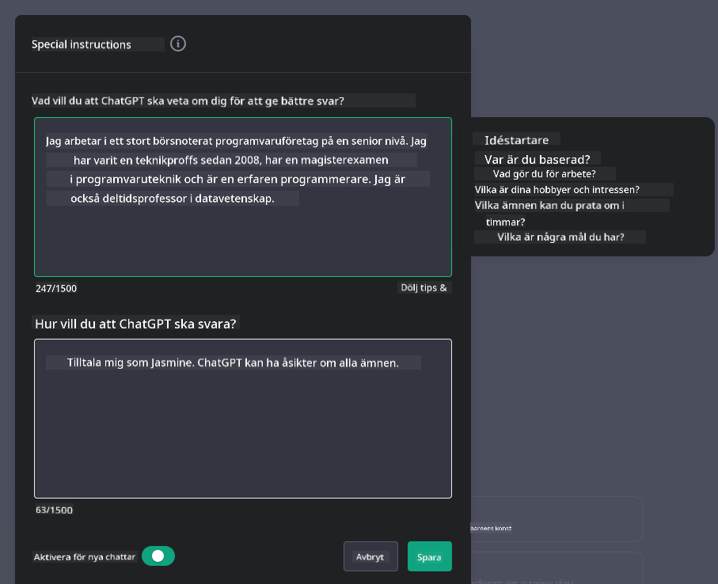

<!--
CO_OP_TRANSLATOR_METADATA:
{
  "original_hash": "ea4bbe640847aafbbba14dae4625e9af",
  "translation_date": "2025-07-09T12:30:33+00:00",
  "source_file": "07-building-chat-applications/README.md",
  "language_code": "sv"
}
-->
# Bygga Generativa AI-drivna Chattapplikationer

[](https://aka.ms/gen-ai-lessons7-gh?WT.mc_id=academic-105485-koreyst)

> _(Klicka på bilden ovan för att se videon för denna lektion)_

Nu när vi har sett hur vi kan bygga textgenereringsappar, låt oss titta närmare på chattapplikationer.

Chattapplikationer har blivit en integrerad del av vår vardag och erbjuder mer än bara ett sätt för avslappnade samtal. De är viktiga delar av kundservice, teknisk support och till och med avancerade rådgivningssystem. Det är troligt att du nyligen fått hjälp från en chattapplikation. När vi integrerar mer avancerad teknik som generativ AI i dessa plattformar ökar komplexiteten – och utmaningarna.

Några frågor vi behöver få svar på är:

- **Bygga appen**. Hur bygger vi effektivt och integrerar sömlöst dessa AI-drivna applikationer för specifika användningsområden?
- **Övervakning**. När de väl är implementerade, hur kan vi övervaka och säkerställa att applikationerna fungerar med högsta kvalitet, både vad gäller funktionalitet och efterlevnad av [de sex principerna för ansvarsfull AI](https://www.microsoft.com/ai/responsible-ai?WT.mc_id=academic-105485-koreyst)?

När vi går vidare in i en era präglad av automation och sömlösa människa-maskin-interaktioner blir det avgörande att förstå hur generativ AI förändrar omfattningen, djupet och anpassningsförmågan hos chattapplikationer. Denna lektion kommer att undersöka arkitekturens aspekter som stödjer dessa komplexa system, fördjupa sig i metoder för finjustering för domänspecifika uppgifter och utvärdera mätvärden och överväganden som är viktiga för att säkerställa ansvarsfull AI-implementering.

## Introduktion

Denna lektion täcker:

- Tekniker för att effektivt bygga och integrera chattapplikationer.
- Hur man anpassar och finjusterar applikationer.
- Strategier och överväganden för att effektivt övervaka chattapplikationer.

## Lärandemål

I slutet av denna lektion kommer du att kunna:

- Beskriva överväganden för att bygga och integrera chattapplikationer i befintliga system.
- Anpassa chattapplikationer för specifika användningsområden.
- Identifiera viktiga mätvärden och överväganden för att effektivt övervaka och upprätthålla kvaliteten på AI-drivna chattapplikationer.
- Säkerställa att chattapplikationer använder AI på ett ansvarsfullt sätt.

## Integrera Generativ AI i Chattapplikationer

Att lyfta chattapplikationer med generativ AI handlar inte bara om att göra dem smartare; det handlar om att optimera deras arkitektur, prestanda och användargränssnitt för att leverera en kvalitativ användarupplevelse. Detta innebär att undersöka arkitekturens grunder, API-integrationer och användargränssnittets aspekter. Denna sektion syftar till att ge dig en heltäckande vägledning för att navigera i dessa komplexa områden, oavsett om du kopplar in dem i befintliga system eller bygger dem som fristående plattformar.

I slutet av denna sektion kommer du att ha den expertis som krävs för att effektivt konstruera och integrera chattapplikationer.

### Chatbot eller Chattapplikation?

Innan vi går in på att bygga chattapplikationer, låt oss jämföra 'chatbots' med 'AI-drivna chattapplikationer', som fyller olika roller och funktioner. En chatbot har som huvudsyfte att automatisera specifika konversationsuppgifter, som att svara på vanliga frågor eller spåra ett paket. Den styrs vanligtvis av regelbaserad logik eller komplexa AI-algoritmer. I kontrast är en AI-driven chattapplikation en mycket mer omfattande miljö som är utformad för att möjliggöra olika former av digital kommunikation, såsom text-, röst- och videosamtal mellan människor. Dess kännetecken är integrationen av en generativ AI-modell som simulerar nyanserade, människoliknande samtal och genererar svar baserat på en mängd olika indata och kontextuella ledtrådar. En generativ AI-driven chattapplikation kan delta i öppna diskussioner, anpassa sig till förändrade samtalskontexter och till och med skapa kreativa eller komplexa dialoger.

Tabellen nedan visar de viktigaste skillnaderna och likheterna för att hjälpa oss förstå deras unika roller i digital kommunikation.

| Chatbot                               | Generativ AI-Drivna Chattapplikationer |
| ------------------------------------- | -------------------------------------- |
| Uppgiftsfokuserad och regelbaserad    | Kontextmedveten                        |
| Ofta integrerad i större system       | Kan vara värd för en eller flera chatbots |
| Begränsad till programmerade funktioner | Innehåller generativa AI-modeller      |
| Specialiserade och strukturerade interaktioner | Kapabel till öppna diskussioner         |

### Utnyttja färdiga funktioner med SDK:er och API:er

När du bygger en chattapplikation är ett bra första steg att undersöka vad som redan finns. Att använda SDK:er och API:er för att bygga chattapplikationer är en fördelaktig strategi av flera skäl. Genom att integrera väl dokumenterade SDK:er och API:er positionerar du din applikation strategiskt för långsiktig framgång och tar itu med skalbarhets- och underhållsfrågor.

- **Påskyndar utvecklingsprocessen och minskar arbetsbördan**: Att förlita sig på färdiga funktioner istället för att bygga dem själv sparar tid och låter dig fokusera på andra viktiga delar av din applikation, som affärslogik.
- **Bättre prestanda**: När du bygger funktionalitet från grunden kommer du förr eller senare att fråga dig själv "Hur skalar detta? Klarar applikationen en plötslig ökning av användare?" Väl underhållna SDK:er och API:er har ofta inbyggda lösningar för dessa utmaningar.
- **Enklare underhåll**: Uppdateringar och förbättringar är lättare att hantera eftersom de flesta API:er och SDK:er bara kräver en uppdatering av ett bibliotek när en ny version släpps.
- **Tillgång till den senaste tekniken**: Genom att använda modeller som har finjusterats och tränats på omfattande dataset får din applikation avancerade språkliga förmågor.

Tillgång till funktionaliteten i ett SDK eller API innebär vanligtvis att man får tillstånd att använda de tillhandahållna tjänsterna, ofta genom en unik nyckel eller autentiseringstoken. Vi kommer att använda OpenAI Python Library för att visa hur detta ser ut. Du kan också prova själv i följande [notebook för OpenAI](python/oai-assignment.ipynb) eller [notebook för Azure OpenAI Services](python/aoai-assignment.ipynb) för denna lektion.

```python
import os
from openai import OpenAI

API_KEY = os.getenv("OPENAI_API_KEY","")

client = OpenAI(
    api_key=API_KEY
    )

chat_completion = client.chat.completions.create(model="gpt-3.5-turbo", messages=[{"role": "user", "content": "Suggest two titles for an instructional lesson on chat applications for generative AI."}])
```

Exemplet ovan använder GPT-3.5 Turbo-modellen för att slutföra prompten, men notera att API-nyckeln måste vara inställd innan. Du skulle få ett felmeddelande om du inte satte nyckeln.

## Användarupplevelse (UX)

Generella UX-principer gäller för chattapplikationer, men här är några ytterligare överväganden som blir särskilt viktiga på grund av de maskininlärningskomponenter som ingår.

- **Mekanism för att hantera tvetydighet**: Generativa AI-modeller kan ibland generera otydliga svar. En funktion som låter användare be om förtydligande kan vara till hjälp om de stöter på detta problem.
- **Behållande av kontext**: Avancerade generativa AI-modeller kan komma ihåg kontext inom en konversation, vilket kan vara en viktig tillgång för användarupplevelsen. Att ge användare möjlighet att kontrollera och hantera kontext förbättrar upplevelsen, men medför också risken att känslig användarinformation sparas. Överväganden kring hur länge denna information lagras, till exempel genom att införa en lagringspolicy, kan balansera behovet av kontext mot integritet.
- **Personalisering**: Med förmågan att lära och anpassa sig erbjuder AI-modeller en individanpassad upplevelse för användaren. Att skräddarsy användarupplevelsen genom funktioner som användarprofiler gör inte bara att användaren känner sig förstådd, utan hjälper också till att hitta specifika svar, vilket skapar en mer effektiv och tillfredsställande interaktion.

Ett exempel på personalisering är inställningen "Custom instructions" i OpenAI:s ChatGPT. Den låter dig ge information om dig själv som kan vara viktig kontext för dina prompts. Här är ett exempel på en anpassad instruktion.



Denna "profil" uppmanar ChatGPT att skapa en lektionsplan om länkade listor. Notera att ChatGPT tar hänsyn till att användaren kan vilja ha en mer djupgående lektionsplan baserat på hennes erfarenhet.


### Microsofts Systemmeddelanderamverk för Stora Språkmodeller

[Microsoft har gett riktlinjer](https://learn.microsoft.com/azure/ai-services/openai/concepts/system-message#define-the-models-output-format?WT.mc_id=academic-105485-koreyst) för att skriva effektiva systemmeddelanden vid generering av svar från LLM:er, uppdelade i fyra områden:

1. Definiera vem modellen är för, samt dess kapabiliteter och begränsningar.
2. Definiera modellens utdataformat.
3. Ge specifika exempel som visar modellens avsedda beteende.
4. Tillhandahålla ytterligare beteendemässiga skyddsåtgärder.

### Tillgänglighet

Oavsett om en användare har syn-, hörsel-, motoriska eller kognitiva funktionsnedsättningar bör en väl utformad chattapplikation vara användbar för alla. Följande lista beskriver specifika funktioner som syftar till att förbättra tillgängligheten för olika användargrupper.

- **Funktioner för synnedsättning**: Teman med hög kontrast och justerbar textstorlek, kompatibilitet med skärmläsare.
- **Funktioner för hörselnedsättning**: Text-till-tal och tal-till-text-funktioner, visuella signaler för ljudnotiser.
- **Funktioner för motoriska funktionsnedsättningar**: Stöd för tangentbordsnavigering, röstkommandon.
- **Funktioner för kognitiva funktionsnedsättningar**: Förenklade språkval.

## Anpassning och Finjustering för Domänspecifika Språkmodeller

Föreställ dig en chattapplikation som förstår ditt företags jargong och förutser de specifika frågor som dess användarbas ofta har. Det finns några tillvägagångssätt värda att nämna:

- **Utnyttja DSL-modeller**. DSL står för domain specific language (domänspecifikt språk). Du kan använda en så kallad DSL-modell som är tränad på ett specifikt område för att förstå dess begrepp och scenarier.
- **Applicera finjustering**. Finjustering är processen att vidareutbilda din modell med specifik data.

## Anpassning: Använda en DSL

Att använda domänspecifika språkmodeller (DSL-modeller) kan förbättra användarengagemanget genom att erbjuda specialiserade, kontextuellt relevanta interaktioner. Det är en modell som är tränad eller finjusterad för att förstå och generera text relaterad till ett specifikt område, bransch eller ämne. Alternativ för att använda en DSL-modell kan variera från att träna en från grunden till att använda befintliga via SDK:er och API:er. Ett annat alternativ är finjustering, vilket innebär att man tar en befintlig förtränad modell och anpassar den för ett specifikt område.

## Anpassning: Applicera finjustering

Finjustering övervägs ofta när en förtränad modell inte räcker till inom ett specialiserat område eller för en specifik uppgift.

Till exempel är medicinska frågor komplexa och kräver mycket kontext. När en medicinsk expert ställer en diagnos baseras det på en mängd faktorer som livsstil eller tidigare sjukdomar, och kan även förlita sig på senaste medicinska publikationer för att bekräfta diagnosen. I sådana nyanserade scenarier kan en allmän AI-chattapplikation inte vara en pålitlig källa.

### Scenario: en medicinsk applikation

Tänk dig en chattapplikation som är utformad för att hjälpa medicinska yrkespersoner genom att snabbt ge referenser till behandlingsriktlinjer, läkemedelsinteraktioner eller senaste forskningsresultat.

En allmän modell kan vara tillräcklig för att svara på grundläggande medicinska frågor eller ge allmänna råd, men kan ha svårt med följande:

- **Mycket specifika eller komplexa fall**. Till exempel kan en neurolog fråga applikationen: "Vilka är de nuvarande bästa metoderna för att hantera läkemedelsresistent epilepsi hos barn?"
- **Brist på senaste framsteg**. En allmän modell kan ha svårt att ge ett aktuellt svar som inkluderar de senaste framstegen inom neurologi och farmakologi.

I sådana fall kan finjustering av modellen med ett specialiserat medicinskt dataset avsevärt förbättra dess förmåga att hantera dessa komplexa medicinska frågor mer exakt och pålitligt. Detta kräver tillgång till en stor och relevant datamängd som representerar de domänspecifika utmaningarna och frågorna som behöver besvaras.

## Överväganden för en Högkvalitativ AI-Drivna Chattupplevelse

Denna sektion beskriver kriterierna för "högkvalitativa" chattapplikationer, vilket inkluderar insamling av användbara mätvärden och efterlevnad av en ram som ansvarsfullt utnyttjar AI-teknik.

### Viktiga Mätvärden

För att upprätthålla högkvalitativ prestanda i en applikation är det viktigt att följa upp viktiga mätvärden och överväganden. Dessa mätningar säkerställer inte bara applikationens funktionalitet utan bedömer också kvaliteten på AI-modellen och användarupplevelsen. Nedan följer en lista över grundläggande, AI- och användarupplevelsemått att ta hänsyn till.

| Mätvärde                     | Definition                                                                                                             | Överväganden för Chattutvecklare                                   |
| ---------------------------- | ---------------------------------------------------------------------------------------------------------------------- | ------------------------------------------------------------------ |
| **Drifttid (Uptime)**        | Mäter den tid applikationen är i drift och tillgänglig för användare.                                                  | Hur minimerar du driftstopp?                                       |
| **Svarstid**                 | Tiden det tar för applikationen att svara på en användares fråga.                                                      | Hur kan du optimera frågehanteringen för att förbättra svarstiden? |
| **Precision**                | Andelen korrekta positiva förutsägelser av det totala antalet positiva förutsägelser.                                 | Hur validerar du modellens precision?                              |
| **Recall (Känslighet)**      | Andelen korrekta positiva förutsägelser av det faktiska antalet positiva fall.                                        | Hur mäter och förbättrar du recall?                               |
| **F1-poäng**                 | Det harmoniska medelvärdet av precision och recall, som balanserar avvägningen mellan båda.                            | Vad är ditt mål för F1-poäng? Hur balanserar du precision och recall? |
| **Perplexity**               | Mäter hur väl sannolikhetsfördelningen som modellen förutspår stämmer överens med den faktiska datadistributionen.     | Hur minimerar du perplexity?                                       |
| **Användartillfredsställelse** | Mäter användarens uppfattning om applikationen. Samlas ofta in via enkäter.                                            | Hur ofta samlar du in användarfeedback? Hur anpassar du dig efter den? |
| **Felprocent**               | Andelen fel som modellen gör i förståelse eller utdata.                                                                | Vilka strategier har du för att minska felprocenten?              |
| **Omträningscykler**        | Hur ofta modellen uppdateras för att inkludera ny data och insikter.                                                  | Hur ofta omtränar du modellen? Vad triggar en omträningscykel?    |
| **Anomalidetektion**         | Verktyg och tekniker för att identifiera ovanliga mönster som inte följer förväntat beteende.                        | Hur kommer du att hantera anomalier?                                        |

### Implementera Ansvarsfull AI i Chattapplikationer

Microsofts syn på Ansvarsfull AI har identifierat sex principer som bör styra AI-utveckling och användning. Nedan följer principerna, deras definition samt vad en chattutvecklare bör tänka på och varför det är viktigt att ta dem på allvar.

| Principer              | Microsofts definition                                  | Att tänka på för chattutvecklare                                      | Varför det är viktigt                                                                |
| ---------------------- | ----------------------------------------------------- | -------------------------------------------------------------------- | ------------------------------------------------------------------------------------ |
| Rättvisa               | AI-system ska behandla alla människor rättvist.       | Säkerställ att chattapplikationen inte diskriminerar baserat på användardata. | För att bygga förtroende och inkludering bland användare; undviker juridiska konsekvenser. |
| Tillförlitlighet och säkerhet | AI-system ska fungera pålitligt och säkert.          | Implementera tester och säkerhetsåtgärder för att minimera fel och risker. | Säkerställer användarnöjdhet och förhindrar potentiell skada.                        |
| Integritet och säkerhet | AI-system ska vara säkra och respektera integritet.    | Använd stark kryptering och dataskyddsåtgärder.                      | För att skydda känslig användardata och följa integritetslagar.                      |
| Inkludering            | AI-system ska stärka alla och engagera människor.      | Designa UI/UX som är tillgängligt och lättanvänt för olika målgrupper. | Säkerställer att fler kan använda applikationen effektivt.                           |
| Transparens            | AI-system ska vara begripliga.                          | Ge tydlig dokumentation och förklaringar till AI:s svar.             | Användare litar mer på ett system om de förstår hur beslut fattas.                   |
| Ansvarstagande         | Människor ska hållas ansvariga för AI-system.           | Etablera en tydlig process för granskning och förbättring av AI-beslut. | Möjliggör kontinuerlig förbättring och korrigering vid misstag.                     |

## Uppgift

Se [assignment](../../../07-building-chat-applications/python) som tar dig igenom en serie övningar från att köra dina första chattpromptar, till att klassificera och sammanfatta text med mera. Observera att uppgifterna finns tillgängliga på olika programmeringsspråk!

## Bra jobbat! Fortsätt resan

Efter att ha slutfört denna lektion, kolla in vår [Generative AI Learning collection](https://aka.ms/genai-collection?WT.mc_id=academic-105485-koreyst) för att fortsätta utveckla dina kunskaper inom Generativ AI!

Gå vidare till Lektion 8 för att se hur du kan börja [bygga sökapplikationer](../08-building-search-applications/README.md?WT.mc_id=academic-105485-koreyst)!

**Ansvarsfriskrivning**:  
Detta dokument har översatts med hjälp av AI-översättningstjänsten [Co-op Translator](https://github.com/Azure/co-op-translator). Även om vi strävar efter noggrannhet, vänligen observera att automatiska översättningar kan innehålla fel eller brister. Det ursprungliga dokumentet på dess modersmål bör betraktas som den auktoritativa källan. För kritisk information rekommenderas professionell mänsklig översättning. Vi ansvarar inte för några missförstånd eller feltolkningar som uppstår till följd av användningen av denna översättning.