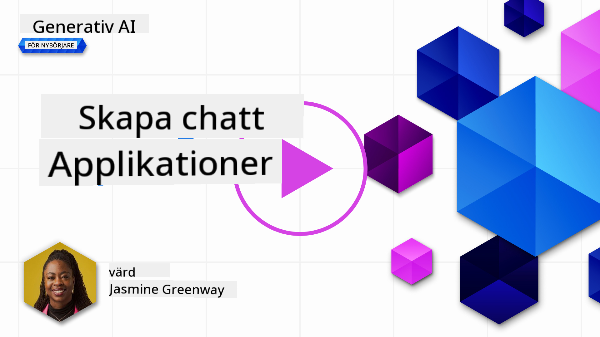

<!--
CO_OP_TRANSLATOR_METADATA:
{
  "original_hash": "ea4bbe640847aafbbba14dae4625e9af",
  "translation_date": "2025-05-19T17:53:20+00:00",
  "source_file": "07-building-chat-applications/README.md",
  "language_code": "sv"
}
-->
# Bygga generativa AI-drivna chattapplikationer

[](https://aka.ms/gen-ai-lessons7-gh?WT.mc_id=academic-105485-koreyst)

> _(Klicka på bilden ovan för att se videon av denna lektion)_

Nu när vi har sett hur vi kan bygga textgenereringsappar, låt oss titta på chattapplikationer.

Chattapplikationer har blivit en integrerad del av våra dagliga liv och erbjuder mer än bara ett sätt för avslappnad konversation. De är viktiga delar av kundservice, teknisk support och till och med sofistikerade rådgivningssystem. Det är troligt att du har fått hjälp från en chattapplikation inte så länge sedan. När vi integrerar mer avancerade teknologier som generativ AI i dessa plattformar, ökar komplexiteten och därmed också utmaningarna.

Några frågor vi behöver svar på är:

- **Bygga appen**. Hur bygger vi effektivt och integrerar sömlöst dessa AI-drivna applikationer för specifika användningsområden?
- **Övervakning**. När de är implementerade, hur kan vi övervaka och säkerställa att applikationerna fungerar på högsta kvalitetsnivå, både vad gäller funktionalitet och att följa de [sex principerna för ansvarsfull AI](https://www.microsoft.com/ai/responsible-ai?WT.mc_id=academic-105485-koreyst)?

När vi går vidare in i en era definierad av automation och sömlös interaktion mellan människa och maskin, blir det viktigt att förstå hur generativ AI förändrar omfattningen, djupet och anpassningsförmågan hos chattapplikationer. Denna lektion kommer att undersöka aspekterna av arkitektur som stöder dessa komplexa system, gå in på metoder för att finjustera dem för domänspecifika uppgifter och utvärdera de mätvärden och överväganden som är relevanta för att säkerställa ansvarsfull AI-implementering.

## Introduktion

Denna lektion täcker:

- Tekniker för effektivt byggande och integrering av chattapplikationer.
- Hur man tillämpar anpassning och finjustering på applikationer.
- Strategier och överväganden för att effektivt övervaka chattapplikationer.

## Lärandemål

I slutet av denna lektion kommer du att kunna:

- Beskriva överväganden för att bygga och integrera chattapplikationer i befintliga system.
- Anpassa chattapplikationer för specifika användningsområden.
- Identifiera nyckelmätvärden och överväganden för att effektivt övervaka och upprätthålla kvaliteten på AI-drivna chattapplikationer.
- Säkerställa att chattapplikationer använder AI ansvarsfullt.

## Integrera generativ AI i chattapplikationer

Att höja chattapplikationer genom generativ AI handlar inte bara om att göra dem smartare; det handlar om att optimera deras arkitektur, prestanda och användargränssnitt för att leverera en kvalitetsanvändarupplevelse. Detta involverar att undersöka de arkitektoniska grunderna, API-integreringar och överväganden för användargränssnitt. Denna sektion syftar till att erbjuda dig en omfattande vägkarta för att navigera dessa komplexa landskap, oavsett om du ansluter dem till befintliga system eller bygger dem som fristående plattformar.

I slutet av denna sektion kommer du att vara utrustad med den expertis som behövs för att effektivt konstruera och inkorporera chattapplikationer.

### Chatbot eller chattapplikation?

Innan vi dyker in i att bygga chattapplikationer, låt oss jämföra 'chatbots' mot 'AI-drivna chattapplikationer,' som har olika roller och funktioner. En chatbots huvudsakliga syfte är att automatisera specifika konversationsuppgifter, såsom att svara på vanliga frågor eller spåra ett paket. Den styrs vanligtvis av regelbaserad logik eller komplexa AI-algoritmer. I kontrast är en AI-driven chattapplikation en mycket mer expansiv miljö designad för att underlätta olika former av digital kommunikation, såsom text, röst och videochattar mellan mänskliga användare. Dess definierande egenskap är integrationen av en generativ AI-modell som simulerar nyanserade, mänskliga samtal, genererar svar baserat på en mängd olika input och kontextuella ledtrådar. En generativ AI-driven chattapplikation kan engagera sig i öppna domändiskussioner, anpassa sig till föränderliga samtalskontexter och till och med producera kreativ eller komplex dialog.

Tabellen nedan beskriver de viktigaste skillnaderna och likheterna för att hjälpa oss förstå deras unika roller i digital kommunikation.

| Chatbot                               | Generativ AI-driven chattapplikation   |
| ------------------------------------- | -------------------------------------- |
| Uppgiftsfokuserad och regelbaserad    | Kontextmedveten                        |
| Ofta integrerad i större system       | Kan vara värd för en eller flera chatbots |
| Begränsad till programmerade funktioner | Inkorporerar generativa AI-modeller    |
| Specialiserade och strukturerade interaktioner | Kan engagera sig i öppna domändiskussioner |

### Utnyttja förbyggda funktioner med SDK:er och API:er

När man bygger en chattapplikation är ett bra första steg att bedöma vad som redan finns där ute. Att använda SDK:er och API:er för att bygga chattapplikationer är en fördelaktig strategi av flera skäl. Genom att integrera väl dokumenterade SDK:er och API:er positionerar du strategiskt din applikation för långsiktig framgång, och adresserar skalbarhets- och underhållsproblem.

- **Påskyndar utvecklingsprocessen och minskar överhead**: Att förlita sig på förbyggda funktioner istället för den dyra processen att bygga dem själv gör att du kan fokusera på andra aspekter av din applikation som du kan finna viktigare, såsom affärslogik.
- **Bättre prestanda**: När du bygger funktionalitet från grunden kommer du så småningom att fråga dig själv "Hur skalar det? Är denna applikation kapabel att hantera ett plötsligt inflöde av användare?" Väl underhållna SDK och API:er har ofta inbyggda lösningar för dessa problem.
- **Enklare underhåll**: Uppdateringar och förbättringar är lättare att hantera eftersom de flesta API:er och SDK:er bara kräver en uppdatering av ett bibliotek när en nyare version släpps.
- **Tillgång till banbrytande teknologi**: Att utnyttja modeller som har finjusterats och tränats på omfattande datamängder ger din applikation naturliga språkfunktioner.

Att få tillgång till funktionaliteten i en SDK eller API innebär vanligtvis att få tillstånd att använda de tillhandahållna tjänsterna, vilket ofta sker genom användning av en unik nyckel eller autentiseringstoken. Vi kommer att använda OpenAI Python Library för att utforska hur detta ser ut. Du kan också prova det själv i följande [notebook för OpenAI](../../../07-building-chat-applications/python/oai-assignment.ipynb) eller [notebook för Azure OpenAI Services](../../../07-building-chat-applications/python/aoai-assignment.ipynb) för denna lektion.

```python
import os
from openai import OpenAI

API_KEY = os.getenv("OPENAI_API_KEY","")

client = OpenAI(
    api_key=API_KEY
    )

chat_completion = client.chat.completions.create(model="gpt-3.5-turbo", messages=[{"role": "user", "content": "Suggest two titles for an instructional lesson on chat applications for generative AI."}])
```

Exemplet ovan använder GPT-3.5 Turbo-modellen för att slutföra prompten, men notera att API-nyckeln är inställd innan det görs. Du skulle få ett fel om du inte ställde in nyckeln.

## Användarupplevelse (UX)

Allmänna UX-principer gäller för chattapplikationer, men här är några ytterligare överväganden som blir särskilt viktiga på grund av de maskininlärningskomponenter som är inblandade.

- **Mekanism för att hantera tvetydighet**: Generativa AI-modeller genererar ibland tvetydiga svar. En funktion som tillåter användare att be om förtydligande kan vara användbar om de stöter på detta problem.
- **Kontextbehållning**: Avancerade generativa AI-modeller har förmågan att komma ihåg kontext inom en konversation, vilket kan vara en nödvändig tillgång för användarupplevelsen. Att ge användare möjlighet att kontrollera och hantera kontext förbättrar användarupplevelsen, men introducerar risken för att behålla känslig användarinformation. Överväganden om hur länge denna information lagras, såsom att införa en behållningspolicy, kan balansera behovet av kontext mot integritet.
- **Personalisering**: Med förmågan att lära och anpassa sig erbjuder AI-modeller en individualiserad upplevelse för en användare. Att skräddarsy användarupplevelsen genom funktioner som användarprofiler gör inte bara att användaren känner sig förstådd, utan hjälper också deras strävan att hitta specifika svar, vilket skapar en mer effektiv och tillfredsställande interaktion.

Ett sådant exempel på personalisering är inställningen "Anpassade instruktioner" i OpenAI:s ChatGPT. Det tillåter dig att tillhandahålla information om dig själv som kan vara viktig kontext för dina promptar. Här är ett exempel på en anpassad instruktion.


Denna "profil" uppmanar ChatGPT att skapa en lektionsplan om länkade listor. Notera att ChatGPT tar hänsyn till att användaren kanske vill ha en mer djupgående lektionsplan baserat på hennes erfarenhet.


### Microsofts Systemmeddelanderamverk för stora språkmodeller

[Microsoft har tillhandahållit vägledning](https://learn.microsoft.com/azure/ai-services/openai/concepts/system-message#define-the-models-output-format?WT.mc_id=academic-105485-koreyst) för att skriva effektiva systemmeddelanden när man genererar svar från LLM:er uppdelade i 4 områden:

1. Definiera vem modellen är för, samt dess kapaciteter och begränsningar.
2. Definiera modellens output-format.
3. Tillhandahålla specifika exempel som demonstrerar modellens avsedda beteende.
4. Tillhandahålla ytterligare beteendemässiga skyddsräcken.

### Tillgänglighet

Oavsett om en användare har visuella, auditiva, motoriska eller kognitiva funktionsnedsättningar, bör en väl designad chattapplikation vara användbar för alla. Följande lista bryter ner specifika funktioner som syftar till att förbättra tillgängligheten för olika användarfunktionsnedsättningar.

- **Funktioner för synnedsättning**: Högkontrastteman och justerbar text, skärmläsarkompatibilitet.
- **Funktioner för hörselnedsättning**: Text-till-tal och tal-till-text-funktioner, visuella ledtrådar för ljudmeddelanden.
- **Funktioner för motoriska funktionsnedsättningar**: Tangentbordsnavigeringsstöd, röstkommandon.
- **Funktioner för kognitiva funktionsnedsättningar**: Förenklade språkalternativ.

## Anpassning och finjustering för domänspecifika språkmodeller

Föreställ dig en chattapplikation som förstår ditt företags jargong och förutser de specifika frågor som dess användarbas ofta har. Det finns ett par tillvägagångssätt som är värda att nämna:

- **Utnyttja DSL-modeller**. DSL står för domänspecifikt språk. Du kan utnyttja en så kallad DSL-modell som tränats på en specifik domän för att förstå dess koncept och scenarier.
- **Använd finjustering**. Finjustering är processen att ytterligare träna din modell med specifik data.

## Anpassning: Använda en DSL

Att utnyttja domänspecifika språkmodeller (DSL-modeller) kan förbättra användarengagemanget genom att tillhandahålla specialiserade, kontextuellt relevanta interaktioner. Det är en modell som är tränad eller finjusterad för att förstå och generera text relaterad till ett specifikt område, industri eller ämne. Alternativen för att använda en DSL-modell kan variera från att träna en från grunden, till att använda redan befintliga genom SDK:er och API:er. Ett annat alternativ är finjustering, vilket innebär att ta en befintlig förtränad modell och anpassa den för ett specifikt område.

## Anpassning: Använd finjustering

Finjustering övervägs ofta när en förtränad modell inte räcker till inom ett specialiserat område eller specifik uppgift.

Till exempel är medicinska frågor komplexa och kräver mycket kontext. När en medicinsk professionell diagnostiserar en patient är det baserat på en mängd olika faktorer som livsstil eller befintliga tillstånd, och kan till och med förlita sig på nyligen publicerade medicinska tidskrifter för att bekräfta deras diagnos. I sådana nyanserade scenarier kan en AI-chattapplikation för allmänt bruk inte vara en tillförlitlig källa.

### Scenario: en medicinsk applikation

Tänk på en chattapplikation designad för att hjälpa medicinska yrkesutövare genom att tillhandahålla snabba referenser till behandlingsriktlinjer, läkemedelsinteraktioner eller nyligen forskningsresultat.

En modell för allmänt bruk kan vara tillräcklig för att svara på grundläggande medicinska frågor eller ge allmän rådgivning, men den kan ha svårt med följande:

- **Mycket specifika eller komplexa fall**. Till exempel kan en neurolog fråga applikationen, "Vad är de nuvarande bästa metoderna för att hantera läkemedelsresistent epilepsi hos barnpatienter?"
- **Saknar senaste framsteg**. En modell för allmänt bruk kan ha svårt att ge ett aktuellt svar som inkluderar de senaste framstegen inom neurologi och farmakologi.

I sådana fall kan finjustering av modellen med en specialiserad medicinsk datamängd avsevärt förbättra dess förmåga att hantera dessa intrikata medicinska frågor mer exakt och tillförlitligt. Detta kräver tillgång till en stor och relevant datamängd som representerar de domänspecifika utmaningar och frågor som behöver adresseras.

## Överväganden för en högkvalitativ AI-drivna chattupplevelse

Denna sektion beskriver kriterierna för "högkvalitativa" chattapplikationer, som inkluderar fångst av handlingsbara mätvärden och efterlevnad av ett ramverk som ansvarsfullt utnyttjar AI-teknologi.

### Nyckelmätvärden

För att upprätthålla den högkvalitativa prestandan hos en applikation är det viktigt att hålla koll på nyckelmätvärden och överväganden. Dessa mätningar säkerställer inte bara applikationens funktionalitet utan bedömer också kvaliteten på AI-modellen och användarupplevelsen. Nedan är en lista som täcker grundläggande, AI- och användarupplevelsemätvärden att överväga.

| Mätvärde                    | Definition                                                                                                             | Överväganden för chattutvecklare                                       |
| --------------------------- | ---------------------------------------------------------------------------------------------------------------------- | ----------------------------------------------------------------------- |
| **Uptime**                  | Mäts den tid applikationen är operativ och tillgänglig för användare.                                                  | Hur kommer du att minimera driftstopp?                                  |
| **Svarstid**                | Tiden det tar för applikationen att svara på en användares fråga.                                                      | Hur kan du optimera frågebehandling för att förbättra svarstiden?       |
| **Precision**               | Förhållandet mellan verkliga positiva förutsägelser och det totala antalet positiva förutsägelser                      | Hur kommer du att validera precisionen av din modell?                   |
| **Recall (Sensitivitet)**   | Förhållandet mellan verkliga positiva förutsägelser och det faktiska antalet positiva                                  | Hur kommer du att mäta och förbättra recall?                            |
| **F1 Score**                | Det harmoniska medelvärdet av precision och recall, som balanserar kompromissen mellan båda.                           | Vad är ditt mål för F1 Score? Hur kommer du att balansera precision och recall? |
| **Perplexity**              | Mäts hur väl sannolikhetsfördelningen förutspådd av modellen överensstämmer med den faktiska fördelningen av data.     | Hur kommer du att minimera perplexity?                                  |
| **Användartillfredsställelse** | Mäts användarens uppfattning om applikationen. Ofta fångad genom undersökningar.                                      | Hur ofta kommer du att samla användarfeedback? Hur kommer du att anpassa dig baserat på det? |
| **Felfrekvens**             | Frekvensen med vilken modellen gör misstag i förståelse eller output.                                                 | Vilka strategier har du

**Ansvarsfriskrivning**:  
Detta dokument har översatts med hjälp av AI-översättningstjänsten [Co-op Translator](https://github.com/Azure/co-op-translator). Vi strävar efter noggrannhet, men var medveten om att automatiserade översättningar kan innehålla fel eller felaktigheter. Det ursprungliga dokumentet på dess ursprungliga språk bör betraktas som den auktoritativa källan. För kritisk information rekommenderas professionell mänsklig översättning. Vi ansvarar inte för eventuella missförstånd eller misstolkningar som uppstår vid användning av denna översättning.