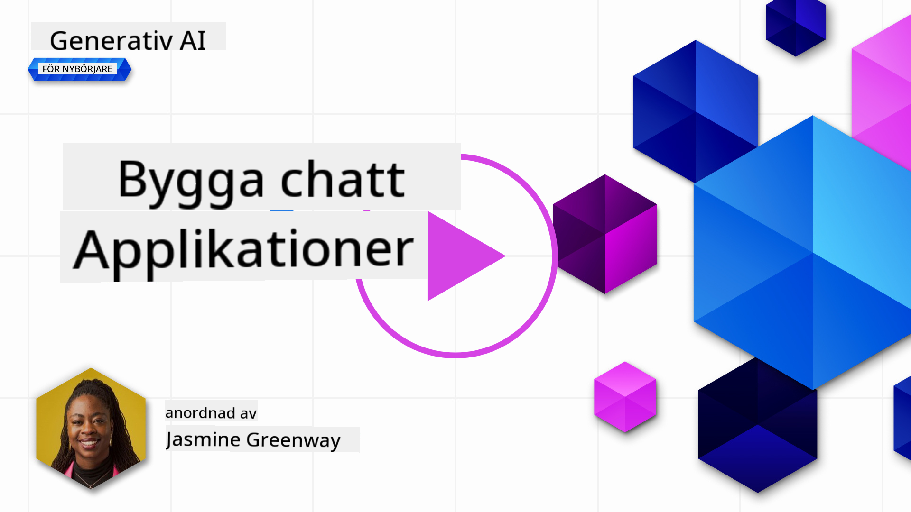
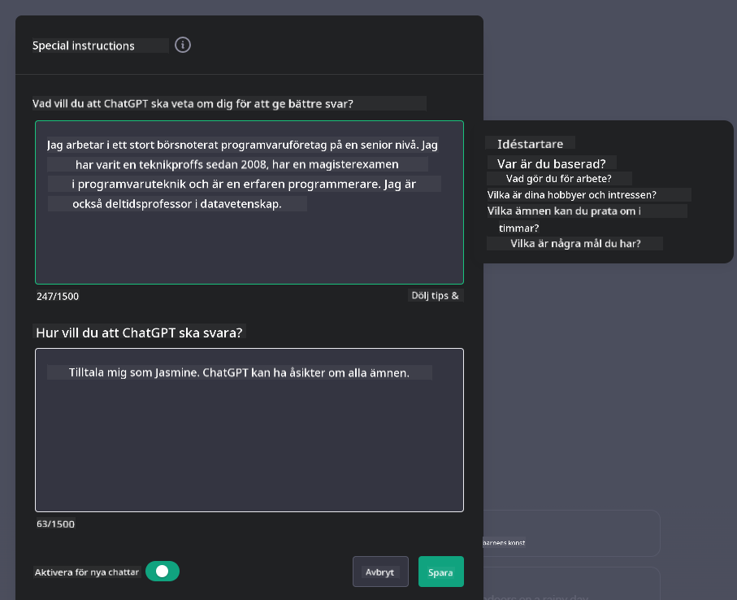

<!--
CO_OP_TRANSLATOR_METADATA:
{
  "original_hash": "ea4bbe640847aafbbba14dae4625e9af",
  "translation_date": "2025-06-25T15:37:05+00:00",
  "source_file": "07-building-chat-applications/README.md",
  "language_code": "sv"
}
-->
# Bygga generativa AI-drivna chattapplikationer

[](https://aka.ms/gen-ai-lessons7-gh?WT.mc_id=academic-105485-koreyst)

> _(Klicka på bilden ovan för att se videon av denna lektion)_

Nu när vi har sett hur vi kan bygga textgenereringsappar, låt oss titta på chattapplikationer.

Chattapplikationer har blivit en integrerad del av våra dagliga liv och erbjuder mer än bara ett sätt att föra vardagliga samtal. De är viktiga delar av kundservice, teknisk support och till och med sofistikerade rådgivningssystem. Det är troligt att du har fått hjälp av en chattapplikation inte alltför länge sedan. När vi integrerar mer avancerade teknologier som generativ AI i dessa plattformar ökar komplexiteten och därmed också utmaningarna.

Några frågor vi behöver få svar på är:

- **Bygga appen**. Hur bygger vi effektivt och integrerar sömlöst dessa AI-drivna applikationer för specifika användningsfall?
- **Övervakning**. När de är implementerade, hur kan vi övervaka och säkerställa att applikationerna fungerar på högsta kvalitetsnivå, både vad gäller funktionalitet och i enlighet med de [sex principerna för ansvarsfull AI](https://www.microsoft.com/ai/responsible-ai?WT.mc_id=academic-105485-koreyst)?

När vi går längre in i en tid definierad av automatisering och sömlösa människa-maskin-interaktioner, blir det viktigt att förstå hur generativ AI förändrar omfattningen, djupet och anpassningsförmågan hos chattapplikationer. Denna lektion kommer att undersöka de arkitekturella aspekterna som stödjer dessa intrikata system, fördjupa sig i metoder för att finjustera dem för domänspecifika uppgifter och utvärdera de mätvärden och överväganden som är relevanta för att säkerställa ansvarsfull AI-implementering.

## Introduktion

Denna lektion täcker:

- Tekniker för att effektivt bygga och integrera chattapplikationer.
- Hur man tillämpar anpassning och finjustering på applikationer.
- Strategier och överväganden för att effektivt övervaka chattapplikationer.

## Lärandemål

I slutet av denna lektion kommer du att kunna:

- Beskriva överväganden för att bygga och integrera chattapplikationer i befintliga system.
- Anpassa chattapplikationer för specifika användningsfall.
- Identifiera nyckelmätvärden och överväganden för att effektivt övervaka och upprätthålla kvaliteten på AI-drivna chattapplikationer.
- Säkerställa att chattapplikationer använder AI ansvarsfullt.

## Integrera generativ AI i chattapplikationer

Att höja chattapplikationer genom generativ AI handlar inte bara om att göra dem smartare; det handlar om att optimera deras arkitektur, prestanda och användargränssnitt för att leverera en kvalitetsanvändarupplevelse. Detta innebär att undersöka de arkitektoniska grunderna, API-integrationer och överväganden för användargränssnitt. Denna sektion syftar till att erbjuda dig en omfattande vägkarta för att navigera i dessa komplexa landskap, oavsett om du ansluter dem till befintliga system eller bygger dem som fristående plattformar.

I slutet av denna sektion kommer du att vara utrustad med den expertis som behövs för att effektivt konstruera och inkorporera chattapplikationer.

### Chattbot eller chattapplikation?

Innan vi dyker in i att bygga chattapplikationer, låt oss jämföra 'chattbotar' mot 'AI-drivna chattapplikationer', som tjänar olika roller och funktioner. En chattbots huvudsakliga syfte är att automatisera specifika konversationsuppgifter, som att svara på vanliga frågor eller spåra ett paket. Den styrs vanligtvis av regelbaserad logik eller komplexa AI-algoritmer. I kontrast är en AI-driven chattapplikation en mycket mer expansiv miljö designad för att underlätta olika former av digital kommunikation, som text-, röst- och videochattar mellan mänskliga användare. Dess definierande drag är integrationen av en generativ AI-modell som simulerar nyanserade, människoliknande konversationer och genererar svar baserat på en mängd olika input och kontextuella ledtrådar. En generativ AI-driven chattapplikation kan engagera sig i öppna diskussioner, anpassa sig till föränderliga konversationskontexter och till och med producera kreativa eller komplexa dialoger.

Tabellen nedan beskriver de viktigaste skillnaderna och likheterna för att hjälpa oss att förstå deras unika roller i digital kommunikation.

| Chattbot                              | Generativ AI-driven chattapplikation  |
| ------------------------------------- | ------------------------------------- |
| Uppgiftsfokuserad och regelbaserad    | Kontextmedveten                       |
| Ofta integrerad i större system       | Kan vara värd för en eller flera chattbotar |
| Begränsad till programmerade funktioner | Inkorporerar generativa AI-modeller   |
| Specialiserade och strukturerade interaktioner | Kapabel till öppna diskussioner      |

### Utnyttja förbyggda funktionaliteter med SDK:er och API:er

När man bygger en chattapplikation är ett bra första steg att bedöma vad som redan finns där ute. Att använda SDK:er och API:er för att bygga chattapplikationer är en fördelaktig strategi av flera skäl. Genom att integrera väl dokumenterade SDK:er och API:er positionerar du strategiskt din applikation för långsiktig framgång, och adresserar skalbarhet och underhållsfrågor.

- **Snabbar upp utvecklingsprocessen och minskar overhead**: Genom att förlita sig på förbyggda funktionaliteter istället för den kostsamma processen att bygga dem själv kan du fokusera på andra aspekter av din applikation som du kanske tycker är viktigare, som affärslogik.
- **Bättre prestanda**: När man bygger funktionalitet från grunden kommer man förr eller senare att fråga sig "Hur skalas det? Är denna applikation kapabel att hantera ett plötsligt inflöde av användare?" Väl underhållna SDK:er och API:er har ofta inbyggda lösningar för dessa frågor.
- **Lättare underhåll**: Uppdateringar och förbättringar är lättare att hantera eftersom de flesta API:er och SDK:er helt enkelt kräver en uppdatering av ett bibliotek när en nyare version släpps.
- **Tillgång till banbrytande teknologi**: Genom att utnyttja modeller som har finjusterats och tränats på omfattande datamängder får din applikation naturliga språkfunktioner.

Åtkomst till funktionaliteten i en SDK eller API innebär vanligtvis att få tillstånd att använda de tillhandahållna tjänsterna, vilket ofta sker genom användning av en unik nyckel eller autentiseringstoken. Vi kommer att använda OpenAI Python Library för att utforska hur detta ser ut. Du kan också prova det själv i följande [notebook för OpenAI](../../../07-building-chat-applications/python/oai-assignment.ipynb) eller [notebook för Azure OpenAI Services](../../../07-building-chat-applications/python/aoai-assignment.ipynb) för denna lektion.

```python
import os
from openai import OpenAI

API_KEY = os.getenv("OPENAI_API_KEY","")

client = OpenAI(
    api_key=API_KEY
    )

chat_completion = client.chat.completions.create(model="gpt-3.5-turbo", messages=[{"role": "user", "content": "Suggest two titles for an instructional lesson on chat applications for generative AI."}])
```

Exemplet ovan använder GPT-3.5 Turbo-modellen för att slutföra prompten, men notera att API-nyckeln är inställd innan detta görs. Du skulle få ett fel om du inte satte nyckeln.

## Användarupplevelse (UX)

Allmänna UX-principer gäller för chattapplikationer, men här är några ytterligare överväganden som blir särskilt viktiga på grund av de maskininlärningskomponenter som är involverade.

- **Mekanism för att adressera tvetydighet**: Generativa AI-modeller genererar ibland tvetydiga svar. En funktion som tillåter användare att be om förtydligande kan vara till hjälp om de stöter på detta problem.
- **Kontextbevarande**: Avancerade generativa AI-modeller har förmågan att komma ihåg kontext inom en konversation, vilket kan vara en nödvändig tillgång för användarupplevelsen. Att ge användare möjlighet att kontrollera och hantera kontext förbättrar användarupplevelsen, men introducerar risken för att behålla känslig användarinformation. Överväganden för hur länge denna information lagras, såsom att införa en bevarandeprincip, kan balansera behovet av kontext mot integritet.
- **Personalisering**: Med förmågan att lära och anpassa sig erbjuder AI-modeller en individualiserad upplevelse för en användare. Att skräddarsy användarupplevelsen genom funktioner som användarprofiler gör inte bara att användaren känner sig förstådd, utan det hjälper också deras strävan att hitta specifika svar, vilket skapar en mer effektiv och tillfredsställande interaktion.

Ett exempel på personalisering är inställningarna "Anpassade instruktioner" i OpenAI:s ChatGPT. Det låter dig ge information om dig själv som kan vara viktig kontext för dina uppmaningar. Här är ett exempel på en anpassad instruktion.



Denna "profil" uppmanar ChatGPT att skapa en lektionsplan om länkade listor. Notera att ChatGPT tar hänsyn till att användaren kanske vill ha en mer djupgående lektionsplan baserat på hennes erfarenhet.


### Microsofts systemmeddelanderamverk för stora språkmodeller

[Microsoft har tillhandahållit vägledning](https://learn.microsoft.com/azure/ai-services/openai/concepts/system-message#define-the-models-output-format?WT.mc_id=academic-105485-koreyst) för att skriva effektiva systemmeddelanden vid generering av svar från LLM:er uppdelade i 4 områden:

1. Definiera vem modellen är för, samt dess förmågor och begränsningar.
2. Definiera modellens utdataformat.
3. Tillhandahålla specifika exempel som demonstrerar modellens avsedda beteende.
4. Tillhandahålla ytterligare beteenderegler.

### Tillgänglighet

Oavsett om en användare har visuella, auditiva, motoriska eller kognitiva funktionsnedsättningar bör en väl utformad chattapplikation vara användbar för alla. Följande lista bryter ner specifika funktioner som syftar till att förbättra tillgängligheten för olika användarhinder.

- **Funktioner för synnedsättning**: Högkontrastteman och justerbar text, kompatibilitet med skärmläsare.
- **Funktioner för hörselnedsättning**: Text-till-tal och tal-till-text funktioner, visuella signaler för ljudnotifikationer.
- **Funktioner för motoriska nedsättningar**: Tangentbordsnavigeringsstöd, röstkommandon.
- **Funktioner för kognitiva nedsättningar**: Förenklade språkval.

## Anpassning och finjustering för domänspecifika språkmodeller

Föreställ dig en chattapplikation som förstår ditt företags jargong och förutser de specifika frågor som dess användarbas vanligtvis har. Det finns ett par tillvägagångssätt som är värda att nämna:

- **Utnyttja DSL-modeller**. DSL står för domänspecifikt språk. Du kan utnyttja en så kallad DSL-modell som är tränad på en specifik domän för att förstå dess koncept och scenarier.
- **Tillämpa finjustering**. Finjustering är processen att ytterligare träna din modell med specifika data.

## Anpassning: Använda en DSL

Genom att utnyttja domänspecifika språkmodeller (DSL-modeller) kan man förbättra användarengagemanget genom att tillhandahålla specialiserade, kontextuellt relevanta interaktioner. Det är en modell som är tränad eller finjusterad för att förstå och generera text relaterad till ett specifikt område, industri eller ämne. Alternativen för att använda en DSL-modell kan variera från att träna en från grunden till att använda befintliga genom SDK:er och API:er. Ett annat alternativ är finjustering, vilket innebär att ta en befintlig förtränad modell och anpassa den för ett specifikt område.

## Anpassning: Tillämpa finjustering

Finjustering övervägs ofta när en förtränad modell inte räcker till i ett specialiserat område eller specifik uppgift.

Till exempel är medicinska frågor komplexa och kräver mycket kontext. När en medicinsk professionell diagnostiserar en patient baseras det på en mängd faktorer såsom livsstil eller befintliga tillstånd, och kan till och med förlita sig på senaste medicinska tidskrifter för att validera sin diagnos. I sådana nyanserade scenarier kan en allmän AI-chattapplikation inte vara en pålitlig källa.

### Scenario: en medicinsk applikation

Tänk på en chattapplikation designad för att hjälpa medicinska utövare genom att tillhandahålla snabba referenser till behandlingsriktlinjer, läkemedelsinteraktioner eller senaste forskningsresultat.

En allmän modell kan vara tillräcklig för att svara på grundläggande medicinska frågor eller ge allmänna råd, men den kan kämpa med följande:

- **Mycket specifika eller komplexa fall**. Till exempel kan en neurolog fråga applikationen, "Vad är de nuvarande bästa metoderna för att hantera läkemedelsresistent epilepsi hos pediatriska patienter?"
- **Brist på senaste framsteg**. En allmän modell kan ha svårt att ge ett aktuellt svar som inkluderar de senaste framstegen inom neurologi och farmakologi.

I sådana fall kan finjustering av modellen med en specialiserad medicinsk datamängd avsevärt förbättra dess förmåga att hantera dessa intrikata medicinska frågor mer exakt och tillförlitligt. Detta kräver tillgång till en stor och relevant datamängd som representerar de domänspecifika utmaningar och frågor som behöver adresseras.

## Överväganden för en högkvalitativ AI-driven chatteupplevelse

Denna sektion beskriver kriterierna för "högkvalitativa" chattapplikationer, vilka inkluderar insamling av handlingsbara mätvärden och efterlevnad av ett ramverk som ansvarigt utnyttjar AI-teknik.

### Nyckelmätvärden

För att upprätthålla högkvalitativ prestanda i en applikation är det viktigt att hålla koll på nyckelmätvärden och överväganden. Dessa mätningar säkerställer inte bara applikationens funktionalitet utan bedömer också kvaliteten på AI-modellen och användarupplevelsen. Nedan finns en lista som täcker grundläggande, AI och användarupplevelsemätvärden att överväga.

| Mätvärde                     | Definition                                                                                                                | Överväganden för chattutvecklare                                           |
| ---------------------------- | ------------------------------------------------------------------------------------------------------------------------- | -------------------------------------------------------------------------- |
| **Drifttid**                 | Mäter den tid applikationen är operativ och tillgänglig för användare.                                                    | Hur kommer du att minimera driftstopp?                                     |
| **Svarstid**                 | Den tid det tar för applikationen att svara på en användares fråga.                                                       | Hur kan du optimera frågebehandlingen för att förbättra svarstiden?        |
| **Precision**                | Förhållandet mellan sanna positiva förutsägelser och det totala antalet positiva förutsägelser                            | Hur kommer du att validera precisionen hos din modell?                     |
| **Återkallelse (Känslighet)**| Förhållandet mellan sanna positiva förutsägelser och det faktiska antalet positiva                                        | Hur kommer du att mäta och förbättra återkallelsen?                        |
| **F1-poäng**                 | Det harmoniska medelvärdet av precision och återkallelse, som balanserar avvägningen mellan båda.                         | Vad är din målsatta F1-poäng? Hur kommer du att balansera precision och återkallelse? |
| **Förvirring**               | Mäter hur väl sannolikhetsfördelningen som förutspås av modellen stämmer överens med den faktiska fördelningen av data.   | Hur kommer du att minimera förvirring?                                     |
| **Användarnöjdhetsmätvärden**| Mäter användarens uppfattning om applikationen. Ofta insamlat genom undersökningar.                                       | Hur ofta kommer du att samla in användarfeedback? Hur kommer du att anpassa dig baserat på det? |
| **Felfrekvens**              | Frekvensen med vilken modellen gör misstag i att förstå eller producera utdata.                                           | Vilka strategier har

**Ansvarsfriskrivning**:  
Detta dokument har översatts med hjälp av AI-översättningstjänsten [Co-op Translator](https://github.com/Azure/co-op-translator). Även om vi strävar efter noggrannhet, vänligen notera att automatiska översättningar kan innehålla fel eller felaktigheter. Det ursprungliga dokumentet på dess modersmål bör betraktas som den auktoritativa källan. För kritisk information rekommenderas professionell mänsklig översättning. Vi ansvarar inte för några missförstånd eller misstolkningar som uppstår vid användning av denna översättning.