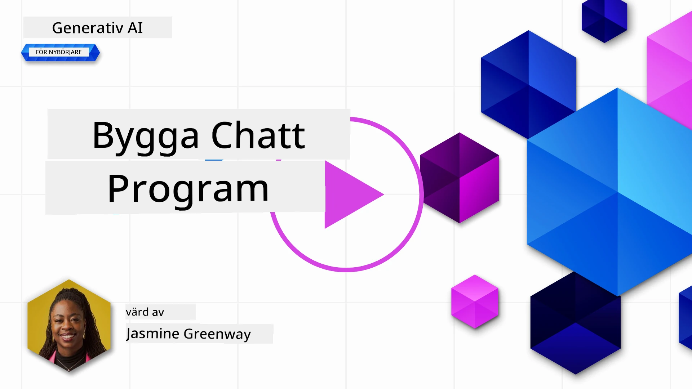
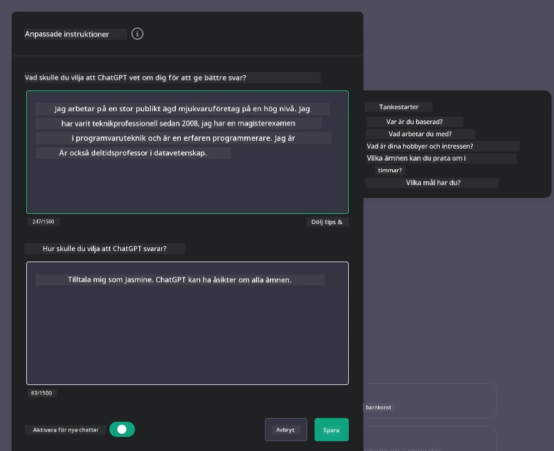
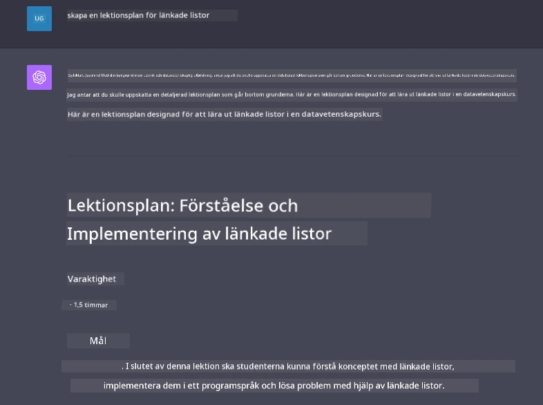

# Bygga Generativa AI-Drivna Chattapplikationer

[](https://youtu.be/R9V0ZY1BEQo?si=IHuU-fS9YWT8s4sA)

> _(Klicka på bilden ovan för att se videon för denna lektion)_

Nu när vi har sett hur vi kan bygga textgenereringsappar ska vi titta närmare på chattapplikationer.

Chattapplikationer har blivit integrerade i våra dagliga liv och erbjuder mer än bara ett sätt för vardagliga konversationer. De är integrerade delar av kundservice, teknisk support och till och med sofistikerade rådgivningssystem. Det är troligt att du nyligen har fått hjälp av en chattapplikation. När vi integrerar mer avancerad teknik som generativ AI i dessa plattformar ökar komplexiteten och det gör även utmaningarna.

Några frågor vi behöver svar på är:

- **Bygga appen**. Hur bygger vi effektivt och integrerar sömlöst dessa AI-drivna applikationer för specifika användningsfall?
- **Övervakning**. När de har distribuerats, hur kan vi övervaka och säkerställa att applikationerna fungerar på högsta kvalitetsnivå, både vad gäller funktionalitet och efterlevnad av [de sex principerna för ansvarsfull AI](https://www.microsoft.com/ai/responsible-ai?WT.mc_id=academic-105485-koreyst)?

När vi rör oss längre in i en era definierad av automation och sömlösa människa-maskin-interaktioner blir det avgörande att förstå hur generativ AI transformerar omfattningen, djupet och anpassningsbarheten för chattapplikationer. Denna lektion kommer att undersöka aspekter av arkitektur som stödjer dessa komplexa system, fördjupa sig i metoder för att finjustera dem för domänspecifika uppgifter och utvärdera de mätvärden och överväganden som är relevanta för att säkerställa ansvarsfull implementering av AI.

## Introduktion

Denna lektion täcker:

- Tekniker för effektivt byggande och integrering av chattapplikationer.
- Hur man tillämpar anpassning och finjustering på applikationer.
- Strategier och överväganden för att effektivt övervaka chattapplikationer.

## Lärandemål

I slutet av denna lektion kommer du att kunna:

- Beskriva överväganden för att bygga och integrera chattapplikationer i befintliga system.
- Anpassa chattapplikationer för specifika användningsfall.
- Identifiera nyckelmått och överväganden för att effektivt övervaka och upprätthålla kvaliteten på AI-drivna chattapplikationer.
- Säkerställa att chattapplikationer använder AI på ett ansvarsfullt sätt.

## Integrera Generativ AI i Chattapplikationer

Att höja chattapplikationer genom generativ AI handlar inte bara om att göra dem smartare; det handlar om att optimera deras arkitektur, prestanda och användargränssnitt för att leverera en kvalitativ användarupplevelse. Detta innefattar att undersöka arkitektoniska grunder, API-integrationer och överväganden kring användargränssnittet. Denna del syftar till att erbjuda dig en omfattande vägkarta för att navigera dessa komplexa landskap, oavsett om du kopplar in dem i befintliga system eller bygger dem som fristående plattformar.

I slutet av denna del kommer du att vara rustad med den expertis som behövs för att effektivt konstruera och införliva chattapplikationer.

### Chattbot eller Chattapplikation?

Innan vi går in på att bygga chattapplikationer, låt oss jämföra "chattbottar" med "AI-drivna chattapplikationer," vilka tjänar olika roller och funktioner. En chattbots huvudsakliga syfte är att automatisera specifika konversationsuppgifter, såsom att besvara ofta ställda frågor eller spåra ett paket. Den styrs vanligtvis av regelbaserad logik eller komplexa AI-algoritmer. Däremot är en AI-driven chattapplikation en mycket mer omfattande miljö utformad för att möjliggöra olika former av digital kommunikation, som text-, röst- och videosamtal mellan människor. Dess kännetecken är integrationen av en generativ AI-modell som simulerar nyanserade, mänskliga konversationer och genererar svar baserade på en mängd olika indata och kontextuella ledtrådar. En generativ AI-driven chattapplikation kan delta i öppna domändiskussioner, anpassa sig till utvecklande kontext och till och med producera kreativa eller komplexa dialoger.

Tabellen nedan redogör för de viktigaste skillnaderna och likheterna för att hjälpa oss förstå deras unika roller i digital kommunikation.

| Chattbot                             | Generativ AI-Drivna Chattapplikationen |
| ----------------------------------- | -------------------------------------- |
| Uppgiftsfokuserad och regelbaserad  | Kontextmedveten                         |
| Ofta integrerad i större system     | Kan vara värd för en eller flera chattbottar |
| Begränsad till programmerade funktioner | Innehåller generativa AI-modeller       |
| Specialiserade och strukturerade interaktioner | Kapabel till öppendiska diskussioner       |

### Utnyttja färdiga funktioner med SDK:er och API:er

När man bygger en chattapplikation är ett bra första steg att bedöma vad som redan finns. Att använda SDK:er och API:er för att bygga chattapplikationer är en fördelaktig strategi av flera skäl. Genom att integrera väl dokumenterade SDK:er och API:er positionerar du strategiskt din applikation för långsiktig framgång, och tacklar skalbarhets- och underhållsfrågor.

- **Påskyndar utvecklingsprocessen och minskar arbetsbördan**: Att förlita sig på färdiga funktioner istället för att själv bygga dem, låter dig fokusera på andra aspekter av din applikation som du kanske anser viktigare, till exempel affärslogik.
- **Bättre prestanda**: När du bygger funktionalitet från grunden kommer du så småningom att fråga dig "Hur skalar det? Är denna applikation kapabel att hantera en plötslig tillströmning av användare?" Väl underhållna SDK:er och API:er har ofta inbyggda lösningar för dessa problem.
- **Enklare underhåll**: Uppdateringar och förbättringar är lättare att hantera eftersom de flesta API:er och SDK:er bara kräver en uppdatering av ett bibliotek när en ny version släpps.
- **Tillgång till toppmodern teknik**: Att utnyttja modeller som har finjusterats och tränats på omfattande dataset ger din applikation naturliga språkkapabiliteter.

Att få tillgång till funktionaliteten hos ett SDK eller API innebär vanligtvis att man får tillstånd att använda de tillhandahållna tjänsterna, vilket ofta sker genom användning av en unik nyckel eller autentiseringstoken. Vi kommer att använda OpenAI Python-biblioteket för att utforska hur det ser ut. Du kan också prova det själv i följande [notebook för OpenAI](./python/oai-assignment.ipynb?WT.mc_id=academic-105485-koreyst) eller [notebook för Azure OpenAI Services](./python/aoai-assignment.ipynb?WT.mc_id=academic-105485-koreys) för denna lektion.

```python
import os
from openai import OpenAI

API_KEY = os.getenv("OPENAI_API_KEY","")

client = OpenAI(
    api_key=API_KEY
    )

response = client.responses.create(model="gpt-5-mini", input="Suggest two titles for an instructional lesson on chat applications for generative AI.", store=False)
print(response.output_text)
```

Exemplet ovan använder GPT-5 mini-modellen med Responses API för att slutföra prompten, men märk att API-nyckeln är satt innan det sker. Du skulle få ett felmeddelande om du inte satte nyckeln.

## Användarupplevelse (UX)

Generella UX-principer gäller för chattapplikationer, men här är några ytterligare överväganden som blir särskilt viktiga på grund av de maskininlärningskomponenter som ingår.

- **Mekanism för att hantera oklarheter**: Generativa AI-modeller kan ibland generera tvetydiga svar. En funktion som tillåter användare att be om förtydligande kan vara till hjälp om de stöter på detta problem.
- **Kontextbehållning**: Avancerade generativa AI-modeller har förmågan att komma ihåg kontext inom en konversation, vilket kan vara en nödvändig tillgång för användarupplevelsen. Att ge användare möjligheten att kontrollera och hantera kontext förbättrar användarupplevelsen, men innebär risken att känslig användarinformation behålls. Överväganden kring hur länge denna information lagras, som att införa en lagringspolicy, kan balansera behovet av kontext mot integritet.
- **Personalisering**: Med förmågan att lära och anpassa sig erbjuder AI-modeller en individualiserad upplevelse för användaren. Att skräddarsy användarupplevelsen genom funktioner som användarprofiler får inte bara användaren att känna sig förstådd, utan hjälper också i jakten på att hitta specifika svar, vilket skapar en effektivare och mer tillfredsställande interaktion.

Ett sådant exempel på personalisering är inställningen "Anpassade instruktioner" i OpenAI:s ChatGPT. Den låter dig lämna information om dig själv som kan vara viktig kontext för dina prompts. Här är ett exempel på en anpassad instruktion.



Denna "profil" uppmanar ChatGPT att skapa en lektionsplan om länkade listor. Notera att ChatGPT tar hänsyn till att användaren kan önska en mer djupgående lektionsplan baserat på hennes erfarenhet.



### Microsofts Systemmeddelanderamverk för Stora Språkmodeller

[Microsoft har gett vägledning](https://learn.microsoft.com/azure/ai-foundry/openai/concepts/system-message#define-the-models-output-format?WT.mc_id=academic-105485-koreyst) för att skriva effektiva systemmeddelanden vid generering av svar från LLMs uppdelat i 4 områden:

1. Definiera vem modellen är för, liksom dess kapabiliteter och begränsningar.
2. Definiera modellens outputformat.
3. Tillhandahålla specifika exempel som visar modellens avsedda beteende.
4. Tillhandahålla ytterligare beteendemässiga skyddsåtgärder.

### Tillgänglighet

Oavsett om en användare har syn-, hörsel-, motoriska- eller kognitiva funktionsnedsättningar bör en väl utformad chattapplikation vara användbar för alla. Följande lista bryter ner specifika funktioner som syftar till att förbättra tillgängligheten för olika användargruppers funktionsnedsättningar.

- **Funktioner för synnedsättning**: Högkontrastteman och resizerbar text, skärmläsarkompatibilitet.
- **Funktioner för hörselnedsättning**: Text-till-tal och tal-till-text funktioner, visuella signaler för ljudnotifikationer.
- **Funktioner för motoriska funktionsnedsättningar**: Stöd för tangentbordsnavigering, röstkommandon.
- **Funktioner för kognitiva funktionsnedsättningar**: Förenklade språkalternativ.

## Anpassning och finjustering för domänspecifika språkmodeller

Föreställ dig en chattapplikation som förstår ditt företags jargon och förutser de specifika frågor som dess användarbas vanligtvis har. Det finns ett par tillvägagångssätt som är värda att nämna:

- **Utnyttja DSL-modeller**. DSL står för domänspecifikt språk. Du kan utnyttja en så kallad DSL-modell som är tränad på ett specifikt område för att förstå dess begrepp och scenarier.
- **Applicera finjustering**. Finjustering är processen att vidareutbilda din modell med specifika data.

## Anpassning: Använda en DSL

Att utnyttja domänspecifika språkmodeller (DSL-modeller) kan öka användarengagemang genom att erbjuda specialiserade, kontextuellt relevanta interaktioner. Det är en modell som är tränad eller finjusterad för att förstå och generera text relaterad till ett specifikt fält, industri eller ämne. Alternativ för att använda en DSL-modell kan variera från att träna en från grunden till att använda befintliga via SDK:er och API:er. Ett annat alternativ är finjustering, vilket innebär att ta en befintlig förtränad modell och anpassa den för ett specifikt domän.

## Anpassning: Applicera finjustering

Finjustering övervägs ofta när en förtränad modell inte räcker till inom ett specialiserat domän eller specifik uppgift.

Till exempel är medicinska frågor komplexa och kräver mycket kontext. När en medicinsk professionell ställer en diagnos baseras det på en rad faktorer som livsstil eller befintliga sjukdomar, och kan även förlita sig på senaste medicinska tidskrifter för att validera sin diagnos. I sådana nyanserade scenarier kan en allmän AI-chattapplikation inte vara en tillförlitlig källa.

### Scenario: en medicinsk applikation

Tänk dig en chattapplikation utformad för att bistå medicinska yrkespersoner genom att tillhandahålla snabba referenser till behandlingsriktlinjer, läkemedelsinteraktioner eller senaste forskningsresultat.

En allmänt tillämpad modell kan vara tillräcklig för att svara på grundläggande medicinska frågor eller ge allmänna råd, men kan ha svårt med följande:

- **Mycket specifika eller komplexa fall**. Till exempel kan en neurolog fråga applikationen, "Vilka är de nuvarande bästa metoderna för att hantera läkemedelsresistent epilepsi hos pediatriska patienter?"
- **Brist på senaste framsteg**. En allmän modell kan ha svårt att ge ett aktuellt svar som inkluderar de senaste framstegen inom neurologi och farmakologi.

I sådana fall kan finjustering av modellen med en specialiserad medicinsk dataset avsevärt förbättra dess förmåga att hantera dessa invecklade medicinska frågor mer exakt och pålitligt. Detta kräver tillgång till en stor och relevant dataset som representerar de domänspecifika utmaningarna och frågorna som behöver adresseras.

## Överväganden för en högkvalitativ AI-driven chattupplevelse

Denna sektion redogör för kriterierna för "högkvalitativa" chattapplikationer, vilka inkluderar insamling av handlingsbara mätvärden och efterlevnad av ett ramverk som ansvarsfullt utnyttjar AI-teknologi.

### Nyckelmått

För att upprätthålla en applikations högkvalitativa prestanda är det viktigt att hålla koll på nyckelmått och överväganden. Dessa mätvärden säkerställer inte bara applikationens funktionalitet utan bedömer också kvaliteten på AI-modellen och användarupplevelsen. Nedan finns en lista som täcker grundläggande, AI- och användarupplevelsemått att överväga.

| Mått                         | Definition                                                                                                             | Överväganden för chapputvecklare                                       |
| ----------------------------- | ---------------------------------------------------------------------------------------------------------------------- | --------------------------------------------------------------------- |
| **Drifttid**                  | Mäter tiden applikationen är operativ och tillgänglig för användare.                                                    | Hur ska du minimera driftstopp?                                       |
| **Svarstid**                 | Den tid det tar för applikationen att svara på en användares fråga.                                                     | Hur kan du optimera frågebehandlingen för att förbättra svarstiden?   |
| **Precision**                 | Andelen sanna positiva förutsägelser av det totala antalet positiva förutsägelser.                                    | Hur ska du validera din modells precision?                            |
| **Återkallning (Känslighet)**| Andelen sanna positiva förutsägelser av det verkliga antalet positiva.                                               | Hur ska du mäta och förbättra återkallning?                           |
| **F1-poäng**                 | Det harmoniska medelvärdet av precision och återkallning, som balanserar kompromissen mellan båda.                     | Vad är ditt mål för F1-poäng? Hur ska du balansera precision och återkallning? |
| **Förvirring (Perplexity)**  | Mäter hur väl sannolikhetsfördelningen som modellen förutspår överensstämmer med den faktiska fördelningen i data.       | Hur ska du minimera förvirring?                                       |
| **Användartillfredsställelse-mått** | Mäter användarens uppfattning av applikationen. Samlas ofta in genom enkäter.                                         | Hur ofta ska du samla in användarfeedback? Hur ska du anpassa dig efter den? |
| **Felrate**                  | Frekvensen av fel som modellen gör i förståelse eller output.                                                          | Vilka strategier har du för att minska felfrekvensen?                 |
| **Omkörningscykler**         | Hur ofta modellen uppdateras för att inkludera ny data och insikter.                                                  | Hur ofta ska du omträna modellen? Vad utlöser en omkörningscykel?     |

| **Anomalidetektion**         | Verktyg och tekniker för att identifiera ovanliga mönster som inte följer förväntat beteende.                        | Hur kommer du att hantera anomalier?                                        |

### Implementera ansvarsfulla AI-praxis i chattapplikationer

Microsofts synsätt på ansvarsfull AI har identifierat sex principer som bör vägleda AI-utveckling och användning. Nedan finns principerna, deras definition och saker en chattutvecklare bör tänka på samt varför de bör tas på allvar.

| Principer             | Microsofts definition                                | Överväganden för chattutvecklare                                      | Varför det är viktigt                                                                     |
| ---------------------- | ----------------------------------------------------- | ---------------------------------------------------------------------- | -------------------------------------------------------------------------------------- |
| Rättvisa               | AI-system ska behandla alla människor rättvist.            | Säkerställ att chattapplikationen inte diskriminerar baserat på användardata.  | För att bygga förtroende och inkludering bland användarna; undviker juridiska konsekvenser.                |
| Tillförlitlighet och säkerhet | AI-system ska fungera tillförlitligt och säkert.        | Implementera tester och felsäkerheter för att minimera fel och risker.         | Säkerställer användarnöjdhet och förhindrar potentiell skada.                                 |
| Integritet och säkerhet   | AI-system ska vara säkra och respektera integritet.      | Implementera stark kryptering och dataskyddsåtgärder.              | För att skydda känsliga användardata och följa integritetslagar.                         |
| Inkluderande          | AI-system ska stärka alla och engagera människor. | Designa UI/UX som är tillgängligt och lättanvänt för olika målgrupper. | Säkerställer att en bredare målgrupp kan använda applikationen effektivt.                   |
| Transparens           | AI-system ska vara förståeliga.                  | Tillhandahåll tydlig dokumentation och motivering för AI-svar.            | Användare är mer benägna att lita på ett system om de förstår hur beslut fattas. |
| Ansvarstagande         | Människor ska hållas ansvariga för AI-system.          | Etablera en tydlig process för revision och förbättring av AI-beslut.     | Möjliggör kontinuerlig förbättring och korrigerande åtgärder vid misstag.               |

## Uppgift

Se [assignment](../../../07-building-chat-applications/python). Den tar dig igenom en serie övningar från att köra dina första chatt-promptar till att klassificera och sammanfatta text med mera. Observera att uppgifterna finns tillgängliga på olika programmeringsspråk!

## Bra jobbat! Fortsätt resan

Efter att ha slutfört den här lektionen, kolla in vår [Generative AI Learning collection](https://aka.ms/genai-collection?WT.mc_id=academic-105485-koreyst) för att fortsätta utveckla dina kunskaper inom Generative AI!

Gå vidare till Lektion 8 för att se hur du kan börja [bygga sökapplikationer](../08-building-search-applications/README.md?WT.mc_id=academic-105485-koreyst)!

---

<!-- CO-OP TRANSLATOR DISCLAIMER START -->
**Ansvarsfriskrivning**:
Detta dokument har översatts med hjälp av AI-översättningstjänsten [Co-op Translator](https://github.com/Azure/co-op-translator). Även om vi strävar efter noggrannhet, var vänlig notera att automatiska översättningar kan innehålla fel eller brister. Det ursprungliga dokumentet på dess modersmål bör betraktas som den auktoritativa källan. För kritisk information rekommenderas professionell mänsklig översättning. Vi ansvarar inte för några missförstånd eller feltolkningar som uppstår till följd av användningen av denna översättning.
<!-- CO-OP TRANSLATOR DISCLAIMER END -->