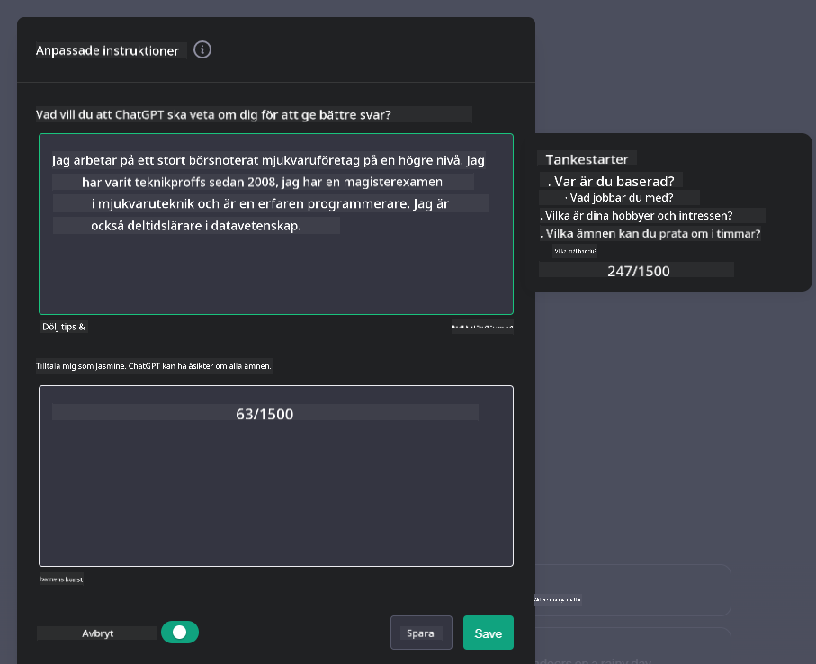
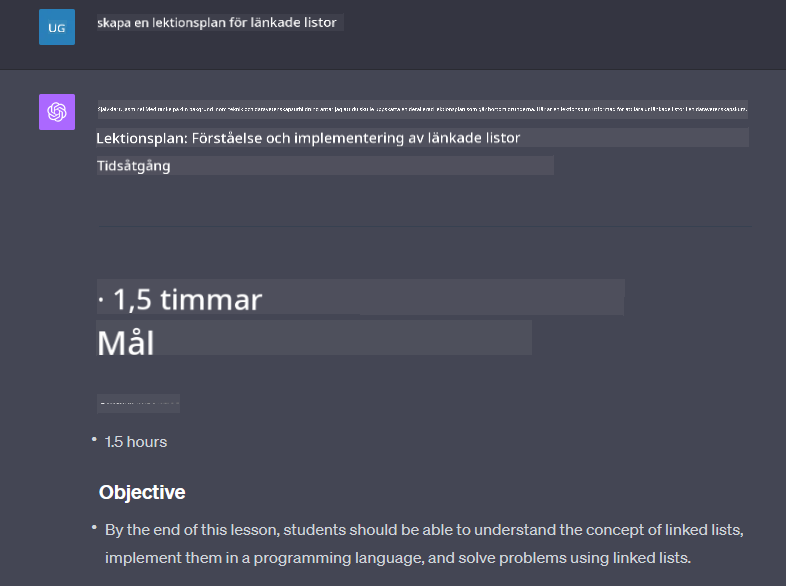

<!--
CO_OP_TRANSLATOR_METADATA:
{
  "original_hash": "a5308963a56cfbad2d73b0fa99fe84b3",
  "translation_date": "2025-10-17T19:03:54+00:00",
  "source_file": "07-building-chat-applications/README.md",
  "language_code": "sv"
}
-->
# Bygga generativa AI-drivna chattapplikationer

[](https://youtu.be/R9V0ZY1BEQo?si=IHuU-fS9YWT8s4sA)

> _(Klicka på bilden ovan för att se videon till denna lektion)_

Nu när vi har sett hur vi kan bygga textgenereringsappar, låt oss titta närmare på chattapplikationer.

Chattapplikationer har blivit en integrerad del av vår vardag och erbjuder mer än bara ett sätt att ha vardagliga konversationer. De är viktiga komponenter inom kundservice, teknisk support och till och med sofistikerade rådgivningssystem. Det är troligt att du nyligen har fått hjälp av en chattapplikation. När vi integrerar mer avancerade teknologier som generativ AI i dessa plattformar ökar komplexiteten och därmed även utmaningarna.

Några frågor vi behöver besvara är:

- **Bygga applikationen**. Hur bygger vi effektivt och integrerar dessa AI-drivna applikationer för specifika användningsområden?
- **Övervakning**. När de väl är implementerade, hur kan vi övervaka och säkerställa att applikationerna fungerar på högsta kvalitetsnivå, både vad gäller funktionalitet och att följa [de sex principerna för ansvarsfull AI](https://www.microsoft.com/ai/responsible-ai?WT.mc_id=academic-105485-koreyst)?

När vi går vidare in i en era som definieras av automatisering och sömlös interaktion mellan människa och maskin blir det avgörande att förstå hur generativ AI förändrar omfattningen, djupet och anpassningsförmågan hos chattapplikationer. Denna lektion kommer att undersöka aspekterna av arkitektur som stödjer dessa komplexa system, fördjupa sig i metoder för att finjustera dem för domänspecifika uppgifter och utvärdera de mätvärden och överväganden som är relevanta för att säkerställa ansvarsfull AI-implementering.

## Introduktion

Denna lektion täcker:

- Tekniker för att effektivt bygga och integrera chattapplikationer.
- Hur man tillämpar anpassning och finjustering på applikationer.
- Strategier och överväganden för att effektivt övervaka chattapplikationer.

## Lärandemål

I slutet av denna lektion kommer du att kunna:

- Beskriva överväganden för att bygga och integrera chattapplikationer i befintliga system.
- Anpassa chattapplikationer för specifika användningsområden.
- Identifiera nyckelmätvärden och överväganden för att effektivt övervaka och upprätthålla kvaliteten på AI-drivna chattapplikationer.
- Säkerställa att chattapplikationer använder AI på ett ansvarsfullt sätt.

## Integrera generativ AI i chattapplikationer

Att höja chattapplikationer med generativ AI handlar inte bara om att göra dem smartare; det handlar om att optimera deras arkitektur, prestanda och användargränssnitt för att leverera en kvalitativ användarupplevelse. Detta innebär att undersöka de arkitektoniska grunderna, API-integrationer och överväganden kring användargränssnitt. Detta avsnitt syftar till att ge dig en omfattande vägledning för att navigera i dessa komplexa landskap, oavsett om du integrerar dem i befintliga system eller bygger dem som fristående plattformar.

I slutet av detta avsnitt kommer du att vara utrustad med den expertis som behövs för att effektivt konstruera och integrera chattapplikationer.

### Chattbot eller chattapplikation?

Innan vi dyker in i att bygga chattapplikationer, låt oss jämföra "chattbotar" med "AI-drivna chattapplikationer", som har olika roller och funktioner. En chattbots huvudsakliga syfte är att automatisera specifika konversationsuppgifter, såsom att svara på vanliga frågor eller spåra ett paket. Den styrs vanligtvis av regelbaserad logik eller komplexa AI-algoritmer. Däremot är en AI-drivna chattapplikation en mycket mer omfattande miljö som är utformad för att underlätta olika former av digital kommunikation, såsom text-, röst- och videochattar mellan mänskliga användare. Dess definierande egenskap är integrationen av en generativ AI-modell som simulerar nyanserade, människoliknande konversationer och genererar svar baserat på en mängd olika indata och kontextuella ledtrådar. En generativ AI-drivna chattapplikation kan engagera sig i öppna diskussioner, anpassa sig till föränderliga konversationssammanhang och till och med producera kreativa eller komplexa dialoger.

Tabellen nedan beskriver de viktigaste skillnaderna och likheterna för att hjälpa oss förstå deras unika roller i digital kommunikation.

| Chattbot                            | Generativ AI-drivna chattapplikation |
| ----------------------------------- | ------------------------------------ |
| Uppgiftsfokuserad och regelbaserad  | Kontextmedveten                     |
| Ofta integrerad i större system     | Kan ha en eller flera chattbotar     |
| Begränsad till programmerade funktioner | Inkluderar generativa AI-modeller    |
| Specialiserade och strukturerade interaktioner | Kan ha öppna diskussioner          |

### Utnyttja förbyggda funktioner med SDK:er och API:er

När du bygger en chattapplikation är ett bra första steg att bedöma vad som redan finns tillgängligt. Att använda SDK:er och API:er för att bygga chattapplikationer är en fördelaktig strategi av flera skäl. Genom att integrera väl dokumenterade SDK:er och API:er positionerar du strategiskt din applikation för långsiktig framgång och hanterar skalbarhets- och underhållsfrågor.

- **Snabbar upp utvecklingsprocessen och minskar kostnader**: Att förlita sig på förbyggda funktioner istället för den kostsamma processen att bygga dem själv gör att du kan fokusera på andra aspekter av din applikation som du kanske tycker är viktigare, såsom affärslogik.
- **Bättre prestanda**: När du bygger funktioner från grunden kommer du så småningom att fråga dig själv "Hur skalbart är detta? Klarar applikationen en plötslig ökning av användare?" Väl underhållna SDK:er och API:er har ofta inbyggda lösningar för dessa frågor.
- **Enklare underhåll**: Uppdateringar och förbättringar är enklare att hantera eftersom de flesta API:er och SDK:er bara kräver en uppdatering av ett bibliotek när en nyare version släpps.
- **Tillgång till den senaste tekniken**: Genom att utnyttja modeller som har finjusterats och tränats på omfattande dataset får din applikation naturliga språkfunktioner.

Att få tillgång till funktionaliteten hos en SDK eller API innebär vanligtvis att få tillstånd att använda de tillhandahållna tjänsterna, vilket ofta sker genom användning av en unik nyckel eller autentiseringstoken. Vi kommer att använda OpenAI Python Library för att utforska hur detta ser ut. Du kan också prova det själv i följande [notebook för OpenAI](./python/oai-assignment.ipynb?WT.mc_id=academic-105485-koreyst) eller [notebook för Azure OpenAI Services](./python/aoai-assignment.ipynb?WT.mc_id=academic-105485-koreys) för denna lektion.

```python
import os
from openai import OpenAI

API_KEY = os.getenv("OPENAI_API_KEY","")

client = OpenAI(
    api_key=API_KEY
    )

chat_completion = client.chat.completions.create(model="gpt-3.5-turbo", messages=[{"role": "user", "content": "Suggest two titles for an instructional lesson on chat applications for generative AI."}])
```

Exemplet ovan använder GPT-3.5 Turbo-modellen för att slutföra prompten, men notera att API-nyckeln ställs in innan detta görs. Du skulle få ett fel om du inte ställer in nyckeln.

## Användarupplevelse (UX)

Allmänna UX-principer gäller för chattapplikationer, men här är några ytterligare överväganden som blir särskilt viktiga på grund av de maskininlärningskomponenter som är involverade.

- **Mekanism för att hantera tvetydighet**: Generativa AI-modeller genererar ibland tvetydiga svar. En funktion som tillåter användare att be om förtydligande kan vara användbar om de stöter på detta problem.
- **Kontextbevarande**: Avancerade generativa AI-modeller har förmågan att komma ihåg kontext inom en konversation, vilket kan vara en nödvändig tillgång för användarupplevelsen. Att ge användare möjlighet att kontrollera och hantera kontext förbättrar användarupplevelsen, men introducerar risken att behålla känslig användarinformation. Överväganden kring hur länge denna information lagras, såsom att införa en lagringspolicy, kan balansera behovet av kontext mot integritet.
- **Personalisering**: Med förmågan att lära och anpassa sig erbjuder AI-modeller en individualiserad upplevelse för användaren. Att skräddarsy användarupplevelsen genom funktioner som användarprofiler gör inte bara att användaren känner sig förstådd, utan hjälper också dem att hitta specifika svar, vilket skapar en mer effektiv och tillfredsställande interaktion.

Ett exempel på personalisering är inställningen "Anpassade instruktioner" i OpenAI:s ChatGPT. Det låter dig ge information om dig själv som kan vara viktig kontext för dina promptar. Här är ett exempel på en anpassad instruktion.



Denna "profil" uppmanar ChatGPT att skapa en lektionsplan om länkade listor. Lägg märke till att ChatGPT tar hänsyn till att användaren kanske vill ha en mer detaljerad lektionsplan baserat på hennes erfarenhet.



### Microsofts systemmeddelanderamverk för stora språkmodeller

[Microsoft har tillhandahållit vägledning](https://learn.microsoft.com/azure/ai-services/openai/concepts/system-message#define-the-models-output-format?WT.mc_id=academic-105485-koreyst) för att skriva effektiva systemmeddelanden när man genererar svar från LLM:er, uppdelat i fyra områden:

1. Definiera vem modellen är för, samt dess kapabiliteter och begränsningar.
2. Definiera modellens utdataformat.
3. Ge specifika exempel som demonstrerar modellens avsedda beteende.
4. Ge ytterligare riktlinjer för beteende.

### Tillgänglighet

Oavsett om en användare har syn-, hörsel-, motoriska eller kognitiva funktionsnedsättningar bör en väl utformad chattapplikation vara användbar för alla. Följande lista bryter ner specifika funktioner som syftar till att förbättra tillgängligheten för olika användargrupper med funktionsnedsättningar.

- **Funktioner för synnedsättning**: Högkontrastteman och justerbar textstorlek, kompatibilitet med skärmläsare.
- **Funktioner för hörselnedsättning**: Text-till-tal och tal-till-text-funktioner, visuella signaler för ljudnotifikationer.
- **Funktioner för motoriska funktionsnedsättningar**: Stöd för tangentbordsnavigering, röstkommandon.
- **Funktioner för kognitiva funktionsnedsättningar**: Förenklade språkval.

## Anpassning och finjustering för domänspecifika språkmodeller

Föreställ dig en chattapplikation som förstår ditt företags jargong och förutser de specifika frågor som dess användarbas ofta har. Det finns ett par tillvägagångssätt som är värda att nämna:

- **Utnyttja DSL-modeller**. DSL står för domänspecifikt språk. Du kan utnyttja en så kallad DSL-modell som är tränad inom ett specifikt område för att förstå dess koncept och scenarier.
- **Använda finjustering**. Finjustering är processen att ytterligare träna din modell med specifika data.

## Anpassning: Använda en DSL

Att utnyttja domänspecifika språkmodeller (DSL-modeller) kan förbättra användarengagemanget genom att erbjuda specialiserade, kontextuellt relevanta interaktioner. Det är en modell som är tränad eller finjusterad för att förstå och generera text relaterad till ett specifikt område, en bransch eller ett ämne. Alternativen för att använda en DSL-modell kan variera från att träna en från grunden till att använda befintliga modeller via SDK:er och API:er. Ett annat alternativ är finjustering, vilket innebär att ta en befintlig förtränad modell och anpassa den för ett specifikt område.

## Anpassning: Använda finjustering

Finjustering övervägs ofta när en förtränad modell inte räcker till inom ett specialiserat område eller en specifik uppgift.

Till exempel är medicinska frågor komplexa och kräver mycket kontext. När en medicinsk professionell diagnostiserar en patient baseras det på en mängd faktorer såsom livsstil eller befintliga tillstånd, och kan till och med förlita sig på senaste medicinska tidskrifter för att validera sin diagnos. I sådana nyanserade scenarier kan en allmän AI-chattapplikation inte vara en pålitlig källa.

### Scenario: en medicinsk applikation

Tänk dig en chattapplikation utformad för att hjälpa medicinska yrkesutövare genom att tillhandahålla snabba referenser till behandlingsriktlinjer, läkemedelsinteraktioner eller senaste forskningsresultat.

En allmän modell kan vara tillräcklig för att svara på grundläggande medicinska frågor eller ge allmänna råd, men den kan ha svårt med följande:

- **Högst specifika eller komplexa fall**. Till exempel kan en neurolog fråga applikationen: "Vilka är de nuvarande bästa metoderna för att hantera läkemedelsresistent epilepsi hos pediatriska patienter?"
- **Brist på senaste framsteg**. En allmän modell kan ha svårt att ge ett aktuellt svar som inkluderar de senaste framstegen inom neurologi och farmakologi.

I sådana fall kan finjustering av modellen med ett specialiserat medicinskt dataset avsevärt förbättra dess förmåga att hantera dessa intrikata medicinska frågor mer exakt och pålitligt. Detta kräver tillgång till ett stort och relevant dataset som representerar de domänspecifika utmaningar och frågor som behöver adresseras.

## Överväganden för en högkvalitativ AI-driven chattupplevelse

Detta avsnitt beskriver kriterierna för "högkvalitativa" chattapplikationer, som inkluderar insamling av användbara mätvärden och efterlevnad av en ram som ansvarsfullt utnyttjar AI-teknik.

### Nyckelmätvärden

För att upprätthålla högkvalitativ prestanda i en applikation är det viktigt att hålla koll på nyckelmätvärden och överväganden. Dessa mätningar säkerställer inte bara applikationens funktionalitet utan bedömer också kvaliteten på AI-modellen och användarupplevelsen. Nedan finns en lista som täcker grundläggande, AI- och användarupplevelsemätvärden att överväga.

| Mätvärde                     | Definition                                                                                 | Överväganden för chattutvecklare                                      |
| ---------------------------- | ------------------------------------------------------------------------------------------ | --------------------------------------------------------------------- |
| **Drifttid**                 | Mäts som tiden då applikationen är operativ och tillgänglig för användare.                  | Hur kommer du att minimera driftstopp?                               |
| **Svarstid**                 | Tiden det tar för applikationen att svara på en användares fråga.                          | Hur kan du optimera bearbetningen av frågor för att förbättra svarstiden? |
| **Precision**                | Förhållandet mellan korrekta positiva förutsägelser och det totala antalet positiva förutsägelser. | Hur kommer du att validera modellens precision?                      |
| **Recall (Sensitivitet)**    | Förhållandet mellan korrekta positiva förutsägelser och det faktiska antalet positiva.      | Hur kommer du att mäta och förbättra recall?                         |
| **F1 Score**                 | Det harmoniska medelvärdet av precision och recall, som balanserar avvägningen mellan båda. | Vad är ditt mål för F1 Score? Hur kommer du att balansera precision och recall? |
| **Perplexity**               | Mäts hur väl sannolikhetsfördelningen som förutspås av modellen stämmer överens med den faktiska fördelningen av data. | Hur kommer du att minimera perplexity?                               |
| **Användartillfredsställelse** | Mäts användarens uppfattning om applikationen. Ofta fångas detta genom enkäter.            | Hur ofta kommer du att samla in användarfeedback? Hur kommer du att anpassa dig efter den? |
| **Felfrekvens**              | Frekvensen med vilken modellen gör misstag i förståelse eller utdata.                      | Vilka strategier har du för att minska felfrekvensen?                 |
| **Omlärningscykler**         | Fre
| **Upptäckt av avvikelser**    | Verktyg och tekniker för att identifiera ovanliga mönster som inte följer förväntat beteende.                        | Hur kommer du att hantera avvikelser?                                        |

### Implementering av Ansvarsfulla AI-principer i Chattapplikationer

Microsofts strategi för Ansvarsfull AI har identifierat sex principer som bör vägleda utveckling och användning av AI. Nedan finns principerna, deras definition och saker en chattutvecklare bör överväga samt varför de är viktiga.

| Principer              | Microsofts Definition                                | Överväganden för Chattutvecklare                                      | Varför Det Är Viktigt                                                                     |
| ---------------------- | ----------------------------------------------------- | ---------------------------------------------------------------------- | -------------------------------------------------------------------------------------- |
| Rättvisa               | AI-system bör behandla alla människor rättvist.       | Säkerställ att chattapplikationen inte diskriminerar baserat på användardata. | För att bygga förtroende och inkludering bland användare; undviker juridiska konsekvenser. |
| Tillförlitlighet och Säkerhet | AI-system bör fungera tillförlitligt och säkert.        | Implementera tester och säkerhetsåtgärder för att minimera fel och risker. | Säkerställer användarnöjdhet och förhindrar potentiell skada.                           |
| Integritet och Säkerhet | AI-system bör vara säkra och respektera integritet.   | Implementera stark kryptering och dataskyddsåtgärder.                  | För att skydda känslig användardata och följa integritetslagar.                         |
| Inkludering            | AI-system bör ge alla möjlighet och engagera människor. | Designa UI/UX som är tillgängligt och lättanvänt för olika målgrupper. | Säkerställer att en bredare grupp människor kan använda applikationen effektivt.        |
| Transparens            | AI-system bör vara förståeliga.                       | Tillhandahåll tydlig dokumentation och förklaringar för AI-svar.       | Användare är mer benägna att lita på ett system om de kan förstå hur beslut fattas.     |
| Ansvarighet            | Människor bör vara ansvariga för AI-system.           | Etablera en tydlig process för granskning och förbättring av AI-beslut. | Möjliggör kontinuerlig förbättring och korrigerande åtgärder vid misstag.               |

## Uppgift

Se [uppgift](../../../07-building-chat-applications/python). Den kommer att ta dig genom en serie övningar från att köra dina första chattkommandon, till att klassificera och sammanfatta text och mer. Observera att uppgifterna finns tillgängliga på olika programmeringsspråk!

## Bra Jobbat! Fortsätt Resan

Efter att ha avslutat denna lektion, kolla in vår [Generative AI Learning-samling](https://aka.ms/genai-collection?WT.mc_id=academic-105485-koreyst) för att fortsätta utveckla din kunskap om Generativ AI!

Gå vidare till Lektion 8 för att se hur du kan börja [bygga sökapplikationer](../08-building-search-applications/README.md?WT.mc_id=academic-105485-koreyst)!

---

**Ansvarsfriskrivning**:  
Detta dokument har översatts med hjälp av AI-översättningstjänsten [Co-op Translator](https://github.com/Azure/co-op-translator). Även om vi strävar efter noggrannhet, bör det noteras att automatiserade översättningar kan innehålla fel eller felaktigheter. Det ursprungliga dokumentet på dess ursprungliga språk bör betraktas som den auktoritativa källan. För kritisk information rekommenderas professionell mänsklig översättning. Vi ansvarar inte för eventuella missförstånd eller feltolkningar som uppstår vid användning av denna översättning.