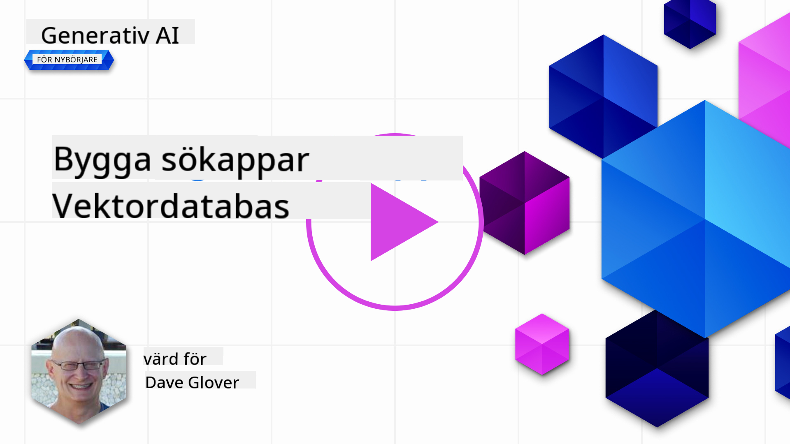
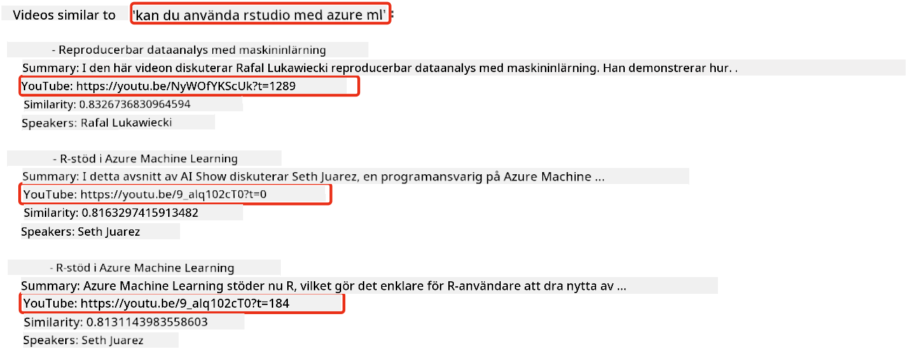
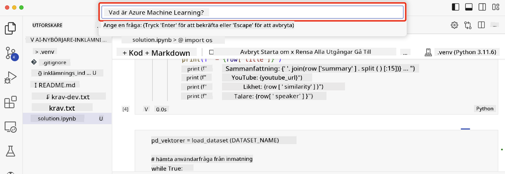

<!--
CO_OP_TRANSLATOR_METADATA:
{
  "original_hash": "d46aad0917a1a342d613e2c13d457da5",
  "translation_date": "2025-05-19T18:31:52+00:00",
  "source_file": "08-building-search-applications/README.md",
  "language_code": "sv"
}
-->
# Bygga sökapplikationer

[](https://aka.ms/gen-ai-lesson8-gh?WT.mc_id=academic-105485-koreyst)

> > _Klicka på bilden ovan för att se videon av denna lektion_

Det finns mer med LLM:er än bara chattbotar och textgenerering. Det är också möjligt att bygga sökapplikationer med hjälp av Embeddings. Embeddings är numeriska representationer av data, även kända som vektorer, och kan användas för semantisk sökning av data.

I denna lektion kommer du att bygga en sökapplikation för vår utbildningsstartup. Vår startup är en ideell organisation som tillhandahåller gratis utbildning till studenter i utvecklingsländer. Vår startup har ett stort antal YouTube-videor som studenter kan använda för att lära sig om AI. Vår startup vill bygga en sökapplikation som tillåter studenter att söka efter en YouTube-video genom att skriva en fråga.

Till exempel kan en student skriva 'Vad är Jupyter Notebooks?' eller 'Vad är Azure ML' och sökapplikationen kommer att returnera en lista med YouTube-videor som är relevanta för frågan, och ännu bättre, sökapplikationen kommer att returnera en länk till platsen i videon där svaret på frågan finns.

## Introduktion

I denna lektion kommer vi att täcka:

- Semantisk vs nyckelordsökning.
- Vad är Text Embeddings.
- Skapa ett Text Embeddings Index.
- Söka i ett Text Embeddings Index.

## Lärandemål

Efter att ha slutfört denna lektion kommer du att kunna:

- Känna skillnaden mellan semantisk och nyckelordsökning.
- Förklara vad Text Embeddings är.
- Skapa en applikation som använder Embeddings för att söka efter data.

## Varför bygga en sökapplikation?

Att skapa en sökapplikation hjälper dig att förstå hur man använder Embeddings för att söka efter data. Du kommer också att lära dig hur man bygger en sökapplikation som kan användas av studenter för att snabbt hitta information.

Lektionens innehåll inkluderar ett Embedding Index av YouTube-transkriptionerna för Microsoft [AI Show](https://www.youtube.com/playlist?list=PLlrxD0HtieHi0mwteKBOfEeOYf0LJU4O1) YouTube-kanal. AI Show är en YouTube-kanal som lär dig om AI och maskininlärning. Embedding Index innehåller Embeddings för var och en av YouTube-transkriptionerna fram till oktober 2023. Du kommer att använda Embedding Index för att bygga en sökapplikation för vår startup. Sökapplikationen returnerar en länk till platsen i videon där svaret på frågan finns. Detta är ett utmärkt sätt för studenter att snabbt hitta den information de behöver.

Följande är ett exempel på en semantisk fråga för frågan 'kan du använda rstudio med azure ml?'. Kolla in YouTube-URL:en, du kommer att se att URL:en innehåller en tidsstämpel som tar dig till platsen i videon där svaret på frågan finns.



## Vad är semantisk sökning?

Nu kanske du undrar, vad är semantisk sökning? Semantisk sökning är en sökteknik som använder semantiken, eller betydelsen, av orden i en fråga för att returnera relevanta resultat.

Här är ett exempel på en semantisk sökning. Låt oss säga att du letade efter att köpa en bil, du kanske söker efter 'min drömbil', semantisk sökning förstår att du inte `dreaming` om en bil, utan snarare att du letar efter att köpa din `ideal` bil. Semantisk sökning förstår din avsikt och returnerar relevanta resultat. Alternativet är `keyword search` som bokstavligen skulle söka efter drömmar om bilar och ofta returnera irrelevanta resultat.

## Vad är Text Embeddings?

[Text embeddings](https://en.wikipedia.org/wiki/Word_embedding?WT.mc_id=academic-105485-koreyst) är en textrepresentationsteknik som används i [naturlig språkbehandling](https://en.wikipedia.org/wiki/Natural_language_processing?WT.mc_id=academic-105485-koreyst). Text embeddings är semantiska numeriska representationer av text. Embeddings används för att representera data på ett sätt som är lätt för en maskin att förstå. Det finns många modeller för att bygga text embeddings, i denna lektion kommer vi att fokusera på att generera embeddings med hjälp av OpenAI Embedding Model.

Här är ett exempel, föreställ dig att följande text finns i en transkription från ett avsnitt på AI Show YouTube-kanalen:

```text
Today we are going to learn about Azure Machine Learning.
```

Vi skulle skicka texten till OpenAI Embedding API och det skulle returnera följande embedding bestående av 1536 nummer, även känd som en vektor. Varje nummer i vektorn representerar en annan aspekt av texten. För korthetens skull är här de första 10 numren i vektorn.

```python
[-0.006655829958617687, 0.0026128944009542465, 0.008792596869170666, -0.02446001023054123, -0.008540431968867779, 0.022071078419685364, -0.010703742504119873, 0.003311325330287218, -0.011632772162556648, -0.02187200076878071, ...]
```

## Hur skapas Embedding Index?

Embedding Index för denna lektion skapades med en serie Python-skript. Du hittar skripten tillsammans med instruktioner i [README](./scripts/README.md?WT.mc_id=academic-105485-koreyst) i 'scripts'-mappen för denna lektion. Du behöver inte köra dessa skript för att slutföra denna lektion eftersom Embedding Index tillhandahålls för dig.

Skripten utför följande operationer:

1. Transkriptionen för varje YouTube-video i [AI Show](https://www.youtube.com/playlist?list=PLlrxD0HtieHi0mwteKBOfEeOYf0LJU4O1) spellistan laddas ner.
2. Med hjälp av [OpenAI Functions](https://learn.microsoft.com/azure/ai-services/openai/how-to/function-calling?WT.mc_id=academic-105485-koreyst), görs ett försök att extrahera talarens namn från de första 3 minuterna av YouTube-transkriptionen. Talarens namn för varje video lagras i Embedding Index som heter `embedding_index_3m.json`.
3. Transkriptionstexten delas sedan upp i **3 minuters textsegment**. Segmentet innehåller cirka 20 ord som överlappar från nästa segment för att säkerställa att Embedding för segmentet inte avbryts och för att ge bättre sökkontext.
4. Varje textsegment skickas sedan till OpenAI Chat API för att sammanfatta texten till 60 ord. Sammanfattningen lagras också i Embedding Index `embedding_index_3m.json`.
5. Slutligen skickas segmenttexten till OpenAI Embedding API. Embedding API returnerar en vektor med 1536 nummer som representerar den semantiska betydelsen av segmentet. Segmentet tillsammans med OpenAI Embedding-vektorn lagras i ett Embedding Index `embedding_index_3m.json`.

### Vektordatabaser

För lektions enkelhet lagras Embedding Index i en JSON-fil som heter `embedding_index_3m.json` och laddas in i en Pandas DataFrame. Men i produktion skulle Embedding Index lagras i en vektordatabas som [Azure Cognitive Search](https://learn.microsoft.com/training/modules/improve-search-results-vector-search?WT.mc_id=academic-105485-koreyst), [Redis](https://cookbook.openai.com/examples/vector_databases/redis/readme?WT.mc_id=academic-105485-koreyst), [Pinecone](https://cookbook.openai.com/examples/vector_databases/pinecone/readme?WT.mc_id=academic-105485-koreyst), [Weaviate](https://cookbook.openai.com/examples/vector_databases/weaviate/readme?WT.mc_id=academic-105485-koreyst), för att nämna några.

## Förstå kosinuslikhet

Vi har lärt oss om text embeddings, nästa steg är att lära sig hur man använder text embeddings för att söka efter data och i synnerhet hitta de mest liknande embeddings till en given fråga med hjälp av kosinuslikhet.

### Vad är kosinuslikhet?

Kosinuslikhet är ett mått på likhet mellan två vektorer, du kommer också att höra detta hänvisas till som `nearest neighbor search`. För att utföra en kosinuslikhetssökning behöver du _vektorisera_ för _fråge_ text med hjälp av OpenAI Embedding API. Sedan beräknar du _kosinuslikheten_ mellan frågevektorn och varje vektor i Embedding Index. Kom ihåg, Embedding Index har en vektor för varje YouTube-transkriptionstextsegment. Slutligen, sortera resultaten efter kosinuslikhet och de textsegment med högst kosinuslikhet är de mest liknande frågan.

Ur ett matematiskt perspektiv mäter kosinuslikhet kosinus av vinkeln mellan två vektorer projicerade i ett flerdimensionellt utrymme. Denna mätning är fördelaktig eftersom om två dokument är långt ifrån varandra enligt euklidiskt avstånd på grund av storlek, kan de fortfarande ha en mindre vinkel mellan dem och därför högre kosinuslikhet. För mer information om kosinuslikhetsekvationer, se [Cosine similarity](https://en.wikipedia.org/wiki/Cosine_similarity?WT.mc_id=academic-105485-koreyst).

## Bygga din första sökapplikation

Nästa steg är att lära sig hur man bygger en sökapplikation med hjälp av Embeddings. Sökapplikationen tillåter studenter att söka efter en video genom att skriva en fråga. Sökapplikationen kommer att returnera en lista med videor som är relevanta för frågan. Sökapplikationen kommer också att returnera en länk till platsen i videon där svaret på frågan finns.

Denna lösning byggdes och testades på Windows 11, macOS och Ubuntu 22.04 med Python 3.10 eller senare. Du kan ladda ner Python från [python.org](https://www.python.org/downloads/?WT.mc_id=academic-105485-koreyst).

## Uppgift - bygga en sökapplikation, för att möjliggöra för studenter

Vi introducerade vår startup i början av denna lektion. Nu är det dags att möjliggöra för studenterna att bygga en sökapplikation för sina bedömningar.

I denna uppgift kommer du att skapa de Azure OpenAI-tjänster som kommer att användas för att bygga sökapplikationen. Du kommer att skapa följande Azure OpenAI-tjänster. Du behöver ett Azure-abonnemang för att slutföra denna uppgift.

### Starta Azure Cloud Shell

1. Logga in på [Azure-portalen](https://portal.azure.com/?WT.mc_id=academic-105485-koreyst).
2. Välj Cloud Shell-ikonen i det övre högra hörnet av Azure-portalen.
3. Välj **Bash** för miljötypen.

#### Skapa en resursgrupp

> För dessa instruktioner använder vi resursgruppen med namnet "semantic-video-search" i East US.
> Du kan ändra namnet på resursgruppen, men när du ändrar platsen för resurserna,
> kontrollera [modell tillgänglighetstabellen](https://aka.ms/oai/models?WT.mc_id=academic-105485-koreyst).

```shell
az group create --name semantic-video-search --location eastus
```

#### Skapa en Azure OpenAI Service-resurs

Från Azure Cloud Shell, kör följande kommando för att skapa en Azure OpenAI Service-resurs.

```shell
az cognitiveservices account create --name semantic-video-openai --resource-group semantic-video-search \
    --location eastus --kind OpenAI --sku s0
```

#### Få slutpunkt och nycklar för användning i denna applikation

Från Azure Cloud Shell, kör följande kommandon för att få slutpunkt och nycklar för Azure OpenAI Service-resursen.

```shell
az cognitiveservices account show --name semantic-video-openai \
   --resource-group  semantic-video-search | jq -r .properties.endpoint
az cognitiveservices account keys list --name semantic-video-openai \
   --resource-group semantic-video-search | jq -r .key1
```

#### Distribuera OpenAI Embedding-modellen

Från Azure Cloud Shell, kör följande kommando för att distribuera OpenAI Embedding-modellen.

```shell
az cognitiveservices account deployment create \
    --name semantic-video-openai \
    --resource-group  semantic-video-search \
    --deployment-name text-embedding-ada-002 \
    --model-name text-embedding-ada-002 \
    --model-version "2"  \
    --model-format OpenAI \
    --sku-capacity 100 --sku-name "Standard"
```

## Lösning

Öppna [lösningsanteckningsboken](../../../08-building-search-applications/python/aoai-solution.ipynb) i GitHub Codespaces och följ instruktionerna i Jupyter Notebook.

När du kör anteckningsboken, kommer du att bli ombedd att ange en fråga. Inmatningsrutan kommer att se ut så här:



## Bra Jobbat! Fortsätt ditt lärande

Efter att ha slutfört denna lektion, kolla in vår [Generativ AI-lärandekollektion](https://aka.ms/genai-collection?WT.mc_id=academic-105485-koreyst) för att fortsätta öka din kunskap om Generativ AI!

Gå vidare till Lektion 9 där vi kommer att titta på hur man [bygger bildgenereringsapplikationer](../09-building-image-applications/README.md?WT.mc_id=academic-105485-koreyst)!

**Ansvarsfriskrivning**:  
Detta dokument har översatts med hjälp av AI-översättningstjänsten [Co-op Translator](https://github.com/Azure/co-op-translator). Även om vi strävar efter noggrannhet, var medveten om att automatiserade översättningar kan innehålla fel eller felaktigheter. Det ursprungliga dokumentet på dess ursprungliga språk bör betraktas som den auktoritativa källan. För kritisk information rekommenderas professionell mänsklig översättning. Vi ansvarar inte för eventuella missförstånd eller feltolkningar som uppstår vid användning av denna översättning.