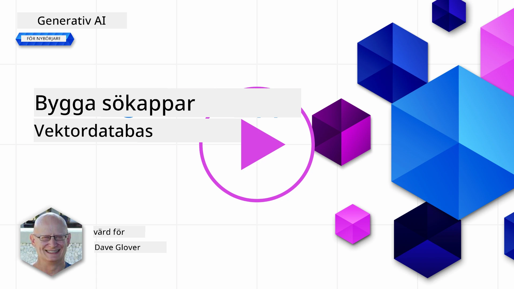
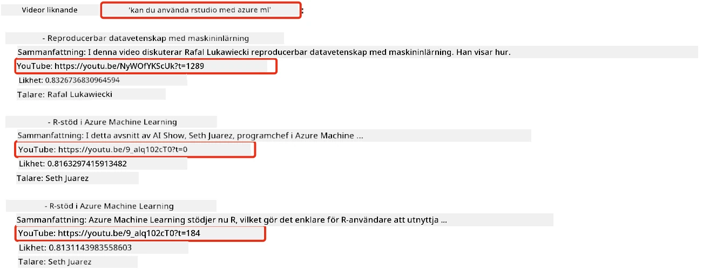
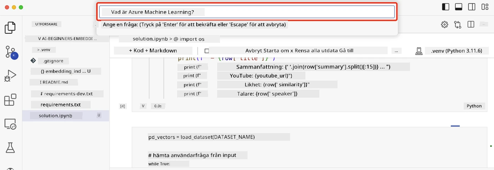

# Bygga sökapplikationer

[](https://youtu.be/W0-nzXjOjr0?si=GcsqiTTvd7RKbo7V)

> > _Klicka på bilden ovan för att se videon för denna lektion_

Det finns mer med LLM än chattbotar och textgenerering. Det är också möjligt att bygga sökapplikationer med hjälp av Embeddings. Embeddings är numeriska representationer av data, även kallade vektorer, och kan användas för semantisk sökning i data.

I denna lektion ska du bygga en sökapplikation för vårt utbildningsstartupföretag. Vårt startup är en ideell organisation som erbjuder gratis utbildning till studenter i utvecklingsländer. Vårt startup har ett stort antal YouTube-videor som studenter kan använda för att lära sig om AI. Vårt startup vill bygga en sökapplikation som låter studenter söka efter en YouTube-video genom att skriva en fråga.

Till exempel kan en student skriva in 'Vad är Jupyter Notebooks?' eller 'Vad är Azure ML' och sökapplikationen kommer att returnera en lista med YouTube-videor som är relevanta för frågan. Ännu bättre, sökapplikationen kommer att ge en länk till platsen i videon där svaret på frågan finns.

## Introduktion

I denna lektion kommer vi att gå igenom:

- Semantisk sökning vs sökning med nyckelord.
- Vad Text Embeddings är.
- Skapa ett Text Embeddings-index.
- Söka i ett Text Embeddings-index.

## Lärandemål

Efter att ha genomfört denna lektion kommer du kunna:

- Skilja mellan semantisk sökning och sökning med nyckelord.
- Förklara vad Text Embeddings är.
- Skapa en applikation med Embeddings för att söka i data.

## Varför bygga en sökapplikation?

Att skapa en sökapplikation hjälper dig att förstå hur man använder Embeddings för att söka i data. Du kommer också lära dig att bygga en applikation som studenter kan använda för att snabbt hitta information.

Lektionen inkluderar ett Embeddings-index över YouTube-transkriptionerna för Microsofts [AI Show](https://www.youtube.com/playlist?list=PLlrxD0HtieHi0mwteKBOfEeOYf0LJU4O1) YouTube-kanal. AI Show är en kanal som lär dig om AI och maskininlärning. Embeddings-indexet innehåller embeddings för varje YouTube-transkription fram till oktober 2023. Du kommer använda Embeddings-indexet för att bygga en sökapplikation för vårt startup. Applikationen returnerar en länk till platsen i videon där svaret på frågan finns. Detta är ett utmärkt sätt för studenter att snabbt hitta informationen de behöver.

Följande är ett exempel på en semantisk sökfråga för frågan 'kan du använda rstudio med azure ml?'. Kolla in YouTube-URL:en, du kommer se att URL:en innehåller en tidsstämpel som tar dig till platsen i videon där svaret på frågan finns.



## Vad är semantisk sökning?

Du kanske undrar, vad är semantisk sökning? Semantisk sökning är en sökteknik som använder betydelsen av orden i en fråga för att returnera relevanta resultat.

Här är ett exempel på semantisk sökning. Säg att du vill köpa en bil och söker på 'min drömbil', semantisk sökning förstår att du inte `drömmer` om en bil utan att du söker efter din `ideala` bil. Semantisk sökning förstår din avsikt och returnerar relevanta resultat. Alternativet är `sökning med nyckelord` som bokstavligen skulle söka efter drömmar om bilar och ofta returnera irrelevanta resultat.

## Vad är Text Embeddings?

[Text embeddings](https://en.wikipedia.org/wiki/Word_embedding?WT.mc_id=academic-105485-koreyst) är en textrepresentationsmetod som används inom [naturlig språkbehandling](https://en.wikipedia.org/wiki/Natural_language_processing?WT.mc_id=academic-105485-koreyst). Text embeddings är semantiska numeriska representationer av text. Embeddings används för att representera data på ett sätt som är lätt för en maskin att förstå. Det finns många modeller för att skapa text embeddings, i denna lektion fokuserar vi på att generera embeddings med OpenAI Embedding-modellen.

Här är ett exempel, föreställ dig att följande text är i en transkription från ett av avsnitten på AI Show YouTube-kanalen:

```text
Today we are going to learn about Azure Machine Learning.
```

Vi skickar texten till OpenAI Embedding API och det returnerar följande embedding bestående av 1536 siffror, också kallat en vektor. Varje nummer i vektorn representerar en annan aspekt av texten. För enkelhetens skull visas här de första 10 numren i vektorn.

```python
[-0.006655829958617687, 0.0026128944009542465, 0.008792596869170666, -0.02446001023054123, -0.008540431968867779, 0.022071078419685364, -0.010703742504119873, 0.003311325330287218, -0.011632772162556648, -0.02187200076878071, ...]
```

## Hur skapas Embeddings-indexet?

Embeddings-indexet för denna lektion skapades med en serie Python-skript. Du hittar skripten tillsammans med instruktioner i [README](./scripts/README.md?WT.mc_id=academic-105485-koreyst) i mappen `scripts` för denna lektion. Du behöver inte köra dessa skript för att genomföra lektionen eftersom Embeddings-indexet redan finns tillgängligt.

Skripten utför följande operationer:

1. Transkriptionen för varje YouTube-video i [AI Show](https://www.youtube.com/playlist?list=PLlrxD0HtieHi0mwteKBOfEeOYf0LJU4O1)-spellistan hämtas ned.
2. Med hjälp av [OpenAI Functions](https://learn.microsoft.com/azure/ai-foundry/openai/how-to/function-calling?WT.mc_id=academic-105485-koreyst) försöker man extrahera talarens namn från de första 3 minuterna av YouTube-transkriptionen. Namnet på talaren för varje video lagras i Embeddings-indexet som heter `embedding_index_3m.json`.
3. Transkriptionstexten delas sedan upp i **3-minuters textsegment**. Segmentet inkluderar ungefär 20 ord överlappande från nästa segment för att säkerställa att Embeddingen för segmentet inte kapas och för att ge bättre sökkontext.
4. Varje textsegment skickas sedan till OpenAI Chat API för att sammanfatta texten till 60 ord. Sammanfattningen lagras också i Embeddings-indexet `embedding_index_3m.json`.
5. Slutligen skickas segmenttexten till OpenAI Embedding API. Embedding API returnerar en vektor med 1536 siffror som representerar den semantiska innebörden av segmentet. Segmentet tillsammans med OpenAI Embedding-vektorn lagras i Embeddings-indexet `embedding_index_3m.json`.

### Vektordatabaser

För enkelhetens skull lagras Embeddings-indexet i en JSON-fil som heter `embedding_index_3m.json` och laddas in i en Pandas DataFrame. I produktion skulle dock Embeddings-indexet lagras i en vektordatabas som till exempel [Azure Cognitive Search](https://learn.microsoft.com/training/modules/improve-search-results-vector-search?WT.mc_id=academic-105485-koreyst), [Redis](https://cookbook.openai.com/examples/vector_databases/redis/readme?WT.mc_id=academic-105485-koreyst), [Pinecone](https://cookbook.openai.com/examples/vector_databases/pinecone/readme?WT.mc_id=academic-105485-koreyst), [Weaviate](https://cookbook.openai.com/examples/vector_databases/weaviate/readme?WT.mc_id=academic-105485-koreyst), för att nämna några.

## Förståelse för cosinuslikhet

Vi har lärt oss om text embeddings, nästa steg är att lära oss hur vi använder text embeddings för att söka i data och särskilt för att hitta de mest lika embeddings till en given fråga med hjälp av cosinuslikhet.

### Vad är cosinuslikhet?

Cosinuslikhet är ett mått på likheten mellan två vektorer, det kallas också för `närmast granne-sökning`. För att utföra en cosinuslikhetssökning behöver du _vektorisera_ _fråge_-texten med OpenAI Embedding API. Sedan beräknar du _cosinuslikheten_ mellan frågevektorn och varje vektor i Embeddings-indexet. Kom ihåg att Embeddings-indexet har en vektor för varje textsegment i YouTube-transkriptionerna. Sortera sedan resultaten efter cosinuslikhet och de textsegment med högst cosinuslikhet är mest lika frågan.

Ur ett matematiskt perspektiv mäter cosinuslikhet cosinus av vinkeln mellan två vektorer projicerade i ett flerdimensionellt rum. Detta mått är fördelaktigt eftersom om två dokument är långt ifrån varandra enligt Euklidiskt avstånd på grund av storlek, kan de ändå ha en mindre vinkel mellan sig och därför högre cosinuslikhet. För mer information om cosinuslikhetsformler, se [Cosinuslikhet](https://en.wikipedia.org/wiki/Cosine_similarity?WT.mc_id=academic-105485-koreyst).

## Bygg din första sökapplikation

Nästa steg är att lära sig bygga en sökapplikation med Embeddings. Sökapplikationen låter studenter söka efter en video genom att skriva en fråga. Applikationen returnerar en lista med videor som är relevanta för frågan. Den returnerar även en länk till platsen i videon där svaret finns.

Den här lösningen byggdes och testades på Windows 11, macOS och Ubuntu 22.04 med Python 3.10 eller senare. Du kan ladda ner Python från [python.org](https://www.python.org/downloads/?WT.mc_id=academic-105485-koreyst).

## Uppgift - bygga en sökapplikation för att hjälpa studenter

Vi presenterade vårt startup i början av lektionen. Nu är det dags att låta studenter bygga en sökapplikation för sina uppgifter.

I denna uppgift kommer du skapa Azure OpenAI-tjänster som ska användas för att bygga sökapplikationen. Du kommer skapa följande Azure OpenAI-tjänster. Du behöver en Azure-prenumeration för att genomföra uppgiften.

### Starta Azure Cloud Shell

1. Logga in på [Azure-portalen](https://portal.azure.com/?WT.mc_id=academic-105485-koreyst).
2. Välj Cloud Shell-ikonen uppe till höger i Azure-portalen.
3. Välj **Bash** som miljötyp.

#### Skapa en resursgrupp

> För dessa instruktioner använder vi resursgruppen "semantic-video-search" i East US.
> Du kan ändra namnet på resursgruppen, men vid ändring av plats för resurserna,
> kontrollera [modellens tillgänglighetstabell](https://aka.ms/oai/models?WT.mc_id=academic-105485-koreyst).

```shell
az group create --name semantic-video-search --location eastus
```

#### Skapa en Azure OpenAI Service-resurs

Kör följande kommando från Azure Cloud Shell för att skapa en Azure OpenAI Service-resurs.

```shell
az cognitiveservices account create --name semantic-video-openai --resource-group semantic-video-search \
    --location eastus --kind OpenAI --sku s0
```

#### Hämta slutpunkt och nycklar för användning i denna applikation

Kör följande kommandon från Azure Cloud Shell för att hämta slutpunkt och nycklar för Azure OpenAI Service-resursen.

```shell
az cognitiveservices account show --name semantic-video-openai \
   --resource-group  semantic-video-search | jq -r .properties.endpoint
az cognitiveservices account keys list --name semantic-video-openai \
   --resource-group semantic-video-search | jq -r .key1
```

#### Distribuera OpenAI Embedding-modellen

Kör följande kommando från Azure Cloud Shell för att distribuera OpenAI Embedding-modellen.

```shell
az cognitiveservices account deployment create \
    --name semantic-video-openai \
    --resource-group  semantic-video-search \
    --deployment-name text-embedding-ada-002 \
    --model-name text-embedding-ada-002 \
    --model-version "2"  \
    --model-format OpenAI \
    --sku-capacity 100 --sku-name "Standard"
```

## Lösning

Öppna [lösningsanteckningsboken](./python/aoai-solution.ipynb?WT.mc_id=academic-105485-koreyst) i GitHub Codespaces och följ instruktionerna i Jupyter-notebooken.

När du kör notebooken kommer du uppmanas att skriva in en fråga. Indataboxen ser ut så här:



## Bra jobbat! Fortsätt ditt lärande

Efter att ha avslutat denna lektion, kolla in vår [Generative AI Learning-samling](https://aka.ms/genai-collection?WT.mc_id=academic-105485-koreyst) för att fortsätta stärka dina kunskaper inom Generativ AI!

Gå vidare till Lektion 9 där vi ska titta på hur man [bygger applikationer för bildgenerering](../09-building-image-applications/README.md?WT.mc_id=academic-105485-koreyst)!

---

<!-- CO-OP TRANSLATOR DISCLAIMER START -->
**Ansvarsfriskrivning**:
Detta dokument har översatts med hjälp av AI-översättningstjänsten [Co-op Translator](https://github.com/Azure/co-op-translator). Även om vi strävar efter noggrannhet, var vänlig notera att automatiska översättningar kan innehålla fel eller brister. Det ursprungliga dokumentet på dess modersmål bör betraktas som den auktoritativa källan. För kritisk information rekommenderas professionell mänsklig översättning. Vi ansvarar inte för några missförstånd eller feltolkningar som uppstår till följd av användningen av denna översättning.
<!-- CO-OP TRANSLATOR DISCLAIMER END -->