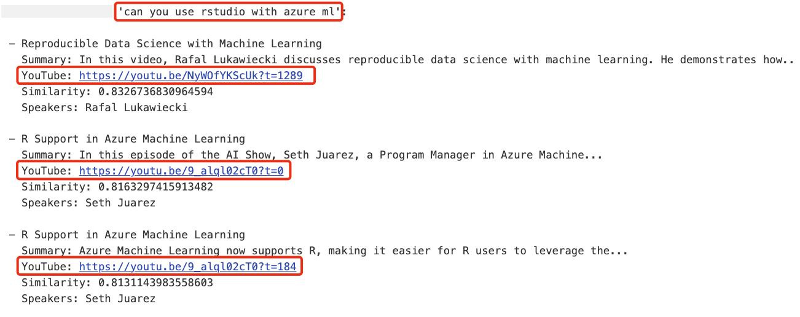

<!--
CO_OP_TRANSLATOR_METADATA:
{
  "original_hash": "d46aad0917a1a342d613e2c13d457da5",
  "translation_date": "2025-07-09T12:56:11+00:00",
  "source_file": "08-building-search-applications/README.md",
  "language_code": "sv"
}
-->
# Bygga sökapplikationer

[](https://aka.ms/gen-ai-lesson8-gh?WT.mc_id=academic-105485-koreyst)

> > _Klicka på bilden ovan för att se videon till denna lektion_

LLM:er handlar om mer än bara chattbotar och textgenerering. Det går också att bygga sökapplikationer med hjälp av Embeddings. Embeddings är numeriska representationer av data, även kallade vektorer, och kan användas för semantisk sökning i data.

I denna lektion ska du bygga en sökapplikation för vårt utbildningsstartup. Vårt startup är en ideell organisation som erbjuder gratis utbildning till studenter i utvecklingsländer. Vi har ett stort antal YouTube-videor som studenter kan använda för att lära sig om AI. Vårt startup vill bygga en sökapplikation som låter studenter söka efter en YouTube-video genom att skriva en fråga.

Till exempel kan en student skriva "Vad är Jupyter Notebooks?" eller "Vad är Azure ML" och sökapplikationen kommer att returnera en lista med YouTube-videor som är relevanta för frågan, och ännu bättre, sökapplikationen kommer att ge en länk till den plats i videon där svaret på frågan finns.

## Introduktion

I denna lektion kommer vi att gå igenom:

- Semantisk sökning vs nyckelordssökning.
- Vad Text Embeddings är.
- Skapa ett Text Embeddings-index.
- Söka i ett Text Embeddings-index.

## Lärandemål

Efter att ha genomfört denna lektion kommer du att kunna:

- Förklara skillnaden mellan semantisk och nyckelordssökning.
- Förklara vad Text Embeddings är.
- Skapa en applikation som använder Embeddings för att söka i data.

## Varför bygga en sökapplikation?

Att skapa en sökapplikation hjälper dig att förstå hur man använder Embeddings för att söka i data. Du lär dig också hur man bygger en sökapplikation som studenter kan använda för att snabbt hitta information.

Lektionens Embedding-index innehåller YouTube-transkriptionerna för Microsofts [AI Show](https://www.youtube.com/playlist?list=PLlrxD0HtieHi0mwteKBOfEeOYf0LJU4O1) YouTube-kanal. AI Show är en kanal som lär ut AI och maskininlärning. Embedding-indexet innehåller Embeddings för varje YouTube-transkription fram till oktober 2023. Du kommer att använda Embedding-indexet för att bygga en sökapplikation för vårt startup. Sökapplikationen returnerar en länk till den plats i videon där svaret på frågan finns. Detta är ett utmärkt sätt för studenter att snabbt hitta den information de behöver.

Nedan är ett exempel på en semantisk sökfråga för frågan "kan du använda rstudio med azure ml?". Kolla in YouTube-URL:en, du ser att URL:en innehåller en tidsstämpel som tar dig till den plats i videon där svaret finns.



## Vad är semantisk sökning?

Du kanske undrar, vad är semantisk sökning? Semantisk sökning är en sökteknik som använder ordenas betydelse i en fråga för att returnera relevanta resultat.

Här är ett exempel på semantisk sökning. Säg att du vill köpa en bil och söker på "min drömbil". Semantisk sökning förstår att du inte drömmer om en bil, utan att du letar efter din ideala bil. Semantisk sökning förstår din avsikt och ger relevanta resultat. Alternativet är nyckelordssökning som bokstavligen skulle söka efter drömmar om bilar och ofta ger irrelevanta resultat.

## Vad är Text Embeddings?

[Text embeddings](https://en.wikipedia.org/wiki/Word_embedding?WT.mc_id=academic-105485-koreyst) är en teknik för textrepresentation som används inom [naturlig språkbehandling](https://en.wikipedia.org/wiki/Natural_language_processing?WT.mc_id=academic-105485-koreyst). Text embeddings är semantiska numeriska representationer av text. Embeddings används för att representera data på ett sätt som är lätt för en maskin att förstå. Det finns många modeller för att skapa text embeddings, i denna lektion fokuserar vi på att generera embeddings med OpenAI Embedding Model.

Här är ett exempel, tänk dig att följande text är från en transkription av ett av avsnitten på AI Show YouTube-kanal:

```text
Today we are going to learn about Azure Machine Learning.
```

Vi skickar texten till OpenAI Embedding API och får tillbaka följande embedding bestående av 1536 siffror, alltså en vektor. Varje siffra i vektorn representerar en annan aspekt av texten. För att göra det kort visar vi här de första 10 siffrorna i vektorn.

```python
[-0.006655829958617687, 0.0026128944009542465, 0.008792596869170666, -0.02446001023054123, -0.008540431968867779, 0.022071078419685364, -0.010703742504119873, 0.003311325330287218, -0.011632772162556648, -0.02187200076878071, ...]
```

## Hur skapas Embedding-indexet?

Embedding-indexet för denna lektion skapades med en serie Python-skript. Du hittar skripten tillsammans med instruktioner i [README](./scripts/README.md?WT.mc_id=academic-105485-koreyst) i mappen 'scripts' för denna lektion. Du behöver inte köra dessa skript för att slutföra lektionen eftersom Embedding-indexet redan finns tillgängligt.

Skripten utför följande steg:

1. Transkriptionen för varje YouTube-video i [AI Show](https://www.youtube.com/playlist?list=PLlrxD0HtieHi0mwteKBOfEeOYf0LJU4O1) spellistan laddas ner.
2. Med hjälp av [OpenAI Functions](https://learn.microsoft.com/azure/ai-services/openai/how-to/function-calling?WT.mc_id=academic-105485-koreyst) försöker man extrahera talarens namn från de första 3 minuterna av YouTube-transkriptionen. Talarnamnet för varje video sparas i Embedding-indexet `embedding_index_3m.json`.
3. Transkriptionstexten delas sedan upp i **3-minuters textsegment**. Segmentet inkluderar cirka 20 ord som överlappar med nästa segment för att säkerställa att Embedding för segmentet inte kapas och för att ge bättre sökkontext.
4. Varje textsegment skickas sedan till OpenAI Chat API för att sammanfatta texten till 60 ord. Sammanfattningen sparas också i Embedding-indexet `embedding_index_3m.json`.
5. Slutligen skickas segmenttexten till OpenAI Embedding API. Embedding API returnerar en vektor med 1536 siffror som representerar segmentets semantiska betydelse. Segmentet tillsammans med OpenAI Embedding-vektorn sparas i Embedding-indexet `embedding_index_3m.json`.

### Vektordatabaser

För enkelhetens skull lagras Embedding-indexet i en JSON-fil som heter `embedding_index_3m.json` och laddas in i en Pandas DataFrame. Men i produktion skulle Embedding-indexet lagras i en vektordatabas som till exempel [Azure Cognitive Search](https://learn.microsoft.com/training/modules/improve-search-results-vector-search?WT.mc_id=academic-105485-koreyst), [Redis](https://cookbook.openai.com/examples/vector_databases/redis/readme?WT.mc_id=academic-105485-koreyst), [Pinecone](https://cookbook.openai.com/examples/vector_databases/pinecone/readme?WT.mc_id=academic-105485-koreyst), [Weaviate](https://cookbook.openai.com/examples/vector_databases/weaviate/readme?WT.mc_id=academic-105485-koreyst), för att nämna några.

## Förstå cosine similarity

Vi har lärt oss om text embeddings, nästa steg är att lära sig hur man använder text embeddings för att söka i data och särskilt hitta de mest liknande embeddings till en given fråga med hjälp av cosine similarity.

### Vad är cosine similarity?

Cosine similarity är ett mått på likhet mellan två vektorer, det kallas också ibland för `nearest neighbor search`. För att göra en cosine similarity-sökning behöver du _vektorisera_ _frågetexten_ med OpenAI Embedding API. Sedan beräknar du _cosine similarity_ mellan frågevektorn och varje vektor i Embedding-indexet. Kom ihåg att Embedding-indexet har en vektor för varje textsegment i YouTube-transkriptionen. Slutligen sorterar du resultaten efter cosine similarity och de textsegment med högst cosine similarity är mest lika frågan.

Ur ett matematiskt perspektiv mäter cosine similarity cosinus för vinkeln mellan två vektorer projicerade i ett flerdimensionellt rum. Detta mått är användbart eftersom om två dokument är långt ifrån varandra enligt Euklidiskt avstånd på grund av storlek, kan de ändå ha en mindre vinkel mellan sig och därmed högre cosine similarity. För mer information om cosine similarity-formler, se [Cosine similarity](https://en.wikipedia.org/wiki/Cosine_similarity?WT.mc_id=academic-105485-koreyst).

## Bygg din första sökapplikation

Nu ska vi lära oss hur man bygger en sökapplikation med Embeddings. Sökapplikationen låter studenter söka efter en video genom att skriva en fråga. Applikationen returnerar en lista med videor som är relevanta för frågan. Den ger också en länk till den plats i videon där svaret finns.

Denna lösning har byggts och testats på Windows 11, macOS och Ubuntu 22.04 med Python 3.10 eller senare. Du kan ladda ner Python från [python.org](https://www.python.org/downloads/?WT.mc_id=academic-105485-koreyst).

## Uppgift – bygga en sökapplikation för att hjälpa studenter

Vi presenterade vårt startup i början av lektionen. Nu är det dags att låta studenterna bygga en sökapplikation för sina uppgifter.

I denna uppgift ska du skapa Azure OpenAI-tjänster som används för att bygga sökapplikationen. Du kommer att skapa följande Azure OpenAI-tjänster. Du behöver en Azure-prenumeration för att slutföra uppgiften.

### Starta Azure Cloud Shell

1. Logga in på [Azure-portalen](https://portal.azure.com/?WT.mc_id=academic-105485-koreyst).
2. Välj Cloud Shell-ikonen uppe till höger i Azure-portalen.
3. Välj **Bash** som miljötyp.

#### Skapa en resursgrupp

> För dessa instruktioner använder vi resursgruppen med namnet "semantic-video-search" i East US.
> Du kan ändra namnet på resursgruppen, men om du ändrar platsen för resurserna,
> kontrollera [modellens tillgänglighetstabell](https://aka.ms/oai/models?WT.mc_id=academic-105485-koreyst).

```shell
az group create --name semantic-video-search --location eastus
```

#### Skapa en Azure OpenAI Service-resurs

Från Azure Cloud Shell, kör följande kommando för att skapa en Azure OpenAI Service-resurs.

```shell
az cognitiveservices account create --name semantic-video-openai --resource-group semantic-video-search \
    --location eastus --kind OpenAI --sku s0
```

#### Hämta endpoint och nycklar för användning i denna applikation

Från Azure Cloud Shell, kör följande kommandon för att hämta endpoint och nycklar för Azure OpenAI Service-resursen.

```shell
az cognitiveservices account show --name semantic-video-openai \
   --resource-group  semantic-video-search | jq -r .properties.endpoint
az cognitiveservices account keys list --name semantic-video-openai \
   --resource-group semantic-video-search | jq -r .key1
```

#### Distribuera OpenAI Embedding-modellen

Från Azure Cloud Shell, kör följande kommando för att distribuera OpenAI Embedding-modellen.

```shell
az cognitiveservices account deployment create \
    --name semantic-video-openai \
    --resource-group  semantic-video-search \
    --deployment-name text-embedding-ada-002 \
    --model-name text-embedding-ada-002 \
    --model-version "2"  \
    --model-format OpenAI \
    --sku-capacity 100 --sku-name "Standard"
```

## Lösning

Öppna [lösningsnotebooken](python/aoai-solution.ipynb) i GitHub Codespaces och följ instruktionerna i Jupyter Notebook.

När du kör notebooken kommer du att uppmanas att skriva in en fråga. Inmatningsrutan ser ut så här:


## Bra jobbat! Fortsätt lära dig

Efter att ha slutfört denna lektion, kolla in vår [Generative AI Learning collection](https://aka.ms/genai-collection?WT.mc_id=academic-105485-koreyst) för att fortsätta utveckla dina kunskaper inom Generative AI!

Gå vidare till Lektion 9 där vi tittar på hur man [bygger applikationer för bildgenerering](../09-building-image-applications/README.md?WT.mc_id=academic-105485-koreyst)!

**Ansvarsfriskrivning**:  
Detta dokument har översatts med hjälp av AI-översättningstjänsten [Co-op Translator](https://github.com/Azure/co-op-translator). Även om vi strävar efter noggrannhet, vänligen observera att automatiska översättningar kan innehålla fel eller brister. Det ursprungliga dokumentet på dess modersmål bör betraktas som den auktoritativa källan. För kritisk information rekommenderas professionell mänsklig översättning. Vi ansvarar inte för några missförstånd eller feltolkningar som uppstår vid användning av denna översättning.