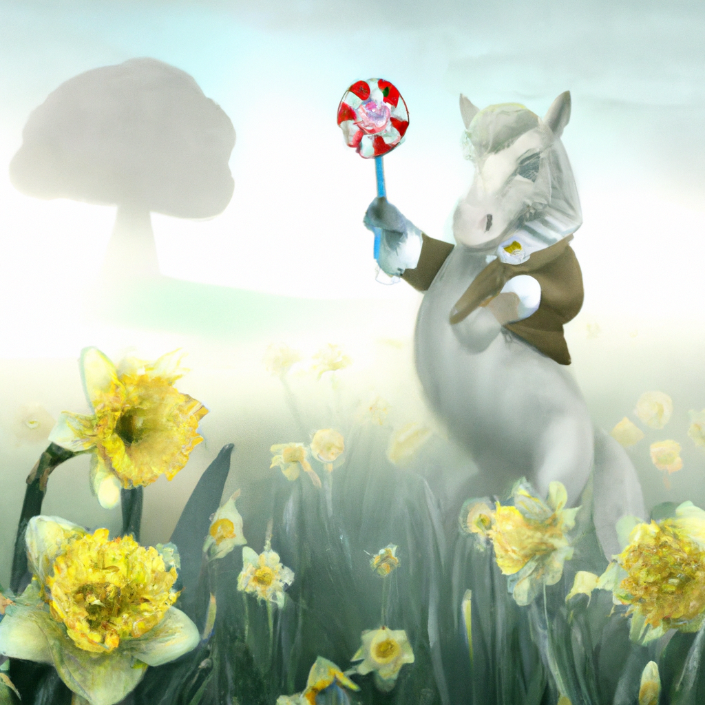

<!--
CO_OP_TRANSLATOR_METADATA:
{
  "original_hash": "1a7fd0f95f9eb673b79da47c0814f4d4",
  "translation_date": "2025-07-09T13:26:43+00:00",
  "source_file": "09-building-image-applications/README.md",
  "language_code": "sv"
}
-->
# Bygga applikationer för bildgenerering

[](https://aka.ms/gen-ai-lesson9-gh?WT.mc_id=academic-105485-koreyst)

LLM:er handlar inte bara om textgenerering. Det är också möjligt att generera bilder från textbeskrivningar. Att ha bilder som en modalitet kan vara mycket användbart inom flera områden, från MedTech, arkitektur, turism, spelutveckling och mer. I detta kapitel kommer vi att titta på de två mest populära modellerna för bildgenerering, DALL-E och Midjourney.

## Introduktion

I denna lektion kommer vi att täcka:

- Bildgenerering och varför det är användbart.
- DALL-E och Midjourney, vad de är och hur de fungerar.
- Hur du bygger en applikation för bildgenerering.

## Lärandemål

Efter att ha genomfört denna lektion kommer du att kunna:

- Bygga en applikation för bildgenerering.
- Definiera gränser för din applikation med metaprompter.
- Arbeta med DALL-E och Midjourney.

## Varför bygga en applikation för bildgenerering?

Applikationer för bildgenerering är ett utmärkt sätt att utforska möjligheterna med Generativ AI. De kan användas för exempelvis:

- **Bildredigering och syntes**. Du kan generera bilder för en mängd olika användningsområden, som bildredigering och bildsyntes.

- **Tillämpningar inom olika branscher**. De kan också användas för att generera bilder för olika branscher som Medtech, turism, spelutveckling och mer.

## Scenario: Edu4All

Som en del av denna lektion kommer vi att fortsätta arbeta med vår startup, Edu4All. Studenterna kommer att skapa bilder för sina uppgifter, exakt vilka bilder är upp till studenterna, men det kan vara illustrationer till deras egna sagor, skapa en ny karaktär till deras berättelse eller hjälpa dem att visualisera sina idéer och koncept.

Här är ett exempel på vad Edu4Alls studenter skulle kunna generera om de arbetar med monument i klassen:


med en prompt som

> "Hund bredvid Eiffeltornet i morgonsolens tidiga sken"

## Vad är DALL-E och Midjourney?

[DALL-E](https://openai.com/dall-e-2?WT.mc_id=academic-105485-koreyst) och [Midjourney](https://www.midjourney.com/?WT.mc_id=academic-105485-koreyst) är två av de mest populära modellerna för bildgenerering, de låter dig använda prompts för att generera bilder.

### DALL-E

Vi börjar med DALL-E, som är en Generativ AI-modell som genererar bilder från textbeskrivningar.

> [DALL-E är en kombination av två modeller, CLIP och diffused attention](https://towardsdatascience.com/openais-dall-e-and-clip-101-a-brief-introduction-3a4367280d4e?WT.mc_id=academic-105485-koreyst).

- **CLIP** är en modell som genererar embeddings, vilket är numeriska representationer av data, från bilder och text.

- **Diffused attention** är en modell som genererar bilder från embeddings. DALL-E är tränad på en dataset med bilder och text och kan användas för att generera bilder från textbeskrivningar. Till exempel kan DALL-E användas för att generera bilder av en katt med hatt, eller en hund med mohawk.

### Midjourney

Midjourney fungerar på liknande sätt som DALL-E, den genererar bilder från textprompter. Midjourney kan också användas för att generera bilder med prompts som “en katt med hatt” eller “en hund med mohawk”.


_Bildkälla Wikipedia, bild genererad av Midjourney_

## Hur fungerar DALL-E och Midjourney

Först, [DALL-E](https://arxiv.org/pdf/2102.12092.pdf?WT.mc_id=academic-105485-koreyst). DALL-E är en Generativ AI-modell baserad på transformer-arkitekturen med en _autoregressiv transformer_.

En _autoregressiv transformer_ definierar hur en modell genererar bilder från textbeskrivningar, den genererar en pixel i taget och använder sedan de genererade pixlarna för att generera nästa pixel. Den passerar genom flera lager i ett neuralt nätverk tills bilden är komplett.

Med denna process kontrollerar DALL-E attribut, objekt, egenskaper och mer i den bild den genererar. Dock har DALL-E 2 och 3 mer kontroll över den genererade bilden.

## Bygga din första applikation för bildgenerering

Så vad krävs för att bygga en applikation för bildgenerering? Du behöver följande bibliotek:

- **python-dotenv**, det rekommenderas starkt att använda detta bibliotek för att hålla dina hemligheter i en _.env_-fil bort från koden.
- **openai**, detta bibliotek använder du för att interagera med OpenAI API.
- **pillow**, för att arbeta med bilder i Python.
- **requests**, för att hjälpa dig göra HTTP-förfrågningar.

1. Skapa en fil _.env_ med följande innehåll:

   ```text
   AZURE_OPENAI_ENDPOINT=<your endpoint>
   AZURE_OPENAI_API_KEY=<your key>
   ```

   Hitta denna information i Azure Portal för din resurs under sektionen "Keys and Endpoint".

1. Samla ovanstående bibliotek i en fil som heter _requirements.txt_ så här:

   ```text
   python-dotenv
   openai
   pillow
   requests
   ```

1. Skapa sedan en virtuell miljö och installera biblioteken:

   ```bash
   python3 -m venv venv
   source venv/bin/activate
   pip install -r requirements.txt
   ```

   För Windows, använd följande kommandon för att skapa och aktivera din virtuella miljö:

   ```bash
   python3 -m venv venv
   venv\Scripts\activate.bat
   ```

1. Lägg till följande kod i en fil som heter _app.py_:

   ```python
   import openai
   import os
   import requests
   from PIL import Image
   import dotenv

   # import dotenv
   dotenv.load_dotenv()

   # Get endpoint and key from environment variables
   openai.api_base = os.environ['AZURE_OPENAI_ENDPOINT']
   openai.api_key = os.environ['AZURE_OPENAI_API_KEY']

   # Assign the API version (DALL-E is currently supported for the 2023-06-01-preview API version only)
   openai.api_version = '2023-06-01-preview'
   openai.api_type = 'azure'


   try:
       # Create an image by using the image generation API
       generation_response = openai.Image.create(
           prompt='Bunny on horse, holding a lollipop, on a foggy meadow where it grows daffodils',    # Enter your prompt text here
           size='1024x1024',
           n=2,
           temperature=0,
       )
       # Set the directory for the stored image
       image_dir = os.path.join(os.curdir, 'images')

       # If the directory doesn't exist, create it
       if not os.path.isdir(image_dir):
           os.mkdir(image_dir)

       # Initialize the image path (note the filetype should be png)
       image_path = os.path.join(image_dir, 'generated-image.png')

       # Retrieve the generated image
       image_url = generation_response["data"][0]["url"]  # extract image URL from response
       generated_image = requests.get(image_url).content  # download the image
       with open(image_path, "wb") as image_file:
           image_file.write(generated_image)

       # Display the image in the default image viewer
       image = Image.open(image_path)
       image.show()

   # catch exceptions
   except openai.InvalidRequestError as err:
       print(err)

   ```

Låt oss förklara denna kod:

- Först importerar vi de bibliotek vi behöver, inklusive OpenAI-biblioteket, dotenv-biblioteket, requests-biblioteket och Pillow-biblioteket.

  ```python
  import openai
  import os
  import requests
  from PIL import Image
  import dotenv
  ```

- Sedan laddar vi miljövariablerna från _.env_-filen.

  ```python
  # import dotenv
  dotenv.load_dotenv()
  ```

- Därefter sätter vi endpoint, nyckel för OpenAI API, version och typ.

  ```python
  # Get endpoint and key from environment variables
  openai.api_base = os.environ['AZURE_OPENAI_ENDPOINT']
  openai.api_key = os.environ['AZURE_OPENAI_API_KEY']

  # add version and type, Azure specific
  openai.api_version = '2023-06-01-preview'
  openai.api_type = 'azure'
  ```

- Nästa steg är att generera bilden:

  ```python
  # Create an image by using the image generation API
  generation_response = openai.Image.create(
      prompt='Bunny on horse, holding a lollipop, on a foggy meadow where it grows daffodils',    # Enter your prompt text here
      size='1024x1024',
      n=2,
      temperature=0,
  )
  ```

  Koden ovan svarar med ett JSON-objekt som innehåller URL:en till den genererade bilden. Vi kan använda URL:en för att ladda ner bilden och spara den till en fil.

- Slutligen öppnar vi bilden och använder standardbildvisaren för att visa den:

  ```python
  image = Image.open(image_path)
  image.show()
  ```

### Mer detaljer om bildgenereringen

Låt oss titta närmare på koden som genererar bilden:

```python
generation_response = openai.Image.create(
        prompt='Bunny on horse, holding a lollipop, on a foggy meadow where it grows daffodils',    # Enter your prompt text here
        size='1024x1024',
        n=2,
        temperature=0,
    )
```

- **prompt** är textprompten som används för att generera bilden. I detta fall använder vi prompten "Bunny on horse, holding a lollipop, on a foggy meadow where it grows daffodils".
- **size** är storleken på den genererade bilden. Här genererar vi en bild som är 1024x1024 pixlar.
- **n** är antalet bilder som genereras. Här genererar vi två bilder.
- **temperature** är en parameter som styr slumpmässigheten i output från en Generativ AI-modell. Temperaturen är ett värde mellan 0 och 1 där 0 betyder att output är deterministisk och 1 betyder att output är slumpmässig. Standardvärdet är 0.7.

Det finns fler saker du kan göra med bilder som vi kommer att täcka i nästa avsnitt.

## Ytterligare funktioner för bildgenerering

Du har hittills sett hur vi kunde generera en bild med några få rader i Python. Men det finns fler saker du kan göra med bilder.

Du kan också göra följande:

- **Utföra redigeringar**. Genom att tillhandahålla en befintlig bild, en mask och en prompt kan du ändra en bild. Till exempel kan du lägga till något på en del av en bild. Tänk på vår kaninbild, du kan lägga en hatt på kaninen. Hur du gör det är genom att tillhandahålla bilden, en mask (som identifierar området för ändringen) och en textprompt som säger vad som ska göras.

  ```python
  response = openai.Image.create_edit(
    image=open("base_image.png", "rb"),
    mask=open("mask.png", "rb"),
    prompt="An image of a rabbit with a hat on its head.",
    n=1,
    size="1024x1024"
  )
  image_url = response['data'][0]['url']
  ```

  Basbilden skulle bara innehålla kaninen men den slutgiltiga bilden skulle ha hatten på kaninen.

- **Skapa variationer**. Idén är att du tar en befintlig bild och ber om att variationer skapas. För att skapa en variation tillhandahåller du en bild och en textprompt och kod som så här:

  ```python
  response = openai.Image.create_variation(
    image=open("bunny-lollipop.png", "rb"),
    n=1,
    size="1024x1024"
  )
  image_url = response['data'][0]['url']
  ```

  > Observera, detta stöds endast på OpenAI

## Temperatur

Temperatur är en parameter som styr slumpmässigheten i output från en Generativ AI-modell. Temperaturen är ett värde mellan 0 och 1 där 0 betyder att output är deterministisk och 1 betyder att output är slumpmässig. Standardvärdet är 0.7.

Låt oss titta på ett exempel på hur temperatur fungerar, genom att köra denna prompt två gånger:

> Prompt: "Bunny on horse, holding a lollipop, on a foggy meadow where it grows daffodils"


Nu kör vi samma prompt igen för att se att vi inte får samma bild två gånger:



Som du kan se är bilderna lika, men inte identiska. Låt oss prova att ändra temperaturvärdet till 0.1 och se vad som händer:

```python
 generation_response = openai.Image.create(
        prompt='Bunny on horse, holding a lollipop, on a foggy meadow where it grows daffodils',    # Enter your prompt text here
        size='1024x1024',
        n=2
    )
```

### Ändra temperaturen

Låt oss försöka göra svaret mer deterministiskt. Vi kunde se från de två bilderna vi genererade att i den första bilden finns en kanin och i den andra en häst, så bilderna skiljer sig mycket åt.

Låt oss därför ändra vår kod och sätta temperaturen till 0, så här:

```python
generation_response = openai.Image.create(
        prompt='Bunny on horse, holding a lollipop, on a foggy meadow where it grows daffodils',    # Enter your prompt text here
        size='1024x1024',
        n=2,
        temperature=0
    )
```

När du nu kör denna kod får du dessa två bilder:

- 
- 

Här kan du tydligt se hur bilderna liknar varandra mer.

## Hur man definierar gränser för din applikation med metaprompter

Med vår demo kan vi redan generera bilder för våra kunder. Men vi behöver skapa vissa gränser för vår applikation.

Till exempel vill vi inte generera bilder som inte är lämpliga för arbetsplatsen eller som inte är passande för barn.

Detta kan vi göra med _metaprompter_. Metaprompter är textprompter som används för att kontrollera output från en Generativ AI-modell. Till exempel kan vi använda metaprompter för att styra output och säkerställa att de genererade bilderna är säkra för arbetsplatsen eller lämpliga för barn.

### Hur fungerar det?

Hur fungerar metaprompter?

Metaprompter är textprompter som används för att kontrollera output från en Generativ AI-modell, de placeras före textprompten och används för att styra modellens output och bäddas in i applikationer för att kontrollera modellens output. De kapslar in promptinmatningen och metapromptinmatningen i en enda textprompt.

Ett exempel på en metaprompt skulle vara följande:

```text
You are an assistant designer that creates images for children.

The image needs to be safe for work and appropriate for children.

The image needs to be in color.

The image needs to be in landscape orientation.

The image needs to be in a 16:9 aspect ratio.

Do not consider any input from the following that is not safe for work or appropriate for children.

(Input)

```

Nu ska vi se hur vi kan använda metaprompter i vår demo.

```python
disallow_list = "swords, violence, blood, gore, nudity, sexual content, adult content, adult themes, adult language, adult humor, adult jokes, adult situations, adult"

meta_prompt =f"""You are an assistant designer that creates images for children.

The image needs to be safe for work and appropriate for children.

The image needs to be in color.

The image needs to be in landscape orientation.

The image needs to be in a 16:9 aspect ratio.

Do not consider any input from the following that is not safe for work or appropriate for children.
{disallow_list}
"""

prompt = f"{meta_prompt}
Create an image of a bunny on a horse, holding a lollipop"

# TODO add request to generate image
```

Från prompten ovan kan du se hur alla bilder som skapas tar hänsyn till metaprompten.

## Uppgift – låt oss ge studenterna möjlighet

Vi introducerade Edu4All i början av denna lektion. Nu är det dags att låta studenterna generera bilder för sina uppgifter.

Studenterna kommer att skapa bilder för sina uppgifter som innehåller monument, exakt vilka monument är upp till studenterna. Studenterna uppmanas att använda sin kreativitet i denna uppgift för att placera dessa monument i olika sammanhang.

## Lösning

Här är en möjlig lösning:

```python
import openai
import os
import requests
from PIL import Image
import dotenv

# import dotenv
dotenv.load_dotenv()

# Get endpoint and key from environment variables
openai.api_base = "<replace with endpoint>"
openai.api_key = "<replace with api key>"

# Assign the API version (DALL-E is currently supported for the 2023-06-01-preview API version only)
openai.api_version = '2023-06-01-preview'
openai.api_type = 'azure'

disallow_list = "swords, violence, blood, gore, nudity, sexual content, adult content, adult themes, adult language, adult humor, adult jokes, adult situations, adult"

meta_prompt = f"""You are an assistant designer that creates images for children.

The image needs to be safe for work and appropriate for children.

The image needs to be in color.

The image needs to be in landscape orientation.

The image needs to be in a 16:9 aspect ratio.

Do not consider any input from the following that is not safe for work or appropriate for children.
{disallow_list}"""

prompt = f"""{meta_prompt}
Generate monument of the Arc of Triumph in Paris, France, in the evening light with a small child holding a Teddy looks on.
""""

try:
    # Create an image by using the image generation API
    generation_response = openai.Image.create(
        prompt=prompt,    # Enter your prompt text here
        size='1024x1024',
        n=2,
        temperature=0,
    )
    # Set the directory for the stored image
    image_dir = os.path.join(os.curdir, 'images')

    # If the directory doesn't exist, create it
    if not os.path.isdir(image_dir):
        os.mkdir(image_dir)

    # Initialize the image path (note the filetype should be png)
    image_path = os.path.join(image_dir, 'generated-image.png')

    # Retrieve the generated image
    image_url = generation_response["data"][0]["url"]  # extract image URL from response
    generated_image = requests.get(image_url).content  # download the image
    with open(image_path, "wb") as image_file:
        image_file.write(generated_image)

    # Display the image in the default image viewer
    image = Image.open(image_path)
    image.show()

# catch exceptions
except openai.InvalidRequestError as err:
    print(err)
```

## Bra jobbat! Fortsätt din läranderesa

Efter att ha genomfört denna lektion, kolla in vår [Generative AI Learning collection](https://aka.ms/genai-collection?WT.mc_id=academic-105485-koreyst) för att fortsätta utveckla dina kunskaper inom Generativ AI!

Gå vidare till Lektion 10 där vi kommer att titta på hur man [bygger AI-applikationer med low-code](../10-building-low-code-ai-applications/README.md?WT.mc_id=academic-105485-koreyst)

**Ansvarsfriskrivning**:  
Detta dokument har översatts med hjälp av AI-översättningstjänsten [Co-op Translator](https://github.com/Azure/co-op-translator). Även om vi strävar efter noggrannhet, vänligen observera att automatiska översättningar kan innehålla fel eller brister. Det ursprungliga dokumentet på dess modersmål bör betraktas som den auktoritativa källan. För kritisk information rekommenderas professionell mänsklig översättning. Vi ansvarar inte för några missförstånd eller feltolkningar som uppstår vid användning av denna översättning.