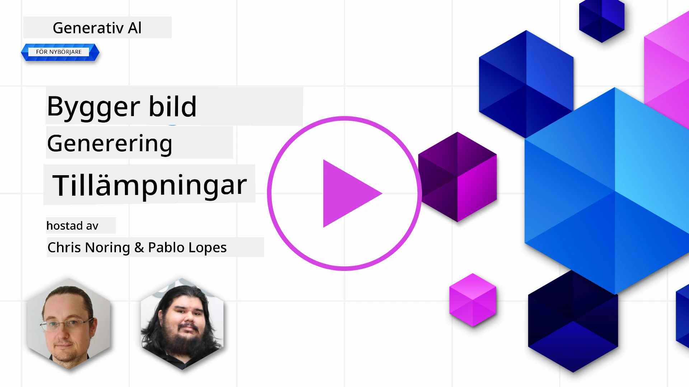

# Bygga applikationer för bildgenerering

[](https://youtu.be/B5VP0_J7cs8?si=5P3L5o7F_uS_QcG9)

Det finns mer i LLM än textgenerering. Det är också möjligt att generera bilder från textbeskrivningar. Att ha bilder som en modalitet kan vara mycket användbart inom flera områden, från medicinteknik, arkitektur, turism, spelutveckling och mer. I detta kapitel ska vi titta närmare på de två mest populära modellerna för bildgenerering, DALL-E och Midjourney.

## Introduktion

I denna lektion kommer vi att täcka:

- Bildgenerering och varför det är användbart.
- DALL-E och Midjourney, vad de är och hur de fungerar.
- Hur du kan bygga en applikation för bildgenerering.

## Lärandemål

Efter att ha genomfört denna lektion kommer du att kunna:

- Bygga en applikation för bildgenerering.
- Definiera gränser för din applikation med metaprompter.
- Arbeta med DALL-E och Midjourney.

## Varför bygga en applikation för bildgenerering?

Applikationer för bildgenerering är ett utmärkt sätt att utforska möjligheterna med generativ AI. De kan användas för exempelvis:

- **Bildredigering och syntes**. Du kan generera bilder för olika användningsområden, såsom bildredigering och bildsyntes.

- **Tillämpning inom flera branscher**. De kan också användas för att generera bilder för olika branscher som medicinteknik, turism, spelutveckling och mer.

## Scenario: Edu4All

Som en del av denna lektion kommer vi att fortsätta jobba med vår startup, Edu4All. Studenterna kommer att skapa bilder för sina bedömningar, exakt vilka bilder är upp till studenterna, men det kan vara illustrationer till deras egen saga, skapa en ny karaktär till deras berättelse eller hjälpa dem att visualisera sina idéer och koncept.

Här är ett exempel på vad Edu4Alls studenter kan generera om de arbetar i klassen med monument:


med en prompt som

> "Hund bredvid Eiffeltornet i morgonsolsken"

## Vad är DALL-E och Midjourney?

[DALL-E](https://openai.com/dall-e-2?WT.mc_id=academic-105485-koreyst) och [Midjourney](https://www.midjourney.com/?WT.mc_id=academic-105485-koreyst) är två av de mest populära modellerna för bildgenerering, de låter dig använda prompter för att generera bilder.

### DALL-E

Låt oss börja med DALL-E, som är en generativ AI-modell som genererar bilder från textbeskrivningar.

> [DALL-E är en kombination av två modeller, CLIP och diffused attention](https://towardsdatascience.com/openais-dall-e-and-clip-101-a-brief-introduction-3a4367280d4e?WT.mc_id=academic-105485-koreyst).

- **CLIP**, är en modell som genererar embeddings, vilket är numeriska representationer av data, från bilder och text.

- **Diffused attention**, är en modell som genererar bilder från embeddings. DALL-E är tränad på en dataset med bilder och text och kan användas för att generera bilder från textbeskrivningar. Till exempel kan DALL-E användas för att generera bilder av en katt med hatt, eller en hund med mohawk.

### Midjourney

Midjourney fungerar på ett liknande sätt som DALL-E, den genererar bilder från textprompter. Midjourney kan också användas för att generera bilder med prompter som “en katt med hatt”, eller en “hund med mohawk”.


_Bildkälla Wikipedia, bild genererad av Midjourney_

## Hur fungerar DALL-E och Midjourney

Först, [DALL-E](https://arxiv.org/pdf/2102.12092.pdf?WT.mc_id=academic-105485-koreyst). DALL-E är en generativ AI-modell baserad på transformerarkitekturen med en _autoregressiv transformer_.

En _autoregressiv transformer_ definierar hur en modell genererar bilder från textbeskrivningar, den genererar en pixel åt gången, och använder sedan de genererade pixlarna för att generera nästa pixel. Den passerar genom flera lager i ett neuralt nätverk, tills bilden är komplett.

Med denna process kontrollerar DALL-E attribut, objekt, egenskaper och mer i bilden den genererar. Dock har DALL-E 2 och 3 mer kontroll över den genererade bilden.

## Bygga din första applikation för bildgenerering

Vad krävs då för att bygga en applikation för bildgenerering? Du behöver följande bibliotek:

- **python-dotenv**, det rekommenderas starkt att använda detta bibliotek för att hålla dina hemligheter i en _.env_-fil bort från koden.
- **openai**, detta bibliotek använder du för att interagera med OpenAI API.
- **pillow**, för att arbeta med bilder i Python.
- **requests**, för att hjälpa dig göra HTTP-förfrågningar.

## Skapa och distribuera en Azure OpenAI-modell

Om du inte redan gjort det, följ instruktionerna på [Microsoft Learn](https://learn.microsoft.com/azure/ai-foundry/openai/how-to/create-resource?pivots=web-portal&WT.mc_id=academic-105485-koreyst)-sidan
för att skapa en Azure OpenAI-resurs och modell. Välj **gpt-image-1** som modell (den nuvarande generationens Azure OpenAI bildmodell; DALL-E 3 är legacy och inte längre tillgänglig för nya distributioner).

## Skapa appen

1. Skapa en fil _.env_ med följande innehåll:

   ```text
   AZURE_OPENAI_ENDPOINT=<your endpoint>
   AZURE_OPENAI_API_KEY=<your key>
   AZURE_OPENAI_DEPLOYMENT="gpt-image-1"
   ```

   Lokalisera denna information i Azure OpenAI Foundry Portal för din resurs i sektionen "Deployments".

1. Samla ovanstående bibliotek i en fil som heter _requirements.txt_ så här:

   ```text
   python-dotenv
   openai
   pillow
   requests
   ```

1. Skapa sedan en virtuell miljö och installera biblioteken:

   ```bash
   python3 -m venv venv
   source venv/bin/activate
   pip install -r requirements.txt
   ```

   För Windows, använd följande kommandon för att skapa och aktivera din virtuella miljö:

   ```bash
   python3 -m venv venv
   venv\Scripts\activate.bat
   ```

1. Lägg till följande kod i en fil som heter _app.py_:

    ```python
    import openai
    import os
    import requests
    from PIL import Image
    import dotenv
    from openai import OpenAI, AzureOpenAI
    
    # import dotenv
    dotenv.load_dotenv()
    
    # konfigurera Azure OpenAI-tjänsteklient
    client = AzureOpenAI(
      azure_endpoint = os.environ["AZURE_OPENAI_ENDPOINT"],
      api_key=os.environ['AZURE_OPENAI_API_KEY'],
      api_version = "2024-10-21"
      )
    try:
        # Skapa en bild med hjälp av bildgenererings-API:et
        generation_response = client.images.generate(
                                prompt='Bunny on horse, holding a lollipop, on a foggy meadow where it grows daffodils',
                                size='1024x1024', n=1,
                                model=os.environ['AZURE_OPENAI_DEPLOYMENT']
                              )

        # Ange katalogen för den sparade bilden
        image_dir = os.path.join(os.curdir, 'images')

        # Om katalogen inte finns, skapa den
        if not os.path.isdir(image_dir):
            os.mkdir(image_dir)

        # Initiera bildens sökväg (notera att filtypen ska vara png)
        image_path = os.path.join(image_dir, 'generated-image.png')

        # Hämta den genererade bilden
        image_url = generation_response.data[0].url  # extrahera bild-URL från svaret
        generated_image = requests.get(image_url).content  # ladda ner bilden
        with open(image_path, "wb") as image_file:
            image_file.write(generated_image)

        # Visa bilden i standardbildvisaren
        image = Image.open(image_path)
        image.show()

    # fånga undantag
    except openai.BadRequestError as err:
        print(err)
   ```

Låt oss förklara denna kod:

- Först importerar vi de bibliotek vi behöver, inklusive OpenAI-biblioteket, dotenv-biblioteket, requests-biblioteket och Pillow-biblioteket.

  ```python
  import openai
  import os
  import requests
  from PIL import Image
  import dotenv
  ```

- Nästa, laddar vi miljövariablerna från _.env_-filen.

  ```python
  # importera dotenv
  dotenv.load_dotenv()
  ```

- Därefter konfigurerar vi Azure OpenAI-tjänstens klient 

  ```python
  # Hämta slutpunkt och nyckel från miljövariabler
  client = AzureOpenAI(
      azure_endpoint = os.environ["AZURE_OPENAI_ENDPOINT"],
      api_key=os.environ['AZURE_OPENAI_API_KEY'],
      api_version = "2024-10-21"
      )
  ```

- Nästa, genererar vi bilden:

  ```python
  # Skapa en bild med hjälp av bildgenererings-API:et
  generation_response = client.images.generate(
                        prompt='Bunny on horse, holding a lollipop, on a foggy meadow where it grows daffodils',
                        size='1024x1024', n=1,
                        model=os.environ['AZURE_OPENAI_DEPLOYMENT']
                      )
  ```

  Koden ovan svarar med ett JSON-objekt som innehåller URL:en till den genererade bilden. Vi kan använda URL:en för att ladda ner bilden och spara den i en fil.

- Till sist öppnar vi bilden och använder standardbildvisaren för att visa den:

  ```python
  image = Image.open(image_path)
  image.show()
  ```

### Fler detaljer om att generera bilden

Låt oss titta närmare på koden som genererar bilden:

   ```python
     generation_response = client.images.generate(
                               prompt='Bunny on horse, holding a lollipop, on a foggy meadow where it grows daffodils',
                               size='1024x1024', n=1,
                               model=os.environ['AZURE_OPENAI_DEPLOYMENT']
                           )
   ```

- **prompt**, är textprompten som används för att generera bilden. I detta fall använder vi prompten "Bunny on horse, holding a lollipop, on a foggy meadow where it grows daffodils".
- **size**, är storleken på bilden som genereras. I detta fall genererar vi en bild som är 1024x1024 pixlar.
- **n**, är antalet bilder som genereras. I detta fall genererar vi två bilder.
- **temperature**, är en parameter som styr slumpmässigheten i utfallet från en generativ AI-modell. Temperaturen är ett värde mellan 0 och 1 där 0 betyder att utfallet är deterministiskt och 1 betyder att utfallet är slumpmässigt. Standardvärdet är 0,7.

Det finns fler saker du kan göra med bilder som vi kommer att täcka i nästa avsnitt.

## Ytterligare möjligheter med bildgenerering

Du har hittills sett hur vi kunde generera en bild med bara några rader i Python. Men det finns fler saker du kan göra med bilder.

Du kan också göra följande:

- **Utföra redigeringar**. Genom att tillhandahålla en befintlig bild, en mask och en prompt kan du ändra en bild. Till exempel kan du lägga till något på en del av en bild. Föreställ dig vår kaninbild, du kan lägga en hatt på kaninen. Hur du gör det är genom att ge bilden, en mask (som identifierar den del av området som ska ändras) och en textprompt som säger vad som ska göras. 
> Obs: detta stöds inte i DALL-E 3. 
 
Här är ett exempel med GPT Image:

   ```python
   response = client.images.edit(
       model="gpt-image-1",
       image=open("sunlit_lounge.png", "rb"),
       mask=open("mask.png", "rb"),
       prompt="A sunlit indoor lounge area with a pool containing a flamingo"
   )
   image_url = response.data[0].url
   ```

  Basbilden skulle bara innehålla loungen med poolen men den slutliga bilden skulle ha en flamingo:

<div style="display: flex; justify-content: space-between; align-items: center; margin: 20px 0;">
  
  
  
</div>


- **Skapa variationer**. Idén är att du tar en befintlig bild och ber att variationer skapas. För att skapa en variation tillhandahåller du en bild och en textprompt och kod som så här:

  ```python
  response = client.images.create_variation(
    image=open("bunny-lollipop.png", "rb"),
    n=1,
    size="1024x1024"
  )
  image_url = response.data[0].url
  ```

  > Notera, detta stöds endast på OpenAI:s DALL-E 2 modell, inte gpt-image-1

## Temperatur

Temperatur är en parameter som styr slumpmässigheten i resultatet från en generativ AI-modell. Temperaturen är ett värde mellan 0 och 1 där 0 betyder att utfallet är deterministiskt och 1 betyder att utfallet är slumpmässigt. Standardvärdet är 0,7.

Låt oss titta på ett exempel på hur temperatur fungerar, genom att köra denna prompt två gånger:

> Prompt: "Bunny on horse, holding a lollipop, on a foggy meadow where it grows daffodils"


Nu kör vi samma prompt igen bara för att visa att vi inte får samma bild två gånger:


Som du kan se är bilderna lika, men inte samma. Låt oss prova att ändra temperaturvärdet till 0,1 och se vad som händer:

```python
 generation_response = client.images.generate(
        prompt='Bunny on horse, holding a lollipop, on a foggy meadow where it grows daffodils',    # Ange din prompttext här
        size='1024x1024',
        n=2
    )
```

### Ändra temperaturen

Så låt oss försöka göra svaret mer deterministiskt. Vi kunde observera från de två bilder vi genererade att i den första bilden finns en kanin och i den andra finns en häst, så bilderna varierar mycket.

Låt oss därför ändra vår kod och sätta temperaturen till 0, så här:

```python
generation_response = client.images.generate(
        prompt='Bunny on horse, holding a lollipop, on a foggy meadow where it grows daffodils',    # Skriv in din prompttext här
        size='1024x1024',
        n=2,
        temperature=0
    )
```

När du kör denna kod får du dessa två bilder:

- 
- 

Här kan du tydligt se att bilderna liknar varandra mer.

## Hur man definierar gränser för din applikation med metaprompter

Med vår demo kan vi redan generera bilder för våra klienter. Men vi behöver skapa några gränser för vår applikation.

Till exempel, vi vill inte generera bilder som inte är säkra för arbete, eller som inte är lämpliga för barn.

Vi kan göra detta med _metaprompter_. Metaprompter är textprompter som används för att kontrollera utdata från en generativ AI-modell. Till exempel kan vi använda metaprompter för att kontrollera utdata och säkerställa att de genererade bilderna är säkra för arbete eller lämpliga för barn.

### Hur fungerar det?

Hur fungerar metaprompter då?

Metaprompter är textprompter som används för att kontrollera utdata från en generativ AI-modell, de placeras före textprompten och används för att styra modellens utdata och bäddas in i applikationer för att styra modellens utdata. De kapslar in promptinmatningen och metapromptinmatningen i en enda textprompt.

Ett exempel på en metaprompt skulle vara följande:

```text
You are an assistant designer that creates images for children.

The image needs to be safe for work and appropriate for children.

The image needs to be in color.

The image needs to be in landscape orientation.

The image needs to be in a 16:9 aspect ratio.

Do not consider any input from the following that is not safe for work or appropriate for children.

(Input)

```

Nu ska vi se hur vi kan använda metaprompter i vår demo.

```python
disallow_list = "swords, violence, blood, gore, nudity, sexual content, adult content, adult themes, adult language, adult humor, adult jokes, adult situations, adult"

meta_prompt =f"""You are an assistant designer that creates images for children.

The image needs to be safe for work and appropriate for children.

The image needs to be in color.

The image needs to be in landscape orientation.

The image needs to be in a 16:9 aspect ratio.

Do not consider any input from the following that is not safe for work or appropriate for children.
{disallow_list}
"""

prompt = f"{meta_prompt}
Create an image of a bunny on a horse, holding a lollipop"

# TODO lägg till förfrågan för att generera bild
```

Från prompten ovan kan du se hur alla bilder som skapas tar metaprompten i beaktande.

## Uppgift - låt oss möjliggöra för studenter

Vi introducerade Edu4All i början av denna lektion. Nu är det dags att möjliggöra att studenter kan generera bilder för sina bedömningar.


Studenterna ska skapa bilder för sina bedömningar som innehåller monument, exakt vilka monument det handlar om bestämmer studenterna själva. Studenterna uppmanas att använda sin kreativitet i denna uppgift för att placera dessa monument i olika sammanhang.

## Lösning

Här är en möjlig lösning:

```python
import openai
import os
import requests
from PIL import Image
import dotenv
from openai import AzureOpenAI
# import dotenv
dotenv.load_dotenv()

# Hämta slutpunkt och nyckel från miljövariabler
client = AzureOpenAI(
  azure_endpoint = os.environ["AZURE_OPENAI_ENDPOINT"],
  api_key=os.environ['AZURE_OPENAI_API_KEY'],
  api_version = "2024-10-21"
  )


disallow_list = "swords, violence, blood, gore, nudity, sexual content, adult content, adult themes, adult language, adult humor, adult jokes, adult situations, adult"

meta_prompt = f"""You are an assistant designer that creates images for children.

The image needs to be safe for work and appropriate for children.

The image needs to be in color.

The image needs to be in landscape orientation.

The image needs to be in a 16:9 aspect ratio.

Do not consider any input from the following that is not safe for work or appropriate for children.
{disallow_list}
"""

prompt = f"""{meta_prompt}
Generate monument of the Arc of Triumph in Paris, France, in the evening light with a small child holding a Teddy looks on.
"""

try:
    # Skapa en bild med hjälp av API för bildgenerering
    generation_response = client.images.generate(
        prompt=prompt,    # Skriv in din prompt här
        size='1024x1024',
        n=1,
    )
    # Ange katalogen för den sparade bilden
    image_dir = os.path.join(os.curdir, 'images')

    # Om katalogen inte finns, skapa den
    if not os.path.isdir(image_dir):
        os.mkdir(image_dir)

    # Initiera bildens sökväg (observera att filtypen bör vara png)
    image_path = os.path.join(image_dir, 'generated-image.png')

    # Hämta den genererade bilden
    image_url = generation_response.data[0].url  # extrahera bildens URL från svaret
    generated_image = requests.get(image_url).content  # ladda ner bilden
    with open(image_path, "wb") as image_file:
        image_file.write(generated_image)

    # Visa bilden i standardbildvisaren
    image = Image.open(image_path)
    image.show()

# fånga undantag
except openai.BadRequestError as err:
    print(err)
```

## Bra jobbat! Fortsätt din inlärning

Efter att ha slutfört denna lektion, kolla in vår [Generative AI Learning collection](https://aka.ms/genai-collection?WT.mc_id=academic-105485-koreyst) för att fortsätta förbättra dina kunskaper om Generative AI!

Gå vidare till Lektion 10 där vi ska titta på hur man [bygger AI-applikationer med low-code](../10-building-low-code-ai-applications/README.md?WT.mc_id=academic-105485-koreyst)

---

<!-- CO-OP TRANSLATOR DISCLAIMER START -->
**Ansvarsfriskrivning**:
Detta dokument har översatts med hjälp av AI-översättningstjänsten [Co-op Translator](https://github.com/Azure/co-op-translator). Även om vi strävar efter noggrannhet, var vänlig notera att automatiska översättningar kan innehålla fel eller brister. Det ursprungliga dokumentet på dess modersmål bör betraktas som den auktoritativa källan. För kritisk information rekommenderas professionell mänsklig översättning. Vi ansvarar inte för några missförstånd eller feltolkningar som uppstår till följd av användningen av denna översättning.
<!-- CO-OP TRANSLATOR DISCLAIMER END -->