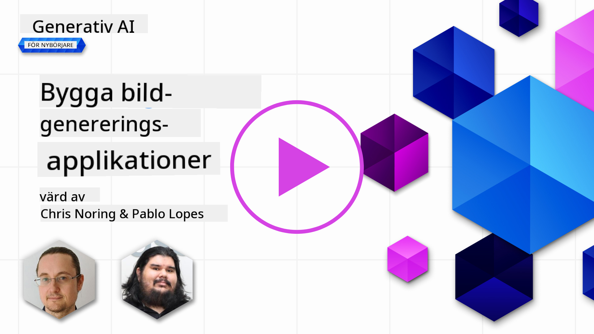

<!--
CO_OP_TRANSLATOR_METADATA:
{
  "original_hash": "063a2ac57d6b71bea0eaa880c68770d2",
  "translation_date": "2025-09-29T21:45:34+00:00",
  "source_file": "09-building-image-applications/README.md",
  "language_code": "sv"
}
-->
# Bygga applikationer för bildgenerering

[](https://aka.ms/gen-ai-lesson9-gh?WT.mc_id=academic-105485-koreyst)

Det finns mer att utforska med LLMs än bara textgenerering. Det är också möjligt att generera bilder från textbeskrivningar. Att ha bilder som en modalitet kan vara mycket användbart inom flera områden, såsom MedTech, arkitektur, turism, spelutveckling och mer. I detta kapitel kommer vi att titta på de två mest populära modellerna för bildgenerering, DALL-E och Midjourney.

## Introduktion

I denna lektion kommer vi att täcka:

- Bildgenerering och varför det är användbart.
- DALL-E och Midjourney, vad de är och hur de fungerar.
- Hur du kan bygga en applikation för bildgenerering.

## Lärandemål

Efter att ha avslutat denna lektion kommer du att kunna:

- Bygga en applikation för bildgenerering.
- Definiera gränser för din applikation med metaprompter.
- Arbeta med DALL-E och Midjourney.

## Varför bygga en applikation för bildgenerering?

Applikationer för bildgenerering är ett utmärkt sätt att utforska kapaciteterna hos Generativ AI. De kan användas till exempel för:

- **Bildredigering och syntes**. Du kan generera bilder för olika användningsområden, såsom bildredigering och bildsyntes.

- **Användning inom olika industrier**. De kan också användas för att generera bilder för olika industrier som MedTech, turism, spelutveckling och mer.

## Scenario: Edu4All

Som en del av denna lektion kommer vi att fortsätta arbeta med vår startup, Edu4All. Studenterna kommer att skapa bilder för sina uppgifter, exakt vilka bilder är upp till studenterna, men de kan vara illustrationer för deras egen saga, skapa en ny karaktär för sin berättelse eller hjälpa dem att visualisera sina idéer och koncept.

Här är ett exempel på vad Edu4All:s studenter kan generera om de arbetar i klassrummet med monument:


med en prompt som

> "Hund bredvid Eiffeltornet i tidigt morgonljus"

## Vad är DALL-E och Midjourney?

[DALL-E](https://openai.com/dall-e-2?WT.mc_id=academic-105485-koreyst) och [Midjourney](https://www.midjourney.com/?WT.mc_id=academic-105485-koreyst) är två av de mest populära modellerna för bildgenerering, som låter dig använda prompts för att generera bilder.

### DALL-E

Låt oss börja med DALL-E, som är en Generativ AI-modell som genererar bilder från textbeskrivningar.

> [DALL-E är en kombination av två modeller, CLIP och diffused attention](https://towardsdatascience.com/openais-dall-e-and-clip-101-a-brief-introduction-3a4367280d4e?WT.mc_id=academic-105485-koreyst).

- **CLIP**, är en modell som genererar embeddings, vilket är numeriska representationer av data, från bilder och text.

- **Diffused attention**, är en modell som genererar bilder från embeddings. DALL-E är tränad på en dataset av bilder och text och kan användas för att generera bilder från textbeskrivningar. Till exempel kan DALL-E användas för att generera bilder av en katt i en hatt, eller en hund med en mohawk.

### Midjourney

Midjourney fungerar på ett liknande sätt som DALL-E, det genererar bilder från textprompter. Midjourney kan också användas för att generera bilder med prompts som "en katt i en hatt" eller "en hund med en mohawk".


_Bildkälla Wikipedia, bild genererad av Midjourney_

## Hur fungerar DALL-E och Midjourney?

Först, [DALL-E](https://arxiv.org/pdf/2102.12092.pdf?WT.mc_id=academic-105485-koreyst). DALL-E är en Generativ AI-modell baserad på transformerarkitekturen med en _autoregressiv transformer_.

En _autoregressiv transformer_ definierar hur en modell genererar bilder från textbeskrivningar, den genererar en pixel i taget och använder sedan de genererade pixlarna för att generera nästa pixel. Den passerar genom flera lager i ett neuralt nätverk tills bilden är komplett.

Med denna process kan DALL-E kontrollera attribut, objekt, egenskaper och mer i den bild den genererar. Dock har DALL-E 2 och 3 mer kontroll över den genererade bilden.

## Bygga din första applikation för bildgenerering

Så vad krävs för att bygga en applikation för bildgenerering? Du behöver följande bibliotek:

- **python-dotenv**, det rekommenderas starkt att använda detta bibliotek för att hålla dina hemligheter i en _.env_-fil bort från koden.
- **openai**, detta bibliotek används för att interagera med OpenAI API.
- **pillow**, för att arbeta med bilder i Python.
- **requests**, för att hjälpa dig att göra HTTP-förfrågningar.

## Skapa och distribuera en Azure OpenAI-modell

Om det inte redan är gjort, följ instruktionerna på [Microsoft Learn](https://learn.microsoft.com/azure/ai-foundry/openai/how-to/create-resource?pivots=web-portal) sidan
för att skapa en Azure OpenAI-resurs och modell. Välj DALL-E 3 som modell.  

## Skapa applikationen

1. Skapa en fil _.env_ med följande innehåll:

   ```text
   AZURE_OPENAI_ENDPOINT=<your endpoint>
   AZURE_OPENAI_API_KEY=<your key>
   AZURE_OPENAI_DEPLOYMENT="dall-e-3"
   ```

   Hitta denna information i Azure OpenAI Foundry Portal för din resurs i avsnittet "Deployments".

1. Samla ovanstående bibliotek i en fil som heter _requirements.txt_ så här:

   ```text
   python-dotenv
   openai
   pillow
   requests
   ```

1. Skapa sedan en virtuell miljö och installera biblioteken:

   ```bash
   python3 -m venv venv
   source venv/bin/activate
   pip install -r requirements.txt
   ```

   För Windows, använd följande kommandon för att skapa och aktivera din virtuella miljö:

   ```bash
   python3 -m venv venv
   venv\Scripts\activate.bat
   ```

1. Lägg till följande kod i en fil som heter _app.py_:

    ```python
    import openai
    import os
    import requests
    from PIL import Image
    import dotenv
    from openai import OpenAI, AzureOpenAI
    
    # import dotenv
    dotenv.load_dotenv()
    
    # configure Azure OpenAI service client 
    client = AzureOpenAI(
      azure_endpoint = os.environ["AZURE_OPENAI_ENDPOINT"],
      api_key=os.environ['AZURE_OPENAI_API_KEY'],
      api_version = "2024-02-01"
      )
    try:
        # Create an image by using the image generation API
        generation_response = client.images.generate(
                                prompt='Bunny on horse, holding a lollipop, on a foggy meadow where it grows daffodils',
                                size='1024x1024', n=1,
                                model=os.environ['AZURE_OPENAI_DEPLOYMENT']
                              )

        # Set the directory for the stored image
        image_dir = os.path.join(os.curdir, 'images')

        # If the directory doesn't exist, create it
        if not os.path.isdir(image_dir):
            os.mkdir(image_dir)

        # Initialize the image path (note the filetype should be png)
        image_path = os.path.join(image_dir, 'generated-image.png')

        # Retrieve the generated image
        image_url = generation_response.data[0].url  # extract image URL from response
        generated_image = requests.get(image_url).content  # download the image
        with open(image_path, "wb") as image_file:
            image_file.write(generated_image)

        # Display the image in the default image viewer
        image = Image.open(image_path)
        image.show()

    # catch exceptions
    except openai.InvalidRequestError as err:
        print(err)
   ```

Låt oss förklara denna kod:

- Först importerar vi de bibliotek vi behöver, inklusive OpenAI-biblioteket, dotenv-biblioteket, requests-biblioteket och Pillow-biblioteket.

  ```python
  import openai
  import os
  import requests
  from PIL import Image
  import dotenv
  ```

- Därefter laddar vi miljövariablerna från _.env_-filen.

  ```python
  # import dotenv
  dotenv.load_dotenv()
  ```

- Efter det konfigurerar vi Azure OpenAI service-klienten.

  ```python
  # Get endpoint and key from environment variables
  client = AzureOpenAI(
      azure_endpoint = os.environ["AZURE_OPENAI_ENDPOINT"],
      api_key=os.environ['AZURE_OPENAI_API_KEY'],
      api_version = "2024-02-01"
      )
  ```

- Sedan genererar vi bilden:

  ```python
  # Create an image by using the image generation API
  generation_response = client.images.generate(
                        prompt='Bunny on horse, holding a lollipop, on a foggy meadow where it grows daffodils',
                        size='1024x1024', n=1,
                        model=os.environ['AZURE_OPENAI_DEPLOYMENT']
                      )
  ```

  Koden ovan svarar med ett JSON-objekt som innehåller URL:en till den genererade bilden. Vi kan använda URL:en för att ladda ner bilden och spara den till en fil.

- Slutligen öppnar vi bilden och använder standardbildvisaren för att visa den:

  ```python
  image = Image.open(image_path)
  image.show()
  ```

### Mer detaljer om att generera bilden

Låt oss titta närmare på koden som genererar bilden:

   ```python
     generation_response = client.images.generate(
                               prompt='Bunny on horse, holding a lollipop, on a foggy meadow where it grows daffodils',
                               size='1024x1024', n=1,
                               model=os.environ['AZURE_OPENAI_DEPLOYMENT']
                           )
   ```

- **prompt**, är textprompten som används för att generera bilden. I detta fall använder vi prompten "Kanin på häst, håller en klubba, på en dimmig äng där det växer påskliljor".
- **size**, är storleken på den bild som genereras. I detta fall genererar vi en bild som är 1024x1024 pixlar.
- **n**, är antalet bilder som genereras. I detta fall genererar vi två bilder.
- **temperature**, är en parameter som styr slumpmässigheten i outputen från en Generativ AI-modell. Temperaturen är ett värde mellan 0 och 1 där 0 betyder att outputen är deterministisk och 1 betyder att outputen är slumpmässig. Standardvärdet är 0.7.

Det finns fler saker du kan göra med bilder som vi kommer att täcka i nästa avsnitt.

## Ytterligare kapaciteter för bildgenerering

Du har hittills sett hur vi kunde generera en bild med några få rader i Python. Men det finns fler saker du kan göra med bilder.

Du kan också göra följande:

- **Utföra redigeringar**. Genom att tillhandahålla en befintlig bild, en mask och en prompt kan du ändra en bild. Till exempel kan du lägga till något till en del av en bild. Föreställ dig vår kaninbild, du kan lägga till en hatt på kaninen. Hur du skulle göra det är genom att tillhandahålla bilden, en mask (som identifierar den del av området för ändringen) och en textprompt som säger vad som ska göras. 
> Obs: detta stöds inte i DALL-E 3. 
 
Här är ett exempel med GPT Image:

   ```python
   response = client.images.edit(
       model="gpt-image-1",
       image=open("sunlit_lounge.png", "rb"),
       mask=open("mask.png", "rb"),
       prompt="A sunlit indoor lounge area with a pool containing a flamingo"
   )
   image_url = response.data[0].url
   ```

  Basbilden skulle bara innehålla loungen med poolen, men slutbilden skulle ha en flamingo:

<div style="display: flex; justify-content: space-between; align-items: center; margin: 20px 0;">
  
  
  
</div>


- **Skapa variationer**. Idén är att du tar en befintlig bild och ber att variationer skapas. För att skapa en variation tillhandahåller du en bild och en textprompt och kodar så här:

  ```python
  response = openai.Image.create_variation(
    image=open("bunny-lollipop.png", "rb"),
    n=1,
    size="1024x1024"
  )
  image_url = response['data'][0]['url']
  ```

  > Obs, detta stöds endast på OpenAI.

## Temperatur

Temperatur är en parameter som styr slumpmässigheten i outputen från en Generativ AI-modell. Temperaturen är ett värde mellan 0 och 1 där 0 betyder att outputen är deterministisk och 1 betyder att outputen är slumpmässig. Standardvärdet är 0.7.

Låt oss titta på ett exempel på hur temperatur fungerar genom att köra denna prompt två gånger:

> Prompt: "Kanin på häst, håller en klubba, på en dimmig äng där det växer påskliljor"


Nu låt oss köra samma prompt igen för att se att vi inte får samma bild två gånger:


Som du kan se är bilderna liknande, men inte identiska. Låt oss prova att ändra temperaturvärdet till 0.1 och se vad som händer:

```python
 generation_response = client.images.create(
        prompt='Bunny on horse, holding a lollipop, on a foggy meadow where it grows daffodils',    # Enter your prompt text here
        size='1024x1024',
        n=2
    )
```

### Ändra temperaturen

Så låt oss försöka göra svaret mer deterministiskt. Vi kunde observera från de två bilderna vi genererade att i den första bilden finns det en kanin och i den andra bilden finns det en häst, så bilderna varierar mycket.

Låt oss därför ändra vår kod och ställa in temperaturen till 0, så här:

```python
generation_response = client.images.create(
        prompt='Bunny on horse, holding a lollipop, on a foggy meadow where it grows daffodils',    # Enter your prompt text here
        size='1024x1024',
        n=2,
        temperature=0
    )
```

Nu när du kör denna kod får du dessa två bilder:

- 
- 

Här kan du tydligt se hur bilderna liknar varandra mer.

## Hur man definierar gränser för din applikation med metaprompter

Med vår demo kan vi redan generera bilder för våra kunder. Men vi behöver skapa vissa gränser för vår applikation.

Till exempel vill vi inte generera bilder som inte är lämpliga för arbete eller som inte är lämpliga för barn.

Vi kan göra detta med _metaprompter_. Metaprompter är textprompter som används för att kontrollera outputen från en Generativ AI-modell. Till exempel kan vi använda metaprompter för att kontrollera outputen och säkerställa att de genererade bilderna är lämpliga för arbete eller lämpliga för barn.

### Hur fungerar det?

Nu, hur fungerar metaprompter?

Metaprompter är textprompter som används för att kontrollera outputen från en Generativ AI-modell, de placeras före textprompten och används för att kontrollera outputen från modellen och integreras i applikationer för att kontrollera outputen från modellen. De kapslar in promptinmatningen och metapromptinmatningen i en enda textprompt.

Ett exempel på en metaprompt skulle vara följande:

```text
You are an assistant designer that creates images for children.

The image needs to be safe for work and appropriate for children.

The image needs to be in color.

The image needs to be in landscape orientation.

The image needs to be in a 16:9 aspect ratio.

Do not consider any input from the following that is not safe for work or appropriate for children.

(Input)

```

Nu, låt oss se hur vi kan använda metaprompter i vår demo.

```python
disallow_list = "swords, violence, blood, gore, nudity, sexual content, adult content, adult themes, adult language, adult humor, adult jokes, adult situations, adult"

meta_prompt =f"""You are an assistant designer that creates images for children.

The image needs to be safe for work and appropriate for children.

The image needs to be in color.

The image needs to be in landscape orientation.

The image needs to be in a 16:9 aspect ratio.

Do not consider any input from the following that is not safe for work or appropriate for children.
{disallow_list}
"""

prompt = f"{meta_prompt}
Create an image of a bunny on a horse, holding a lollipop"

# TODO add request to generate image
```

Från prompten ovan kan du se hur alla bilder som skapas tar hänsyn till metaprompten.

## Uppgift - låt oss ge studenterna möjlighet

Vi introducerade Edu4All i början av denna lektion. Nu är det dags att ge studenterna möjlighet att generera bilder för sina uppgifter.

Studenterna kommer att skapa bilder för sina uppgifter som innehåller monument, exakt vilka monument är upp till studenterna. Studenterna uppmanas att använda sin kreativitet i denna uppgift för att placera dessa monument i olika sammanhang.

## Lösning

Här är en möjlig lösning:
```python
import openai
import os
import requests
from PIL import Image
import dotenv
from openai import AzureOpenAI
# import dotenv
dotenv.load_dotenv()

# Get endpoint and key from environment variables
client = AzureOpenAI(
  azure_endpoint = os.environ["AZURE_OPENAI_ENDPOINT"],
  api_key=os.environ['AZURE_OPENAI_API_KEY'],
  api_version = "2024-02-01"
  )


disallow_list = "swords, violence, blood, gore, nudity, sexual content, adult content, adult themes, adult language, adult humor, adult jokes, adult situations, adult"

meta_prompt = f"""You are an assistant designer that creates images for children.

The image needs to be safe for work and appropriate for children.

The image needs to be in color.

The image needs to be in landscape orientation.

The image needs to be in a 16:9 aspect ratio.

Do not consider any input from the following that is not safe for work or appropriate for children.
{disallow_list}
"""

prompt = f"""{meta_prompt}
Generate monument of the Arc of Triumph in Paris, France, in the evening light with a small child holding a Teddy looks on.
""""

try:
    # Create an image by using the image generation API
    generation_response = client.images.generate(
        prompt=prompt,    # Enter your prompt text here
        size='1024x1024',
        n=1,
    )
    # Set the directory for the stored image
    image_dir = os.path.join(os.curdir, 'images')

    # If the directory doesn't exist, create it
    if not os.path.isdir(image_dir):
        os.mkdir(image_dir)

    # Initialize the image path (note the filetype should be png)
    image_path = os.path.join(image_dir, 'generated-image.png')

    # Retrieve the generated image
    image_url = generation_response.data[0].url  # extract image URL from response
    generated_image = requests.get(image_url).content  # download the image
    with open(image_path, "wb") as image_file:
        image_file.write(generated_image)

    # Display the image in the default image viewer
    image = Image.open(image_path)
    image.show()

# catch exceptions
except openai.BadRequestError as err:
    print(err)
```

## Bra jobbat! Fortsätt din inlärning

Efter att ha avslutat denna lektion, kolla in vår [Generative AI Learning-samling](https://aka.ms/genai-collection?WT.mc_id=academic-105485-koreyst) för att fortsätta utveckla din kunskap om Generativ AI!

Gå vidare till Lektion 10 där vi kommer att titta på hur man [bygger AI-applikationer med låg kod](../10-building-low-code-ai-applications/README.md?WT.mc_id=academic-105485-koreyst)

---

**Ansvarsfriskrivning**:  
Detta dokument har översatts med hjälp av AI-översättningstjänsten [Co-op Translator](https://github.com/Azure/co-op-translator). Även om vi strävar efter noggrannhet, bör det noteras att automatiska översättningar kan innehålla fel eller felaktigheter. Det ursprungliga dokumentet på dess originalspråk bör betraktas som den auktoritativa källan. För kritisk information rekommenderas professionell mänsklig översättning. Vi ansvarar inte för eventuella missförstånd eller feltolkningar som uppstår vid användning av denna översättning.