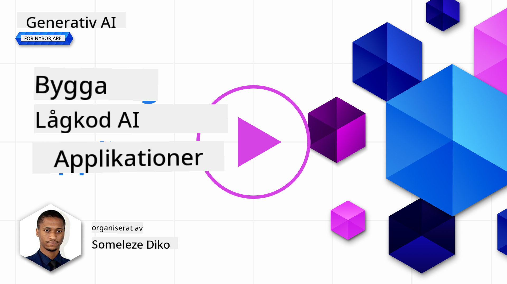
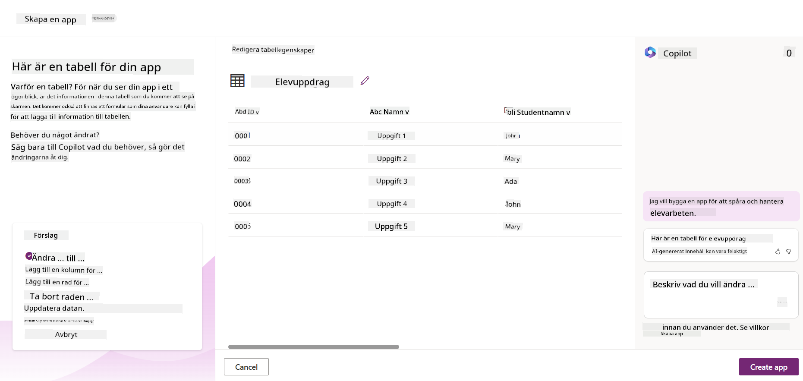
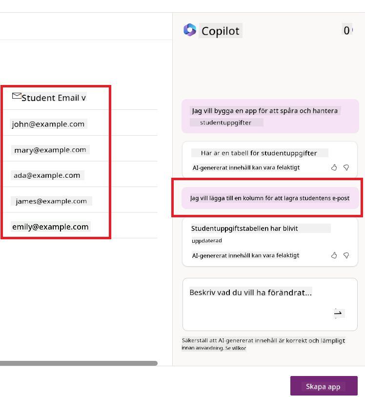
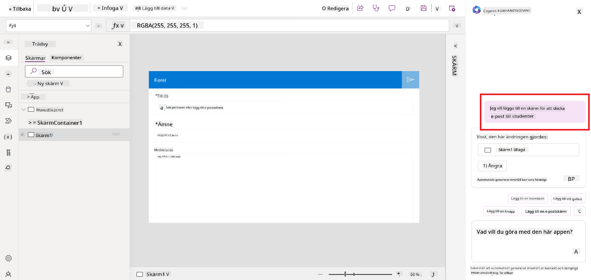
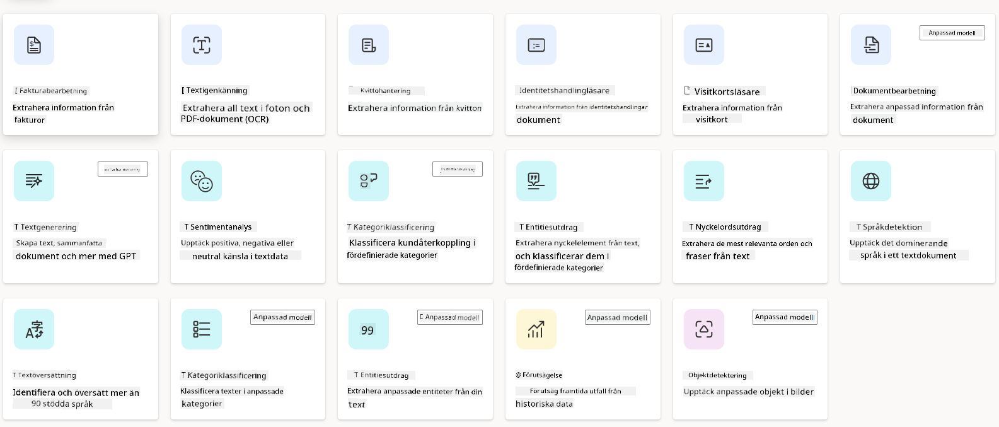
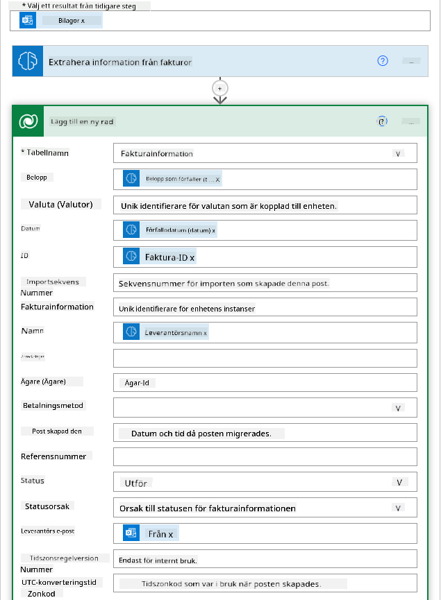
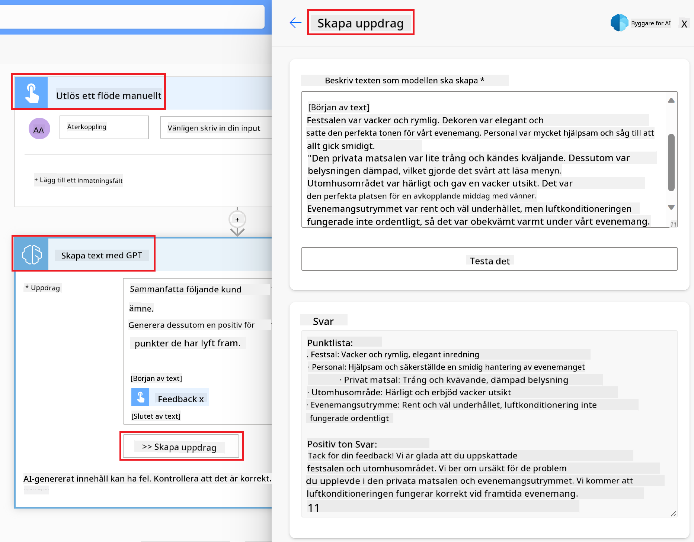

<!--
CO_OP_TRANSLATOR_METADATA:
{
  "original_hash": "f5ff3b6204a695a117d6f452403c95f7",
  "translation_date": "2025-05-19T20:28:25+00:00",
  "source_file": "10-building-low-code-ai-applications/README.md",
  "language_code": "sv"
}
-->
# Bygga AI-applikationer med låg kod

> _(Klicka på bilden ovan för att se videon av denna lektion)_

## Introduktion

Nu när vi har lärt oss hur man bygger bildgenererande applikationer, låt oss prata om låg kod. Generativ AI kan användas inom en mängd olika områden, inklusive låg kod, men vad är låg kod och hur kan vi lägga till AI till det?

Att bygga appar och lösningar har blivit enklare för både traditionella utvecklare och icke-utvecklare genom användningen av plattformar för låg kod. Dessa plattformar möjliggör skapandet av appar och lösningar med lite eller ingen kod. Detta uppnås genom att erbjuda en visuell utvecklingsmiljö där du kan dra och släppa komponenter för att bygga appar och lösningar. Detta gör att du kan bygga appar och lösningar snabbare och med färre resurser. I denna lektion fördjupar vi oss i hur man använder låg kod och hur man förbättrar utvecklingen med AI med hjälp av Power Platform.

Power Platform ger organisationer möjlighet att stärka sina team att bygga sina egna lösningar genom en intuitiv låg-kod eller ingen-kod miljö. Denna miljö hjälper till att förenkla processen för att bygga lösningar. Med Power Platform kan lösningar byggas på dagar eller veckor istället för månader eller år. Power Platform består av fem nyckelprodukter: Power Apps, Power Automate, Power BI, Power Pages och Copilot Studio.

Denna lektion täcker:

- Introduktion till generativ AI i Power Platform
- Introduktion till Copilot och hur man använder det
- Använda generativ AI för att bygga appar och flöden i Power Platform
- Förstå AI-modeller i Power Platform med AI Builder

## Lärandemål

I slutet av denna lektion kommer du att kunna:

- Förstå hur Copilot fungerar i Power Platform.

- Bygga en app för att följa upp studentuppgifter för vårt utbildningsföretag.

- Bygga ett fakturahanteringsflöde som använder AI för att extrahera information från fakturor.

- Tillämpa bästa praxis när du använder modellen för att skapa text med GPT AI.

Verktygen och teknologierna du kommer att använda i denna lektion är:

- **Power Apps**, för appen Student Assignment Tracker, som erbjuder en låg-kod utvecklingsmiljö för att bygga appar för att följa, hantera och interagera med data.

- **Dataverse**, för att lagra data för appen Student Assignment Tracker där Dataverse kommer att erbjuda en låg-kod dataplattform för att lagra appens data.

- **Power Automate**, för fakturahanteringsflödet där du kommer att ha en låg-kod utvecklingsmiljö för att bygga arbetsflöden för att automatisera fakturahanteringsprocessen.

- **AI Builder**, för fakturahanterings-AI-modellen där du kommer att använda förbyggda AI-modeller för att bearbeta fakturorna för vårt företag.

## Generativ AI i Power Platform

Att förbättra utveckling och applikationer med låg kod med generativ AI är ett centralt fokusområde för Power Platform. Målet är att möjliggöra för alla att bygga AI-drivna appar, sajter, instrumentpaneler och automatisera processer med AI, _utan att kräva någon datavetenskaplig expertis_. Detta mål uppnås genom att integrera generativ AI i låg-kod utvecklingsupplevelsen i Power Platform i form av Copilot och AI Builder.

### Hur fungerar detta?

Copilot är en AI-assistent som gör det möjligt för dig att bygga Power Platform-lösningar genom att beskriva dina krav i en serie konversationella steg med naturligt språk. Du kan till exempel instruera din AI-assistent att ange vilka fält din app kommer att använda, och den kommer att skapa både appen och den underliggande datamodellen, eller så kan du specificera hur du ska ställa in ett flöde i Power Automate.

Du kan använda Copilot-drivna funktioner som en funktion i dina appskärmar för att möjliggöra för användare att upptäcka insikter genom konversationella interaktioner.

AI Builder är en låg-kod AI-funktion tillgänglig i Power Platform som gör det möjligt för dig att använda AI-modeller för att hjälpa dig att automatisera processer och förutsäga resultat. Med AI Builder kan du ta AI till dina appar och flöden som ansluter till din data i Dataverse eller i olika molndatakällor, såsom SharePoint, OneDrive eller Azure.

Copilot är tillgänglig i alla Power Platform-produkter: Power Apps, Power Automate, Power BI, Power Pages och Power Virtual Agents. AI Builder är tillgänglig i Power Apps och Power Automate. I denna lektion kommer vi att fokusera på hur man använder Copilot och AI Builder i Power Apps och Power Automate för att bygga en lösning för vårt utbildningsföretag.

### Copilot i Power Apps

Som en del av Power Platform erbjuder Power Apps en låg-kod utvecklingsmiljö för att bygga appar för att följa, hantera och interagera med data. Det är en svit av apputvecklingstjänster med en skalbar dataplattform och förmågan att ansluta till molntjänster och lokala data. Power Apps låter dig bygga appar som körs på webbläsare, surfplattor och telefoner, och kan delas med kollegor. Power Apps förenklar apputveckling med ett enkelt gränssnitt, så att varje affärsanvändare eller professionell utvecklare kan bygga anpassade appar. Apputvecklingsupplevelsen förbättras också med generativ AI genom Copilot.

Copilot-funktionen i Power Apps gör det möjligt för dig att beskriva vilken typ av app du behöver och vilken information du vill att din app ska spåra, samla in eller visa. Copilot genererar sedan en responsiv Canvas-app baserat på din beskrivning. Du kan sedan anpassa appen för att möta dina behov. AI Copilot genererar och föreslår också en Dataverse-tabell med de fält du behöver för att lagra den data du vill spåra och några exempeldata. Vi kommer att titta på vad Dataverse är och hur du kan använda det i Power Apps senare i denna lektion. Du kan sedan anpassa tabellen för att möta dina behov med hjälp av AI Copilot-assistentfunktionen genom konversationella steg. Denna funktion är lätt tillgänglig från Power Apps hemskärm.

### Copilot i Power Automate

Som en del av Power Platform låter Power Automate användare skapa automatiserade arbetsflöden mellan applikationer och tjänster. Det hjälper till att automatisera repetitiva affärsprocesser såsom kommunikation, datainsamling och beslutsgodkännanden. Dess enkla gränssnitt gör det möjligt för användare med alla tekniska kompetenser (från nybörjare till erfarna utvecklare) att automatisera arbetsuppgifter. Arbetsflödesutvecklingsupplevelsen förbättras också med generativ AI genom Copilot.

Copilot-funktionen i Power Automate gör det möjligt för dig att beskriva vilken typ av flöde du behöver och vilka åtgärder du vill att ditt flöde ska utföra. Copilot genererar sedan ett flöde baserat på din beskrivning. Du kan sedan anpassa flödet för att möta dina behov. AI Copilot genererar och föreslår också de åtgärder du behöver för att utföra den uppgift du vill automatisera. Vi kommer att titta på vad flöden är och hur du kan använda dem i Power Automate senare i denna lektion. Du kan sedan anpassa åtgärderna för att möta dina behov med hjälp av AI Copilot-assistentfunktionen genom konversationella steg. Denna funktion är lätt tillgänglig från Power Automate hemskärm.

## Uppgift: Hantera studentuppgifter och fakturor för vårt företag, med hjälp av Copilot

Vårt företag erbjuder onlinekurser till studenter. Företaget har vuxit snabbt och har nu svårt att hålla jämna steg med efterfrågan på sina kurser. Företaget har anställt dig som Power Platform-utvecklare för att hjälpa dem att bygga en låg kodlösning för att hjälpa dem hantera sina studentuppgifter och fakturor. Deras lösning bör kunna hjälpa dem att spåra och hantera studentuppgifter genom en app och automatisera fakturahanteringsprocessen genom ett arbetsflöde. Du har blivit ombedd att använda generativ AI för att utveckla lösningen.

När du börjar använda Copilot kan du använda [Power Platform Copilot Prompt Library](https://github.com/pnp/powerplatform-prompts?WT.mc_id=academic-109639-somelezediko) för att komma igång med de uppmaningar som finns. Detta bibliotek innehåller en lista över uppmaningar som du kan använda för att bygga appar och flöden med Copilot. Du kan också använda uppmaningarna i biblioteket för att få en uppfattning om hur du beskriver dina krav till Copilot.

### Bygg en app för att följa upp studentuppgifter för vårt företag

Lärarna på vårt företag har haft svårt att hålla reda på studentuppgifter. De har använt ett kalkylblad för att spåra uppgifterna, men detta har blivit svårt att hantera eftersom antalet studenter har ökat. De har bett dig att bygga en app som hjälper dem att spåra och hantera studentuppgifter. Appen bör göra det möjligt för dem att lägga till nya uppgifter, visa uppgifter, uppdatera uppgifter och ta bort uppgifter. Appen bör också göra det möjligt för lärare och studenter att se vilka uppgifter som har blivit betygsatta och vilka som inte har blivit betygsatta.

Du kommer att bygga appen med hjälp av Copilot i Power Apps enligt följande steg:

1. Navigera till [Power Apps](https://make.powerapps.com?WT.mc_id=academic-105485-koreyst) hemskärm.

1. Använd textrutan på hemskärmen för att beskriva appen du vill bygga. Till exempel, **_Jag vill bygga en app för att spåra och hantera studentuppgifter_**. Klicka på **Skicka**-knappen för att skicka uppmaningen till AI Copilot.

1. AI Copilot kommer att föreslå en Dataverse-tabell med de fält du behöver för att lagra den data du vill spåra och några exempeldata. Du kan sedan anpassa tabellen för att möta dina behov med hjälp av AI Copilot-assistentfunktionen genom konversationella steg.

   > **Viktigt**: Dataverse är den underliggande dataplattformen för Power Platform. Det är en låg-kod dataplattform för att lagra appens data. Det är en helt hanterad tjänst som lagrar data säkert i Microsoft Cloud och är provisionerad inom din Power Platform-miljö. Den har inbyggda datastyrningsfunktioner, såsom dataklassificering, datahärkomst, finkornig åtkomstkontroll och mer. Du kan lära dig mer om Dataverse [här](https://docs.microsoft.com/powerapps/maker/data-platform/data-platform-intro?WT.mc_id=academic-109639-somelezediko).

   

1. Lärare vill skicka e-post till de studenter som har lämnat in sina uppgifter för att hålla dem uppdaterade om framstegen för deras uppgifter. Du kan använda Copilot för att lägga till ett nytt fält i tabellen för att lagra studentens e-post. Till exempel kan du använda följande uppmaning för att lägga till ett nytt fält i tabellen: **_Jag vill lägga till en kolumn för att lagra studentens e-post_**. Klicka på **Skicka**-knappen för att skicka uppmaningen till AI Copilot.

1. AI Copilot kommer att generera ett nytt fält och du kan sedan anpassa fältet för att möta dina behov.

1. När du är klar med tabellen klickar du på **Skapa app**-knappen för att skapa appen.

1. AI Copilot kommer att generera en responsiv Canvas-app baserat på din beskrivning. Du kan sedan anpassa appen för att möta dina behov.

1. För att lärare ska kunna skicka e-post till studenter kan du använda Copilot för att lägga till en ny skärm i appen. Till exempel kan du använda följande uppmaning för att lägga till en ny skärm i appen: **_Jag vill lägga till en skärm för att skicka e-post till studenter_**. Klicka på **Skicka**-knappen för att skicka uppmaningen till AI Copilot.

1. AI Copilot kommer att generera en ny skärm och du kan sedan anpassa skärmen för att möta dina behov.

1. När du är klar med appen klickar du på **Spara**-knappen för att spara appen.

1. För att dela appen med lärarna klickar du på **Dela**-knappen och klickar sedan på **Dela**-knappen igen. Du kan sedan dela appen med lärarna genom att ange deras e-postadresser.

> **Din hemläxa**: Appen du just byggde är en bra start men kan förbättras. Med e-postfunktionen kan lärare bara skicka e-post till studenter manuellt genom att behöva skriva deras e-postadresser. Kan du använda Copilot för att bygga en automation som gör det möjligt för lärare att skicka e-post till studenter automatiskt när de lämnar in sina uppgifter? Din ledtråd är att med rätt uppmaning kan du använda Copilot i Power Automate för att bygga detta.

### Bygg en fakturainformationstabell för vårt företag

Ekonomiteamet på vårt företag har haft svårt att hålla reda på fakturor. De har använt ett kalkylblad för att spåra fakturorna, men detta har blivit svårt att hantera eftersom antalet fakturor har ökat. De har bett dig att bygga en tabell som hjälper dem att lagra, spåra och hantera informationen om de fakturor de mottagit. Tabellen bör användas för att bygga en automation som kommer att extrahera all fakturainformation och lagra den i tabellen. Tabellen bör också göra det möjligt för ekonomiteamet att se de fakturor som har betalats och de som inte har betalats.

Power Platform har en underliggande dataplattform som heter Dataverse som gör det möjligt för dig att lagra data för dina appar och lösningar. Dataverse erbjuder en låg-kod dataplattform för att lagra appens data. Det är en helt hanterad tjänst som lagrar data säkert i Microsoft Cloud och är provisionerad inom din Power Platform-miljö. Den har inbyggda datastyrningsfunktioner, såsom dataklassificering, datahärkomst, finkornig åtkomstkontroll och mer. Du kan lära dig mer [om Dataverse här](https://docs.microsoft.com/powerapps/maker/data-platform/data-platform-intro?WT.mc_id=academic-109639-somelezediko).

Varför ska vi använda Dataverse för vårt företag? Standard- och anpassade tabeller inom Dataverse ger ett säkert och molnbaserat lagringsalternativ för din data. Tabeller låter dig lagra olika typer av data, liknande hur du kan använda flera kalkylblad i en enda Excel-arbetsbok. Du kan använda tabeller för att lagra data som är specifik för din organisation eller affärsbehov. Några av fördelarna vårt företag kommer att få av att använda Dataverse inkluderar men är inte begränsade till:

- **Lätt att hantera**: Både metadata och data lagras i molnet, så du behöver inte oroa dig för detaljerna om hur de lagras eller hanteras. Du kan fokusera på att bygga dina appar och lösningar.

- **Säker**: Dataverse erbjuder ett säkert och molnbaserat lagringsalternativ för din data. Du kan kontrollera vem som har tillgång till data i dina tabeller och hur de kan komma åt den med hjälp av rollbaserad säkerhet.

- **Rik metadata**: Datatyper och relationer används direkt inom Power Apps.

- **Logik och validering**: Du kan använda affärsregler, beräknade fält och valideringsregler för att upprätthålla affärslogik och bibehålla datanoggrannhet.

Nu när du vet vad Dataverse är och varför du bör använda det, låt oss titta på hur du kan använda Copilot för att skapa en tabell i Dataverse för att möta kraven från vårt ekonomiteam.

> **Observera**: Du kommer att använda denna tabell i nästa avsnitt för att bygga en automation som kommer att extrahera all fakturainformation och lagra den i tabellen.
För att skapa en tabell i Dataverse med hjälp av Copilot, följ stegen nedan: 1. Navigera till [Power Apps](https://make.powerapps.com?WT.mc_id=academic-105485-koreyst) hemskärm. 2. På vänster navigeringsfält, välj **Tabeller** och klicka sedan på **Beskriv den nya tabellen**. ![Välj ny tabell](./images/describe-new-table.png?WT
a text. - **Sentimentanalys**: Den här modellen upptäcker positiv, negativ, neutral eller blandad känsla i text. - **Visitkortsläsare**: Den här modellen extraherar information från visitkort. - **Textigenkänning**: Den här modellen extraherar text från bilder. - **Objektidentifiering**: Den här modellen upptäcker och extraherar objekt från bilder. - **Dokumentbehandling**: Den här modellen extraherar information från formulär. - **Fakturabehandling**: Den här modellen extraherar information från fakturor. Med Anpassade AI-modeller kan du ta med din egen modell till AI Builder så att den kan fungera som vilken AI Builder-anpassad modell som helst, vilket gör att du kan träna modellen med din egen data. Du kan använda dessa modeller för att automatisera processer och förutse resultat i både Power Apps och Power Automate. När du använder din egen modell finns det begränsningar som gäller. Läs mer om dessa [begränsningar](https://learn.microsoft.com/ai-builder/byo-model#limitations?WT.mc_id=academic-105485-koreyst).  ## Uppgift #2 - Bygg ett fakturabehandlingsflöde för vår startup Ekonomiteamet har haft problem med att hantera fakturor. De har använt ett kalkylblad för att spåra fakturorna, men det har blivit svårt att hantera eftersom antalet fakturor har ökat. De har bett dig att bygga ett arbetsflöde som hjälper dem att behandla fakturor med hjälp av AI. Arbetsflödet ska göra det möjligt för dem att extrahera information från fakturor och lagra informationen i en Dataverse-tabell. Arbetsflödet ska också göra det möjligt för dem att skicka ett e-postmeddelande till ekonomiteamet med den extraherade informationen. Nu när du vet vad AI Builder är och varför du bör använda det, låt oss titta på hur du kan använda Fakturabehandlings-AI-modellen i AI Builder, som vi täckte tidigare, för att bygga ett arbetsflöde som hjälper ekonomiteamet att behandla fakturor. För att bygga ett arbetsflöde som hjälper ekonomiteamet att behandla fakturor med hjälp av Fakturabehandlings-AI-modellen i AI Builder, följ stegen nedan: 1. Navigera till [Power Automate](https://make.powerautomate.com?WT.mc_id=academic-105485-koreyst) hemskärmen. 2. Använd textområdet på hemskärmen för att beskriva det arbetsflöde du vill bygga. Till exempel, **_Behandla en faktura när den kommer till min inkorg_**. Klicka på **Skicka**-knappen för att skicka prompten till AI Copilot.  3. AI Copilot kommer att föreslå de åtgärder du behöver utföra för den uppgift du vill automatisera. Du kan klicka på **Nästa**-knappen för att gå igenom nästa steg. 4. På nästa steg kommer Power Automate att be dig att ställa in de anslutningar som krävs för flödet. När du är klar, klicka på **Skapa flöde**-knappen för att skapa flödet. 5. AI Copilot kommer att generera ett flöde och du kan sedan anpassa flödet för att möta dina behov. 6. Uppdatera triggen för flödet och ställ in **Mapp** till mappen där fakturorna kommer att lagras. Till exempel kan du ställa in mappen till **Inkorg**. Klicka på **Visa avancerade alternativ** och ställ in **Endast med bilagor** till **Ja**. Detta kommer att säkerställa att flödet endast körs när ett e-postmeddelande med en bilaga tas emot i mappen. 7. Ta bort följande åtgärder från flödet: **HTML till text**, **Komponera**, **Komponera 2**, **Komponera 3** och **Komponera 4** eftersom du inte kommer att använda dem. 8. Ta bort **Villkor**-åtgärden från flödet eftersom du inte kommer att använda den. Det bör se ut som följande skärmdump:  9. Klicka på **Lägg till en åtgärd**-knappen och sök efter **Dataverse**. Välj **Lägg till en ny rad**-åtgärden. 10. På **Extrahera information från fakturor**-åtgärden, uppdatera **Fakturafil** för att peka på **Bilageinnehåll** från e-postmeddelandet. Detta kommer att säkerställa att flödet extraherar information från fakturabilagan. 11. Välj den **Tabell** du skapade tidigare. Till exempel kan du välja **Fakturainformation**-tabellen. Välj det dynamiska innehållet från den tidigare åtgärden för att fylla i följande fält: - ID - Belopp - Datum - Namn - Status - Ställ in **Status** till **Väntande**. - Leverantörs-e-post - Använd det **Från** dynamiska innehållet från **När ett nytt e-postmeddelande anländer**-triggaren.  12. När du är klar med flödet, klicka på **Spara**-knappen för att spara flödet. Du kan sedan testa flödet genom att skicka ett e-postmeddelande med en faktura till mappen du angav i triggen. > **Din hemläxa**: Flödet du just byggde är en bra start, nu behöver du tänka på hur du kan bygga en automation som gör det möjligt för vårt ekonomiteam att skicka ett e-postmeddelande till leverantören för att uppdatera dem med den aktuella statusen för deras faktura. Din ledtråd: flödet måste köras när fakturans status ändras.

## Använd en textgenererings-AI-modell i Power Automate

Skapa text med GPT AI-modellen i AI Builder gör det möjligt för dig att generera text baserat på en prompt och drivs av Microsoft Azure OpenAI-tjänsten. Med denna kapacitet kan du integrera GPT (Generative Pre-Trained Transformer)-teknologi i dina appar och flöden för att bygga en mängd olika automatiserade flöden och insiktsfulla applikationer.

GPT-modeller genomgår omfattande träning på stora mängder data, vilket gör det möjligt för dem att producera text som nära liknar mänskligt språk när de får en prompt. När de integreras med arbetsflödesautomation kan AI-modeller som GPT användas för att effektivisera och automatisera ett brett spektrum av uppgifter.

Till exempel kan du bygga flöden för att automatiskt generera text för olika användningsområden, såsom: utkast till e-postmeddelanden, produktbeskrivningar och mer. Du kan också använda modellen för att generera text för olika appar, såsom chatbotar och kundtjänstappar som gör det möjligt för kundtjänstrepresentanter att svara effektivt och effektivt på kundförfrågningar.

För att lära dig hur du använder denna AI-modell i Power Automate, gå igenom [Lägg till intelligens med AI Builder och GPT](https://learn.microsoft.com/training/modules/ai-builder-text-generation/?WT.mc_id=academic-109639-somelezediko) modulen.

## Bra Jobbat! Fortsätt din inlärning

Efter att ha slutfört denna lektion, kolla in vår [Generativ AI Lärande samling](https://aka.ms/genai-collection?WT.mc_id=academic-105485-koreyst) för att fortsätta öka din kunskap om Generativ AI!

Gå vidare till Lektion 11 där vi kommer att titta på hur man [integrerar Generativ AI med Funktionsanrop](../11-integrating-with-function-calling/README.md?WT.mc_id=academic-105485-koreyst)!

**Ansvarsfriskrivning**:  
Detta dokument har översatts med hjälp av AI-översättningstjänsten [Co-op Translator](https://github.com/Azure/co-op-translator). Vi strävar efter noggrannhet, men var medveten om att automatiserade översättningar kan innehålla fel eller inexaktheter. Det ursprungliga dokumentet på dess modersmål bör betraktas som den auktoritativa källan. För kritisk information rekommenderas professionell mänsklig översättning. Vi ansvarar inte för några missförstånd eller misstolkningar som uppstår från användningen av denna översättning.