# Bygga lågkodade AI-applikationer

[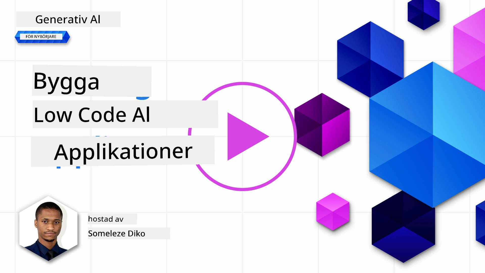](https://youtu.be/1vzq3Nd8GBA?si=h6LHWJXdmqf6mhDg)

> _(Klicka på bilden ovan för att se videon för denna lektion)_

## Introduktion

Nu när vi har lärt oss att bygga applikationer som genererar bilder, låt oss prata om lågkod. Generativ AI kan användas för flera olika områden, inklusive lågkod, men vad är lågkod och hur kan vi lägga till AI i det?

Att bygga appar och lösningar har blivit enklare för traditionella utvecklare och icke-utvecklare genom användningen av Low Code Development Platforms. Low Code Development Platforms gör det möjligt att bygga appar och lösningar med lite eller ingen kod alls. Detta uppnås genom att erbjuda en visuell utvecklingsmiljö som gör det möjligt att dra och släppa komponenter för att bygga appar och lösningar. Detta gör att du kan bygga appar och lösningar snabbare och med mindre resurser. I denna lektion djupdyker vi i hur man använder lågkod och hur man förbättrar lågkodsutveckling med AI genom att använda Power Platform.

Power Platform ger organisationer möjligheten att stärka sina team så att de kan bygga egna lösningar genom en intuitiv lågkod- eller kodfri miljö. Denna miljö hjälper till att förenkla processen att bygga lösningar. Med Power Platform kan lösningar byggas på dagar eller veckor istället för månader eller år. Power Platform består av fem nyckelprodukter: Power Apps, Power Automate, Power BI, Power Pages och Copilot Studio.

Denna lektion täcker:

- Introduktion till generativ AI i Power Platform
- Introduktion till Copilot och hur man använder det
- Använda generativ AI för att bygga appar och flöden i Power Platform
- Förstå AI-modellerna i Power Platform med AI Builder
- Bygga intelligenta agenter med Microsoft Copilot Studio

## Lärandemål

I slutet av denna lektion kommer du att kunna:

- Förstå hur Copilot fungerar i Power Platform.

- Bygga en Student Assignment Tracker-app för vår utbildningsstart.

- Bygga ett fakturabehandlingsflöde som använder AI för att extrahera information från fakturor.

- Använda bästa praxis när du använder Create Text med GPT AI-modellen.

- Förstå vad Microsoft Copilot Studio är och hur man bygger intelligenta agenter med det.

Verktygen och teknologierna som du kommer att använda i denna lektion är:

- **Power Apps**, för Student Assignment Tracker-appen, som erbjuder en lågkodad utvecklingsmiljö för att bygga appar för att spåra, hantera och interagera med data.

- **Dataverse**, för att lagra data för Student Assignment Tracker-appen där Dataverse kommer att tillhandahålla en lågkodad dataplattform för att lagra appens data.

- **Power Automate**, för fakturabehandlingsflödet där du får en lågkodad utvecklingsmiljö för att bygga arbetsflöden för att automatisera fakturabehandlingsprocessen.

- **AI Builder**, för fakturabehandlings AI-modellen där du använder förbyggda AI-modeller för att behandla fakturorna för vår startup.

## Generativ AI i Power Platform

Att förbättra lågkodsutveckling och applikationer med generativ AI är ett kärnområde för Power Platform. Målet är att göra det möjligt för alla att bygga AI-drivna appar, sajter, instrumentpaneler och automatisera processer med AI, _utan att kräva någon expertis inom data science_. Detta mål uppnås genom att integrera generativ AI i lågkodutvecklingsupplevelsen i Power Platform i form av Copilot och AI Builder.

### Hur fungerar detta?

Copilot är en AI-assistent som gör det möjligt för dig att bygga Power Platform-lösningar genom att beskriva dina krav i en serie konversationssteg med naturligt språk. Du kan till exempel instruera din AI-assistent att ange vilka fält din app ska använda och den skapar både appen och den underliggande datamodellen, eller så kan du specificera hur ett flöde i Power Automate ska sättas upp.

Du kan använda Copilot-drivna funktioner som en funktion i dina appskärmar för att låta användare upptäcka insikter genom konverserande interaktioner.

AI Builder är en lågkodad AI-funktion som finns i Power Platform och gör det möjligt att använda AI-modeller för att hjälpa dig automatisera processer och förutsäga resultat. Med AI Builder kan du ta AI till dina appar och flöden som kopplar till data i Dataverse eller i olika molndatakällor, såsom SharePoint, OneDrive eller Azure.

Copilot finns i alla Power Platform-produkter: Power Apps, Power Automate, Power BI, Power Pages och Copilot Studio (tidigare Power Virtual Agents). AI Builder finns tillgängligt i Power Apps och Power Automate. I denna lektion fokuserar vi på hur du använder Copilot och AI Builder i Power Apps och Power Automate för att bygga en lösning för vår utbildningsstartup.

### Copilot i Power Apps

Som en del av Power Platform erbjuder Power Apps en lågkodad utvecklingsmiljö för att bygga appar att spåra, hantera och interagera med data. Det är en svit av apputvecklingstjänster med en skalbar dataplattform och möjlighet att koppla till molntjänster och lokal data. Power Apps låter dig bygga appar som körs i webbläsare, på surfplattor och telefoner, och kan delas med kollegor. Power Apps underlättar apputveckling för användare med ett enkelt gränssnitt så att varje affärsanvändare eller professionell utvecklare kan bygga anpassade appar. Apputvecklingsupplevelsen förbättras också med generativ AI genom Copilot.

Copilot AI-assistentfunktionen i Power Apps gör att du kan beskriva vilken typ av app du behöver och vilken information du vill att din app ska spåra, samla in eller visa. Copilot genererar sedan en responsiv Canvas-app baserad på din beskrivning. Du kan sedan anpassa appen efter dina behov. AI Copilot genererar också och föreslår en Dataverse-tabell med de fält du behöver för att lagra data du vill spåra samt något exempeldata. Vi kommer senare i denna lektion att titta på vad Dataverse är och hur du kan använda det i Power Apps. Du kan sedan anpassa tabellen för att motsvara dina behov med hjälp av AI Copilot-assistentfunktionen via konversationssteg. Denna funktion finns lättillgänglig från Power Apps startskärm.

### Copilot i Power Automate

Som en del av Power Platform låter Power Automate användare skapa automatiserade arbetsflöden mellan applikationer och tjänster. Det hjälper till att automatisera repetitiva affärsprocesser som kommunikation, datainsamling och godkännanden. Dess enkla gränssnitt tillåter användare med alla tekniska kompetenser (från nybörjare till erfarna utvecklare) att automatisera arbetsuppgifter. Arbetsflödesutvecklingen förbättras också med generativ AI genom Copilot.

Copilot AI-assistentfunktionen i Power Automate gör att du kan beskriva vilket slags flöde du behöver och vilka åtgärder du vill att flödet ska utföra. Copilot genererar sedan ett flöde baserat på din beskrivning. Du kan sedan anpassa flödet efter dina behov. AI Copilot genererar också och föreslår åtgärder du behöver för att utföra den uppgift du vill automatisera. Vi kommer senare i denna lektion att titta på vad flöden är och hur du kan använda dem i Power Automate. Du kan sedan anpassa åtgärderna efter dina behov med hjälp av AI Copilot-assistentfunktionen via konversationssteg. Denna funktion finns lättillgänglig från Power Automate startskärm.

## Bygga intelligenta agenter med Microsoft Copilot Studio

[Microsoft Copilot Studio](https://learn.microsoft.com/microsoft-copilot-studio/fundamentals-what-is-copilot-studio?WT.mc_id=academic-105485-koreyst) (tidigare Power Virtual Agents) är lågkodmedlemmen i Power Platform för att bygga **AI-agenter** — konverserande copiloter som kan svara på frågor, utföra åtgärder och automatisera uppgifter åt dina användare. Precis som resten av Power Platform bygger du dessa agenter i en visuell upplevelse med fokus på naturligt språk: du beskriver vad du vill att agenten ska göra, och Copilot Studio hjälper till att ställa in dess instruktioner, kunskap och åtgärder.

För vår utbildningsstartup kan du bygga en agent som svarar på studenters frågor om kurser, kontrollerar inlämningsdatum för uppgifter och till och med skickar e-post till en instruktör — allt utan att skriva kod.

Här är några av de senaste funktionerna som gör Copilot Studio kraftfullt:

- **Generativa svar från din kunskap**. Istället för att manuellt skapa varje konversation kan du koppla **kunskapskällor** — offentliga webbplatser, SharePoint, OneDrive, Dataverse, uppladdade filer eller företagsdata via connectors — och agenten genererar förankrade svar från dem.

- **Generativ orkestrering**. Istället för att förlita sig på rigida utlösarfraser använder agenten AI för att förstå en begäran och dynamiskt bestämma vilken kunskap, ämnen och åtgärder som ska kombineras för att uppfylla den, inklusive att kedja flera steg tillsammans.

- **Åtgärder och connectors**. Agenter kan *utföra* saker, inte bara chatta. Du kan ge en agent åtgärder som stöds av 1 500+ förbyggda Power Platform-anslutningar, Power Automate-flöden, anpassade REST-API:er, prompts eller **Model Context Protocol (MCP)**-servrar.

- **Autonoma agenter**. Agenter är inte begränsade till att svara i ett chattfönster. Du kan bygga **autonoma agenter** som triggas av händelser — som ett nytt e-postmeddelande, en ny post i Dataverse eller en uppladdad fil — och sedan agerar i bakgrunden för att slutföra en uppgift.

- **Multi-agent orkestrering**. Agenter kan anropa andra agenter. En Copilot Studio-agent kan överlämna till, eller utökas av, andra agenter, inklusive agenter publicerade i Microsoft 365 Copilot och agenter byggda i Microsoft Foundry.

- **Val av modell**. Utöver de inbyggda modellerna kan du använda modeller från Microsoft Foundrys modellkatalog för att anpassa hur din agent resonerar och svarar.

- **Publicera var som helst**. När en agent är byggd kan den publiceras till flera kanaler — Microsoft Teams, Microsoft 365 Copilot, en webbplats eller anpassad app med mera — med säkerhet, autentisering och analys hanterade via Power Platforms administrationsupplevelse.

Du kan börja bygga din första agent på [copilotstudio.microsoft.com](https://copilotstudio.microsoft.com?WT.mc_id=academic-105485-koreyst) och lära dig mer i [Microsoft Copilot Studio-dokumentationen](https://learn.microsoft.com/microsoft-copilot-studio/?WT.mc_id=academic-105485-koreyst).

## Uppgift: Hantera studentuppgifter och fakturor för vår startup, med Copilot

Vår startup erbjuder onlinekurser till studenter. Startuppen har vuxit snabbt och har nu svårt att hänga med i efterfrågan på sina kurser. Startuppen har anlitat dig som Power Platform-utvecklare för att hjälpa dem bygga en lågkodslösning för att hjälpa dem hantera studentuppgifter och fakturor. Deras lösning ska kunna hjälpa dem att spåra och hantera studentuppgifter via en app och automatisera fakturabehandlingsprocessen via ett arbetsflöde. Du har blivit ombedd att använda generativ AI för att utveckla lösningen.

När du börjar med att använda Copilot kan du använda [Power Platform Copilot Prompt Library](https://github.com/pnp/powerplatform-prompts?WT.mc_id=academic-109639-somelezediko) för att komma igång med prompts. Detta bibliotek innehåller en lista med prompts som du kan använda för att bygga appar och flöden med Copilot. Du kan också använda prompts i biblioteket för att få en idé om hur du beskriver dina krav till Copilot.

### Bygg en Student Assignment Tracker-app för vår startup

Utbildarna på vår startup har haft svårt att hålla reda på studentuppgifter. De har använt ett kalkylblad för att spåra uppgifterna men det har blivit svårt att hantera i takt med att antalet studenter ökat. De har bett dig bygga en app som hjälper dem att spåra och hantera studentuppgifter. Appen ska låta dem lägga till nya uppgifter, visa uppgifterna, uppdatera uppgifterna och ta bort uppgifter. Appen ska också låta utbildare och studenter se vilka uppgifter som har blivit bedömda och vilka som inte har blivit bedömda.

Du bygger appen med Copilot i Power Apps enligt stegen nedan:

1. Navigera till [Power Apps](https://make.powerapps.com?WT.mc_id=academic-105485-koreyst)-startskärmen.

1. Använd textrutan på startskärmen för att beskriva appen du vill bygga. Till exempel, **_Jag vill bygga en app för att spåra och hantera studentuppgifter_**. Klicka på **Skicka**-knappen för att skicka prompten till AI Copilot.

1. AI Copilot kommer att föreslå en Dataverse-tabell med de fält du behöver för att lagra den data du vill spåra samt något exempeldata. Du kan sedan anpassa tabellen för att passa dina behov med hjälp av AI Copilot-assistentfunktionen via konversationssteg.

   > **Viktigt**: Dataverse är den underliggande dataplattformen för Power Platform. Det är en lågkodad dataplattform för att lagra appens data. Det är en fullt hanterad tjänst som lagrar data säkert i Microsoft-molnet och tillhandahålls inom din Power Platform-miljö. Det kommer med inbyggda funktioner för datastyrning som dataklassificering, datakällspårning, finmaskig åtkomstkontroll med mera. Du kan läsa mer om Dataverse [här](https://learn.microsoft.com/power-apps/maker/data-platform/data-platform-intro?WT.mc_id=academic-109639-somelezediko).

   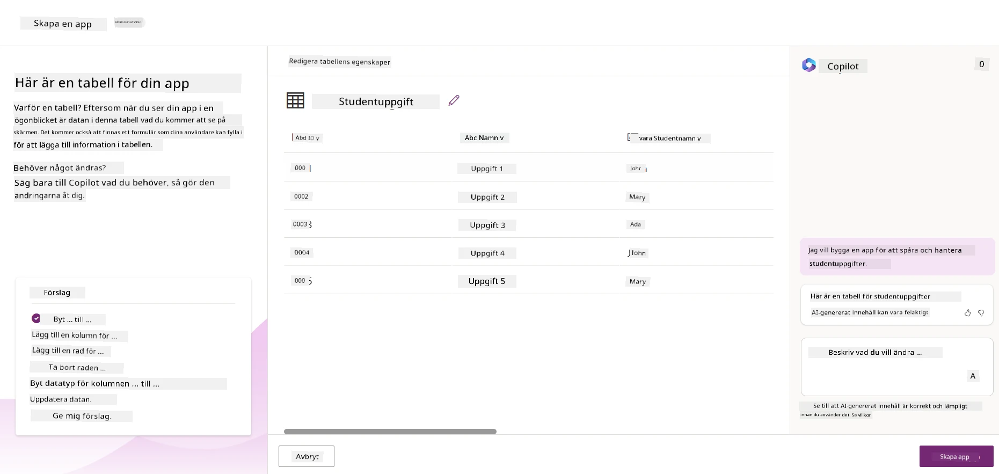

1. Utbildare vill skicka e-post till studenter som har lämnat in sina uppgifter för att hålla dem uppdaterade om uppgifternas status. Du kan använda Copilot för att lägga till ett nytt fält i tabellen för att lagra studenters e-post. Till exempel kan du använda följande prompt för att lägga till ett nytt fält i tabellen: **_Jag vill lägga till en kolumn för att lagra studenternas e-post_**. Klicka på **Skicka**-knappen för att skicka prompten till AI Copilot.

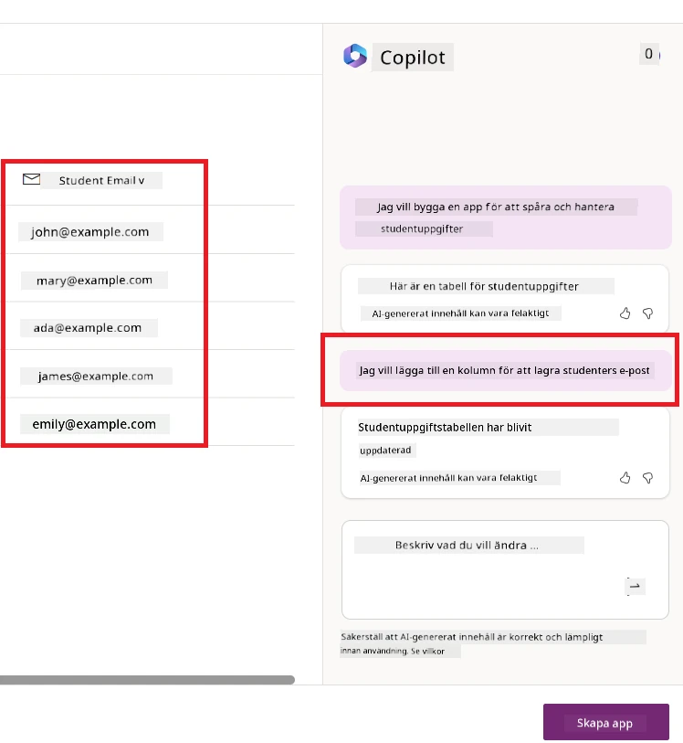

1. AI Copilot genererar ett nytt fält som du sedan kan anpassa för att passa dina behov.

1. När du är klar med tabellen klickar du på knappen **Create app** för att skapa appen.

1. AI Copilot kommer att generera en responsiv Canvas-app baserad på din beskrivning. Du kan sedan anpassa appen efter dina behov.

1. För lärare som vill skicka e-post till elever kan du använda Copilot för att lägga till en ny skärm i appen. Du kan till exempel använda följande uppmaning för att lägga till en ny skärm i appen: **_I want to add a screen to send emails to students_**. Klicka på knappen **Send** för att skicka uppmaningen till AI Copilot.

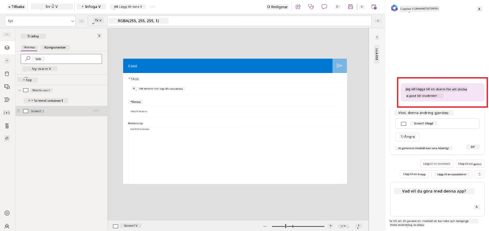

1. AI Copilot kommer att generera en ny skärm och du kan sedan anpassa skärmen efter dina behov.

1. När du är klar med appen klickar du på knappen **Save** för att spara appen.

1. För att dela appen med lärarna klickar du på knappen **Share** och klickar sedan på knappen **Share** igen. Du kan sedan dela appen med lärarna genom att ange deras e-postadresser.

> **Din läxa**: Appen du just byggde är en bra start men kan förbättras. Med e-postfunktionen kan lärarna endast manuellt skicka e-post till elever genom att skriva in deras e-postadresser. Kan du använda Copilot för att skapa en automatisering som gör det möjligt för lärarna att automatiskt skicka e-post till elever när de lämnar in sina uppgifter? Ett tips är att med rätt uppmaning kan du använda Copilot i Power Automate för att bygga detta.

### Skapa en fakturainformationstabell för vårt startupföretag

Ekonomiteamet i vårt startup har haft svårt att hålla koll på fakturorna. De har använt ett kalkylblad för att spåra fakturorna, men det har blivit svårt att hantera eftersom antalet fakturor har ökat. De har bett dig att skapa en tabell som hjälper dem att lagra, spåra och hantera informationen om de fakturor de mottagit. Tabellen ska användas för att bygga en automatisering som kommer att extrahera all fakturainformation och lagra den i tabellen. Tabellen ska också göra det möjligt för ekonomiteamet att se vilka fakturor som har betalats och vilka som inte har betalats.

Power Platform har en underliggande dataplattform som kallas Dataverse som gör det möjligt att lagra data för dina appar och lösningar. Dataverse erbjuder en lågkodad dataplattform för att lagra appens data. Det är en helt hanterad tjänst som säkert lagrar data i Microsoft Cloud och är provisionerad inom din Power Platform-miljö. Den kommer med inbyggda funktioner för datastyrning, såsom dataklassificering, datalogg, detaljerad åtkomstkontroll och mer. Du kan lära dig mer [om Dataverse här](https://learn.microsoft.com/power-apps/maker/data-platform/data-platform-intro?WT.mc_id=academic-109639-somelezediko).

Varför ska vi använda Dataverse för vårt startup? Standard- och anpassade tabeller inom Dataverse erbjuder en säker och molnbaserad lagringslösning för din data. Tabeller låter dig lagra olika typer av data, liknande hur du kan använda flera blad i en enda Excel-arbetsbok. Du kan använda tabeller för att lagra data som är specifik för din organisation eller affärsbehov. Några av fördelarna vårt startup får genom att använda Dataverse inkluderar men är inte begränsade till:

- **Lätt att hantera**: Både metadata och data lagras i molnet, så du behöver inte oroa dig för detaljerna kring hur de lagras eller hanteras. Du kan fokusera på att bygga dina appar och lösningar.

- **Säkert**: Dataverse erbjuder en säker och molnbaserad lagringslösning för din data. Du kan kontrollera vem som har åtkomst till datan i dina tabeller och hur de kan komma åt den med rollbaserad säkerhet.

- **Rich metadata**: Datatyper och relationer används direkt inom Power Apps

- **Logik och validering**: Du kan använda affärsregler, beräknade fält och valideringsregler för att genomdriva affärslogik och upprätthålla datanoggrannhet.

Nu när du vet vad Dataverse är och varför du bör använda det, låt oss titta på hur du kan använda Copilot för att skapa en tabell i Dataverse för att uppfylla kraven från vårt ekonomiteam.

> **Notera** : Du kommer att använda denna tabell i nästa avsnitt för att bygga en automatisering som extraherar all fakturainformation och lagrar den i tabellen.

För att skapa en tabell i Dataverse med hjälp av Copilot, följ stegen nedan:

1. Gå till [Power Apps](https://make.powerapps.com?WT.mc_id=academic-105485-koreyst) startskärm.

2. I den vänstra navigationsmenyn, välj **Tables** och klicka sedan på **Describe the new Table**.

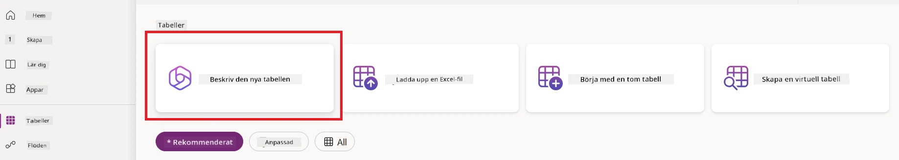

1. På skärmen **Describe the new Table** använder du textområdet för att beskriva tabellen du vill skapa. Till exempel, **_I want to create a table to store invoice information_**. Klicka på knappen **Send** för att skicka uppmaningen till AI Copilot.

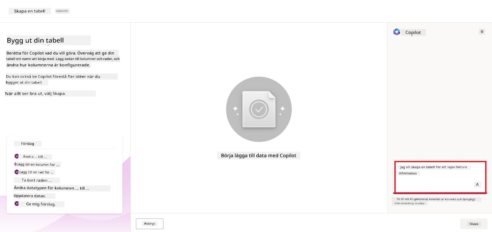

1. AI Copilot kommer att föreslå en Dataverse-tabell med de fält du behöver för att lagra den data du vill spåra samt exempeldata. Du kan sedan anpassa tabellen efter dina behov med hjälp av AI Copilot-assistenten genom konversationssteg.

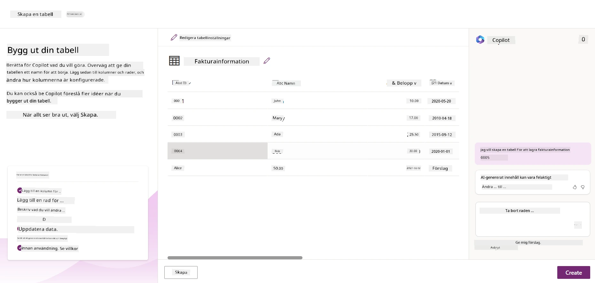

1. Ekonomiteamet vill skicka e-post till leverantören för att uppdatera dem med aktuell status för deras faktura. Du kan använda Copilot för att lägga till ett nytt fält i tabellen för att lagra leverantörens e-post. Till exempel kan du använda följande uppmaning för att lägga till ett nytt fält i tabellen: **_I want to add a column to store supplier email_**. Klicka på knappen **Send** för att skicka uppmaningen till AI Copilot.

1. AI Copilot kommer att generera ett nytt fält och du kan sedan anpassa fältet efter dina behov.

1. När du är klar med tabellen klickar du på knappen **Create** för att skapa tabellen.

## AI-modeller i Power Platform med AI Builder

AI Builder är en lågkodad AI-funktion i Power Platform som gör det möjligt att använda AI-modeller för att hjälpa dig automatisera processer och förutsäga resultat. Med AI Builder kan du integrera AI i dina appar och flöden som ansluter till dina data i Dataverse eller från olika molndatakällor, såsom SharePoint, OneDrive eller Azure.

## Förbyggda AI-modeller vs Användaranpassade AI-modeller

AI Builder erbjuder två typer av AI-modeller: förbyggda AI-modeller och användaranpassade AI-modeller. Förbyggda AI-modeller är färdiga AI-modeller som tränats av Microsoft och finns tillgängliga i Power Platform. Dessa hjälper dig att lägga till intelligens i dina appar och flöden utan att behöva samla in data och sedan bygga, träna och publicera egna modeller. Du kan använda dessa modeller för att automatisera processer och förutsäga resultat.

Några av de förbyggda AI-modeller som finns i Power Platform inkluderar:

- **Key Phrase Extraction**: Denna modell extraherar nyckeluttryck från text.
- **Language Detection**: Denna modell upptäcker språket i en text.
- **Sentiment Analysis**: Denna modell upptäcker positiv, negativ, neutral eller blandad känsla i text.
- **Business Card Reader**: Denna modell extraherar information från visitkort.
- **Text Recognition**: Denna modell extraherar text från bilder.
- **Object Detection**: Denna modell upptäcker och extraherar objekt från bilder.
- **Document processing**: Denna modell extraherar information från formulär.
- **Invoice Processing**: Denna modell extraherar information från fakturor.

Med användaranpassade AI-modeller kan du ta med din egen modell till AI Builder så att den kan fungera som vilken annan AI Builder-anpassad modell som helst, vilket möjliggör träning av modellen med dina egna data. Du kan använda dessa modeller för att automatisera processer och förutsäga resultat i både Power Apps och Power Automate. När du använder din egen modell finns det begränsningar. Läs mer om dessa [begränsningar](https://learn.microsoft.com/ai-builder/byo-model#limitations?WT.mc_id=academic-105485-koreyst).

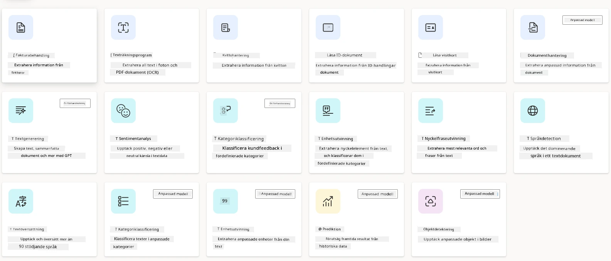

## Uppgift #2 - Bygg ett fakturahanteringsflöde för vårt startup

Ekonomiteamet har haft svårt att hantera fakturor. De har använt ett kalkylblad för att spåra fakturor men det har blivit svårt att hantera eftersom antalet fakturor har ökat. De har bett dig att skapa ett arbetsflöde som hjälper dem att hantera fakturor med hjälp av AI. Arbetsflödet ska göra det möjligt att extrahera information från fakturor och lagra informationen i en Dataverse-tabell. Arbetsflödet ska också göra det möjligt för dem att skicka e-post till ekonomiteamet med den extraherade informationen.

Nu när du vet vad AI Builder är och varför du bör använda det, låt oss titta på hur du kan använda fakturahanterings-AI-modellen i AI Builder, som vi täckte tidigare, för att skapa ett arbetsflöde som hjälper ekonomiteamet att hantera fakturor.

För att bygga ett arbetsflöde som hjälper ekonomiteamet att hantera fakturor med fakturahanterings-AI-modellen i AI Builder, följ stegen nedan:

1. Gå till [Power Automate](https://make.powerautomate.com?WT.mc_id=academic-105485-koreyst) startskärm.

2. Använd textfältet på startskärmen för att beskriva det arbetsflöde du vill bygga. Till exempel, **_Process an invoice when it arrives in my mailbox_**. Klicka på knappen **Send** för att skicka uppmaningen till AI Copilot.

   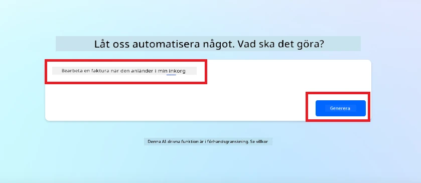

3. AI Copilot kommer att föreslå de åtgärder du behöver för att utföra den uppgift du vill automatisera. Du kan klicka på knappen **Next** för att gå igenom nästa steg.

4. I nästa steg kommer Power Automate att be dig konfigurera de anslutningar som krävs för flödet. När du är klar klickar du på knappen **Create flow** för att skapa flödet.

5. AI Copilot kommer att generera ett flöde och du kan sedan anpassa flödet efter dina behov.

6. Uppdatera triggern för flödet och ställ in **Folder** till mappen där fakturorna ska lagras. Till exempel kan du ställa in mappen till **Inbox**. Klicka på **Show advanced options** och ställ in **Only with Attachments** till **Yes**. Detta säkerställer att flödet endast körs när ett e-postmeddelande med en bilaga tas emot i mappen.

7. Ta bort följande åtgärder från flödet: **HTML to text**, **Compose**, **Compose 2**, **Compose 3** och **Compose 4** eftersom du inte kommer att använda dem.

8. Ta bort åtgärden **Condition** från flödet eftersom du inte kommer att använda den. Det bör se ut som följande skärmbild:

   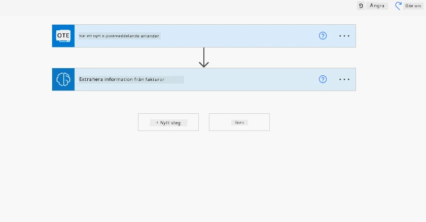

9. Klicka på knappen **Add an action** och sök efter **Dataverse**. Välj åtgärden **Add a new row**.

10. På åtgärden **Extract Information from invoices** uppdaterar du **Invoice File** så att det pekar på **Attachment Content** från e-postmeddelandet. Detta säkerställer att flödet extraherar information från fakturabilagan.

11. Välj tabellen du skapade tidigare. Till exempel kan du välja tabellen **Invoice Information**. Välj det dynamiska innehållet från föregående åtgärd för att fylla följande fält:

    - ID
    - Amount
    - Date
    - Name
    - Status - Ställ in **Status** till **Pending**.
    - Supplier Email - Använd det dynamiska innehållet **From** från triggern **When a new email arrives**.

    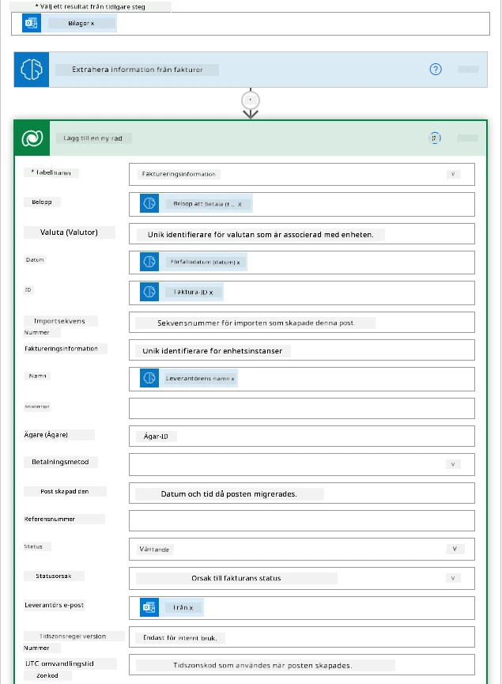

12. När du är klar med flödet klickar du på knappen **Save** för att spara flödet. Du kan sedan testa flödet genom att skicka ett e-postmeddelande med en faktura till mappen du angav i triggern.

> **Din läxa**: Flödet du just byggde är en bra start, nu behöver du fundera på hur du kan bygga en automatisering som gör det möjligt för vårt ekonomiteam att skicka e-post till leverantören för att uppdatera dem om den aktuella statusen på deras faktura. Ett tips: flödet måste köras när fakturans status ändras.

## Använd en textgenererings-AI-modell i Power Automate

Skapa text med GPT AI-modellen i AI Builder gör det möjligt att generera text baserat på en prompt och drivs av Microsoft Azure OpenAI-tjänst. Med denna funktion kan du integrera GPT (Generative Pre-Trained Transformer)-teknologi i dina appar och flöden för att bygga en mängd olika automatiserade flöden och insiktsfulla applikationer.

GPT-modeller genomgår omfattande träning på stora mängder data och kan generera text som liknar mänskligt språk när de får en prompt. När de integreras i arbetsflödesautomatisering kan AI-modeller som GPT användas för att effektivisera och automatisera en mängd olika uppgifter.

Till exempel kan du bygga flöden för att automatiskt generera text för olika användningsområden, såsom: utkast till e-post, produktbeskrivningar med mera. Du kan också använda modellen för att generera text för olika appar, såsom chatbots och kundtjänstappar som gör det möjligt för kundtjänstagenter att svara effektivt och snabbt på kundförfrågningar.

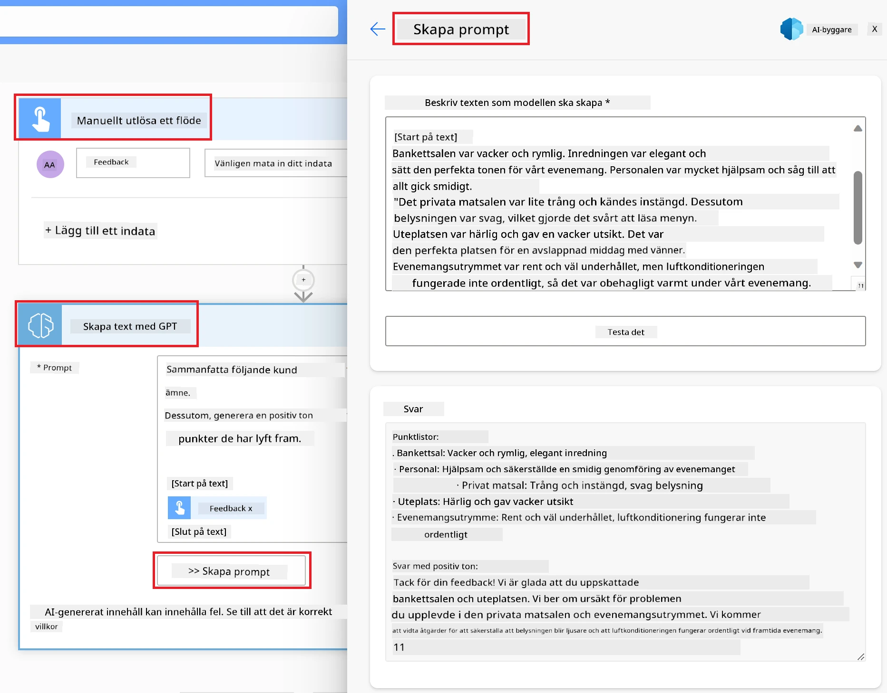

För att lära dig hur du använder denna AI-modell i Power Automate, gå igenom modulen [Lägg till intelligens med AI Builder och GPT](https://learn.microsoft.com/training/modules/ai-builder-text-generation/?WT.mc_id=academic-109639-somelezediko).

## Bra jobbat! Fortsätt din inlärning

Efter att ha slutfört denna lektion, kolla in vår [Generative AI Learning collection](https://aka.ms/genai-collection?WT.mc_id=academic-105485-koreyst) för att fortsätta utveckla din kunskap om Generativ AI!

Vill du anpassa och få ut mer av Copilot? Utforska [Awesome Copilot](https://github.com/github/awesome-copilot?WT.mc_id=academic-105485-koreyst) — en community-bidragsamling av instruktioner, agenter, färdigheter och konfigurationer som hjälper dig att få ut det mesta av GitHub Copilot.

Gå vidare till Lektion 11 där vi kommer att titta på hur man [integrerar Generativ AI med Funktionsanrop](../11-integrating-with-function-calling/README.md?WT.mc_id=academic-105485-koreyst)!

---

<!-- CO-OP TRANSLATOR DISCLAIMER START -->
**Ansvarsfriskrivning**:
Detta dokument har översatts med hjälp av AI-översättningstjänsten [Co-op Translator](https://github.com/Azure/co-op-translator). Även om vi strävar efter noggrannhet, var vänlig notera att automatiska översättningar kan innehålla fel eller brister. Det ursprungliga dokumentet på dess modersmål bör betraktas som den auktoritativa källan. För kritisk information rekommenderas professionell mänsklig översättning. Vi ansvarar inte för några missförstånd eller feltolkningar som uppstår till följd av användningen av denna översättning.
<!-- CO-OP TRANSLATOR DISCLAIMER END -->