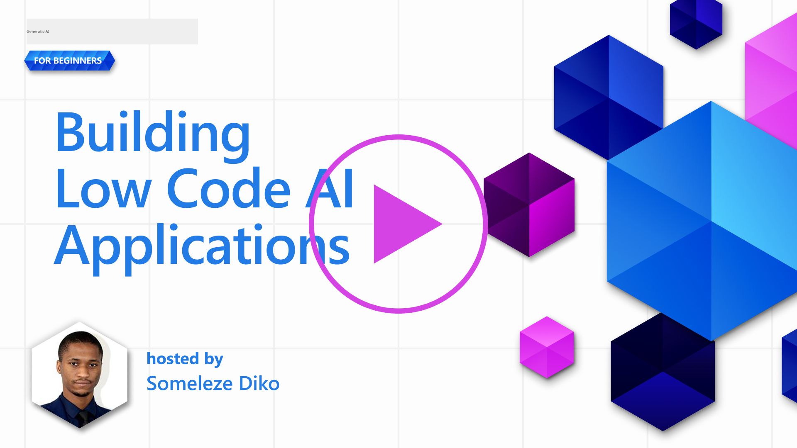
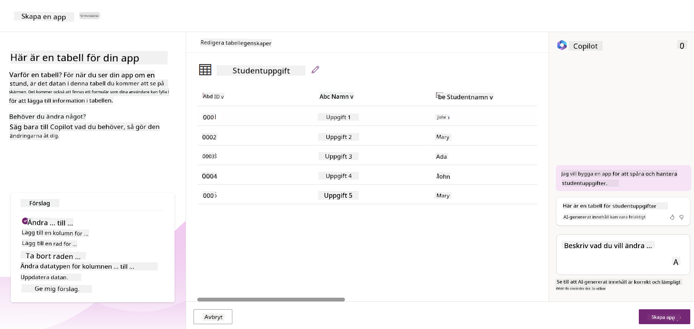
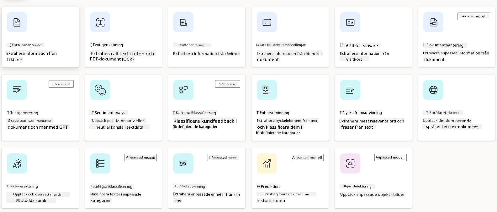

<!--
CO_OP_TRANSLATOR_METADATA:
{
  "original_hash": "f5ff3b6204a695a117d6f452403c95f7",
  "translation_date": "2025-07-09T14:01:23+00:00",
  "source_file": "10-building-low-code-ai-applications/README.md",
  "language_code": "sv"
}
-->
# Bygga Low Code AI-applikationer

> _(Klicka på bilden ovan för att se videon för denna lektion)_

## Introduktion

Nu när vi har lärt oss hur man bygger applikationer som genererar bilder, låt oss prata om low code. Generativ AI kan användas inom många olika områden, inklusive low code, men vad är egentligen low code och hur kan vi lägga till AI i det?

Att bygga appar och lösningar har blivit enklare för både traditionella utvecklare och icke-utvecklare genom användning av Low Code Development Platforms. Low Code Development Platforms gör det möjligt att bygga appar och lösningar med lite eller ingen kod alls. Detta uppnås genom att erbjuda en visuell utvecklingsmiljö där du kan dra och släppa komponenter för att skapa appar och lösningar. Det gör att du kan bygga appar och lösningar snabbare och med mindre resurser. I denna lektion går vi på djupet i hur man använder Low Code och hur man förbättrar low code-utveckling med AI med hjälp av Power Platform.

Power Platform ger organisationer möjlighet att stärka sina team att bygga egna lösningar genom en intuitiv low-code eller no-code-miljö. Denna miljö förenklar processen att bygga lösningar. Med Power Platform kan lösningar byggas på dagar eller veckor istället för månader eller år. Power Platform består av fem nyckelprodukter: Power Apps, Power Automate, Power BI, Power Pages och Copilot Studio.

Denna lektion täcker:

- Introduktion till Generativ AI i Power Platform  
- Introduktion till Copilot och hur man använder det  
- Använda Generativ AI för att bygga appar och flöden i Power Platform  
- Förstå AI-modellerna i Power Platform med AI Builder  

## Lärandemål

I slutet av denna lektion kommer du att kunna:

- Förstå hur Copilot fungerar i Power Platform.

- Bygga en Student Assignment Tracker-app för vårt utbildningsstartup.

- Bygga ett fakturahanteringsflöde som använder AI för att extrahera information från fakturor.

- Tillämpa bästa praxis när du använder Create Text med GPT AI-modellen.

Verktygen och teknologierna du kommer att använda i denna lektion är:

- **Power Apps**, för Student Assignment Tracker-appen, som erbjuder en low-code utvecklingsmiljö för att bygga appar för att spåra, hantera och interagera med data.

- **Dataverse**, för att lagra data för Student Assignment Tracker-appen där Dataverse tillhandahåller en low-code dataplattform för att lagra appens data.

- **Power Automate**, för fakturahanteringsflödet där du får en low-code utvecklingsmiljö för att bygga arbetsflöden som automatiserar fakturahanteringsprocessen.

- **AI Builder**, för fakturahanterings-AI-modellen där du använder förbyggda AI-modeller för att bearbeta fakturorna för vårt startup.

## Generativ AI i Power Platform

Att förbättra low-code-utveckling och applikationer med generativ AI är ett viktigt fokusområde för Power Platform. Målet är att göra det möjligt för alla att bygga AI-drivna appar, webbplatser, dashboards och automatisera processer med AI, _utan att behöva någon expertis inom datavetenskap_. Detta mål uppnås genom att integrera generativ AI i low-code-utvecklingsupplevelsen i Power Platform i form av Copilot och AI Builder.

### Hur fungerar detta?

Copilot är en AI-assistent som låter dig bygga Power Platform-lösningar genom att beskriva dina krav i en serie konversationssteg med naturligt språk. Du kan till exempel instruera din AI-assistent att ange vilka fält din app ska använda och den skapar både appen och den underliggande datamodellen, eller så kan du specificera hur ett flöde ska sättas upp i Power Automate.

Du kan använda Copilot-drivna funktioner som en del av dina app-skärmar för att låta användare upptäcka insikter genom konversationsbaserade interaktioner.

AI Builder är en low-code AI-funktion i Power Platform som gör det möjligt att använda AI-modeller för att automatisera processer och förutsäga resultat. Med AI Builder kan du integrera AI i dina appar och flöden som kopplas till din data i Dataverse eller i olika molndatakällor, som SharePoint, OneDrive eller Azure.

Copilot finns tillgängligt i alla Power Platform-produkter: Power Apps, Power Automate, Power BI, Power Pages och Power Virtual Agents. AI Builder finns i Power Apps och Power Automate. I denna lektion fokuserar vi på hur man använder Copilot och AI Builder i Power Apps och Power Automate för att bygga en lösning för vårt utbildningsstartup.

### Copilot i Power Apps

Som en del av Power Platform erbjuder Power Apps en low-code utvecklingsmiljö för att bygga appar för att spåra, hantera och interagera med data. Det är en svit av apputvecklingstjänster med en skalbar dataplattform och möjligheten att koppla till molntjänster och lokala datakällor. Power Apps låter dig bygga appar som körs i webbläsare, på surfplattor och telefoner, och som kan delas med kollegor. Power Apps gör det enkelt för användare att komma igång med apputveckling genom ett enkelt gränssnitt, så att varje affärsanvändare eller professionell utvecklare kan skapa anpassade appar. Apputvecklingsupplevelsen förbättras också med Generativ AI via Copilot.

Copilot AI-assistentfunktionen i Power Apps låter dig beskriva vilken typ av app du behöver och vilken information du vill att appen ska spåra, samla in eller visa. Copilot genererar sedan en responsiv Canvas-app baserat på din beskrivning. Du kan sedan anpassa appen efter dina behov. AI Copilot genererar och föreslår också en Dataverse-tabell med de fält du behöver för att lagra den data du vill spåra samt exempeldata. Vi kommer att titta närmare på vad Dataverse är och hur du kan använda det i Power Apps senare i denna lektion. Du kan sedan anpassa tabellen efter dina behov med hjälp av AI Copilot-assistenten genom konversationssteg. Denna funktion är lättillgänglig från Power Apps startsida.

### Copilot i Power Automate

Som en del av Power Platform låter Power Automate användare skapa automatiserade arbetsflöden mellan applikationer och tjänster. Det hjälper till att automatisera repetitiva affärsprocesser som kommunikation, datainsamling och godkännanden. Dess enkla gränssnitt gör det möjligt för användare med alla tekniska nivåer (från nybörjare till erfarna utvecklare) att automatisera arbetsuppgifter. Arbetsflödesutvecklingen förbättras också med Generativ AI via Copilot.

Copilot AI-assistentfunktionen i Power Automate låter dig beskriva vilken typ av flöde du behöver och vilka åtgärder du vill att flödet ska utföra. Copilot genererar sedan ett flöde baserat på din beskrivning. Du kan sedan anpassa flödet efter dina behov. AI Copilot genererar och föreslår också de åtgärder du behöver för att utföra den uppgift du vill automatisera. Vi kommer att titta närmare på vad flöden är och hur du kan använda dem i Power Automate senare i denna lektion. Du kan sedan anpassa åtgärderna efter dina behov med hjälp av AI Copilot-assistenten genom konversationssteg. Denna funktion är lättillgänglig från Power Automate startsida.

## Uppgift: Hantera studentuppgifter och fakturor för vårt startup med Copilot

Vårt startup erbjuder onlinekurser till studenter. Företaget har vuxit snabbt och har nu svårt att hinna med efterfrågan på sina kurser. De har anställt dig som Power Platform-utvecklare för att hjälpa dem bygga en low code-lösning som kan hjälpa dem att hantera studentuppgifter och fakturor. Deras lösning ska kunna hjälpa dem att spåra och hantera studentuppgifter via en app och automatisera fakturahanteringsprocessen via ett arbetsflöde. Du har blivit ombedd att använda Generativ AI för att utveckla lösningen.

När du börjar använda Copilot kan du använda [Power Platform Copilot Prompt Library](https://github.com/pnp/powerplatform-prompts?WT.mc_id=academic-109639-somelezediko) för att komma igång med prompts. Detta bibliotek innehåller en lista med prompts som du kan använda för att bygga appar och flöden med Copilot. Du kan också använda prompts i biblioteket för att få en idé om hur du ska beskriva dina krav till Copilot.

### Bygg en Student Assignment Tracker-app för vårt startup

Utbildarna på vårt startup har haft svårt att hålla koll på studentuppgifter. De har använt ett kalkylblad för att spåra uppgifterna, men det har blivit svårt att hantera eftersom antalet studenter har ökat. De har bett dig att bygga en app som hjälper dem att spåra och hantera studentuppgifter. Appen ska göra det möjligt att lägga till nya uppgifter, visa uppgifter, uppdatera uppgifter och ta bort uppgifter. Appen ska också göra det möjligt för utbildare och studenter att se vilka uppgifter som har bedömts och vilka som inte har bedömts.

Du kommer att bygga appen med Copilot i Power Apps enligt stegen nedan:

1. Navigera till [Power Apps](https://make.powerapps.com?WT.mc_id=academic-105485-koreyst) startsida.

1. Använd textfältet på startsidan för att beskriva appen du vill bygga. Till exempel, **_Jag vill bygga en app för att spåra och hantera studentuppgifter_**. Klicka på **Skicka**-knappen för att skicka prompten till AI Copilot.

1. AI Copilot föreslår en Dataverse-tabell med de fält du behöver för att lagra den data du vill spåra samt exempeldata. Du kan sedan anpassa tabellen efter dina behov med hjälp av AI Copilot-assistenten genom konversationssteg.

   > **Viktigt**: Dataverse är den underliggande dataplattformen för Power Platform. Det är en low-code dataplattform för att lagra appens data. Det är en helt hanterad tjänst som säkert lagrar data i Microsoft Cloud och är provisionerad inom din Power Platform-miljö. Den har inbyggda funktioner för datastyrning, såsom dataklassificering, dataflöde, detaljerad åtkomstkontroll med mera. Du kan läsa mer om Dataverse [här](https://docs.microsoft.com/powerapps/maker/data-platform/data-platform-intro?WT.mc_id=academic-109639-somelezediko).

   

1. Utbildarna vill skicka e-post till studenter som har lämnat in sina uppgifter för att hålla dem uppdaterade om deras uppgiftsstatus. Du kan använda Copilot för att lägga till ett nytt fält i tabellen för att lagra studentens e-postadress. Till exempel kan du använda följande prompt för att lägga till ett nytt fält: **_Jag vill lägga till en kolumn för att lagra studentens e-post_**. Klicka på **Skicka**-knappen för att skicka prompten till AI Copilot.

1. AI Copilot genererar ett nytt fält och du kan sedan anpassa fältet efter dina behov.

1. När du är klar med tabellen klickar du på **Skapa app**-knappen för att skapa appen.

1. AI Copilot genererar en responsiv Canvas-app baserat på din beskrivning. Du kan sedan anpassa appen efter dina behov.

1. För att utbildarna ska kunna skicka e-post till studenter kan du använda Copilot för att lägga till en ny skärm i appen. Till exempel kan du använda följande prompt för att lägga till en ny skärm: **_Jag vill lägga till en skärm för att skicka e-post till studenter_**. Klicka på **Skicka**-knappen för att skicka prompten till AI Copilot.

1. AI Copilot genererar en ny skärm och du kan sedan anpassa skärmen efter dina behov.

1. När du är klar med appen klickar du på **Spara**-knappen för att spara appen.

1. För att dela appen med utbildarna klickar du på **Dela**-knappen och sedan på **Dela** igen. Du kan sedan dela appen med utbildarna genom att ange deras e-postadresser.

> **Din hemläxa**: Appen du just byggde är en bra start men kan förbättras. Med e-postfunktionen kan utbildarna bara skicka e-post manuellt genom att skriva in e-postadresserna. Kan du använda Copilot för att bygga en automation som gör det möjligt för utbildarna att automatiskt skicka e-post till studenter när de lämnar in sina uppgifter? Tips: med rätt prompt kan du använda Copilot i Power Automate för att bygga detta.

### Bygg en fakturainformationstabell för vårt startup

Ekonomiteamet på vårt startup har haft svårt att hålla koll på fakturor. De har använt ett kalkylblad för att spåra fakturorna, men det har blivit svårt att hantera eftersom antalet fakturor har ökat. De har bett dig att bygga en tabell som hjälper dem att lagra, spåra och hantera informationen om de fakturor de mottagit. Tabellen ska användas för att bygga en automation som extraherar all fakturainformation och lagrar den i tabellen. Tabellen ska också göra det möjligt för ekonomiteamet att se vilka fakturor som har betalats och vilka som inte har betalats.

Power Platform har en underliggande dataplattform som heter Dataverse som gör det möjligt att lagra data för dina appar och lösningar. Dataverse erbjuder en low-code dataplattform för att lagra appens data. Det är en helt hanterad tjänst som säkert lagrar data i Microsoft Cloud och är provisionerad inom din Power Platform-miljö. Den har inbyggda funktioner för datastyrning, såsom dataklassificering, dataflöde, detaljerad åtkomstkontroll med mera. Du kan läsa mer [om Dataverse här](https://docs.microsoft.com/powerapps/maker/data-platform/data-platform-intro?WT.mc_id=academic-109639-somelezediko).

Varför ska vi använda Dataverse för vårt startup? Standard- och anpassade tabeller i Dataverse erbjuder en säker och molnbaserad lagringslösning för din data. Tabeller låter dig lagra olika typer av data, ungefär som att använda flera kalkylblad i en och samma Excel-arbetsbok. Du kan använda tabeller för att lagra data som är specifik för din organisation eller dina affärsbehov. Några av fördelarna vårt startup får genom att använda Dataverse inkluderar men är inte begränsade till:
- **Lätt att hantera**: Både metadata och data lagras i molnet, så du behöver inte oroa dig för detaljerna kring hur de lagras eller hanteras. Du kan fokusera på att bygga dina appar och lösningar.

- **Säkert**: Dataverse erbjuder en säker och molnbaserad lagringslösning för dina data. Du kan kontrollera vem som har åtkomst till data i dina tabeller och hur de kan komma åt dem med hjälp av rollbaserad säkerhet.

- **Rik metadata**: Datatyper och relationer används direkt inom Power Apps.

- **Logik och validering**: Du kan använda affärsregler, beräknade fält och valideringsregler för att upprätthålla affärslogik och säkerställa datakvalitet.

Nu när du vet vad Dataverse är och varför du bör använda det, låt oss titta på hur du kan använda Copilot för att skapa en tabell i Dataverse som uppfyller kraven från vårt ekonomiteam.

> **Note** : Du kommer att använda denna tabell i nästa avsnitt för att bygga en automation som extraherar all fakturainformation och lagrar den i tabellen.

För att skapa en tabell i Dataverse med hjälp av Copilot, följ stegen nedan:

1. Navigera till [Power Apps](https://make.powerapps.com?WT.mc_id=academic-105485-koreyst) startsida.

2. I den vänstra navigeringsmenyn, välj **Tables** och klicka sedan på **Describe the new Table**.

3. På skärmen **Describe the new Table**, använd textfältet för att beskriva tabellen du vill skapa. Till exempel, **_I want to create a table to store invoice information_**. Klicka på **Send** för att skicka prompten till AI Copilot.

4. AI Copilot kommer att föreslå en Dataverse-tabell med de fält du behöver för att lagra den data du vill följa och även exempeldata. Du kan sedan anpassa tabellen efter dina behov med hjälp av AI Copilot-assistenten genom konversationssteg.

5. Ekonomiteamet vill skicka ett e-postmeddelande till leverantören för att uppdatera dem om den aktuella statusen på deras faktura. Du kan använda Copilot för att lägga till ett nytt fält i tabellen för att lagra leverantörens e-postadress. Till exempel kan du använda följande prompt för att lägga till en ny kolumn: **_I want to add a column to store supplier email_**. Klicka på **Send** för att skicka prompten till AI Copilot.

6. AI Copilot genererar ett nytt fält och du kan sedan anpassa det efter dina behov.

7. När du är klar med tabellen, klicka på **Create** för att skapa tabellen.

## AI-modeller i Power Platform med AI Builder

AI Builder är en low-code AI-funktion i Power Platform som gör det möjligt att använda AI-modeller för att automatisera processer och förutsäga resultat. Med AI Builder kan du integrera AI i dina appar och flöden som kopplas till dina data i Dataverse eller i olika molndatakällor, som SharePoint, OneDrive eller Azure.

## Förbyggda AI-modeller vs Egna AI-modeller

AI Builder erbjuder två typer av AI-modeller: Förbyggda AI-modeller och Egna AI-modeller. Förbyggda AI-modeller är färdiga att använda och tränade av Microsoft, tillgängliga i Power Platform. Dessa hjälper dig att lägga till intelligens i dina appar och flöden utan att du behöver samla in data och sedan bygga, träna och publicera egna modeller. Du kan använda dessa modeller för att automatisera processer och förutsäga resultat.

Några av de förbyggda AI-modellerna som finns i Power Platform inkluderar:

- **Key Phrase Extraction**: Denna modell extraherar nyckeluttryck från text.
- **Language Detection**: Denna modell identifierar språket i en text.
- **Sentiment Analysis**: Denna modell upptäcker positiv, negativ, neutral eller blandad känsla i text.
- **Business Card Reader**: Denna modell extraherar information från visitkort.
- **Text Recognition**: Denna modell extraherar text från bilder.
- **Object Detection**: Denna modell upptäcker och extraherar objekt från bilder.
- **Document processing**: Denna modell extraherar information från formulär.
- **Invoice Processing**: Denna modell extraherar information från fakturor.

Med Egna AI-modeller kan du ta med din egen modell till AI Builder så att den fungerar som vilken annan AI Builder-modell som helst, vilket gör att du kan träna modellen med dina egna data. Du kan använda dessa modeller för att automatisera processer och förutsäga resultat i både Power Apps och Power Automate. När du använder din egen modell finns vissa begränsningar. Läs mer om dessa [begränsningar](https://learn.microsoft.com/ai-builder/byo-model#limitations?WT.mc_id=academic-105485-koreyst).

## Uppgift #2 - Bygg ett fakturahanteringsflöde för vårt startup

Ekonomiteamet har haft svårt att hantera fakturor. De har använt ett kalkylblad för att följa upp fakturorna, men det har blivit svårt att hantera i takt med att antalet fakturor ökat. De har bett dig att bygga ett arbetsflöde som hjälper dem att hantera fakturor med hjälp av AI. Arbetsflödet ska göra det möjligt att extrahera information från fakturor och lagra informationen i en Dataverse-tabell. Arbetsflödet ska också göra det möjligt att skicka ett e-postmeddelande till ekonomiteamet med den extraherade informationen.

Nu när du vet vad AI Builder är och varför du bör använda det, låt oss titta på hur du kan använda Invoice Processing AI Model i AI Builder, som vi gick igenom tidigare, för att bygga ett arbetsflöde som hjälper ekonomiteamet att hantera fakturor.

För att bygga ett arbetsflöde som hjälper ekonomiteamet att hantera fakturor med Invoice Processing AI Model i AI Builder, följ stegen nedan:

1. Navigera till [Power Automate](https://make.powerautomate.com?WT.mc_id=academic-105485-koreyst) startsida.

2. Använd textfältet på startsidan för att beskriva arbetsflödet du vill bygga. Till exempel, **_Process an invoice when it arrives in my mailbox_**. Klicka på **Send** för att skicka prompten till AI Copilot.

   

3. AI Copilot kommer att föreslå de åtgärder du behöver för att utföra den uppgift du vill automatisera. Du kan klicka på **Next** för att gå vidare till nästa steg.

4. I nästa steg kommer Power Automate att be dig konfigurera de anslutningar som krävs för flödet. När du är klar klickar du på **Create flow** för att skapa flödet.

5. AI Copilot genererar ett flöde som du sedan kan anpassa efter dina behov.

6. Uppdatera flödets trigger och ställ in **Folder** till den mapp där fakturorna kommer att sparas. Till exempel kan du ställa in mappen till **Inbox**. Klicka på **Show advanced options** och ställ in **Only with Attachments** till **Yes**. Detta säkerställer att flödet bara körs när ett e-postmeddelande med bilaga tas emot i mappen.

7. Ta bort följande åtgärder från flödet: **HTML to text**, **Compose**, **Compose 2**, **Compose 3** och **Compose 4** eftersom du inte kommer att använda dem.

8. Ta bort **Condition**-åtgärden från flödet eftersom du inte kommer att använda den. Det ska se ut som i följande skärmbild:

   

9. Klicka på **Add an action** och sök efter **Dataverse**. Välj åtgärden **Add a new row**.

10. I åtgärden **Extract Information from invoices**, uppdatera **Invoice File** så att den pekar på **Attachment Content** från e-posten. Detta säkerställer att flödet extraherar information från fakturabilagan.

11. Välj den **Table** du skapade tidigare. Till exempel kan du välja tabellen **Invoice Information**. Välj dynamiskt innehåll från föregående åtgärd för att fylla i följande fält:

    - ID
    - Amount
    - Date
    - Name
    - Status - Sätt **Status** till **Pending**.
    - Supplier Email - Använd det dynamiska innehållet **From** från triggern **When a new email arrives**.

    

12. När du är klar med flödet klickar du på **Save** för att spara flödet. Du kan sedan testa flödet genom att skicka ett e-postmeddelande med en faktura till den mapp du angav i triggern.

> **Din hemläxa**: Flödet du just byggde är en bra start, nu behöver du fundera på hur du kan skapa en automation som gör det möjligt för vårt ekonomiteam att skicka ett e-postmeddelande till leverantören för att uppdatera dem om den aktuella statusen på deras faktura. Tips: flödet måste köras när fakturans status ändras.

## Använd en Textgenererings-AI-modell i Power Automate

Create Text with GPT AI Model i AI Builder gör det möjligt att generera text baserat på en prompt och drivs av Microsoft Azure OpenAI Service. Med denna funktion kan du integrera GPT (Generative Pre-Trained Transformer)-teknologi i dina appar och flöden för att bygga olika automatiserade flöden och insiktsfulla applikationer.

GPT-modeller genomgår omfattande träning på stora mängder data, vilket gör att de kan producera text som liknar mänskligt språk när de får en prompt. När de integreras med arbetsflödesautomation kan AI-modeller som GPT användas för att effektivisera och automatisera en mängd olika uppgifter.

Till exempel kan du bygga flöden som automatiskt genererar text för olika användningsområden, såsom utkast till e-post, produktbeskrivningar med mera. Du kan också använda modellen för att generera text till olika appar, som chattbotar och kundtjänstappar som hjälper kundtjänstagenter att svara effektivt och snabbt på kundförfrågningar.

För att lära dig hur du använder denna AI-modell i Power Automate, gå igenom modulen [Add intelligence with AI Builder and GPT](https://learn.microsoft.com/training/modules/ai-builder-text-generation/?WT.mc_id=academic-109639-somelezediko).

## Bra jobbat! Fortsätt din lärande

Efter att ha slutfört denna lektion, kolla in vår [Generative AI Learning collection](https://aka.ms/genai-collection?WT.mc_id=academic-105485-koreyst) för att fortsätta utveckla din kunskap inom Generativ AI!

Gå vidare till Lektion 11 där vi tittar på hur man [integrerar Generativ AI med Function Calling](../11-integrating-with-function-calling/README.md?WT.mc_id=academic-105485-koreyst)!

**Ansvarsfriskrivning**:  
Detta dokument har översatts med hjälp av AI-översättningstjänsten [Co-op Translator](https://github.com/Azure/co-op-translator). Även om vi strävar efter noggrannhet, vänligen observera att automatiska översättningar kan innehålla fel eller brister. Det ursprungliga dokumentet på dess modersmål bör betraktas som den auktoritativa källan. För kritisk information rekommenderas professionell mänsklig översättning. Vi ansvarar inte för några missförstånd eller feltolkningar som uppstår vid användning av denna översättning.