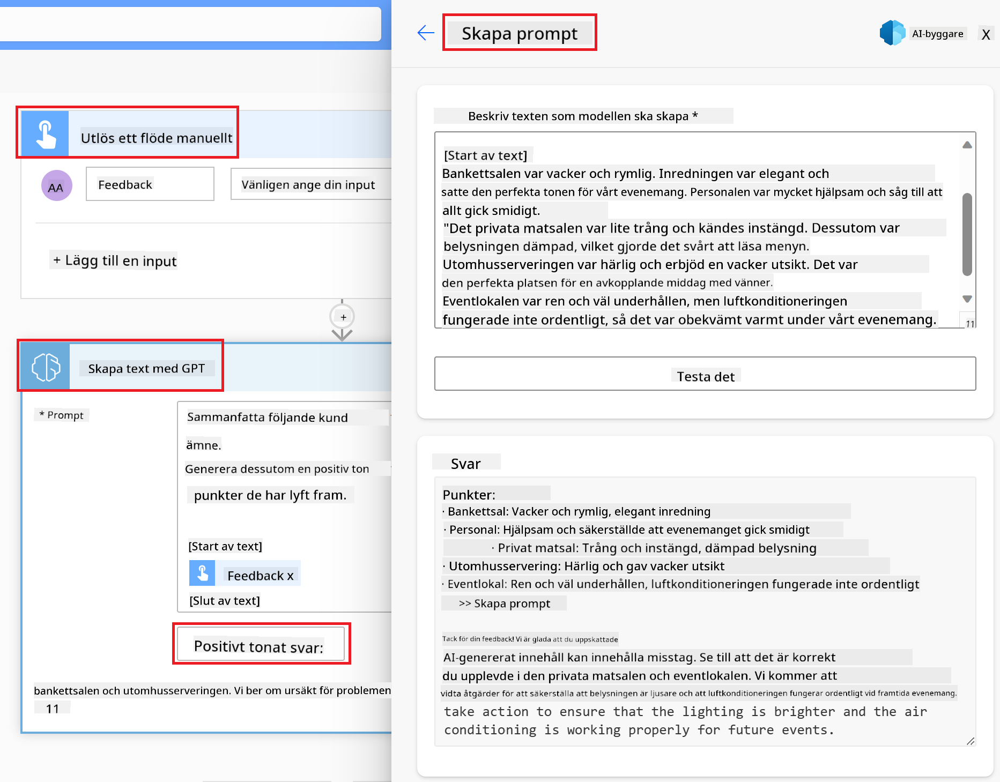

<!--
CO_OP_TRANSLATOR_METADATA:
{
  "original_hash": "846ac8e3b7dcfb697d3309fec05f0fea",
  "translation_date": "2025-10-17T19:02:06+00:00",
  "source_file": "10-building-low-code-ai-applications/README.md",
  "language_code": "sv"
}
-->
# Bygga AI-applikationer med låg kod

> _(Klicka på bilden ovan för att se videon för denna lektion)_

## Introduktion

Nu när vi har lärt oss att bygga applikationer för bildgenerering, låt oss prata om låg kod. Generativ AI kan användas inom en mängd olika områden, inklusive låg kod, men vad är låg kod och hur kan vi integrera AI i det?

Att bygga appar och lösningar har blivit enklare för både traditionella utvecklare och icke-utvecklare genom användning av plattformar för utveckling med låg kod. Dessa plattformar gör det möjligt att skapa appar och lösningar med lite eller ingen kod. Detta uppnås genom att tillhandahålla en visuell utvecklingsmiljö som gör det möjligt att dra och släppa komponenter för att bygga appar och lösningar. Detta gör att du kan bygga appar och lösningar snabbare och med färre resurser. I denna lektion går vi på djupet i hur man använder låg kod och hur man kan förbättra utveckling med låg kod med AI genom Power Platform.

Power Platform ger organisationer möjlighet att ge sina team verktyg för att bygga sina egna lösningar genom en intuitiv miljö med låg kod eller ingen kod. Denna miljö förenklar processen att bygga lösningar. Med Power Platform kan lösningar byggas på dagar eller veckor istället för månader eller år. Power Platform består av fem nyckelprodukter: Power Apps, Power Automate, Power BI, Power Pages och Copilot Studio.

Denna lektion täcker:

- Introduktion till generativ AI i Power Platform
- Introduktion till Copilot och hur man använder det
- Använda generativ AI för att bygga appar och flöden i Power Platform
- Förstå AI-modeller i Power Platform med AI Builder

## Lärandemål

I slutet av denna lektion kommer du att kunna:

- Förstå hur Copilot fungerar i Power Platform.

- Bygga en app för att spåra studentuppgifter för vår utbildningsstartup.

- Skapa ett fakturahanteringsflöde som använder AI för att extrahera information från fakturor.

- Tillämpa bästa praxis vid användning av AI-modellen "Skapa text med GPT".

Verktygen och teknologierna som du kommer att använda i denna lektion är:

- **Power Apps**, för appen Student Assignment Tracker, som tillhandahåller en utvecklingsmiljö med låg kod för att bygga appar för att spåra, hantera och interagera med data.

- **Dataverse**, för att lagra data för appen Student Assignment Tracker där Dataverse tillhandahåller en dataplattform med låg kod för att lagra appens data.

- **Power Automate**, för fakturahanteringsflödet där du kommer att ha en utvecklingsmiljö med låg kod för att bygga arbetsflöden för att automatisera fakturahanteringsprocessen.

- **AI Builder**, för fakturahanteringsmodellen där du kommer att använda förbyggda AI-modeller för att bearbeta fakturorna för vår startup.

## Generativ AI i Power Platform

Att förbättra utveckling och applikationer med låg kod med generativ AI är ett viktigt fokusområde för Power Platform. Målet är att göra det möjligt för alla att bygga AI-drivna appar, webbplatser, dashboards och automatisera processer med AI, _utan att kräva någon expertis inom datavetenskap_. Detta mål uppnås genom att integrera generativ AI i utvecklingsupplevelsen med låg kod i Power Platform i form av Copilot och AI Builder.

### Hur fungerar detta?

Copilot är en AI-assistent som gör det möjligt att bygga lösningar i Power Platform genom att beskriva dina krav i en serie konversationssteg med naturligt språk. Du kan till exempel instruera din AI-assistent att ange vilka fält din app ska använda, och den kommer att skapa både appen och den underliggande datamodellen, eller så kan du specificera hur du ska ställa in ett flöde i Power Automate.

Du kan använda Copilot-drivna funktioner som en del av dina appskärmar för att ge användarna möjlighet att upptäcka insikter genom konversationsinteraktioner.

AI Builder är en AI-funktion med låg kod som finns tillgänglig i Power Platform och som gör det möjligt att använda AI-modeller för att hjälpa dig att automatisera processer och förutsäga resultat. Med AI Builder kan du integrera AI i dina appar och flöden som ansluter till din data i Dataverse eller i olika molndatakällor, såsom SharePoint, OneDrive eller Azure.

Copilot är tillgängligt i alla Power Platform-produkter: Power Apps, Power Automate, Power BI, Power Pages och Power Virtual Agents. AI Builder är tillgängligt i Power Apps och Power Automate. I denna lektion kommer vi att fokusera på hur man använder Copilot och AI Builder i Power Apps och Power Automate för att bygga en lösning för vår utbildningsstartup.

### Copilot i Power Apps

Som en del av Power Platform tillhandahåller Power Apps en utvecklingsmiljö med låg kod för att bygga appar för att spåra, hantera och interagera med data. Det är en uppsättning tjänster för apputveckling med en skalbar dataplattform och möjligheten att ansluta till molntjänster och lokala data. Power Apps gör det möjligt att bygga appar som körs i webbläsare, på surfplattor och telefoner, och kan delas med kollegor. Power Apps förenklar apputveckling med ett enkelt gränssnitt, så att varje affärsanvändare eller professionell utvecklare kan bygga anpassade appar. Apputvecklingsupplevelsen förbättras också med generativ AI genom Copilot.

Copilot AI-assistentfunktionen i Power Apps gör det möjligt att beskriva vilken typ av app du behöver och vilken information du vill att din app ska spåra, samla in eller visa. Copilot genererar sedan en responsiv Canvas-app baserat på din beskrivning. Du kan sedan anpassa appen för att möta dina behov. AI Copilot genererar och föreslår också en Dataverse-tabell med de fält du behöver för att lagra den data du vill spåra och några exempeldata. Vi kommer att titta på vad Dataverse är och hur du kan använda det i Power Apps senare i denna lektion. Du kan sedan anpassa tabellen för att möta dina behov med hjälp av AI Copilot-assistentfunktionen genom konversationssteg. Denna funktion är lätt tillgänglig från Power Apps startsida.

### Copilot i Power Automate

Som en del av Power Platform låter Power Automate användare skapa automatiserade arbetsflöden mellan applikationer och tjänster. Det hjälper till att automatisera repetitiva affärsprocesser såsom kommunikation, datainsamling och godkännande av beslut. Dess enkla gränssnitt gör det möjligt för användare med alla tekniska kompetenser (från nybörjare till erfarna utvecklare) att automatisera arbetsuppgifter. Arbetsflödesutvecklingsupplevelsen förbättras också med generativ AI genom Copilot.

Copilot AI-assistentfunktionen i Power Automate gör det möjligt att beskriva vilken typ av flöde du behöver och vilka åtgärder du vill att ditt flöde ska utföra. Copilot genererar sedan ett flöde baserat på din beskrivning. Du kan sedan anpassa flödet för att möta dina behov. AI Copilot genererar och föreslår också de åtgärder du behöver för att utföra den uppgift du vill automatisera. Vi kommer att titta på vad flöden är och hur du kan använda dem i Power Automate senare i denna lektion. Du kan sedan anpassa åtgärderna för att möta dina behov med hjälp av AI Copilot-assistentfunktionen genom konversationssteg. Denna funktion är lätt tillgänglig från Power Automate startsida.

## Uppgift: Hantera studentuppgifter och fakturor för vår startup med hjälp av Copilot

Vår startup erbjuder onlinekurser till studenter. Företaget har vuxit snabbt och har nu svårt att hålla jämna steg med efterfrågan på sina kurser. Startupen har anställt dig som Power Platform-utvecklare för att hjälpa dem att bygga en lösning med låg kod för att hjälpa dem att hantera sina studentuppgifter och fakturor. Lösningen ska kunna hjälpa dem att spåra och hantera studentuppgifter genom en app och automatisera fakturahanteringsprocessen genom ett arbetsflöde. Du har blivit ombedd att använda generativ AI för att utveckla lösningen.

När du börjar använda Copilot kan du använda [Power Platform Copilot Prompt Library](https://github.com/pnp/powerplatform-prompts?WT.mc_id=academic-109639-somelezediko) för att komma igång med dina prompts. Detta bibliotek innehåller en lista med prompts som du kan använda för att bygga appar och flöden med Copilot. Du kan också använda prompts i biblioteket för att få en idé om hur du ska beskriva dina krav för Copilot.

### Bygg en app för att spåra studentuppgifter för vår startup

Lärarna på vår startup har haft svårt att hålla reda på studentuppgifter. De har använt ett kalkylblad för att spåra uppgifterna, men detta har blivit svårt att hantera eftersom antalet studenter har ökat. De har bett dig att bygga en app som hjälper dem att spåra och hantera studentuppgifter. Appen ska göra det möjligt för dem att lägga till nya uppgifter, visa uppgifter, uppdatera uppgifter och ta bort uppgifter. Appen ska också göra det möjligt för lärare och studenter att se vilka uppgifter som har blivit betygsatta och vilka som inte har blivit betygsatta.

Du kommer att bygga appen med Copilot i Power Apps enligt följande steg:

1. Navigera till [Power Apps](https://make.powerapps.com?WT.mc_id=academic-105485-koreyst) startsida.

1. Använd textområdet på startsidan för att beskriva appen du vill bygga. Till exempel: **_Jag vill bygga en app för att spåra och hantera studentuppgifter_**. Klicka på knappen **Skicka** för att skicka prompten till AI Copilot.

1. AI Copilot kommer att föreslå en Dataverse-tabell med de fält du behöver för att lagra den data du vill spåra och några exempeldata. Du kan sedan anpassa tabellen för att möta dina behov med hjälp av AI Copilot-assistentfunktionen genom konversationssteg.

   > **Viktigt**: Dataverse är den underliggande dataplattformen för Power Platform. Det är en dataplattform med låg kod för att lagra appens data. Det är en fullt hanterad tjänst som lagrar data säkert i Microsoft Cloud och provisioneras inom din Power Platform-miljö. Den har inbyggda funktioner för datastyrning, såsom dataklassificering, datahärkomst, finfördelad åtkomstkontroll och mer. Du kan läsa mer om Dataverse [här](https://docs.microsoft.com/powerapps/maker/data-platform/data-platform-intro?WT.mc_id=academic-109639-somelezediko).

   

1. Lärarna vill skicka e-post till de studenter som har lämnat in sina uppgifter för att hålla dem uppdaterade om deras uppgifter. Du kan använda Copilot för att lägga till ett nytt fält i tabellen för att lagra studentens e-postadress. Till exempel kan du använda följande prompt för att lägga till ett nytt fält i tabellen: **_Jag vill lägga till en kolumn för att lagra studentens e-postadress_**. Klicka på knappen **Skicka** för att skicka prompten till AI Copilot.

1. AI Copilot kommer att generera ett nytt fält och du kan sedan anpassa fältet för att möta dina behov.

1. När du är klar med tabellen, klicka på knappen **Skapa app** för att skapa appen.

1. AI Copilot kommer att generera en responsiv Canvas-app baserat på din beskrivning. Du kan sedan anpassa appen för att möta dina behov.

1. För att lärare ska kunna skicka e-post till studenter kan du använda Copilot för att lägga till en ny skärm i appen. Till exempel kan du använda följande prompt för att lägga till en ny skärm i appen: **_Jag vill lägga till en skärm för att skicka e-post till studenter_**. Klicka på knappen **Skicka** för att skicka prompten till AI Copilot.

1. AI Copilot kommer att generera en ny skärm och du kan sedan anpassa skärmen för att möta dina behov.

1. När du är klar med appen, klicka på knappen **Spara** för att spara appen.

1. För att dela appen med lärarna, klicka på knappen **Dela** och klicka sedan på knappen **Dela** igen. Du kan sedan dela appen med lärarna genom att ange deras e-postadresser.

> **Din hemläxa**: Appen du just byggde är en bra start men kan förbättras. Med e-postfunktionen kan lärare endast skicka e-post till studenter manuellt genom att behöva skriva deras e-postadresser. Kan du använda Copilot för att bygga en automatisering som gör det möjligt för lärare att skicka e-post till studenter automatiskt när de lämnar in sina uppgifter? Din ledtråd är att med rätt prompt kan du använda Copilot i Power Automate för att bygga detta.

### Bygg en fakturainformationstabell för vår startup

Ekonomiteamet på vår startup har haft svårt att hålla reda på fakturor. De har använt ett kalkylblad för att spåra fakturorna, men detta har blivit svårt att hantera eftersom antalet fakturor har ökat. De har bett dig att bygga en tabell som hjälper dem att lagra, spåra och hantera informationen om de fakturor de har mottagit. Tabellen ska användas för att bygga en automatisering som kommer att extrahera all fakturainformation och lagra den i tabellen. Tabellen ska också göra det möjligt för ekonomiteamet att se vilka fakturor som har blivit betalda och vilka som inte har blivit betalda.

Power Platform har en underliggande dataplattform som heter Dataverse som gör det möjligt att lagra data för dina appar och lösningar. Dataverse tillhandahåller en dataplattform med låg kod för att lagra appens data. Det är en fullt hanterad tjänst som lagrar data säkert i Microsoft Cloud och provisioneras inom din Power Platform-miljö. Den har inbyggda funktioner för datastyrning, såsom dataklassificering, datahärkomst, finfördelad åtkomstkontroll och mer. Du kan läsa mer [om Dataverse här](https://docs.microsoft.com/powerapps/maker/data-platform/data-platform-intro?WT.mc_id=academic-109639-somelezediko).
Varför ska vi använda Dataverse för vår startup? Standard- och anpassade tabeller inom Dataverse erbjuder ett säkert och molnbaserat lagringsalternativ för din data. Tabeller låter dig lagra olika typer av data, ungefär som du kan använda flera kalkylblad i en enda Excel-arbetsbok. Du kan använda tabeller för att lagra data som är specifik för din organisation eller dina affärsbehov. Några av fördelarna vår startup får genom att använda Dataverse inkluderar, men är inte begränsade till:

- **Lätt att hantera**: Både metadata och data lagras i molnet, så du behöver inte oroa dig för detaljerna kring hur de lagras eller hanteras. Du kan fokusera på att bygga dina appar och lösningar.

- **Säkert**: Dataverse erbjuder ett säkert och molnbaserat lagringsalternativ för din data. Du kan kontrollera vem som har åtkomst till data i dina tabeller och hur de kan komma åt den med hjälp av rollbaserad säkerhet.

- **Rik metadata**: Datatyper och relationer används direkt inom Power Apps.

- **Logik och validering**: Du kan använda affärsregler, beräknade fält och valideringsregler för att upprätthålla affärslogik och säkerställa datakvalitet.

Nu när du vet vad Dataverse är och varför du bör använda det, låt oss titta på hur du kan använda Copilot för att skapa en tabell i Dataverse som uppfyller kraven från vårt ekonomiteam.

> **Note** : Du kommer att använda denna tabell i nästa avsnitt för att bygga en automatisering som kommer att extrahera all fakturainformation och lagra den i tabellen.

För att skapa en tabell i Dataverse med Copilot, följ stegen nedan:

1. Navigera till [Power Apps](https://make.powerapps.com?WT.mc_id=academic-105485-koreyst) startsida.

2. På den vänstra navigeringsmenyn, välj **Tables** och klicka sedan på **Describe the new Table**.

3. På skärmen **Describe the new Table**, använd textfältet för att beskriva tabellen du vill skapa. Till exempel, **_Jag vill skapa en tabell för att lagra fakturainformation_**. Klicka på **Send**-knappen för att skicka prompten till AI Copilot.

4. AI Copilot kommer att föreslå en Dataverse-tabell med de fält du behöver för att lagra den data du vill spåra och ge exempeldata. Du kan sedan anpassa tabellen efter dina behov med hjälp av AI Copilot-assistenten genom konversationssteg.

5. Ekonomiteamet vill skicka ett e-postmeddelande till leverantören för att uppdatera dem om den aktuella statusen för deras faktura. Du kan använda Copilot för att lägga till ett nytt fält i tabellen för att lagra leverantörens e-postadress. Till exempel kan du använda följande prompt för att lägga till ett nytt fält i tabellen: **_Jag vill lägga till en kolumn för att lagra leverantörens e-postadress_**. Klicka på **Send**-knappen för att skicka prompten till AI Copilot.

6. AI Copilot kommer att generera ett nytt fält och du kan sedan anpassa fältet efter dina behov.

7. När du är klar med tabellen, klicka på **Create**-knappen för att skapa tabellen.

## AI-modeller i Power Platform med AI Builder

AI Builder är en lågkodad AI-funktion som finns tillgänglig i Power Platform och som gör det möjligt för dig att använda AI-modeller för att automatisera processer och förutsäga resultat. Med AI Builder kan du integrera AI i dina appar och flöden som ansluter till din data i Dataverse eller i olika molndatakällor, såsom SharePoint, OneDrive eller Azure.

## Förbyggda AI-modeller vs Anpassade AI-modeller

AI Builder erbjuder två typer av AI-modeller: Förbyggda AI-modeller och Anpassade AI-modeller. Förbyggda AI-modeller är färdiga att använda och tränade av Microsoft, tillgängliga i Power Platform. Dessa hjälper dig att lägga till intelligens i dina appar och flöden utan att behöva samla in data och sedan bygga, träna och publicera dina egna modeller. Du kan använda dessa modeller för att automatisera processer och förutsäga resultat.

Några av de förbyggda AI-modellerna som finns tillgängliga i Power Platform inkluderar:

- **Nyckelfrasutvinning**: Denna modell extraherar nyckelfraser från text.
- **Språkdetektering**: Denna modell identifierar språket i en text.
- **Sentimentanalys**: Denna modell identifierar positiv, negativ, neutral eller blandad känsla i text.
- **Visitkortsläsare**: Denna modell extraherar information från visitkort.
- **Textigenkänning**: Denna modell extraherar text från bilder.
- **Objektigenkänning**: Denna modell identifierar och extraherar objekt från bilder.
- **Dokumentbearbetning**: Denna modell extraherar information från formulär.
- **Fakturabearbetning**: Denna modell extraherar information från fakturor.

Med Anpassade AI-modeller kan du ta med din egen modell till AI Builder så att den kan fungera som vilken AI Builder-anpassad modell som helst, vilket gör det möjligt att träna modellen med din egen data. Du kan använda dessa modeller för att automatisera processer och förutsäga resultat i både Power Apps och Power Automate. När du använder din egen modell finns det begränsningar som gäller. Läs mer om dessa [begränsningar](https://learn.microsoft.com/ai-builder/byo-model#limitations?WT.mc_id=academic-105485-koreyst).

## Uppgift #2 - Bygg ett fakturabearbetningsflöde för vår startup

Ekonomiteamet har haft svårt att bearbeta fakturor. De har använt ett kalkylblad för att spåra fakturorna, men detta har blivit svårt att hantera eftersom antalet fakturor har ökat. De har bett dig att bygga ett arbetsflöde som hjälper dem att bearbeta fakturor med hjälp av AI. Arbetsflödet ska göra det möjligt för dem att extrahera information från fakturor och lagra informationen i en Dataverse-tabell. Arbetsflödet ska också göra det möjligt för dem att skicka ett e-postmeddelande till ekonomiteamet med den extraherade informationen.

Nu när du vet vad AI Builder är och varför du bör använda det, låt oss titta på hur du kan använda fakturabearbetningsmodellen i AI Builder, som vi täckte tidigare, för att bygga ett arbetsflöde som hjälper ekonomiteamet att bearbeta fakturor.

För att bygga ett arbetsflöde som hjälper ekonomiteamet att bearbeta fakturor med hjälp av fakturabearbetningsmodellen i AI Builder, följ stegen nedan:

1. Navigera till [Power Automate](https://make.powerautomate.com?WT.mc_id=academic-105485-koreyst) startsida.

2. Använd textfältet på startsidan för att beskriva arbetsflödet du vill bygga. Till exempel, **_Bearbeta en faktura när den anländer i min inkorg_**. Klicka på **Send**-knappen för att skicka prompten till AI Copilot.

   

3. AI Copilot kommer att föreslå de åtgärder du behöver för att utföra den uppgift du vill automatisera. Du kan klicka på **Next**-knappen för att gå igenom nästa steg.

4. I nästa steg kommer Power Automate att be dig att ställa in de anslutningar som krävs för flödet. När du är klar, klicka på **Create flow**-knappen för att skapa flödet.

5. AI Copilot kommer att generera ett flöde och du kan sedan anpassa flödet efter dina behov.

6. Uppdatera flödets trigger och ställ in **Folder** till mappen där fakturorna kommer att lagras. Till exempel kan du ställa in mappen till **Inbox**. Klicka på **Show advanced options** och ställ in **Only with Attachments** till **Yes**. Detta säkerställer att flödet endast körs när ett e-postmeddelande med en bilaga tas emot i mappen.

7. Ta bort följande åtgärder från flödet: **HTML to text**, **Compose**, **Compose 2**, **Compose 3** och **Compose 4** eftersom du inte kommer att använda dem.

8. Ta bort åtgärden **Condition** från flödet eftersom du inte kommer att använda den. Det bör se ut som följande skärmdump:

   

9. Klicka på **Add an action**-knappen och sök efter **Dataverse**. Välj åtgärden **Add a new row**.

10. På åtgärden **Extract Information from invoices**, uppdatera **Invoice File** för att peka på **Attachment Content** från e-postmeddelandet. Detta säkerställer att flödet extraherar information från fakturabilagan.

11. Välj den **Table** du skapade tidigare. Till exempel kan du välja tabellen **Invoice Information**. Välj det dynamiska innehållet från den tidigare åtgärden för att fylla i följande fält:

    - ID
    - Amount
    - Date
    - Name
    - Status - Ställ in **Status** till **Pending**.
    - Supplier Email - Använd det dynamiska innehållet **From** från triggern **When a new email arrives**.

    

12. När du är klar med flödet, klicka på **Save**-knappen för att spara flödet. Du kan sedan testa flödet genom att skicka ett e-postmeddelande med en faktura till den mapp du angav i triggern.

> **Din hemläxa**: Flödet du just byggde är en bra start, nu behöver du fundera på hur du kan bygga en automatisering som gör det möjligt för vårt ekonomiteam att skicka ett e-postmeddelande till leverantören för att uppdatera dem om den aktuella statusen för deras faktura. Din ledtråd: flödet måste köras när fakturans status ändras.

## Använd en textgenererande AI-modell i Power Automate

Modellen Create Text with GPT i AI Builder gör det möjligt att generera text baserat på en prompt och drivs av Microsoft Azure OpenAI Service. Med denna funktion kan du integrera GPT (Generative Pre-Trained Transformer)-teknologi i dina appar och flöden för att bygga en mängd automatiserade flöden och insiktsfulla applikationer.

GPT-modeller genomgår omfattande träning på stora mängder data, vilket gör det möjligt för dem att producera text som liknar mänskligt språk när de får en prompt. När de integreras med arbetsflödesautomatisering kan AI-modeller som GPT utnyttjas för att effektivisera och automatisera en mängd olika uppgifter.

Till exempel kan du bygga flöden för att automatiskt generera text för olika användningsområden, såsom: utkast till e-postmeddelanden, produktbeskrivningar och mer. Du kan också använda modellen för att generera text för olika appar, såsom chattbotar och kundtjänstapplikationer som gör det möjligt för kundtjänstagenter att svara effektivt och snabbt på kundförfrågningar.

För att lära dig hur du använder denna AI-modell i Power Automate, gå igenom modulen [Lägg till intelligens med AI Builder och GPT](https://learn.microsoft.com/training/modules/ai-builder-text-generation/?WT.mc_id=academic-109639-somelezediko).

## Bra jobbat! Fortsätt din inlärning

Efter att ha avslutat denna lektion, kolla in vår [Generative AI Learning collection](https://aka.ms/genai-collection?WT.mc_id=academic-105485-koreyst) för att fortsätta utveckla din kunskap om generativ AI!

Gå vidare till Lektion 11 där vi kommer att titta på hur man [integrerar generativ AI med funktionell anrop](../11-integrating-with-function-calling/README.md?WT.mc_id=academic-105485-koreyst)!

---

**Ansvarsfriskrivning**:  
Detta dokument har översatts med hjälp av AI-översättningstjänsten [Co-op Translator](https://github.com/Azure/co-op-translator). Även om vi strävar efter noggrannhet, bör det noteras att automatiserade översättningar kan innehålla fel eller felaktigheter. Det ursprungliga dokumentet på dess ursprungliga språk bör betraktas som den auktoritativa källan. För kritisk information rekommenderas professionell mänsklig översättning. Vi ansvarar inte för eventuella missförstånd eller feltolkningar som uppstår vid användning av denna översättning.