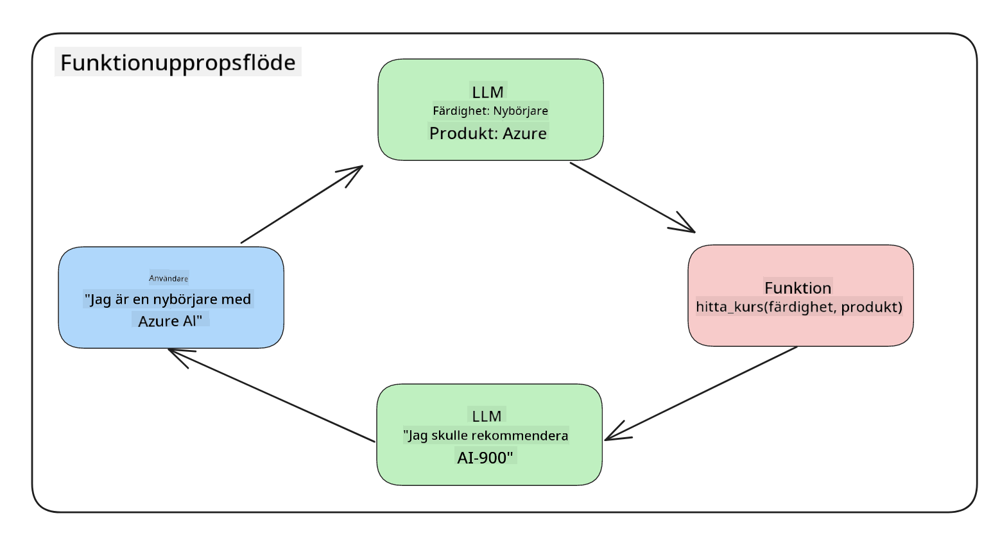
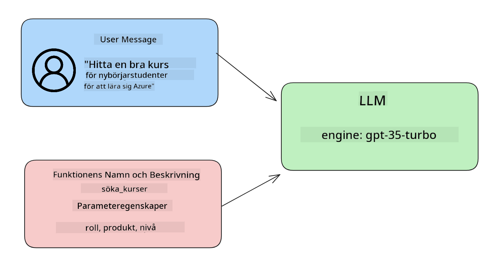

<!--
CO_OP_TRANSLATOR_METADATA:
{
  "original_hash": "77a48a201447be19aa7560706d6f93a0",
  "translation_date": "2025-05-19T21:30:32+00:00",
  "source_file": "11-integrating-with-function-calling/README.md",
  "language_code": "sv"
}
-->
# Integrera med funktionsanrop

[](https://aka.ms/gen-ai-lesson11-gh?WT.mc_id=academic-105485-koreyst)

Du har lärt dig en hel del hittills i de tidigare lektionerna. Men vi kan förbättra oss ytterligare. Några saker vi kan ta itu med är hur vi kan få ett mer konsekvent svarformat för att göra det lättare att arbeta med svaret längre fram. Dessutom kanske vi vill lägga till data från andra källor för att ytterligare berika vår applikation.

De ovan nämnda problemen är vad detta kapitel syftar till att ta itu med.

## Introduktion

Denna lektion kommer att täcka:

- Förklara vad funktionsanrop är och dess användningsområden.
- Skapa ett funktionsanrop med Azure OpenAI.
- Hur man integrerar ett funktionsanrop i en applikation.

## Lärandemål

I slutet av denna lektion kommer du att kunna:

- Förklara syftet med att använda funktionsanrop.
- Ställa in Funktionsanrop med Azure OpenAI-tjänsten.
- Designa effektiva funktionsanrop för din applikations användningsfall.

## Scenario: Förbättra vår chatbot med funktioner

För denna lektion vill vi bygga en funktion för vår utbildningsstart som tillåter användare att använda en chatbot för att hitta tekniska kurser. Vi kommer att rekommendera kurser som passar deras kompetensnivå, nuvarande roll och teknikintresse.

För att slutföra detta scenario kommer vi att använda en kombination av:

- `Azure OpenAI` för att skapa en chattupplevelse för användaren.
- `Microsoft Learn Catalog API` för att hjälpa användare att hitta kurser baserat på användarens begäran.
- `Function Calling` för att ta användarens fråga och skicka den till en funktion för att göra API-begäran.

För att komma igång, låt oss titta på varför vi överhuvudtaget skulle vilja använda funktionsanrop:

## Varför Funktionsanrop

Innan funktionsanrop var svaren från en LLM ostrukturerade och inkonsekventa. Utvecklare var tvungna att skriva komplex valideringskod för att säkerställa att de kunde hantera varje variation av ett svar. Användare kunde inte få svar som "Vad är vädret just nu i Stockholm?". Detta beror på att modeller var begränsade till den tidpunkt då datan tränades.

Funktionsanrop är en funktion i Azure OpenAI-tjänsten för att övervinna följande begränsningar:

- **Konsekvent svarformat**. Om vi kan bättre kontrollera svarformatet kan vi lättare integrera svaret längre fram i andra system.
- **Extern data**. Möjlighet att använda data från andra källor av en applikation i en chattkontext.

## Illustrera problemet genom ett scenario

> Vi rekommenderar att du använder den [inkluderade notebook](../../../11-integrating-with-function-calling/python/aoai-assignment.ipynb) om du vill köra scenariot nedan. Du kan också bara läsa vidare eftersom vi försöker illustrera ett problem där funktioner kan hjälpa till att lösa problemet.

Låt oss titta på exemplet som illustrerar problemet med svarformat:

Låt oss säga att vi vill skapa en databas med studentdata så att vi kan föreslå rätt kurs för dem. Nedan har vi två beskrivningar av studenter som är mycket lika i den data de innehåller.

1. Skapa en anslutning till vår Azure OpenAI-resurs:

   ```python
   import os
   import json
   from openai import AzureOpenAI
   from dotenv import load_dotenv
   load_dotenv()

   client = AzureOpenAI(
   api_key=os.environ['AZURE_OPENAI_API_KEY'],  # this is also the default, it can be omitted
   api_version = "2023-07-01-preview"
   )

   deployment=os.environ['AZURE_OPENAI_DEPLOYMENT']
   ```

   Nedan är lite Python-kod för att konfigurera vår anslutning till Azure OpenAI där vi ställer in `api_type`, `api_base`, `api_version` and `api_key`.

1. Creating two student descriptions using variables `student_1_description` and `student_2_description`.

   ```python
   student_1_description="Emily Johnson is a sophomore majoring in computer science at Duke University. She has a 3.7 GPA. Emily is an active member of the university's Chess Club and Debate Team. She hopes to pursue a career in software engineering after graduating."

   student_2_description = "Michael Lee is a sophomore majoring in computer science at Stanford University. He has a 3.8 GPA. Michael is known for his programming skills and is an active member of the university's Robotics Club. He hopes to pursue a career in artificial intelligence after finishing his studies."
   ```

   Vi vill skicka de ovanstående studentbeskrivningarna till en LLM för att analysera datan. Denna data kan senare användas i vår applikation och skickas till ett API eller lagras i en databas.

1. Låt oss skapa två identiska uppmaningar där vi instruerar LLM om vilken information vi är intresserade av:

   ```python
   prompt1 = f'''
   Please extract the following information from the given text and return it as a JSON object:

   name
   major
   school
   grades
   club

   This is the body of text to extract the information from:
   {student_1_description}
   '''

   prompt2 = f'''
   Please extract the following information from the given text and return it as a JSON object:

   name
   major
   school
   grades
   club

   This is the body of text to extract the information from:
   {student_2_description}
   '''
   ```

   De ovanstående uppmaningarna instruerar LLM att extrahera information och returnera svaret i JSON-format.

1. Efter att ha ställt in uppmaningarna och anslutningen till Azure OpenAI, kommer vi nu att skicka uppmaningarna till LLM genom att använda `openai.ChatCompletion`. We store the prompt in the `messages` variable and assign the role to `user`. Detta är för att efterlikna ett meddelande från en användare som skrivs till en chatbot.

   ```python
   # response from prompt one
   openai_response1 = client.chat.completions.create(
   model=deployment,
   messages = [{'role': 'user', 'content': prompt1}]
   )
   openai_response1.choices[0].message.content

   # response from prompt two
   openai_response2 = client.chat.completions.create(
   model=deployment,
   messages = [{'role': 'user', 'content': prompt2}]
   )
   openai_response2.choices[0].message.content
   ```

Nu kan vi skicka båda förfrågningarna till LLM och undersöka svaret vi får genom att hitta det så här `openai_response1['choices'][0]['message']['content']`.

1. Lastly, we can convert the response to JSON format by calling `json.loads`:

   ```python
   # Loading the response as a JSON object
   json_response1 = json.loads(openai_response1.choices[0].message.content)
   json_response1
   ```

   Svar 1:

   ```json
   {
     "name": "Emily Johnson",
     "major": "computer science",
     "school": "Duke University",
     "grades": "3.7",
     "club": "Chess Club"
   }
   ```

   Svar 2:

   ```json
   {
     "name": "Michael Lee",
     "major": "computer science",
     "school": "Stanford University",
     "grades": "3.8 GPA",
     "club": "Robotics Club"
   }
   ```

   Även om uppmaningarna är desamma och beskrivningarna är liknande, ser vi värden på `Grades` property formatted differently, as we can sometimes get the format `3.7` or `3.7 GPA` for example.

   This result is because the LLM takes unstructured data in the form of the written prompt and returns also unstructured data. We need to have a structured format so that we know what to expect when storing or using this data

So how do we solve the formatting problem then? By using functional calling, we can make sure that we receive structured data back. When using function calling, the LLM does not actually call or run any functions. Instead, we create a structure for the LLM to follow for its responses. We then use those structured responses to know what function to run in our applications.



We can then take what is returned from the function and send this back to the LLM. The LLM will then respond using natural language to answer the user's query.

## Use Cases for using function calls

There are many different use cases where function calls can improve your app like:

- **Calling External Tools**. Chatbots are great at providing answers to questions from users. By using function calling, the chatbots can use messages from users to complete certain tasks. For example, a student can ask the chatbot to "Send an email to my instructor saying I need more assistance with this subject". This can make a function call to `send_email(to: string, body: string)`

- **Create API or Database Queries**. Users can find information using natural language that gets converted into a formatted query or API request. An example of this could be a teacher who requests "Who are the students that completed the last assignment" which could call a function named `get_completed(student_name: string, assignment: int, current_status: string)`

- **Creating Structured Data**. Users can take a block of text or CSV and use the LLM to extract important information from it. For example, a student can convert a Wikipedia article about peace agreements to create AI flashcards. This can be done by using a function called `get_important_facts(agreement_name: string, date_signed: string, parties_involved: list)`

## Creating Your First Function Call

The process of creating a function call includes 3 main steps:

1. **Calling** the Chat Completions API with a list of your functions and a user message.
2. **Reading** the model's response to perform an action i.e. execute a function or API Call.
3. **Making** another call to Chat Completions API with the response from your function to use that information to create a response to the user.



### Step 1 - creating messages

The first step is to create a user message. This can be dynamically assigned by taking the value of a text input or you can assign a value here. If this is your first time working with the Chat Completions API, we need to define the `role` and the `content` of the message.

The `role` can be either `system` (creating rules), `assistant` (the model) or `user` (the end-user). For function calling, we will assign this as `user` och en exempel fråga.

```python
messages= [ {"role": "user", "content": "Find me a good course for a beginner student to learn Azure."} ]
```

Genom att tilldela olika roller blir det tydligt för LLM om det är systemet som säger något eller användaren, vilket hjälper till att bygga en konversationshistorik som LLM kan bygga vidare på.

### Steg 2 - skapa funktioner

Nästa steg är att definiera en funktion och parametrarna för den funktionen. Vi kommer att använda bara en funktion här som heter `search_courses` but you can create multiple functions.

> **Important** : Functions are included in the system message to the LLM and will be included in the amount of available tokens you have available.

Below, we create the functions as an array of items. Each item is a function and has properties `name`, `description` and `parameters`:

```python
functions = [
   {
      "name":"search_courses",
      "description":"Retrieves courses from the search index based on the parameters provided",
      "parameters":{
         "type":"object",
         "properties":{
            "role":{
               "type":"string",
               "description":"The role of the learner (i.e. developer, data scientist, student, etc.)"
            },
            "product":{
               "type":"string",
               "description":"The product that the lesson is covering (i.e. Azure, Power BI, etc.)"
            },
            "level":{
               "type":"string",
               "description":"The level of experience the learner has prior to taking the course (i.e. beginner, intermediate, advanced)"
            }
         },
         "required":[
            "role"
         ]
      }
   }
]
```

Låt oss beskriva varje funktionsinstans mer i detalj nedan:

- `name` - The name of the function that we want to have called.
- `description` - This is the description of how the function works. Here it's important to be specific and clear.
- `parameters` - A list of values and format that you want the model to produce in its response. The parameters array consists of items where the items have the following properties:
  1.  `type` - The data type of the properties will be stored in.
  1.  `properties` - List of the specific values that the model will use for its response
      1. `name` - The key is the name of the property that the model will use in its formatted response, for example, `product`.
      1. `type` - The data type of this property, for example, `string`.
      1. `description` - Description of the specific property.

There's also an optional property `required` - required property for the function call to be completed.

### Step 3 - Making the function call

After defining a function, we now need to include it in the call to the Chat Completion API. We do this by adding `functions` to the request. In this case `functions=functions`.

There is also an option to set `function_call` to `auto`. This means we will let the LLM decide which function should be called based on the user message rather than assigning it ourselves.

Here's some code below where we call `ChatCompletion.create`, note how we set `functions=functions` and `function_call="auto"` och därmed ge LLM valet när den ska anropa de funktioner vi tillhandahåller:

```python
response = client.chat.completions.create(model=deployment,
                                        messages=messages,
                                        functions=functions,
                                        function_call="auto")

print(response.choices[0].message)
```

Svaret som kommer tillbaka ser nu ut så här:

```json
{
  "role": "assistant",
  "function_call": {
    "name": "search_courses",
    "arguments": "{\n  \"role\": \"student\",\n  \"product\": \"Azure\",\n  \"level\": \"beginner\"\n}"
  }
}
```

Här kan vi se hur funktionen `search_courses` was called and with what arguments, as listed in the `arguments` property in the JSON response.

The conclusion the LLM was able to find the data to fit the arguments of the function as it was extracting it from the value provided to the `messages` parameter in the chat completion call. Below is a reminder of the `messages` värde:

```python
messages= [ {"role": "user", "content": "Find me a good course for a beginner student to learn Azure."} ]
```

Som du kan se, `student`, `Azure` and `beginner` was extracted from `messages` and set as input to the function. Using functions this way is a great way to extract information from a prompt but also to provide structure to the LLM and have reusable functionality.

Next, we need to see how we can use this in our app.

## Integrating Function Calls into an Application

After we have tested the formatted response from the LLM, we can now integrate this into an application.

### Managing the flow

To integrate this into our application, let's take the following steps:

1. First, let's make the call to the OpenAI services and store the message in a variable called `response_message`.

   ```python
   response_message = response.choices[0].message
   ```

1. Nu kommer vi att definiera funktionen som kommer att anropa Microsoft Learn API för att få en lista över kurser:

   ```python
   import requests

   def search_courses(role, product, level):
     url = "https://learn.microsoft.com/api/catalog/"
     params = {
        "role": role,
        "product": product,
        "level": level
     }
     response = requests.get(url, params=params)
     modules = response.json()["modules"]
     results = []
     for module in modules[:5]:
        title = module["title"]
        url = module["url"]
        results.append({"title": title, "url": url})
     return str(results)
   ```

   Notera hur vi nu skapar en faktisk Python-funktion som mappar till funktionsnamnen som introducerades i `functions` variable. We're also making real external API calls to fetch the data we need. In this case, we go against the Microsoft Learn API to search for training modules.

Ok, so we created `functions` variables and a corresponding Python function, how do we tell the LLM how to map these two together so our Python function is called?

1. To see if we need to call a Python function, we need to look into the LLM response and see if `function_call` är en del av det och anropa den angivna funktionen. Här är hur du kan göra den nämnda kontrollen nedan:

   ```python
   # Check if the model wants to call a function
   if response_message.function_call.name:
    print("Recommended Function call:")
    print(response_message.function_call.name)
    print()

    # Call the function.
    function_name = response_message.function_call.name

    available_functions = {
            "search_courses": search_courses,
    }
    function_to_call = available_functions[function_name]

    function_args = json.loads(response_message.function_call.arguments)
    function_response = function_to_call(**function_args)

    print("Output of function call:")
    print(function_response)
    print(type(function_response))


    # Add the assistant response and function response to the messages
    messages.append( # adding assistant response to messages
        {
            "role": response_message.role,
            "function_call": {
                "name": function_name,
                "arguments": response_message.function_call.arguments,
            },
            "content": None
        }
    )
    messages.append( # adding function response to messages
        {
            "role": "function",
            "name": function_name,
            "content":function_response,
        }
    )
   ```

   Dessa tre rader säkerställer att vi extraherar funktionsnamnet, argumenten och gör anropet:

   ```python
   function_to_call = available_functions[function_name]

   function_args = json.loads(response_message.function_call.arguments)
   function_response = function_to_call(**function_args)
   ```

   Nedan är resultatet från att köra vår kod:

   **Resultat**

   ```Recommended Function call:
   {
     "name": "search_courses",
     "arguments": "{\n  \"role\": \"student\",\n  \"product\": \"Azure\",\n  \"level\": \"beginner\"\n}"
   }

   Output of function call:
   [{'title': 'Describe concepts of cryptography', 'url': 'https://learn.microsoft.com/training/modules/describe-concepts-of-cryptography/?
   WT.mc_id=api_CatalogApi'}, {'title': 'Introduction to audio classification with TensorFlow', 'url': 'https://learn.microsoft.com/en-
   us/training/modules/intro-audio-classification-tensorflow/?WT.mc_id=api_CatalogApi'}, {'title': 'Design a Performant Data Model in Azure SQL
   Database with Azure Data Studio', 'url': 'https://learn.microsoft.com/training/modules/design-a-data-model-with-ads/?
   WT.mc_id=api_CatalogApi'}, {'title': 'Getting started with the Microsoft Cloud Adoption Framework for Azure', 'url':
   'https://learn.microsoft.com/training/modules/cloud-adoption-framework-getting-started/?WT.mc_id=api_CatalogApi'}, {'title': 'Set up the
   Rust development environment', 'url': 'https://learn.microsoft.com/training/modules/rust-set-up-environment/?WT.mc_id=api_CatalogApi'}]
   <class 'str'>
   ```

1. Nu kommer vi att skicka det uppdaterade meddelandet, `messages` till LLM så att vi kan få ett svar i naturligt språk istället för ett API JSON-format svar.

   ```python
   print("Messages in next request:")
   print(messages)
   print()

   second_response = client.chat.completions.create(
      messages=messages,
      model=deployment,
      function_call="auto",
      functions=functions,
      temperature=0
         )  # get a new response from GPT where it can see the function response


   print(second_response.choices[0].message)
   ```

   **Resultat**

   ```python
   {
     "role": "assistant",
     "content": "I found some good courses for beginner students to learn Azure:\n\n1. [Describe concepts of cryptography] (https://learn.microsoft.com/training/modules/describe-concepts-of-cryptography/?WT.mc_id=api_CatalogApi)\n2. [Introduction to audio classification with TensorFlow](https://learn.microsoft.com/training/modules/intro-audio-classification-tensorflow/?WT.mc_id=api_CatalogApi)\n3. [Design a Performant Data Model in Azure SQL Database with Azure Data Studio](https://learn.microsoft.com/training/modules/design-a-data-model-with-ads/?WT.mc_id=api_CatalogApi)\n4. [Getting started with the Microsoft Cloud Adoption Framework for Azure](https://learn.microsoft.com/training/modules/cloud-adoption-framework-getting-started/?WT.mc_id=api_CatalogApi)\n5. [Set up the Rust development environment](https://learn.microsoft.com/training/modules/rust-set-up-environment/?WT.mc_id=api_CatalogApi)\n\nYou can click on the links to access the courses."
   }

   ```

## Uppgift

För att fortsätta din inlärning av Azure OpenAI Funktionsanrop kan du bygga:

- Fler parametrar för funktionen som kan hjälpa elever att hitta fler kurser.
- Skapa ett annat funktionsanrop som tar mer information från eleven som deras modersmål.
- Skapa felhantering när funktionsanropet och/eller API-anropet inte returnerar några lämpliga kurser.

Tips: Följ [Learn API-referensdokumentationen](https://learn.microsoft.com/training/support/catalog-api-developer-reference?WT.mc_id=academic-105485-koreyst) sidan för att se hur och var denna data är tillgänglig.

## Bra jobbat! Fortsätt resan

Efter att ha slutfört denna lektion, kolla in vår [Generative AI Learning-samling](https://aka.ms/genai-collection?WT.mc_id=academic-105485-koreyst) för att fortsätta höja din kunskap om Generativ AI!

Gå vidare till Lektion 12, där vi kommer att titta på hur man [designar UX för AI-applikationer](../12-designing-ux-for-ai-applications/README.md?WT.mc_id=academic-105485-koreyst)!

**Ansvarsfriskrivning**:  
Detta dokument har översatts med hjälp av AI-översättningstjänsten [Co-op Translator](https://github.com/Azure/co-op-translator). Vi strävar efter noggrannhet, men var medveten om att automatiserade översättningar kan innehålla fel eller felaktigheter. Det ursprungliga dokumentet på dess modersmål bör betraktas som den auktoritativa källan. För kritisk information rekommenderas professionell mänsklig översättning. Vi ansvarar inte för missförstånd eller feltolkningar som uppstår vid användning av denna översättning.