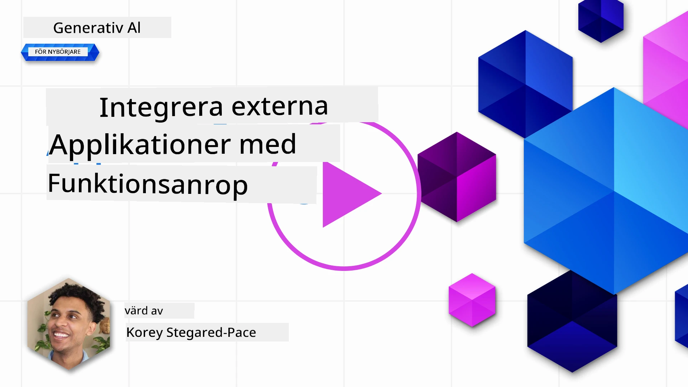
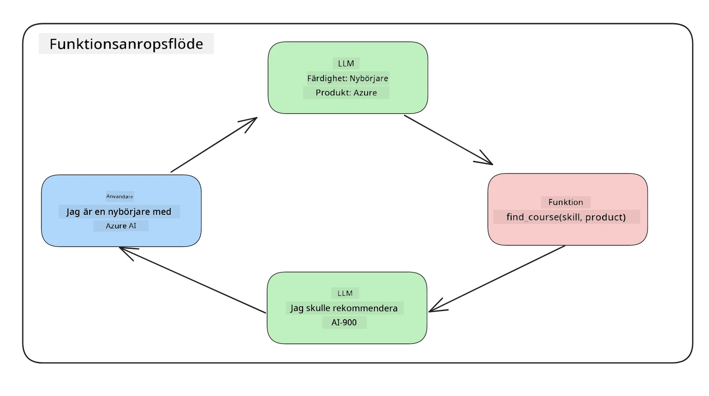
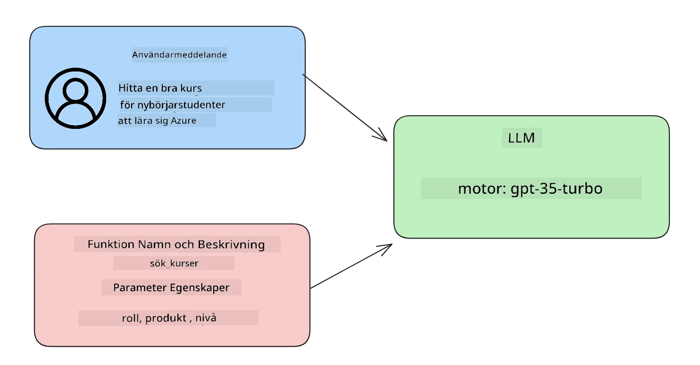

# Integrering med funktionsanrop

[](https://youtu.be/DgUdCLX8qYQ?si=f1ouQU5HQx6F8Gl2)

Du har lärt dig ganska mycket hittills i de tidigare lektionerna. Dock kan vi förbättra oss ytterligare. Några saker vi kan ta itu med är hur vi kan få ett mer konsekvent svarformat för att göra det enklare att arbeta med svaret längre fram. Dessutom kanske vi vill lägga till data från andra källor för att ytterligare berika vår applikation.

De ovan nämnda problemen är vad detta kapitel försöker adressera.

## Introduktion

Den här lektionen kommer att täcka:

- Förklara vad funktionsanrop är och dess användningsområden.
- Skapa ett funktionsanrop med Azure OpenAI.
- Hur man integrerar ett funktionsanrop i en applikation.

## Lärandemål

I slutet av denna lektion kommer du att kunna:

- Förklara syftet med att använda funktionsanrop.
- Konfigurera Funktionsanrop med Azure OpenAI-tjänsten.
- Designa effektiva funktionsanrop för din applikations användningsfall.

## Scenario: Förbättra vår chatbot med funktioner

För denna lektion vill vi bygga en funktion för vår utbildningsstartup som tillåter användare att använda en chatbot för att hitta tekniska kurser. Vi kommer att rekommendera kurser som passar deras kompetensnivå, nuvarande roll och teknikintresse.

För att slutföra detta scenario kommer vi använda en kombination av:

- `Azure OpenAI` för att skapa en chatupplevelse för användaren.
- `Microsoft Learn Catalog API` för att hjälpa användare att hitta kurser baserat på användarens förfrågan.
- `Funktionsanrop` för att ta användarens fråga och skicka den till en funktion för att göra API-förfrågan.

För att komma igång, låt oss titta på varför vi skulle vilja använda funktionsanrop från början:

## Varför Funktionsanrop

Innan funktionsanrop var svaren från en LLM ostrukturerade och inkonsekventa. Utvecklare var tvungna att skriva komplex valideringskod för att kunna hantera varje variation av ett svar. Användare kunde inte få svar som "Vad är det aktuella vädret i Stockholm?". Detta berodde på att modellerna var begränsade till tiden då datan tränades.

Funktionsanrop är en funktion i Azure OpenAI-tjänsten för att övervinna följande begränsningar:

- **Konsekvent svarformat**. Om vi kan kontrollera svarformatet bättre kan vi lättare integrera svaret vidare till andra system.
- **Extern data**. Möjligheten att använda data från andra delar av en applikation i ett chatt-sammanhang.

## Illustrera problemet genom ett scenario

> Vi rekommenderar att du använder [inkluderade notebooken](./python/aoai-assignment.ipynb?WT.mc_id=academic-105485-koreyst) om du vill köra nedanstående scenario. Du kan även bara läsa med eftersom vi försöker illustrera ett problem där funktioner kan hjälpa till att lösa problemet.

Låt oss titta på exemplet som illustrerar problemet med svarformat:

Anta att vi vill skapa en databas med studentdata så att vi kan föreslå rätt kurs för dem. Nedan har vi två beskrivningar av studenter som är mycket lika varandra i den data de innehåller.

1. Skapa en anslutning till vår Azure OpenAI-resurs:

   ```python
   import os
   import json
   from openai import OpenAI
   from dotenv import load_dotenv
   load_dotenv()

   # Responses API:t tillhandahålls från Azure OpenAI (Microsoft Foundry) v1
   # slutpunkten, så vi pekar OpenAI-klienten på <your-endpoint>/openai/v1/.
   endpoint = os.environ['AZURE_OPENAI_ENDPOINT']
   client = OpenAI(
   api_key=os.environ['AZURE_OPENAI_API_KEY'],
   base_url=f"{endpoint.rstrip('/')}/openai/v1/",
   )

   deployment=os.environ['AZURE_OPENAI_DEPLOYMENT']
   ```

   Nedan är lite Python-kod för att konfigurera vår anslutning till Azure OpenAI. Eftersom vi använder v1-endpoint behöver vi bara sätta `api_key` och `base_url` (ingen `api_version` krävs).

1. Skapa två studentbeskrivningar med variablerna `student_1_description` och `student_2_description`.

   ```python
   student_1_description="Emily Johnson is a sophomore majoring in computer science at Duke University. She has a 3.7 GPA. Emily is an active member of the university's Chess Club and Debate Team. She hopes to pursue a career in software engineering after graduating."

   student_2_description = "Michael Lee is a sophomore majoring in computer science at Stanford University. He has a 3.8 GPA. Michael is known for his programming skills and is an active member of the university's Robotics Club. He hopes to pursue a career in artificial intelligence after finishing his studies."
   ```

   Vi vill skicka ovanstående studentbeskrivningar till en LLM för att tolka datan. Denna data kan senare användas i vår applikation och skickas till ett API eller lagras i en databas.

1. Låt oss skapa två identiska promptar där vi instruerar LLM vad för information vi är intresserade av:

   ```python
   prompt1 = f'''
   Please extract the following information from the given text and return it as a JSON object:

   name
   major
   school
   grades
   club

   This is the body of text to extract the information from:
   {student_1_description}
   '''

   prompt2 = f'''
   Please extract the following information from the given text and return it as a JSON object:

   name
   major
   school
   grades
   club

   This is the body of text to extract the information from:
   {student_2_description}
   '''
   ```

   Ovanstående promptar instruerar LLM att extrahera information och returnera svaret i JSON-format.

1. Efter att ha satt upp promptarna och anslutningen till Azure OpenAI, kommer vi nu att skicka promptarna till LLM med `client.responses.create`. Vi lagrar prompten i variabeln `input` och sätter rollen till `user`. Detta för att efterlikna ett meddelande från en användare i en chatbot.

   ```python
   # svar från prompt ett
   openai_response1 = client.responses.create(
   model=deployment,
   input = [{'role': 'user', 'content': prompt1}],
   store=False,
   )
   openai_response1.output_text

   # svar från prompt två
   openai_response2 = client.responses.create(
   model=deployment,
   input = [{'role': 'user', 'content': prompt2}],
   store=False,
   )
   openai_response2.output_text
   ```

Nu kan vi skicka båda förfrågningarna till LLM och granska svaret vi får genom att hitta det som `openai_response1.output_text`.

1. Slutligen kan vi konvertera svaret till JSON-format genom att anropa `json.loads`:

   ```python
   # Laddar svaret som ett JSON-objekt
   json_response1 = json.loads(openai_response1.output_text)
   json_response1
   ```

   Svar 1:

   ```json
   {
     "name": "Emily Johnson",
     "major": "computer science",
     "school": "Duke University",
     "grades": "3.7",
     "club": "Chess Club"
   }
   ```

   Svar 2:

   ```json
   {
     "name": "Michael Lee",
     "major": "computer science",
     "school": "Stanford University",
     "grades": "3.8 GPA",
     "club": "Robotics Club"
   }
   ```

   Fastän promptarna är samma och beskrivningarna är lika, ser vi värden av egenskapen `Grades` formaterade olika, ibland får vi formatet `3.7` eller exempelvis `3.7 GPA`.

   Detta resultat beror på att LLM tar ostrukturerad data i form av den skrivna prompten och returnerar också ostrukturerad data. Vi behöver ha ett strukturerat format så att vi vet vad vi kan förvänta oss när vi lagrar eller använder denna data.

Så hur löser vi då formateringsproblemet? Genom att använda funktionsanrop kan vi säkerställa att vi får tillbaka strukturerad data. När du använder funktionsanrop anropar eller kör LLM inte några funktioner egentligen. Istället skapar vi en struktur för LLM att följa i sina svar. Vi använder sedan dessa strukturerade svar för att veta vilken funktion vi ska köra i våra applikationer.



Vi kan sedan ta vad som returnerats från funktionen och skicka tillbaka detta till LLM. LLM kommer då att svara med naturligt språk för att besvara användarens fråga.

## Användningsfall för funktionsanrop

Det finns många olika användningsfall där funktionsanrop kan förbättra din app som till exempel:

- **Anropa externa verktyg**. Chatbots är bra på att ge svar på frågor från användare. Genom att använda funktionsanrop kan chatbotar använda meddelanden från användare för att utföra vissa uppgifter. Till exempel kan en student be chatboten att "Skicka ett mejl till min lärare och säg att jag behöver mer hjälp med detta ämne". Detta kan göra ett funktionsanrop till `send_email(to: string, body: string)`

- **Skapa API- eller databasanrop**. Användare kan hitta information med naturligt språk som konverteras till en formaterad fråga eller API-förfrågan. Ett exempel kan vara en lärare som frågar "Vilka elever har slutfört den senaste uppgiften" vilket kan anropa en funktion som heter `get_completed(student_name: string, assignment: int, current_status: string)`

- **Skapa strukturerad data**. Användare kan ta ett textblock eller CSV och använda LLM för att extrahera viktig information från det. Till exempel kan en student konvertera en Wikipedia-artikel om fredsavtal för att skapa AI-flashkort. Detta kan göras med en funktion som heter `get_important_facts(agreement_name: string, date_signed: string, parties_involved: list)`

## Skapa ditt första funktionsanrop

Processen för att skapa ett funktionsanrop inkluderar 3 huvudsteg:

1. **Anropa** Responses API med en lista över dina funktioner (verktyg) och ett användarmeddelande.
2. **Läsa** modellens svar för att utföra en åtgärd, dvs. köra en funktion eller API-anrop.
3. **Göra** ytterligare ett anrop till Responses API med svaret från din funktion för att använda den informationen för att skapa ett svar till användaren.



### Steg 1 - skapa meddelanden

Det första steget är att skapa ett användarmeddelande. Detta kan tilldelas dynamiskt genom att ta värdet från en textinmatning eller så kan du tilldela ett värde här. Om detta är första gången du arbetar med Responses API, behöver vi definiera `role` och `content` i meddelandet.

`role` kan vara antingen `system` (skapa regler), `assistant` (modellen) eller `user` (slutanvändaren). För funktionsanrop tilldelar vi detta som `user` med en exempel fråga.

```python
messages= [ {"role": "user", "content": "Find me a good course for a beginner student to learn Azure."} ]
```

Genom att tilldela olika roller görs det tydligt för LLM om det är systemet som säger något eller användaren, vilket hjälper till att bygga upp en konversationshistorik som LLM kan bygga vidare på.

### Steg 2 - skapa funktioner

Nästa steg är att definiera en funktion och parametrarna för den funktionen. Vi använder bara en funktion här kallad `search_courses` men du kan skapa flera funktioner.

> **Viktigt**: Funktioner inkluderas i systemmeddelandet till LLM och räknas med i de tillgängliga token du har.

Nedan skapar vi funktionerna som en lista med objekt. Varje objekt är ett verktyg i det platta Responses API-formatet, med egenskaperna `type`, `name`, `description` och `parameters`:

```python
functions = [
   {
      "type":"function",
      "name":"search_courses",
      "description":"Retrieves courses from the search index based on the parameters provided",
      "parameters":{
         "type":"object",
         "properties":{
            "role":{
               "type":"string",
               "description":"The role of the learner (i.e. developer, data scientist, student, etc.)"
            },
            "product":{
               "type":"string",
               "description":"The product that the lesson is covering (i.e. Azure, Power BI, etc.)"
            },
            "level":{
               "type":"string",
               "description":"The level of experience the learner has prior to taking the course (i.e. beginner, intermediate, advanced)"
            }
         },
         "required":[
            "role"
         ]
      }
   }
]
```

Låt oss beskriva varje funktionsinstans mer detaljerat nedan:

- `name` - Namnet på funktionen som vi vill ska anropas.
- `description` - Detta är beskrivningen av hur funktionen fungerar. Här är det viktigt att vara specifik och tydlig.
- `parameters` - En lista över värden och format som du vill att modellen ska producera i sitt svar. Parametrarna består av objekt med följande egenskaper:
  1. `type` - Datatypen för egenskaperna som ska lagras i.
  1. `properties` - Lista över specifika värden som modellen kommer att använda i sitt svar
      1. `name` - Nyckeln är namnet på egenskapen som modellen kommer använda i sitt formaterade svar, till exempel `product`.
      1. `type` - Datatypen för denna egenskap, till exempel `string`.
      1. `description` - Beskrivning av den specifika egenskapen.

Det finns också en valfri egenskap `required` - en obligatorisk egenskap för att funktionsanropet ska genomföras.

### Steg 3 - Utföra funktionsanropet

Efter att ha definierat en funktion måste vi nu inkludera den i anropet till Responses API. Detta gör vi genom att lägga till `tools` i begäran. I det här fallet `tools=functions`.

Det finns också ett alternativ att sätta `tool_choice` till `auto`. Det betyder att vi låter LLM avgöra vilken funktion som ska anropas baserat på användarens meddelande istället för att tilldela den själva.

Nedan är lite kod där vi anropar `client.responses.create`, notera hur vi sätter `tools=functions` och `tool_choice="auto"` och därmed ger LLM valet när det ska anropa de funktioner vi tillhandahåller:

```python
response = client.responses.create(model=deployment,
                                        input=messages,
                                        tools=functions,
                                        tool_choice="auto",
                                        store=False)

print(response.output)
```

Svaret som kommer tillbaka inkluderar nu ett `function_call` element i `response.output` som ser ut så här:

```json
{
  "type": "function_call",
  "name": "search_courses",
  "call_id": "call_abc123",
  "arguments": "{\n  \"role\": \"student\",\n  \"product\": \"Azure\",\n  \"level\": \"beginner\"\n}"
}
```

Här kan vi se hur funktionen `search_courses` anropades och med vilka argument, som listas i egenskapen `arguments` i JSON-svaret.

Slutsatsen är att LLM kunde hitta data som passade in i funktionens argument eftersom det extraherade det från värdet som gavs till parametern `input` i anropet till Responses API. Nedan är en påminnelse om värdet i `messages`:

```python
messages= [ {"role": "user", "content": "Find me a good course for a beginner student to learn Azure."} ]
```

Som du kan se extraherades `student`, `Azure` och `beginner` från `messages` och sattes som input till funktionen. Att använda funktioner på detta sätt är ett bra sätt att extrahera information från en prompt men också att ge LLM struktur och ha återanvändbar funktionalitet.

Nästa steg är att se hur vi kan använda detta i vår app.

## Integrera funktionsanrop i en applikation

Efter att vi har testat det formaterade svaret från LLM kan vi nu integrera detta i en applikation.

### Hantera flödet

För att integrera detta i vår applikation, låt oss ta följande steg:

1. Först, låt oss göra anropet till OpenAI-tjänsterna och extrahera funktionsanrop-objekten från svaret `output`.

   ```python
   response_items = response.output
   tool_calls = [item for item in response_items if item.type == "function_call"]
   ```

1. Nu definierar vi funktionen som ska anropa Microsoft Learn API för att hämta en lista över kurser:

   ```python
   import requests

   def search_courses(role, product, level):
     url = "https://learn.microsoft.com/api/catalog/"
     params = {
        "role": role,
        "product": product,
        "level": level
     }
     response = requests.get(url, params=params)
     modules = response.json()["modules"]
     results = []
     for module in modules[:5]:
        title = module["title"]
        url = module["url"]
        results.append({"title": title, "url": url})
     return str(results)
   ```

   Notera hur vi nu skapar en faktisk Python-funktion som mappas till funktionsnamnen som introducerats i variabeln `functions`. Vi gör också riktiga externa API-anrop för att hämta datan vi behöver. I detta fall går vi mot Microsoft Learn API för att söka efter utbildningsmoduler.

Okej, vi har skapat variabeln `functions` och en motsvarande Python-funktion, hur talar vi om för LLM hur dessa två ska kopplas ihop så att vår Python-funktion anropas?

1. För att se om vi behöver anropa en Python-funktion, måste vi titta i LLM-svaret och se om ett `function_call` element är en del av det och anropa den angivna funktionen. Så här kan du göra kontrollen nedan:

   ```python
   # Kontrollera om modellen vill anropa en funktion
   if tool_calls:
    for tool_call in tool_calls:
     print("Recommended Function call:")
     print(tool_call.name)
     print()

     # Anropa funktionen.
     function_name = tool_call.name

     available_functions = {
             "search_courses": search_courses,
     }
     function_to_call = available_functions[function_name]

     function_args = json.loads(tool_call.arguments)
     function_response = function_to_call(**function_args)

     print("Output of function call:")
     print(function_response)
     print(type(function_response))

     # Lägg till funktionsanropet och dess resultat tillbaka till konversationen.
     # Modellens function_call-objekt måste läggas till före dess utdata.
     messages.append(tool_call)  # assistentens function_call-objekt
     messages.append( # funktionsresultatet
         {
             "type": "function_call_output",
             "call_id": tool_call.call_id,
             "output": function_response,
         }
     )
   ```

   Dessa tre rader säkerställer att vi extraherar funktionsnamnet, argumenten och gör anropet:

   ```python
   function_to_call = available_functions[function_name]

   function_args = json.loads(tool_call.arguments)
   function_response = function_to_call(**function_args)
   ```

   Nedan är outputten från att köra vår kod:

   **Output**

   ```Recommended Function call:
   {
     "name": "search_courses",
     "arguments": "{\n  \"role\": \"student\",\n  \"product\": \"Azure\",\n  \"level\": \"beginner\"\n}"
   }

   Output of function call:
   [{'title': 'Describe concepts of cryptography', 'url': 'https://learn.microsoft.com/training/modules/describe-concepts-of-cryptography/?
   WT.mc_id=api_CatalogApi'}, {'title': 'Introduction to audio classification with TensorFlow', 'url': 'https://learn.microsoft.com/en-
   us/training/modules/intro-audio-classification-tensorflow/?WT.mc_id=api_CatalogApi'}, {'title': 'Design a Performant Data Model in Azure SQL
   Database with Azure Data Studio', 'url': 'https://learn.microsoft.com/training/modules/design-a-data-model-with-ads/?
   WT.mc_id=api_CatalogApi'}, {'title': 'Getting started with the Microsoft Cloud Adoption Framework for Azure', 'url':
   'https://learn.microsoft.com/training/modules/cloud-adoption-framework-getting-started/?WT.mc_id=api_CatalogApi'}, {'title': 'Set up the
   Rust development environment', 'url': 'https://learn.microsoft.com/training/modules/rust-set-up-environment/?WT.mc_id=api_CatalogApi'}]
   <class 'str'>
   ```

1. Nu skickar vi det uppdaterade meddelandet, `messages` till LLM så att vi kan få ett svar i naturligt språk istället för ett API JSON-formaterat svar.

   ```python
   print("Messages in next request:")
   print(messages)
   print()

   second_response = client.responses.create(
      input=messages,
      model=deployment,
      tool_choice="auto",
      tools=functions,
      temperature=0,
      store=False,
         )  # hämta ett nytt svar från modellen där den kan se funktionssvaret


   print(second_response.output_text)
   ```

   **Output**

   ```text
   I found some good courses for beginner students to learn Azure:

   1. [Describe concepts of cryptography](https://learn.microsoft.com/training/modules/describe-concepts-of-cryptography/?WT.mc_id=api_CatalogApi)
   2. [Introduction to audio classification with TensorFlow](https://learn.microsoft.com/training/modules/intro-audio-classification-tensorflow/?WT.mc_id=api_CatalogApi)
   3. [Design a Performant Data Model in Azure SQL Database with Azure Data Studio](https://learn.microsoft.com/training/modules/design-a-data-model-with-ads/?WT.mc_id=api_CatalogApi)
   4. [Getting started with the Microsoft Cloud Adoption Framework for Azure](https://learn.microsoft.com/training/modules/cloud-adoption-framework-getting-started/?WT.mc_id=api_CatalogApi)
   5. [Set up the Rust development environment](https://learn.microsoft.com/training/modules/rust-set-up-environment/?WT.mc_id=api_CatalogApi)

   You can click on the links to access the courses.
   ```

## Uppgift

För att fortsätta din lärande om Azure OpenAI Funktionsanrop kan du bygga:

- Fler parametrar för funktionen som kan hjälpa elever att hitta fler kurser.

- Skapa ett nytt funktionsanrop som tar mer information från eleven, som deras modersmål
- Skapa felhantering när funktionsanropet och/eller API-anropet inte returnerar några lämpliga kurser

Tips: Följ sidan [Learn API reference documentation](https://learn.microsoft.com/training/support/catalog-api-developer-reference?WT.mc_id=academic-105485-koreyst) för att se hur och var denna data är tillgänglig.

## Bra jobbat! Fortsätt resan

Efter att ha slutfört denna lektion, kolla in vår [Generative AI Learning collection](https://aka.ms/genai-collection?WT.mc_id=academic-105485-koreyst) för att fortsätta utveckla din kunskap inom generativ AI!

Gå vidare till Lektion 12, där vi kommer att titta på hur man [designar UX för AI-applikationer](../12-designing-ux-for-ai-applications/README.md?WT.mc_id=academic-105485-koreyst)!

---

<!-- CO-OP TRANSLATOR DISCLAIMER START -->
**Ansvarsfriskrivning**:
Detta dokument har översatts med hjälp av AI-översättningstjänsten [Co-op Translator](https://github.com/Azure/co-op-translator). Även om vi strävar efter noggrannhet, var vänlig notera att automatiska översättningar kan innehålla fel eller brister. Det ursprungliga dokumentet på dess modersmål bör betraktas som den auktoritativa källan. För kritisk information rekommenderas professionell mänsklig översättning. Vi ansvarar inte för några missförstånd eller feltolkningar som uppstår till följd av användningen av denna översättning.
<!-- CO-OP TRANSLATOR DISCLAIMER END -->