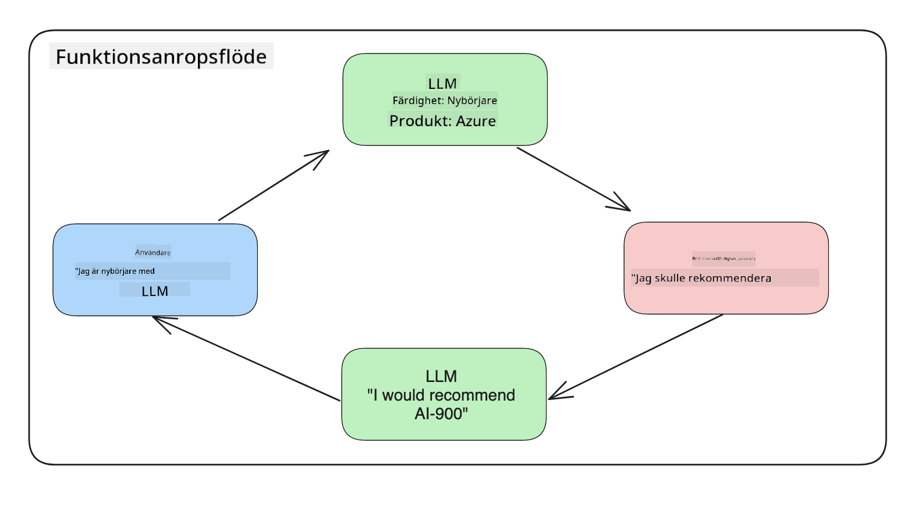
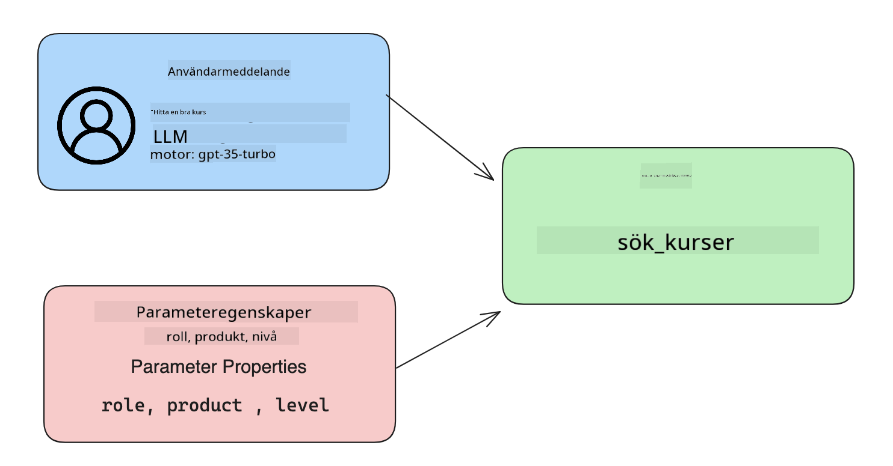

<!--
CO_OP_TRANSLATOR_METADATA:
{
  "original_hash": "f6f84f9ef2d066cd25850cab93580a50",
  "translation_date": "2025-10-17T18:59:18+00:00",
  "source_file": "11-integrating-with-function-calling/README.md",
  "language_code": "sv"
}
-->
# Integrera med funktionsanrop

[](https://youtu.be/DgUdCLX8qYQ?si=f1ouQU5HQx6F8Gl2)

Du har lärt dig en hel del hittills i de tidigare lektionerna. Men vi kan fortfarande förbättra oss. Några saker vi kan ta itu med är hur vi kan få ett mer konsekvent svarformat för att göra det enklare att arbeta med svaret längre fram. Dessutom kanske vi vill lägga till data från andra källor för att ytterligare berika vår applikation.

De ovan nämnda problemen är vad detta kapitel syftar till att lösa.

## Introduktion

Denna lektion kommer att täcka:

- Förklara vad funktionsanrop är och dess användningsområden.
- Skapa ett funktionsanrop med Azure OpenAI.
- Hur man integrerar ett funktionsanrop i en applikation.

## Lärandemål

I slutet av denna lektion kommer du att kunna:

- Förklara syftet med att använda funktionsanrop.
- Konfigurera Funktionsanrop med Azure OpenAI Service.
- Designa effektiva funktionsanrop för din applikations användningsområde.

## Scenario: Förbättra vår chatbot med funktioner

För denna lektion vill vi bygga en funktion för vår utbildningsstartup som gör det möjligt för användare att använda en chatbot för att hitta tekniska kurser. Vi kommer att rekommendera kurser som passar deras kompetensnivå, nuvarande roll och intresse för teknik.

För att slutföra detta scenario kommer vi att använda en kombination av:

- `Azure OpenAI` för att skapa en chattupplevelse för användaren.
- `Microsoft Learn Catalog API` för att hjälpa användare att hitta kurser baserat på deras förfrågan.
- `Funktionsanrop` för att ta användarens fråga och skicka den till en funktion för att göra API-förfrågan.

För att komma igång, låt oss titta på varför vi skulle vilja använda funktionsanrop från början:

## Varför Funktionsanrop

Innan funktionsanrop var svar från en LLM ostrukturerade och inkonsekventa. Utvecklare var tvungna att skriva komplex valideringskod för att säkerställa att de kunde hantera varje variation av ett svar. Användare kunde inte få svar som "Vad är det aktuella vädret i Stockholm?". Detta beror på att modeller var begränsade till den tidpunkt då data tränades.

Funktionsanrop är en funktion i Azure OpenAI Service för att övervinna följande begränsningar:

- **Konsekvent svarformat**. Om vi kan bättre kontrollera svarformatet kan vi lättare integrera svaret längre fram till andra system.
- **Extern data**. Möjlighet att använda data från andra källor i en applikation i ett chattkontext.

## Illustrera problemet genom ett scenario

> Vi rekommenderar att du använder [den inkluderade notebooken](./python/aoai-assignment.ipynb?WT.mc_id=academic-105485-koreyst) om du vill köra scenariot nedan. Du kan också bara läsa vidare eftersom vi försöker illustrera ett problem där funktioner kan hjälpa till att lösa problemet.

Låt oss titta på exemplet som illustrerar problemet med svarformat:

Låt oss säga att vi vill skapa en databas med studentdata så att vi kan föreslå rätt kurs till dem. Nedan har vi två beskrivningar av studenter som är mycket lika i den data de innehåller.

1. Skapa en anslutning till vår Azure OpenAI-resurs:

   ```python
   import os
   import json
   from openai import AzureOpenAI
   from dotenv import load_dotenv
   load_dotenv()

   client = AzureOpenAI(
   api_key=os.environ['AZURE_OPENAI_API_KEY'],  # this is also the default, it can be omitted
   api_version = "2023-07-01-preview"
   )

   deployment=os.environ['AZURE_OPENAI_DEPLOYMENT']
   ```

   Nedan är lite Python-kod för att konfigurera vår anslutning till Azure OpenAI där vi ställer in `api_type`, `api_base`, `api_version` och `api_key`.

1. Skapa två studentbeskrivningar med hjälp av variablerna `student_1_description` och `student_2_description`.

   ```python
   student_1_description="Emily Johnson is a sophomore majoring in computer science at Duke University. She has a 3.7 GPA. Emily is an active member of the university's Chess Club and Debate Team. She hopes to pursue a career in software engineering after graduating."

   student_2_description = "Michael Lee is a sophomore majoring in computer science at Stanford University. He has a 3.8 GPA. Michael is known for his programming skills and is an active member of the university's Robotics Club. He hopes to pursue a career in artificial intelligence after finishing his studies."
   ```

   Vi vill skicka ovanstående studentbeskrivningar till en LLM för att analysera data. Denna data kan senare användas i vår applikation och skickas till ett API eller lagras i en databas.

1. Låt oss skapa två identiska prompts där vi instruerar LLM om vilken information vi är intresserade av:

   ```python
   prompt1 = f'''
   Please extract the following information from the given text and return it as a JSON object:

   name
   major
   school
   grades
   club

   This is the body of text to extract the information from:
   {student_1_description}
   '''

   prompt2 = f'''
   Please extract the following information from the given text and return it as a JSON object:

   name
   major
   school
   grades
   club

   This is the body of text to extract the information from:
   {student_2_description}
   '''
   ```

   Ovanstående prompts instruerar LLM att extrahera information och returnera svaret i JSON-format.

1. Efter att ha ställt in prompts och anslutningen till Azure OpenAI, kommer vi nu att skicka prompts till LLM genom att använda `openai.ChatCompletion`. Vi lagrar prompten i variabeln `messages` och tilldelar rollen `user`. Detta för att efterlikna ett meddelande från en användare som skrivs till en chatbot.

   ```python
   # response from prompt one
   openai_response1 = client.chat.completions.create(
   model=deployment,
   messages = [{'role': 'user', 'content': prompt1}]
   )
   openai_response1.choices[0].message.content

   # response from prompt two
   openai_response2 = client.chat.completions.create(
   model=deployment,
   messages = [{'role': 'user', 'content': prompt2}]
   )
   openai_response2.choices[0].message.content
   ```

Nu kan vi skicka båda förfrågningarna till LLM och undersöka svaret vi får genom att hitta det som så här `openai_response1['choices'][0]['message']['content']`.

1. Slutligen kan vi konvertera svaret till JSON-format genom att kalla `json.loads`:

   ```python
   # Loading the response as a JSON object
   json_response1 = json.loads(openai_response1.choices[0].message.content)
   json_response1
   ```

   Svar 1:

   ```json
   {
     "name": "Emily Johnson",
     "major": "computer science",
     "school": "Duke University",
     "grades": "3.7",
     "club": "Chess Club"
   }
   ```

   Svar 2:

   ```json
   {
     "name": "Michael Lee",
     "major": "computer science",
     "school": "Stanford University",
     "grades": "3.8 GPA",
     "club": "Robotics Club"
   }
   ```

   Även om prompts är desamma och beskrivningarna är liknande, ser vi värdena för egenskapen `Grades` formaterade olika, eftersom vi ibland kan få formatet `3.7` eller `3.7 GPA` till exempel.

   Detta resultat beror på att LLM tar ostrukturerad data i form av den skrivna prompten och returnerar också ostrukturerad data. Vi behöver ha ett strukturerat format så att vi vet vad vi kan förvänta oss när vi lagrar eller använder denna data.

Så hur löser vi problemet med formatering då? Genom att använda funktionsanrop kan vi säkerställa att vi får strukturerad data tillbaka. När vi använder funktionsanrop, kallar eller kör LLM faktiskt inga funktioner. Istället skapar vi en struktur för LLM att följa för sina svar. Vi använder sedan dessa strukturerade svar för att veta vilken funktion som ska köras i våra applikationer.



Vi kan sedan ta det som returneras från funktionen och skicka detta tillbaka till LLM. LLM kommer sedan att svara med naturligt språk för att besvara användarens fråga.

## Användningsområden för funktionsanrop

Det finns många olika användningsområden där funktionsanrop kan förbättra din app, såsom:

- **Anropa externa verktyg**. Chatbots är bra på att ge svar på frågor från användare. Genom att använda funktionsanrop kan chatbots använda meddelanden från användare för att utföra vissa uppgifter. Till exempel kan en student be chatboten att "Skicka ett e-postmeddelande till min lärare och säga att jag behöver mer hjälp med detta ämne". Detta kan göra ett funktionsanrop till `send_email(to: string, body: string)`.

- **Skapa API- eller databasförfrågningar**. Användare kan hitta information med naturligt språk som omvandlas till en formaterad förfrågan eller API-anrop. Ett exempel på detta kan vara en lärare som frågar "Vilka är de studenter som slutförde den senaste uppgiften" vilket kan kalla en funktion som heter `get_completed(student_name: string, assignment: int, current_status: string)`.

- **Skapa strukturerad data**. Användare kan ta en textblock eller CSV och använda LLM för att extrahera viktig information från det. Till exempel kan en student konvertera en Wikipedia-artikel om fredsavtal för att skapa AI-flashkort. Detta kan göras genom att använda en funktion som heter `get_important_facts(agreement_name: string, date_signed: string, parties_involved: list)`.

## Skapa ditt första funktionsanrop

Processen för att skapa ett funktionsanrop inkluderar 3 huvudsteg:

1. **Anropa** Chat Completions API med en lista över dina funktioner och ett användarmeddelande.
2. **Läsa** modellens svar för att utföra en åtgärd, dvs. köra en funktion eller API-anrop.
3. **Göra** ett nytt anrop till Chat Completions API med svaret från din funktion för att använda den informationen för att skapa ett svar till användaren.



### Steg 1 - skapa meddelanden

Det första steget är att skapa ett användarmeddelande. Detta kan tilldelas dynamiskt genom att ta värdet från en textinmatning eller så kan du tilldela ett värde här. Om detta är första gången du arbetar med Chat Completions API, måste vi definiera `role` och `content` för meddelandet.

Rollen kan vara antingen `system` (skapa regler), `assistant` (modellen) eller `user` (slutanvändaren). För funktionsanrop kommer vi att tilldela detta som `user` och ett exempel på en fråga.

```python
messages= [ {"role": "user", "content": "Find me a good course for a beginner student to learn Azure."} ]
```

Genom att tilldela olika roller blir det tydligt för LLM om det är systemet som säger något eller användaren, vilket hjälper till att bygga en konversationshistorik som LLM kan bygga vidare på.

### Steg 2 - skapa funktioner

Nästa steg är att definiera en funktion och parametrarna för den funktionen. Vi kommer att använda bara en funktion här som heter `search_courses` men du kan skapa flera funktioner.

> **Viktigt**: Funktioner inkluderas i systemmeddelandet till LLM och kommer att räknas in i antalet tillgängliga tokens du har tillgängliga.

Nedan skapar vi funktionerna som en array av objekt. Varje objekt är en funktion och har egenskaperna `name`, `description` och `parameters`:

```python
functions = [
   {
      "name":"search_courses",
      "description":"Retrieves courses from the search index based on the parameters provided",
      "parameters":{
         "type":"object",
         "properties":{
            "role":{
               "type":"string",
               "description":"The role of the learner (i.e. developer, data scientist, student, etc.)"
            },
            "product":{
               "type":"string",
               "description":"The product that the lesson is covering (i.e. Azure, Power BI, etc.)"
            },
            "level":{
               "type":"string",
               "description":"The level of experience the learner has prior to taking the course (i.e. beginner, intermediate, advanced)"
            }
         },
         "required":[
            "role"
         ]
      }
   }
]
```

Låt oss beskriva varje funktionsexemplar mer i detalj nedan:

- `name` - Namnet på funktionen som vi vill ska anropas.
- `description` - Detta är beskrivningen av hur funktionen fungerar. Här är det viktigt att vara specifik och tydlig.
- `parameters` - En lista med värden och format som du vill att modellen ska producera i sitt svar. Parametrarna-arrayen består av objekt där objekten har följande egenskaper:
  1.  `type` - Datatypen som egenskaperna kommer att lagras i.
  1.  `properties` - Lista över de specifika värden som modellen kommer att använda för sitt svar.
      1. `name` - Nyckeln är namnet på egenskapen som modellen kommer att använda i sitt formaterade svar, till exempel `product`.
      1. `type` - Datatypen för denna egenskap, till exempel `string`.
      1. `description` - Beskrivning av den specifika egenskapen.

Det finns också en valfri egenskap `required` - obligatorisk egenskap för att funktionsanropet ska kunna slutföras.

### Steg 3 - Göra funktionsanropet

Efter att ha definierat en funktion, behöver vi nu inkludera den i anropet till Chat Completion API. Vi gör detta genom att lägga till `functions` till förfrågan. I detta fall `functions=functions`.

Det finns också ett alternativ att ställa in `function_call` till `auto`. Detta innebär att vi låter LLM bestämma vilken funktion som ska anropas baserat på användarmeddelandet istället för att tilldela det själva.

Här är lite kod nedan där vi anropar `ChatCompletion.create`, notera hur vi ställer in `functions=functions` och `function_call="auto"` och därmed ger LLM valet när den ska anropa de funktioner vi tillhandahåller:

```python
response = client.chat.completions.create(model=deployment,
                                        messages=messages,
                                        functions=functions,
                                        function_call="auto")

print(response.choices[0].message)
```

Svaret som kommer tillbaka ser nu ut så här:

```json
{
  "role": "assistant",
  "function_call": {
    "name": "search_courses",
    "arguments": "{\n  \"role\": \"student\",\n  \"product\": \"Azure\",\n  \"level\": \"beginner\"\n}"
  }
}
```

Här kan vi se hur funktionen `search_courses` anropades och med vilka argument, som anges i egenskapen `arguments` i JSON-svaret.

Slutsatsen är att LLM kunde hitta data som passade argumenten för funktionen eftersom den extraherade det från värdet som tillhandahölls till parametern `messages` i chat completion-anropet. Nedan är en påminnelse om värdet `messages`:

```python
messages= [ {"role": "user", "content": "Find me a good course for a beginner student to learn Azure."} ]
```

Som du kan se, extraherades `student`, `Azure` och `beginner` från `messages` och sattes som input till funktionen. Att använda funktioner på detta sätt är ett utmärkt sätt att extrahera information från en prompt men också att ge struktur till LLM och ha återanvändbar funktionalitet.

Nästa steg är att se hur vi kan använda detta i vår app.

## Integrera funktionsanrop i en applikation

Efter att vi har testat det formaterade svaret från LLM, kan vi nu integrera detta i en applikation.

### Hantera flödet

För att integrera detta i vår applikation, låt oss ta följande steg:

1. Först, låt oss göra anropet till OpenAI-tjänsterna och lagra meddelandet i en variabel som heter `response_message`.

   ```python
   response_message = response.choices[0].message
   ```

1. Nu ska vi definiera funktionen som kommer att anropa Microsoft Learn API för att få en lista med kurser:

   ```python
   import requests

   def search_courses(role, product, level):
     url = "https://learn.microsoft.com/api/catalog/"
     params = {
        "role": role,
        "product": product,
        "level": level
     }
     response = requests.get(url, params=params)
     modules = response.json()["modules"]
     results = []
     for module in modules[:5]:
        title = module["title"]
        url = module["url"]
        results.append({"title": title, "url": url})
     return str(results)
   ```

   Notera hur vi nu skapar en faktisk Python-funktion som matchar funktionsnamnen som introducerades i variabeln `functions`. Vi gör också riktiga externa API-anrop för att hämta den data vi behöver. I detta fall går vi mot Microsoft Learn API för att söka efter utbildningsmoduler.

Ok, så vi skapade `functions`-variabler och en motsvarande Python-funktion, hur berättar vi för LLM hur man kopplar dessa två tillsammans så att vår Python-funktion anropas?

1. För att se om vi behöver anropa en Python-funktion, måste vi titta på LLM-svaret och se om `function_call` är en del av det och anropa den angivna funktionen. Här är hur du kan göra den nämnda kontrollen nedan:

   ```python
   # Check if the model wants to call a function
   if response_message.function_call.name:
    print("Recommended Function call:")
    print(response_message.function_call.name)
    print()

    # Call the function.
    function_name = response_message.function_call.name

    available_functions = {
            "search_courses": search_courses,
    }
    function_to_call = available_functions[function_name]

    function_args = json.loads(response_message.function_call.arguments)
    function_response = function_to_call(**function_args)

    print("Output of function call:")
    print(function_response)
    print(type(function_response))


    # Add the assistant response and function response to the messages
    messages.append( # adding assistant response to messages
        {
            "role": response_message.role,
            "function_call": {
                "name": function_name,
                "arguments": response_message.function_call.arguments,
            },
            "content": None
        }
    )
    messages.append( # adding function response to messages
        {
            "role": "function",
            "name": function_name,
            "content":function_response,
        }
    )
   ```

   Dessa tre rader säkerställer att vi extraherar funktionsnamnet, argumenten och gör anropet:

   ```python
   function_to_call = available_functions[function_name]

   function_args = json.loads(response_message.function_call.arguments)
   function_response = function_to_call(**function_args)
   ```

   Nedan är utdata från att köra vår kod:

   **Utdata**

   ```Recommended Function call:
   {
     "name": "search_courses",
     "arguments": "{\n  \"role\": \"student\",\n  \"product\": \"Azure\",\n  \"level\": \"beginner\"\n}"
   }

   Output of function call:
   [{'title': 'Describe concepts of cryptography', 'url': 'https://learn.microsoft.com/training/modules/describe-concepts-of-cryptography/?
   WT.mc_id=api_CatalogApi'}, {'title': 'Introduction to audio classification with TensorFlow', 'url': 'https://learn.microsoft.com/en-
   us/training/modules/intro-audio-classification-tensorflow/?WT.mc_id=api_CatalogApi'}, {'title': 'Design a Performant Data Model in Azure SQL
   Database with Azure Data Studio', 'url': 'https://learn.microsoft.com/training/modules/design-a-data-model-with-ads/?
   WT.mc_id=api_CatalogApi'}, {'title': 'Getting started with the Microsoft Cloud Adoption Framework for Azure', 'url':
   'https://learn.microsoft.com/training/modules/cloud-adoption-framework-getting-started/?WT.mc_id=api_CatalogApi'}, {'title': 'Set up the
   Rust development environment', 'url': 'https://learn.microsoft.com/training/modules/rust-set-up-environment/?WT.mc_id=api_CatalogApi'}]
   <class 'str'>
   ```

1. Nu kommer vi att skicka det uppdaterade meddelandet, `messages` till LLM så att vi kan få ett naturligt språkssvar istället för ett API JSON-formaterat svar.

   ```python
   print("Messages in next request:")
   print(messages)
   print()

   second_response = client.chat.completions.create(
      messages=messages,
      model=deployment,
      function_call="auto",
      functions=functions,
      temperature=0
         )  # get a new response from GPT where it can see the function response


   print(second_response.choices[0].message)
   ```

   **Utdata**

   ```python
   {
     "role": "assistant",
     "content": "I found some good courses for beginner students to learn Azure:\n\n1. [Describe concepts of cryptography] (https://learn.microsoft.com/training/modules/describe-concepts-of-cryptography/?WT.mc_id=api_CatalogApi)\n2. [Introduction to audio classification with TensorFlow](https://learn.microsoft.com/training/modules/intro-audio-classification-tensorflow/?WT.mc_id=api_CatalogApi)\n3. [Design a Performant Data Model in Azure SQL Database with Azure Data Studio](https://learn.microsoft.com/training/modules/design-a-data-model-with-ads/?WT.mc_id=api_CatalogApi)\n4. [Getting started with the Microsoft Cloud Adoption Framework for Azure](https://learn.microsoft.com/training/modules/cloud-adoption-framework-getting-started/?WT.mc_id=api_CatalogApi)\n5. [Set up the Rust development environment](https://learn.microsoft.com/training/modules/rust-set-up-environment/?WT.mc_id=api_CatalogApi)\n\nYou can click on the links to access the courses."
   }

   ```

## Uppgift

För att fortsätta din inlärning av Azure OpenAI Funktionsanrop kan du bygga:

- Fler parametrar för funktionen som kan hjälpa elever att hitta fler kurser.
- Skapa ett annat funktionsanrop som tar mer information från eleven, som deras modersmål.
- Skapa felhantering när funktionsanropet och/eller API-anropet inte returnerar några lämpliga kurser

Tips: Följ sidan [Learn API-referensdokumentation](https://learn.microsoft.com/training/support/catalog-api-developer-reference?WT.mc_id=academic-105485-koreyst) för att se hur och var dessa data är tillgängliga.

## Bra jobbat! Fortsätt resan

Efter att ha avslutat denna lektion, kolla in vår [Generative AI Learning-samling](https://aka.ms/genai-collection?WT.mc_id=academic-105485-koreyst) för att fortsätta utveckla din kunskap om Generative AI!

Gå vidare till Lektion 12, där vi kommer att titta på hur man [designar UX för AI-applikationer](../12-designing-ux-for-ai-applications/README.md?WT.mc_id=academic-105485-koreyst)!

---

**Ansvarsfriskrivning**:  
Detta dokument har översatts med hjälp av AI-översättningstjänsten [Co-op Translator](https://github.com/Azure/co-op-translator). Även om vi strävar efter noggrannhet, bör det noteras att automatiska översättningar kan innehålla fel eller felaktigheter. Det ursprungliga dokumentet på dess ursprungliga språk bör betraktas som den auktoritativa källan. För kritisk information rekommenderas professionell mänsklig översättning. Vi ansvarar inte för eventuella missförstånd eller feltolkningar som uppstår vid användning av denna översättning.