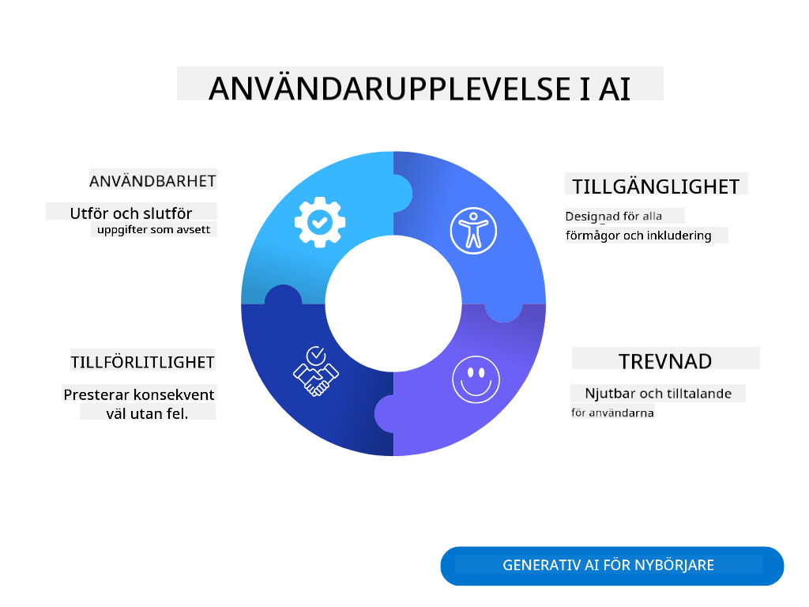
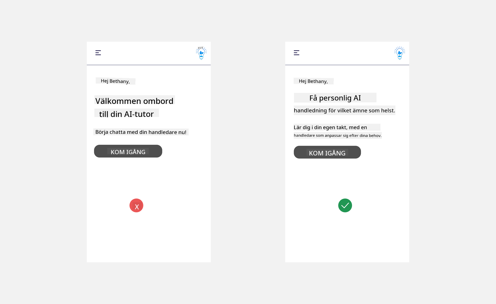
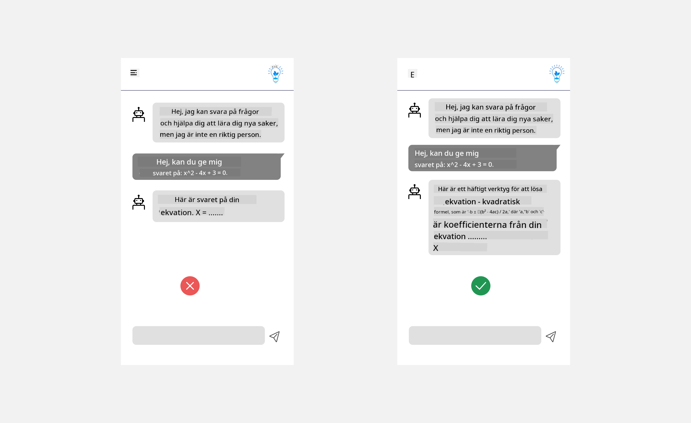
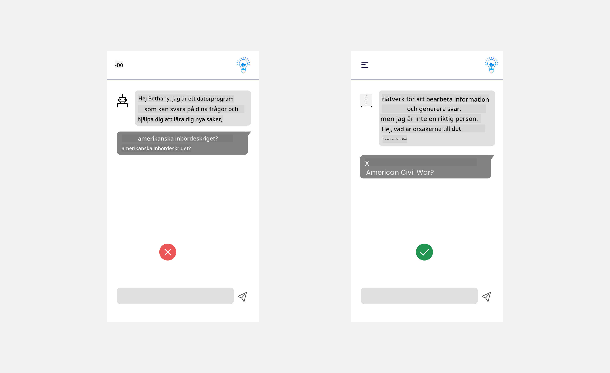
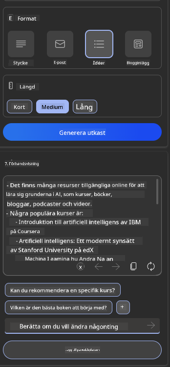

<!--
CO_OP_TRANSLATOR_METADATA:
{
  "original_hash": "ec385b41ee50579025d50cc03bfb3a25",
  "translation_date": "2025-05-19T21:56:58+00:00",
  "source_file": "12-designing-ux-for-ai-applications/README.md",
  "language_code": "sv"
}
-->
# Designa UX för AI-applikationer

> _(Klicka på bilden ovan för att se videon av denna lektion)_

Användarupplevelse är en mycket viktig aspekt av att bygga appar. Användare behöver kunna använda din app på ett effektivt sätt för att utföra uppgifter. Att vara effektiv är en sak, men du behöver också designa appar så att de kan användas av alla, för att göra dem _tillgängliga_. Detta kapitel kommer att fokusera på detta område så att du förhoppningsvis slutar med att designa en app som människor kan och vill använda.

## Introduktion

Användarupplevelse handlar om hur en användare interagerar med och använder en specifik produkt eller tjänst, vare sig det är ett system, verktyg eller design. När man utvecklar AI-applikationer fokuserar utvecklare inte bara på att säkerställa att användarupplevelsen är effektiv utan även etisk. I denna lektion täcker vi hur man bygger artificiell intelligens (AI) applikationer som tillgodoser användarens behov.

Lektionens innehåll:

- Introduktion till användarupplevelse och förståelse av användarens behov
- Designa AI-applikationer för förtroende och transparens
- Designa AI-applikationer för samarbete och feedback

## Lärandemål

Efter att ha tagit denna lektion kommer du att kunna:

- Förstå hur man bygger AI-applikationer som uppfyller användarens behov.
- Designa AI-applikationer som främjar förtroende och samarbete.

### Förkunskaper

Ta dig tid att läsa mer om [användarupplevelse och design thinking.](https://learn.microsoft.com/training/modules/ux-design?WT.mc_id=academic-105485-koreyst)

## Introduktion till användarupplevelse och förståelse av användarens behov

I vår fiktiva utbildningsstart-up har vi två primära användare, lärare och elever. Var och en av de två användarna har unika behov. En användarcentrerad design prioriterar användaren och säkerställer att produkterna är relevanta och fördelaktiga för dem de är avsedda för.

Applikationen bör vara **användbar, pålitlig, tillgänglig och trevlig** för att ge en bra användarupplevelse.

### Användbarhet

Att vara användbar innebär att applikationen har funktionalitet som matchar dess avsedda syfte, såsom att automatisera betygsättningsprocessen eller generera flashcards för repetition. En applikation som automatiserar betygsättningsprocessen bör kunna tilldela poäng till elevernas arbete exakt och effektivt baserat på fördefinierade kriterier. På samma sätt bör en applikation som genererar repetitionsflashcards kunna skapa relevanta och varierande frågor baserat på dess data.

### Pålitlighet

Att vara pålitlig innebär att applikationen kan utföra sin uppgift konsekvent och utan fel. Men AI, precis som människor, är inte perfekt och kan vara benägen för fel. Applikationerna kan stöta på fel eller oväntade situationer som kräver mänsklig intervention eller korrigering. Hur hanterar du fel? I sista delen av denna lektion kommer vi att täcka hur AI-system och applikationer är designade för samarbete och feedback.

### Tillgänglighet

Att vara tillgänglig innebär att utöka användarupplevelsen till användare med olika förmågor, inklusive de med funktionsnedsättningar, och säkerställa att ingen lämnas utanför. Genom att följa riktlinjer och principer för tillgänglighet blir AI-lösningar mer inkluderande, användbara och fördelaktiga för alla användare.

### Trevlig

Att vara trevlig innebär att applikationen är njutbar att använda. En tilltalande användarupplevelse kan ha en positiv inverkan på användaren och uppmuntra dem att återvända till applikationen och öka affärsintäkterna.

Inte alla utmaningar kan lösas med AI. AI kommer in för att förstärka din användarupplevelse, vare sig det handlar om att automatisera manuella uppgifter eller personalisera användarupplevelser.

## Designa AI-applikationer för förtroende och transparens

Att bygga förtroende är avgörande när man designar AI-applikationer. Förtroende säkerställer att en användare är säker på att applikationen kommer att få arbetet gjort, leverera resultat konsekvent och att resultaten är vad användaren behöver. En risk inom detta område är misstro och överdrivet förtroende. Misstro uppstår när en användare har lite eller inget förtroende för ett AI-system, vilket leder till att användaren avvisar din applikation. Överdrivet förtroende uppstår när en användare överskattar ett AI-systems kapacitet, vilket leder till att användare litar för mycket på AI-systemet. Till exempel kan ett automatiserat betygssystem i fallet med överdrivet förtroende leda till att läraren inte går igenom några av pappren för att säkerställa att betygssystemet fungerar väl. Detta kan resultera i orättvisa eller felaktiga betyg för eleverna eller missade möjligheter för feedback och förbättring.

Två sätt att säkerställa att förtroende sätts i centrum för design är förklarbarhet och kontroll.

### Förklarbarhet

När AI hjälper till att informera beslut, såsom att förmedla kunskap till framtida generationer, är det avgörande för lärare och föräldrar att förstå hur AI-beslut fattas. Detta är förklarbarhet - att förstå hur AI-applikationer fattar beslut. Att designa för förklarbarhet inkluderar att lägga till detaljer om exempel på vad en AI-applikation kan göra. Till exempel, istället för "Kom igång med AI-lärare", kan systemet använda: "Sammanfatta dina anteckningar för enklare repetition med hjälp av AI."

Ett annat exempel är hur AI använder användar- och personliga data. Till exempel kan en användare med personan student ha begränsningar baserat på sin persona. AI:n kanske inte kan avslöja svar på frågor men kan hjälpa till att vägleda användaren att tänka igenom hur de kan lösa ett problem.

En sista nyckeldel av förklarbarhet är förenkling av förklaringar. Elever och lärare kanske inte är AI-experter, därför bör förklaringar av vad applikationen kan eller inte kan göra förenklas och vara lätta att förstå.

### Kontroll

Generativ AI skapar ett samarbete mellan AI och användaren, där till exempel en användare kan modifiera uppmaningar för olika resultat. Dessutom, när en utdata genereras, bör användare kunna modifiera resultaten och ge dem en känsla av kontroll. Till exempel, när du använder Bing, kan du anpassa din uppmaning baserat på format, ton och längd. Dessutom kan du göra ändringar i din utdata och modifiera utdatan som visas nedan:

En annan funktion i Bing som tillåter en användare att ha kontroll över applikationen är möjligheten att välja att delta eller inte i de data AI använder. För en skolapplikation kanske en elev vill använda sina anteckningar samt lärarens resurser som repetitionsmaterial.

> När du designar AI-applikationer är avsiktlighet nyckeln för att säkerställa att användare inte övertror och sätter orealistiska förväntningar på dess kapaciteter. Ett sätt att göra detta är att skapa friktion mellan uppmaningarna och resultaten. Påminn användaren om att detta är AI och inte en annan människa.

## Designa AI-applikationer för samarbete och feedback

Som nämnts tidigare skapar generativ AI ett samarbete mellan användaren och AI. De flesta interaktioner sker med en användare som matar in en uppmaning och AI:n genererar en utdata. Vad händer om utdatan är felaktig? Hur hanterar applikationen fel om de uppstår? Skyller AI på användaren eller tar den tid att förklara felet?

AI-applikationer bör byggas för att ta emot och ge feedback. Detta hjälper inte bara AI-systemet att förbättras utan bygger också förtroende med användarna. En feedbackloop bör inkluderas i designen, ett exempel kan vara en enkel tumme upp eller ner på utdatan.

Ett annat sätt att hantera detta är att tydligt kommunicera systemets kapaciteter och begränsningar. När en användare gör ett fel genom att begära något utanför AI:s kapaciteter, bör det också finnas ett sätt att hantera detta, som visas nedan.

Systemfel är vanliga med applikationer där användaren kan behöva hjälp med information utanför AI:s omfattning eller applikationen kan ha en gräns för hur många frågor/ämnen en användare kan generera sammanfattningar. Till exempel kan en AI-applikation som tränats med data om begränsade ämnen, till exempel Historia och Matematik, kanske inte kunna hantera frågor om Geografi. För att mildra detta kan AI-systemet ge ett svar som: "Tyvärr, vår produkt har tränats med data inom följande ämnen....., jag kan inte svara på frågan du ställde."

AI-applikationer är inte perfekta, därför är de benägna att göra misstag. När du designar dina applikationer bör du säkerställa att du skapar utrymme för feedback från användare och felhantering på ett sätt som är enkelt och lättförklarligt.

## Uppgift

Ta alla AI-appar du har byggt hittills, överväg att implementera följande steg i din app:

- **Trevlig:** Överväg hur du kan göra din app mer trevlig. Lägger du till förklaringar överallt? Uppmuntrar du användaren att utforska? Hur formulerar du dina felmeddelanden?

- **Användbarhet:** Bygg en webbapp. Se till att din app är navigerbar både med mus och tangentbord.

- **Förtroende och transparens:** Lita inte helt på AI och dess utdata, överväg hur du skulle lägga till en människa i processen för att verifiera utdatan. Överväg också och implementera andra sätt att uppnå förtroende och transparens.

- **Kontroll:** Ge användaren kontroll över de data de tillhandahåller till applikationen. Implementera ett sätt för en användare att välja att delta eller inte i datainsamling i AI-applikationen.

## Fortsätt ditt lärande!

Efter att ha avslutat denna lektion, kolla in vår [Generativ AI-lärandekollektion](https://aka.ms/genai-collection?WT.mc_id=academic-105485-koreyst) för att fortsätta höja din kunskap om Generativ AI!

Gå vidare till Lektion 13, där vi kommer att titta på hur man [säkra AI-applikationer](../13-securing-ai-applications/README.md?WT.mc_id=academic-105485-koreyst)!

**Ansvarsfriskrivning**:  
Detta dokument har översatts med hjälp av AI-översättningstjänsten [Co-op Translator](https://github.com/Azure/co-op-translator). Vi strävar efter noggrannhet, men var medveten om att automatiserade översättningar kan innehålla fel eller oriktigheter. Det ursprungliga dokumentet på dess modersmål bör betraktas som den auktoritativa källan. För kritisk information rekommenderas professionell mänsklig översättning. Vi ansvarar inte för eventuella missförstånd eller feltolkningar som uppstår vid användning av denna översättning.