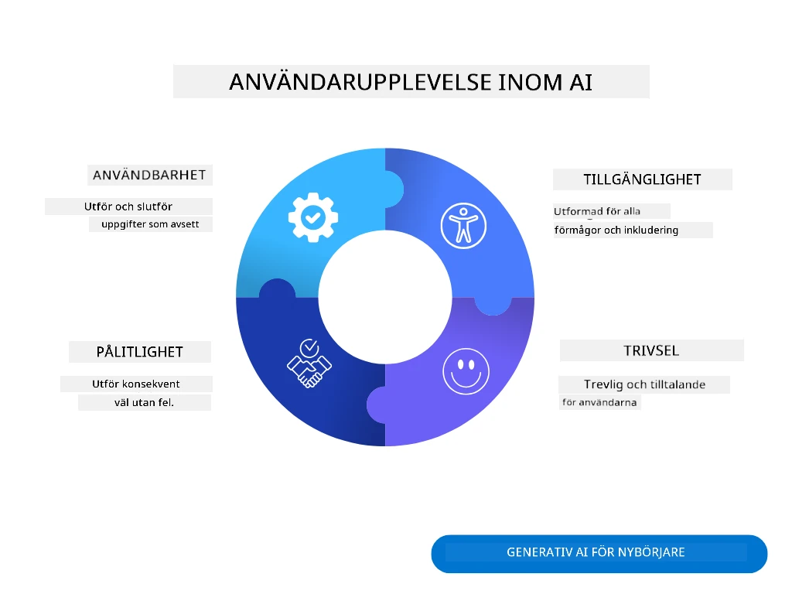
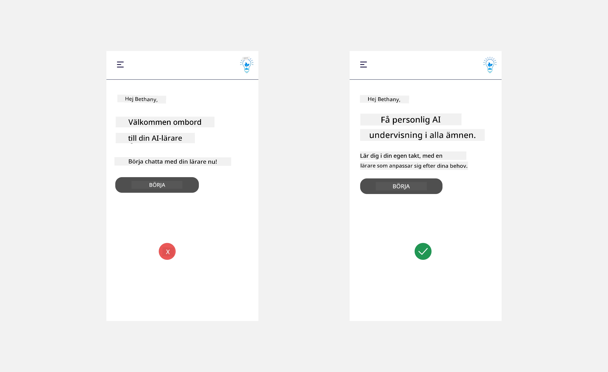
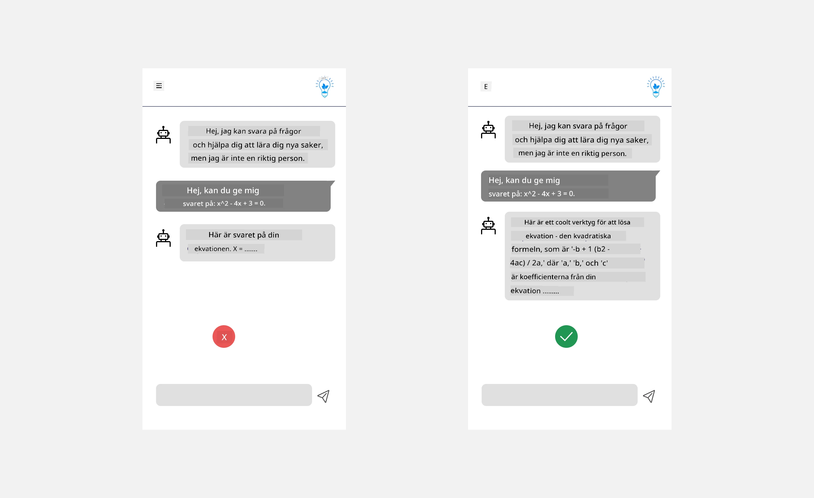
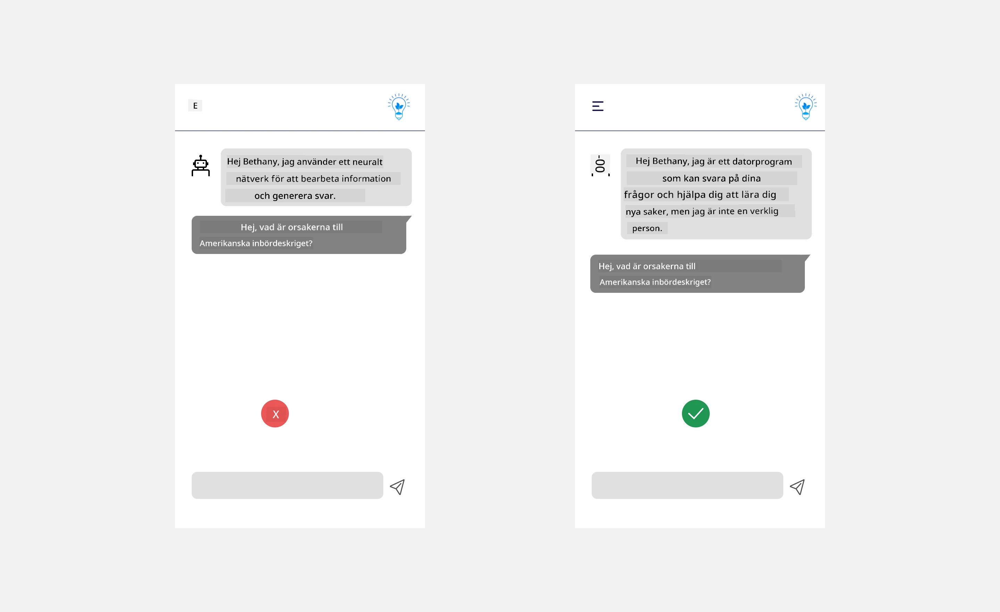
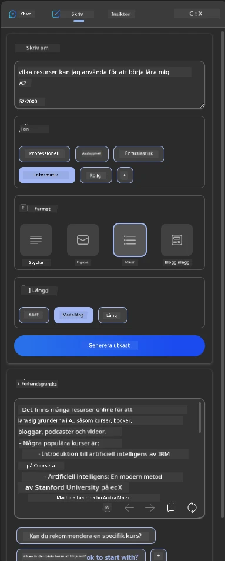
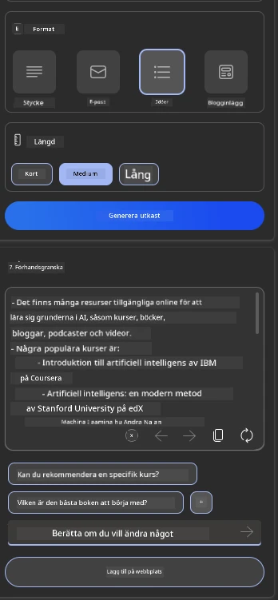
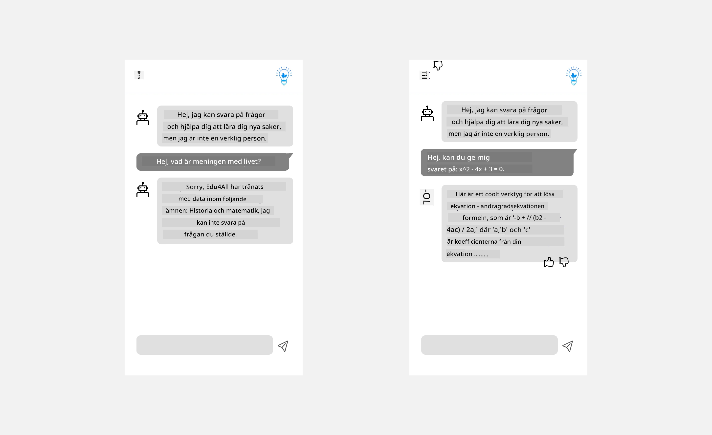

# Designa UX för AI-applikationer

> _(Klicka på bilden ovan för att se video av denna lektion)_

Användarupplevelse är en mycket viktig aspekt när man bygger appar. Användarna behöver kunna använda din app på ett effektivt sätt för att utföra uppgifter. Att vara effektiv är en sak, men du behöver också designa appar så att alla kan använda dem, för att göra dem _tillgängliga_. Detta kapitel kommer att fokusera på detta område så att du förhoppningsvis slutar med att designa en app som människor kan och vill använda.

## Introduktion

Användarupplevelse är hur en användare interagerar med och använder en specifik produkt eller tjänst, vare sig det är ett system, ett verktyg eller en design. När man utvecklar AI-applikationer fokuserar utvecklare inte bara på att säkerställa att användarupplevelsen är effektiv utan också etisk. I denna lektion täcker vi hur man bygger artificiell intelligens (AI)-applikationer som möter användarnas behov.

Lektionen kommer att täcka följande områden:

- Introduktion till användarupplevelse och förståelse för användarnas behov
- Designa AI-applikationer för förtroende och transparens
- Designa AI-applikationer för samarbete och återkoppling

## Lärandemål

Efter att ha tagit denna lektion kommer du att kunna:

- Förstå hur man bygger AI-applikationer som uppfyller användarnas behov.
- Designa AI-applikationer som främjar förtroende och samarbete.

### Förkunskaper

Ta lite tid och läs mer om [användarupplevelse och design thinking.](https://learn.microsoft.com/training/modules/ux-design?WT.mc_id=academic-105485-koreyst)

## Introduktion till användarupplevelse och förståelse för användarnas behov

I vår fiktiva utbildningsstart har vi två primära användare, lärare och elever. Varje användartyp har unika behov. En användarcentrerad design prioriterar användaren för att säkerställa att produkterna är relevanta och fördelaktiga för dem de är avsedda för.

Applikationen bör vara **användbar, pålitlig, tillgänglig och behaglig** för att ge en god användarupplevelse.

### Användbarhet

Att vara användbar innebär att applikationen har funktionalitet som matchar dess avsedda syfte, som att automatisera betygsättningsprocessen eller generera flashcards för repetition. En applikation som automatiserar betygsättningen ska kunna korrekt och effektivt tilldela poäng till elevers arbete baserat på fördefinierade kriterier. På samma sätt ska en applikation som genererar repetitionsflashcards kunna skapa relevanta och varierade frågor baserade på dess data.

### Pålitlighet

Att vara pålitlig innebär att applikationen kan utföra sin uppgift konsekvent och utan fel. Dock är AI precis som människor inte perfekt och kan vara benägen att göra misstag. Applikationerna kan stöta på fel eller oväntade situationer som kräver mänsklig intervention eller korrigering. Hur hanterar du fel? I den sista delen av denna lektion kommer vi att ta upp hur AI-system och applikationer är designade för samarbete och återkoppling.

### Tillgänglighet

Att vara tillgänglig innebär att utöka användarupplevelsen till användare med olika förmågor, inklusive personer med funktionsnedsättningar, för att säkerställa att ingen lämnas utanför. Genom att följa riktlinjer och principer för tillgänglighet blir AI-lösningar mer inkluderande, användbara och fördelaktiga för alla användare.

### Behaglig

Att vara behaglig innebär att applikationen är trevlig att använda. En attraktiv användarupplevelse kan ha en positiv inverkan på användaren och uppmuntra denne att återvända till applikationen samt öka företagets intäkter.

Inte varje utmaning kan lösas med AI. AI kommer in för att förstärka din användarupplevelse, vare sig det gäller att automatisera manuella uppgifter eller personalisera användarupplevelser.

## Designa AI-applikationer för förtroende och transparens

Att bygga förtroende är avgörande när man designar AI-applikationer. Förtroende säkerställer att en användare är trygg med att applikationen utför uppgiften, levererar resultat konsekvent och att resultaten är vad användaren behöver. En risk i detta område är misstro och överförtroende. Misstro uppstår när en användare har lite eller inget förtroende för ett AI-system, vilket leder till att användaren avvisar din applikation. Överförtroende uppstår när en användare överskattar kapaciteten hos ett AI-system, vilket leder till att användare litar för mycket på AI-systemet. Till exempel kan ett automatiserat betygssystem i fallet med överförtroende leda till att läraren inte korrekturläser vissa arbeten för att säkerställa att betygssystemet fungerar väl. Detta kan resultera i orättvisa eller inexakta betyg för eleverna, eller missade möjligheter till återkoppling och förbättring.

Två sätt att säkerställa att förtroendet är i centrum för designen är förklarbarhet och kontroll.

### Förklarbarhet

När AI hjälper till att informera beslut som att förmedla kunskap till framtida generationer är det avgörande för lärare och föräldrar att förstå hur AI-beslut fattas. Detta kallas förklarbarhet - att förstå hur AI-applikationer fattar beslut. Design för förklarbarhet inkluderar att lägga till detaljer som lyfter fram hur AI kom fram till resultatet. Målgruppen måste vara medveten om att resultatet genereras av AI och inte av en människa. Till exempel, istället för att säga "Börja chatta med din handledare nu", säg "Använd AI-handledare som anpassar sig efter dina behov och hjälper dig att lära i din takt."

Ett annat exempel är hur AI använder användar- och personuppgifter. Till exempel kan en användare med studentprofil ha begränsningar baserade på sin profil. AI:n kanske inte kan avslöja svar på frågor men kan hjälpa till att vägleda användaren att tänka igenom hur hen kan lösa ett problem.

En sista viktig del av förklarbarhet är förenkling av förklaringar. Studenter och lärare är kanske inte AI-experter, därför bör förklaringar om vad applikationen kan eller inte kan göra vara förenklade och lätta att förstå.

### Kontroll

Generativ AI skapar ett samarbete mellan AI och användaren, där exempelvis en användare kan justera uppmaningar för olika resultat. Dessutom bör användare kunna modifiera resultaten när en output genererats, vilket ger dem en känsla av kontroll. Till exempel, när du använder Microsoft Copilot (tidigare Bing Chat), kan du anpassa din uppmaning baserat på format, ton och längd. Dessutom kan du göra ändringar i din output och modifiera den som visas nedan:

En annan funktion i Microsoft Copilot som ger användaren kontroll över applikationen är möjligheten att välja att delta i eller avstå från den data som AI:n använder. För en skolapplikation kan en elev vilja använda sina anteckningar såväl som lärarens resurser som repetitionsmaterial.

> När man designar AI-applikationer är avsiktlighet nyckeln för att säkerställa att användare inte överskattar och sätter orealistiska förväntningar på dess kapabiliteter. Ett sätt att göra detta är att skapa friktion mellan uppmaningarna och resultaten. Påminn användaren om att detta är AI och inte en medmänniska.

## Designa AI-applikationer för samarbete och återkoppling

Som tidigare nämnts skapar generativ AI ett samarbete mellan användaren och AI:n. De flesta interaktioner är användare som anger en uppmaning och AI:n genererar en output. Vad händer om outputen är felaktig? Hur hanterar applikationen fel om de uppstår? Skyller AI på användaren eller tar tid att förklara felet?

AI-applikationer bör byggas för att ta emot och ge återkoppling. Detta hjälper inte bara AI-systemet att förbättras utan bygger också förtroende hos användarna. En återkopplingsslinga bör inkluderas i designen, ett exempel kan vara en enkel tumme upp eller ner på outputen.

Ett annat sätt att hantera detta är att tydligt kommunicera systemets kapabiliteter och begränsningar. När en användare gör ett misstag och begär något utanför AI:s kapacitet borde det också finnas ett sätt att hantera detta, som visas nedan.

Systemfel är vanliga i applikationer där användaren kan behöva hjälp med information utanför AI:s omfattning eller applikationen kan ha en gräns på hur många frågor/ämnen en användare kan generera sammanfattningar för. Till exempel kan en AI-applikation tränad med data om begränsade ämnen som historia och matematik inte kunna hantera frågor om geografi. För att mildra detta kan AI-systemet ge ett svar som: "Tyvärr, vår produkt har tränats med data inom följande ämnen....., jag kan inte svara på din fråga."

AI-applikationer är inte perfekta, därför kommer de att göra misstag. När du designar dina applikationer bör du säkerställa att du skapar utrymme för användaråterkoppling och felhantering på ett sätt som är enkelt och lätt att förklara.

## Uppgift

Ta någon av de AI-appar du byggt hittills och överväg att implementera följande steg i din app:

- **Behaglig:** Fundera på hur du kan göra din app trevligare. Lägger du till förklaringar överallt? Uppmuntrar du användaren att utforska? Hur formulerar du dina felmeddelanden?

- **Användbarhet:** Bygger en webbapp. Se till att din app är navigerbar både med mus och tangentbord.

- **Förtroende och transparens:** Lita inte helt på AI och dess output, överväg hur du skulle lägga till en människa i processen för att verifiera outputen. Överväg och implementera även andra sätt att uppnå förtroende och transparens.

- **Kontroll:** Ge användaren kontroll över den data de tillhandahåller applikationen. Implementera ett sätt för en användare att välja att delta i eller avstå från datainsamling i AI-applikationen.

<!-- ## [Quiz efter föreläsning](../../../12-designing-ux-for-ai-applications/quiz-url) -->

## Fortsätt ditt lärande!

Efter att ha avslutat denna lektion, kolla in vår [Generativa AI-lärandekollektion](https://aka.ms/genai-collection?WT.mc_id=academic-105485-koreyst) för att fortsätta utveckla din kunskap om Generativ AI!

Gå vidare till Lektion 13, där vi tittar på hur man [säkrar AI-applikationer](../13-securing-ai-applications/README.md?WT.mc_id=academic-105485-koreyst)!

---

<!-- CO-OP TRANSLATOR DISCLAIMER START -->
**Ansvarsfriskrivning**:
Detta dokument har översatts med hjälp av AI-översättningstjänsten [Co-op Translator](https://github.com/Azure/co-op-translator). Även om vi strävar efter noggrannhet, var vänlig notera att automatiska översättningar kan innehålla fel eller brister. Det ursprungliga dokumentet på dess modersmål bör betraktas som den auktoritativa källan. För kritisk information rekommenderas professionell mänsklig översättning. Vi ansvarar inte för några missförstånd eller feltolkningar som uppstår till följd av användningen av denna översättning.
<!-- CO-OP TRANSLATOR DISCLAIMER END -->